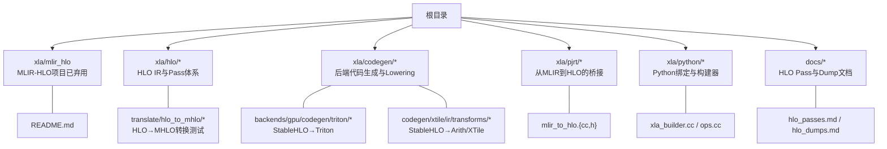
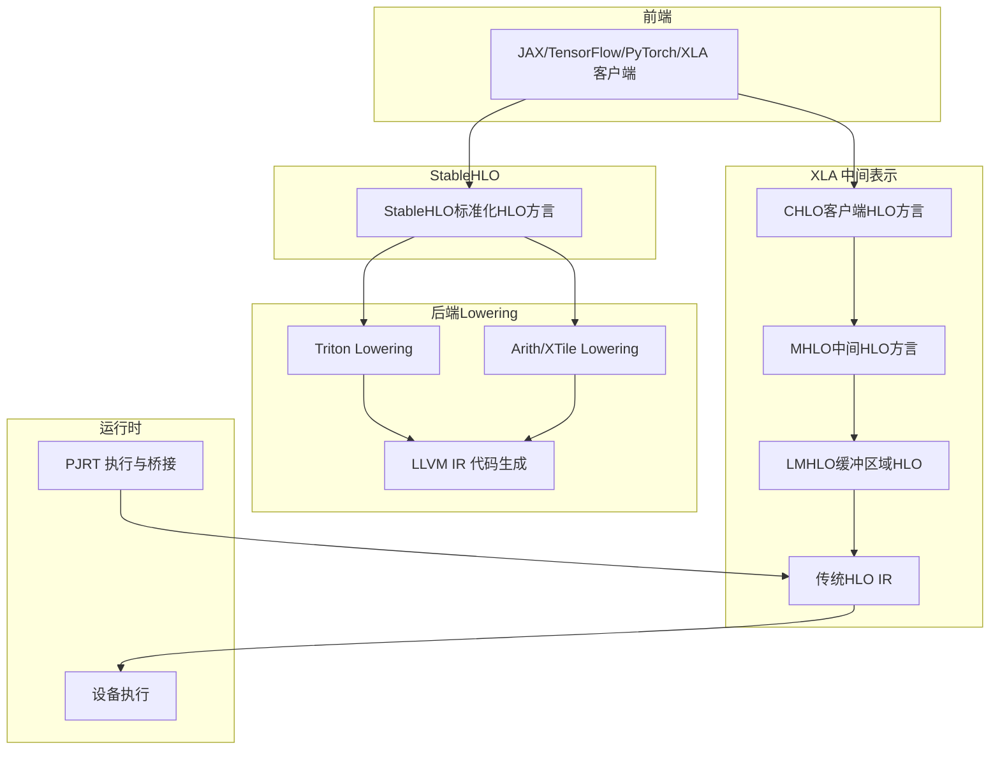
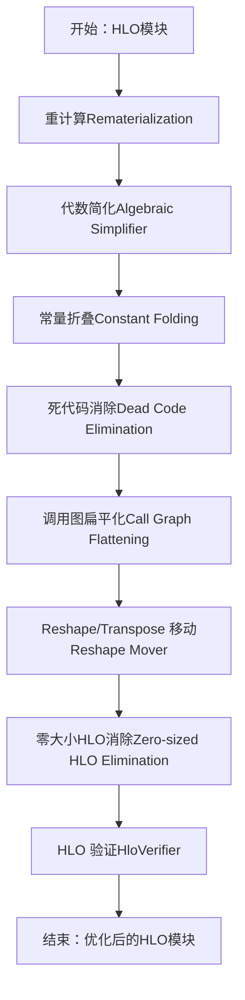
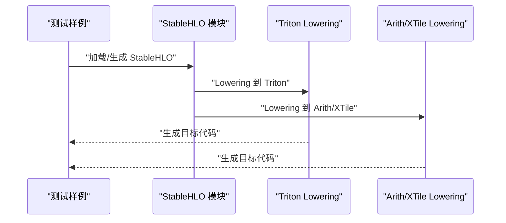
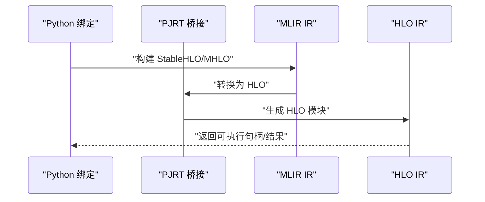
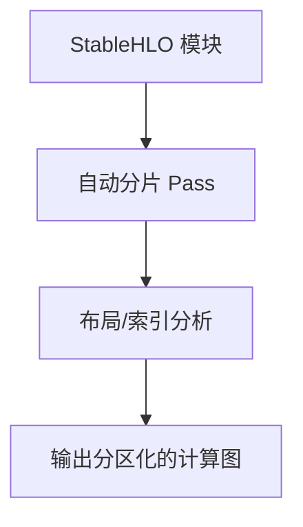
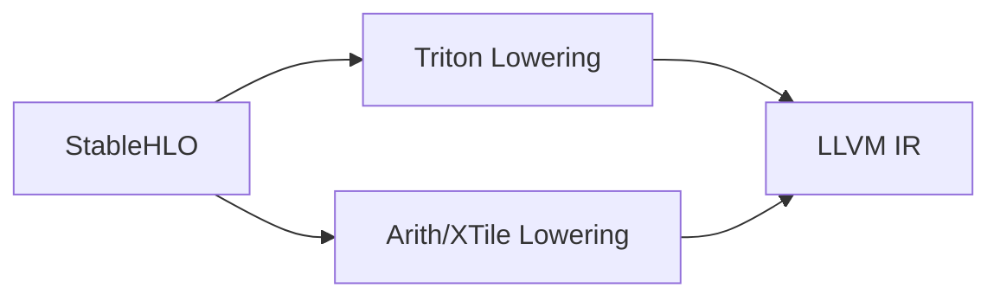
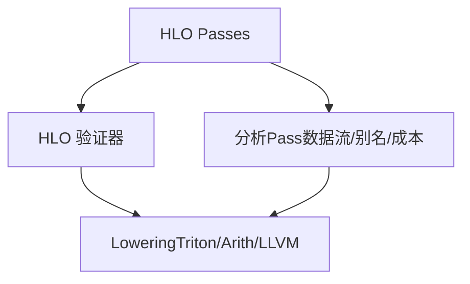
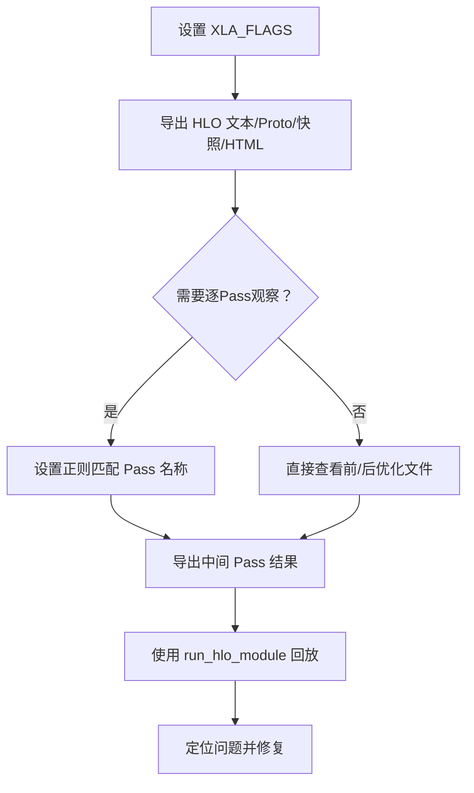

# HLO与MLIR

<cite>
**本文引用的文件**
- [README.md](file://README.md)
- [xla/mlir_hlo/README.md](file://xla/mlir_hlo/README.md)
- [docs/hlo_passes.md](file://docs/hlo_passes.md)
- [docs/hlo_dumps.md](file://docs/hlo_dumps.md)
- [xla/examples/axpy/stablehlo_axpy.mlir](file://xla/examples/axpy/stablehlo_axpy.mlir)
- [xla/hlo/translate/hlo_to_mhlo/tests/import_emit_stablehlo.hlo](file://xla/hlo/translate/hlo_to_mhlo/tests/import_emit_stablehlo.hlo)
- [xla/hlo/translate/hlo_to_mhlo/tests/import_bounded_dynamism_stablehlo.mlir](file://xla/hlo/translate/hlo_to_mhlo/tests/import_bounded_dynamism_stablehlo.mlir)
- [xla/backends/gpu/codegen/triton/transforms/stablehlo_lower_to_triton.cc](file://xla/backends/gpu/codegen/triton/transforms/stablehlo_lower_to_triton.cc)
- [xla/codegen/xtile/ir/transforms/lower_stablehlo_to_xtile.cc](file://xla/codegen/xtile/ir/transforms/lower_stablehlo_to_xtile.cc)
- [xla/codegen/xtile/ir/transforms/lower_stablehlo_to_arith.cc](file://xla/codegen/xtile/ir/transforms/lower_stablehlo_to_arith.cc)
- [xla/hlo/analysis/stablehlo_indexing_analysis.cc](file://xla/hlo/analysis/stablehlo_indexing_analysis.cc)
- [xla/hlo/experimental/auto_sharding/auto_sharding_stablehlo_pass.cc](file://xla/hlo/experimental/auto_sharding/auto_sharding_stablehlo_pass.cc)
- [xla/hlo/experimental/auto_sharding/stablehlo_utils.cc](file://xla/hlo/experimental/auto_sharding/stablehlo_utils.cc)
- [xla/pjrt/mlir_to_hlo.cc](file://xla/pjrt/mlir_to_hlo.cc)
- [xla/pjrt/mlir_to_hlo.h](file://xla/pjrt/mlir_to_hlo.h)
- [xla/python/xla_builder.cc](file://xla/python/xla_builder.cc)
- [xla/python/ops.cc](file://xla/python/ops.cc)
- [xla/client/client.cc](file://xla/client/client.cc)
- [xla/client/local_client.cc](file://xla/client/local_client.cc)
- [xla/service/gpu/transforms/cudnn_fused_conv_rewriter.h](file://xla/service/gpu/transforms/cudnn_fused_conv_rewriter.h)
- [xla/service/cpu/conv_canonicalization.h](file://xla/service/cpu/conv_canonicalization.h)
- [xla/service/hlo_cost_analysis.h](file://xla/service/hlo_cost_analysis.h)
- [xla/service/hlo_verifier.h](file://xla/service/hlo_verifier.h)
</cite>

## 目录
1. [引言](#引言)
2. [项目结构](#项目结构)
3. [核心组件](#核心组件)
4. [架构总览](#架构总览)
5. [详细组件分析](#详细组件分析)
6. [依赖关系分析](#依赖关系分析)
7. [性能考虑](#性能考虑)
8. [故障排查指南](#故障排查指南)
9. [结论](#结论)
10. [附录](#附录)

## 引言
本文件面向HLO与MLIR系统的使用者与贡献者，系统性阐述以下主题：
- HLO（高层优化器）指令集与XLA编译管线中的角色
- MLIR集成架构：CHLO、MHLO、LMHLO与StableHLO的关系与用途
- HLO到MLIR的转换流程与StableHLO规范要点
- 计算图构建、优化与验证机制
- HLO Pass管道、变换规则与性能优化策略
- 调试工具与可视化方法（含HLO转储、图渲染、运行回放）

本文件严格基于仓库内现有文档与源码路径进行归纳总结，并通过图示帮助读者建立从高层概念到代码实现的映射。

## 项目结构
XLA是一个多后端机器学习编译器，围绕HLO IR组织优化与代码生成；同时在MLIR生态中通过CHLO/MHLO/LMHLO与StableHLO推进标准化与可移植性。下图给出与本文相关的核心目录与文件的概览：

图表来源
- [xla/mlir_hlo/README.md](file://xla/mlir_hlo/README.md#L1-L288)
- [docs/hlo_passes.md](file://docs/hlo_passes.md#L1-L231)
- [docs/hlo_dumps.md](file://docs/hlo_dumps.md#L1-L261)
- [xla/pjrt/mlir_to_hlo.cc](file://xla/pjrt/mlir_to_hlo.cc)
- [xla/pjrt/mlir_to_hlo.h](file://xla/pjrt/mlir_to_hlo.h)
- [xla/codegen/xtile/ir/transforms/lower_stablehlo_to_xtile.cc](file://xla/codegen/xtile/ir/transforms/lower_stablehlo_to_xtile.cc)
- [xla/codegen/xtile/ir/transforms/lower_stablehlo_to_arith.cc](file://xla/codegen/xtile/ir/transforms/lower_stablehlo_to_arith.cc)
- [xla/backends/gpu/codegen/triton/transforms/stablehlo_lower_to_triton.cc](file://xla/backends/gpu/codegen/triton/transforms/stablehlo_lower_to_triton.cc)

章节来源
- [README.md](file://README.md#L1-L50)
- [xla/mlir_hlo/README.md](file://xla/mlir_hlo/README.md#L1-L288)

## 核心组件
- HLO IR与Pass体系：负责形状与语义层面的优化与变换，提供数百个Pass，覆盖代数简化、常量折叠、死代码消除、重计算以节省内存、调用图扁平化、零大小张量处理等。
- CHLO/MHLO/LMHLO：面向前端（CHLO）、中间优化（MHLO）、缓冲区分配后（LMHLO）的三段式IR，支撑跨平台与实验性特性。
- StableHLO：面向标准化与可移植性的HLO方言，作为MHLO的替代或补充，广泛用于与外部工具链交互。
- 后端Lowering与代码生成：将StableHLO/MLIR IR降低到目标后端（如Triton、Arith/XTile、LLVM等）。
- PJRT与Python绑定：提供从MLIR到HLO的桥接以及Python侧的构建器与操作接口。

章节来源
- [docs/hlo_passes.md](file://docs/hlo_passes.md#L1-L231)
- [xla/mlir_hlo/README.md](file://xla/mlir_hlo/README.md#L106-L244)
- [xla/pjrt/mlir_to_hlo.cc](file://xla/pjrt/mlir_to_hlo.cc)
- [xla/pjrt/mlir_to_hlo.h](file://xla/pjrt/mlir_to_hlo.h)
- [xla/python/xla_builder.cc](file://xla/python/xla_builder.cc)
- [xla/python/ops.cc](file://xla/python/ops.cc)

## 架构总览
下图展示了从前端到后端的整体编译与执行路径，重点标注了HLO与MLIR的交汇点及StableHLO的角色。

图表来源
- [xla/mlir_hlo/README.md](file://xla/mlir_hlo/README.md#L106-L244)
- [xla/backends/gpu/codegen/triton/transforms/stablehlo_lower_to_triton.cc](file://xla/backends/gpu/codegen/triton/transforms/stablehlo_lower_to_triton.cc)
- [xla/codegen/xtile/ir/transforms/lower_stablehlo_to_arith.cc](file://xla/codegen/xtile/ir/transforms/lower_stablehlo_to_arith.cc)
- [xla/codegen/xtile/ir/transforms/lower_stablehlo_to_xtile.cc](file://xla/codegen/xtile/ir/transforms/lower_stablehlo_to_xtile.cc)
- [xla/pjrt/mlir_to_hlo.cc](file://xla/pjrt/mlir_to_hlo.cc)

## 详细组件分析

### HLO Pass管道与变换规则
- 硬件无关的通用Pass包括：代数简化、常量折叠、死代码消除、调用图扁平化、reshape/transpose移动、零大小HLO消除、重计算以节省内存等。
- 平台特定Pass包括：TPU的空间划分与bfloat16处理、GPU的cuDNN融合重写、CPU的卷积规范化与并行化等。
- 分析类Pass包括数据流分析、别名分析、计算成本分析、HLO验证等，用于保证变换正确性与性能评估。

图表来源
- [docs/hlo_passes.md](file://docs/hlo_passes.md#L48-L231)

章节来源
- [docs/hlo_passes.md](file://docs/hlo_passes.md#L1-L231)

### StableHLO规范与转换
- StableHLO是标准化的HLO方言，强调稳定、可移植与可验证性，适合跨工具链交换与长期维护。
- 在仓库中可见StableHLO与MHLO之间的转换测试样例，以及StableHLO向后端Lowering的实现（如Triton、Arith/XTile）。
- 示例：一个简单的StableHLO函数定义展示了广播、乘法与加法的基本组合。

图表来源
- [xla/examples/axpy/stablehlo_axpy.mlir](file://xla/examples/axpy/stablehlo_axpy.mlir#L1-L10)
- [xla/backends/gpu/codegen/triton/transforms/stablehlo_lower_to_triton.cc](file://xla/backends/gpu/codegen/triton/transforms/stablehlo_lower_to_triton.cc)
- [xla/codegen/xtile/ir/transforms/lower_stablehlo_to_xtile.cc](file://xla/codegen/xtile/ir/transforms/lower_stablehlo_to_xtile.cc)
- [xla/codegen/xtile/ir/transforms/lower_stablehlo_to_arith.cc](file://xla/codegen/xtile/ir/transforms/lower_stablehlo_to_arith.cc)

章节来源
- [xla/examples/axpy/stablehlo_axpy.mlir](file://xla/examples/axpy/stablehlo_axpy.mlir#L1-L10)
- [xla/hlo/translate/hlo_to_mhlo/tests/import_bounded_dynamism_stablehlo.mlir](file://xla/hlo/translate/hlo_to_mhlo/tests/import_bounded_dynamism_stablehlo.mlir)
- [xla/hlo/translate/hlo_to_mhlo/tests/import_emit_stablehlo.hlo](file://xla/hlo/translate/hlo_to_mhlo/tests/import_emit_stablehlo.hlo)

### HLO到MLIR的转换与PJRT桥接
- MLIR-HLO项目已弃用，但其理念与MHLO/CHLO/LMHLO仍指导当前XLA的MLIR集成。
- PJRT提供了从MLIR到HLO的桥接能力，便于在MLIR侧完成IR构造与Lowering后，回到HLO执行路径。
- Python绑定提供XlaBuilder与ops接口，支持在用户侧直接构建HLO/MLIR IR。

图表来源
- [xla/pjrt/mlir_to_hlo.cc](file://xla/pjrt/mlir_to_hlo.cc)
- [xla/pjrt/mlir_to_hlo.h](file://xla/pjrt/mlir_to_hlo.h)
- [xla/python/xla_builder.cc](file://xla/python/xla_builder.cc)
- [xla/python/ops.cc](file://xla/python/ops.cc)

章节来源
- [xla/mlir_hlo/README.md](file://xla/mlir_hlo/README.md#L1-L288)
- [xla/pjrt/mlir_to_hlo.cc](file://xla/pjrt/mlir_to_hlo.cc)
- [xla/pjrt/mlir_to_hlo.h](file://xla/pjrt/mlir_to_hlo.h)
- [xla/python/xla_builder.cc](file://xla/python/xla_builder.cc)
- [xla/python/ops.cc](file://xla/python/ops.cc)

### 自动分片与StableHLO分析
- 自动分片Pass与StableHLO工具集用于大规模模型的SPMD分区与内存优化。
- 索引分析与工具函数辅助理解StableHLO的布局与访问模式，为优化提供依据。

图表来源
- [xla/hlo/experimental/auto_sharding/auto_sharding_stablehlo_pass.cc](file://xla/hlo/experimental/auto_sharding/auto_sharding_stablehlo_pass.cc)
- [xla/hlo/experimental/auto_sharding/stablehlo_utils.cc](file://xla/hlo/experimental/auto_sharding/stablehlo_utils.cc)
- [xla/hlo/analysis/stablehlo_indexing_analysis.cc](file://xla/hlo/analysis/stablehlo_indexing_analysis.cc)

章节来源
- [xla/hlo/experimental/auto_sharding/auto_sharding_stablehlo_pass.cc](file://xla/hlo/experimental/auto_sharding/auto_sharding_stablehlo_pass.cc)
- [xla/hlo/experimental/auto_sharding/stablehlo_utils.cc](file://xla/hlo/experimental/auto_sharding/stablehlo_utils.cc)
- [xla/hlo/analysis/stablehlo_indexing_analysis.cc](file://xla/hlo/analysis/stablehlo_indexing_analysis.cc)

### 平台特定优化与后端Lowering
- GPU：利用cuDNN融合重写提升卷积与归一化的效率。
- CPU：卷积规范化与任务并行化以适配多核执行。
- 后端Lowering：StableHLO→Triton、Arith/XTile等，最终生成LLVM IR并交由设备执行。

图表来源
- [xla/service/gpu/transforms/cudnn_fused_conv_rewriter.h](file://xla/service/gpu/transforms/cudnn_fused_conv_rewriter.h)
- [xla/service/cpu/conv_canonicalization.h](file://xla/service/cpu/conv_canonicalization.h)
- [xla/backends/gpu/codegen/triton/transforms/stablehlo_lower_to_triton.cc](file://xla/backends/gpu/codegen/triton/transforms/stablehlo_lower_to_triton.cc)
- [xla/codegen/xtile/ir/transforms/lower_stablehlo_to_xtile.cc](file://xla/codegen/xtile/ir/transforms/lower_stablehlo_to_xtile.cc)
- [xla/codegen/xtile/ir/transforms/lower_stablehlo_to_arith.cc](file://xla/codegen/xtile/ir/transforms/lower_stablehlo_to_arith.cc)

章节来源
- [xla/service/gpu/transforms/cudnn_fused_conv_rewriter.h](file://xla/service/gpu/transforms/cudnn_fused_conv_rewriter.h)
- [xla/service/cpu/conv_canonicalization.h](file://xla/service/cpu/conv_canonicalization.h)

## 依赖关系分析
- 组件耦合与内聚：HLO Pass体系与后端Lowering相对独立，通过稳定的IR（HLO/MLIR/StableHLO）耦合；分析Pass与验证器提供前置约束，确保变换安全。
- 外部依赖与集成点：MLIR生态（Linalg/Vector/GPU等）与第三方库（cuDNN、Triton）参与Lowering与代码生成。
- 可能的循环依赖：以IR为中心的单向转换链避免了循环依赖风险。

图表来源
- [docs/hlo_passes.md](file://docs/hlo_passes.md#L196-L231)
- [xla/service/hlo_verifier.h](file://xla/service/hlo_verifier.h)
- [xla/service/hlo_cost_analysis.h](file://xla/service/hlo_cost_analysis.h)

章节来源
- [docs/hlo_passes.md](file://docs/hlo_passes.md#L196-L231)
- [xla/service/hlo_verifier.h](file://xla/service/hlo_verifier.h)
- [xla/service/hlo_cost_analysis.h](file://xla/service/hlo_cost_analysis.h)

## 性能考虑
- 重计算换空间：通过选择性重计算减少长存活值带来的内存压力，适用于大模型训练。
- 代数简化与常量折叠：在编译期消除冗余计算，降低运行时开销。
- 死代码消除与调用图扁平化：减少无用计算与动态调度开销。
- 平台特定优化：GPU的cuDNN融合、CPU的卷积规范化与并行化，提升吞吐与带宽利用率。
- StableHLO Lowering：统一的标准化IR有助于跨后端复用优化与Lowering策略。

章节来源
- [docs/hlo_passes.md](file://docs/hlo_passes.md#L48-L195)

## 故障排查指南
- 使用HLO转储定位问题：通过环境变量或JAX编程接口导出文本/HLO Proto/HLO快照/HTML图等，结合正则筛选特定Pass阶段。
- 运行回放：对转储的HLO模块使用指定后端（CPU/GPU）进行回放，验证与复现问题。
- 常见步骤：
  - 设置转储目录与格式
  - 指定匹配特定Pass的正则表达式
  - 使用run_hlo_module进行回放
  - 结合HLO验证器检查不变量

图表来源
- [docs/hlo_dumps.md](file://docs/hlo_dumps.md#L14-L261)

章节来源
- [docs/hlo_dumps.md](file://docs/hlo_dumps.md#L1-L261)

## 结论
- HLO作为XLA的中心IR，提供了强大的优化与验证能力；MLIR生态通过CHLO/MHLO/LMHLO与StableHLO推动了标准化与可移植性。
- 通过稳定的IR与清晰的Lowering链路，XLA实现了从前端到后端的高效编译与执行。
- 实践中建议结合HLO转储与回放、Pass正则筛选、平台特定优化与StableHLO Lowering策略，系统性地定位与解决性能与正确性问题。

## 附录
- 快速参考
  - HLO Pass与分析：参见“HLO Passes”文档
  - HLO转储与回放：参见“Dump HLO Computations”文档
  - MLIR-HLO项目说明：参见xla/mlir_hlo/README.md
  - Python构建器与操作：参见xla/python/xla_builder.cc与xla/python/ops.cc
  - PJRT桥接：参见xla/pjrt/mlir_to_hlo.{cc,h}

章节来源
- [docs/hlo_passes.md](file://docs/hlo_passes.md#L1-L231)
- [docs/hlo_dumps.md](file://docs/hlo_dumps.md#L1-L261)
- [xla/mlir_hlo/README.md](file://xla/mlir_hlo/README.md#L1-L288)
- [xla/python/xla_builder.cc](file://xla/python/xla_builder.cc)
- [xla/python/ops.cc](file://xla/python/ops.cc)
- [xla/pjrt/mlir_to_hlo.cc](file://xla/pjrt/mlir_to_hlo.cc)
- [xla/pjrt/mlir_to_hlo.h](file://xla/pjrt/mlir_to_hlo.h)