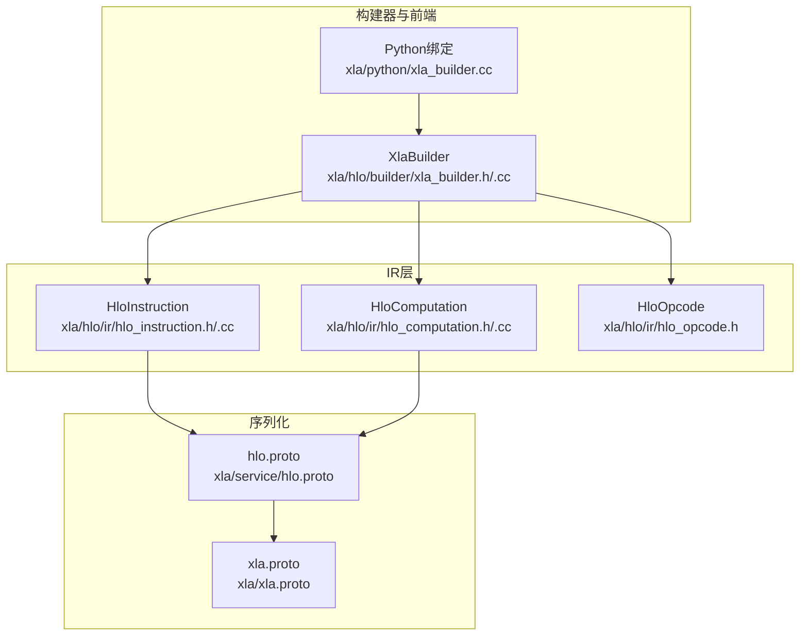
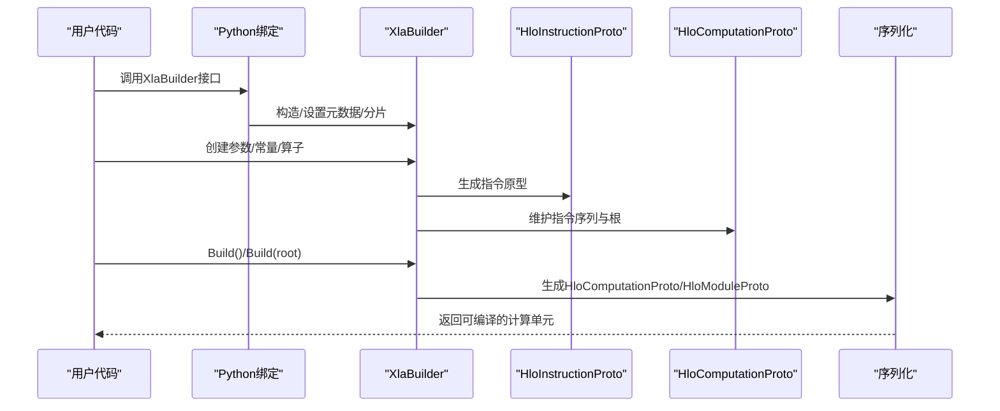
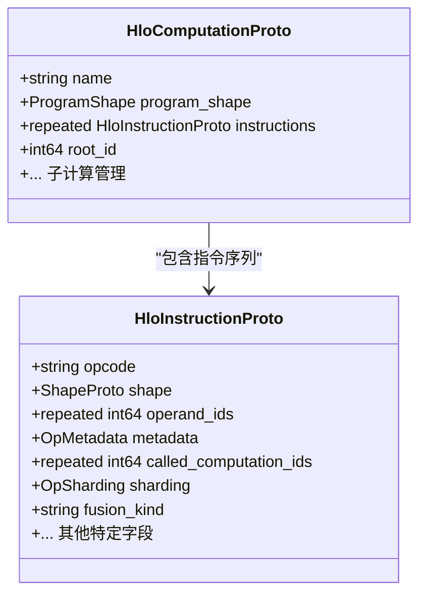
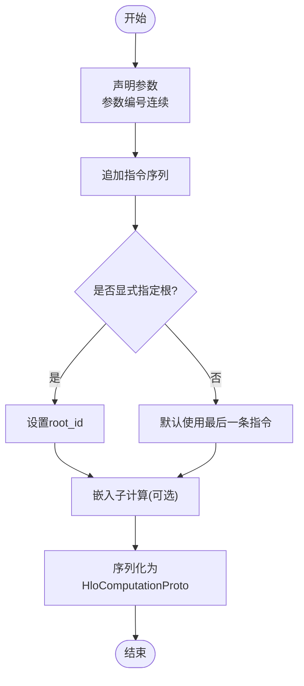
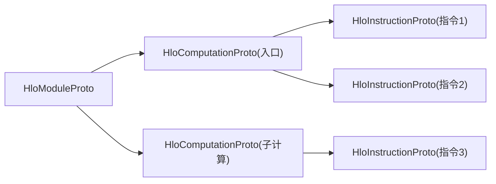
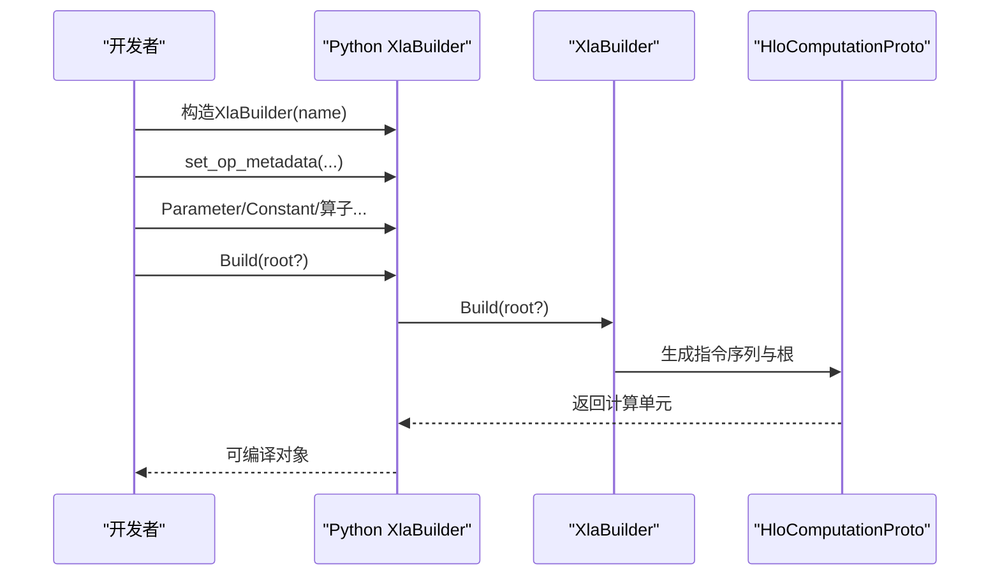
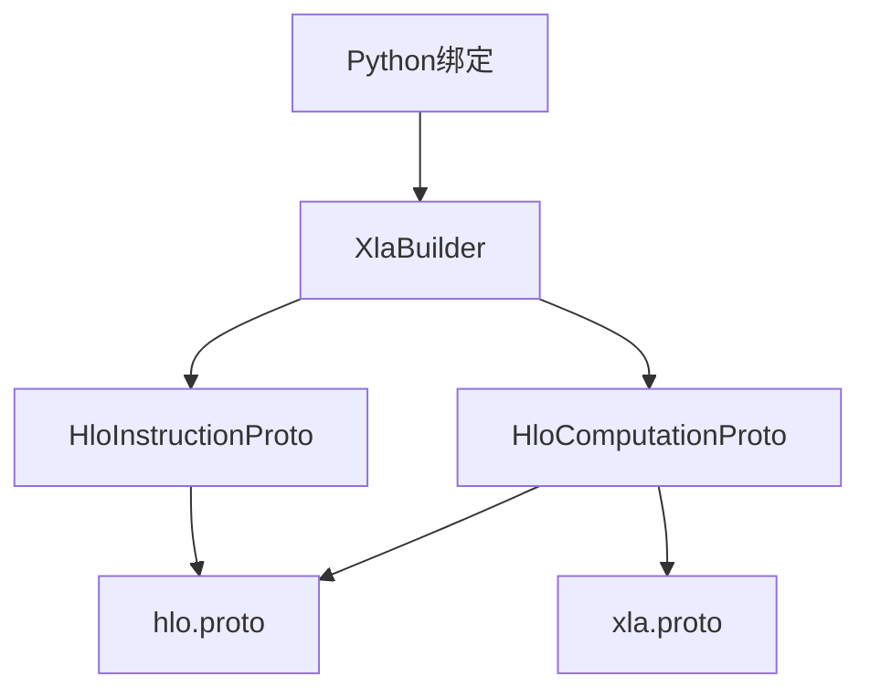

# HLO中间表示

<cite>
**本文引用的文件**
- [xla/hlo/builder/xla_builder.h](file://xla/hlo/builder/xla_builder.h)
- [xla/hlo/builder/xla_builder.cc](file://xla/hlo/builder/xla_builder.cc)
- [xla/hlo/ir/hlo_opcode.h](file://xla/hlo/ir/hlo_opcode.h)
- [xla/hlo/ir/hlo_computation.h](file://xla/hlo/ir/hlo_computation.h)
- [xla/hlo/ir/hlo_computation.cc](file://xla/hlo/ir/hlo_computation.cc)
- [xla/hlo/ir/hlo_instruction.h](file://xla/hlo/ir/hlo_instruction.h)
- [xla/hlo/ir/hlo_instruction.cc](file://xla/hlo/ir/hlo_instruction.cc)
- [xla/service/hlo.proto](file://xla/service/hlo.proto)
- [xla/xla.proto](file://xla/xla.proto)
- [xla/python/xla_builder.cc](file://xla/python/xla_builder.cc)
</cite>

## 目录
1. [引言](#引言)
2. [项目结构](#项目结构)
3. [核心组件](#核心组件)
4. [架构总览](#架构总览)
5. [详细组件分析](#详细组件分析)
6. [依赖分析](#依赖分析)
7. [性能考虑](#性能考虑)
8. [故障排查指南](#故障排查指南)
9. [结论](#结论)
10. [附录](#附录)

## 引言
本文件系统性阐述XLA的HLO（High-Level Optimizer）中间表示体系，聚焦以下目标：
- 深入解释HLO指令集架构：HloComputation、HloInstruction、HloModule的核心概念与职责边界
- 详述HLO操作码类型、数据流模型与控制依赖关系
- 记录HLO构建器API的使用方法：参数定义、指令创建、计算图构建
- 提供使用XlaBuilder构建复杂计算图的实践路径
- 解释HLO序列化与反序列化机制及与Protobuf的映射关系
- 包含HLO验证规则、形状推断与调试工具的使用指南

## 项目结构
围绕HLO中间表示的关键代码位于以下模块：
- 构建器与Python绑定：xla/hlo/builder、xla/python/_xla_builder.pyi、xla/python/xla_builder.cc
- IR层：xla/hlo/ir（HloInstruction、HloComputation、HloModule等）
- 序列化协议：xla/service/hlo.proto、xla/xla.proto

图表来源
- [xla/hlo/builder/xla_builder.h](file://xla/hlo/builder/xla_builder.h#L287-L468)
- [xla/hlo/builder/xla_builder.cc](file://xla/hlo/builder/xla_builder.cc#L609-L612)
- [xla/hlo/ir/hlo_instruction.h](file://xla/hlo/ir/hlo_instruction.h)
- [xla/hlo/ir/hlo_computation.h](file://xla/hlo/ir/hlo_computation.h)
- [xla/hlo/ir/hlo_opcode.h](file://xla/hlo/ir/hlo_opcode.h)
- [xla/service/hlo.proto](file://xla/service/hlo.proto)
- [xla/xla.proto](file://xla/xla.proto#L16-L28)

章节来源
- [xla/hlo/builder/xla_builder.h](file://xla/hlo/builder/xla_builder.h#L287-L468)
- [xla/hlo/builder/xla_builder.cc](file://xla/hlo/builder/xla_builder.cc#L609-L612)
- [xla/hlo/ir/hlo_instruction.h](file://xla/hlo/ir/hlo_instruction.h)
- [xla/hlo/ir/hlo_computation.h](file://xla/hlo/ir/hlo_computation.h)
- [xla/hlo/ir/hlo_opcode.h](file://xla/hlo/ir/hlo_opcode.h)
- [xla/service/hlo.proto](file://xla/service/hlo.proto)
- [xla/xla.proto](file://xla/xla.proto#L16-L28)

## 核心组件
- XlaBuilder：面向用户的构建器，负责参数声明、常量/算子节点创建、子计算嵌入、根节点选择与最终编译单元生成
- XlaOp：对已入图指令的轻量句柄，用于后续作为其他指令的输入
- HloInstruction/HloInstructionProto：单条指令的语义与形态描述，包含操作码、形状、元数据、调用的子计算等
- HloComputation/HloComputationProto：由多条指令组成的计算片段，包含参数列表、指令序列、根指令等
- HloModule/HloModuleProto：顶层容器，包含多个计算（如入口计算、嵌入子计算），并可携带序列化所需的完整上下文
- Protobuf映射：HloInstructionProto/HloComputationProto/HloModuleProto与hlo.proto严格对应；xla.proto承载上层编译环境等扩展

章节来源
- [xla/hlo/builder/xla_builder.h](file://xla/hlo/builder/xla_builder.h#L166-L224)
- [xla/hlo/builder/xla_builder.h](file://xla/hlo/builder/xla_builder.h#L287-L468)
- [xla/hlo/ir/hlo_instruction.h](file://xla/hlo/ir/hlo_instruction.h)
- [xla/hlo/ir/hlo_computation.h](file://xla/hlo/ir/hlo_computation.h)
- [xla/service/hlo.proto](file://xla/service/hlo.proto)
- [xla/xla.proto](file://xla/xla.proto#L16-L28)

## 架构总览
下图展示了从构建器到IR再到序列化的端到端流程。

图表来源
- [xla/python/xla_builder.cc](file://xla/python/xla_builder.cc#L105-L160)
- [xla/hlo/builder/xla_builder.h](file://xla/hlo/builder/xla_builder.h#L418-L448)
- [xla/hlo/builder/xla_builder.cc](file://xla/hlo/builder/xla_builder.cc#L586-L589)
- [xla/service/hlo.proto](file://xla/service/hlo.proto)

章节来源
- [xla/python/xla_builder.cc](file://xla/python/xla_builder.cc#L105-L160)
- [xla/hlo/builder/xla_builder.h](file://xla/hlo/builder/xla_builder.h#L418-L448)
- [xla/hlo/builder/xla_builder.cc](file://xla/hlo/builder/xla_builder.cc#L586-L589)
- [xla/service/hlo.proto](file://xla/service/hlo.proto)

## 详细组件分析

### HloInstruction与HloInstructionProto
- 结构要点
  - 指令原型包含：操作码(opcode)、形状(shape)、操作数引用(operand_ids)、元数据(metadata)、调用的子计算ID(called_computation_ids)、分片信息(sharding)等
  - 支持异步通信类指令（如AsyncStart/Done、AllGather/AllReduce、Send/Recv等）与域(domain)、分区ID(partition_id)等特殊指令
- 数据流与控制依赖
  - 操作数通过operand_ids建立直接依赖；控制依赖通过令牌(token)与异步流水线实现
  - 形状由输入形状与算子语义共同决定，遵循形状推断规则
- 典型字段映射
  - 形状：ShapeProto → Shape
  - 元数据：OpMetadata → 源文件/行号等
  - 分片：OpSharding → 网格/轴级分片策略

图表来源
- [xla/service/hlo.proto](file://xla/service/hlo.proto)
- [xla/hlo/ir/hlo_instruction.h](file://xla/hlo/ir/hlo_instruction.h)
- [xla/hlo/ir/hlo_computation.h](file://xla/hlo/ir/hlo_computation.h)

章节来源
- [xla/hlo/ir/hlo_instruction.h](file://xla/hlo/ir/hlo_instruction.h)
- [xla/hlo/ir/hlo_instruction.cc](file://xla/hlo/ir/hlo_instruction.cc)
- [xla/service/hlo.proto](file://xla/service/hlo.proto)

### HloComputation与HloComputationProto
- 结构要点
  - 表达一个计算片段，包含参数列表、指令序列、根指令、程序签名(ProgramShape)
  - 支持嵌入子计算（called_computation_ids），形成嵌套计算图
- 参数与根
  - 参数按连续编号存储，名称与形状在ProgramShape中维护
  - 根指令默认为最后一条指令，也可显式指定
- 嵌入子计算
  - 通过AddSubComputation或子构建器BuildSubComputation嵌入，避免重复拷贝

图表来源
- [xla/hlo/builder/xla_builder.h](file://xla/hlo/builder/xla_builder.h#L418-L448)
- [xla/hlo/builder/xla_builder.cc](file://xla/hlo/builder/xla_builder.cc#L586-L589)
- [xla/hlo/ir/hlo_computation.h](file://xla/hlo/ir/hlo_computation.h)

章节来源
- [xla/hlo/builder/xla_builder.h](file://xla/hlo/builder/xla_builder.h#L418-L448)
- [xla/hlo/builder/xla_builder.cc](file://xla/hlo/builder/xla_builder.cc#L586-L589)
- [xla/hlo/ir/hlo_computation.h](file://xla/hlo/ir/hlo_computation.h)
- [xla/hlo/ir/hlo_computation.cc](file://xla/hlo/ir/hlo_computation.cc)

### HloModule与序列化
- HloModule作为顶层容器，聚合多个HloComputation（入口计算、嵌入子计算等）
- 序列化采用hlo.proto中的消息体，xla.proto承载编译环境等扩展
- 反序列化时，依据消息体恢复指令、计算与模块的层次关系

图表来源
- [xla/service/hlo.proto](file://xla/service/hlo.proto)
- [xla/xla.proto](file://xla/xla.proto#L16-L28)

章节来源
- [xla/service/hlo.proto](file://xla/service/hlo.proto)
- [xla/xla.proto](file://xla/xla.proto#L16-L28)

### HLO操作码类型与数据流
- 操作码枚举与语义
  - 算术/逻辑/比较/位移
  - 控制流（While/Fusion/Call）
  - 通信/收集（AllReduce/AllGather/CollectivePermute/Send/Recv）
  - 形状变换（Reshape/Broadcast/Pad/Slice/Concat）
  - 卷积/点积/稀疏/动态卷积
  - 特殊（Domain/PartitionId/RngGetAndUpdateState）
- 数据流模型
  - 指令间通过操作数ID建立有向无环依赖
  - 形状推断确保输入输出一致
  - 异步通信通过令牌与流水线完成控制同步
- 控制依赖
  - 令牌(token)用于表达控制先后顺序
  - AsyncStart/Done、AllReduceStart/Done、Send/Recv等形成异步阶段

章节来源
- [xla/hlo/ir/hlo_opcode.h](file://xla/hlo/ir/hlo_opcode.h)
- [xla/hlo/builder/xla_builder.cc](file://xla/hlo/builder/xla_builder.cc#L130-L206)
- [xla/hlo/builder/xla_builder.cc](file://xla/hlo/builder/xla_builder.cc#L344-L409)

### HLO构建器API与计算图构建
- 参数与常量
  - Parameter：声明输入参数（编号、形状、名称、复制标记）
  - Constant/ConstantLiteral：声明编译期常量
- 形状变换与切片
  - Reshape/DynamicReshape、Broadcast/BroadcastInDim、Pad、Slice/DynamicSlice、ConcatInDim
- 算术与逻辑
  - Add/Sub/Mul/Div/Rem、Neg、Abs、And/Or/Xor/Not、ShiftLeft/ShiftRightArithmetic/ShiftRightLogical
- 卷积与点积
  - Conv/ConvGeneral/ConvGeneralDilated、Dot/DotGeneral、RaggedAllToAll、RaggedDot、ScaledDot
- 动态与导出
  - MhloDynamicBroadcastInDim/MhloDynamicReshape用于导出到MHLO/StableHLO
- 异步与通信
  - AsyncStart/AsyncUpdate/AsyncDone、AllGatherStart/AllGatherDone、AllReduceStart/AllReduceDone、CollectivePermuteStart/Done、Send/Recv/SendDone/RecvDone
- 子计算与别名
  - CreateSubBuilder/BuildSubComputation、SetUpAlias/AddBufferDonor
- 根与构建
  - Build()/Build(root)/Build(entry_id)、BuildAndNoteError
- 形状与元数据
  - GetShape/GetProgramShape、SetOpMetadata/SetOneShotOpMetadata/ClearOpMetadata、SetSharding/ClearSharding、SetFrontendAttributes/ClearFrontendAttributes

章节来源
- [xla/hlo/builder/xla_builder.h](file://xla/hlo/builder/xla_builder.h#L287-L468)
- [xla/hlo/builder/xla_builder.cc](file://xla/hlo/builder/xla_builder.cc#L603-L800)

### 使用XlaBuilder构建复杂计算图的实践路径
- 步骤
  - 初始化XlaBuilder并设置元数据/分片/前端属性
  - 声明参数(Parameter)，必要时设置复制标记
  - 连续追加算子指令（形状变换、算术/逻辑、卷积/点积、动态形状）
  - 对需要复用的子图使用子构建器CreateSubBuilder/BuildSubComputation嵌入
  - 显式设置根节点（若非最后一条指令），或默认使用最后一条
  - Build()生成可编译的计算单元；错误处理可通过die_immediately_on_error或BuildAndNoteError
- Python绑定
  - Python侧通过xla_builder.cc提供的类封装，暴露Build、GetShape、GetProgramShape、is_constant、set_op_metadata、set_sharding、clear_sharding、set_frontend_attributes、clear_frontend_attributes、setup_alias等常用接口

图表来源
- [xla/python/xla_builder.cc](file://xla/python/xla_builder.cc#L105-L160)
- [xla/hlo/builder/xla_builder.h](file://xla/hlo/builder/xla_builder.h#L418-L448)

章节来源
- [xla/python/xla_builder.cc](file://xla/python/xla_builder.cc#L105-L160)
- [xla/hlo/builder/xla_builder.h](file://xla/hlo/builder/xla_builder.h#L418-L448)

## 依赖分析
- 组件耦合
  - XlaBuilder与HloInstructionProto/HloComputationProto强耦合，负责指令构造与序列化
  - HloInstructionProto依赖hlo.proto的消息定义；HloComputationProto/HloModuleProto依赖hlo.proto与xla.proto
- 外部依赖
  - Protobuf消息定义与序列化/反序列化
  - Python绑定通过nanobind桥接C++与Python

图表来源
- [xla/hlo/builder/xla_builder.h](file://xla/hlo/builder/xla_builder.h#L418-L448)
- [xla/service/hlo.proto](file://xla/service/hlo.proto)
- [xla/xla.proto](file://xla/xla.proto#L16-L28)
- [xla/python/xla_builder.cc](file://xla/python/xla_builder.cc#L105-L160)

章节来源
- [xla/hlo/builder/xla_builder.h](file://xla/hlo/builder/xla_builder.h#L418-L448)
- [xla/service/hlo.proto](file://xla/service/hlo.proto)
- [xla/xla.proto](file://xla/xla.proto#L16-L28)
- [xla/python/xla_builder.cc](file://xla/python/xla_builder.cc#L105-L160)

## 性能考虑
- 形状推断与静态形状
  - 静态形状可减少运行时检查开销；动态形状需配合运行时校验策略
- 异步通信
  - 合理使用AsyncStart/Done、AllReduceStart/Done、AllGatherStart/Done等可提升并行度，但需注意令牌与同步
- 分片策略
  - OpSharding的合理配置可降低带宽压力；NormalizeAndAssignSharing保证分片合法性
- 子计算内联与去重
  - 通过子构建器避免重复拷贝；Pass层可进行子计算去重与融合

## 故障排查指南
- 错误捕获与延迟报告
  - 默认延迟到Build()时统一报告错误；可通过set_die_immediately_on_error立即失败
  - ReportError/ReportErrorOrReturn用于在API链路中传播错误
- 形状一致性
  - GetShape/GetOperandShapes用于快速定位形状不匹配问题
  - GetProgramShape可用于检查参数连续性与名称/形状
- 调试与可视化
  - OpToString/ToStringHelper可打印指令树，辅助定位问题
  - 设置FrontendAttributes与OpMetadata便于溯源
- 常见问题
  - 参数编号不连续：检查Parameter声明与ProgramShape参数列表
  - 异步通信未配令牌：确认AsyncStart/Done、AllReduce/AllGather、Send/Recv配对
  - 分片非法：使用NormalizeAndAssignSharing前先校验分片维度与设备网格

章节来源
- [xla/hlo/builder/xla_builder.cc](file://xla/hlo/builder/xla_builder.cc#L614-L640)
- [xla/hlo/builder/xla_builder.h](file://xla/hlo/builder/xla_builder.h#L468-L518)
- [xla/hlo/builder/xla_builder.cc](file://xla/hlo/builder/xla_builder.cc#L571-L607)

## 结论
HLO中间表示以XlaBuilder为核心入口，通过HloInstruction/HloComputation/HloModule三级抽象，实现了从高层算子到可编译IR的完整映射。借助Protobuf序列化与Python绑定，开发者可以高效构建复杂计算图，并通过形状推断、异步通信与分片策略获得良好的性能与可维护性。建议在实践中优先使用子构建器组织子图、明确根节点、合理设置元数据与分片，并结合调试工具快速定位问题。

## 附录
- 关键API速查
  - 构建与查询：Build/Build(root)/Build(entry_id)、GetShape/GetProgramShape、IsConstant
  - 元数据与分片：SetOpMetadata/SetOneShotOpMetadata/ClearOpMetadata、SetSharding/ClearSharding、SetFrontendAttributes/ClearFrontendAttributes
  - 子计算与别名：CreateSubBuilder/BuildSubComputation、SetUpAlias/AddBufferDonor
  - 指令创建：Parameter/Constant、Reshape/Broadcast/Pad/Slice/Concat、算术/逻辑/比较、卷积/点积、动态形状、异步与通信、Domain/PartitionId等
- Protobuf映射
  - HloInstructionProto/HloComputationProto/HloModuleProto与hlo.proto严格对应
  - 编译环境与扩展信息由xla.proto承载