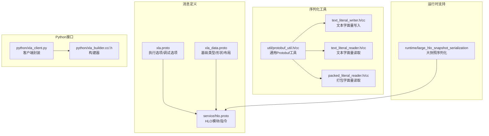
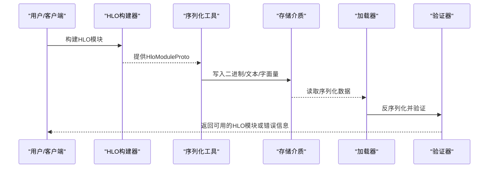
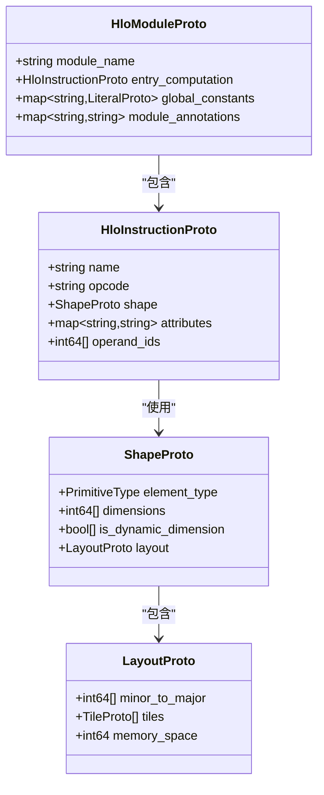
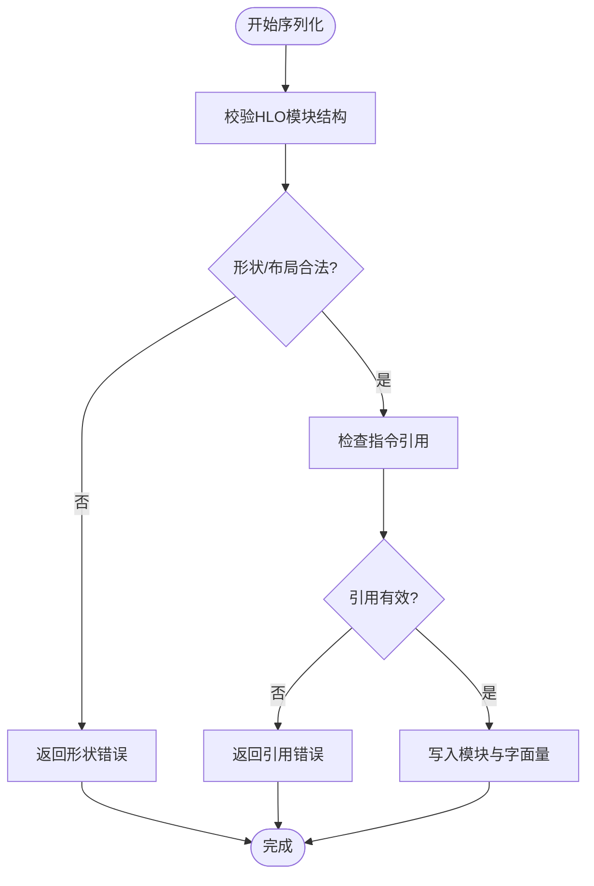
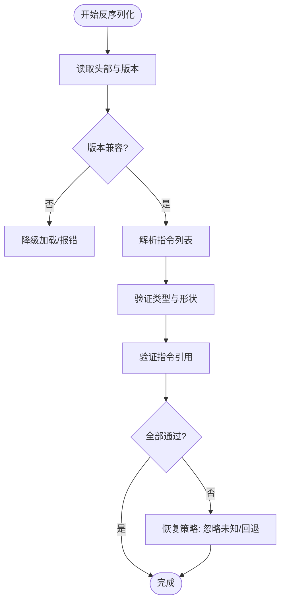
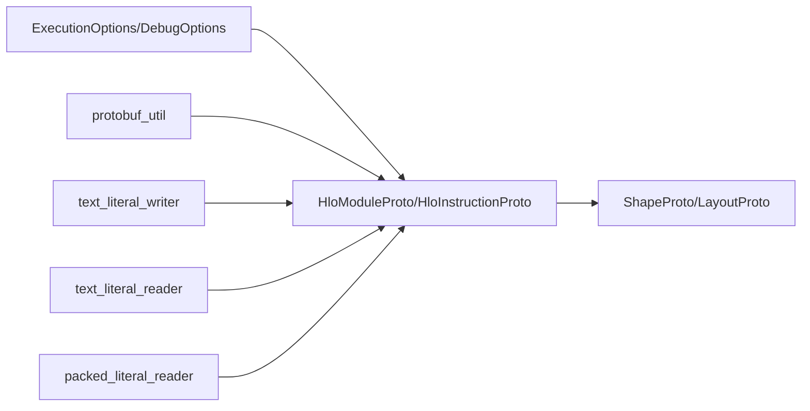

# HLO序列化与反序列化

<cite>
**本文引用的文件**
- [xla.proto](file://xla/xla.proto)
- [xla_data.proto](file://xla/xla_data.proto)
- [hlo.proto](file://xla/service/hlo.proto)
- [large_hlo_snapshot_serialization](file://xla/runtime/large_hlo_snapshot_serialization)
- [protobuf_util.h](file://xla/util/protobuf_util.h)
- [protobuf_util.cc](file://xla/util/protobuf_util.cc)
- [text_literal_writer.h](file://xla/text_literal_writer.h)
- [text_literal_writer.cc](file://xla/text_literal_writer.cc)
- [text_literal_reader.h](file://xla/text_literal_reader.h)
- [text_literal_reader.cc](file://xla/text_literal_reader.cc)
- [packed_literal_reader.h](file://xla/packed_literal_reader.h)
- [packed_literal_reader.cc](file://xla/packed_literal_reader.cc)
- [xla_client.py](file://xla/python/xla_client.py)
- [xla_builder.cc](file://xla/python/xla_builder.cc)
- [xla_builder.h](file://xla/python/xla_builder.h)
</cite>

## 目录
1. [简介](#简介)
2. [项目结构](#项目结构)
3. [核心组件](#核心组件)
4. [架构总览](#架构总览)
5. [详细组件分析](#详细组件分析)
6. [依赖关系分析](#依赖关系分析)
7. [性能考量](#性能考量)
8. [故障排查指南](#故障排查指南)
9. [结论](#结论)
10. [附录](#附录)

## 简介
本文件面向XLA的HLO（High-Level Optimizer）序列化与反序列化系统，系统性阐述从HLO到Protobuf的消息格式定义、字段映射与版本兼容策略；详细说明序列化过程中的数据完整性保障与错误处理机制；记录反序列化阶段的验证规则与恢复策略；提供可操作的代码示例路径，展示如何对HLO模块进行序列化与加载；解释跨版本兼容性处理与迁移策略；并总结性能优化技巧与大模块处理的最佳实践。

## 项目结构
围绕HLO序列化与反序列化的相关文件主要分布在以下位置：
- Protobuf消息定义：xla.proto、xla_data.proto、service/hlo.proto
- 序列化工具：util/protobuf_util.{h,cc}
- 文本与二进制字面量读写：text_literal_{writer,reader}.{h,cc}、packed_literal_reader.{h,cc}
- 大HLO快照序列化：runtime/large_hlo_snapshot_serialization
- Python接口：python/xla_client.py、python/xla_builder.{cc,h}

**图表来源**
- [xla.proto](file://xla/xla.proto#L1560-L1599)
- [xla_data.proto](file://xla/xla_data.proto#L22-L158)
- [hlo.proto](file://xla/service/hlo.proto)
- [protobuf_util.h](file://xla/util/protobuf_util.h)
- [protobuf_util.cc](file://xla/util/protobuf_util.cc)
- [text_literal_writer.h](file://xla/text_literal_writer.h)
- [text_literal_writer.cc](file://xla/text_literal_writer.cc)
- [text_literal_reader.h](file://xla/text_literal_reader.h)
- [text_literal_reader.cc](file://xla/text_literal_reader.cc)
- [packed_literal_reader.h](file://xla/packed_literal_reader.h)
- [packed_literal_reader.cc](file://xla/packed_literal_reader.cc)
- [large_hlo_snapshot_serialization](file://xla/runtime/large_hlo_snapshot_serialization)
- [xla_client.py](file://xla/python/xla_client.py)
- [xla_builder.cc](file://xla/python/xla_builder.cc)
- [xla_builder.h](file://xla/python/xla_builder.h)

**章节来源**
- [xla.proto](file://xla/xla.proto#L1560-L1599)
- [xla_data.proto](file://xla/xla_data.proto#L22-L158)
- [hlo.proto](file://xla/service/hlo.proto)

## 核心组件
- 执行与调试选项（ExecutionOptions/DebugOptions）
  - 定义了编译与运行期的控制开关、调试标志、性能参数等，贯穿序列化与反序列化流程。
  - 关键字段：seed、num_replicas、device_assignment、alias_passthrough_params等。
- 基础类型与形状（PrimitiveType/ShapeProto/LayoutProto）
  - 描述张量维度、动态形状、布局、内存空间等，是HLO模块序列化时的基础元数据。
- HLO模块与指令（HloModuleProto/HloInstructionProto）
  - HLO模块由指令序列构成，每个指令携带操作类型、输入输出形状、属性配置等。
- 序列化工具（Protobuf工具、文本/二进制字面量读写）
  - 提供通用的Protobuf读写封装、文本与二进制字面量的序列化/反序列化能力。
- 大HLO快照序列化
  - 针对超大HLO模块的分片/压缩/流式处理策略，避免单体序列化带来的内存压力。
- Python接口
  - 提供高层封装，便于在用户侧进行HLO模块的序列化与加载。

**章节来源**
- [xla.proto](file://xla/xla.proto#L1560-L1599)
- [xla_data.proto](file://xla/xla_data.proto#L28-L158)
- [hlo.proto](file://xla/service/hlo.proto)

## 架构总览
下图展示了从HLO模块到持久化存储的整体流程，以及反序列化时的验证与恢复路径。

**图表来源**
- [hlo.proto](file://xla/service/hlo.proto)
- [protobuf_util.h](file://xla/util/protobuf_util.h)
- [protobuf_util.cc](file://xla/util/protobuf_util.cc)
- [text_literal_writer.h](file://xla/text_literal_writer.h)
- [text_literal_writer.cc](file://xla/text_literal_writer.cc)
- [text_literal_reader.h](file://xla/text_literal_reader.h)
- [text_literal_reader.cc](file://xla/text_literal_reader.cc)
- [packed_literal_reader.h](file://xla/packed_literal_reader.h)
- [packed_literal_reader.cc](file://xla/packed_literal_reader.cc)

## 详细组件分析

### 组件A：HLO到Protobuf的消息格式与字段映射
- 模块级消息
  - HloModuleProto：包含模块名称、入口指令、全局常量、注解元数据等。
  - 与执行选项的关系：通过ExecutionOptions携带调试与性能参数，影响序列化后的可复现性与可移植性。
- 指令级消息
  - HloInstructionProto：描述具体算子，包含操作类型、形状、属性、输入引用等。
  - 形状与布局：通过ShapeProto/LayoutProto嵌入，确保序列化后能完整表达张量结构。
- 字段映射要点
  - 输入/输出形状：使用ShapeProto，支持静态/动态维度与布局信息。
  - 属性：以键值形式存储，遵循后端约定；复杂属性可能以Any或嵌套消息表示。
  - 元数据：OpMetadata用于调试与性能分析，包含源文件、行号、生成代码大小等。

**图表来源**
- [hlo.proto](file://xla/service/hlo.proto)
- [xla_data.proto](file://xla/xla_data.proto#L383-L426)
- [xla_data.proto](file://xla/xla_data.proto#L288-L368)

**章节来源**
- [hlo.proto](file://xla/service/hlo.proto)
- [xla_data.proto](file://xla/xla_data.proto#L28-L158)

### 组件B：序列化过程的数据完整性与错误处理
- 数据完整性保障
  - 形状一致性：序列化前校验ShapeProto与LayoutProto的合法性，确保minor_to_major与维度数量一致。
  - 指令引用：operand_ids需指向已存在的指令，避免悬挂引用。
  - 字面量编码：LiteralProto按元素类型选择对应字段，保证二进制/文本一致性。
- 错误处理策略
  - 校验失败：返回明确的错误码与上下文信息，定位到具体指令或形状。
  - 回滚与重试：在批量写入时采用事务式或临时文件策略，失败后清理中间产物。
  - 版本不匹配：检测消息版本字段，提示升级或降级策略。

**图表来源**
- [hlo.proto](file://xla/service/hlo.proto)
- [xla_data.proto](file://xla/xla_data.proto#L383-L426)

**章节来源**
- [hlo.proto](file://xla/service/hlo.proto)
- [xla_data.proto](file://xla/xla_data.proto#L28-L158)

### 组件C：反序列化验证规则与恢复策略
- 验证规则
  - 消息版本：检查序列化版本与当前解析器版本的兼容范围。
  - 结构完整性：确认HloModuleProto与HloInstructionProto的层级关系完整。
  - 类型一致性：LiteralProto的元素类型与ShapeProto匹配。
- 恢复策略
  - 降级加载：当新字段不可识别时，忽略未知字段并回退到兼容模式。
  - 渐进式验证：先加载指令列表，再逐条验证属性与引用，减少一次性内存压力。
  - 大模块分片：结合large_hlo_snapshot_serialization，按需加载与缓存。

**图表来源**
- [hlo.proto](file://xla/service/hlo.proto)
- [large_hlo_snapshot_serialization](file://xla/runtime/large_hlo_snapshot_serialization)

**章节来源**
- [hlo.proto](file://xla/service/hlo.proto)
- [large_hlo_snapshot_serialization](file://xla/runtime/large_hlo_snapshot_serialization)

### 组件D：序列化与加载的代码示例路径
- Python侧序列化与加载
  - 使用xla_client.py提供的接口进行模块序列化与加载，适合快速原型与脚本场景。
  - 示例路径参考：[xla_client.py](file://xla/python/xla_client.py)
- C++侧序列化与加载
  - 通过xla_builder.cc/.h构建HLO模块，结合util/protobuf_util.{h,cc}进行Protobuf读写。
  - 示例路径参考：
    - [xla_builder.cc](file://xla/python/xla_builder.cc)
    - [xla_builder.h](file://xla/python/xla_builder.h)
    - [protobuf_util.h](file://xla/util/protobuf_util.h)
    - [protobuf_util.cc](file://xla/util/protobuf_util.cc)
- 文本与二进制字面量
  - 文本写入：[text_literal_writer.h](file://xla/text_literal_writer.h)、[text_literal_writer.cc](file://xla/text_literal_writer.cc)
  - 文本读取：[text_literal_reader.h](file://xla/text_literal_reader.h)、[text_literal_reader.cc](file://xla/text_literal_reader.cc)
  - 打包读取：[packed_literal_reader.h](file://xla/packed_literal_reader.h)、[packed_literal_reader.cc](file://xla/packed_literal_reader.cc)

**章节来源**
- [xla_client.py](file://xla/python/xla_client.py)
- [xla_builder.cc](file://xla/python/xla_builder.cc)
- [xla_builder.h](file://xla/python/xla_builder.h)
- [protobuf_util.h](file://xla/util/protobuf_util.h)
- [protobuf_util.cc](file://xla/util/protobuf_util.cc)
- [text_literal_writer.h](file://xla/text_literal_writer.h)
- [text_literal_writer.cc](file://xla/text_literal_writer.cc)
- [text_literal_reader.h](file://xla/text_literal_reader.h)
- [text_literal_reader.cc](file://xla/text_literal_reader.cc)
- [packed_literal_reader.h](file://xla/packed_literal_reader.h)
- [packed_literal_reader.cc](file://xla/packed_literal_reader.cc)

### 组件E：版本兼容性与迁移策略
- 版本字段与兼容范围
  - 在消息定义中预留版本字段，用于标识序列化格式版本与兼容范围。
- 迁移策略
  - 向后兼容：新增字段默认可选，旧解析器忽略未知字段。
  - 向前兼容：旧格式可被新解析器识别，必要时进行字段映射或默认填充。
  - 强制迁移：当字段语义发生破坏性变更时，要求显式升级工具链并重新序列化。

**章节来源**
- [hlo.proto](file://xla/service/hlo.proto)

## 依赖关系分析
- 模块间耦合
  - HLO模块依赖基础类型与形状定义（xla_data.proto），并通过执行选项（xla.proto）影响序列化行为。
  - 序列化工具（protobuf_util）与字面量读写器（text/packed）独立于具体HLO实现，便于扩展。
- 外部依赖
  - Protobuf运行时库；在某些平台可能依赖特定的字节序与对齐规则。
- 循环依赖
  - 当前设计避免了循环依赖：消息定义自上而下，工具层无反向依赖。

**图表来源**
- [hlo.proto](file://xla/service/hlo.proto)
- [xla_data.proto](file://xla/xla_data.proto#L28-L158)
- [xla.proto](file://xla/xla.proto#L1560-L1599)
- [protobuf_util.h](file://xla/util/protobuf_util.h)
- [text_literal_writer.h](file://xla/text_literal_writer.h)
- [text_literal_reader.h](file://xla/text_literal_reader.h)
- [packed_literal_reader.h](file://xla/packed_literal_reader.h)

**章节来源**
- [hlo.proto](file://xla/service/hlo.proto)
- [xla_data.proto](file://xla/xla_data.proto#L28-L158)
- [xla.proto](file://xla/xla.proto#L1560-L1599)
- [protobuf_util.h](file://xla/util/protobuf_util.h)

## 性能考量
- 序列化性能优化
  - 流式写入：对大型模块采用分片写入，降低峰值内存占用。
  - 压缩策略：对重复字面量与常量进行去重与压缩，减少I/O与存储开销。
  - 并行化：在多核环境下并行处理多个子模块或字面量。
- 反序列化性能优化
  - 按需加载：仅在需要时解析指令与字面量，延迟初始化昂贵资源。
  - 缓存策略：对已解析的指令与常量建立缓存，避免重复计算。
- 大模块处理最佳实践
  - 分治策略：将超大模块拆分为若干子模块，分别序列化与加载。
  - 增量更新：仅对变更部分进行重序列化，保留其他部分不变。
  - 存储布局：根据访问模式调整字面量与指令的存储顺序，提升局部性。

[本节为通用指导，无需“章节来源”]

## 故障排查指南
- 常见问题与定位
  - 形状不匹配：检查ShapeProto与LayoutProto是否一致，确认minor_to_major与维度数量。
  - 指令引用缺失：核对operand_ids是否指向已存在指令，避免悬挂引用。
  - 字面量类型不一致：确认LiteralProto的元素类型与ShapeProto匹配。
- 调试建议
  - 启用调试选项（如xla_dump_hlo_as_text/xla_dump_hlo_as_proto）导出中间状态。
  - 使用工具函数进行增量验证，逐步缩小问题范围。
- 错误恢复
  - 对于可修复的不兼容项，尝试自动映射或默认填充。
  - 对于不可修复的破坏性变更，建议重新序列化或使用迁移工具。

**章节来源**
- [xla.proto](file://xla/xla.proto#L1182-L1248)
- [hlo.proto](file://xla/service/hlo.proto)

## 结论
XLA的HLO序列化与反序列化体系以清晰的消息定义为基础，辅以完善的工具与验证机制，既保证了跨版本兼容性，又提供了高性能与可扩展的实现路径。通过本文档的流程梳理与最佳实践，用户可在实际工程中安全、高效地进行HLO模块的持久化与加载。

[本节为总结性内容，无需“章节来源”]

## 附录
- 相关文件索引
  - [xla.proto](file://xla/xla.proto)
  - [xla_data.proto](file://xla/xla_data.proto)
  - [hlo.proto](file://xla/service/hlo.proto)
  - [large_hlo_snapshot_serialization](file://xla/runtime/large_hlo_snapshot_serialization)
  - [protobuf_util.h](file://xla/util/protobuf_util.h)
  - [protobuf_util.cc](file://xla/util/protobuf_util.cc)
  - [text_literal_writer.h](file://xla/text_literal_writer.h)
  - [text_literal_writer.cc](file://xla/text_literal_writer.cc)
  - [text_literal_reader.h](file://xla/text_literal_reader.h)
  - [text_literal_reader.cc](file://xla/text_literal_reader.cc)
  - [packed_literal_reader.h](file://xla/packed_literal_reader.h)
  - [packed_literal_reader.cc](file://xla/packed_literal_reader.cc)
  - [xla_client.py](file://xla/python/xla_client.py)
  - [xla_builder.cc](file://xla/python/xla_builder.cc)
  - [xla_builder.h](file://xla/python/xla_builder.h)

[本节为补充材料，无需“章节来源”]