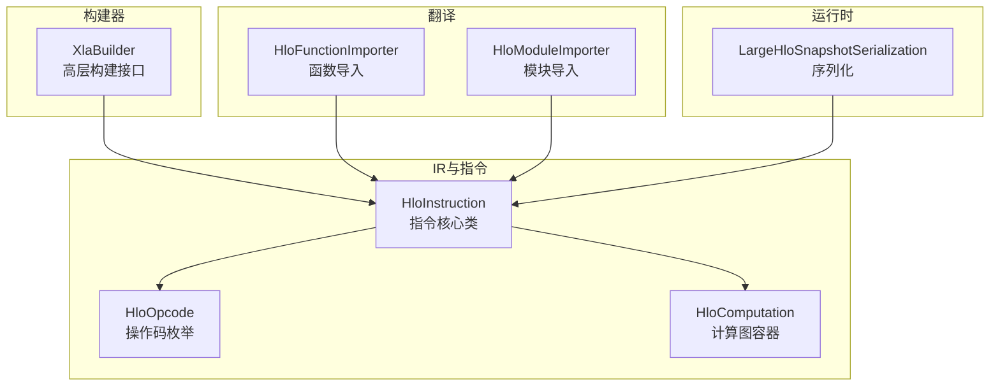
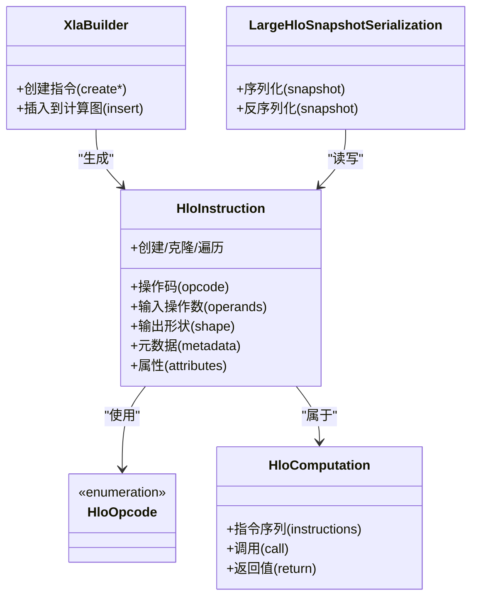
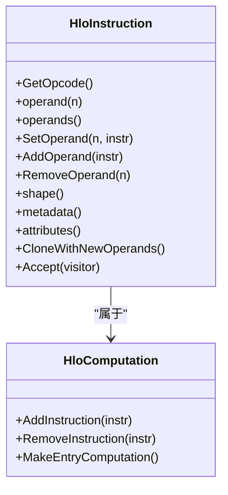
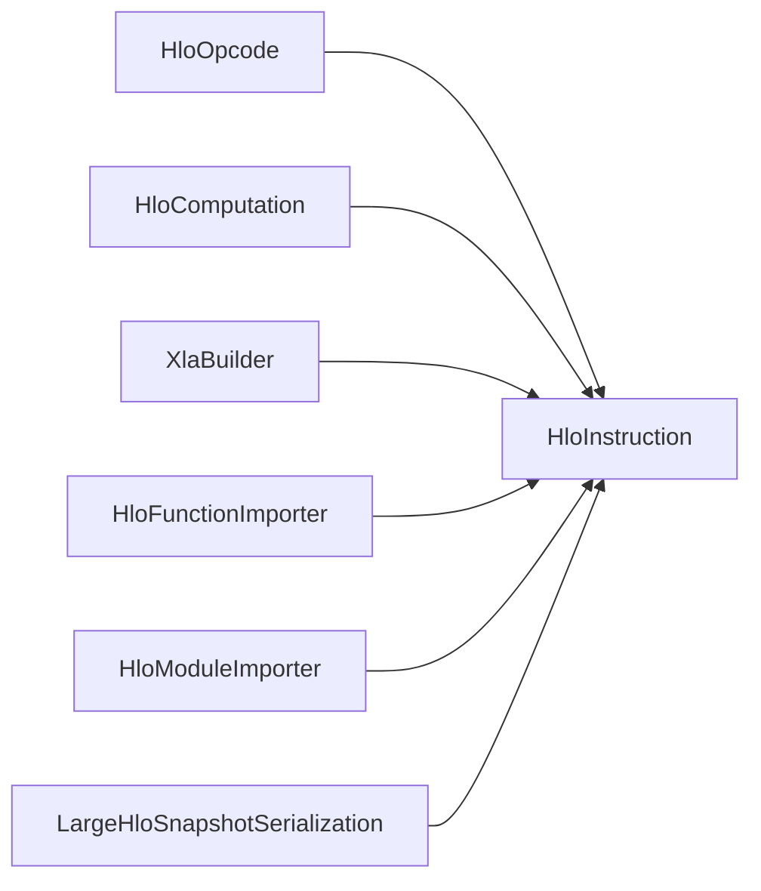

# HLO指令系统

<cite>
**本文引用的文件**
- [xla/hlo/ir/hlo_instruction.h](file://xla/hlo/ir/hlo_instruction.h)
- [xla/hlo/ir/hlo_opcode.h](file://xla/hlo/ir/hlo_opcode.h)
- [xla/hlo/ir/hlo_computation.h](file://xla/hlo/ir/hlo_computation.h)
- [xla/hlo/builder/xla_builder.h](file://xla/hlo/builder/xla_builder.h)
- [xla/hlo/ir/hlo_instruction_utils_test.cc](file://xla/hlo/ir/hlo_instruction_utils_test.cc)
- [xla/service/hlo_instruction_test.cc](file://xla/service/hlo_instruction_test.cc)
- [xla/hlo/ir/hlo_schedule.h](file://xla/hlo/ir/hlo_schedule.h)
- [xla/hlo/ir/hlo_domain_metadata.h](file://xla/hlo/ir/hlo_domain_metadata.h)
- [xla/hlo/ir/hlo_clone_context.h](file://xla/hlo/ir/hlo_clone_context.h)
- [xla/hlo/ir/dfs_hlo_visitor.h](file://xla/hlo/ir/dfs_hlo_visitor.h)
- [xla/hlo/utils/hlo_traversal.h](file://xla/hlo/utils/hlo_traversal.h)
- [xla/hlo/translate/hlo_to_mhlo/hlo_function_importer.h](file://xla/hlo/translate/hlo_to_mhlo/hlo_function_importer.h)
- [xla/hlo/translate/hlo_to_mhlo/hlo_module_importer.h](file://xla/hlo/translate/hlo_to_mhlo/hlo_module_importer.h)
- [xla/codegen/testlib/kernel_runner_extension.cc](file://xla/codegen/testlib/kernel_runner_extension.cc)
- [xla/runtime/large_hlo_snapshot_serialization/large_hlo_snapshot_serialization.h](file://xla/runtime/large_hlo_snapshot_serialization/large_hlo_snapshot_serialization.h)
- [xla/runtime/large_hlo_snapshot_serialization/large_hlo_snapshot_serialization.cc](file://xla/runtime/large_hlo_snapshot_serialization/large_hlo_snapshot_serialization.cc)
</cite>

## 目录
1. [引言](#引言)
2. [项目结构](#项目结构)
3. [核心组件](#核心组件)
4. [架构总览](#架构总览)
5. [详细组件分析](#详细组件分析)
6. [依赖分析](#依赖分析)
7. [性能考虑](#性能考虑)
8. [故障排查指南](#故障排查指南)
9. [结论](#结论)
10. [附录](#附录)

## 引言
本文件系统性梳理XLA中的HLO（High-Level Optimizer）指令系统，围绕指令类型、操作码枚举、指令属性与设计模式展开，重点解释HloInstruction类的职责边界、创建流程、操作数管理、形状推断与元数据处理，并给出常见算术/逻辑/控制流/数据移动等操作码的功能概览与实践指引。同时覆盖验证规则、依赖关系分析、调试工具与序列化/反序列化实现细节，帮助读者在不直接阅读源码的情况下也能高效理解并正确使用HLO指令体系。

## 项目结构
XLA中HLO相关代码主要集中在以下模块：
- 指令定义与IR：xla/hlo/ir
- 构建器：xla/hlo/builder
- 翻译到MHLO：xla/hlo/translate/hlo_to_mhlo
- 运行时序列化：xla/runtime/large_hlo_snapshot_serialization
- 测试与工具：xla/hlo/ir、xla/service、xla/codegen/testlib

图表来源
- [xla/hlo/ir/hlo_instruction.h](file://xla/hlo/ir/hlo_instruction.h#L224-L2600)
- [xla/hlo/ir/hlo_opcode.h](file://xla/hlo/ir/hlo_opcode.h#L185-L250)
- [xla/hlo/ir/hlo_computation.h](file://xla/hlo/ir/hlo_computation.h#L1000-L1100)
- [xla/hlo/builder/xla_builder.h](file://xla/hlo/builder/xla_builder.h#L60-L120)
- [xla/hlo/translate/hlo_to_mhlo/hlo_function_importer.h](file://xla/hlo/translate/hlo_to_mhlo/hlo_function_importer.h#L50-L70)
- [xla/hlo/translate/hlo_to_mhlo/hlo_module_importer.h](file://xla/hlo/translate/hlo_to_mhlo/hlo_module_importer.h#L25-L40)
- [xla/runtime/large_hlo_snapshot_serialization/large_hlo_snapshot_serialization.h](file://xla/runtime/large_hlo_snapshot_serialization/large_hlo_snapshot_serialization.h#L1-L200)

章节来源
- [xla/hlo/ir/hlo_instruction.h](file://xla/hlo/ir/hlo_instruction.h#L224-L2600)
- [xla/hlo/ir/hlo_opcode.h](file://xla/hlo/ir/hlo_opcode.h#L185-L250)
- [xla/hlo/ir/hlo_computation.h](file://xla/hlo/ir/hlo_computation.h#L1000-L1100)
- [xla/hlo/builder/xla_builder.h](file://xla/hlo/builder/xla_builder.h#L60-L120)
- [xla/hlo/translate/hlo_to_mhlo/hlo_function_importer.h](file://xla/hlo/translate/hlo_to_mhlo/hlo_function_importer.h#L50-L70)
- [xla/hlo/translate/hlo_to_mhlo/hlo_module_importer.h](file://xla/hlo/translate/hlo_to_mhlo/hlo_module_importer.h#L25-L40)
- [xla/runtime/large_hlo_snapshot_serialization/large_hlo_snapshot_serialization.h](file://xla/runtime/large_hlo_snapshot_serialization/large_hlo_snapshot_serialization.h#L1-L200)

## 核心组件
- HloInstruction：HLO指令的核心类，封装指令类型（操作码）、输入输出形状、元数据、属性以及与HloComputation的关系。它提供指令创建、操作数访问、形状推断、属性查询与更新、克隆与遍历等能力。
- HloOpcode：指令操作码的枚举，涵盖算术、逻辑、比较、控制流、数据布局变换、聚合、索引与切片、随机采样、自定义调用等类别。
- HloComputation：包含一组HloInstruction的容器，支持嵌套与调用关系，是HLO图的根节点或子图节点。
- XlaBuilder：高层构建接口，提供便捷的指令构造方法，内部最终生成HloInstruction并插入到HloComputation。
- HloInstruction序列化：通过运行时大快照序列化机制，将HLO图持久化，便于调试与跨进程传输。

章节来源
- [xla/hlo/ir/hlo_instruction.h](file://xla/hlo/ir/hlo_instruction.h#L224-L2600)
- [xla/hlo/ir/hlo_opcode.h](file://xla/hlo/ir/hlo_opcode.h#L185-L250)
- [xla/hlo/ir/hlo_computation.h](file://xla/hlo/ir/hlo_computation.h#L1000-L1100)
- [xla/hlo/builder/xla_builder.h](file://xla/hlo/builder/xla_builder.h#L60-L120)
- [xla/runtime/large_hlo_snapshot_serialization/large_hlo_snapshot_serialization.h](file://xla/runtime/large_hlo_snapshot_serialization/large_hlo_snapshot_serialization.h#L1-L200)

## 架构总览
下图展示了HLO指令系统的关键构件及其交互关系。

图表来源
- [xla/hlo/ir/hlo_instruction.h](file://xla/hlo/ir/hlo_instruction.h#L224-L2600)
- [xla/hlo/ir/hlo_opcode.h](file://xla/hlo/ir/hlo_opcode.h#L185-L250)
- [xla/hlo/ir/hlo_computation.h](file://xla/hlo/ir/hlo_computation.h#L1000-L1100)
- [xla/hlo/builder/xla_builder.h](file://xla/hlo/builder/xla_builder.h#L60-L120)
- [xla/runtime/large_hlo_snapshot_serialization/large_hlo_snapshot_serialization.h](file://xla/runtime/large_hlo_snapshot_serialization/large_hlo_snapshot_serialization.h#L1-L200)

## 详细组件分析

### HloInstruction类设计与职责
- 设计模式
  - 组合优先：HloInstruction组合了操作码、形状、元数据与属性，通过友元/容器类（HloComputation）管理其生命周期与依赖关系。
  - 访问器与修改器：提供统一的访问与更新接口，确保对操作数、属性与元数据的变更可被验证与追踪。
  - 克隆与遍历：支持深度克隆与多种遍历策略（DFS、拓扑序），便于Pass与优化管线复用。
- 关键职责
  - 指令创建：由XlaBuilder或翻译器生成，设置opcode与初始属性。
  - 操作数管理：维护输入操作数列表，支持插入、替换与删除；用于依赖分析与DAG构建。
  - 形状推断：根据opcode与输入形状推导输出形状；错误时触发验证失败。
  - 元数据处理：包含布局、维度规范、域信息等，影响后续编译与内核生成。
  - 序列化：参与大快照序列化，支持跨进程/跨模块持久化与恢复。

图表来源
- [xla/hlo/ir/hlo_instruction.h](file://xla/hlo/ir/hlo_instruction.h#L224-L2600)
- [xla/hlo/ir/hlo_computation.h](file://xla/hlo/ir/hlo_computation.h#L1000-L1100)

章节来源
- [xla/hlo/ir/hlo_instruction.h](file://xla/hlo/ir/hlo_instruction.h#L224-L2600)
- [xla/hlo/ir/hlo_computation.h](file://xla/hlo/ir/hlo_computation.h#L1000-L1100)

### HloOpcode操作码枚举与分类
- 分类概览
  - 算术运算：加减乘除、取模、幂次、对数、三角函数等。
  - 逻辑/比较：与/或/非、相等/不等/大小比较。
  - 控制流：条件分支、循环、返回、调用等。
  - 数据移动：复制、广播、reshape、flatten、transpose、动态切片/更新等。
  - 聚合/扫描：sum、prod、min/max、argmin/argmax、窗口化聚合等。
  - 布局/形状：动态形状、形状变更、维度重排、批处理/通道映射等。
  - 随机/采样：随机数生成、采样、噪声注入等。
  - 自定义调用：外部库/后端扩展接口。
- 枚举位置
  - 操作码以枚举形式定义，供HloInstruction与Pass系统识别与分派。

章节来源
- [xla/hlo/ir/hlo_opcode.h](file://xla/hlo/ir/hlo_opcode.h#L185-L250)

### HloComputation与指令序列
- HloComputation作为指令容器，维护指令顺序与依赖关系，支持：
  - 指令添加/移除
  - 返回值声明
  - 嵌套子图与调用关系
- 指令序列化
  - 通过大快照序列化机制，将HloComputation与其中的HloInstruction持久化，便于调试与跨模块传输。

章节来源
- [xla/hlo/ir/hlo_computation.h](file://xla/hlo/ir/hlo_computation.h#L1000-L1100)
- [xla/hlo/ir/hlo_schedule.h](file://xla/hlo/ir/hlo_schedule.h#L40-L60)
- [xla/runtime/large_hlo_snapshot_serialization/large_hlo_snapshot_serialization.h](file://xla/runtime/large_hlo_snapshot_serialization/large_hlo_snapshot_serialization.h#L1-L200)

### XlaBuilder与指令创建
- XlaBuilder提供高层API，将用户意图转换为具体HloInstruction并插入到当前HloComputation。
- 典型流程：构建器方法 -> 创建HloInstruction -> 设置属性/形状 -> 插入计算图。

章节来源
- [xla/hlo/builder/xla_builder.h](file://xla/hlo/builder/xla_builder.h#L60-L120)

### 翻译到MHLO（HloToMhlo）
- HloFunctionImporter/HloModuleImporter负责将现有HLO图导入到MHLO（MLIR HLO）表示，以便进入MLIR生态进行进一步优化与后端生成。

章节来源
- [xla/hlo/translate/hlo_to_mhlo/hlo_function_importer.h](file://xla/hlo/translate/hlo_to_mhlo/hlo_function_importer.h#L50-L70)
- [xla/hlo/translate/hlo_to_mhlo/hlo_module_importer.h](file://xla/hlo/translate/hlo_to_mhlo/hlo_module_importer.h#L25-L40)

### 元数据与域信息
- HloDomainMetadata用于描述指令的域特性（如维度约束、布局要求），与形状推断协同工作，保证后续Pass的合法性。

章节来源
- [xla/hlo/ir/hlo_domain_metadata.h](file://xla/hlo/ir/hlo_domain_metadata.h#L25-L40)

### 克隆上下文与遍历
- HloCloneContext用于深拷贝与重定位，配合DFS/HLO遍历工具，支撑Pass的复制与变换。
- DFS/HLO遍历与HLO遍历适配器提供一致的遍历接口，简化Pass实现。

章节来源
- [xla/hlo/ir/hlo_clone_context.h](file://xla/hlo/ir/hlo_clone_context.h#L20-L40)
- [xla/hlo/ir/dfs_hlo_visitor.h](file://xla/hlo/ir/dfs_hlo_visitor.h#L25-L40)
- [xla/hlo/utils/hlo_traversal.h](file://xla/hlo/utils/hlo_traversal.h#L30-L50)

### 指令验证与调试
- 验证规则
  - 操作数数量与类型匹配opcode要求
  - 输入/输出形状满足算子语义
  - 元数据与布局一致性
- 调试工具
  - Python绑定中导出HloOpcode枚举，便于脚本层调试与可视化
  - 单元测试覆盖HloInstruction常用行为与边界情况

章节来源
- [xla/codegen/testlib/kernel_runner_extension.cc](file://xla/codegen/testlib/kernel_runner_extension.cc#L230-L240)
- [xla/hlo/ir/hlo_instruction_utils_test.cc](file://xla/hlo/ir/hlo_instruction_utils_test.cc#L30-L50)
- [xla/service/hlo_instruction_test.cc](file://xla/service/hlo_instruction_test.cc#L60-L90)

### 指令序列化与反序列化
- 大快照序列化
  - 将HLO图（含指令、形状、元数据）打包为二进制快照，支持跨进程/跨模块传输与持久化
  - 反序列化时重建HloInstruction与HloComputation，保持语义一致

章节来源
- [xla/runtime/large_hlo_snapshot_serialization/large_hlo_snapshot_serialization.h](file://xla/runtime/large_hlo_snapshot_serialization/large_hlo_snapshot_serialization.h#L1-L200)
- [xla/runtime/large_hlo_snapshot_serialization/large_hlo_snapshot_serialization.cc](file://xla/runtime/large_hlo_snapshot_serialization/large_hlo_snapshot_serialization.cc#L1-L200)

## 依赖分析
- 内部耦合
  - HloInstruction与HloComputation强关联，后者持有前者并维护执行顺序
  - HloInstruction依赖HloOpcode进行算子识别与分派
  - 克隆/遍历工具与HloInstruction紧密协作，支撑Pass框架
- 外部集成
  - MHLO翻译器将HLO图导入MLIR，形成统一中间表示
  - 运行时序列化器负责持久化与跨模块传输

图表来源
- [xla/hlo/ir/hlo_opcode.h](file://xla/hlo/ir/hlo_opcode.h#L185-L250)
- [xla/hlo/ir/hlo_instruction.h](file://xla/hlo/ir/hlo_instruction.h#L224-L2600)
- [xla/hlo/ir/hlo_computation.h](file://xla/hlo/ir/hlo_computation.h#L1000-L1100)
- [xla/hlo/builder/xla_builder.h](file://xla/hlo/builder/xla_builder.h#L60-L120)
- [xla/hlo/translate/hlo_to_mhlo/hlo_function_importer.h](file://xla/hlo/translate/hlo_to_mhlo/hlo_function_importer.h#L50-L70)
- [xla/hlo/translate/hlo_to_mhlo/hlo_module_importer.h](file://xla/hlo/translate/hlo_to_mhlo/hlo_module_importer.h#L25-L40)
- [xla/runtime/large_hlo_snapshot_serialization/large_hlo_snapshot_serialization.h](file://xla/runtime/large_hlo_snapshot_serialization/large_hlo_snapshot_serialization.h#L1-L200)

## 性能考虑
- 操作数管理与形状推断
  - 合理缓存与延迟推断，避免重复计算
  - 在Pass链中尽量减少不必要的克隆与复制
- 遍历与克隆
  - 使用高效的遍历器与克隆上下文，降低内存峰值
- 序列化
  - 大快照序列化应结合压缩与增量策略，减少I/O开销

## 故障排查指南
- 常见问题
  - 形状不匹配：检查输入/输出形状是否符合算子语义
  - 操作数缺失：确认所有必需操作数均已设置
  - 元数据冲突：校验布局与维度规范的一致性
- 定位手段
  - 使用Python绑定导出的HloOpcode枚举进行快速比对
  - 通过单元测试与单步调试定位异常指令
  - 利用大快照序列化保存现场，便于复现与回放

章节来源
- [xla/codegen/testlib/kernel_runner_extension.cc](file://xla/codegen/testlib/kernel_runner_extension.cc#L230-L240)
- [xla/hlo/ir/hlo_instruction_utils_test.cc](file://xla/hlo/ir/hlo_instruction_utils_test.cc#L30-L50)
- [xla/service/hlo_instruction_test.cc](file://xla/service/hlo_instruction_test.cc#L60-L90)

## 结论
HLO指令系统以HloInstruction为核心，通过HloOpcode明确算子语义，借助HloComputation组织指令图，并由XlaBuilder提供高层构建入口。配合MHLO翻译器与运行时序列化机制，HLO实现了从高层描述到可执行内核的完整链路。理解指令创建、操作数管理、形状推断与元数据处理，是高效使用与扩展HLO系统的关键。

## 附录

### 指令创建与操作示例（路径指引）
- 使用XlaBuilder创建算术/逻辑/比较/数据移动等指令
  - 参考：[xla/hlo/builder/xla_builder.h](file://xla/hlo/builder/xla_builder.h#L60-L120)
- 通过HloInstruction设置/更新操作数与属性
  - 参考：[xla/hlo/ir/hlo_instruction.h](file://xla/hlo/ir/hlo_instruction.h#L224-L2600)
- 导入到MHLO进行进一步优化
  - 参考：[xla/hlo/translate/hlo_to_mhlo/hlo_function_importer.h](file://xla/hlo/translate/hlo_to_mhlo/hlo_function_importer.h#L50-L70)
  - 参考：[xla/hlo/translate/hlo_to_mhlo/hlo_module_importer.h](file://xla/hlo/translate/hlo_to_mhlo/hlo_module_importer.h#L25-L40)
- 查看与调试HloOpcode枚举
  - 参考：[xla/codegen/testlib/kernel_runner_extension.cc](file://xla/codegen/testlib/kernel_runner_extension.cc#L230-L240)
- 验证与测试
  - 参考：[xla/hlo/ir/hlo_instruction_utils_test.cc](file://xla/hlo/ir/hlo_instruction_utils_test.cc#L30-L50)
  - 参考：[xla/service/hlo_instruction_test.cc](file://xla/service/hlo_instruction_test.cc#L60-L90)