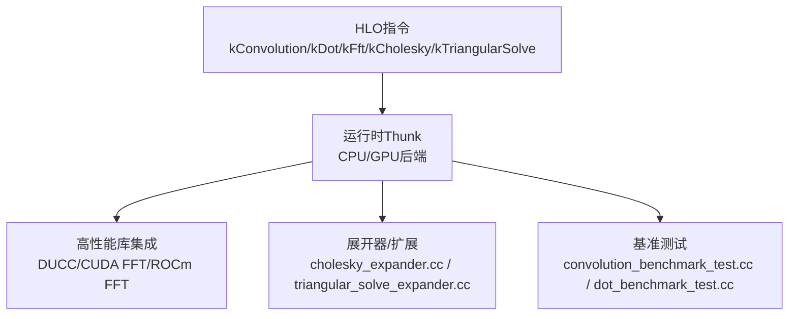
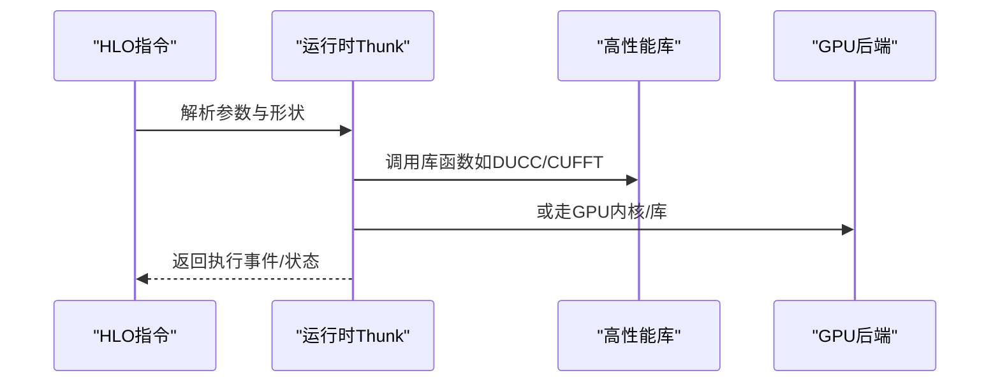
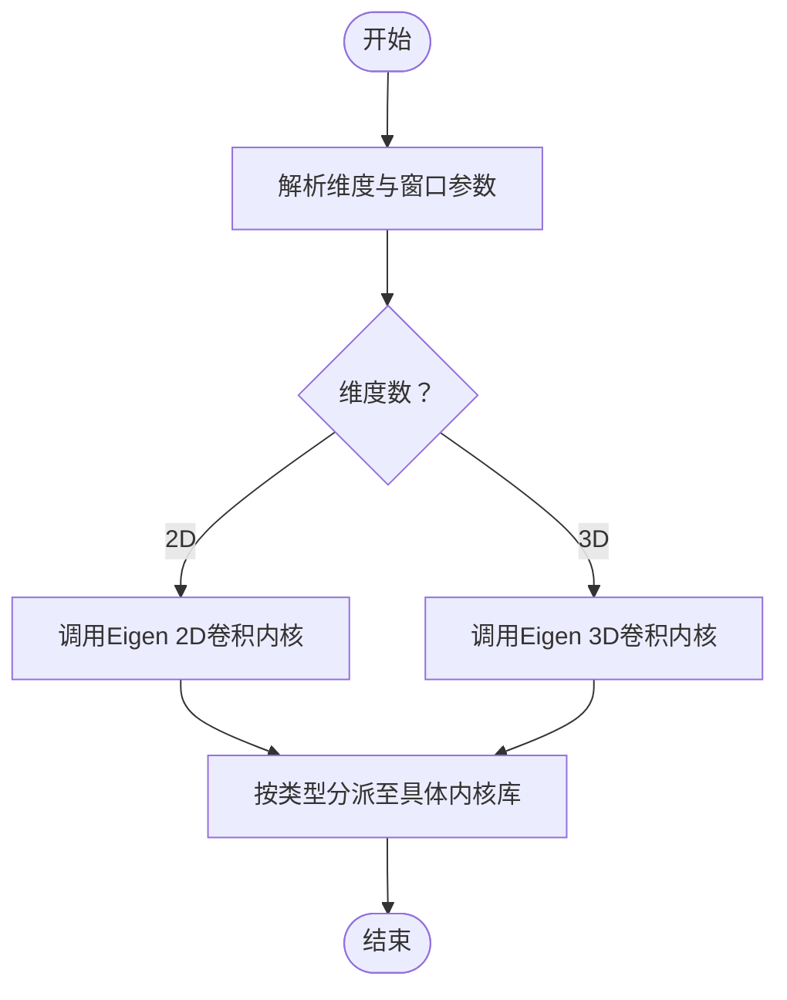
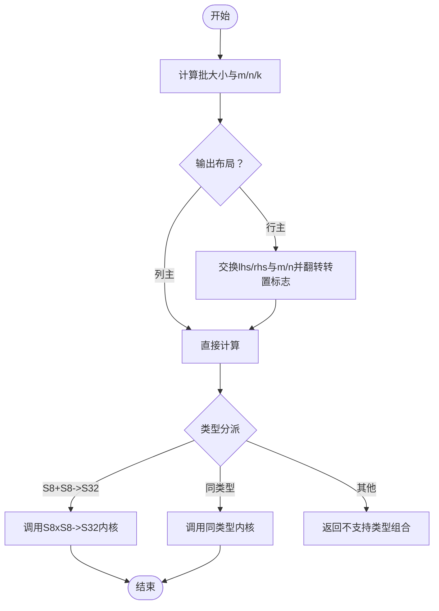
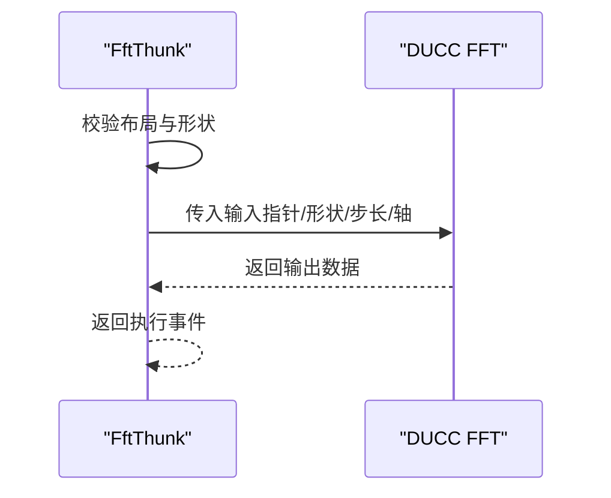
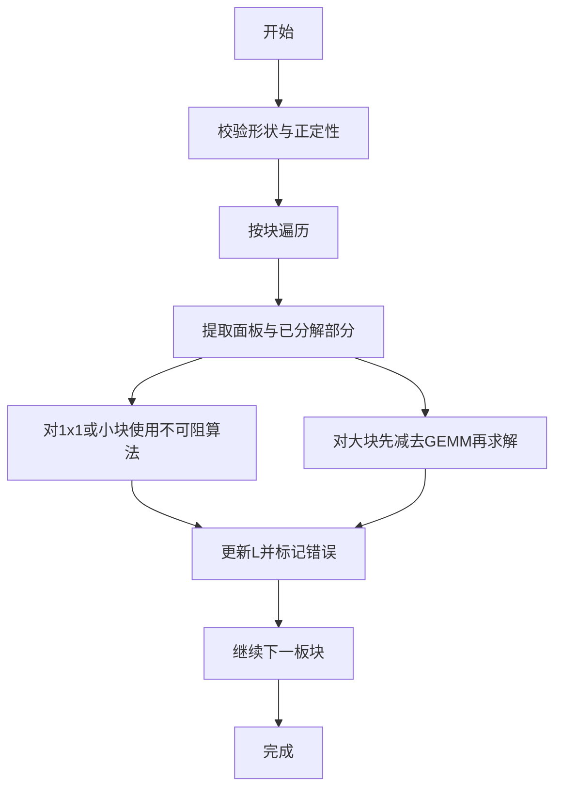
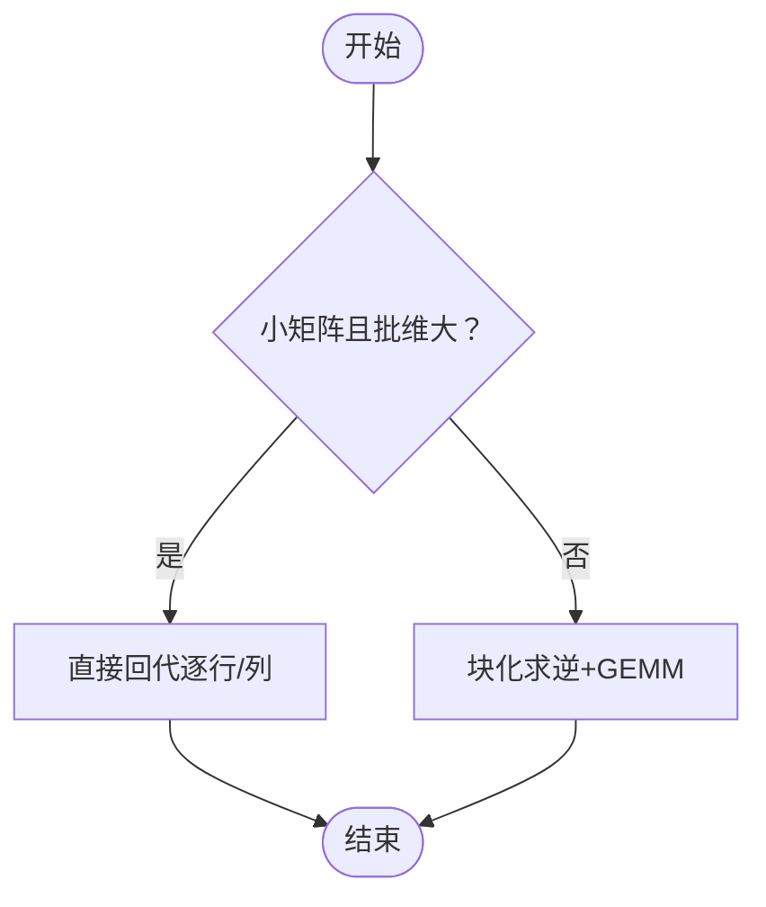
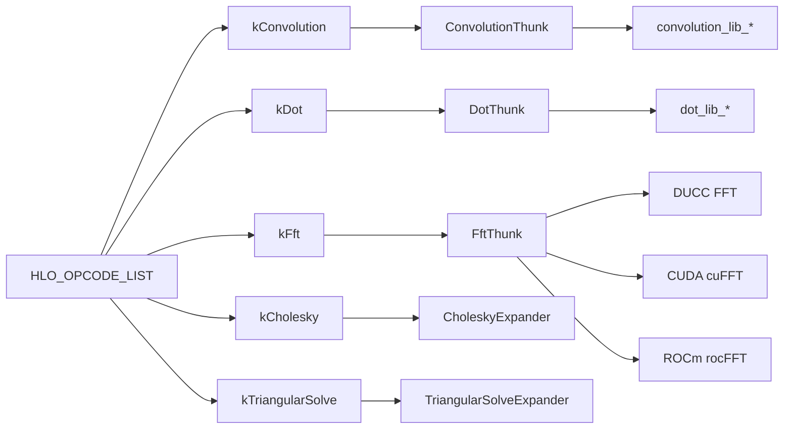

# 专用计算指令

<cite>
**本文引用的文件**
- [hlo_opcode.h](file://xla/hlo/ir/hlo_opcode.h)
- [convolution_thunk.cc](file://xla/backends/cpu/runtime/convolution_thunk.cc)
- [dot_thunk.cc](file://xla/backends/cpu/runtime/dot_thunk.cc)
- [fft_thunk.cc](file://xla/backends/cpu/runtime/fft_thunk.cc)
- [cholesky_expander.cc](file://xla/hlo/transforms/expanders/cholesky_expander.cc)
- [triangular_solve_expander.cc](file://xla/service/triangular_solve_expander.cc)
- [convolution_lib_f32_2d.cc](file://xla/backends/cpu/runtime/convolution_lib_f32_2d.cc)
- [dot_lib_f32.cc](file://xla/backends/cpu/runtime/dot_lib_f32.cc)
- [fft.h](file://third_party/ducc/fft.h)
- [cuda_fft.h](file://xla/stream_executor/cuda/cuda_fft.h)
- [rocm_fft.h](file://xla/stream_executor/rocm/rocm_fft.h)
- [convolution_benchmark_test.cc](file://xla/backends/cpu/benchmarks/convolution_benchmark_test.cc)
- [dot_benchmark_test.cc](file://xla/backends/cpu/benchmarks/dot_benchmark_test.cc)
- [operation_semantics.md](file://docs/operation_semantics.md)
</cite>

## 目录
1. [引言](#引言)
2. [项目结构](#项目结构)
3. [核心组件](#核心组件)
4. [架构总览](#架构总览)
5. [详细组件分析](#详细组件分析)
6. [依赖关系分析](#依赖关系分析)
7. [性能考量](#性能考量)
8. [故障排查指南](#故障排查指南)
9. [结论](#结论)
10. [附录](#附录)

## 引言
本文件系统性梳理XLA中面向高性能计算的专用计算指令：卷积(kConvolution)、矩阵乘(kDot)、快速傅里叶变换(kFft)、三角分解(kCholesky)与求解器(kTriangularSolve)。内容覆盖数学原理、输入输出与参数配置、与高性能库的集成、硬件加速支持、数值稳定性与精度控制、错误处理策略，并给出在深度学习训练与推理中的典型应用路径与性能优化建议。

## 项目结构
围绕专用指令，相关实现分布在以下层次：
- 指令语义与枚举：HLO操作码定义
- 运行时Thunk执行：CPU/GPU后端对专用算子的运行时封装
- 高性能库集成：第三方库（如DUCC）与流库（CUDA cuFFT、ROCm rocFFT）
- 展开器与扩展：将高层指令展开为基础算子序列或调用底层库
- 基准测试：CPU后端的卷积与矩阵乘基准

**图表来源**
- [hlo_opcode.h](file://xla/hlo/ir/hlo_opcode.h#L80-L178)
- [convolution_thunk.cc](file://xla/backends/cpu/runtime/convolution_thunk.cc#L1-L229)
- [dot_thunk.cc](file://xla/backends/cpu/runtime/dot_thunk.cc#L1-L230)
- [fft_thunk.cc](file://xla/backends/cpu/runtime/fft_thunk.cc#L1-L205)
- [cholesky_expander.cc](file://xla/hlo/transforms/expanders/cholesky_expander.cc#L1-L270)
- [triangular_solve_expander.cc](file://xla/service/triangular_solve_expander.cc#L1-L613)

**章节来源**
- [hlo_opcode.h](file://xla/hlo/ir/hlo_opcode.h#L48-L182)

## 核心组件
- 卷积(kConvolution)：二维/三维卷积，支持特征图维度、步幅、填充、扩张等参数，CPU后端通过Eigen路径执行，GPU后端可走自定义内核或库函数。
- 矩阵乘(kDot)：通用GEMM接口，支持批量、转置、布局（列主/行主）等，CPU后端按类型分派到对应内核库。
- 快速傅里叶变换(kFft)：支持复数/实数正向/逆向FFT，多维批处理，CPU后端集成DUCC，GPU后端集成cuFFT/rocFFT。
- 三角分解(kCholesky)：对Hermitian正定矩阵进行Cholesky分解，展开为循环与BLAS操作。
- 求解器(kTriangularSolve)：求解三角线性系统，支持左/右、上/下、是否单位对角、是否转置/共轭等选项，展开为块化求逆+GEMM或直接回代。

**章节来源**
- [hlo_opcode.h](file://xla/hlo/ir/hlo_opcode.h#L80-L178)
- [convolution_thunk.cc](file://xla/backends/cpu/runtime/convolution_thunk.cc#L79-L114)
- [dot_thunk.cc](file://xla/backends/cpu/runtime/dot_thunk.cc#L73-L117)
- [fft_thunk.cc](file://xla/backends/cpu/runtime/fft_thunk.cc#L165-L196)
- [cholesky_expander.cc](file://xla/hlo/transforms/expanders/cholesky_expander.cc#L137-L225)
- [triangular_solve_expander.cc](file://xla/service/triangular_solve_expander.cc#L475-L551)

## 架构总览
专用指令从HLO IR进入，经由后端Thunk执行；部分指令在服务层被展开为更基础的算子序列，或直接委托给高性能库。

**图表来源**
- [convolution_thunk.cc](file://xla/backends/cpu/runtime/convolution_thunk.cc#L79-L114)
- [fft_thunk.cc](file://xla/backends/cpu/runtime/fft_thunk.cc#L165-L196)
- [cuda_fft.h](file://xla/stream_executor/cuda/cuda_fft.h#L1-L200)
- [rocm_fft.h](file://xla/stream_executor/rocm/rocm_fft.h#L1-L200)

## 详细组件分析

### 卷积(kConvolution)
- 数学原理：输入张量与卷积核进行互相关，支持多维、步幅、填充、扩张、分组等。
- 输入输出与参数：
  - 输入：输入张量、卷积核、输出缓冲区
  - 参数：维度编号、窗口（步幅、填充、扩张）、分组数
  - 形状：输入/核/输出的布局需满足规范
- 执行路径：
  - CPU：根据维度选择2D/3D路径，按元素类型分派到内核库（如F16/F32）
  - GPU：可走自定义内核或库函数
- 集成与硬件：
  - CPU：内核库实现位于runtime目录
  - GPU：后端有独立的convolution_thunk与相关proto
- 性能与稳定性：
  - 填充/扩张策略影响内存访问与吞吐
  - 多线程与分块策略提升吞吐
- 错误处理：
  - 类型不支持、形状不匹配、布局非法等情况返回错误

**图表来源**
- [convolution_thunk.cc](file://xla/backends/cpu/runtime/convolution_thunk.cc#L107-L166)
- [convolution_lib_f32_2d.cc](file://xla/backends/cpu/runtime/convolution_lib_f32_2d.cc#L1-L200)

**章节来源**
- [convolution_thunk.cc](file://xla/backends/cpu/runtime/convolution_thunk.cc#L51-L114)
- [convolution_lib_f32_2d.cc](file://xla/backends/cpu/runtime/convolution_lib_f32_2d.cc#L1-L200)

### 矩阵乘(kDot)
- 数学原理：批量GEMM，支持转置与不同布局（列主/行主），通过转置恒等式统一到列主布局。
- 输入输出与参数：
  - 左右操作数与输出缓冲区
  - 维度编号：批维、收缩维、非收缩维
  - 支持类型：BF16/F16/F32/F64/S32及复数类型
- 执行路径：
  - 计算批大小与m/n/k，决定是否需要转置
  - 按类型分派到内核库（如F32/BF16等）
- 集成与硬件：
  - CPU：多类型内核库（dot_lib_*）
  - GPU：后端有独立实现
- 性能与稳定性：
  - 列主布局通常更高效
  - 批量GEMM可利用并行与缓存友好布局
- 错误处理：
  - 不支持的类型组合返回未实现错误

**图表来源**
- [dot_thunk.cc](file://xla/backends/cpu/runtime/dot_thunk.cc#L129-L226)
- [dot_lib_f32.cc](file://xla/backends/cpu/runtime/dot_lib_f32.cc#L1-L200)

**章节来源**
- [dot_thunk.cc](file://xla/backends/cpu/runtime/dot_thunk.cc#L44-L117)
- [dot_lib_f32.cc](file://xla/backends/cpu/runtime/dot_lib_f32.cc#L1-L200)

### 快速傅里叶变换(kFft)
- 数学原理：一维/多维复数FFT，支持正向/逆向、实数/复数变换。
- 输入输出与参数：
  - 输入/输出形状需满足布局单调性（以dim0为主序）
  - FFT长度、类型（C2C/R2C/C2R）与精度（单/双）
- 执行路径：
  - 将输入展平为批+维度数组，构造DUCC调用参数
  - 根据类型与精度选择相应内核
- 集成与硬件：
  - CPU：DUCC（ducc/google/fft.h）
  - GPU：CUDA cuFFT、ROCm rocFFT
- 性能与稳定性：
  - 多线程Eigen可提升吞吐
  - 实数变换注意输出虚部长度变化
- 错误处理：
  - 布局不合法、类型不支持等返回错误

**图表来源**
- [fft_thunk.cc](file://xla/backends/cpu/runtime/fft_thunk.cc#L165-L196)
- [fft.h](file://third_party/ducc/fft.h#L1-L200)
- [cuda_fft.h](file://xla/stream_executor/cuda/cuda_fft.h#L1-L200)
- [rocm_fft.h](file://xla/stream_executor/rocm/rocm_fft.h#L1-L200)

**章节来源**
- [fft_thunk.cc](file://xla/backends/cpu/runtime/fft_thunk.cc#L45-L196)
- [fft.h](file://third_party/ducc/fft.h#L1-L200)

### 三角分解(kCholesky)
- 数学原理：对Hermitian正定矩阵进行Cholesky分解L·L^H=A，采用分块左视算法。
- 输入输出与参数：
  - 输入矩阵需为批处理的方阵
  - 可选下三角/上三角
- 执行路径：
  - 展开器将kCholesky展开为循环、切片、GEMM与三角求解
  - 使用Block大小控制分块
- 集成与硬件：
  - 通过基础算子组合实现，可受益于后端GEMM/TRSM优化
- 性能与稳定性：
  - 分块降低内存压力，提高并行度
  - 对数值误差进行跟踪与NaN传播
- 错误处理：
  - 非方阵、非正定等情形返回错误

**图表来源**
- [cholesky_expander.cc](file://xla/hlo/transforms/expanders/cholesky_expander.cc#L137-L225)

**章节来源**
- [cholesky_expander.cc](file://xla/hlo/transforms/expanders/cholesky_expander.cc#L48-L135)
- [cholesky_expander.cc](file://xla/hlo/transforms/expanders/cholesky_expander.cc#L137-L225)

### 求解器(kTriangularSolve)
- 数学原理：求解线性系统AX=B或XA=B，其中A为三角矩阵，支持左/右、上/下、单位对角、转置/共轭。
- 输入输出与参数：
  - A：三角系数矩阵（批处理）
  - B：右端矩阵（批处理）
  - 选项：left_side、lower、unit_diagonal、transpose_a（含无转置、转置、共轭）
- 执行路径：
  - 小矩阵或有显著批维时采用直接回代
  - 否则采用块化求逆+GEMM方案
- 集成与硬件：
  - 展开为GEMM与切片操作，受益于后端BLAS优化
- 性能与稳定性：
  - 直接回代适合小矩阵，块化求逆适合大矩阵
  - 单位对角时掩蔽非对角元素，避免除零
- 错误处理：
  - 形状不兼容、维度不足等返回错误

**图表来源**
- [triangular_solve_expander.cc](file://xla/service/triangular_solve_expander.cc#L540-L551)

**章节来源**
- [triangular_solve_expander.cc](file://xla/service/triangular_solve_expander.cc#L475-L551)

## 依赖关系分析
- 指令枚举：HLO_OPCODE_LIST定义了kConvolution/kDot/kFft/kCholesky/kTriangularSolve等操作码
- 运行时Thunk：CPU后端对上述指令进行封装，调用内核库或第三方库
- 展开器：cholesky与triangular_solve在服务层展开为基础算子序列
- 基准测试：CPU后端提供卷积与GEMM的基准测试文件

**图表来源**
- [hlo_opcode.h](file://xla/hlo/ir/hlo_opcode.h#L80-L178)
- [convolution_thunk.cc](file://xla/backends/cpu/runtime/convolution_thunk.cc#L1-L229)
- [dot_thunk.cc](file://xla/backends/cpu/runtime/dot_thunk.cc#L1-L230)
- [fft_thunk.cc](file://xla/backends/cpu/runtime/fft_thunk.cc#L1-L205)
- [cholesky_expander.cc](file://xla/hlo/transforms/expanders/cholesky_expander.cc#L1-L270)
- [triangular_solve_expander.cc](file://xla/service/triangular_solve_expander.cc#L1-L613)

**章节来源**
- [hlo_opcode.h](file://xla/hlo/ir/hlo_opcode.h#L48-L182)

## 性能考量
- 卷积
  - 优先使用2D/3D专用内核，合理设置填充与扩张
  - 利用多线程与分块策略提升吞吐
- 矩阵乘
  - 列主布局更高效；批量GEMM充分利用缓存与并行
  - 选择合适的数据类型（BF16/F16/F32）平衡精度与性能
- FFT
  - 实数变换注意输出虚部长度；多线程提升吞吐
- Cholesky
  - 分块降低内存峰值；对数值误差进行跟踪
- TriangularSolve
  - 小矩阵用直接回代，大矩阵用块化求逆+GEMM
- 基准测试
  - CPU后端提供卷积与GEMM基准测试文件，可用于对比不同配置的性能

**章节来源**
- [convolution_benchmark_test.cc](file://xla/backends/cpu/benchmarks/convolution_benchmark_test.cc#L1-L200)
- [dot_benchmark_test.cc](file://xla/backends/cpu/benchmarks/dot_benchmark_test.cc#L1-L200)

## 故障排查指南
- 卷积
  - 输入类型不受支持：检查元素类型是否为F16/F32
  - 形状/布局不匹配：确认维度编号与窗口参数
- 矩阵乘
  - 类型组合不支持：确保左右操作数与输出类型一致或符合S8+S8->S32规则
  - 布局问题：确认列主/行主与转置标志
- FFT
  - 布局非法：确保布局单调且以dim0为主序
  - 类型/精度不匹配：确认输入类型与FFT类型一致
- Cholesky
  - 非方阵或非正定：检查输入矩阵形状与正定性
- TriangularSolve
  - 形状不兼容：检查批维与矩阵尺寸一致性
  - 选项冲突：确认left_side、lower、unit_diagonal与transpose_a组合

**章节来源**
- [convolution_thunk.cc](file://xla/backends/cpu/runtime/convolution_thunk.cc#L157-L165)
- [dot_thunk.cc](file://xla/backends/cpu/runtime/dot_thunk.cc#L217-L224)
- [fft_thunk.cc](file://xla/backends/cpu/runtime/fft_thunk.cc#L167-L168)
- [cholesky_expander.cc](file://xla/hlo/transforms/expanders/cholesky_expander.cc#L140-L159)
- [triangular_solve_expander.cc](file://xla/service/triangular_solve_expander.cc#L480-L525)

## 结论
XLA的专用计算指令通过清晰的HLO语义、严谨的运行时Thunk封装与强大的高性能库集成，实现了在CPU/GPU上的高效执行。卷积、GEMM、FFT、Cholesky与TriangularSolve在深度学习训练与推理中均有广泛应用，结合合理的参数配置、硬件适配与性能基准测试，可获得稳定且优异的吞吐表现。

## 附录
- 指令语义参考：可在文档中查阅各指令的语义与参数说明
- 示例与用法：可结合基准测试文件与展开器实现理解典型用法

**章节来源**
- [operation_semantics.md](file://docs/operation_semantics.md#L1-L200)