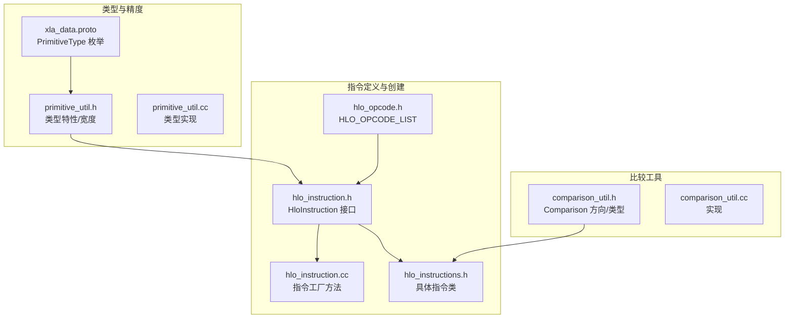
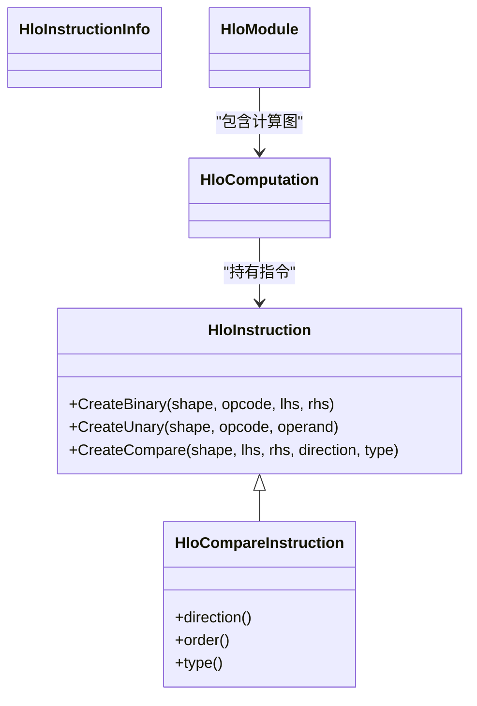
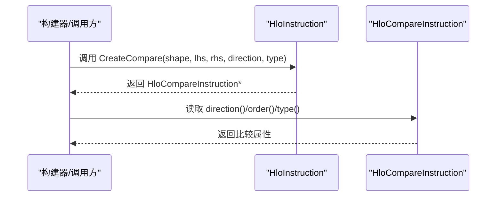
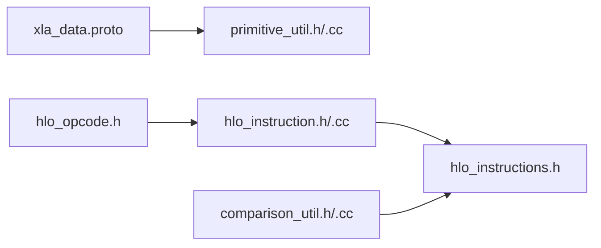

# 基础算术与逻辑指令

<cite>
**本文档引用的文件**
- [xla_data.proto](file://xla/xla_data.proto)
- [primitive_util.h](file://xla/primitive_util.h)
- [primitive_util.cc](file://xla/primitive_util.cc)
- [hlo_opcode.h](file://xla/hlo/ir/hlo_opcode.h)
- [hlo_instruction.h](file://xla/hlo/ir/hlo_instruction.h)
- [hlo_instruction.cc](file://xla/hlo/ir/hlo_instruction.cc)
- [hlo_instructions.h](file://xla/hlo/ir/hlo_instructions.h)
- [comparison_util.h](file://xla/comparison_util.h)
- [comparison_util.cc](file://xla/comparison_util.cc)
</cite>

## 目录
1. [简介](#简介)
2. [项目结构](#项目结构)
3. [核心组件](#核心组件)
4. [架构总览](#架构总览)
5. [详细组件分析](#详细组件分析)
6. [依赖关系分析](#依赖关系分析)
7. [性能考虑](#性能考虑)
8. [故障排查指南](#故障排查指南)
9. [结论](#结论)

## 简介
本文件系统性梳理XLA中基础算术与逻辑指令的实现与使用方法，覆盖以下内容：
- 基本数学运算：加法(kAdd)、减法(kSubtract)、乘法(kMultiply)、除法(kDivide)、取余(kRemainder)、幂运算(kPower)
- 逻辑运算：按位与(kAnd)、按位或(kOr)、按位异或(kXor)、按位非(kNot)
- 比较指令：kCompare 的比较方向与类型
- 数值精度处理、溢出行为与性能特征
- 不同数据类型上的行为差异与最佳实践

## 项目结构
围绕HLO指令的核心文件组织如下：
- 数据类型与精度：xla_data.proto（PrimitiveType枚举）、primitive_util.*（类型宽度、特性判断）
- 指令语义与创建：hlo_opcode.h（HLO操作码）、hlo_instruction.*（指令构建器与基类）
- 具体指令实现：hlo_instructions.h（各HLO子类，如HloCompareInstruction）
- 比较工具：comparison_util.*（比较方向/类型）

**图表来源**
- [xla_data.proto](file://xla/xla_data.proto#L27-L155)
- [primitive_util.h](file://xla/primitive_util.h#L44-L954)
- [hlo_opcode.h](file://xla/hlo/ir/hlo_opcode.h#L48-L182)
- [hlo_instruction.h](file://xla/hlo/ir/hlo_instruction.h#L383-L454)
- [hlo_instructions.h](file://xla/hlo/ir/hlo_instructions.h#L416-L443)
- [comparison_util.h](file://xla/comparison_util.h#L84-L120)

**章节来源**
- [xla_data.proto](file://xla/xla_data.proto#L27-L155)
- [primitive_util.h](file://xla/primitive_util.h#L44-L954)
- [hlo_opcode.h](file://xla/hlo/ir/hlo_opcode.h#L48-L182)
- [hlo_instruction.h](file://xla/hlo/ir/hlo_instruction.h#L383-L454)
- [hlo_instructions.h](file://xla/hlo/ir/hlo_instructions.h#L416-L443)
- [comparison_util.h](file://xla/comparison_util.h#L84-L120)

## 核心组件
- PrimitiveType与数据类型族
  - 支持布尔(PRED)、有符号/无符号整数(S*/U*)、浮点(F16/F32/F64/BF16及多种FP8/MX格式)、复数(C64/C128)等
  - 类型宽度与字节宽度查询、是否浮点/整数/复数等判定
- HLO操作码与指令创建
  - HLO_OPCODE_LIST 定义了kAdd/kSubtract/kMultiply/kDivide/kRemainder/kPower/kAnd/kOr/kXor/kNot/kCompare等
  - HloInstruction提供CreateBinary/CreateUnary/CreateCompare等静态工厂方法
- 比较指令
  - HloCompareInstruction封装比较方向与类型，支持多方向比较

**章节来源**
- [xla_data.proto](file://xla/xla_data.proto#L27-L155)
- [primitive_util.h](file://xla/primitive_util.h#L44-L954)
- [hlo_opcode.h](file://xla/hlo/ir/hlo_opcode.h#L48-L182)
- [hlo_instruction.h](file://xla/hlo/ir/hlo_instruction.h#L383-L454)
- [hlo_instructions.h](file://xla/hlo/ir/hlo_instructions.h#L416-L443)

## 架构总览
下图展示了基础算术/逻辑/比较指令在XLA中的层次关系与调用路径：

**图表来源**
- [hlo_instruction.h](file://xla/hlo/ir/hlo_instruction.h#L225-L454)
- [hlo_instructions.h](file://xla/hlo/ir/hlo_instructions.h#L416-L443)

**章节来源**
- [hlo_instruction.h](file://xla/hlo/ir/hlo_instruction.h#L225-L454)
- [hlo_instructions.h](file://xla/hlo/ir/hlo_instructions.h#L416-L443)

## 详细组件分析

### 基本数学运算指令
- 加法(kAdd)、减法(kSubtract)、乘法(kMultiply)、除法(kDivide)、取余(kRemainder)、幂运算(kPower)
- 运算语义与精度
  - 对于整数类型，遵循模算术；溢出行为由底层平台与后端决定，通常为二进制补码环绕
  - 对于浮点类型，遵循IEEE 754；除零产生无穷大或NaN，0/0产生NaN
  - 取余运算的符号遵循“被除数符号”，即 x % y 与 x 符号相同
  - 幂运算 kPower(a,b) 在不同类型上可能映射到指数/对数或查表实现，注意 a<0 且 b 非整数时的复数域处理
- 数据类型差异
  - 整数：S8/U8、S16/U16、S32/U32、S64/U64；注意位宽与溢出
  - 浮点：F16/BF16/F32/F64；注意精度损失与舍入模式
  - FP8/MX：动态范围与精度显著降低，需谨慎使用
- 性能特征
  - 向量化与SIMD：多数后端会将逐元素运算向量化
  - 精度配置：PrecisionConfig可影响中间精度，平衡吞吐与数值稳定
- 最佳实践
  - 明确指定输出形状与类型，避免隐式转换带来的额外开销
  - 浮点比较使用容差而非直接相等
  - 使用ReducePrecision进行可控降精度以提升吞吐

**章节来源**
- [xla_data.proto](file://xla/xla_data.proto#L27-L155)
- [primitive_util.h](file://xla/primitive_util.h#L44-L954)
- [hlo_opcode.h](file://xla/hlo/ir/hlo_opcode.h#L48-L182)

### 逻辑运算指令
- 按位与(kAnd)、按位或(kOr)、按位异或(kXor)、按位非(kNot)
- 适用类型
  - 主要用于整数类型(U1/U2/U4/S1/S2/S4及全部S*/U*)
  - 某些后端可能支持布尔(PRED)按位运算
- 行为特征
  - 逐位运算，保持输入形状一致
  - 对于U1/U2/U4，通常作为布尔/稀疏标记使用
- 性能与优化
  - 常被编译器映射为SIMD原语
  - 与广播/布局配合可减少内存访问

**章节来源**
- [hlo_opcode.h](file://xla/hlo/ir/hlo_opcode.h#L48-L182)
- [xla_data.proto](file://xla/xla_data.proto#L27-L155)

### 比较指令 kCompare
- 比较方向
  - 大于/小于/等于/不等于/大于等于/小于等于等
  - 通过ComparisonDirection枚举表达
- 比较类型
  - 支持数值比较与字典序比较（字符串/元组）
  - 某些类型支持有序比较（如浮点的全序/弱序）
- 输出与用途
  - 输出为PRED（布尔）张量，常用于Select/Where/Sort等控制流
- 实现要点
  - HloCompareInstruction封装比较方向与类型
  - 与比较工具comparison_util协作处理方向/顺序

**图表来源**
- [hlo_instruction.h](file://xla/hlo/ir/hlo_instruction.h#L449-L454)
- [hlo_instructions.h](file://xla/hlo/ir/hlo_instructions.h#L416-L443)
- [comparison_util.h](file://xla/comparison_util.h#L84-L120)

**章节来源**
- [hlo_instruction.h](file://xla/hlo/ir/hlo_instruction.h#L449-L454)
- [hlo_instructions.h](file://xla/hlo/ir/hlo_instructions.h#L416-L443)
- [comparison_util.h](file://xla/comparison_util.h#L84-L120)

### 指令创建与优化示例（路径指引）
- 创建二元算术/逻辑/比较指令
  - 参考路径：HloInstruction::CreateBinary/HloInstruction::CreateUnary/HloInstruction::CreateCompare
  - 示例路径：见下方“章节来源”中对应行号
- 比较指令属性读取
  - 参考路径：HloCompareInstruction::direction/order/type
- 数据类型宽度与精度
  - 参考路径：primitive_util::BitWidth/ByteWidth/IsFloatingPointType/IsIntegralType等

**章节来源**
- [hlo_instruction.h](file://xla/hlo/ir/hlo_instruction.h#L383-L454)
- [hlo_instructions.h](file://xla/hlo/ir/hlo_instructions.h#L416-L443)
- [primitive_util.h](file://xla/primitive_util.h#L44-L954)

## 依赖关系分析
- 类型系统依赖
  - PrimitiveType定义来源于xla_data.proto，primitive_util基于其提供类型特性查询
- 指令依赖
  - HloInstruction是所有指令的基类，具体指令（如HloCompareInstruction）继承自它
  - HLO_OPCODE_LIST在hlo_opcode.h中声明，HloInstruction通过opcode识别指令种类
- 比较工具依赖
  - HloCompareInstruction依赖comparison_util提供的比较方向/类型

**图表来源**
- [xla_data.proto](file://xla/xla_data.proto#L27-L155)
- [primitive_util.h](file://xla/primitive_util.h#L44-L954)
- [hlo_opcode.h](file://xla/hlo/ir/hlo_opcode.h#L48-L182)
- [hlo_instruction.h](file://xla/hlo/ir/hlo_instruction.h#L225-L454)
- [hlo_instructions.h](file://xla/hlo/ir/hlo_instructions.h#L416-L443)
- [comparison_util.h](file://xla/comparison_util.h#L84-L120)

**章节来源**
- [xla_data.proto](file://xla/xla_data.proto#L27-L155)
- [primitive_util.h](file://xla/primitive_util.h#L44-L954)
- [hlo_opcode.h](file://xla/hlo/ir/hlo_opcode.h#L48-L182)
- [hlo_instruction.h](file://xla/hlo/ir/hlo_instruction.h#L225-L454)
- [hlo_instructions.h](file://xla/hlo/ir/hlo_instructions.h#L416-L443)
- [comparison_util.h](file://xla/comparison_util.h#L84-L120)

## 性能考虑
- 精度与吞吐
  - 使用较低精度（如F16/BF16）可提升吞吐，但需关注数值稳定性
  - ReducePrecision可用于显式控制中间精度
- 向量化与布局
  - 尽量保持连续布局与对齐，减少跨步访问
  - 利用广播避免不必要的复制
- 溢出与分支
  - 整数运算溢出为环绕，避免在热路径中依赖特定溢出行为
  - 浮点运算注意NaN传播与无穷大处理

## 故障排查指南
- 比较结果异常
  - 检查比较方向与类型设置是否正确
  - 浮点比较建议使用容差而非直接相等
- 精度问题
  - 确认输入/输出类型与期望一致
  - 必要时插入ReducePrecision或转换节点
- 溢出与未定义行为
  - 整数运算避免依赖环绕语义
  - 对负数幂/对数等函数输入进行边界检查

## 结论
XLA的基础算术与逻辑指令通过统一的HLO IR抽象与类型系统实现跨后端的一致行为。理解PrimitiveType族、HLO操作码与指令创建接口，有助于在不同数据类型与精度下获得稳定的性能与正确的数值行为。结合比较工具与精度控制，可在工程实践中实现高效且可靠的数值计算流水线。