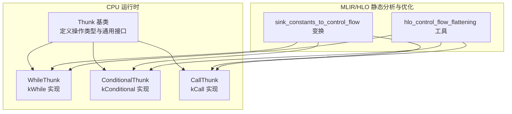
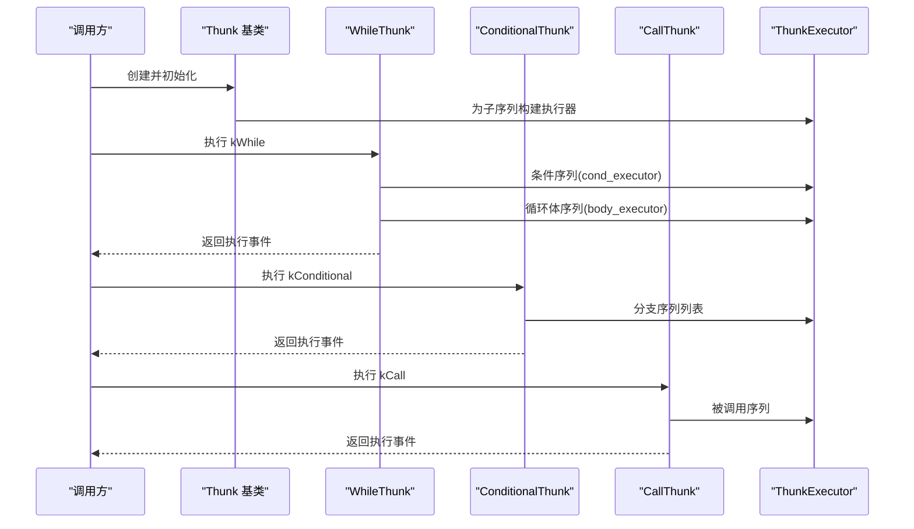
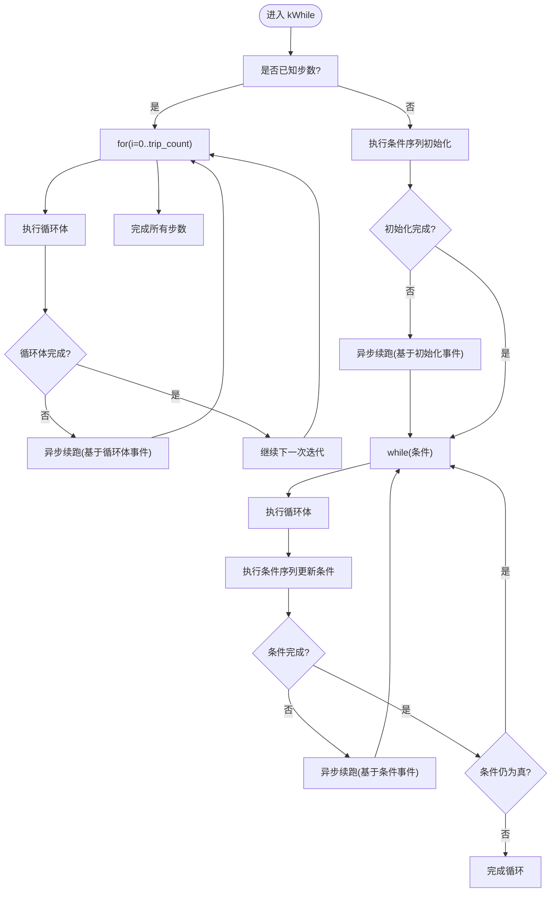
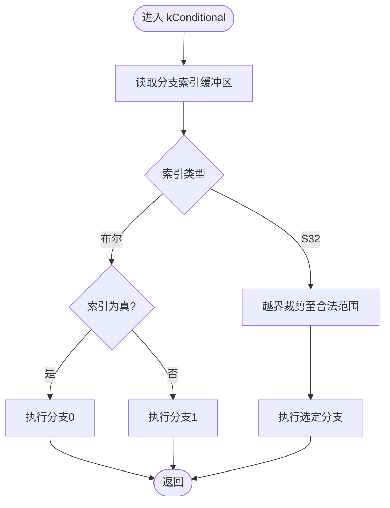
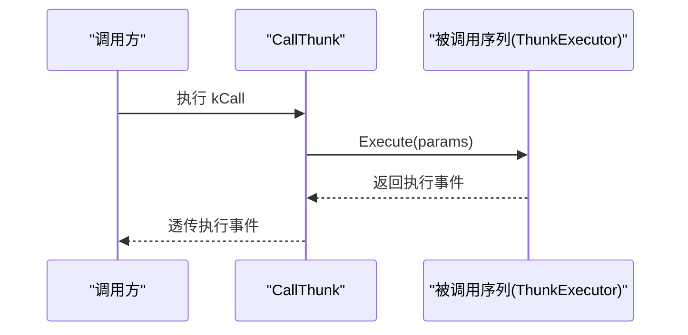
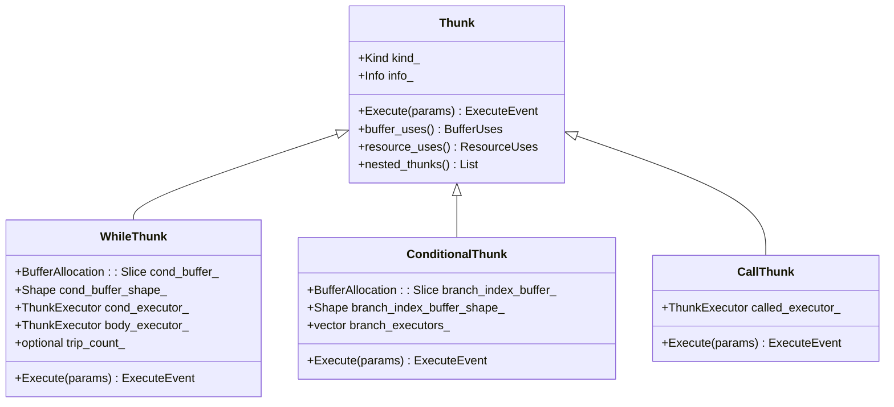
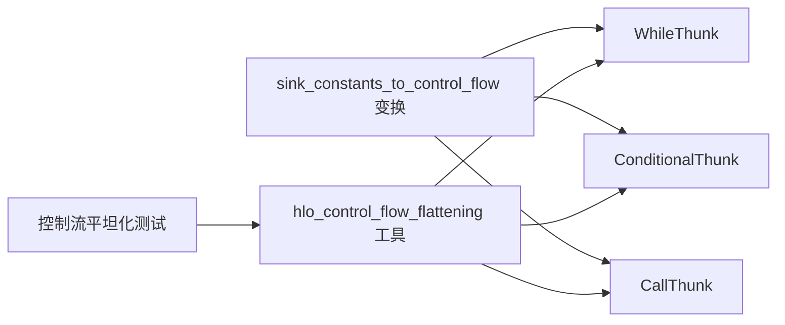

# 控制流指令

<cite>
**本文引用的文件**
- [xla/backends/cpu/runtime/thunk.cc](file://xla/backends/cpu/runtime/thunk.cc)
- [xla/backends/cpu/runtime/conditional_thunk.cc](file://xla/backends/cpu/runtime/conditional_thunk.cc)
- [xla/backends/cpu/runtime/call_thunk.cc](file://xla/backends/cpu/runtime/call_thunk.cc)
- [xla/backends/cpu/runtime/while_thunk.cc](file://xla/backends/cpu/runtime/while_thunk.cc)
- [xla/mlir_hlo/mhlo/transforms/sink_constants_to_control_flow/sink_constants_to_control_flow.cc](file://xla/mlir_hlo/mhlo/transforms/sink_constants_to_control_flow/sink_constants_to_control_flow.cc)
- [xla/mlir_hlo/stablehlo_ext/transforms/sink_constants_to_control_flow.cpp](file://xla/mlir_hlo/stablehlo_ext/transforms/sink_constants_to_control_flow.cpp)
- [xla/tools/hlo_control_flow_flattening.cc](file://xla/tools/hlo_control_flow_flattening.cc)
- [xla/tools/hlo_control_flow_flattening.h](file://xla/tools/hlo_control_flow_flattening.h)
- [xla/tools/hlo_control_flow_flattening_test.cc](file://xla/tools/hlo_control_flow_flattening_test.cc)
</cite>

## 目录
1. [引言](#引言)
2. [项目结构](#项目结构)
3. [核心组件](#核心组件)
4. [架构总览](#架构总览)
5. [详细组件分析](#详细组件分析)
6. [依赖关系分析](#依赖关系分析)
7. [性能考量](#性能考量)
8. [故障排查指南](#故障排查指南)
9. [结论](#结论)
10. [附录](#附录)

## 引言
本文件系统性梳理XLA后端CPU运行时中与控制流相关的关键指令：while循环（kWhile）、条件分支（kConditional）与函数调用（kCall）。围绕这些指令，我们从实现细节、数据与控制流、错误处理、性能优化到静态分析与分布式执行注意事项进行深入说明，并给出复杂控制流图的构建思路与验证建议。

## 项目结构
与控制流指令直接相关的实现位于CPU运行时层，分别以独立的Thunk类封装不同类型的控制流行为；同时，MLIR/HLO侧提供了针对常量下沉、控制流平坦化等静态分析与优化的工具与变换。

**图表来源**
- [xla/backends/cpu/runtime/thunk.cc](file://xla/backends/cpu/runtime/thunk.cc#L53-L94)
- [xla/backends/cpu/runtime/while_thunk.cc](file://xla/backends/cpu/runtime/while_thunk.cc#L48-L74)
- [xla/backends/cpu/runtime/conditional_thunk.cc](file://xla/backends/cpu/runtime/conditional_thunk.cc#L66-L92)
- [xla/backends/cpu/runtime/call_thunk.cc](file://xla/backends/cpu/runtime/call_thunk.cc#L33-L43)
- [xla/mlir_hlo/mhlo/transforms/sink_constants_to_control_flow/sink_constants_to_control_flow.cc](file://xla/mlir_hlo/mhlo/transforms/sink_constants_to_control_flow/sink_constants_to_control_flow.cc)
- [xla/mlir_hlo/stablehlo_ext/transforms/sink_constants_to_control_flow.cpp](file://xla/mlir_hlo/stablehlo_ext/transforms/sink_constants_to_control_flow.cpp)
- [xla/tools/hlo_control_flow_flattening.cc](file://xla/tools/hlo_control_flow_flattening.cc)
- [xla/tools/hlo_control_flow_flattening.h](file://xla/tools/hlo_control_flow_flattening.h)

**章节来源**
- [xla/backends/cpu/runtime/thunk.cc](file://xla/backends/cpu/runtime/thunk.cc#L53-L94)
- [xla/backends/cpu/runtime/while_thunk.cc](file://xla/backends/cpu/runtime/while_thunk.cc#L48-L74)
- [xla/backends/cpu/runtime/conditional_thunk.cc](file://xla/backends/cpu/runtime/conditional_thunk.cc#L66-L92)
- [xla/backends/cpu/runtime/call_thunk.cc](file://xla/backends/cpu/runtime/call_thunk.cc#L33-L43)

## 核心组件
- Thunk基类与Kind枚举：统一描述操作类型（含kWhile/kConditional/kCall），并提供通用的执行会话、事件编码与序列遍历能力。
- WhileThunk：封装while循环的条件检查、循环体执行与退出机制，支持静态步数与动态条件两种模式，并内置同步/异步执行路径。
- ConditionalThunk：根据分支索引（布尔或32位整型）选择对应分支序列执行，支持越界回退至最后一个分支。
- CallThunk：对被调用序列的直接转发执行，便于在运行时组织函数式控制流。

**章节来源**
- [xla/backends/cpu/runtime/thunk.cc](file://xla/backends/cpu/runtime/thunk.cc#L53-L94)
- [xla/backends/cpu/runtime/while_thunk.cc](file://xla/backends/cpu/runtime/while_thunk.cc#L76-L167)
- [xla/backends/cpu/runtime/conditional_thunk.cc](file://xla/backends/cpu/runtime/conditional_thunk.cc#L94-L127)
- [xla/backends/cpu/runtime/call_thunk.cc](file://xla/backends/cpu/runtime/call_thunk.cc#L45-L48)

## 架构总览
下图展示了控制流指令在运行时的执行路径与嵌套关系：While/Conditional/Call均通过Thunk抽象统一调度，内部以ThunkExecutor管理各自子序列的执行；MLIR/HLO侧的变换与工具则在编译期对常量与控制流进行静态优化与平坦化。

**图表来源**
- [xla/backends/cpu/runtime/while_thunk.cc](file://xla/backends/cpu/runtime/while_thunk.cc#L48-L74)
- [xla/backends/cpu/runtime/conditional_thunk.cc](file://xla/backends/cpu/runtime/conditional_thunk.cc#L66-L92)
- [xla/backends/cpu/runtime/call_thunk.cc](file://xla/backends/cpu/runtime/call_thunk.cc#L33-L43)

## 详细组件分析

### While 循环（kWhile）
- 条件检查与初始化
  - 支持静态已知步数与动态条件两种路径。当步数已知时走for风格路径，否则先执行一次条件序列以初始化条件变量。
- 循环体执行
  - 每次迭代先执行循环体，再执行条件序列更新条件。若任一步骤返回未就绪事件，则切换到异步路径，使用事件依赖继续后续迭代。
- 退出机制
  - 当条件变为假或完成指定步数后，返回成功事件；若中间出现错误，立即向调用者传播。
- 缓冲区与资源使用
  - 写入条件缓冲区（PRED标量），汇总子序列的缓冲区与资源使用情况。

**图表来源**
- [xla/backends/cpu/runtime/while_thunk.cc](file://xla/backends/cpu/runtime/while_thunk.cc#L100-L167)
- [xla/backends/cpu/runtime/while_thunk.cc](file://xla/backends/cpu/runtime/while_thunk.cc#L169-L283)

**章节来源**
- [xla/backends/cpu/runtime/while_thunk.cc](file://xla/backends/cpu/runtime/while_thunk.cc#L48-L74)
- [xla/backends/cpu/runtime/while_thunk.cc](file://xla/backends/cpu/runtime/while_thunk.cc#L76-L167)
- [xla/backends/cpu/runtime/while_thunk.cc](file://xla/backends/cpu/runtime/while_thunk.cc#L285-L307)

### Conditional 分支（kConditional）
- 分支选择逻辑
  - 支持布尔与32位整型两种索引类型。布尔时按true/false映射到两个分支；整型时进行越界裁剪，越界默认执行最后一个分支。
- 参数传递
  - 通过共享的缓冲区切片读取分支索引，随后将该索引用于选择对应分支序列执行。
- 资源与缓冲区使用
  - 仅读取分支索引缓冲区，合并各分支序列的缓冲区与资源使用。

**图表来源**
- [xla/backends/cpu/runtime/conditional_thunk.cc](file://xla/backends/cpu/runtime/conditional_thunk.cc#L94-L127)

**章节来源**
- [xla/backends/cpu/runtime/conditional_thunk.cc](file://xla/backends/cpu/runtime/conditional_thunk.cc#L66-L92)
- [xla/backends/cpu/runtime/conditional_thunk.cc](file://xla/backends/cpu/runtime/conditional_thunk.cc#L94-L127)
- [xla/backends/cpu/runtime/conditional_thunk.cc](file://xla/backends/cpu/runtime/conditional_thunk.cc#L129-L146)

### Call 函数调用（kCall）
- 调用约定与参数绑定
  - 通过ThunkExecutor封装被调用序列，执行时直接转发当前执行参数（缓冲区分配、设备信息等）给被调用序列。
- 返回值处理
  - 返回被调用序列的最终执行事件，保持调用链的一致性。
- 嵌套与调试
  - 提供嵌套序列名称以便在调试与可视化中识别被调用序列。

**图表来源**
- [xla/backends/cpu/runtime/call_thunk.cc](file://xla/backends/cpu/runtime/call_thunk.cc#L45-L48)

**章节来源**
- [xla/backends/cpu/runtime/call_thunk.cc](file://xla/backends/cpu/runtime/call_thunk.cc#L33-L43)
- [xla/backends/cpu/runtime/call_thunk.cc](file://xla/backends/cpu/runtime/call_thunk.cc#L45-L62)

### 类关系与依赖

**图表来源**
- [xla/backends/cpu/runtime/thunk.cc](file://xla/backends/cpu/runtime/thunk.cc#L96-L189)
- [xla/backends/cpu/runtime/while_thunk.cc](file://xla/backends/cpu/runtime/while_thunk.cc#L65-L74)
- [xla/backends/cpu/runtime/conditional_thunk.cc](file://xla/backends/cpu/runtime/conditional_thunk.cc#L85-L92)
- [xla/backends/cpu/runtime/call_thunk.cc](file://xla/backends/cpu/runtime/call_thunk.cc#L41-L43)

## 依赖关系分析
- 运行时依赖
  - While/Conditional/Call均依赖Thunk基类提供的Kind标识、事件模型与缓冲区使用统计；通过ThunkExecutor对子序列进行统一调度。
- 编译期优化与静态分析
  - sink_constants_to_control_flow：将常量下沉到控制流分支，减少不必要的分支开销。
  - hlo_control_flow_flattening：将嵌套或复杂的控制流结构平坦化，便于后续优化与执行。
- 测试与验证
  - 提供针对控制流平坦化的测试用例，确保变换前后语义一致。

**图表来源**
- [xla/mlir_hlo/mhlo/transforms/sink_constants_to_control_flow/sink_constants_to_control_flow.cc](file://xla/mlir_hlo/mhlo/transforms/sink_constants_to_control_flow/sink_constants_to_control_flow.cc)
- [xla/mlir_hlo/stablehlo_ext/transforms/sink_constants_to_control_flow.cpp](file://xla/mlir_hlo/stablehlo_ext/transforms/sink_constants_to_control_flow.cpp)
- [xla/tools/hlo_control_flow_flattening.cc](file://xla/tools/hlo_control_flow_flattening.cc)
- [xla/tools/hlo_control_flow_flattening.h](file://xla/tools/hlo_control_flow_flattening.h)
- [xla/tools/hlo_control_flow_flattening_test.cc](file://xla/tools/hlo_control_flow_flattening_test.cc)

**章节来源**
- [xla/mlir_hlo/mhlo/transforms/sink_constants_to_control_flow/sink_constants_to_control_flow.cc](file://xla/mlir_hlo/mhlo/transforms/sink_constants_to_control_flow/sink_constants_to_control_flow.cc)
- [xla/mlir_hlo/stablehlo_ext/transforms/sink_constants_to_control_flow.cpp](file://xla/mlir_hlo/stablehlo_ext/transforms/sink_constants_to_control_flow.cpp)
- [xla/tools/hlo_control_flow_flattening.cc](file://xla/tools/hlo_control_flow_flattening.cc)
- [xla/tools/hlo_control_flow_flattening.h](file://xla/tools/hlo_control_flow_flattening.h)
- [xla/tools/hlo_control_flow_flattening_test.cc](file://xla/tools/hlo_control_flow_flattening_test.cc)

## 性能考量
- 同步/异步执行路径
  - WhileThunk在检测到子序列未就绪时，采用异步续跑（FlatMap/AndThen）避免阻塞主线程，提升并发度与吞吐。
- 静态步数优化
  - 对于静态步数的循环，优先走for路径，减少条件判断与事件等待成本。
- 缓冲区与资源复用
  - 通过buffer_uses/resource_uses聚合子序列使用情况，有助于内存与资源规划。
- 常量下沉与控制流平坦化
  - 在编译期将常量下沉到分支，减少分支内的冗余计算；平坦化控制流降低嵌套层级，利于后续融合与并行化。

**章节来源**
- [xla/backends/cpu/runtime/while_thunk.cc](file://xla/backends/cpu/runtime/while_thunk.cc#L100-L167)
- [xla/backends/cpu/runtime/while_thunk.cc](file://xla/backends/cpu/runtime/while_thunk.cc#L169-L283)
- [xla/mlir_hlo/mhlo/transforms/sink_constants_to_control_flow/sink_constants_to_control_flow.cc](file://xla/mlir_hlo/mhlo/transforms/sink_constants_to_control_flow/sink_constants_to_control_flow.cc)
- [xla/tools/hlo_control_flow_flattening.cc](file://xla/tools/hlo_control_flow_flattening.cc)

## 故障排查指南
- 错误传播
  - 若子序列执行返回错误事件，运行时将错误直接传播至上层调用者，便于快速定位问题。
- 条件缓冲区校验
  - WhileThunk要求条件缓冲区大小为布尔类型，不满足将返回内部错误；请确认条件序列正确写入PRED标量。
- 分支索引合法性
  - ConditionalThunk对越界分支索引采用回退策略（默认执行最后一个分支），若业务期望严格校验，请在上层逻辑中显式检查索引范围。
- 调试与可视化
  - 通过nested_thunks输出的命名序列，结合执行事件编码，可辅助定位具体分支或循环体位置。

**章节来源**
- [xla/backends/cpu/runtime/while_thunk.cc](file://xla/backends/cpu/runtime/while_thunk.cc#L56-L58)
- [xla/backends/cpu/runtime/conditional_thunk.cc](file://xla/backends/cpu/runtime/conditional_thunk.cc#L107-L111)
- [xla/backends/cpu/runtime/thunk.cc](file://xla/backends/cpu/runtime/thunk.cc#L178-L184)

## 结论
kWhile/kConditional/kCall三类控制流指令在XLA CPU运行时中通过统一的Thunk抽象与事件驱动模型实现高效执行。WhileThunk在静态步数与动态条件之间灵活切换，并提供完善的异步续跑机制；ConditionalThunk以简单直观的方式支持多分支选择与越界保护；CallThunk则为函数式控制流提供轻量封装。配合MLIR/HLO侧的常量下沉与控制流平坦化工具，可在编译期进一步优化控制流的性能与可维护性。

## 附录
- 复杂控制流图构建建议
  - 将嵌套循环与条件分支尽量平坦化，减少深层嵌套带来的调度与内存压力。
  - 在分支内进行常量下沉，避免重复计算。
  - 明确循环步数或终止条件，优先使用静态步数以获得更优的执行路径。
- 验证规则与静态分析
  - 确保条件缓冲区为PRED标量且大小正确。
  - 分支索引类型与取值范围符合预期，必要时在上层做边界检查。
  - 使用控制流平坦化工具进行回归测试，保证变换前后语义一致。