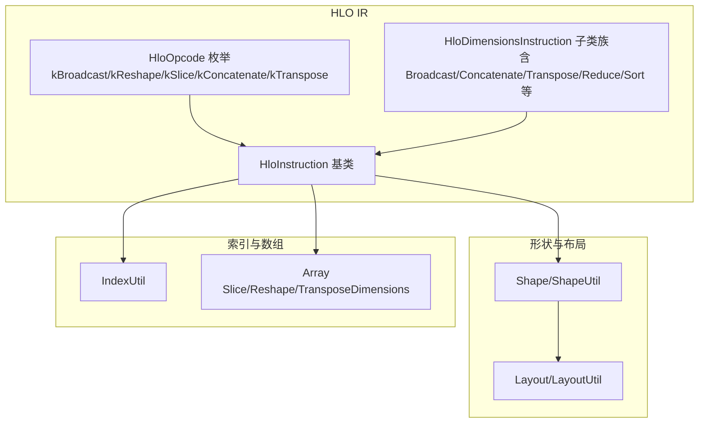
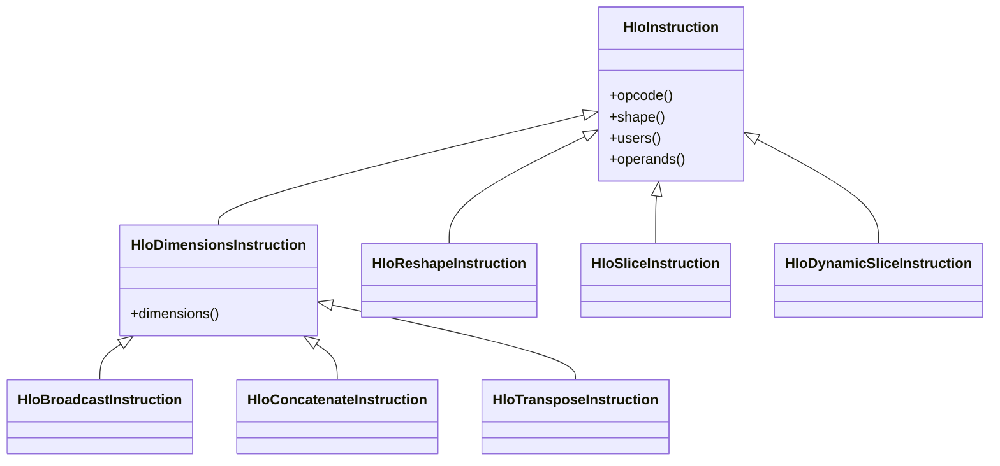
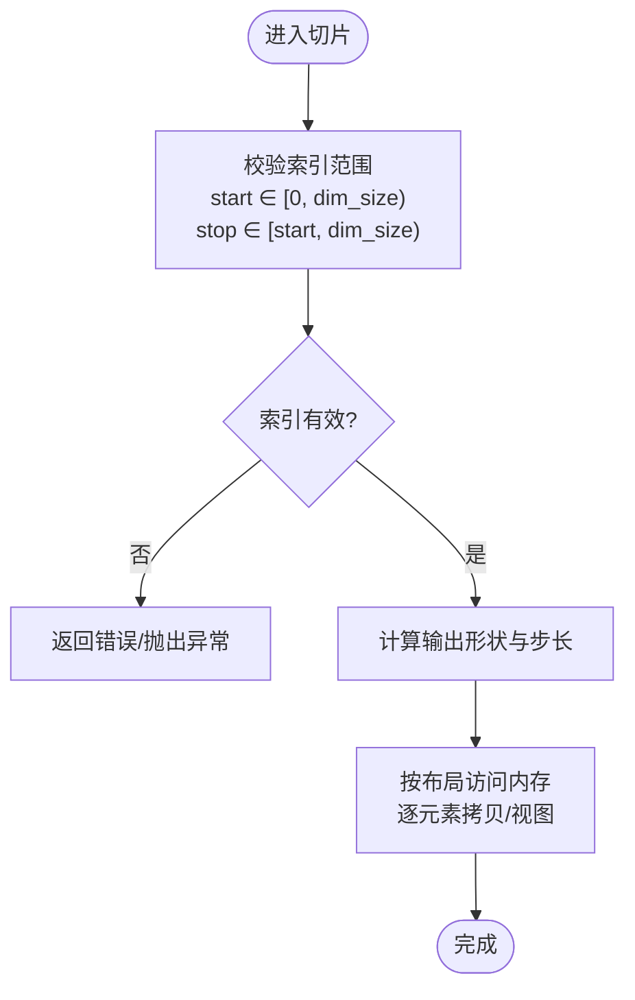
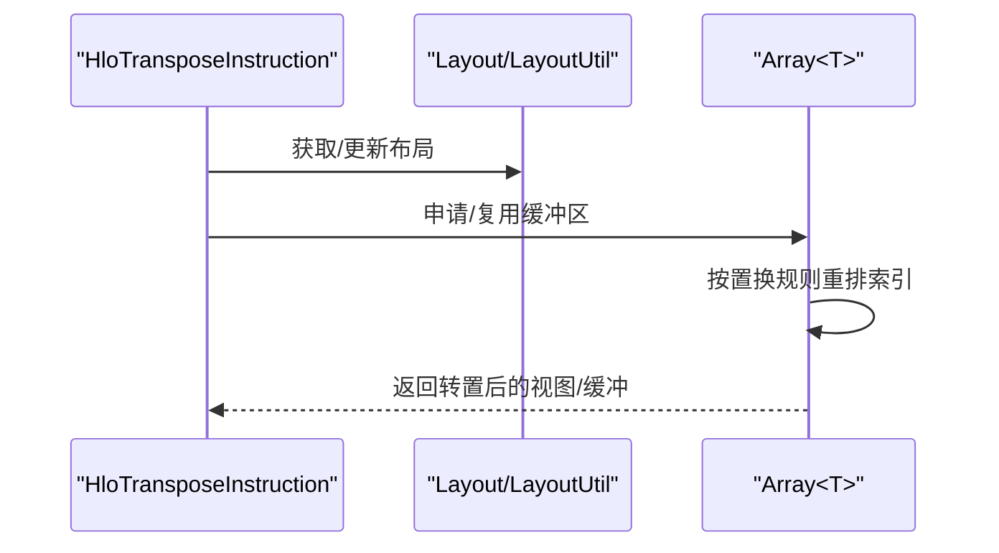
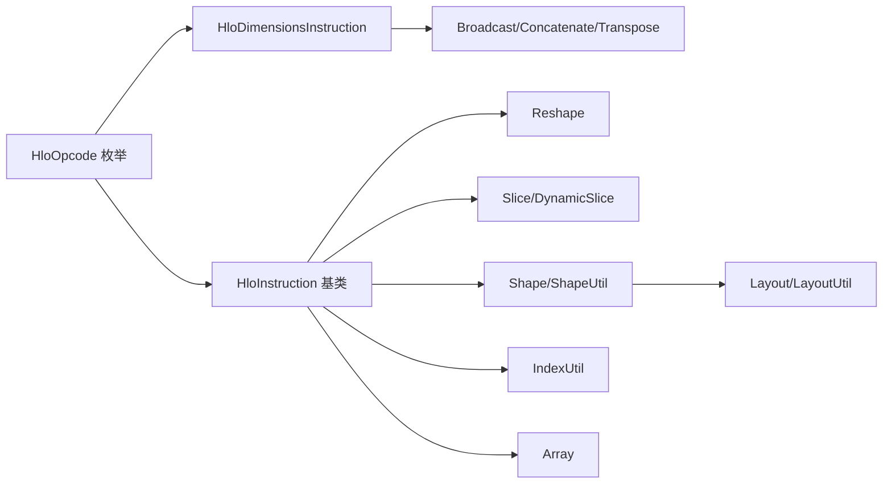

# 数据移动指令

<cite>
**本文引用的文件**
- [hlo_opcode.h](file://xla/hlo/ir/hlo_opcode.h)
- [hlo_instruction.h](file://xla/hlo/ir/hlo_instruction.h)
- [hlo_instructions.h](file://xla/hlo/ir/hlo_instructions.h)
- [layout.h](file://xla/layout.h)
- [layout_util.h](file://xla/layout_util.h)
- [shape_util.h](file://xla/shape_util.h)
- [index_util.h](file://xla/index_util.h)
- [array.h](file://xla/array.h)
- [hlo_computation.h](file://xla/hlo/ir/hlo_computation.h)
- [hlo_instructions.h](file://xla/hlo/ir/hlo_instructions.h)
- [hlo_opcode.h](file://xla/hlo/ir/hlo_opcode.h)
- [hlo_instruction.h](file://xla/hlo/ir/hlo_instruction.h)
- [hlo_instructions.h](file://xla/hlo/ir/hlo_instructions.h)
- [layout.h](file://xla/layout.h)
- [layout_util.h](file://xla/layout_util.h)
- [shape_util.h](file://xla/shape_util.h)
- [index_util.h](file://xla/index_util.h)
- [array.h](file://xla/array.h)
- [hlo_computation.h](file://xla/hlo/ir/hlo_computation.h)
</cite>

## 目录
1. [简介](#简介)
2. [项目结构](#项目结构)
3. [核心组件](#核心组件)
4. [架构总览](#架构总览)
5. [详细组件分析](#详细组件分析)
6. [依赖关系分析](#依赖关系分析)
7. [性能考量](#性能考量)
8. [故障排查指南](#故障排查指南)
9. [结论](#结论)
10. [附录](#附录)

## 简介
本文件系统性梳理XLA HLO（高阶语言优化器）中的“数据移动与变换”类指令，重点覆盖以下五类：广播（kBroadcast）、重塑（kReshape）、切片（kSlice/kDynamicSlice）、拼接（kConcatenate）与转置（kTranspose）。内容涵盖：
- 指令语义与维度/布局规则
- 形状变换与内存布局变化
- 索引范围与边界处理
- 典型使用场景与代码路径参考
- 内存访问模式、缓存友好性与性能优化建议
- 在张量计算中的作用与最佳实践

## 项目结构
围绕数据移动指令，相关代码主要分布在如下模块：
- HLO指令枚举与基础类型：xla/hlo/ir/hlo_opcode.h、xla/hlo/ir/hlo_instruction.h、xla/hlo/ir/hlo_instructions.h
- 形状与布局工具：xla/shape_util.h、xla/layout.h、xla/layout_util.h
- 索引与数组工具：xla/index_util.h、xla/array.h
- 计算图与指令容器：xla/hlo/ir/hlo_computation.h

**图表来源**
- [hlo_opcode.h](file://xla/hlo/ir/hlo_opcode.h#L48-L182)
- [hlo_instruction.h](file://xla/hlo/ir/hlo_instruction.h#L225-L301)
- [hlo_instructions.h](file://xla/hlo/ir/hlo_instructions.h#L60-L97)
- [shape_util.h](file://xla/shape_util.h)
- [layout.h](file://xla/layout.h)
- [layout_util.h](file://xla/layout_util.h)
- [index_util.h](file://xla/index_util.h)
- [array.h](file://xla/array.h#L477-L576)

**章节来源**
- [hlo_opcode.h](file://xla/hlo/ir/hlo_opcode.h#L48-L182)
- [hlo_instruction.h](file://xla/hlo/ir/hlo_instruction.h#L225-L301)
- [hlo_instructions.h](file://xla/hlo/ir/hlo_instructions.h#L60-L97)

## 核心组件
- HloOpcode枚举：定义了kBroadcast、kReshape、kSlice、kConcatenate、kTranspose等指令类型，用于统一识别与分派。
- HloInstruction/HloDimensionsInstruction：作为指令基类与带维度属性指令的抽象，承载形状、布局、维度参数等信息。
- 形状与布局工具：Shape/ShapeUtil负责形状推断与校验；Layout/LayoutUtil负责内存布局与维度排列。
- 数组与索引工具：Array<T>提供切片、重塑、转置等原地操作；IndexUtil提供索引计算与边界检查。

**章节来源**
- [hlo_opcode.h](file://xla/hlo/ir/hlo_opcode.h#L48-L182)
- [hlo_instruction.h](file://xla/hlo/ir/hlo_instruction.h#L225-L301)
- [hlo_instructions.h](file://xla/hlo/ir/hlo_instructions.h#L60-L97)
- [shape_util.h](file://xla/shape_util.h)
- [layout.h](file://xla/layout.h)
- [layout_util.h](file://xla/layout_util.h)
- [index_util.h](file://xla/index_util.h)
- [array.h](file://xla/array.h#L477-L576)

## 架构总览
数据移动指令在HLO IR中以指令节点形式存在，通过HloInstruction及其子类表达不同语义。它们共享形状与布局信息，并在后端生成时映射到具体内存访问与并行策略。

**图表来源**
- [hlo_instruction.h](file://xla/hlo/ir/hlo_instruction.h#L225-L301)
- [hlo_instructions.h](file://xla/hlo/ir/hlo_instructions.h#L60-L97)

## 详细组件分析

### 广播（kBroadcast）
- 语义：将较小的输入张量在特定维度上重复扩展，使其形状与目标输出一致。广播遵循“向右对齐”的维度规则，长度为1的维度可被广播。
- 维度扩展规则：
  - 输入与输出的尾部维度需满足广播兼容性（对应维度相等或其中一方为1）。
  - 广播模式由HloDimensionsInstruction携带的维度列表决定，通常为需要扩展的维度集合。
- 性能要点：
  - 广播不改变内存布局，仅在读取时按标量复制，避免显式内存拷贝。
  - 合理规划布局可减少跨步访问带来的缓存抖动。

**章节来源**
- [hlo_opcode.h](file://xla/hlo/ir/hlo_opcode.h#L76-L76)
- [hlo_instructions.h](file://xla/hlo/ir/hlo_instructions.h#L60-L97)

### 重塑（kReshape）
- 语义：保持元素总数不变的前提下，改变张量的形状；不改变内存布局顺序。
- 形状变换与内存布局：
  - 新旧形状的元素总数必须一致。
  - 重塑不涉及数据重排，仅在逻辑层改变形状；底层仍按原布局访问。
- 性能要点：
  - 重塑是O(1)操作，但后续算子若访问跨越新形状的维度，可能引入非连续访问，需结合布局规划。

**章节来源**
- [hlo_opcode.h](file://xla/hlo/ir/hlo_opcode.h#L147-L147)
- [array.h](file://xla/array.h#L538-L540)

### 切片（kSlice/kDynamicSlice）
- 语义：从输入张量中选取一个矩形区域；kSlice为静态切片，kDynamicSlice支持动态起止索引。
- 索引范围与边界处理：
  - 起止索引需落在[0, dim_size)范围内；越界将触发验证错误。
  - 切片区域大小等于stop - start。
- 内存访问模式：
  - 连续切片通常带来良好的缓存局部性；跨步或非标准步长可能降低缓存命中率。

**图表来源**
- [hlo_opcode.h](file://xla/hlo/ir/hlo_opcode.h#L104-L104)
- [hlo_opcode.h](file://xla/hlo/ir/hlo_opcode.h#L169-L169)
- [index_util.h](file://xla/index_util.h)

**章节来源**
- [hlo_opcode.h](file://xla/hlo/ir/hlo_opcode.h#L104-L104)
- [hlo_opcode.h](file://xla/hlo/ir/hlo_opcode.h#L169-L169)
- [index_util.h](file://xla/index_util.h)

### 拼接（kConcatenate）
- 语义：沿给定维度将多个张量连接成一个张量。
- 维度规则：
  - 除拼接维度外，其他维度必须完全相同。
  - 输出拼接维度大小等于各输入该维度大小之和。
- 性能要点：
  - 连续拼接（沿最后或常用维度）更利于缓存与流水线。
  - 后端常采用多路合并策略或专用内核优化。

**章节来源**
- [hlo_opcode.h](file://xla/hlo/ir/hlo_opcode.h#L89-L89)
- [hlo_instructions.h](file://xla/hlo/ir/hlo_instructions.h#L60-L97)

### 转置（kTranspose）
- 语义：重新排列张量的维度顺序，形成新的形状。
- 维度与布局：
  - 通过维度置换向量permute实现；输出形状为输入形状按permute重排。
  - 转置不改变元素值，仅改变访问顺序；布局随之调整。
- 实现细节（参考数组库）：
  - 提供二维与高维转置实现，内部通过重排索引映射访问。

**图表来源**
- [hlo_opcode.h](file://xla/hlo/ir/hlo_opcode.h#L177-L177)
- [array.h](file://xla/array.h#L551-L558)
- [array.h](file://xla/array.h#L574-L576)

**章节来源**
- [hlo_opcode.h](file://xla/hlo/ir/hlo_opcode.h#L177-L177)
- [array.h](file://xla/array.h#L551-L558)
- [array.h](file://xla/array.h#L574-L576)

## 依赖关系分析
- 指令类型依赖：kBroadcast/kConcatenate/kTranspose继承自HloDimensionsInstruction，共享维度属性；kReshape/kSlice/kDynamicSlice为独立指令类型。
- 形状与布局依赖：所有指令均依赖Shape/ShapeUtil进行形状一致性检查；Layout/LayoutUtil用于内存布局与维度排列。
- 索引与数组依赖：IndexUtil提供索引计算与边界校验；Array<T>提供切片、重塑、转置等原地操作能力。

**图表来源**
- [hlo_opcode.h](file://xla/hlo/ir/hlo_opcode.h#L48-L182)
- [hlo_instructions.h](file://xla/hlo/ir/hlo_instructions.h#L60-L97)
- [shape_util.h](file://xla/shape_util.h)
- [layout.h](file://xla/layout.h)
- [layout_util.h](file://xla/layout_util.h)
- [index_util.h](file://xla/index_util.h)
- [array.h](file://xla/array.h#L477-L576)

**章节来源**
- [hlo_opcode.h](file://xla/hlo/ir/hlo_opcode.h#L48-L182)
- [hlo_instructions.h](file://xla/hlo/ir/hlo_instructions.h#L60-L97)
- [shape_util.h](file://xla/shape_util.h)
- [layout.h](file://xla/layout.h)
- [layout_util.h](file://xla/layout_util.h)
- [index_util.h](file://xla/index_util.h)
- [array.h](file://xla/array.h#L477-L576)

## 性能考量
- 缓存友好性
  - 尽量沿内存连续维度进行切片与拼接，避免跨步访问。
  - 对于转置，优先选择相邻维度的交换，减少重排成本。
- 内存访问模式
  - 广播不复制数据，但读取时的重复访问可能放大缓存压力，应结合计算模式优化。
  - 重塑不改变布局，但后续算子的访问模式可能引入非连续访问，需配合布局规划。
- 优化建议
  - 合理安排布局（如NCHW/NHWC），使常用访问维度具有连续性。
  - 避免频繁的小粒度切片，尽量批量化或重排以提升吞吐。
  - 在GPU/CPU后端，利用专用内核（如拼接/转置）以获得更高效率。

[本节为通用指导，无需列出具体文件来源]

## 故障排查指南
- 形状不匹配
  - 症状：拼接/广播时报错，提示维度不兼容。
  - 排查：确认除拼接维度外其余维度完全一致；广播维度是否为1或相等。
- 索引越界
  - 症状：切片报错，索引超出范围。
  - 排查：核对起止索引是否在[0, dim_size)区间内；动态切片的边界条件。
- 布局与内存
  - 症状：转置后访问异常或性能下降。
  - 排查：确认布局已随维度置换更新；后续算子是否与新布局匹配。

**章节来源**
- [hlo_opcode.h](file://xla/hlo/ir/hlo_opcode.h#L89-L89)
- [hlo_opcode.h](file://xla/hlo/ir/hlo_opcode.h#L104-L104)
- [hlo_opcode.h](file://xla/hlo/ir/hlo_opcode.h#L169-L169)
- [index_util.h](file://xla/index_util.h)

## 结论
数据移动与变换指令是张量计算的基础设施。正确理解广播、重塑、切片、拼接与转置的语义与约束，有助于：
- 精确控制形状与布局，提升后续算子的执行效率
- 减少不必要的内存拷贝与非连续访问
- 在多后端（CPU/GPU）上获得稳定且高效的性能表现

[本节为总结，无需列出具体文件来源]

## 附录
- 代码路径参考（不含具体代码内容，仅提供定位）
  - 广播/拼接/转置维度属性：[hlo_instructions.h](file://xla/hlo/ir/hlo_instructions.h#L60-L97)
  - 指令枚举（kBroadcast/kReshape/kSlice/kConcatenate/kTranspose）：[hlo_opcode.h](file://xla/hlo/ir/hlo_opcode.h#L76-L177)
  - 切片/动态切片：[hlo_opcode.h](file://xla/hlo/ir/hlo_opcode.h#L104-L104), [hlo_opcode.h](file://xla/hlo/ir/hlo_opcode.h#L169-L169)
  - 形状与布局工具：[shape_util.h](file://xla/shape_util.h), [layout.h](file://xla/layout.h), [layout_util.h](file://xla/layout_util.h)
  - 索引与数组工具：[index_util.h](file://xla/index_util.h), [array.h](file://xla/array.h#L477-L576)

[本节为补充说明，无需列出具体文件来源]