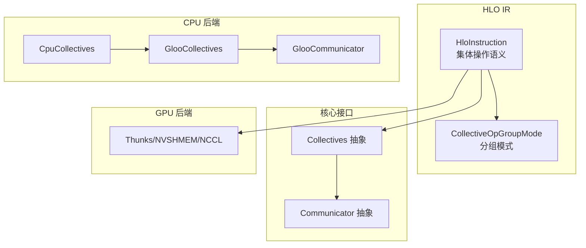
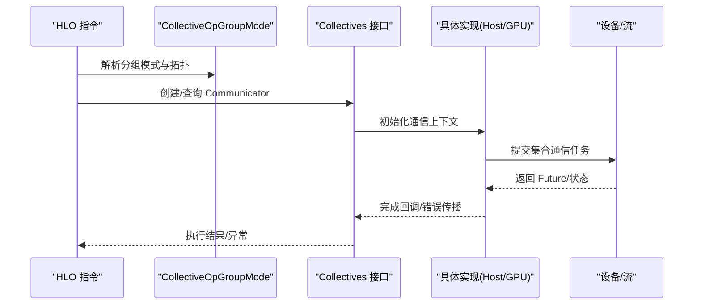
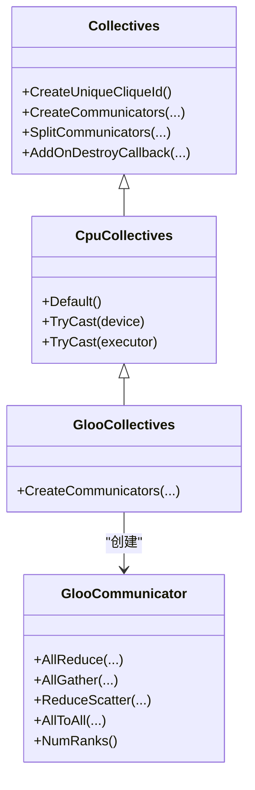
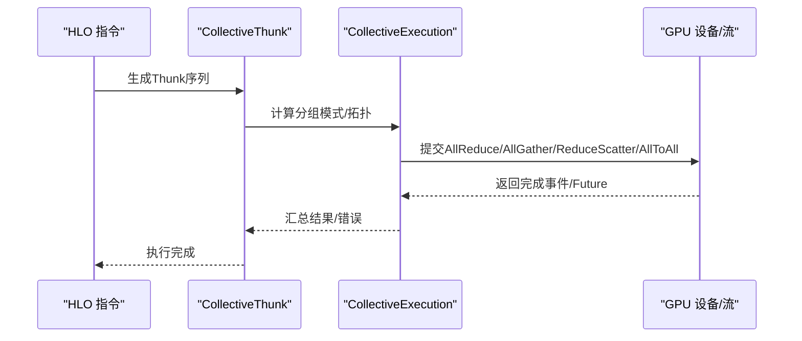
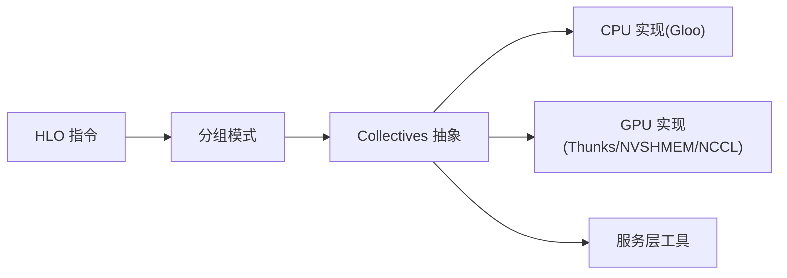
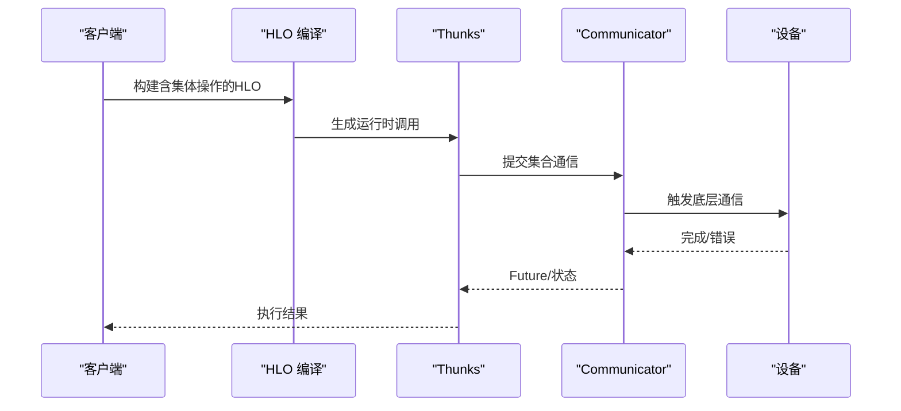

# 集体通信指令

<cite>
**本文引用的文件**
- [collectives.h](file://xla/core/collectives/collectives.h)
- [communicator.h](file://xla/core/collectives/communicator.h)
- [rank_id.h](file://xla/core/collectives/rank_id.h)
- [cpu_collectives.h](file://xla/backends/cpu/collectives/cpu_collectives.h)
- [cpu_collectives.cc](file://xla/backends/cpu/collectives/cpu_collectives.cc)
- [gloo_collectives.h](file://xla/backends/cpu/collectives/gloo_collectives.h)
- [gloo_collectives.cc](file://xla/backends/cpu/collectives/gloo_collectives.cc)
- [gloo_communicator.h](file://xla/backends/cpu/collectives/gloo_communicator.h)
- [gloo_communicator.cc](file://xla/backends/cpu/collectives/gloo_communicator.cc)
- [collective_thunk.h](file://xla/backends/cpu/runtime/collective_thunk.h)
- [all_reduce_thunk.cc](file://xla/backends/cpu/runtime/all_reduce_thunk.cc)
- [all_gather_thunk.cc](file://xla/backends/cpu/runtime/all_gather_thunk.cc)
- [all_to_all_thunk.cc](file://xla/backends/cpu/runtime/all_to_all_thunk.cc)
- [collective_execution.h](file://xla/backends/gpu/runtime/collective_execution.h)
- [collective_thunk.h](file://xla/backends/gpu/runtime/collective_thunk.h)
- [all_reduce_thunk.h](file://xla/backends/gpu/runtime/all_reduce_thunk.h)
- [all_gather_thunk.h](file://xla/backends/gpu/runtime/all_gather_thunk.h)
- [all_to_all_thunk.h](file://xla/backends/gpu/runtime/all_to_all_thunk.h)
- [collective_ops_utils.h](file://xla/service/collective_ops_utils.h)
- [collective_ops_utils.cc](file://xla/service/collective_ops_utils.cc)
- [collective_op_group_mode.h](file://xla/hlo/ir/collective_op_group_mode.h)
- [collective_op_group_mode.cc](file://xla/hlo/ir/collective_op_group_mode.cc)
- [hlo_instruction.h](file://xla/hlo/ir/hlo_instruction.h)
- [async_ops.md](file://docs/async_ops.md)
</cite>

## 目录
1. [引言](#引言)
2. [项目结构](#项目结构)
3. [核心组件](#核心组件)
4. [架构总览](#架构总览)
5. [详细组件分析](#详细组件分析)
6. [依赖关系分析](#依赖关系分析)
7. [性能考量](#性能考量)
8. [故障排查指南](#故障排查指南)
9. [结论](#结论)
10. [附录](#附录)

## 引言
本文件系统性梳理XLA中HLO分布式计算的集体通信指令，重点覆盖以下四种核心操作：全规约（AllReduce）、全收集（AllGather）、规约分散（ReduceScatter）与全到全（AllToAll）。内容涵盖：
- 指令在HLO层的语义与分组模式
- 后端实现（CPU/GPU）的通信路径与算法选择
- 异步执行模型（开始/完成）与流水线策略
- 设备间通信协议、带宽优化与延迟隐藏
- 错误处理、故障恢复与监控机制
- 大规模分布式训练的应用实践与最佳实践

## 项目结构
围绕集体通信的关键模块分布如下：
- 核心接口与抽象：xla/core/collectives
- CPU后端实现：xla/backends/cpu/collectives（基于Gloo）
- GPU后端实现：xla/backends/gpu/runtime（NCCL/NVSHMEM等）
- HLO IR与分组模式：xla/hlo/ir
- 运行时Thunk与执行：xla/backends/*/runtime
- 服务层工具：xla/service/collective_ops_utils

图表来源
- [collectives.h](file://xla/core/collectives/collectives.h#L34-L114)
- [gloo_collectives.h](file://xla/backends/cpu/collectives/gloo_collectives.h#L37-L52)
- [gloo_communicator.h](file://xla/backends/cpu/collectives/gloo_communicator.h#L39-L98)
- [collective_thunk.h](file://xla/backends/gpu/runtime/collective_thunk.h#L255-L275)
- [collective_op_group_mode.h](file://xla/hlo/ir/collective_op_group_mode.h#L27-L35)

章节来源
- [collectives.h](file://xla/core/collectives/collectives.h#L34-L114)
- [collective_op_group_mode.h](file://xla/hlo/ir/collective_op_group_mode.h#L27-L35)

## 核心组件
- Collectives 抽象：定义主机发起的集体通信接口，负责创建Communicator实例并管理生命周期回调。
- Communicator 抽象：定义具体通信设备上的集合通信API（AllReduce、AllGather、ReduceScatter、AllToAll等）。
- CpuCollectives/GlooCollectives/GlooCommunicator：CPU后端以Gloo为基础实现AllReduce/AllGather/ReduceScatter/AllToAll。
- GPU Thunks：在GPU后端通过Thunks驱动，结合NVSHMEM/NCCL实现设备内核间的集合通信。

章节来源
- [collectives.h](file://xla/core/collectives/collectives.h#L34-L114)
- [cpu_collectives.h](file://xla/backends/cpu/collectives/cpu_collectives.h#L36-L80)
- [gloo_collectives.h](file://xla/backends/cpu/collectives/gloo_collectives.h#L37-L52)
- [gloo_communicator.h](file://xla/backends/cpu/collectives/gloo_communicator.h#L39-L98)

## 架构总览
下图展示了从HLO指令到运行时执行的整体链路，以及CPU/GPU后端的差异：

图表来源
- [collective_thunk.h](file://xla/backends/gpu/runtime/collective_thunk.h#L255-L275)
- [collective_execution.h](file://xla/backends/gpu/runtime/collective_execution.h#L32-L32)
- [collective_ops_utils.h](file://xla/service/collective_ops_utils.h#L1-L120)

## 详细组件分析

### HLO 中的集体通信语义与分组模式
- 分组模式（CollectiveOpGroupMode）用于确定操作在哪些设备/副本之间进行，例如跨副本（cross-replica）或跨分区（cross-partition）。
- HloInstruction 对应的集体操作会委托到分组模式解析逻辑，确保拓扑正确性。

章节来源
- [collective_op_group_mode.h](file://xla/hlo/ir/collective_op_group_mode.h#L27-L35)
- [collective_op_group_mode.cc](file://xla/hlo/ir/collective_op_group_mode.cc#L1-L200)
- [hlo_instruction.h](file://xla/hlo/ir/hlo_instruction.h#L2349-L2354)

### CPU 后端：Gloo 实现
- CpuCollectives：CPU后端的Collectives实现入口，提供默认实例与类型转换。
- GlooCollectives：基于Gloo的Communicator工厂，按CliqueKey与Rank列表建立连接。
- GlooCommunicator：实现AllReduce、AllGather、ReduceScatter、AllToAll，使用Ring/Halving-Doubling等算法，并支持超时控制。

图表来源
- [collectives.h](file://xla/core/collectives/collectives.h#L34-L114)
- [cpu_collectives.h](file://xla/backends/cpu/collectives/cpu_collectives.h#L36-L80)
- [gloo_collectives.h](file://xla/backends/cpu/collectives/gloo_collectives.h#L37-L52)
- [gloo_communicator.h](file://xla/backends/cpu/collectives/gloo_communicator.h#L39-L98)

#### AllReduce（全规约）
- 算法：Ring算法，支持多种数据类型与归约算子（SUM/PRODUCT/MIN/MAX）。
- 数据路径：输入缓冲区作为源，输出缓冲区接收全局规约结果。
- 超时：由CpuCollectives::Executor携带的超时参数控制。

章节来源
- [gloo_communicator.cc](file://xla/backends/cpu/collectives/gloo_communicator.cc#L106-L187)

#### AllGather（全收集）
- 算法：Gloo内置AllGather，输入每个rank的一段数据，输出拼接后的全局数据。
- 参数：count为每rank元素个数，dtype决定字节宽度。

章节来源
- [gloo_communicator.cc](file://xla/backends/cpu/collectives/gloo_communicator.cc#L298-L321)

#### ReduceScatter（规约分散）
- 算法：Halving-Doubling算法，先对半规约再按块分发回各rank。
- 临时缓冲：需要复制输入到临时缓冲，避免覆盖。
- 支持类型：整型、浮点、复数；部分归约算子对复数有限制。

章节来源
- [gloo_communicator.cc](file://xla/backends/cpu/collectives/gloo_communicator.cc#L372-L443)

#### AllToAll（全到全）
- 算法：自实现环形发送/接收，避免Gloo对连续内存的限制。
- 语义：每个rank向其他rank发送一段数据，同时从其他rank接收一段数据。
- 同步：统一等待所有send/recv完成。

章节来源
- [gloo_communicator.cc](file://xla/backends/cpu/collectives/gloo_communicator.cc#L242-L296)

### GPU 后端：Thunks 与执行
- Thunk 层：将HLO的集体操作映射为具体运行时调用，包含分组模式推导与执行调度。
- 执行器：在GPU上通常结合NVSHMEM/NCCL实现设备内核间通信。
- 组模式：根据HLO指令的分组模式选择合适的通信拓扑。

图表来源
- [collective_thunk.h](file://xla/backends/gpu/runtime/collective_thunk.h#L255-L275)
- [collective_execution.h](file://xla/backends/gpu/runtime/collective_execution.h#L32-L32)

章节来源
- [collective_thunk.h](file://xla/backends/gpu/runtime/collective_thunk.h#L255-L275)
- [collective_execution.h](file://xla/backends/gpu/runtime/collective_execution.h#L32-L32)

### 异步执行与流水线
- 异步模型：Communicator返回Future，允许非阻塞提交与等待。
- 流水线：在多设备/多批次场景中，通过重叠通信与计算提升吞吐。
- 文档参考：异步操作与事件模型详见文档。

章节来源
- [async_ops.md](file://docs/async_ops.md#L1-L200)
- [gloo_communicator.h](file://xla/backends/cpu/collectives/gloo_communicator.h#L39-L98)

## 依赖关系分析
- HLO IR 依赖分组模式解析，决定通信拓扑。
- Collectives 抽象屏蔽后端差异，统一创建Communicator。
- CPU后端通过Gloo实现具体算法；GPU后端通过Thunks与NVSHMEM/NCCL协作。
- 服务层工具提供通用的集合操作辅助函数。

图表来源
- [collectives.h](file://xla/core/collectives/collectives.h#L34-L114)
- [collective_ops_utils.h](file://xla/service/collective_ops_utils.h#L1-L120)
- [collective_thunk.h](file://xla/backends/gpu/runtime/collective_thunk.h#L255-L275)

章节来源
- [collectives.h](file://xla/core/collectives/collectives.h#L34-L114)
- [collective_ops_utils.h](file://xla/service/collective_ops_utils.h#L1-L120)

## 性能考量
- 通信拓扑与算法
  - Ring（AllReduce）：适合高带宽、低延迟网络，易于扩展。
  - Halving-Doubling（ReduceScatter）：减少全局同步次数，适合大规模集群。
  - 自定义AllToAll：绕过连续内存假设，灵活适配不规则数据切分。
- 带宽优化
  - 使用原地/就地规约减少拷贝。
  - 合理的数据类型与对齐，避免不必要的转换。
- 延迟隐藏
  - 通过流水线与异步执行重叠通信与计算。
  - 在多设备上采用分片与并行化策略。
- 监控与诊断
  - 利用Future/事件与日志定位瓶颈。
  - 结合分组模式与拓扑验证通信正确性。

[本节为通用指导，无需列出具体文件来源]

## 故障排查指南
- 常见错误类型
  - 类型不支持：如复数类型的MIN/MAX归约在某些后端不被支持。
  - 内存布局问题：AllToAll要求每段大小一致且可寻址。
  - 超时：网络拥塞或设备卡顿导致超时，需调整超时阈值或检查拓扑。
- 回调与生命周期
  - Collectives提供销毁回调，确保缓存失效与资源回收。
- 日志与诊断
  - 通信实现内部使用日志输出关键步骤，便于定位问题。

章节来源
- [gloo_communicator.cc](file://xla/backends/cpu/collectives/gloo_communicator.cc#L87-L104)
- [gloo_communicator.cc](file://xla/backends/cpu/collectives/gloo_communicator.cc#L235-L238)
- [gloo_communicator.cc](file://xla/backends/cpu/collectives/gloo_communicator.cc#L291-L294)
- [collectives.h](file://xla/core/collectives/collectives.h#L85-L114)

## 结论
XLA的集体通信体系通过HLO分组模式与后端抽象，实现了在CPU与GPU平台上的统一语义与差异化优化。CPU后端以Gloo为核心，提供Ring/Halving-Doubling等成熟算法；GPU后端通过Thunks与NVSHMEM/NCCL实现高性能设备内核通信。结合异步执行与流水线策略，可在大规模分布式训练中显著提升吞吐并降低延迟。实践中应重视拓扑设计、类型支持与超时配置，并利用日志与回调机制保障稳定性与可观测性。

[本节为总结性内容，无需列出具体文件来源]

## 附录

### HLO 到运行时的调用序列（概念示意）

[本图为概念流程图，不直接对应具体源码文件，故无图表来源]

### 关键实现路径索引
- AllReduce（CPU）：[gloo_communicator.cc](file://xla/backends/cpu/collectives/gloo_communicator.cc#L106-L187)
- AllGather（CPU）：[gloo_communicator.cc](file://xla/backends/cpu/collectives/gloo_communicator.cc#L298-L321)
- ReduceScatter（CPU）：[gloo_communicator.cc](file://xla/backends/cpu/collectives/gloo_communicator.cc#L372-L443)
- AllToAll（CPU）：[gloo_communicator.cc](file://xla/backends/cpu/collectives/gloo_communicator.cc#L242-L296)
- GPU Thunks（分组模式推导）：[collective_thunk.h](file://xla/backends/gpu/runtime/collective_thunk.h#L255-L275)
- HLO 分组模式：[collective_op_group_mode.h](file://xla/hlo/ir/collective_op_group_mode.h#L27-L35)