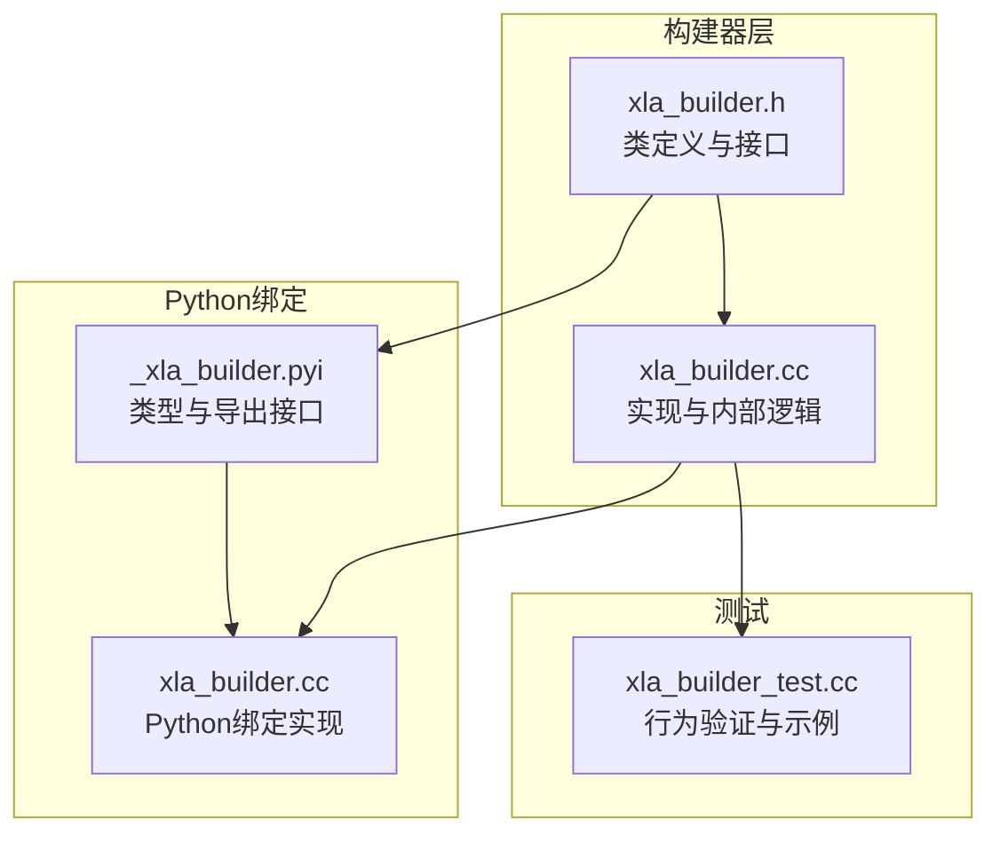
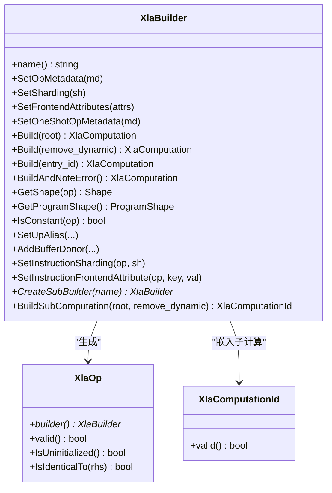
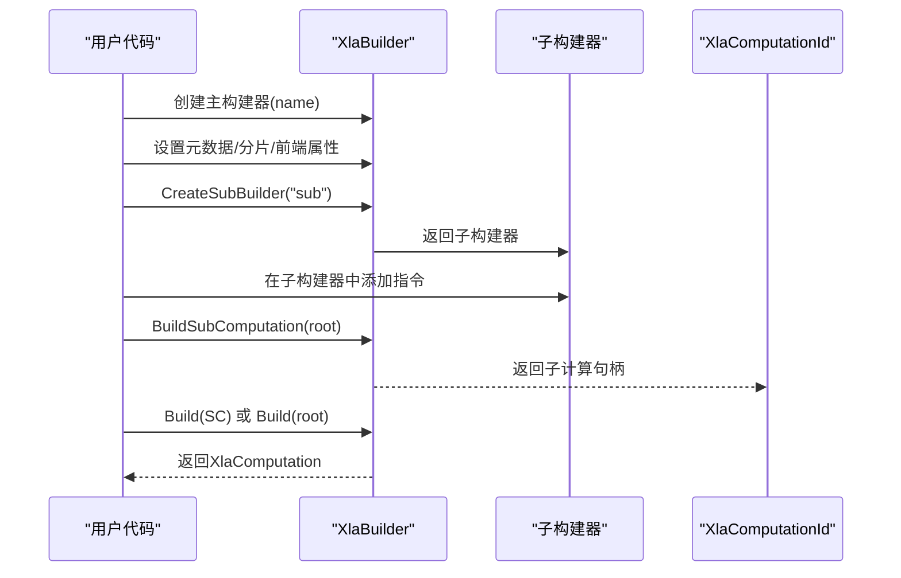
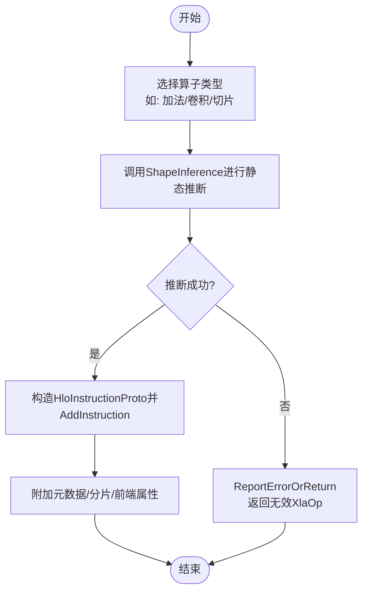
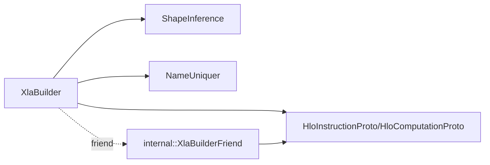

# HLO构建器API

<cite>
**本文档引用的文件**
- [xla_builder.h](file://xla/hlo/builder/xla_builder.h)
- [xla_builder.cc](file://xla/hlo/builder/xla_builder.cc)
- [xla_builder_test.cc](file://xla/hlo/builder/xla_builder_test.cc)
- [_xla_builder.pyi](file://xla/python/_xla_builder.pyi)
- [xla_builder.cc (Python绑定)](file://xla/python/xla_builder.cc)
</cite>

## 目录
1. [简介](#简介)
2. [项目结构](#项目结构)
3. [核心组件](#核心组件)
4. [架构总览](#架构总览)
5. [详细组件分析](#详细组件分析)
6. [依赖关系分析](#依赖关系分析)
7. [性能考虑](#性能考虑)
8. [故障排查指南](#故障排查指南)
9. [结论](#结论)
10. [附录](#附录)

## 简介
本文件系统性地阐述XlaBuilder（HLO构建器）的设计与使用，覆盖从构建器初始化、指令创建到计算图构建的完整流程；详解常量/变量定义、算术与复合操作、分片构建、形状推断与元数据管理；并提供复杂机器学习计算图的构建思路与调试、性能优化建议。目标读者既包括需要直接使用C++ API的开发者，也包括通过Python绑定调用的用户。

## 项目结构
围绕XlaBuilder的关键文件组织如下：
- C++核心头/实现：xla/hlo/builder/xla_builder.{h,cc}
- Python绑定与类型声明：xla/python/xla_builder.cc、xla/python/_xla_builder.pyi
- 单元测试：xla/hlo/builder/xla_builder_test.cc

图表来源
- [xla_builder.h](file://xla/hlo/builder/xla_builder.h#L287-L460)
- [xla_builder.cc](file://xla/hlo/builder/xla_builder.cc#L609-L612)
- [_xla_builder.pyi](file://xla/python/_xla_builder.pyi#L31-L49)
- [xla_builder.cc (Python绑定)](file://xla/python/xla_builder.cc#L105-L160)
- [xla_builder_test.cc](file://xla/hlo/builder/xla_builder_test.cc#L109-L149)

章节来源
- [xla_builder.h](file://xla/hlo/builder/xla_builder.h#L287-L460)
- [xla_builder.cc](file://xla/hlo/builder/xla_builder.cc#L609-L612)
- [_xla_builder.pyi](file://xla/python/_xla_builder.pyi#L31-L49)
- [xla_builder.cc (Python绑定)](file://xla/python/xla_builder.cc#L105-L160)
- [xla_builder_test.cc](file://xla/hlo/builder/xla_builder_test.cc#L109-L149)

## 核心组件
- XlaBuilder：构建器主体，负责收集指令、维护状态、执行形状推断、设置元数据与分片策略，并最终生成XlaComputation。
- XlaOp：指令句柄，携带操作数的引用与所属构建器指针，用于后续组合。
- XlaComputationId：嵌入式子计算的句柄，支持在构建器内复用或延迟构建。
- 元数据与分片：OpMetadata、FrontendAttributes、OpSharding等，贯穿构建期与运行期。
- 形状推断：基于ShapeInference的静态推断，确保构建期即发现形状不匹配问题。

章节来源
- [xla_builder.h](file://xla/hlo/builder/xla_builder.h#L166-L224)
- [xla_builder.h](file://xla/hlo/builder/xla_builder.h#L226-L258)
- [xla_builder.h](file://xla/hlo/builder/xla_builder.h#L287-L460)

## 架构总览
XlaBuilder采用“指令收集+延迟构建”的模式：先以XlaOp串联各操作，再统一调用Build()生成最终的HLO模块。构建器内部维护指令序列、形状缓存、参数集合、别名与捐赠缓冲配置、以及可选的父构建器（用于子计算嵌套）。

图表来源
- [xla_builder.h](file://xla/hlo/builder/xla_builder.h#L287-L460)
- [xla_builder.h](file://xla/hlo/builder/xla_builder.h#L166-L224)
- [xla_builder.h](file://xla/hlo/builder/xla_builder.h#L226-L258)

## 详细组件分析

### 构建器初始化与控制流
- 初始化：构造函数接收计算名称，随后可通过元数据/分片/前端属性API设置默认行为。
- 控制流：构建器支持“立即失败”模式（die_immediately_on_error），也可延迟到Build()时统一报告首个错误。
- 子构建器：CreateSubBuilder用于嵌入子计算，BuildSubComputation将子构建器的指令集打包为XlaComputationId，供上层调用。

图表来源
- [xla_builder.h](file://xla/hlo/builder/xla_builder.h#L406-L448)
- [xla_builder.cc](file://xla/hlo/builder/xla_builder.cc#L609-L612)

章节来源
- [xla_builder.h](file://xla/hlo/builder/xla_builder.h#L287-L460)
- [xla_builder.cc](file://xla/hlo/builder/xla_builder.cc#L609-L612)

### 指令创建与形状推断
- 基础算子：加减乘除、位运算、比较、选择、切片、拼接、转置、reshape、动态形状等均有对应方法。
- 形状推断：多数算子在构建时调用ShapeInference进行静态推断，若输入形状不合法会立即返回错误。
- 动态形状：提供DynamicReshape、DynamicSlice、DynamicUpdateSlice等API，配合维度占位符参与推断。

图表来源
- [xla_builder.cc](file://xla/hlo/builder/xla_builder.cc#L1659-L1681)
- [xla_builder.cc](file://xla/hlo/builder/xla_builder.cc#L1760-L1785)
- [xla_builder.cc](file://xla/hlo/builder/xla_builder.cc#L1890-L1923)

章节来源
- [xla_builder.cc](file://xla/hlo/builder/xla_builder.cc#L1659-L1681)
- [xla_builder.cc](file://xla/hlo/builder/xla_builder.cc#L1760-L1785)
- [xla_builder.cc](file://xla/hlo/builder/xla_builder.cc#L1890-L1923)

### 复合操作与子计算
- 参数与常量：Parameter/Constant系列用于定义输入与常量。
- 调用与复合：Call/CompositeCall用于调用或复合嵌入式子计算；CustomCall支持自定义后端调用。
- 循环与条件：While/Conditional支持控制流。
- 归约与扫描：Reduce/ReduceWindow/Scan支持窗口化归约与扫描。

章节来源
- [xla_builder.h](file://xla/hlo/builder/xla_builder.h#L836-L883)
- [xla_builder.h](file://xla/hlo/builder/xla_builder.h#L1066-L1084)
- [xla_builder.h](file://xla/hlo/builder/xla_builder.h#L885-L936)

### 分片构建与元数据管理
- 分片策略：SetSharding/ClearSharding/SetInstructionSharding用于全局或单指令级分片设置。
- 元数据：SetOpMetadata/SwapOpMetadata/ClearOpMetadata管理源码位置等元信息；FrontendAttributes用于前端语义标记。
- 别名与捐赠：SetUpAlias/AddBufferDonor用于内存别名与缓冲捐赠，减少拷贝。

章节来源
- [xla_builder.h](file://xla/hlo/builder/xla_builder.h#L300-L377)
- [xla_builder.h](file://xla/hlo/builder/xla_builder.h#L514-L562)
- [xla_builder.h](file://xla/hlo/builder/xla_builder.h#L1259-L1266)

### Python绑定与使用
- Python侧通过_nanobind绑定暴露XlaBuilder、XlaOp、FrontendAttributes等类型与方法。
- 支持Build、GetShape、get_program_shape、is_constant、set_op_metadata、set_sharding、clear_sharding、setup_alias等常用API。

章节来源
- [_xla_builder.pyi](file://xla/python/_xla_builder.pyi#L31-L49)
- [xla_builder.cc (Python绑定)](file://xla/python/xla_builder.cc#L105-L160)

## 依赖关系分析
- 内部依赖：XlaBuilder依赖ShapeInference进行静态推断；依赖NameUniquer保证指令命名唯一；内部friend类用于访问私有成员以实现高级特性（如异步通信、域转换等）。
- 外部依赖：absl/status/statusor、xla/service/hlo.pb.h、xla/shape_util.h等。

图表来源
- [xla_builder.h](file://xla/hlo/builder/xla_builder.h#L128-L164)
- [xla_builder.cc](file://xla/hlo/builder/xla_builder.cc#L1600-L1635)

章节来源
- [xla_builder.h](file://xla/hlo/builder/xla_builder.h#L128-L164)
- [xla_builder.cc](file://xla/hlo/builder/xla_builder.cc#L1600-L1635)

## 性能考虑
- 避免不必要的广播：优先使用已对齐的形状，减少InDimBroadcast链路。
- 合理使用动态形状：仅在必要时使用DynamicReshape/DynamicSlice，避免过度碎片化。
- 归约与窗口：合理设置窗口尺寸与步长，减少冗余计算。
- 分片策略：结合OpSharding与布局优化，减少跨设备通信与数据重排。
- 缓冲别名与捐赠：通过SetUpAlias/AddBufferDonor降低内存占用与拷贝开销。

## 故障排查指南
- 错误传播：构建器默认延迟报告错误，首次错误会被捕获并保存堆栈；可通过first_error()获取首个错误，GetCurrentStatus()获取当前状态。
- 立即失败：set_die_immediately_on_error(true)可在遇到错误时立即崩溃，便于定位。
- 调试输出：OpToString可用于打印指令树，辅助定位问题。
- 测试参考：单元测试展示了常量折叠、子图提取、一元/二元算子等典型场景，可作为正确用法的参考。

章节来源
- [xla_builder.h](file://xla/hlo/builder/xla_builder.h#L457-L467)
- [xla_builder.cc](file://xla/hlo/builder/xla_builder.cc#L614-L640)
- [xla_builder_test.cc](file://xla/hlo/builder/xla_builder_test.cc#L109-L149)

## 结论
XlaBuilder提供了从基础算子到复杂复合操作的全栈构建能力，结合形状推断、元数据与分片管理，能够高效生成高质量的HLO计算图。通过子构建器与嵌入式子计算，可实现模块化与可复用的计算图构建。建议在实际工程中遵循“先推断、后构建”的原则，善用元数据与分片策略，并结合测试与调试工具提升开发效率与稳定性。

## 附录

### 常见API速查（按类别）
- 初始化与构建
  - 构造：XlaBuilder(name)
  - 构建：Build() / Build(root) / Build(entry_id) / BuildAndNoteError()
  - 查询：GetShape(op) / GetProgramShape() / GetProgramShape(root)
- 元数据与分片
  - SetOpMetadata / SwapOpMetadata / SetOneShotOpMetadata / ClearOpMetadata
  - SetSharding / ClearSharding / SetInstructionSharding
  - SetFrontendAttributes / SwapFrontendAttributes / ClearFrontendAttributes
- 参数与常量
  - Parameter(number, shape, name, replicated?)
  - Constant系列（如ConstantR0/R1等）
- 算术与逻辑
  - 加减乘除、取余、位运算、比较、选择
- 变换与索引
  - Broadcast/BroadcastInDim、Reshape/DynamicReshape、Slice/SliceInDim、ConcatInDim
  - Tuple/GetTupleElement
- 归约与扫描
  - Reduce/ReduceWindow/Scan/While/Conditional
- 卷积与线性代数
  - Conv/ConvGeneral/ConvGeneralDilated、Dot/DotGeneral、ScaledDot
- 自定义与调用
  - CustomCall/Call/CompositeCall
- 集体通信与异步
  - AllGather/AllReduce/AllToAll/CollectivePermute等（异步Start/Done变体）

章节来源
- [xla_builder.h](file://xla/hlo/builder/xla_builder.h#L406-L448)
- [xla_builder.h](file://xla/hlo/builder/xla_builder.h#L603-L610)
- [xla_builder.h](file://xla/hlo/builder/xla_builder.h#L680-L787)
- [xla_builder.h](file://xla/hlo/builder/xla_builder.h#L836-L936)
- [xla_builder.h](file://xla/hlo/builder/xla_builder.h#L1151-L1203)