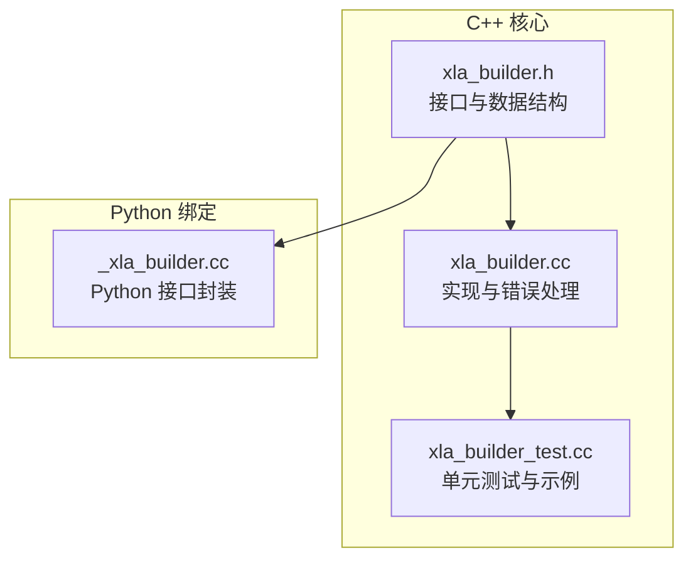
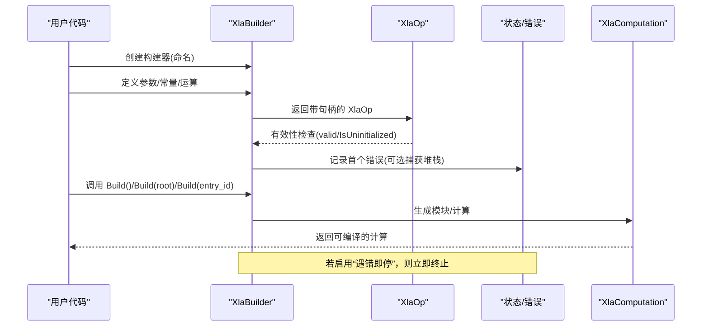
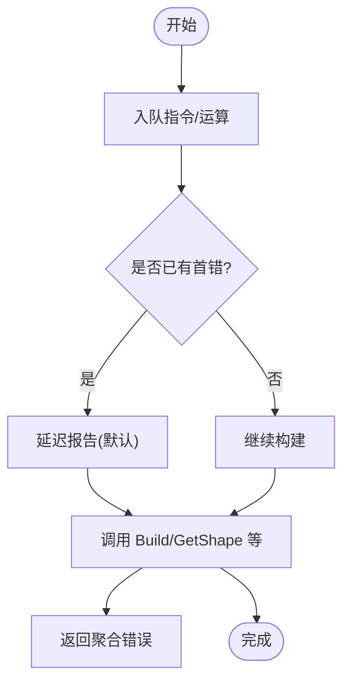
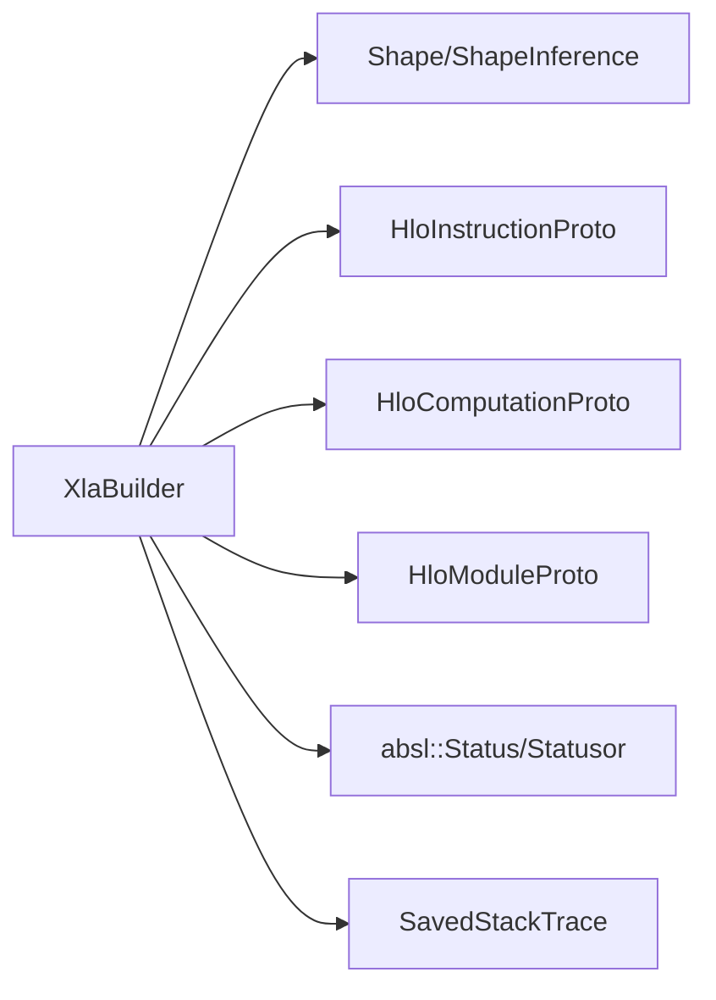
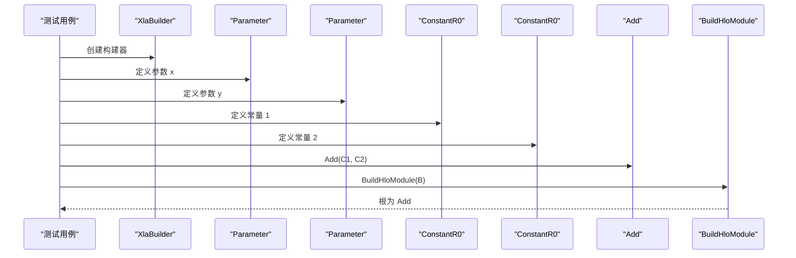

# 基础构建器用法

<cite>
**本文引用的文件**
- [xla_builder.h](file://xla/hlo/builder/xla_builder.h)
- [xla_builder.cc](file://xla/hlo/builder/xla_builder.cc)
- [xla_builder_test.cc](file://xla/hlo/builder/xla_builder_test.cc)
- [_xla_builder.cc](file://xla/python/_xla_builder.cc)
</cite>

## 目录
1. [简介](#简介)
2. [项目结构](#项目结构)
3. [核心组件](#核心组件)
4. [架构总览](#架构总览)
5. [详细组件分析](#详细组件分析)
6. [依赖关系分析](#依赖关系分析)
7. [性能考虑](#性能考虑)
8. [故障排查指南](#故障排查指南)
9. [结论](#结论)
10. [附录](#附录)

## 简介
本文件面向首次接触 HLO 构建器（XlaBuilder）的开发者，系统讲解基础用法与关键概念，包括：
- XlaBuilder 的初始化与命名约定
- XlaOp 的概念、有效性检查与句柄管理
- 参数定义、常量创建与基本算术运算
- 构建器状态管理与错误处理机制
- 调试技巧与常见问题定位

目标是帮助读者快速上手，构建出可编译的 HLO 计算图，并在遇到问题时具备定位与解决能力。

## 项目结构
围绕构建器的基础实现与测试，相关文件分布如下：
- 头文件：定义 XlaBuilder、XlaOp、XlaComputationId 及公共 API
- 实现文件：实现构建流程、指令添加、形状推断、错误收集与报告等
- 测试文件：覆盖参数、常量、二元运算、广播、调用子计算等典型场景
- Python 绑定：将 XlaBuilder 暴露给 Python，便于脚本化使用

**图表来源**
- [xla_builder.h](file://xla/hlo/builder/xla_builder.h#L287-L599)
- [xla_builder.cc](file://xla/hlo/builder/xla_builder.cc#L800-L951)
- [xla_builder_test.cc](file://xla/hlo/builder/xla_builder_test.cc#L179-L241)
- [_xla_builder.cc](file://xla/python/_xla_builder.cc#L105-L160)

**章节来源**
- [xla_builder.h](file://xla/hlo/builder/xla_builder.h#L287-L599)
- [xla_builder.cc](file://xla/hlo/builder/xla_builder.cc#L800-L951)
- [xla_builder_test.cc](file://xla/hlo/builder/xla_builder_test.cc#L179-L241)
- [_xla_builder.cc](file://xla/python/_xla_builder.cc#L105-L160)

## 核心组件
- XlaBuilder：计算图构建器，负责累积指令、维护状态、执行形状推断与错误收集，最终生成 XlaComputation。
- XlaOp：表示一个已入队的 HLO 指令，携带句柄与所属构建器指针，用于后续运算作为输入。
- XlaComputationId：嵌入式子计算的不透明句柄，支持在父构建器中复用子计算。

关键要点：
- XlaOp 通过句柄与构建器关联，提供有效性检查（valid/IsUninitialized）与 builder() 访问。
- XlaBuilder 内部以指令序列与映射维护句柄到指令索引的关系，确保查询与调试可用。
- 错误采用延迟报告策略：默认记录首个错误并延后在 Build/GetShape 等处统一返回；也可设置“遇错即停”。

**章节来源**
- [xla_builder.h](file://xla/hlo/builder/xla_builder.h#L166-L224)
- [xla_builder.h](file://xla/hlo/builder/xla_builder.h#L287-L378)
- [xla_builder.cc](file://xla/hlo/builder/xla_builder.cc#L614-L640)
- [xla_builder.cc](file://xla/hlo/builder/xla_builder.cc#L800-L807)

## 架构总览
下图展示了从创建 XlaBuilder 到构建计算图的关键路径，以及错误处理与状态管理的交互：

**图表来源**
- [xla_builder.h](file://xla/hlo/builder/xla_builder.h#L287-L378)
- [xla_builder.cc](file://xla/hlo/builder/xla_builder.cc#L809-L879)
- [xla_builder.cc](file://xla/hlo/builder/xla_builder.cc#L614-L640)

## 详细组件分析

### XlaBuilder 初始化与命名约定
- 构造函数接收 computation_name，用于生成模块与计算的名称标识。
- 名称唯一性由内部 NameUniquer 保证；Python 绑定会进一步去重。
- 支持子构建器 CreateSubBuilder 与 BuildSubComputation，便于内联嵌入子计算。

命名与 ID 生成要点：
- 计算 ID 与指令 ID 在当前上下文中自增生成，避免跨模块冲突。
- 指令名通过 UniquifyInstructionName 保证全局唯一。

**章节来源**
- [xla_builder.h](file://xla/hlo/builder/xla_builder.h#L287-L300)
- [xla_builder.h](file://xla/hlo/builder/xla_builder.h#L1244-L1290)
- [xla_builder.cc](file://xla/hlo/builder/xla_builder.cc#L905-L951)
- [_xla_builder.cc](file://xla/python/_xla_builder.cc#L97-L101)

### XlaOp 的概念、有效性与句柄管理
- XlaOp 是对已入队指令的轻量包装，包含句柄与构建器指针。
- 有效性的判断依据句柄是否非负；未初始化的 XlaOp 仅用于占位或错误返回。
- builder() 提供强校验，避免空指针访问；GetShape/GetShapePtr 等 API 会进行句柄查找与存在性检查。

句柄与映射：
- handle_to_index_ 将句柄映射到指令序列索引，支持快速查询与调试打印。
- 支持导入指令（handle_to_imported_index_），用于跨计算引用。

**章节来源**
- [xla_builder.h](file://xla/hlo/builder/xla_builder.h#L166-L224)
- [xla_builder.h](file://xla/hlo/builder/xla_builder.h#L1298-L1327)
- [xla_builder.cc](file://xla/hlo/builder/xla_builder.cc#L494-L518)

### 参数定义与常量创建
- 参数：Parameter(builder, number, shape, name[, replicated]) 注册参数，参数号必须连续且唯一。
- 常量：支持标量/数组/多维数组常量创建，内部可能通过广播扩展到目标形状。
- Python 绑定提供便捷的 ConstantR0/R1/R2 等模板方法，简化常用维度常量构造。

示例参考（测试用例）：
- 参数与加法：[xla_builder_test.cc](file://xla/hlo/builder/xla_builder_test.cc#L179-L185)
- 标量广播：[xla_builder_test.cc](file://xla/hlo/builder/xla_builder_test.cc#L285-L301)
- 形状不匹配报错：[xla_builder_test.cc](file://xla/hlo/builder/xla_builder_test.cc#L353-L362)

**章节来源**
- [xla_builder.h](file://xla/hlo/builder/xla_builder.h#L2106-L2120)
- [xla_builder.h](file://xla/hlo/builder/xla_builder.h#L2136-L2200)
- [xla_builder.cc](file://xla/hlo/builder/xla_builder.cc#L1537-L1561)
- [xla_builder_test.cc](file://xla/hlo/builder/xla_builder_test.cc#L179-L301)

### 基本算术运算与广播
- 二元运算：Add/Sub/Mul/Div/Rem、And/Or/Xor、比较、移位等均通过统一的 BinaryOp/BinaryOpNoBroadcast/Compare 等内部方法实现。
- 广播：自动推导输出形状，必要时插入显式广播序列；支持标量到任意形状的广播。
- 有符号右移根据元素类型选择算术右移或逻辑右移。

示例参考（测试用例）：
- 二元运算模式匹配：[xla_builder_test.cc](file://xla/hlo/builder/xla_builder_test.cc#L201-L241)
- 非整数右移报错：[xla_builder_test.cc](file://xla/hlo/builder/xla_builder_test.cc#L275-L283)
- 广播维度指定：[xla_builder_test.cc](file://xla/hlo/builder/xla_builder_test.cc#L303-L318)

**章节来源**
- [xla_builder.h](file://xla/hlo/builder/xla_builder.h#L1151-L1196)
- [xla_builder.cc](file://xla/hlo/builder/xla_builder.cc#L1345-L1436)
- [xla_builder.cc](file://xla/hlo/builder/xla_builder.cc#L1478-L1535)
- [xla_builder_test.cc](file://xla/hlo/builder/xla_builder_test.cc#L201-L283)

### 子计算与调用
- 子计算：CreateSubBuilder + BuildSubComputation，将子图嵌入父构建器，避免重复拷贝。
- 调用：Call/CompositeCall/CustomCall 等，支持传入子计算句柄与参数。

示例参考（测试用例）：
- 子计算去重：[xla_builder_test.cc](file://xla/hlo/builder/xla_builder_test.cc#L406-L425)
- 从子构建器构建主计算：[xla_builder_test.cc](file://xla/hlo/builder/xla_builder_test.cc#L427-L458)
- CompositeCall 行为验证：[xla_builder_test.cc](file://xla/hlo/builder/xla_builder_test.cc#L460-L600)

**章节来源**
- [xla_builder.h](file://xla/hlo/builder/xla_builder.h#L406-L417)
- [xla_builder.h](file://xla/hlo/builder/xla_builder.h#L836-L882)
- [xla_builder.cc](file://xla/hlo/builder/xla_builder.cc#L824-L844)
- [xla_builder_test.cc](file://xla/hlo/builder/xla_builder_test.cc#L388-L458)

### 构建流程与根节点
- Build() 默认以最后一条指令为根；也可指定任意 XlaOp 作为根。
- Build(root) 与 Build(entry_id) 支持灵活控制根与入口计算。
- 构建时会清理内部缓存（指令、映射、别名配置等），并生成可编译的模块。

**章节来源**
- [xla_builder.h](file://xla/hlo/builder/xla_builder.h#L418-L438)
- [xla_builder.cc](file://xla/hlo/builder/xla_builder.cc#L809-L879)

### 状态管理与错误处理
- 首个错误记录：ReportError/ReportErrorOrReturn 在首次错误时保存状态与堆栈。
- 延迟报告：Build/GetShape 等在调用时统一返回错误，便于聚合诊断。
- 遇错即停：set_die_immediately_on_error(true) 可使错误直接导致进程终止，便于快速定位。
- 当前状态：GetCurrentStatus 汇总首错与堆栈信息，便于调试。

**图表来源**
- [xla_builder.cc](file://xla/hlo/builder/xla_builder.cc#L614-L640)
- [xla_builder.cc](file://xla/hlo/builder/xla_builder.cc#L800-L807)

**章节来源**
- [xla_builder.cc](file://xla/hlo/builder/xla_builder.cc#L614-L640)
- [xla_builder.cc](file://xla/hlo/builder/xla_builder.cc#L800-L807)

### Python 绑定与工具
- Python 绑定将 XlaBuilder 包装为 _xla_builder.XlaBuilder，提供 Build/get_shape/is_constant 等常用方法。
- 名称去重：通过内部 Uniquer 保障不同实例的唯一性。
- FrontendAttributes、OpMetadata 等元数据可通过绑定设置。

**章节来源**
- [_xla_builder.cc](file://xla/python/_xla_builder.cc#L105-L160)
- [_xla_builder.cc](file://xla/python/_xla_builder.cc#L85-L101)

## 依赖关系分析
- XlaBuilder 依赖 Shape/ShapeInference 进行形状推断与一致性检查。
- 指令序列以 HloInstructionProto/HloComputationProto/HloModuleProto 为载体，构建完成后转为可编译模块。
- 错误处理依赖 absl::Status/Statusor 与 SavedStackTrace，支持堆栈捕获与附加信息。

**图表来源**
- [xla_builder.cc](file://xla/hlo/builder/xla_builder.cc#L905-L951)
- [xla_builder.cc](file://xla/hlo/builder/xla_builder.cc#L800-L807)

**章节来源**
- [xla_builder.cc](file://xla/hlo/builder/xla_builder.cc#L905-L951)
- [xla_builder.cc](file://xla/hlo/builder/xla_builder.cc#L800-L807)

## 性能考虑
- 显式广播序列：在高维张量广播时，先做维度压缩再广播，有助于减少冗余指令。
- 元素类型转换：ConvertElementType/BitcastConvertType 在保持布局与类型间切换时需注意额外开销。
- 动态维度：构建时可选择移除动态维度，避免后端不支持带来的编译失败。
- 子计算复用：优先使用 BuildSubComputation 与 Call，避免重复拷贝与重复构建。

[本节为通用指导，无需特定文件引用]

## 故障排查指南
- 参数号冲突：同一构建器内参数号必须唯一且连续，否则报错。
  - 参考：[xla_builder_test.cc](file://xla/hlo/builder/xla_builder_test.cc#L374-L386)
- 形状不匹配：二元运算要求形状兼容，否则报错。
  - 参考：[xla_builder_test.cc](file://xla/hlo/builder/xla_builder_test.cc#L353-L362)
- 非整数右移：对浮点类型执行 >> 会报错，需确认类型。
  - 参考：[xla_builder_test.cc](file://xla/hlo/builder/xla_builder_test.cc#L275-L283)
- 子计算去重：CompositeCall/Call 使用共享子计算时，确保只生成一次。
  - 参考：[xla_builder_test.cc](file://xla/hlo/builder/xla_builder_test.cc#L406-L425)
- 调试建议：
  - 使用 OpToString/GetProgramShape 查看当前构建状态。
  - 设置 OpMetadata/FrontendAttributes 辅助定位来源。
  - 启用“遇错即停”快速定位首错位置。

**章节来源**
- [xla_builder_test.cc](file://xla/hlo/builder/xla_builder_test.cc#L353-L386)
- [xla_builder_test.cc](file://xla/hlo/builder/xla_builder_test.cc#L275-L283)
- [xla_builder_test.cc](file://xla/hlo/builder/xla_builder_test.cc#L406-L425)
- [xla_builder.h](file://xla/hlo/builder/xla_builder.h#L567-L568)
- [xla_builder.h](file://xla/hlo/builder/xla_builder.h#L300-L378)

## 结论
XlaBuilder 提供了从参数、常量到复杂运算的完整构建能力，配合完善的错误处理与调试工具，能够高效地表达并验证计算图。遵循参数号唯一、形状兼容与类型正确等基本原则，即可快速产出可编译的 HLO 模块。对于复杂场景，建议优先使用子构建器与 Call 复用子图，提升可维护性与性能。

[本节为总结，无需特定文件引用]

## 附录

### 快速示例（基于测试用例）
以下示例展示如何使用 XlaBuilder 构建一个简单的加法计算图：
- 定义两个参数
- 定义两个常量
- 执行加法
- 构建并获取根指令

参考测试：
- [xla_builder_test.cc](file://xla/hlo/builder/xla_builder_test.cc#L179-L185)

**图表来源**
- [xla_builder_test.cc](file://xla/hlo/builder/xla_builder_test.cc#L179-L185)