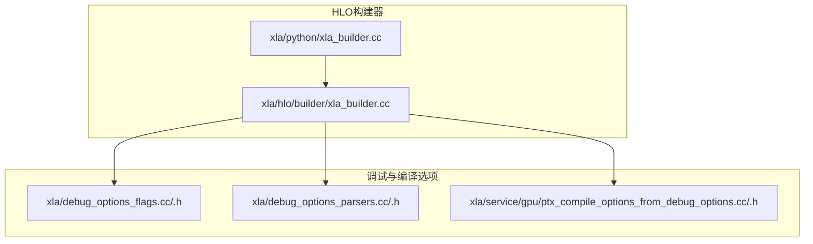
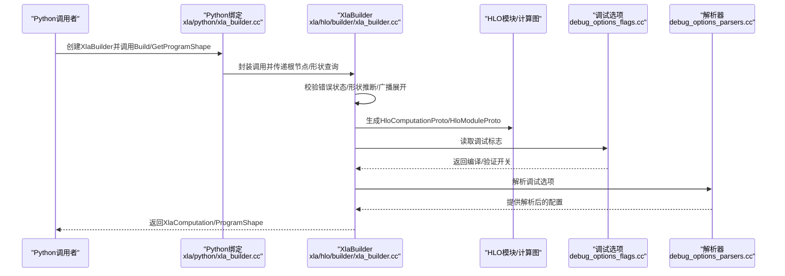
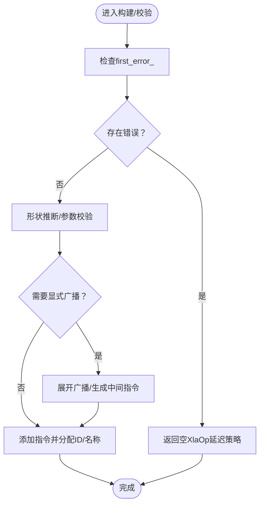
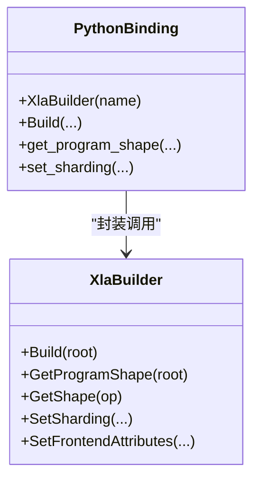
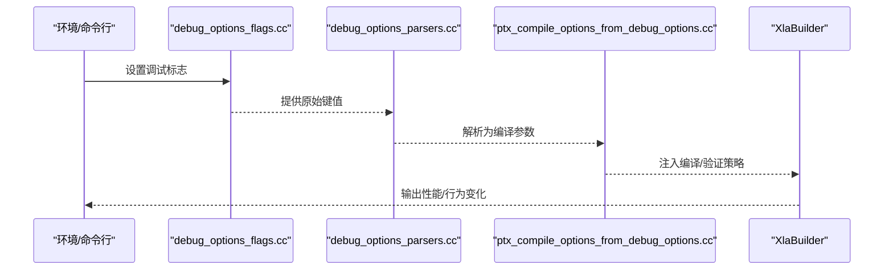
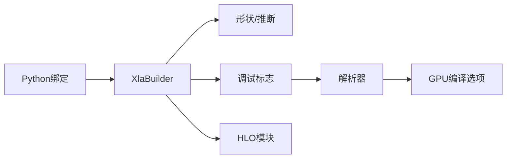

# 构建器性能优化

<cite>
**本文引用的文件**
- [xla_builder.cc](file://xla/hlo/builder/xla_builder.cc)
- [xla_builder_test.cc](file://xla/hlo/builder/xla_builder_test.cc)
- [xla_builder.cc（Python绑定）](file://xla/python/xla_builder.cc)
- [debug_options_flags.cc](file://xla/debug_options_flags.cc)
- [debug_options_flags.h](file://xla/debug_options_flags.h)
- [debug_options_parsers.cc](file://xla/debug_options_parsers.cc)
- [debug_options_parsers.h](file://xla/debug_options_parsers.h)
- [ptx_compile_options_from_debug_options.cc](file://xla/service/gpu/ptx_compile_options_from_debug_options.cc)
- [ptx_compile_options_from_debug_options.h](file://xla/service/gpu/ptx_compile_options_from_debug_options.h)
</cite>

## 目录
1. [引言](#引言)
2. [项目结构](#项目结构)
3. [核心组件](#核心组件)
4. [架构总览](#架构总览)
5. [详细组件分析](#详细组件分析)
6. [依赖关系分析](#依赖关系分析)
7. [性能考量](#性能考量)
8. [故障排查指南](#故障排查指南)
9. [结论](#结论)
10. [附录](#附录)

## 引言
本文件聚焦于HLO构建器的性能优化，系统阐述其性能特征与优化策略，涵盖指令合并、内存使用优化、编译时间降低等主题；同时讨论错误处理对性能的影响（延迟检测 vs 即时报告）、调试与分析工具（构建时间统计、瓶颈定位）、性能基准测试方法与工具使用指南，并总结不同构建模式的差异与适用场景。最后给出实际优化案例与最佳实践。

## 项目结构
围绕HLO构建器的关键代码主要位于以下位置：
- C++构建器实现与公共接口：xla/hlo/builder/xla_builder.cc
- Python绑定层：xla/python/xla_builder.cc
- 调试选项与解析：xla/debug_options_flags.*、xla/debug_options_parsers.*
- GPU后端编译选项（与构建/编译时间相关）：xla/service/gpu/ptx_compile_options_from_debug_options.*

**图示来源**
- [xla_builder.cc](file://xla/hlo/builder/xla_builder.cc#L1-L200)
- [xla_builder.cc（Python绑定）](file://xla/python/xla_builder.cc#L105-L160)
- [debug_options_flags.cc](file://xla/debug_options_flags.cc#L1-L200)
- [debug_options_parsers.cc](file://xla/debug_options_parsers.cc#L1-L200)
- [ptx_compile_options_from_debug_options.cc](file://xla/service/gpu/ptx_compile_options_from_debug_options.cc#L1-L200)

**章节来源**
- [xla_builder.cc](file://xla/hlo/builder/xla_builder.cc#L1-L200)
- [xla_builder.cc（Python绑定）](file://xla/python/xla_builder.cc#L105-L160)
- [debug_options_flags.cc](file://xla/debug_options_flags.cc#L1-L200)
- [debug_options_parsers.cc](file://xla/debug_options_parsers.cc#L1-L200)
- [ptx_compile_options_from_debug_options.cc](file://xla/service/gpu/ptx_compile_options_from_debug_options.cc#L1-L200)

## 核心组件
- XlaBuilder：负责构建HLO计算图，维护指令序列、形状缓存、参数编号、别名配置等；提供错误收集与延迟检测机制。
- XlaOp/XlaComputation：构建器产出的句柄与计算单元，用于后续编译与执行。
- Python绑定：提供便捷的Python接口，封装构建与查询能力。

关键性能相关点：
- 错误处理路径：支持“即时失败”或“延迟收集”，影响构建吞吐与诊断成本。
- 形状推断与广播：在二元/三元操作中进行显式广播展开，可能引入额外指令与内存拷贝。
- 常量折叠与常量判定：对常量表达式的保守判断，避免不必要的动态计算。
- 子计算嵌入与别名/捐赠：通过输入输出别名与缓冲区捐赠减少内存占用与拷贝。

**章节来源**
- [xla_builder.cc](file://xla/hlo/builder/xla_builder.cc#L494-L799)
- [xla_builder.cc（Python绑定）](file://xla/python/xla_builder.cc#L115-L160)

## 架构总览
下图展示从Python到C++构建器，再到HLO模块生成的整体流程，以及与调试/编译选项的交互。

**图示来源**
- [xla_builder.cc（Python绑定）](file://xla/python/xla_builder.cc#L115-L160)
- [xla_builder.cc](file://xla/hlo/builder/xla_builder.cc#L809-L951)
- [debug_options_flags.cc](file://xla/debug_options_flags.cc#L1-L200)
- [debug_options_parsers.cc](file://xla/debug_options_parsers.cc#L1-L200)

## 详细组件分析

### 组件A：XlaBuilder的指令构建与错误处理
- 指令构建：AddInstruction/AddOpWithShape等统一入口，确保指令唯一ID、名称去重、形状一致性。
- 错误处理：ReportError/ReportErrorOrReturn支持两种策略：
  - 即时失败：设置die_immediately_on_error_后直接致命日志，适合快速失败场景。
  - 延迟收集：首次错误被捕获并保留堆栈，后续调用返回空句柄，适合批量构建与统一诊断。
- 形状推断与广播：BinaryOp/TernaryOp在不满足广播条件时进行显式广播展开，可能增加指令数量与内存压力。
- 常量判定：IsConstantVisitor对非功能性/有副作用操作进行保守判断，避免误折叠。

**图示来源**
- [xla_builder.cc](file://xla/hlo/builder/xla_builder.cc#L614-L640)
- [xla_builder.cc](file://xla/hlo/builder/xla_builder.cc#L1345-L1427)

**章节来源**
- [xla_builder.cc](file://xla/hlo/builder/xla_builder.cc#L614-L640)
- [xla_builder.cc](file://xla/hlo/builder/xla_builder.cc#L1345-L1427)
- [xla_builder.cc](file://xla/hlo/builder/xla_builder.cc#L687-L768)

### 组件B：Python绑定层与性能交互
- 名称去重：通过Uniquer保证计算图命名唯一性，避免重复开销。
- 接口封装：提供Build/get_program_shape/set_sharding等常用能力，便于上层框架统一调度。
- 线程安全：内部使用互斥锁保护全局唯一器，避免竞态。

**图示来源**
- [xla_builder.cc（Python绑定）](file://xla/python/xla_builder.cc#L115-L160)

**章节来源**
- [xla_builder.cc（Python绑定）](file://xla/python/xla_builder.cc#L87-L101)
- [xla_builder.cc（Python绑定）](file://xla/python/xla_builder.cc#L115-L160)

### 组件C：调试选项与编译时间控制
- 调试标志：debug_options_flags.*定义可由环境变量/命令行注入的调试开关。
- 选项解析：debug_options_parsers.*将字符串解析为具体配置，影响验证、日志、优化等行为。
- GPU编译选项：ptx_compile_options_from_debug_options.*根据调试选项生成GPU编译参数，间接影响编译时间与产物质量。

**图示来源**
- [debug_options_flags.cc](file://xla/debug_options_flags.cc#L1-L200)
- [debug_options_parsers.cc](file://xla/debug_options_parsers.cc#L1-L200)
- [ptx_compile_options_from_debug_options.cc](file://xla/service/gpu/ptx_compile_options_from_debug_options.cc#L1-L200)

**章节来源**
- [debug_options_flags.cc](file://xla/debug_options_flags.cc#L1-L200)
- [debug_options_parsers.cc](file://xla/debug_options_parsers.cc#L1-L200)
- [ptx_compile_options_from_debug_options.cc](file://xla/service/gpu/ptx_compile_options_from_debug_options.cc#L1-L200)

## 依赖关系分析
- XlaBuilder依赖形状推断、HLO指令枚举、程序形状结构等基础设施。
- Python绑定依赖nanobind与前端属性结构，桥接高层语言与底层构建器。
- 调试选项与解析器为构建器提供运行期行为控制，影响验证强度与编译策略。
- GPU编译选项与构建器解耦，但通过调试选项间接影响编译阶段耗时与产物质量。

**图示来源**
- [xla_builder.cc（Python绑定）](file://xla/python/xla_builder.cc#L115-L160)
- [xla_builder.cc](file://xla/hlo/builder/xla_builder.cc#L809-L951)
- [debug_options_flags.cc](file://xla/debug_options_flags.cc#L1-L200)
- [debug_options_parsers.cc](file://xla/debug_options_parsers.cc#L1-L200)
- [ptx_compile_options_from_debug_options.cc](file://xla/service/gpu/ptx_compile_options_from_debug_options.cc#L1-L200)

**章节来源**
- [xla_builder.cc](file://xla/hlo/builder/xla_builder.cc#L809-L951)
- [xla_builder.cc（Python绑定）](file://xla/python/xla_builder.cc#L115-L160)
- [debug_options_flags.cc](file://xla/debug_options_flags.cc#L1-L200)
- [debug_options_parsers.cc](file://xla/debug_options_parsers.cc#L1-L200)
- [ptx_compile_options_from_debug_options.cc](file://xla/service/gpu/ptx_compile_options_from_debug_options.cc#L1-L200)

## 性能考量

### 指令合并与形状推断
- 显式广播展开：在二元/三元操作中，若维度不匹配会触发广播展开，可能产生额外指令与拷贝。建议：
  - 在上层尽量对齐形状，减少隐式广播。
  - 使用AddBroadcastSequence等显式广播工具，提前规划布局，避免重复展开。
- 形状推断与校验：频繁的形状比较与推断会带来CPU开销。建议：
  - 批量构建时启用延迟错误检测，集中处理错误，减少早停带来的重复工作。
  - 对常量表达式使用IsConstant进行保守折叠，避免运行时冗余计算。

**章节来源**
- [xla_builder.cc](file://xla/hlo/builder/xla_builder.cc#L1345-L1427)
- [xla_builder.cc](file://xla/hlo/builder/xla_builder.cc#L1142-L1197)
- [xla_builder.cc](file://xla/hlo/builder/xla_builder.cc#L687-L768)

### 内存使用优化
- 输入输出别名与缓冲区捐赠：通过PopulateInputOutputAliasAndBufferDonor减少中间结果复制与临时缓冲。
- 常量传播：对全相等的字面量进行标量化与广播，避免大常量多次携带。
- 动态维度处理：BuildComputationProto在构建前可移除动态维度以适配后端限制，减少运行时不确定性带来的额外拷贝。

**章节来源**
- [xla_builder.cc](file://xla/hlo/builder/xla_builder.cc#L953-L1009)
- [xla_builder.cc](file://xla/hlo/builder/xla_builder.cc#L1537-L1561)
- [xla_builder.cc](file://xla/hlo/builder/xla_builder.cc#L905-L951)

### 编译时间减少技术
- 调试选项与解析：通过debug_options_flags与debug_options_parsers控制验证强度与日志级别，降低编译阶段的额外开销。
- GPU编译参数：ptx_compile_options_from_debug_options依据调试选项生成编译参数，合理选择优化等级与目标架构，平衡编译速度与运行效率。
- 构建模式选择：在开发阶段优先使用延迟错误检测与较低验证强度；在发布阶段切换为严格模式，确保稳定性与性能一致性。

**章节来源**
- [debug_options_flags.cc](file://xla/debug_options_flags.cc#L1-L200)
- [debug_options_parsers.cc](file://xla/debug_options_parsers.cc#L1-L200)
- [ptx_compile_options_from_debug_options.cc](file://xla/service/gpu/ptx_compile_options_from_debug_options.cc#L1-L200)

### 错误处理对性能的影响
- 即时失败：在出现首个错误时立即终止，减少后续无效工作，但可能掩盖多处问题。
- 延迟收集：记录首个错误并保留堆栈，后续调用返回空句柄，适合批量构建与统一诊断，但会增加错误路径的复杂度。
- 建议：在CI与批处理中采用延迟收集，本地开发采用即时失败以快速反馈。

**章节来源**
- [xla_builder.cc](file://xla/hlo/builder/xla_builder.cc#L614-L640)
- [xla_builder.cc](file://xla/hlo/builder/xla_builder.cc#L800-L807)

### 调试与分析工具
- 构建时间统计：结合调试选项与解析器，可在构建前后打点统计耗时，定位瓶颈。
- 瓶颈识别：利用形状推断与广播展开的路径，识别高频广播与重复展开的模式，指导上层布局优化。
- Python绑定辅助：通过get_program_shape等接口快速获取程序形状信息，辅助验证与优化。

**章节来源**
- [xla_builder.cc（Python绑定）](file://xla/python/xla_builder.cc#L139-L145)
- [xla_builder.cc](file://xla/hlo/builder/xla_builder.cc#L809-L951)

### 性能基准测试方法与工具使用
- 方法论：固定输入规模与形状，对比不同构建模式（即时/延迟错误、严格/宽松验证、是否启用别名）下的构建时间与内存峰值。
- 工具：结合调试选项与解析器，将统计埋点插入构建流程，输出CSV/JSON报告，便于回归分析。
- 场景划分：小/中/大模型、静态/动态形状、CPU/GPU后端，分别评估不同策略的收益。

**章节来源**
- [debug_options_flags.cc](file://xla/debug_options_flags.cc#L1-L200)
- [debug_options_parsers.cc](file://xla/debug_options_parsers.cc#L1-L200)
- [xla_builder.cc](file://xla/hlo/builder/xla_builder.cc#L809-L951)

### 不同构建模式的性能差异与适用场景
- 开发模式：延迟错误检测 + 低验证强度，提升迭代速度。
- CI模式：严格模式 + 详尽验证，确保质量与一致性。
- 发布模式：开启别名/捐赠 + 合理的广播策略，最大化运行时性能。
- GPU后端：根据目标架构调整编译参数，权衡编译时间与运行时吞吐。

**章节来源**
- [ptx_compile_options_from_debug_options.cc](file://xla/service/gpu/ptx_compile_options_from_debug_options.cc#L1-L200)
- [xla_builder.cc](file://xla/hlo/builder/xla_builder.cc#L953-L1009)

### 实际优化案例与最佳实践
- 案例1：减少隐式广播
  - 现象：大量二元操作触发广播展开，导致指令数与内存峰值上升。
  - 处理：在上层对齐形状，使用AddBroadcastSequence显式展开，减少重复展开。
- 案例2：启用输入输出别名
  - 现象：中间结果过多，拷贝频繁。
  - 处理：通过SetUpAlias与缓冲区捐赠，减少临时缓冲与拷贝。
- 案例3：调试选项优化
  - 现象：构建时间过长。
  - 处理：在开发阶段关闭严格验证，在CI阶段开启；针对GPU后端调整编译参数。

**章节来源**
- [xla_builder.cc](file://xla/hlo/builder/xla_builder.cc#L1142-L1197)
- [xla_builder.cc](file://xla/hlo/builder/xla_builder.cc#L953-L1009)
- [debug_options_flags.cc](file://xla/debug_options_flags.cc#L1-L200)

## 故障排查指南
- 错误收集与回溯：首次错误被记录并保留堆栈，可通过GetCurrentStatus获取完整上下文。
- 即时失败：当die_immediately_on_error_为真时，错误会立即致命，便于快速定位。
- Python侧诊断：通过get_program_shape等接口快速确认形状与参数连续性，辅助定位问题。

**章节来源**
- [xla_builder.cc](file://xla/hlo/builder/xla_builder.cc#L800-L807)
- [xla_builder.cc](file://xla/hlo/builder/xla_builder.cc#L614-L640)
- [xla_builder.cc（Python绑定）](file://xla/python/xla_builder.cc#L139-L145)

## 结论
HLO构建器的性能优化涉及指令合并、形状推断与广播策略、内存别名与捐赠、错误处理策略以及调试选项与编译参数等多个方面。通过延迟错误检测、显式广播、输入输出别名、合理的调试选项与GPU编译参数，可以在保证正确性的前提下显著降低构建时间与内存占用，并提升运行时性能。建议在不同阶段采用差异化策略，并结合基准测试持续评估与改进。

## 附录
- 相关测试文件可用于理解构建器行为与边界条件：xla/hlo/builder/xla_builder_test.cc
- Python绑定测试与接口覆盖：xla/python/xla_builder.cc中的类与方法定义

**章节来源**
- [xla_builder_test.cc](file://xla/hlo/builder/xla_builder_test.cc#L1-L200)
- [xla_builder.cc（Python绑定）](file://xla/python/xla_builder.cc#L115-L160)