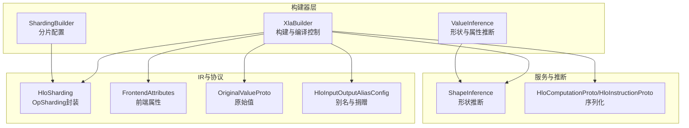
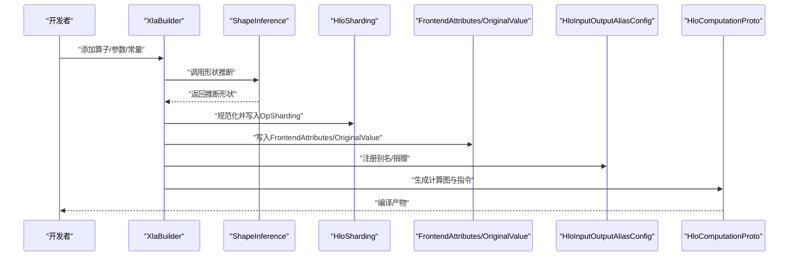
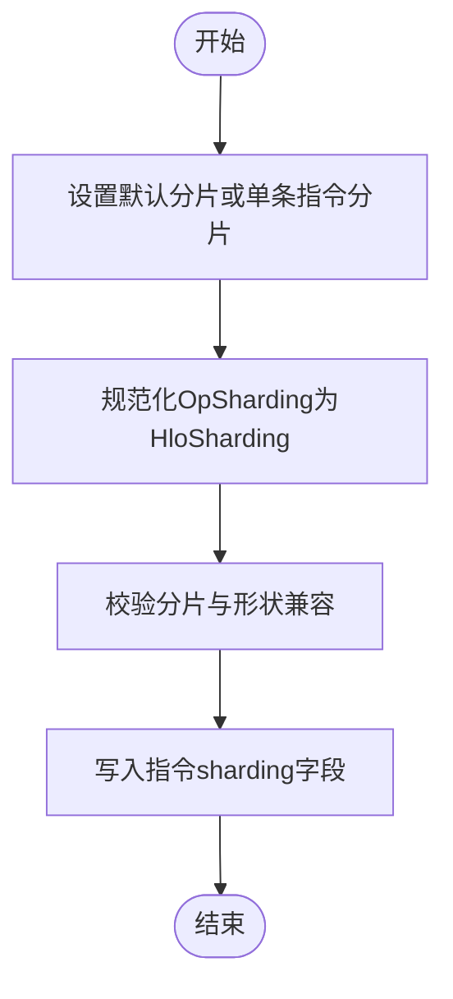
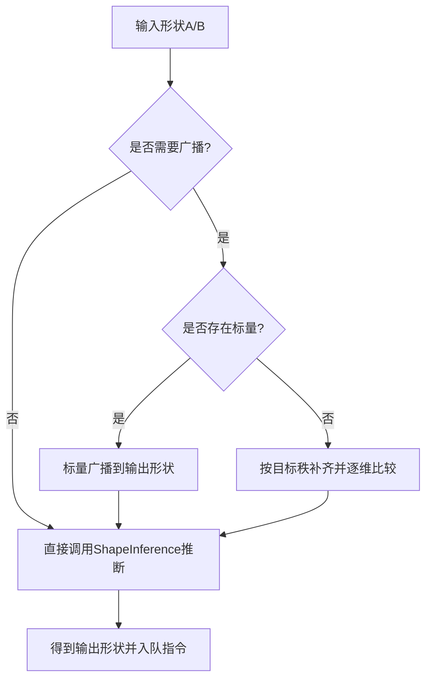
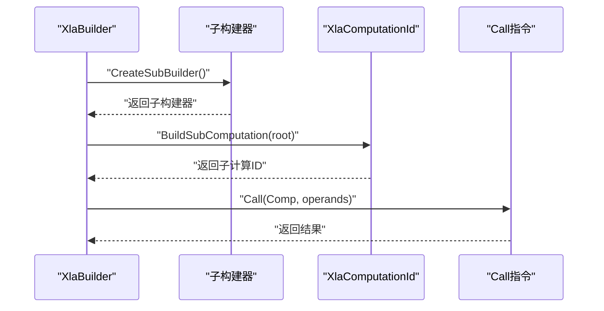
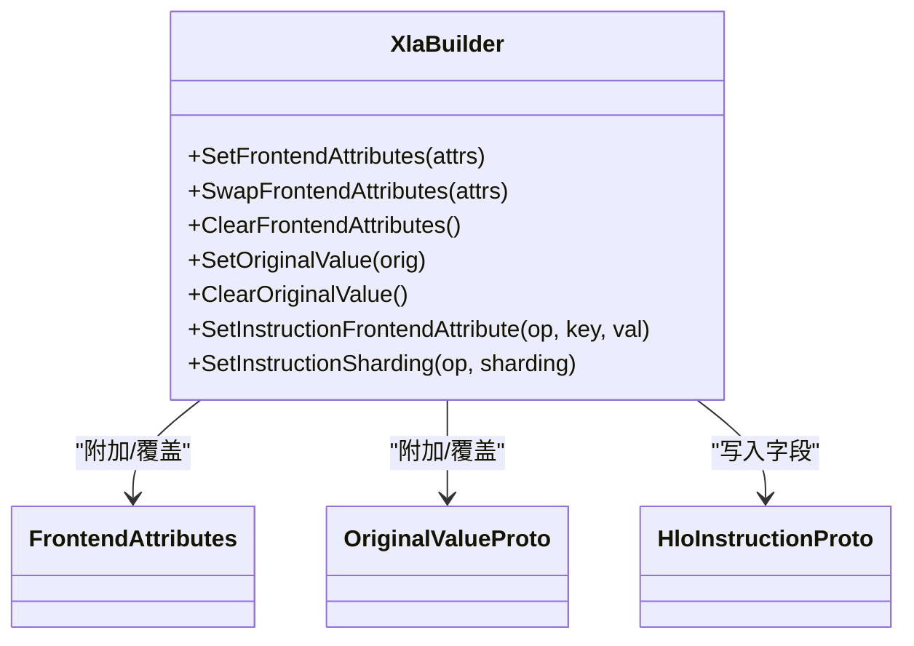
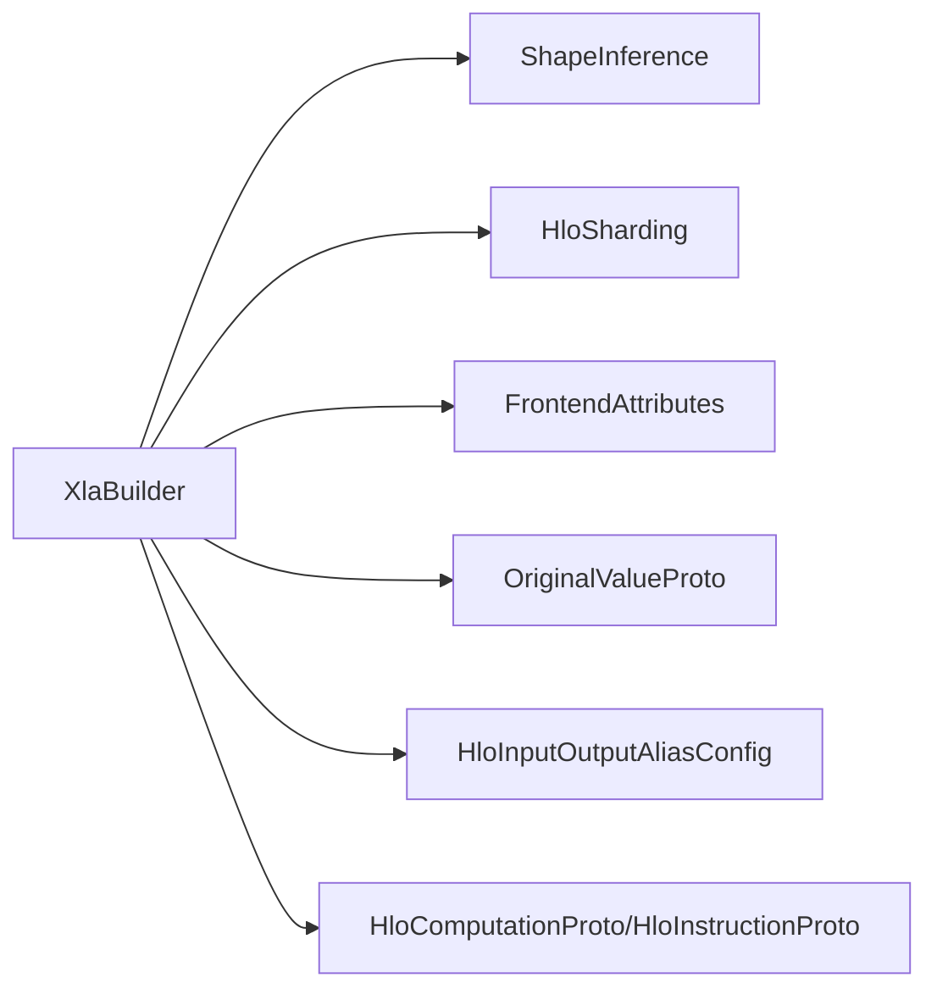

# 高级构建特性

<cite>
**本文引用的文件**
- [xla_builder.h](file://xla/hlo/builder/xla_builder.h)
- [xla_builder.cc](file://xla/hlo/builder/xla_builder.cc)
- [sharding_builder.h](file://xla/hlo/builder/sharding_builder.h)
- [sharding_builder.cc](file://xla/hlo/builder/sharding_builder.cc)
- [value_inference.h](file://xla/hlo/builder/value_inference.h)
- [value_inference.cc](file://xla/hlo/builder/value_inference.cc)
- [service/shape_inference.h](file://xla/service/shape_inference.h)
- [hlo_sharding.h](file://xla/hlo/ir/hlo_sharding.h)
- [hlo_original_value.h](file://xla/hlo/ir/hlo_original_value.h)
- [hlo_input_output_alias_config.h](file://xla/hlo/ir/hlo_input_output_alias_config.h)
- [frontend_attributes.h](file://xla/frontend_attributes.h)
- [xla_data.proto](file://xla/xla_data.proto)
- [hlo.pb.h](file://xla/service/hlo.pb.h)
</cite>

## 目录
1. [简介](#简介)
2. [项目结构](#项目结构)
3. [核心组件](#核心组件)
4. [架构总览](#架构总览)
5. [详细组件分析](#详细组件分析)
6. [依赖关系分析](#依赖关系分析)
7. [性能考虑](#性能考虑)
8. [故障排除指南](#故障排除指南)
9. [结论](#结论)
10. [附录](#附录)

## 简介
本文件面向需要在XLA HLO构建器上进行高级开发与优化的工程师，系统性阐述以下主题：
- 分片构建：ShardingBuilder的使用与OpSharding配置策略
- 形状推断：ValueInference工作原理与自动形状计算流程
- 复杂操作构建：动态形状、嵌套计算图、条件操作等
- 高级构建模式：性能优化技巧与内存管理策略
- 元数据管理：前端属性与原始值设置
- 高级调试与故障排除

## 项目结构
围绕HLO构建器的高级特性，相关源码主要集中在以下模块：
- 构建器核心：XlaBuilder类及其公共/私有接口
- 形状推断：基于service/shape_inference的推断逻辑
- 分片工具：ShardingBuilder与OpSharding规范化
- 值推断：ValueInference用于推导形状与属性
- 元数据与别名：FrontendAttributes、OriginalValue、输入输出别名与缓冲区捐赠

**图表来源**
- [xla_builder.h](file://xla/hlo/builder/xla_builder.h#L287-L599)
- [xla_builder.cc](file://xla/hlo/builder/xla_builder.cc#L114-L124)
- [sharding_builder.h](file://xla/hlo/builder/sharding_builder.h)
- [sharding_builder.cc](file://xla/hlo/builder/sharding_builder.cc)
- [value_inference.h](file://xla/hlo/builder/value_inference.h)
- [value_inference.cc](file://xla/hlo/builder/value_inference.cc)
- [service/shape_inference.h](file://xla/service/shape_inference.h)
- [hlo_sharding.h](file://xla/hlo/ir/hlo_sharding.h)
- [hlo_input_output_alias_config.h](file://xla/hlo/ir/hlo_input_output_alias_config.h)
- [frontend_attributes.h](file://xla/frontend_attributes.h)
- [hlo.pb.h](file://xla/service/hlo.pb.h)

**章节来源**
- [xla_builder.h](file://xla/hlo/builder/xla_builder.h#L287-L599)
- [xla_builder.cc](file://xla/hlo/builder/xla_builder.cc#L114-L124)

## 核心组件
- XlaBuilder：构建器核心，负责指令入队、形状查询、元数据与分片设置、子计算构建、编译产物生成
- ShardingBuilder：分片配置工具，提供OpSharding的构造与规范化
- ValueInference：值推断引擎，结合ShapeInference完成形状与属性推断
- 元数据与别名：FrontendAttributes、OriginalValue、输入输出别名与缓冲区捐赠配置

**章节来源**
- [xla_builder.h](file://xla/hlo/builder/xla_builder.h#L287-L599)
- [xla_builder.cc](file://xla/hlo/builder/xla_builder.cc#L114-L124)
- [sharding_builder.h](file://xla/hlo/builder/sharding_builder.h)
- [sharding_builder.cc](file://xla/hlo/builder/sharding_builder.cc)
- [value_inference.h](file://xla/hlo/builder/value_inference.h)
- [value_inference.cc](file://xla/hlo/builder/value_inference.cc)

## 架构总览
下图展示从构建器到编译产物的关键路径，以及分片与元数据的注入点。

**图表来源**
- [xla_builder.cc](file://xla/hlo/builder/xla_builder.cc#L114-L124)
- [service/shape_inference.h](file://xla/service/shape_inference.h)
- [hlo_sharding.h](file://xla/hlo/ir/hlo_sharding.h)
- [hlo_input_output_alias_config.h](file://xla/hlo/ir/hlo_input_output_alias_config.h)
- [frontend_attributes.h](file://xla/frontend_attributes.h)
- [hlo.pb.h](file://xla/service/hlo.pb.h)

## 详细组件分析

### 分片构建与OpSharding配置
- 设置与清除分片：通过XlaBuilder的SetSharding/ClearSharding为后续指令附加默认分片；也可对单条指令调用SetInstructionSharding覆盖
- 规范化与校验：内部通过NormalizeAndAssignSharing将用户提供的OpSharding规范化为HloSharding，并验证与形状匹配
- 异步聚合与域：支持AllGather/AllReduce/CollectivePermute等异步聚合，以及Domain指令的入口/出口分片
- 分片作用域：XlaScopedShardingAssignment可临时覆盖当前分片上下文（例如在显式广播时避免对中间reshape施加分片）

**图表来源**
- [xla_builder.cc](file://xla/hlo/builder/xla_builder.cc#L114-L124)
- [xla_builder.h](file://xla/hlo/builder/xla_builder.h#L325-L377)

**章节来源**
- [xla_builder.h](file://xla/hlo/builder/xla_builder.h#L325-L377)
- [xla_builder.cc](file://xla/hlo/builder/xla_builder.cc#L114-L124)
- [hlo_sharding.h](file://xla/hlo/ir/hlo_sharding.h)

### 形状推断机制与ValueInference
- 推断入口：XlaBuilder在构造二元/一元/三元算子时，先调用ShapeInference推断形状，再入队指令
- 自动广播：对于二元运算，若输入维度不匹配且存在标量或退化维度，会自动插入显式广播序列或动态广播
- 动态形状：针对非有界动态形状，提供动态广播与最大维度拼接的处理路径
- 值推断：ValueInference在更高层提供对形状树与属性的推断能力，辅助复杂图构建

**图表来源**
- [xla_builder.cc](file://xla/hlo/builder/xla_builder.cc#L1345-L1427)
- [xla_builder.cc](file://xla/hlo/builder/xla_builder.cc#L1210-L1343)
- [service/shape_inference.h](file://xla/service/shape_inference.h)

**章节来源**
- [xla_builder.cc](file://xla/hlo/builder/xla_builder.cc#L1345-L1427)
- [xla_builder.cc](file://xla/hlo/builder/xla_builder.cc#L1210-L1343)
- [service/shape_inference.h](file://xla/service/shape_inference.h)

### 复杂操作构建
- 动态形状与切片：提供DynamicReshape、DynamicSlice、DynamicUpdateSlice等，支持运行时维度与索引
- 嵌套计算图：通过CreateSubBuilder与BuildSubComputation构建子计算，并以Call指令调用
- 条件操作：Select作为三元算子，配合隐式广播与形状推断，实现条件分支
- 聚合通信：AllGather/AllReduce/CollectivePermute等异步聚合，支持跨设备/跨程序的数据交换

**图表来源**
- [xla_builder.h](file://xla/hlo/builder/xla_builder.h#L409-L416)
- [xla_builder.h](file://xla/hlo/builder/xla_builder.h#L574-L574)
- [xla_builder.cc](file://xla/hlo/builder/xla_builder.cc#L824-L844)
- [xla_builder.cc](file://xla/hlo/builder/xla_builder.cc#L1581-L1599)

**章节来源**
- [xla_builder.h](file://xla/hlo/builder/xla_builder.h#L409-L416)
- [xla_builder.cc](file://xla/hlo/builder/xla_builder.cc#L824-L844)
- [xla_builder.cc](file://xla/hlo/builder/xla_builder.cc#L1581-L1599)

### 高级构建模式与性能优化
- 显式广播序列：在AddBroadcastSequence中消除大小为1的维度，减少后续算子的形状复杂度
- 作用域分片：在reshape等可能改变布局的算子前使用XlaScopedShardingAssignment临时清空分片，避免错误传播
- 别名与捐赠：通过SetUpAlias与AddBufferDonor降低内存占用，提升吞吐
- 动态维度移除：BuildComputationProto在必要时移除动态维度，确保后端兼容

**章节来源**
- [xla_builder.cc](file://xla/hlo/builder/xla_builder.cc#L1142-L1197)
- [xla_builder.cc](file://xla/hlo/builder/xla_builder.cc#L1189-L1196)
- [xla_builder.cc](file://xla/hlo/builder/xla_builder.cc#L905-L951)
- [xla_builder.h](file://xla/hlo/builder/xla_builder.h#L514-L547)

### 元数据管理：前端属性与原始值
- 前端属性：SetFrontendAttributes/SwapFrontendAttributes/ClearFrontendAttributes为所有指令附加FrontendAttributes
- 原始值：SetOriginalValue/ClearOriginalValue为指令附加OriginalValueProto，便于调试与溯源
- 指令级覆盖：SetInstructionFrontendAttribute/SetInstructionSharding仅影响单条指令

**图表来源**
- [xla_builder.h](file://xla/hlo/builder/xla_builder.h#L341-L377)
- [xla_builder.cc](file://xla/hlo/builder/xla_builder.cc#L770-L787)
- [frontend_attributes.h](file://xla/frontend_attributes.h)
- [hlo_original_value.h](file://xla/hlo/ir/hlo_original_value.h)
- [hlo.pb.h](file://xla/service/hlo.pb.h)

**章节来源**
- [xla_builder.h](file://xla/hlo/builder/xla_builder.h#L341-L377)
- [xla_builder.cc](file://xla/hlo/builder/xla_builder.cc#L770-L787)

## 依赖关系分析
- 构建器依赖ShapeInference进行形状推断
- 分片配置依赖HloSharding进行规范化与校验
- 元数据与别名通过协议字段写入HloInstructionProto/HloComputationProto
- 子计算通过XlaComputationId在父构建器中注册与复用

**图表来源**
- [xla_builder.cc](file://xla/hlo/builder/xla_builder.cc#L114-L124)
- [service/shape_inference.h](file://xla/service/shape_inference.h)
- [hlo_sharding.h](file://xla/hlo/ir/hlo_sharding.h)
- [hlo_input_output_alias_config.h](file://xla/hlo/ir/hlo_input_output_alias_config.h)
- [frontend_attributes.h](file://xla/frontend_attributes.h)
- [hlo.pb.h](file://xla/service/hlo.pb.h)

**章节来源**
- [xla_builder.cc](file://xla/hlo/builder/xla_builder.cc#L114-L124)
- [xla_builder.h](file://xla/hlo/builder/xla_builder.h#L520-L560)

## 性能考虑
- 减少隐式广播：优先使用显式广播序列，避免后端重复推断
- 合理使用别名与捐赠：在满足语义的前提下，通过SetUpAlias与AddBufferDonor降低拷贝开销
- 控制动态维度：在可静态化的场景尽量避免动态维度，或在构建阶段移除以提升后端兼容性
- 分片作用域管理：在reshape/转置等可能破坏布局的操作前后谨慎设置分片，避免无效重分片

## 故障排除指南
- 错误收集与延迟报告：构建器默认延迟报告错误，可通过first_error()/GetCurrentStatus()获取首次错误与堆栈
- 指令级错误：使用ReportError/ReportErrorOrReturn统一错误处理，避免在构建末尾才暴露问题
- 分片冲突：若出现分片与形状不兼容，检查HloSharding规范化过程与形状边界
- 元数据缺失：确认FrontendAttributes/OriginalValue是否正确设置，以及指令级覆盖是否生效

**章节来源**
- [xla_builder.h](file://xla/hlo/builder/xla_builder.h#L463-L494)
- [xla_builder.cc](file://xla/hlo/builder/xla_builder.cc#L614-L640)
- [xla_builder.cc](file://xla/hlo/builder/xla_builder.cc#L114-L124)

## 结论
通过对XlaBuilder、ShardingBuilder与ValueInference的协同使用，可以在保证形状正确性与分片合理性的前提下，高效构建复杂的HLO计算图。结合别名与捐赠策略、作用域分片管理与动态维度处理，能够显著提升性能与可维护性。建议在大型图构建中引入严格的形状推断与分片校验流程，并充分利用元数据与错误报告机制进行调试与定位。

## 附录
- 关键API参考路径
  - 分片设置与规范化：[xla_builder.cc](file://xla/hlo/builder/xla_builder.cc#L114-L124)
  - 形状推断与广播：[xla_builder.cc](file://xla/hlo/builder/xla_builder.cc#L1345-L1427)
  - 子计算构建与调用：[xla_builder.h](file://xla/hlo/builder/xla_builder.h#L409-L416), [xla_builder.cc](file://xla/hlo/builder/xla_builder.cc#L824-L844), [xla_builder.cc](file://xla/hlo/builder/xla_builder.cc#L1581-L1599)
  - 元数据与别名：[xla_builder.h](file://xla/hlo/builder/xla_builder.h#L341-L377), [xla_builder.cc](file://xla/hlo/builder/xla_builder.cc#L770-L787), [xla_builder.cc](file://xla/hlo/builder/xla_builder.cc#L953-L1009)