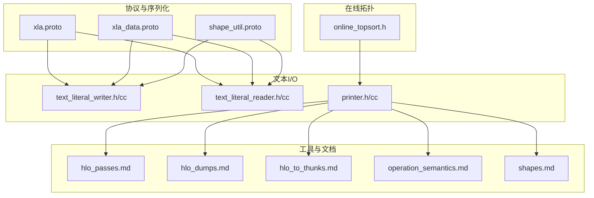
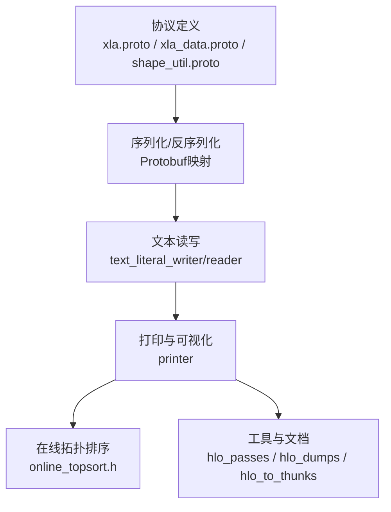
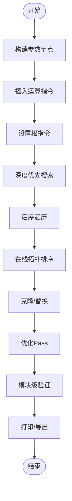
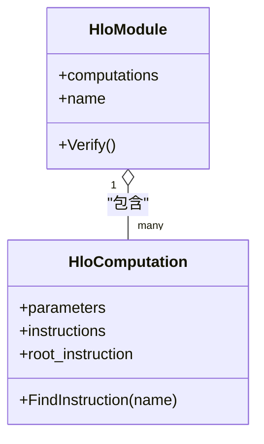
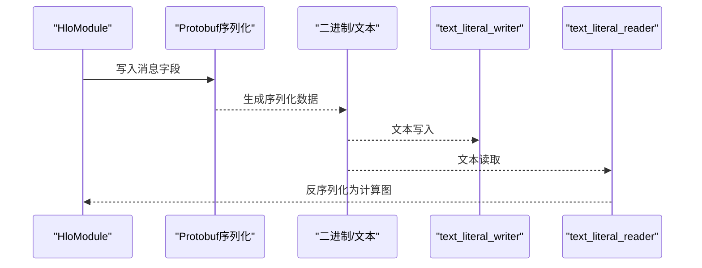
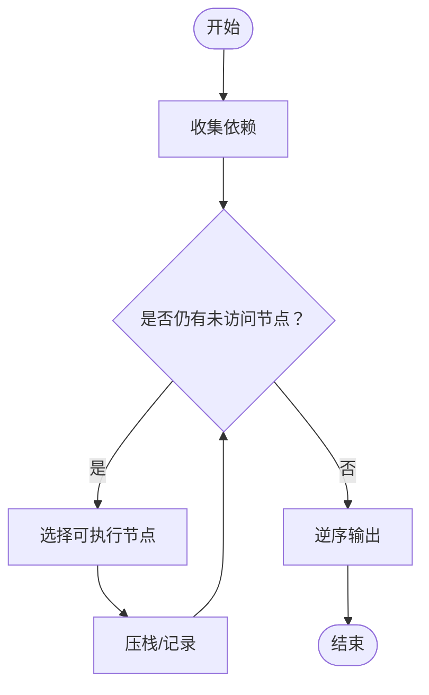
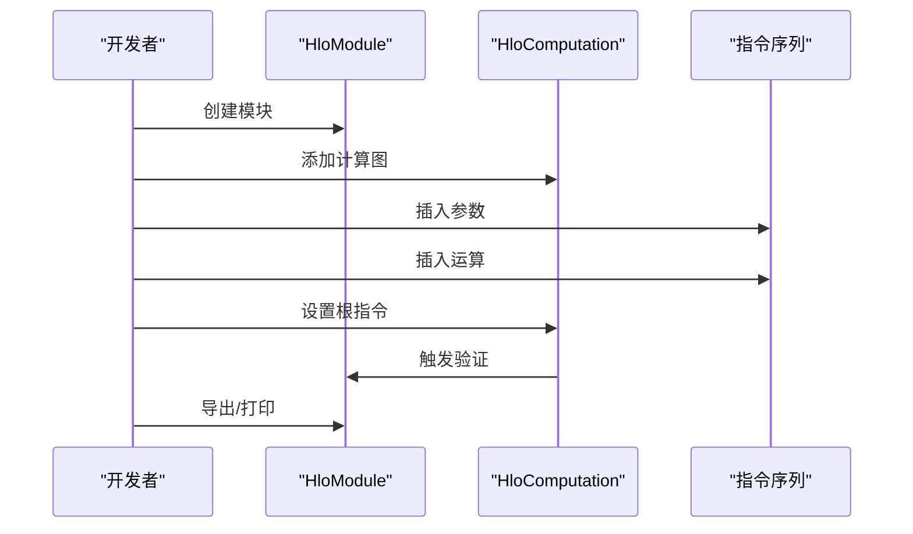
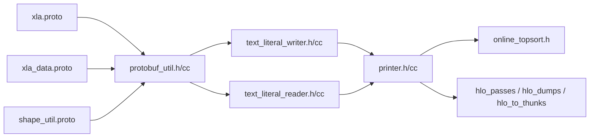

# HLO计算图

<cite>
**本文引用的文件**
- [xla.proto](file://xla.proto)
- [xla_data.proto](file://xla_data.proto)
- [shape_util.proto](file://shape_util.proto)
- [online_topsort.h](file://online_topsort.h)
- [online_topsort_test.cc](file://online_topsort_test.cc)
- [protobuf_util.h](file://protobuf_util.h)
- [protobuf_util.cc](file://protobuf_util.cc)
- [text_literal_writer.h](file://text_literal_writer.h)
- [text_literal_writer.cc](file://text_literal_writer.cc)
- [text_literal_reader.h](file://text_literal_reader.h)
- [text_literal_reader.cc](file://text_literal_reader.cc)
- [printer.h](file://printer.h)
- [printer.cc](file://printer.cc)
- [hlo_passes.md](file://docs/hlo_passes.md)
- [hlo_dumps.md](file://docs/hlo_dumps.md)
- [hlo_to_thunks.md](file://docs/hlo_to_thunks.md)
- [operation_semantics.md](file://docs/operation_semantics.md)
- [shapes.md](file://docs/shapes.md)
- [README.md](file://README.md)
</cite>

## 目录
1. [引言](#引言)
2. [项目结构](#项目结构)
3. [核心组件](#核心组件)
4. [架构总览](#架构总览)
5. [详细组件分析](#详细组件分析)
6. [依赖分析](#依赖分析)
7. [性能考虑](#性能考虑)
8. [故障排查指南](#故障排查指南)
9. [结论](#结论)
10. [附录](#附录)

## 引言
本文件围绕XLA中的HLO（High-Level Optimizer）计算图体系，系统阐述HloComputation与HloModule的设计理念、数据流与控制流组织方式，并结合仓库内可用的协议定义与工具文档，给出计算图的构建、遍历、序列化与反序列化、克隆与替换、优化与验证等关键主题的技术要点与实践建议。由于仓库中未直接提供HLO IR的C++源码文件，本文以协议定义与相关工具文档为依据，辅以概念性流程图帮助理解。

## 项目结构
XLA的HLO相关能力主要通过以下路径组织：
- 协议与序列化：xla.proto、xla_data.proto、shape_util.proto
- 在线拓扑排序：online_topsort.h/.cc
- 文本读写与打印：text_literal_writer/reader、printer
- 工具与文档：hlo_passes.md、hlo_dumps.md、hlo_to_thunks.md、operation_semantics.md、shapes.md

**图表来源**
- [xla.proto](file://xla.proto)
- [xla_data.proto](file://xla_data.proto)
- [shape_util.proto](file://shape_util.proto)
- [online_topsort.h](file://online_topsort.h)
- [text_literal_writer.h](file://text_literal_writer.h)
- [text_literal_writer.cc](file://text_literal_writer.cc)
- [text_literal_reader.h](file://text_literal_reader.h)
- [text_literal_reader.cc](file://text_literal_reader.cc)
- [printer.h](file://printer.h)
- [printer.cc](file://printer.cc)
- [hlo_passes.md](file://docs/hlo_passes.md)
- [hlo_dumps.md](file://docs/hlo_dumps.md)
- [hlo_to_thunks.md](file://docs/hlo_to_thunks.md)
- [operation_semantics.md](file://docs/operation_semantics.md)
- [shapes.md](file://docs/shapes.md)

**章节来源**
- [README.md](file://README.md)
- [xla.proto](file://xla.proto)
- [xla_data.proto](file://xla_data.proto)
- [shape_util.proto](file://shape_util.proto)
- [online_topsort.h](file://online_topsort.h)
- [online_topsort_test.cc](file://online_topsort_test.cc)
- [protobuf_util.h](file://protobuf_util.h)
- [protobuf_util.cc](file://protobuf_util.cc)
- [text_literal_writer.h](file://text_literal_writer.h)
- [text_literal_writer.cc](file://text_literal_writer.cc)
- [text_literal_reader.h](file://text_literal_reader.h)
- [text_literal_reader.cc](file://text_literal_reader.cc)
- [printer.h](file://printer.h)
- [printer.cc](file://printer.cc)
- [hlo_passes.md](file://docs/hlo_passes.md)
- [hlo_dumps.md](file://docs/hlo_dumps.md)
- [hlo_to_thunks.md](file://docs/hlo_to_thunks.md)
- [operation_semantics.md](file://docs/operation_semantics.md)
- [shapes.md](file://docs/shapes.md)

## 核心组件
- HloModule（模块级容器）
  - 职责：承载一个或多个HloComputation；维护模块级属性与验证；管理计算图集合。
  - 关键点：模块级验证、计算图命名与索引、与上层编译器集成。
- HloComputation（计算图）
  - 职责：组织指令序列、参数管理、根指令设置、遍历与访问接口。
  - 关键点：参数节点、根指令、指令顺序与依赖关系。
- 指令（HloInstruction）
  - 职责：表达具体运算、输入输出形状、属性与元数据。
  - 关键点：操作类型、形状推导、属性序列化。

上述职责与关系在协议与工具文档中有明确体现，例如模块与计算图的层次关系、指令序列化字段、形状描述等。

**章节来源**
- [xla.proto](file://xla.proto)
- [xla_data.proto](file://xla_data.proto)
- [hlo_passes.md](file://docs/hlo_passes.md)
- [operation_semantics.md](file://docs/operation_semantics.md)
- [shapes.md](file://docs/shapes.md)

## 架构总览
下图展示了从协议到文本/二进制序列化、再到打印与验证的整体链路，以及与在线拓扑排序的衔接。

**图表来源**
- [xla.proto](file://xla.proto)
- [xla_data.proto](file://xla_data.proto)
- [shape_util.proto](file://shape_util.proto)
- [protobuf_util.h](file://protobuf_util.h)
- [protobuf_util.cc](file://protobuf_util.cc)
- [text_literal_writer.h](file://text_literal_writer.h)
- [text_literal_writer.cc](file://text_literal_writer.cc)
- [text_literal_reader.h](file://text_literal_reader.h)
- [text_literal_reader.cc](file://text_literal_reader.cc)
- [printer.h](file://printer.h)
- [printer.cc](file://printer.cc)
- [online_topsort.h](file://online_topsort.h)
- [hlo_passes.md](file://docs/hlo_passes.md)
- [hlo_dumps.md](file://docs/hlo_dumps.md)
- [hlo_to_thunks.md](file://docs/hlo_to_thunks.md)

## 详细组件分析

### HloComputation设计与实现要点
- 计算图构建
  - 参数管理：通过参数指令建立输入边界，支持按位置或名称访问。
  - 指令插入：以有向无环图形式追加指令，确保输入先于使用。
  - 根指令设置：最终确定输出根节点，驱动后续形状推导与验证。
- 遍历算法
  - 深度优先搜索（DFS）：用于依赖收集与拓扑排序。
  - 后序遍历：保证指令处理顺序满足数据依赖。
  - 拓扑排序：在线拓扑排序支持动态变更场景。
- 克隆与替换
  - 克隆：复制指令及其依赖，保持形状与属性一致。
  - 替换：以新指令替换旧指令，更新所有引用并重做验证。
- 优化与验证
  - Pass框架：通过一系列变换Pass对计算图进行优化。
  - 模块级验证：在计算图集合层面执行一致性检查。

**图表来源**
- [online_topsort.h](file://online_topsort.h)
- [hlo_passes.md](file://docs/hlo_passes.md)
- [hlo_dumps.md](file://docs/hlo_dumps.md)
- [operation_semantics.md](file://docs/operation_semantics.md)
- [shapes.md](file://docs/shapes.md)

**章节来源**
- [online_topsort.h](file://online_topsort.h)
- [online_topsort_test.cc](file://online_topsort_test.cc)
- [hlo_passes.md](file://docs/hlo_passes.md)
- [hlo_dumps.md](file://docs/hlo_dumps.md)
- [operation_semantics.md](file://docs/operation_semantics.md)
- [shapes.md](file://docs/shapes.md)

### HloModule作为容器
- 多计算图组织
  - 一个模块可包含多个计算图（如主计算图、嵌套调用等），彼此通过调用指令连接。
  - 计算图命名与索引便于定位与调试。
- 模块级验证
  - 统一检查形状一致性、参数与根指令匹配、指令合法性等。
- 与上层编译器集成
  - 作为编译流水线的中间表示，向下传递给后端生成器。

**图表来源**
- [xla.proto](file://xla.proto)
- [xla_data.proto](file://xla_data.proto)

**章节来源**
- [xla.proto](file://xla.proto)
- [xla_data.proto](file://xla_data.proto)

### 序列化与反序列化（Protobuf映射）
- Protobuf映射
  - 使用xla.proto/xla_data.proto/shape_util.proto中定义的消息类型，将HLO计算图结构映射为二进制或文本格式。
  - 字段覆盖：模块名、计算图列表、指令序列、形状信息、属性字典等。
- 文本读写
  - text_literal_writer/reader提供人类可读的文本格式读写能力，便于调试与版本对比。
- 打印与可视化
  - printer负责将计算图转换为可读字符串，配合工具文档进行可视化与分析。

**图表来源**
- [xla.proto](file://xla.proto)
- [xla_data.proto](file://xla_data.proto)
- [shape_util.proto](file://shape_util.proto)
- [protobuf_util.h](file://protobuf_util.h)
- [protobuf_util.cc](file://protobuf_util.cc)
- [text_literal_writer.h](file://text_literal_writer.h)
- [text_literal_writer.cc](file://text_literal_writer.cc)
- [text_literal_reader.h](file://text_literal_reader.h)
- [text_literal_reader.cc](file://text_literal_reader.cc)
- [printer.h](file://printer.h)
- [printer.cc](file://printer.cc)

**章节来源**
- [xla.proto](file://xla.proto)
- [xla_data.proto](file://xla_data.proto)
- [shape_util.proto](file://shape_util.proto)
- [protobuf_util.h](file://protobuf_util.h)
- [protobuf_util.cc](file://protobuf_util.cc)
- [text_literal_writer.h](file://text_literal_writer.h)
- [text_literal_writer.cc](file://text_literal_writer.cc)
- [text_literal_reader.h](file://text_literal_reader.h)
- [text_literal_reader.cc](file://text_literal_reader.cc)
- [printer.h](file://printer.h)
- [printer.cc](file://printer.cc)

### 遍历算法与在线拓扑排序
- DFS与后序遍历
  - 用于收集指令依赖、检测环、确定执行顺序。
- 在线拓扑排序
  - 支持动态插入/删除边后的增量排序，适合交互式或渐进式构建场景。

**图表来源**
- [online_topsort.h](file://online_topsort.h)
- [online_topsort_test.cc](file://online_topsort_test.cc)

**章节来源**
- [online_topsort.h](file://online_topsort.h)
- [online_topsort_test.cc](file://online_topsort_test.cc)

### 具体示例：构建复杂计算图的步骤
- 步骤1：创建HloModule并添加主HloComputation。
- 步骤2：在计算图中插入参数指令，建立输入边界。
- 步骤3：逐步插入运算指令，确保输入先于使用。
- 步骤4：设置根指令，完成形状推导与模块级验证。
- 步骤5：应用优化Pass，导出文本或二进制格式。

**图表来源**
- [hlo_passes.md](file://docs/hlo_passes.md)
- [hlo_dumps.md](file://docs/hlo_dumps.md)
- [operation_semantics.md](file://docs/operation_semantics.md)
- [shapes.md](file://docs/shapes.md)

**章节来源**
- [hlo_passes.md](file://docs/hlo_passes.md)
- [hlo_dumps.md](file://docs/hlo_dumps.md)
- [operation_semantics.md](file://docs/operation_semantics.md)
- [shapes.md](file://docs/shapes.md)

## 依赖分析
- 协议依赖：xla.proto/xla_data.proto/shape_util.proto为序列化与反序列化的基础。
- 工具依赖：printer与在线拓扑排序共同支撑计算图的可视化与顺序保证。
- 文档依赖：hlo_passes/hlo_dumps/hlo_to_thunks等文档指导优化与调试流程。

**图表来源**
- [xla.proto](file://xla.proto)
- [xla_data.proto](file://xla_data.proto)
- [shape_util.proto](file://shape_util.proto)
- [protobuf_util.h](file://protobuf_util.h)
- [protobuf_util.cc](file://protobuf_util.cc)
- [text_literal_writer.h](file://text_literal_writer.h)
- [text_literal_writer.cc](file://text_literal_writer.cc)
- [text_literal_reader.h](file://text_literal_reader.h)
- [text_literal_reader.cc](file://text_literal_reader.cc)
- [printer.h](file://printer.h)
- [printer.cc](file://printer.cc)
- [online_topsort.h](file://online_topsort.h)
- [hlo_passes.md](file://docs/hlo_passes.md)
- [hlo_dumps.md](file://docs/hlo_dumps.md)
- [hlo_to_thunks.md](file://docs/hlo_to_thunks.md)

**章节来源**
- [xla.proto](file://xla.proto)
- [xla_data.proto](file://xla_data.proto)
- [shape_util.proto](file://shape_util.proto)
- [protobuf_util.h](file://protobuf_util.h)
- [protobuf_util.cc](file://protobuf_util.cc)
- [text_literal_writer.h](file://text_literal_writer.h)
- [text_literal_writer.cc](file://text_literal_writer.cc)
- [text_literal_reader.h](file://text_literal_reader.h)
- [text_literal_reader.cc](file://text_literal_reader.cc)
- [printer.h](file://printer.h)
- [printer.cc](file://printer.cc)
- [online_topsort.h](file://online_topsort.h)
- [hlo_passes.md](file://docs/hlo_passes.md)
- [hlo_dumps.md](file://docs/hlo_dumps.md)
- [hlo_to_thunks.md](file://docs/hlo_to_thunks.md)

## 性能考虑
- 遍历与排序
  - DFS与后序遍历的时间复杂度与指令数量线性相关；在线拓扑排序适合频繁变更场景。
- 序列化开销
  - Protobuf序列化/反序列化成本与指令规模和属性数量相关；建议批量处理与缓存热点模块。
- 优化Pass
  - Pass链的顺序与组合影响整体性能；应结合形状与设备特性进行针对性优化。

[本节为通用指导，无需特定文件来源]

## 故障排查指南
- 形状不匹配
  - 现象：根指令与参数形状不一致。
  - 排查：核对operation_semantics与shapes文档，确认形状推导规则。
- 验证失败
  - 现象：模块级验证报错。
  - 排查：启用hlo_dumps输出中间状态，定位具体计算图与指令。
- 序列化异常
  - 现象：文本/二进制读写失败。
  - 排查：检查Protobuf映射字段完整性，参考text_literal_writer/reader的错误处理。

**章节来源**
- [operation_semantics.md](file://docs/operation_semantics.md)
- [shapes.md](file://docs/shapes.md)
- [hlo_dumps.md](file://docs/hlo_dumps.md)
- [text_literal_writer.h](file://text_literal_writer.h)
- [text_literal_writer.cc](file://text_literal_writer.cc)
- [text_literal_reader.h](file://text_literal_reader.h)
- [text_literal_reader.cc](file://text_literal_reader.cc)

## 结论
本文基于XLA仓库内的协议与工具文档，系统梳理了HLO计算图的容器模型、构建流程、遍历与排序、序列化与反序列化、以及优化与验证的关键环节。尽管仓库未直接提供HLO IR的C++实现文件，但通过协议定义与工具链文档，可以清晰把握HLO计算图的结构与行为，并据此开展构建、调试与优化工作。

[本节为总结，无需特定文件来源]

## 附录
- 相关文档
  - HLO Passes：[hlo_passes.md](file://docs/hlo_passes.md)
  - HLO转Thunk：[hlo_to_thunks.md](file://docs/hlo_to_thunks.md)
  - HLO转储与可视化：[hlo_dumps.md](file://docs/hlo_dumps.md)
  - 运算语义：[operation_semantics.md](file://docs/operation_semantics.md)
  - 形状与布局：[shapes.md](file://docs/shapes.md)

[本节为概览，无需特定文件来源]