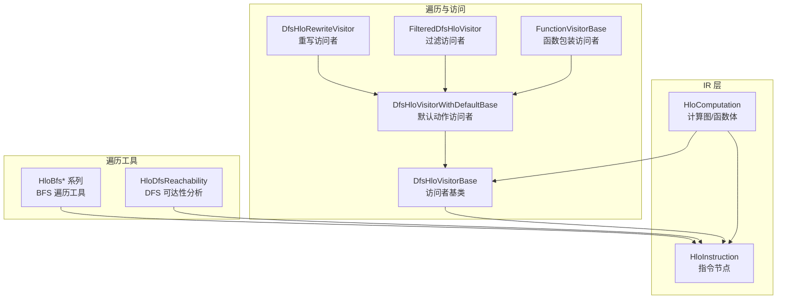
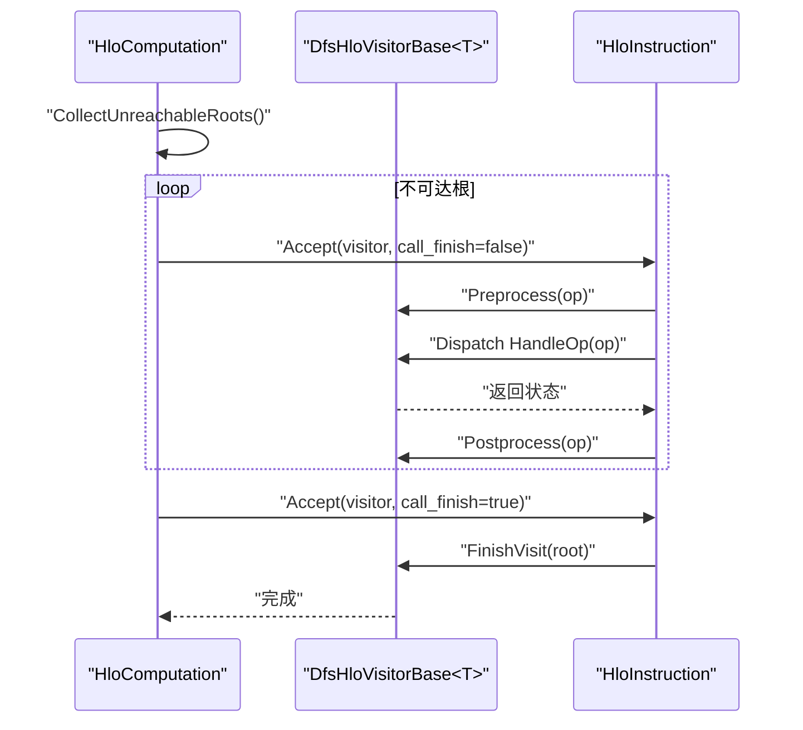
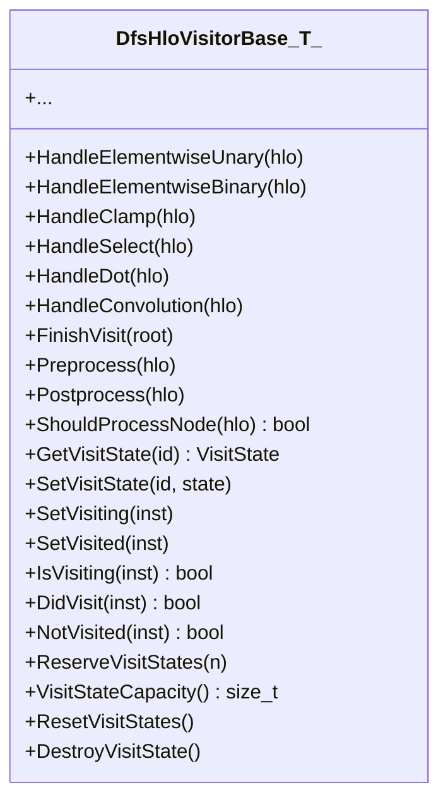
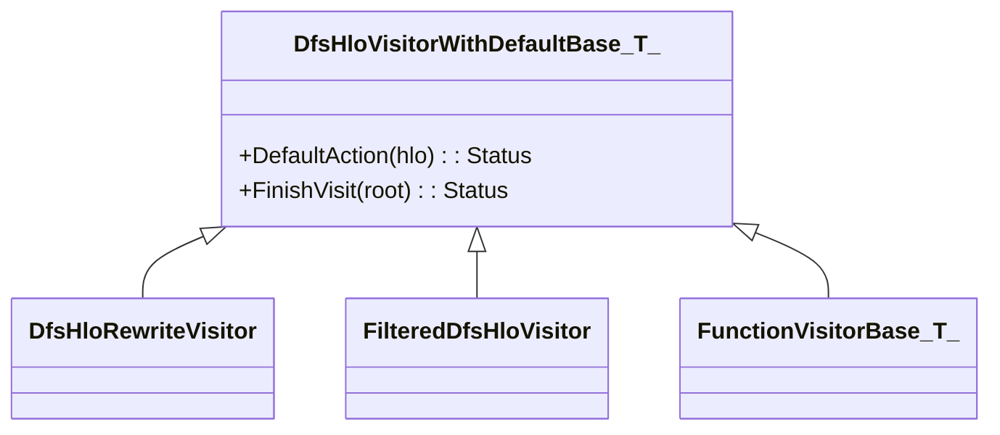
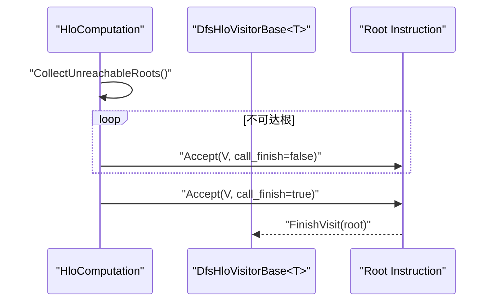
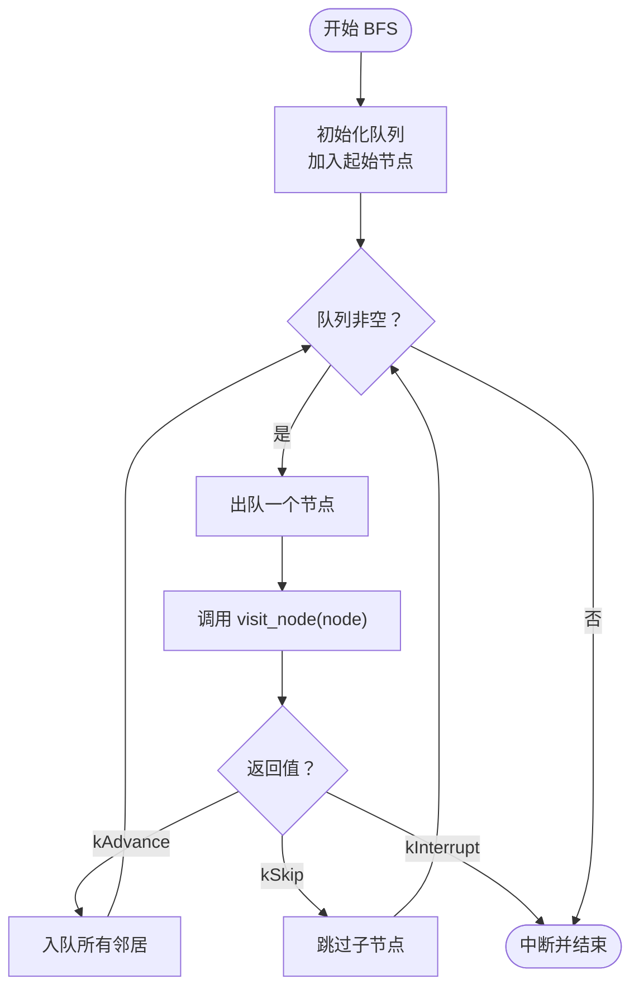
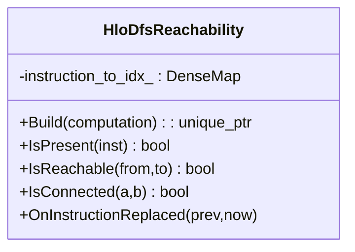
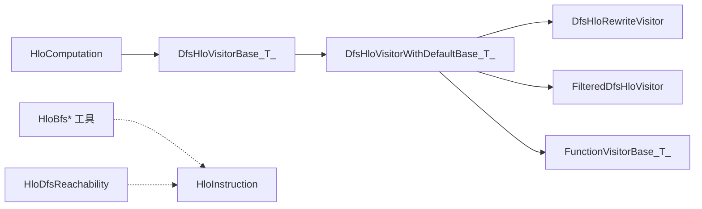

# 图遍历与访问

<cite>
**本文引用的文件**
- [dfs_hlo_visitor.h](file://xla/hlo/ir/dfs_hlo_visitor.h)
- [dfs_hlo_visitor_with_default.h](file://xla/hlo/ir/dfs_hlo_visitor_with_default.h)
- [hlo_traversal.h](file://xla/hlo/utils/hlo_traversal.h)
- [hlo_dfs_reachability.h](file://xla/hlo/analysis/hlo_dfs_reachability.h)
- [hlo_computation.h](file://xla/hlo/ir/hlo_computation.h)
</cite>

## 目录
1. [简介](#简介)
2. [项目结构](#项目结构)
3. [核心组件](#核心组件)
4. [架构总览](#架构总览)
5. [详细组件分析](#详细组件分析)
6. [依赖关系分析](#依赖关系分析)
7. [性能考量](#性能考量)
8. [故障排查指南](#故障排查指南)
9. [结论](#结论)
10. [附录](#附录)

## 简介
本文件围绕 XLA 的 HLO（High-Level Optimizer）计算图遍历系统进行系统化文档化，重点阐述深度优先搜索（DFS）在 HLO 图中的应用，包括前序遍历、后序遍历与拓扑排序的实现方式；详解 DfsHloVisitor 基类的设计模式（访问者模式）、指令类型分发机制与状态管理；总结不同遍历策略的选择原则（性能与内存优化）；并提供可扩展的自定义遍历逻辑示例路径、剪枝与早期终止策略，以及与 BFS 遍历工具的对比。

## 项目结构
与图遍历与访问相关的核心文件分布如下：
- 访问者基类与默认实现：xla/hlo/ir/dfs_hlo_visitor.h、xla/hlo/ir/dfs_hlo_visitor_with_default.h
- 计算图访问入口：xla/hlo/ir/hlo_computation.h（提供 Accept 遍历接口）
- 额外遍历工具：xla/hlo/utils/hlo_traversal.h（BFS 工具族）
- 可达性分析：xla/hlo/analysis/hlo_dfs_reachability.h（基于 DFS 的可达性查询）

图表来源
- [hlo_computation.h](file://xla/hlo/ir/hlo_computation.h#L1180-L1198)
- [dfs_hlo_visitor.h](file://xla/hlo/ir/dfs_hlo_visitor.h#L60-L462)
- [dfs_hlo_visitor_with_default.h](file://xla/hlo/ir/dfs_hlo_visitor_with_default.h#L45-L315)
- [hlo_traversal.h](file://xla/hlo/utils/hlo_traversal.h#L134-L211)
- [hlo_dfs_reachability.h](file://xla/hlo/analysis/hlo_dfs_reachability.h#L37-L64)

章节来源
- [dfs_hlo_visitor.h](file://xla/hlo/ir/dfs_hlo_visitor.h#L1-L462)
- [dfs_hlo_visitor_with_default.h](file://xla/hlo/ir/dfs_hlo_visitor_with_default.h#L1-L457)
- [hlo_traversal.h](file://xla/hlo/utils/hlo_traversal.h#L1-L215)
- [hlo_dfs_reachability.h](file://xla/hlo/analysis/hlo_dfs_reachability.h#L1-L69)
- [hlo_computation.h](file://xla/hlo/ir/hlo_computation.h#L1180-L1198)

## 核心组件
- DfsHloVisitorBase<T>：定义了 HLO 指令的深度优先访问框架，提供统一的 Handle* 分发、状态管理（kNotVisited/kVisiting/kVisited）、预处理/后处理钩子与节点过滤能力。
- DfsHloVisitorWithDefaultBase<T>：在基类基础上引入“默认动作”，将大量指令类型统一委托给 DefaultAction，便于快速实现通用遍历。
- DfsHloRewriteVisitor：在默认访问者之上增加重写能力，支持 ReplaceWithNewInstruction/ReplaceInstruction 等替换操作，并维护 changed 标志。
- FilteredDfsHloVisitor：对指令集合进行过滤后再执行动作，适合按条件选择性处理。
- FunctionVisitorBase<T>：将 std::function 封装为访问者，便于以函数式风格接入遍历流程。
- HloComputation::Accept：为计算图提供统一的 DFS 入口，先遍历不可达根，最后遍历主根，确保 FinishVisit 在结束时被调用。
- HloBfs* 系列：提供消费者优先（consumers-first）与生产者优先（producers-first）的 BFS 遍历工具，用于替代或补充 DFS。
- HloDfsReachability：基于 DFS 的可达性分析器，构建 defs-before-uses 的拓扑序索引，加速可达性查询。

章节来源
- [dfs_hlo_visitor.h](file://xla/hlo/ir/dfs_hlo_visitor.h#L60-L462)
- [dfs_hlo_visitor_with_default.h](file://xla/hlo/ir/dfs_hlo_visitor_with_default.h#L45-L315)
- [hlo_computation.h](file://xla/hlo/ir/hlo_computation.h#L1180-L1198)
- [hlo_traversal.h](file://xla/hlo/utils/hlo_traversal.h#L134-L211)
- [hlo_dfs_reachability.h](file://xla/hlo/analysis/hlo_dfs_reachability.h#L37-L64)

## 架构总览
下图展示了从计算图到访问者的调用链路，以及默认动作与重写访问者的扩展点。

图表来源
- [hlo_computation.h](file://xla/hlo/ir/hlo_computation.h#L1180-L1198)
- [dfs_hlo_visitor.h](file://xla/hlo/ir/dfs_hlo_visitor.h#L417-L442)

## 详细组件分析

### DfsHloVisitorBase<T> 设计与状态机
- 访问者模式：通过 Handle* 方法对不同 HLO 操作类型进行分发，子类只需覆盖关心的类型，未覆盖的类型由默认实现返回未实现错误。
- 状态管理：使用整数 ID 到 VisitState 的映射跟踪访问状态，保证每个指令仅访问一次，且遵循“未访问 → 正在访问 → 已访问”的单向流转。
- 生命周期钩子：Preprocess/Postprocess 提供在处理前后插入逻辑的机会；ShouldProcessNode 支持跳过某些节点（剪枝）。
- 容量提示：ReserveVisitStates/VisitStateCapacity/DestroyVisitState/ResetVisitStates 支持性能优化与内存回收。

图表来源
- [dfs_hlo_visitor.h](file://xla/hlo/ir/dfs_hlo_visitor.h#L60-L462)

章节来源
- [dfs_hlo_visitor.h](file://xla/hlo/ir/dfs_hlo_visitor.h#L60-L462)

### DfsHloVisitorWithDefaultBase<T> 与扩展类
- 默认动作：将大量常见指令类型统一委托给 DefaultAction，减少重复样板代码。
- 扩展类：
  - DfsHloRewriteVisitor：在遍历过程中进行指令替换，维护 changed 标志，适合重写/规范化 pass。
  - FilteredDfsHloVisitor：结合过滤器与动作函数，仅对满足条件的节点执行。
  - FunctionVisitorBase<T>：将函数对象包装为访问者，便于以函数式风格接入。

图表来源
- [dfs_hlo_visitor_with_default.h](file://xla/hlo/ir/dfs_hlo_visitor_with_default.h#L45-L315)

章节来源
- [dfs_hlo_visitor_with_default.h](file://xla/hlo/ir/dfs_hlo_visitor_with_default.h#L45-L315)

### HloComputation::Accept 与 DFS 控制流
- 先行遍历不可达根，再遍历主根，确保 FinishVisit 在整个遍历结束后被调用一次。
- 遍历过程中若指令被删除或替换，访问者可通过 SetVisited/ReserveVisitStates 等手段避免重复访问或越界。

图表来源
- [hlo_computation.h](file://xla/hlo/ir/hlo_computation.h#L1180-L1198)

章节来源
- [hlo_computation.h](file://xla/hlo/ir/hlo_computation.h#L1180-L1198)

### BFS 遍历工具与 DFS 的互补
- HloBfsConsumersFirstTraversal/HloBfsProducersFirstTraversal：提供消费者优先与生产者优先的 BFS 遍历，适用于需要按数据流向或控制流方向的场景。
- HloBfsAnyOf/HloBfsFindIf/HloBfsFindAll：支持短路判断与查找，适合在大规模图上进行早期终止与定位。
- 与 DFS 的区别：BFS 更适合“就近”搜索、层级扫描与最短步数相关问题；DFS 更适合后序依赖分析与拓扑序推导。

图表来源
- [hlo_traversal.h](file://xla/hlo/utils/hlo_traversal.h#L134-L194)

章节来源
- [hlo_traversal.h](file://xla/hlo/utils/hlo_traversal.h#L134-L211)

### DFS 可达性分析（HloDfsReachability）
- 构建 defs-before-uses 的拓扑序索引，使可达性查询在局部范围内能快速停止（基于序号比较），显著降低查询成本。
- 支持指令替换后的内部数据结构更新，保持查询一致性。

图表来源
- [hlo_dfs_reachability.h](file://xla/hlo/analysis/hlo_dfs_reachability.h#L37-L64)

章节来源
- [hlo_dfs_reachability.h](file://xla/hlo/analysis/hlo_dfs_reachability.h#L1-L69)

## 依赖关系分析
- HloComputation 依赖访问者接口（DfsHloVisitorBase<T>）进行遍历。
- 访问者体系（基类/默认/扩展）彼此继承与组合，形成清晰的层次。
- BFS 工具与可达性分析作为独立模块，与 DFS 访问者并行存在，互为补充。
- 状态管理与容量提示在访问者基类中集中实现，避免各子类重复实现。

图表来源
- [hlo_computation.h](file://xla/hlo/ir/hlo_computation.h#L1180-L1198)
- [dfs_hlo_visitor.h](file://xla/hlo/ir/dfs_hlo_visitor.h#L60-L462)
- [dfs_hlo_visitor_with_default.h](file://xla/hlo/ir/dfs_hlo_visitor_with_default.h#L45-L315)
- [hlo_traversal.h](file://xla/hlo/utils/hlo_traversal.h#L134-L211)
- [hlo_dfs_reachability.h](file://xla/hlo/analysis/hlo_dfs_reachability.h#L37-L64)

章节来源
- [hlo_computation.h](file://xla/hlo/ir/hlo_computation.h#L1180-L1198)
- [dfs_hlo_visitor.h](file://xla/hlo/ir/dfs_hlo_visitor.h#L60-L462)
- [dfs_hlo_visitor_with_default.h](file://xla/hlo/ir/dfs_hlo_visitor_with_default.h#L45-L315)
- [hlo_traversal.h](file://xla/hlo/utils/hlo_traversal.h#L134-L211)
- [hlo_dfs_reachability.h](file://xla/hlo/analysis/hlo_dfs_reachability.h#L37-L64)

## 性能考量
- 访问状态缓存
  - 使用 ReserveVisitStates/VisitStateCapacity/DestroyVisitState/ResetVisitStates 管理状态表容量与生命周期，避免频繁扩容与内存碎片。
- 指令替换与去重
  - 新增指令可能被后续访问，如需避免重复访问，可在替换前调用 SetVisited 或在遍历前显式标记。
- 剪枝与早期终止
  - ShouldProcessNode 可用于跳过不关心的节点；BFS 工具的 TraversalResult 支持 kSkip/kInterrupt 实现更激进的短路。
- 可达性查询优化
  - HloDfsReachability 基于 defs-before-uses 序号比较，局部查询时间主要受拓扑排序影响，整体效率较高。

章节来源
- [dfs_hlo_visitor.h](file://xla/hlo/ir/dfs_hlo_visitor.h#L369-L416)
- [dfs_hlo_visitor_with_default.h](file://xla/hlo/ir/dfs_hlo_visitor_with_default.h#L320-L402)
- [hlo_traversal.h](file://xla/hlo/utils/hlo_traversal.h#L124-L133)
- [hlo_dfs_reachability.h](file://xla/hlo/analysis/hlo_dfs_reachability.h#L37-L64)

## 故障排查指南
- 重复访问或越界
  - 症状：同一指令被多次处理或访问状态异常。
  - 处理：确认是否在遍历中新增了未访问指令；必要时调用 SetVisited 或在遍历前调用 ReserveVisitStates。
- 遍历未结束或未触发 FinishVisit
  - 症状：遍历提前退出或未调用 FinishVisit。
  - 处理：检查 HloComputation::Accept 的调用路径，确保不可达根与主根均被遍历。
- 替换指令导致的副作用
  - 症状：替换后旧指令再次被访问。
  - 处理：在替换前调用 SetVisited，或在重写访问者中正确维护 changed 标志。
- BFS 与 DFS 选择不当
  - 症状：遍历顺序不符合预期，导致分析结果偏差。
  - 处理：根据需求选择消费者优先（BFS）或后序依赖（DFS）；必要时结合两种策略。

章节来源
- [hlo_computation.h](file://xla/hlo/ir/hlo_computation.h#L1180-L1198)
- [dfs_hlo_visitor.h](file://xla/hlo/ir/dfs_hlo_visitor.h#L352-L416)
- [dfs_hlo_visitor_with_default.h](file://xla/hlo/ir/dfs_hlo_visitor_with_default.h#L320-L402)
- [hlo_traversal.h](file://xla/hlo/utils/hlo_traversal.h#L134-L194)

## 结论
XLA 的 HLO 图遍历系统以 DfsHloVisitorBase 为核心，通过访问者模式实现了对 HLO 指令类型的统一分发与状态管理；配合 HloComputation::Accept 提供稳定的 DFS 入口；同时，BFS 工具与可达性分析提供了互补的遍历与查询能力。通过合理的容量提示、剪枝与替换策略，可以在大规模图上取得良好的性能与稳定性。

## 附录
- 自定义遍历逻辑示例路径（以路径代替具体代码片段）
  - 实现默认动作：参考 [默认动作接口](file://xla/hlo/ir/dfs_hlo_visitor_with_default.h#L52-L60)
  - 重写访问者替换指令：参考 [替换接口](file://xla/hlo/ir/dfs_hlo_visitor_with_default.h#L344-L393)
  - 过滤访问者：参考 [过滤器封装](file://xla/hlo/ir/dfs_hlo_visitor_with_default.h#L404-L423)
  - 函数式访问者：参考 [函数包装](file://xla/hlo/ir/dfs_hlo_visitor_with_default.h#L425-L452)
  - DFS 入口与完成回调：参考 [遍历入口](file://xla/hlo/ir/hlo_computation.h#L1180-L1198)
  - BFS 遍历工具：参考 [BFS 接口](file://xla/hlo/utils/hlo_traversal.h#L134-L194)
  - 可达性分析：参考 [可达性接口](file://xla/hlo/analysis/hlo_dfs_reachability.h#L37-L64)