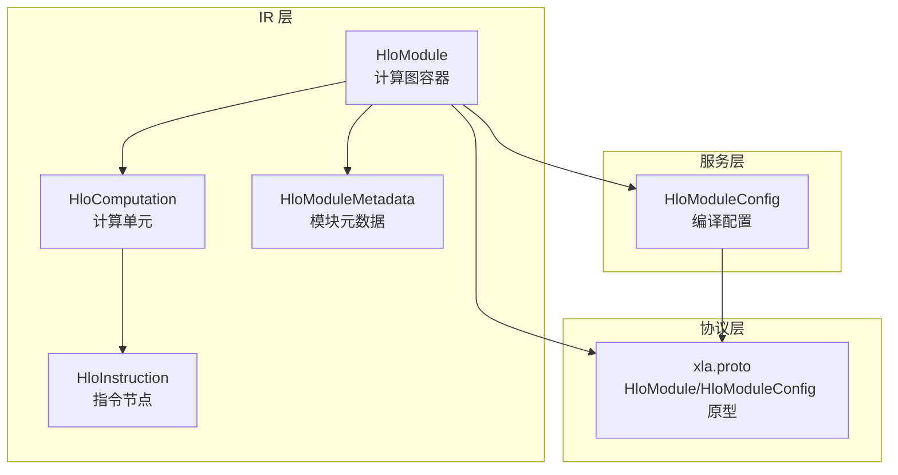
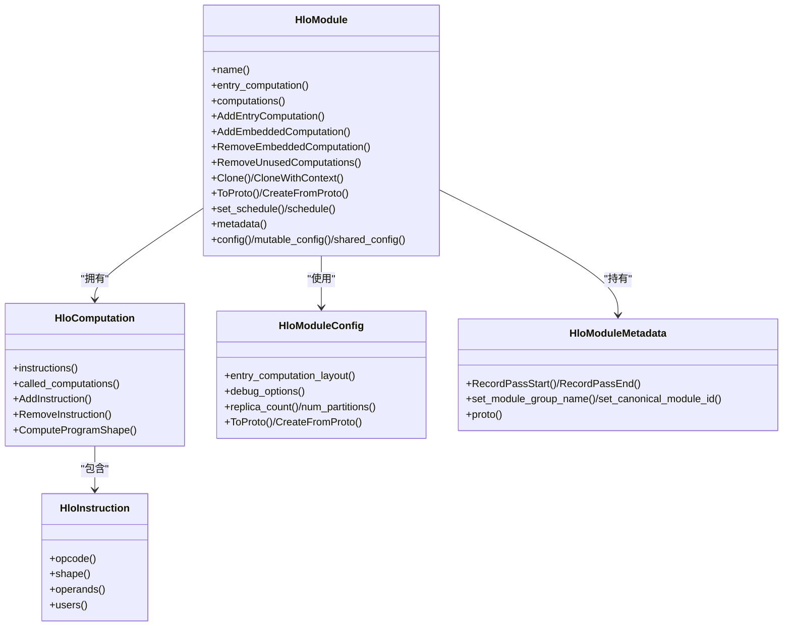
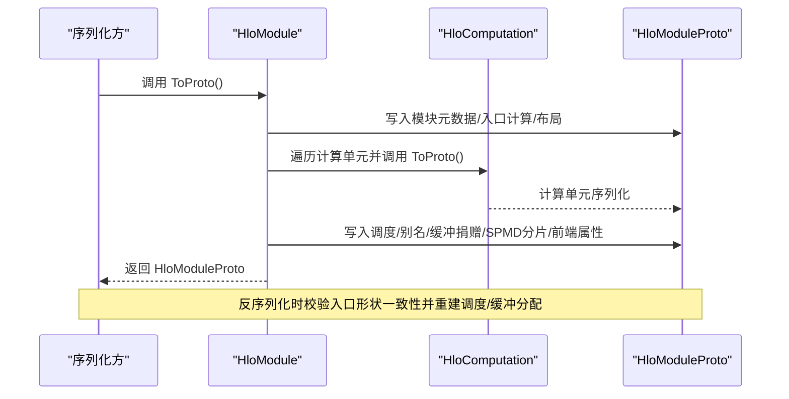
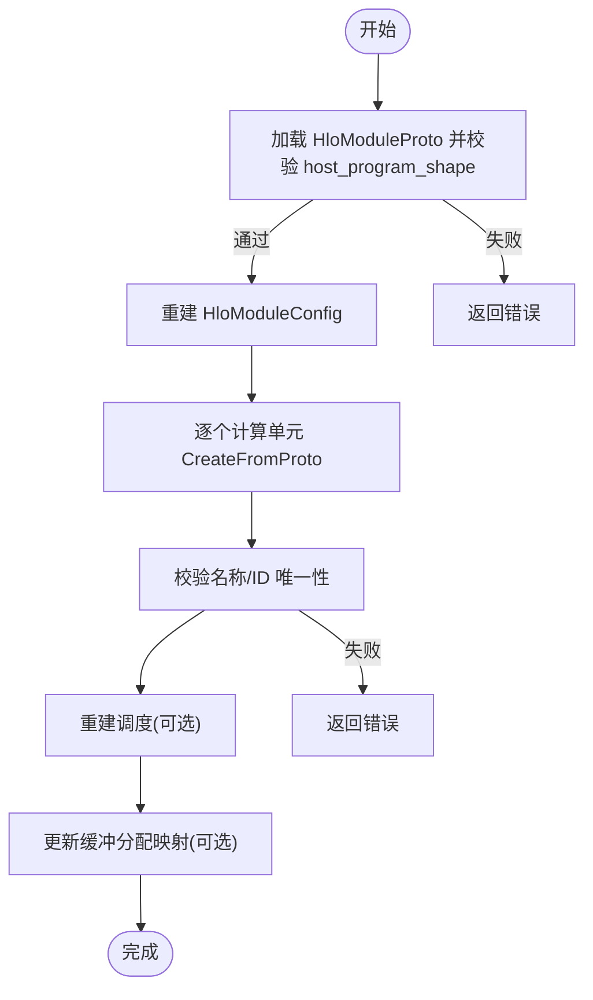
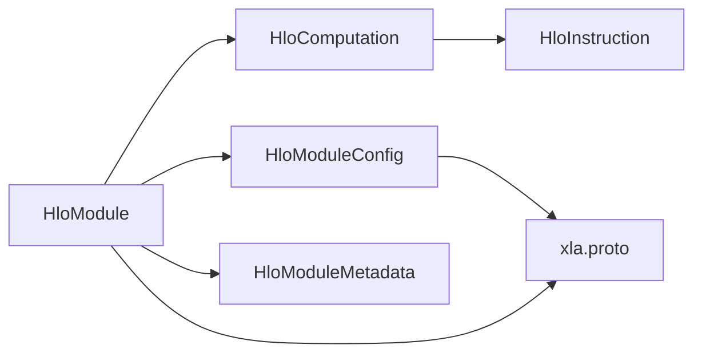

# 模块管理

<cite>
**本文引用的文件**
- [hlo_module.h](file://xla/hlo/ir/hlo_module.h)
- [hlo_module.cc](file://xla/hlo/ir/hlo_module.cc)
- [hlo_module_metadata.h](file://xla/hlo/ir/hlo_module_metadata.h)
- [hlo_module_config.h](file://xla/service/hlo_module_config.h)
- [hlo_module_config.cc](file://xla/service/hlo_module_config.cc)
- [hlo_module_test.cc](file://xla/hlo/ir/hlo_module_test.cc)
- [xla.proto](file://xla/xla.proto)
</cite>

## 目录
1. [引言](#引言)
2. [项目结构](#项目结构)
3. [核心组件](#核心组件)
4. [架构总览](#架构总览)
5. [详细组件分析](#详细组件分析)
6. [依赖分析](#依赖分析)
7. [性能考虑](#性能考虑)
8. [故障排查指南](#故障排查指南)
9. [结论](#结论)
10. [附录](#附录)

## 引言
本文件围绕 XLA 的 HLO 模块管理系统进行系统化文档化，重点阐述 HloModule 作为“程序级”计算图容器的设计理念与实现细节，覆盖以下主题：
- 多个计算图（嵌入式与入口）的组织方式与拓扑排序
- 模块级元数据与生命周期管理
- 序列化与反序列化机制（Protobuf 映射、版本兼容）
- 验证流程（形状一致性、指令合法性、依赖关系）
- 动态增删改查操作（添加/移除计算图、删除无用指令）
- 调试信息收集与性能统计能力

## 项目结构
与 HLO 模块管理直接相关的核心文件如下：
- HloModule 定义与实现：xla/hlo/ir/hlo_module.{h,cc}
- 模块元数据：xla/hlo/ir/hlo_module_metadata.h
- 模块配置（编译期参数集合）：xla/service/hlo_module_config.{h,cc}
- 协议定义（包含 HloModule/HloModuleConfig 的 Protobuf 映射）：xla/xla.proto
- 测试与使用示例：xla/hlo/ir/hlo_module_test.cc

图表来源
- [hlo_module.h](file://xla/hlo/ir/hlo_module.h#L94-L106)
- [hlo_module.cc](file://xla/hlo/ir/hlo_module.cc#L86-L105)
- [hlo_module_metadata.h](file://xla/hlo/ir/hlo_module_metadata.h#L96-L136)
- [hlo_module_config.h](file://xla/service/hlo_module_config.h#L57-L98)
- [xla.proto](file://xla/xla.proto#L16-L24)

章节来源
- [hlo_module.h](file://xla/hlo/ir/hlo_module.h#L94-L106)
- [hlo_module.cc](file://xla/hlo/ir/hlo_module.cc#L86-L105)
- [hlo_module_metadata.h](file://xla/hlo/ir/hlo_module_metadata.h#L96-L136)
- [hlo_module_config.h](file://xla/service/hlo_module_config.h#L57-L98)
- [xla.proto](file://xla/xla.proto#L16-L24)

## 核心组件
- HloModule：顶层容器，持有入口计算与若干嵌入式计算；维护拓扑序、名称唯一性、指令计数、缓存等；支持序列化/反序列化、克隆、清理、调度设置等。
- HloComputation：计算单元，包含指令列表、调用关系、布局等；可作为入口或嵌入式计算。
- HloInstruction：指令节点，携带操作码、形状、操作数、元数据等。
- HloModuleConfig：模块级配置，描述输入输出布局、并行度、优化策略、设备类型、调试选项等，并可序列化为 Protobuf。
- HloModuleMetadata：模块元数据，用于记录 Pass 生命周期、分组信息、指标与自定义字段。

章节来源
- [hlo_module.h](file://xla/hlo/ir/hlo_module.h#L94-L106)
- [hlo_module.cc](file://xla/hlo/ir/hlo_module.cc#L140-L198)
- [hlo_module_metadata.h](file://xla/hlo/ir/hlo_module_metadata.h#L96-L136)
- [hlo_module_config.h](file://xla/service/hlo_module_config.h#L57-L98)

## 架构总览
HloModule 以“程序”为单位承载一组计算图（入口 + 嵌入式），通过拓扑排序保证依赖顺序；模块配置与元数据贯穿编译期与运行期，Protobuf 提供稳定的序列化接口。

图表来源
- [hlo_module.h](file://xla/hlo/ir/hlo_module.h#L94-L106)
- [hlo_module.cc](file://xla/hlo/ir/hlo_module.cc#L140-L198)
- [hlo_module_config.h](file://xla/service/hlo_module_config.h#L57-L98)
- [hlo_module_metadata.h](file://xla/hlo/ir/hlo_module_metadata.h#L96-L136)

## 详细组件分析

### HloModule：计算图容器与生命周期
- 组织方式
  - 入口计算（entry computation）唯一且作为程序主入口；嵌入式计算通过指令调用形成子图。
  - 通过拓扑排序维护计算单元之间的依赖顺序，支持 DFS 后序与内容感知排序。
- 生命周期控制
  - 构造时初始化名称唯一器、元数据、唯一模块 ID；析构前清理跨计算引用，避免悬挂指针。
  - 支持 Cleanup/CleanupComputations 清理已标记删除的计算与指令，更新调度中指令 ID。
- 动态增删改查
  - 添加/替换入口计算、添加嵌入式计算、移除嵌入式计算、批量移动计算、替换计算图、删除未使用计算。
  - 支持大纲化（OutlineExpressionFromComputation）将表达式抽取为独立嵌入式计算。
- 名称与 ID 唯一性
  - 提供 CheckUniqueNamesAndIdsForComputationsAndInstructions 进行全局唯一性校验。
- 调度与打印
  - set_schedule/has_schedule/schedule 管理执行序列；支持打印与指纹生成，便于调试与缓存键生成。

章节来源
- [hlo_module.h](file://xla/hlo/ir/hlo_module.h#L108-L131)
- [hlo_module.h](file://xla/hlo/ir/hlo_module.h#L158-L167)
- [hlo_module.h](file://xla/hlo/ir/hlo_module.h#L334-L353)
- [hlo_module.h](file://xla/hlo/ir/hlo_module.h#L355-L379)
- [hlo_module.h](file://xla/hlo/ir/hlo_module.h#L381-L391)
- [hlo_module.h](file://xla/hlo/ir/hlo_module.h#L421-L428)
- [hlo_module.h](file://xla/hlo/ir/hlo_module.h#L615-L635)
- [hlo_module.h](file://xla/hlo/ir/hlo_module.h#L641-L652)
- [hlo_module.h](file://xla/hlo/ir/hlo_module.h#L654-L677)
- [hlo_module.h](file://xla/hlo/ir/hlo_module.h#L792-L799)
- [hlo_module.cc](file://xla/hlo/ir/hlo_module.cc#L107-L113)
- [hlo_module.cc](file://xla/hlo/ir/hlo_module.cc#L140-L198)
- [hlo_module.cc](file://xla/hlo/ir/hlo_module.cc#L214-L237)
- [hlo_module.cc](file://xla/hlo/ir/hlo_module.cc#L276-L304)
- [hlo_module.cc](file://xla/hlo/ir/hlo_module.cc#L306-L338)
- [hlo_module.cc](file://xla/hlo/ir/hlo_module.cc#L1173-L1184)
- [hlo_module.cc](file://xla/hlo/ir/hlo_module.cc#L1186-L1270)
- [hlo_module.cc](file://xla/hlo/ir/hlo_module.cc#L1579-L1599)

### HloModuleConfig：模块级元数据与编译配置
- 作用域
  - 描述输入输出布局、副本/分片数量、优化策略、设备类型、调试开关、FDO 配置、并行度等。
- 序列化/反序列化
  - ToProto/CreateFromProto 将配置稳定地写入/读出 Protobuf，确保跨进程/跨版本兼容。
- 共享与拷贝
  - shared_config 降低内存占用；修改 mutable_config 会复制共享对象，避免竞态。

章节来源
- [hlo_module_config.h](file://xla/service/hlo_module_config.h#L57-L98)
- [hlo_module_config.h](file://xla/service/hlo_module_config.h#L115-L146)
- [hlo_module_config.h](file://xla/service/hlo_module_config.h#L254-L257)
- [hlo_module_config.h](file://xla/service/hlo_module_config.h#L335-L341)
- [hlo_module_config.cc](file://xla/service/hlo_module_config.cc#L277-L349)
- [hlo_module_config.cc](file://xla/service/hlo_module_config.cc#L351-L429)

### HloModuleMetadata：调试与性能统计
- 记录当前运行的 Pass（开始/结束）、模块组名、规范模块 ID、分组内模块 ID 列表、自定义指标等。
- 提供对当前 Pass 的名称、流水线名、转储文件名、是否变更等字段的安全写入接口。
- 支持预分区前的元数据保留，便于对比与追踪。

章节来源
- [hlo_module_metadata.h](file://xla/hlo/ir/hlo_module_metadata.h#L96-L136)
- [hlo_module_metadata.h](file://xla/hlo/ir/hlo_module_metadata.h#L111-L117)
- [hlo_module_metadata.h](file://xla/hlo/ir/hlo_module_metadata.h#L141-L185)

### 序列化与反序列化机制（Protobuf 映射与版本兼容）
- HloModuleProto/HloModuleProtoWithConfig
  - HloModule::ToProto 将模块、入口计算、计算单元、调度、别名配置、跨程序预取、SPMD 分片、前端属性、设备分配、堆栈帧索引、原始值恢复表、设备类型等写入 Protobuf。
  - HloModule::CreateFromProto/WithConfig 从 Protobuf 重建模块，校验入口参数/结果形状一致性，必要时重映射指令 ID 与调度/缓冲分配，保持与 BufferAssignment 一致。
- 版本兼容
  - 提供 RemapInstructionIds/UpdateIdsInSchedule/UpdateBufferAssignmentProto 辅助修复旧版或手动构造的 Protobuf 中的 ID 不连续问题。
  - 支持 preserve_instruction_ids 控制是否保留原 ID，避免内存峰值。
- 协议定义
  - xla.proto 中包含 HloModule/HloModuleConfig 的 Protobuf 映射与 DebugOptions 等扩展字段。

图表来源
- [hlo_module.cc](file://xla/hlo/ir/hlo_module.cc#L534-L611)
- [hlo_module.cc](file://xla/hlo/ir/hlo_module.cc#L808-L990)
- [hlo_module.cc](file://xla/hlo/ir/hlo_module.cc#L668-L710)
- [hlo_module.cc](file://xla/hlo/ir/hlo_module.cc#L993-L1026)
- [xla.proto](file://xla/xla.proto#L16-L24)

章节来源
- [hlo_module.cc](file://xla/hlo/ir/hlo_module.cc#L534-L611)
- [hlo_module.cc](file://xla/hlo/ir/hlo_module.cc#L798-L990)
- [hlo_module.cc](file://xla/hlo/ir/hlo_module.cc#L668-L710)
- [hlo_module.cc](file://xla/hlo/ir/hlo_module.cc#L993-L1026)
- [xla.proto](file://xla/xla.proto#L16-L24)

### 验证流程：形状一致性、指令合法性与依赖关系
- 形状一致性
  - CreateFromProto 对比模块配置与 Protobuf 中 host_program_shape 的参数/结果形状，不一致则报错。
- 指令合法性
  - 通过 CheckUniqueNamesAndIdsForComputationsAndInstructions 校验计算与指令的名称与 ID 唯一性。
- 依赖关系
  - MakeComputationPostOrder/MakeComputationSorted 基于拓扑排序与调用关系构建有序列表；RemoveUnusedComputations 使用可达性算法移除不可达计算。

图表来源
- [hlo_module.cc](file://xla/hlo/ir/hlo_module.cc#L808-L990)
- [hlo_module.cc](file://xla/hlo/ir/hlo_module.cc#L618-L648)
- [hlo_module.cc](file://xla/hlo/ir/hlo_module.cc#L1579-L1599)

章节来源
- [hlo_module.cc](file://xla/hlo/ir/hlo_module.cc#L808-L990)
- [hlo_module.cc](file://xla/hlo/ir/hlo_module.cc#L618-L648)
- [hlo_module.cc](file://xla/hlo/ir/hlo_module.cc#L1579-L1599)

### 动态操作：创建、修改与查询
- 创建与修改
  - AddEntryComputation/AddEntryComputationWithLayouts/AddEmbeddedComputation
  - ReplaceEntryComputation/ReplaceComputations/MoveComputationsFrom
  - RemoveEmbeddedComputation/RemoveUnusedComputations/Cleanup/CleanupComputations
  - Clone/CloneWithContext
- 查询
  - computations()/computation_count()/instruction_count()
  - MakeComputationPostOrder/MakeComputationSorted/MakeNonfusionComputations
  - GetComputationWithName/entry_computation()/result_shape()

章节来源
- [hlo_module.h](file://xla/hlo/ir/hlo_module.h#L108-L131)
- [hlo_module.h](file://xla/hlo/ir/hlo_module.h#L158-L167)
- [hlo_module.h](file://xla/hlo/ir/hlo_module.h#L267-L295)
- [hlo_module.h](file://xla/hlo/ir/hlo_module.h#L326-L332)
- [hlo_module.h](file://xla/hlo/ir/hlo_module.h#L355-L391)
- [hlo_module.h](file://xla/hlo/ir/hlo_module.h#L421-L428)
- [hlo_module.cc](file://xla/hlo/ir/hlo_module.cc#L214-L237)
- [hlo_module.cc](file://xla/hlo/ir/hlo_module.cc#L1579-L1599)
- [hlo_module.cc](file://xla/hlo/ir/hlo_module.cc#L1499-L1559)

### 调试信息与性能统计
- 调试信息
  - ToString/ToCord/ToFingerprint 输出模块文本/流/指纹；支持语法糖、元数据打印、异步指令展开等。
  - CanonicalizeStackFrameIds 将外部堆栈帧索引规范化到内部表示。
- 性能统计
  - HloModuleMetadata 提供 Pass 生命周期记录、模块组信息、自定义指标设置；HloModuleConfig 提供调试开关与优化级别等影响性能的配置项。

章节来源
- [hlo_module.h](file://xla/hlo/ir/hlo_module.h#L457-L494)
- [hlo_module.cc](file://xla/hlo/ir/hlo_module.cc#L340-L497)
- [hlo_module.cc](file://xla/hlo/ir/hlo_module.cc#L712-L795)
- [hlo_module_metadata.h](file://xla/hlo/ir/hlo_module_metadata.h#L111-L185)
- [hlo_module_config.h](file://xla/service/hlo_module_config.h#L148-L151)

## 依赖分析
- 组件耦合
  - HloModule 依赖 HloComputation/HloInstruction/HloModuleConfig/HloModuleMetadata；HloComputation 依赖 HloInstruction 与其调用关系；HloModuleConfig 与 Protobuf 映射强耦合。
- 外部依赖
  - Protobuf（xla.proto）提供稳定序列化契约；DebugOptions/ExecutionOptions 通过 HloModuleConfig 传递至运行期。
- 循环依赖
  - 通过指针与延迟绑定避免直接循环；HloModule 在析构时清理跨计算引用。

图表来源
- [hlo_module.h](file://xla/hlo/ir/hlo_module.h#L94-L106)
- [hlo_module_config.h](file://xla/service/hlo_module_config.h#L57-L98)
- [xla.proto](file://xla/xla.proto#L16-L24)

章节来源
- [hlo_module.h](file://xla/hlo/ir/hlo_module.h#L94-L106)
- [hlo_module_config.h](file://xla/service/hlo_module_config.h#L57-L98)
- [xla.proto](file://xla/xla.proto#L16-L24)

## 性能考虑
- 排序与哈希
  - content_aware_computation_sorting 会基于内容指纹排序，代价较高，仅在需要稳定顺序时启用。
- 缓存与指纹
  - AbslHashValue/ToFingerprint 仅考虑关键字段，避免重复计算；HloModule::CacheEntry 支持后端特定缓存条目。
- 内存与 ID 重映射
  - preserve_instruction_ids=false 时可显著降低内存峰值；UpdateBufferAssignmentProto 与 UpdateIdsInSchedule 保障一致性。

章节来源
- [hlo_module.h](file://xla/hlo/ir/hlo_module.h#L248-L265)
- [hlo_module.cc](file://xla/hlo/ir/hlo_module.cc#L1396-L1468)
- [hlo_module.cc](file://xla/hlo/ir/hlo_module.cc#L668-L710)
- [hlo_module.cc](file://xla/hlo/ir/hlo_module.cc#L993-L1026)

## 故障排查指南
- 反序列化失败
  - 检查 host_program_shape 与模块配置参数/结果形状是否一致；确认入口计算 ID 与名称映射正确。
- 调度/缓冲分配不一致
  - 使用 preserve_instruction_ids=false 触发重映射；调用 UpdateBufferAssignmentProto 更新缓冲分配。
- 名称/ID 冲突
  - 执行 CheckUniqueNamesAndIdsForComputationsAndInstructions；必要时使用 Finalize/UniquifyName。
- 调试定位
  - 使用 ToString/ToCord/ToFingerprint 输出模块快照；结合 HloModuleMetadata 记录的 Pass 信息定位问题阶段。

章节来源
- [hlo_module.cc](file://xla/hlo/ir/hlo_module.cc#L808-L990)
- [hlo_module.cc](file://xla/hlo/ir/hlo_module.cc#L618-L648)
- [hlo_module.cc](file://xla/hlo/ir/hlo_module.cc#L993-L1026)
- [hlo_module.h](file://xla/hlo/ir/hlo_module.h#L135-L138)

## 结论
HloModule 以清晰的容器模型统一管理入口与嵌入式计算图，配合 HloModuleConfig 与 HloModuleMetadata 实现模块级配置与调试统计；通过 Protobuf 提供稳定的序列化契约与版本兼容能力。其拓扑排序、唯一性校验与动态增删改查接口，使得模块在编译期与运行期均具备良好的可控性与可观测性。

## 附录
- 示例路径参考（不展示具体代码内容）
  - 创建模块与添加入口计算：[hlo_module.h](file://xla/hlo/ir/hlo_module.h#L108-L122)
  - 添加嵌入式计算与删除无用计算：[hlo_module.h](file://xla/hlo/ir/hlo_module.h#L124-L131), [hlo_module.cc](file://xla/hlo/ir/hlo_module.cc#L1579-L1599)
  - 序列化/反序列化（含 ID 重映射）：[hlo_module.cc](file://xla/hlo/ir/hlo_module.cc#L534-L611), [hlo_module.cc](file://xla/hlo/ir/hlo_module.cc#L798-L990), [hlo_module.cc](file://xla/hlo/ir/hlo_module.cc#L668-L710)
  - 配置序列化/反序列化：[hlo_module_config.cc](file://xla/service/hlo_module_config.cc#L277-L349), [hlo_module_config.cc](file://xla/service/hlo_module_config.cc#L351-L429)
  - 元数据记录与查询：[hlo_module_metadata.h](file://xla/hlo/ir/hlo_module_metadata.h#L111-L185)
  - 测试用例参考：[hlo_module_test.cc](file://xla/hlo/ir/hlo_module_test.cc#L82-L145), [hlo_module_test.cc](file://xla/hlo/ir/hlo_module_test.cc#L147-L195)