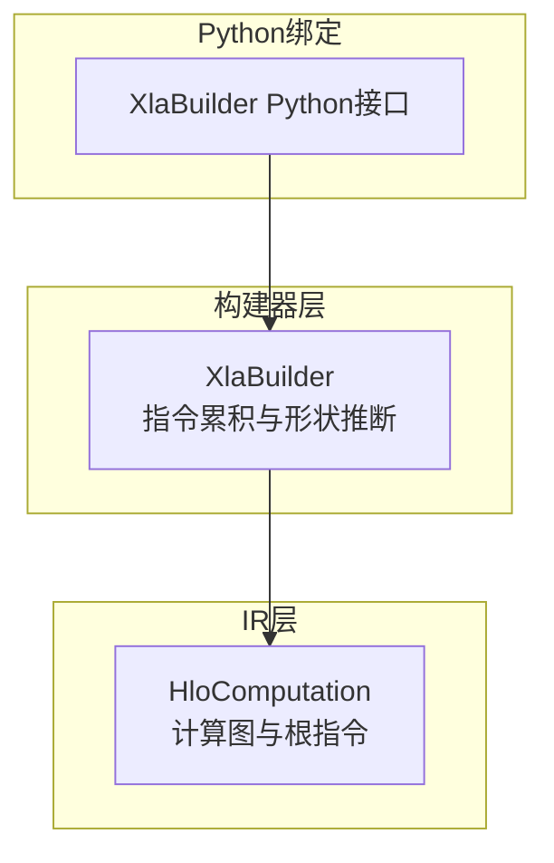
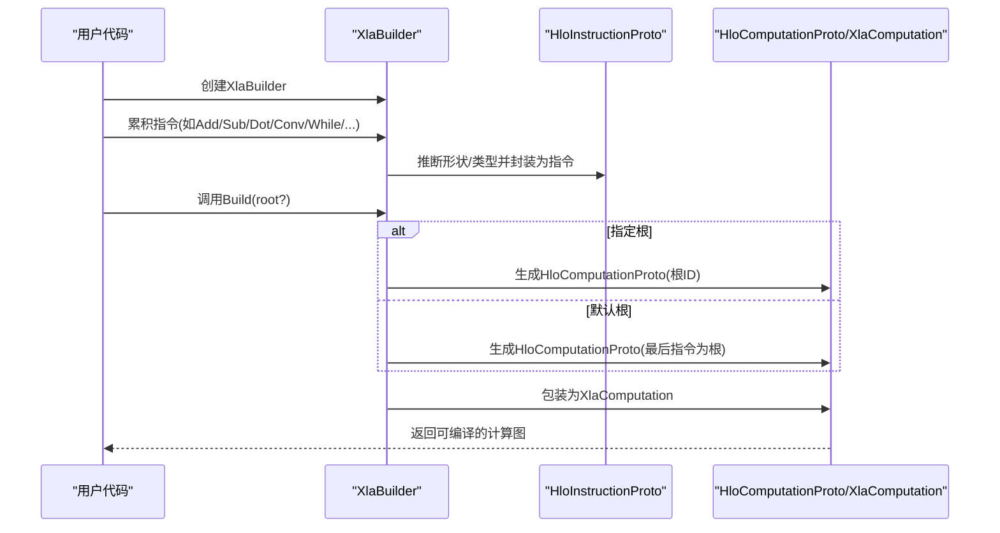
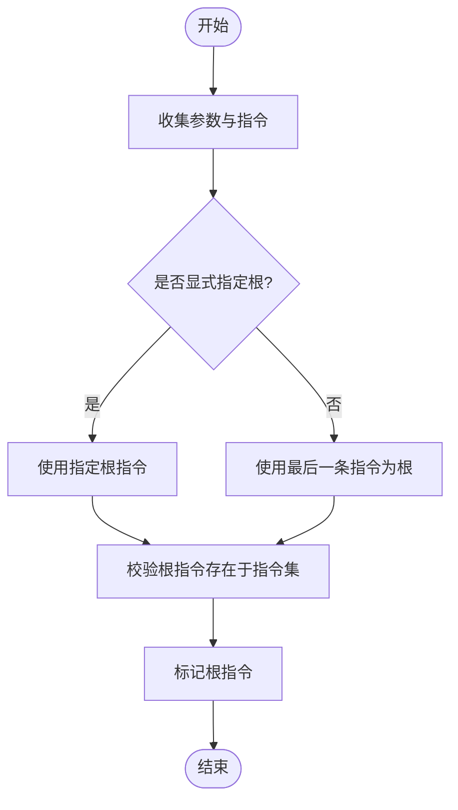
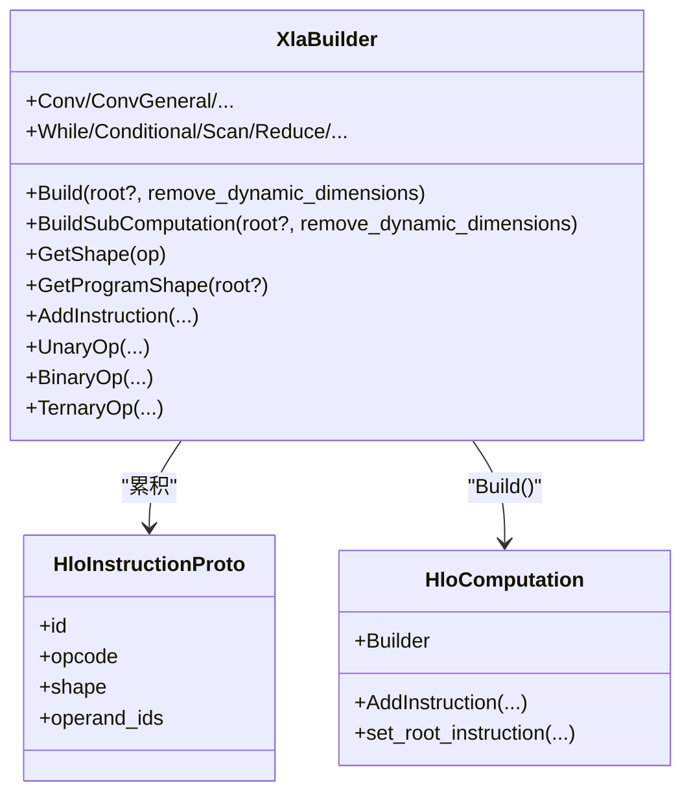
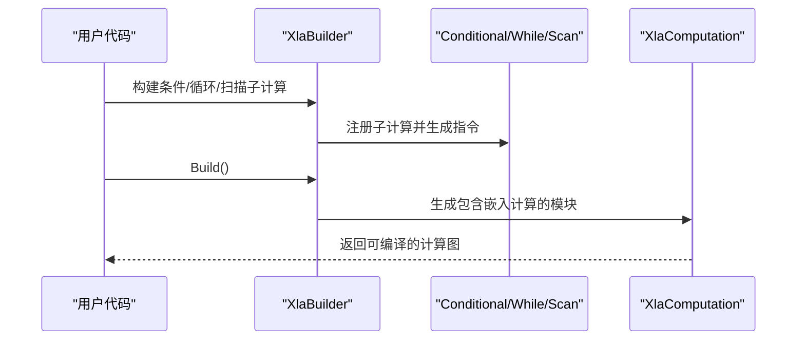
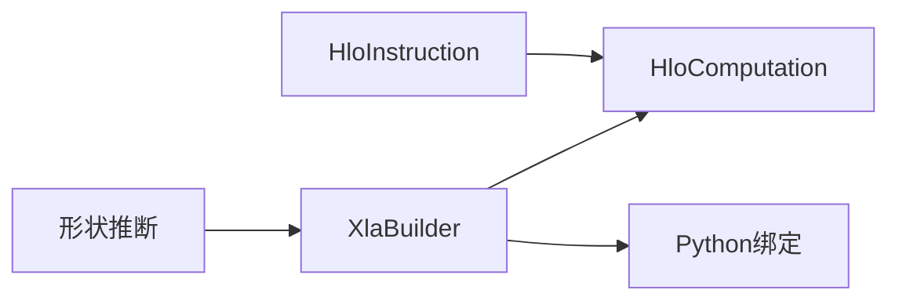

# 计算图构建

<cite>
**本文引用的文件**
- [xla_builder.h](file://xla/hlo/builder/xla_builder.h)
- [xla_builder.cc](file://xla/hlo/builder/xla_builder.cc)
- [hlo_computation.h](file://xla/hlo/ir/hlo_computation.h)
- [hlo_computation.cc](file://xla/hlo/ir/hlo_computation.cc)
- [xla_builder.cc（Python绑定）](file://xla/python/xla_builder.cc)
</cite>

## 目录
1. [引言](#引言)
2. [项目结构](#项目结构)
3. [核心组件](#核心组件)
4. [架构总览](#架构总览)
5. [详细组件分析](#详细组件分析)
6. [依赖关系分析](#依赖关系分析)
7. [性能考虑](#性能考虑)
8. [故障排查指南](#故障排查指南)
9. [结论](#结论)
10. [附录](#附录)

## 引言
本文件面向希望在XLA/HLO层构建计算图的开发者，系统阐述以下主题：
- HloComputation类的构造过程：参数指令的添加、根指令的设置、计算图完整性校验
- XlaBuilder的使用模式：指令构建器工作原理、操作符重载、类型与形状推断
- 计算图构建流程：从简单算术到复杂控制流（条件、循环、扫描等）
- 典型计算图示例：线性代数、卷积、循环结构
- 内存布局与数据依赖：形状推断、别名与缓冲区捐赠、动态维度处理

## 项目结构
围绕计算图构建的关键模块如下：
- 构建器层：XlaBuilder负责以声明式方式累积指令，最终生成HloComputation或XlaComputation
- IR层：HloComputation代表一个函数级的HLO计算，包含指令序列、参数、根指令与拓扑排序
- Python绑定：为XlaBuilder提供Python接口，便于前端语言调用

图表来源
- [xla_builder.h](file://xla/hlo/builder/xla_builder.h#L287-L470)
- [xla_builder.cc](file://xla/hlo/builder/xla_builder.cc#L809-L951)
- [hlo_computation.h](file://xla/hlo/ir/hlo_computation.h#L84-L148)
- [hlo_computation.cc](file://xla/hlo/ir/hlo_computation.cc#L136-L199)
- [xla_builder.cc（Python绑定）](file://xla/python/xla_builder.cc#L105-L160)

章节来源
- [xla_builder.h](file://xla/hlo/builder/xla_builder.h#L287-L470)
- [xla_builder.cc](file://xla/hlo/builder/xla_builder.cc#L809-L951)
- [hlo_computation.h](file://xla/hlo/ir/hlo_computation.h#L84-L148)
- [hlo_computation.cc](file://xla/hlo/ir/hlo_computation.cc#L136-L199)
- [xla_builder.cc（Python绑定）](file://xla/python/xla_builder.cc#L105-L160)

## 核心组件
- XlaBuilder
  - 负责累积指令、维护指令序列与形状映射、执行形状/类型推断、支持元数据与分片属性
  - 提供构建入口Build(...)与子计算构建BuildSubComputation(...)
- HloComputation
  - 表达一个函数级计算，包含参数指令、指令列表、根指令、拓扑序、克隆与替换能力
  - 提供Builder内部类用于从指令集合构建HloComputation并进行完整性校验

章节来源
- [xla_builder.h](file://xla/hlo/builder/xla_builder.h#L287-L470)
- [xla_builder.cc](file://xla/hlo/builder/xla_builder.cc#L809-L951)
- [hlo_computation.h](file://xla/hlo/ir/hlo_computation.h#L84-L148)
- [hlo_computation.cc](file://xla/hlo/ir/hlo_computation.cc#L136-L199)

## 架构总览
XlaBuilder通过AddInstruction/AddInstructionWithShape等方法将操作封装为HloInstructionProto，并在Build阶段汇总为HloComputationProto，再包装为XlaComputation。HloComputation在内部完成参数指令收集、根指令设置与完整性检查。

图表来源
- [xla_builder.cc](file://xla/hlo/builder/xla_builder.cc#L809-L951)
- [hlo_computation.cc](file://xla/hlo/ir/hlo_computation.cc#L136-L199)

章节来源
- [xla_builder.cc](file://xla/hlo/builder/xla_builder.cc#L809-L951)
- [hlo_computation.cc](file://xla/hlo/ir/hlo_computation.cc#L136-L199)

## 详细组件分析

### HloComputation构造与完整性校验
- 参数指令添加
  - 通过Builder::AddParameter或HloComputation::AddParameter添加参数指令；参数编号连续且唯一
- 根指令设置
  - 可显式指定根指令，否则默认取最后添加的指令作为根
  - 构造时会校验根指令存在于指令集中
- 完整性验证
  - 校验参数编号范围与唯一性
  - 校验根指令存在
  - 标记根指令为“根”
- 其他能力
  - 支持参数替换、移除、重排
  - 支持删除无用参数（融合/入口计算）

图表来源
- [hlo_computation.cc](file://xla/hlo/ir/hlo_computation.cc#L136-L199)

章节来源
- [hlo_computation.h](file://xla/hlo/ir/hlo_computation.h#L84-L148)
- [hlo_computation.cc](file://xla/hlo/ir/hlo_computation.cc#L136-L199)

### XlaBuilder使用模式与指令构建器
- 指令累积
  - 通过AddInstruction/AddInstructionWithShape等方法将操作封装为HloInstructionProto
  - 维护指令序列、形状映射、句柄到索引映射
- 形状/类型推断
  - 大多数操作通过ShapeInference::Infer...Shape进行静态推断
  - 对广播、比较、动态形状提供专门处理路径
- 操作符重载
  - 重载了算术与位运算，便于以自然语法构建表达式
- 子计算与嵌入
  - 支持子构建器BuildSubComputation，将嵌入计算注册到父构建器
- 构建输出
  - Build(BuildComputationProto)生成HloComputationProto并包装为XlaComputation

图表来源
- [xla_builder.h](file://xla/hlo/builder/xla_builder.h#L287-L470)
- [xla_builder.cc](file://xla/hlo/builder/xla_builder.cc#L1151-L1157)
- [hlo_computation.h](file://xla/hlo/ir/hlo_computation.h#L84-L148)

章节来源
- [xla_builder.h](file://xla/hlo/builder/xla_builder.h#L287-L470)
- [xla_builder.cc](file://xla/hlo/builder/xla_builder.cc#L1151-L1157)

### 控制流结构：条件、循环、扫描
- 条件分支
  - Conditional(predicate, true_operand, true_comp, false_operand, false_comp)
  - 支持多路分支Conditional(branch_index, branch_computations, branch_operands)
- 循环
  - While(condition_comp, body_comp, init)
  - WhileInternal提供底层实现
- 扫描
  - Scan(inputs, inits, computation, scan_dimension, ...)
  - ReduceWindow/ReduceAll/Reduce等提供窗口化规约

图表来源
- [xla_builder.h](file://xla/hlo/builder/xla_builder.h#L1066-L1078)
- [xla_builder.cc](file://xla/hlo/builder/xla_builder.cc#L1581-L1599)

章节来源
- [xla_builder.h](file://xla/hlo/builder/xla_builder.h#L1066-L1078)
- [xla_builder.cc](file://xla/hlo/builder/xla_builder.cc#L1581-L1599)

### 线性代数与卷积操作
- 点积与通用点积
  - Dot(lhs, rhs, precision, preferred_element_type)
  - DotGeneral(lhs, rhs, dimension_numbers, ...)
- 卷积
  - Conv/ConvGeneral/ConvGeneralDilated等覆盖常见卷积变体
  - 支持步幅、填充、扩张、分组等参数
- 动态卷积
  - DynamicConvForward/InputGrad/KernelGrad等支持动态输入/梯度场景

章节来源
- [xla_builder.h](file://xla/hlo/builder/xla_builder.h#L690-L756)
- [xla_builder.cc](file://xla/hlo/builder/xla_builder.cc#L799-L800)

### 内存布局与数据依赖
- 形状推断
  - 大多数操作通过ShapeInference进行静态推断
  - 广播、比较、动态形状有专门处理
- 别名与缓冲区捐赠
  - SetUpAlias与AddBufferDonor在Build阶段写入模块元数据
  - 输入输出别名配置与缓冲区捐赠配置在模块中体现
- 动态维度
  - BuildComputationProto可选择移除动态维度
  - 动态形状在某些API中受限制（例如Iota要求静态）

章节来源
- [xla_builder.cc](file://xla/hlo/builder/xla_builder.cc#L905-L951)
- [xla_builder.cc](file://xla/hlo/builder/xla_builder.cc#L953-L1009)

## 依赖关系分析
- XlaBuilder依赖ShapeInference进行形状推断
- HloComputation依赖HloInstruction及其指令列表、拓扑排序
- Python绑定通过nanobind桥接XlaBuilder接口

图表来源
- [xla_builder.cc](file://xla/hlo/builder/xla_builder.cc#L1166-L1196)
- [hlo_computation.h](file://xla/hlo/ir/hlo_computation.h#L451-L491)
- [xla_builder.cc（Python绑定）](file://xla/python/xla_builder.cc#L105-L160)

章节来源
- [xla_builder.cc](file://xla/hlo/builder/xla_builder.cc#L1166-L1196)
- [hlo_computation.h](file://xla/hlo/ir/hlo_computation.h#L451-L491)
- [xla_builder.cc（Python绑定）](file://xla/python/xla_builder.cc#L105-L160)

## 性能考虑
- 指令顺序与拓扑
  - 通过后序遍历保证定义先于使用，避免不必要的同步
- 广播与形状一致性
  - 显式广播序列与目标秩广播可减少隐式广播带来的额外开销
- 动态维度
  - 在后端不支持前，可在构建阶段移除动态维度以提升编译效率
- 别名与缓冲区捐赠
  - 合理设置别名与捐赠可降低内存占用与拷贝成本

## 故障排查指南
- 常见错误来源
  - 根指令不存在：构建时会校验根指令必须在指令集中
  - 参数编号越界或重复：参数编号需连续且唯一
  - 形状不匹配：二元/三元操作在广播与比较方向上需要满足约束
  - 动态维度限制：部分API要求静态形状
- 错误报告
  - XlaBuilder在die_immediately_on_error_开启时立即失败，否则延迟到Build阶段统一返回
  - ReportError/ReportErrorOrReturn用于捕获并传播错误

章节来源
- [hlo_computation.cc](file://xla/hlo/ir/hlo_computation.cc#L196-L198)
- [xla_builder.cc](file://xla/hlo/builder/xla_builder.cc#L614-L640)

## 结论
XLA/HLO计算图构建通过XlaBuilder与HloComputation协同工作：前者以声明式方式累积指令并进行形状/类型推断，后者承载函数级计算并确保根指令与参数的完整性。结合控制流、线性代数与卷积等操作，以及对别名、动态维度与布局的精细控制，可以高效构建从简单到复杂的计算图。

## 附录
- Python绑定
  - 提供XlaBuilder的Python接口，支持Build、GetShape、SetOpMetadata等常用功能
  - 通过nanobind将C++对象暴露给Python，便于前端框架集成

章节来源
- [xla_builder.cc（Python绑定）](file://xla/python/xla_builder.cc#L105-L160)