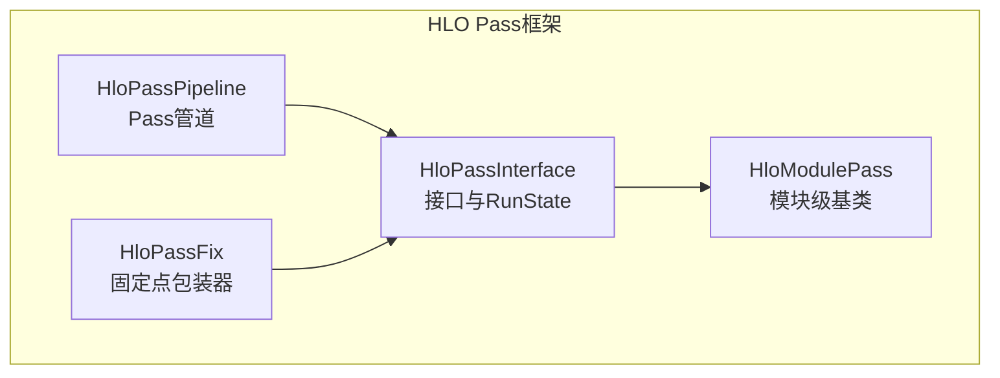
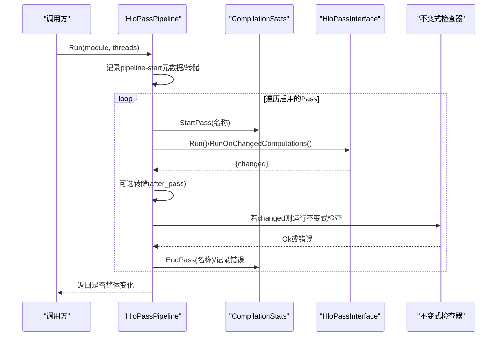
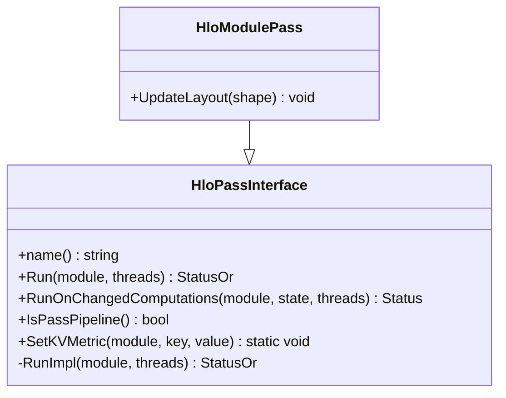
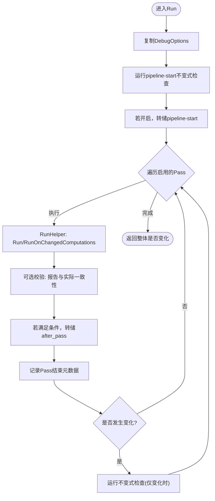
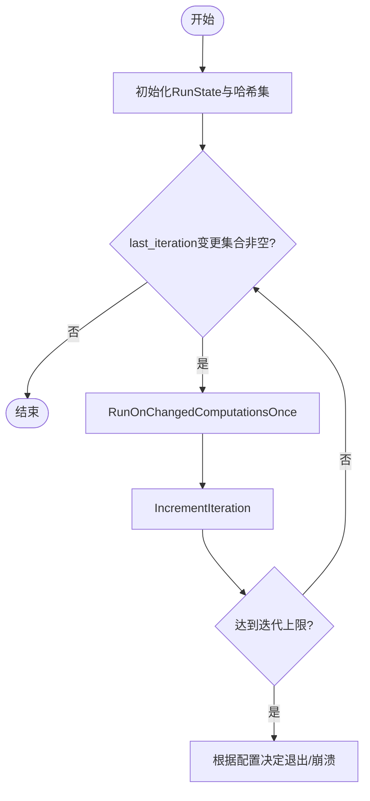
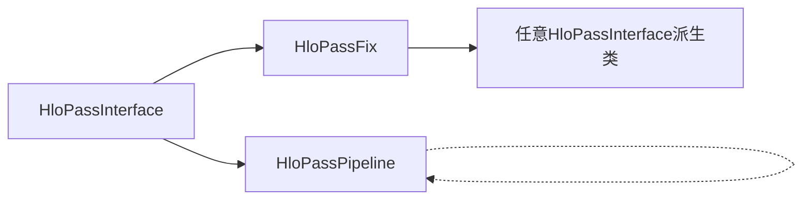

# HLO Pass管道

<cite>
**本文引用的文件**
- [hlo_pass_interface.h](file://xla/hlo/pass/hlo_pass_interface.h)
- [hlo_pass_interface.cc](file://xla/hlo/pass/hlo_pass_interface.cc)
- [hlo_pass_pipeline.h](file://xla/hlo/pass/hlo_pass_pipeline.h)
- [hlo_pass_pipeline.cc](file://xla/hlo/pass/hlo_pass_pipeline.cc)
- [hlo_pass_fix.h](file://xla/hlo/pass/hlo_pass_fix.h)
- [README.md](file://xla/hlo/pass/README.md)
- [hlo_pass_pipeline_test.cc](file://xla/hlo/pass/hlo_pass_pipeline_test.cc)
</cite>

## 目录
1. [简介](#简介)
2. [项目结构](#项目结构)
3. [核心组件](#核心组件)
4. [架构总览](#架构总览)
5. [组件详解](#组件详解)
6. [依赖关系分析](#依赖关系分析)
7. [性能考量](#性能考量)
8. [故障排查指南](#故障排查指南)
9. [结论](#结论)
10. [附录：实现自定义Pass与交互模式](#附录实现自定义pass与交互模式)

## 简介
本文件系统性阐述XLA的HLO Pass管道的设计与执行机制，覆盖以下主题：
- Pass注册、调度与执行流程
- 管道配置选项、执行顺序控制与依赖关系管理
- 生命周期管理、状态传递与错误处理
- 性能优化策略与调试技术
- 自定义Pass的实现方法及与其他Pass的交互模式

## 项目结构
围绕HLO Pass框架的关键文件位于xla/hlo/pass目录，核心由三部分组成：
- 接口层：定义Pass抽象接口与模块级Pass基类
- 管道层：组织Pass序列、执行、检查与统计
- 固定点包装器：对单次Pass进行迭代直到不变点

图表来源
- [hlo_pass_interface.h](file://xla/hlo/pass/hlo_pass_interface.h#L43-L156)
- [hlo_pass_pipeline.h](file://xla/hlo/pass/hlo_pass_pipeline.h#L39-L161)
- [hlo_pass_fix.h](file://xla/hlo/pass/hlo_pass_fix.h#L39-L149)

章节来源
- [README.md](file://xla/hlo/pass/README.md#L1-L55)

## 核心组件
- HloPassInterface：所有HLO Pass的抽象基类，定义统一的Run/RunOnChangedComputations接口、RunState状态机、元数据度量工具等。
- HloModulePass：模块级Pass基类，提供布局更新等通用能力。
- HloPassPipeline：Pass管道，负责按序执行Pass、运行不变式检查器、统计与转储、线程过滤、启用/禁用控制等。
- HloPassFix：模板包装器，将任意HLO Pass包装为“重复执行直至不变点”的Pass。

章节来源
- [hlo_pass_interface.h](file://xla/hlo/pass/hlo_pass_interface.h#L43-L156)
- [hlo_pass_pipeline.h](file://xla/hlo/pass/hlo_pass_pipeline.h#L39-L161)
- [hlo_pass_fix.h](file://xla/hlo/pass/hlo_pass_fix.h#L39-L149)

## 架构总览
HloPassPipeline以“管道”形式编排多个HloPassInterface派生Pass，支持：
- 按添加顺序执行（可被调试选项筛选）
- 在每次Pass前后运行不变式检查器（仅在变更发生时）
- 统计每个Pass耗时与错误
- 条件转储中间HLO模块
- 支持多执行线程选择性应用Pass
- 将单个Pass包装为固定点循环

图表来源
- [hlo_pass_pipeline.cc](file://xla/hlo/pass/hlo_pass_pipeline.cc#L135-L220)
- [hlo_pass_pipeline.cc](file://xla/hlo/pass/hlo_pass_pipeline.cc#L291-L318)

## 组件详解

### HloPassInterface与HloModulePass
- Run/RunOnChangedComputations：统一入口；后者允许基于“上一迭代变更集合”进行增量处理，避免全量扫描。
- RunState：跨多次迭代的状态容器，包含当前/上次迭代的变更集合、累计变更集合与迭代计数，并提供IncrementIteration推进状态。
- 元数据与指标：通过静态工具向模块元数据写入键值度量，便于追踪Pass行为。
- 布局更新：模块级Pass可在修改形状后更新布局，确保后端兼容。

图表来源
- [hlo_pass_interface.h](file://xla/hlo/pass/hlo_pass_interface.h#L43-L156)

章节来源
- [hlo_pass_interface.h](file://xla/hlo/pass/hlo_pass_interface.h#L43-L156)
- [hlo_pass_interface.cc](file://xla/hlo/pass/hlo_pass_interface.cc#L26-L36)

### HloPassPipeline
- 注册与执行
  - AddPass/AddPass(构造参数)：以模板方式添加Pass实例或直接构造并添加。
  - AddInvariantChecker/AddInvariantCheckerDebug：在管道前后插入不变式检查器（调试构建下可用）。
  - Run：执行管道，支持线程过滤与统计记录。
- 启用/禁用控制
  - 通过DebugOptions控制：xla_disable_all_hlo_passes、xla_disable_hlo_passes、xla_enable_hlo_passes_only。
  - 管道名也可作为禁用粒度。
- 不变式检查
  - 在每次Pass变更后运行，且要求不变式检查器不得修改图（返回false）。
  - 失败时输出当前HLO文本并附加失败位置信息。
- 转储与元数据
  - 可根据正则条件在Pass前后转储模块，并将文件名写入模块元数据。
  - 记录Pass开始/结束元数据，包括模块ID、是否变化、时间戳等。
- 统计
  - CompilationStats记录每个Pass的开始/结束与错误码，便于性能分析。

图表来源
- [hlo_pass_pipeline.cc](file://xla/hlo/pass/hlo_pass_pipeline.cc#L135-L220)
- [hlo_pass_pipeline.cc](file://xla/hlo/pass/hlo_pass_pipeline.cc#L222-L276)
- [hlo_pass_pipeline.cc](file://xla/hlo/pass/hlo_pass_pipeline.cc#L278-L289)

章节来源
- [hlo_pass_pipeline.h](file://xla/hlo/pass/hlo_pass_pipeline.h#L39-L161)
- [hlo_pass_pipeline.cc](file://xla/hlo/pass/hlo_pass_pipeline.cc#L135-L220)
- [hlo_pass_pipeline.cc](file://xla/hlo/pass/hlo_pass_pipeline.cc#L222-L276)
- [hlo_pass_pipeline.cc](file://xla/hlo/pass/hlo_pass_pipeline.cc#L278-L289)

### HloPassFix：固定点包装器
- 功能：将任意HloPass包装为“在变更发生时重复执行，直到不再产生新变更”的Pass。
- 关键点：
  - 使用RunState跟踪每轮变更集合，迭代推进。
  - 可选循环检测与最大迭代限制，支持静默/崩溃策略。
  - 当Pass覆盖RunOnChangedComputations时，优先使用增量版本以避免无限递归。

图表来源
- [hlo_pass_fix.h](file://xla/hlo/pass/hlo_pass_fix.h#L76-L124)
- [hlo_pass_fix.h](file://xla/hlo/pass/hlo_pass_fix.h#L126-L145)

章节来源
- [hlo_pass_fix.h](file://xla/hlo/pass/hlo_pass_fix.h#L39-L149)

### 示例：测试用例展示的典型用法
- 添加多个Pass并验证顺序与结果
- 在特定执行线程上运行Pass
- 插入不变式检查器并验证错误传播
- 设置模块元数据以记录Pass轨迹

章节来源
- [hlo_pass_pipeline_test.cc](file://xla/hlo/pass/hlo_pass_pipeline_test.cc#L136-L177)
- [hlo_pass_pipeline_test.cc](file://xla/hlo/pass/hlo_pass_pipeline_test.cc#L179-L247)
- [hlo_pass_pipeline_test.cc](file://xla/hlo/pass/hlo_pass_pipeline_test.cc#L249-L273)
- [hlo_pass_pipeline_test.cc](file://xla/hlo/pass/hlo_pass_pipeline_test.cc#L275-L323)
- [hlo_pass_pipeline_test.cc](file://xla/hlo/pass/hlo_pass_pipeline_test.cc#L325-L352)

## 依赖关系分析
- HloPassPipeline依赖HloPassInterface接口族，既可执行具体Pass，也可嵌套其他HloPassPipeline（IsPassPipeline判断）。
- HloPassFix继承自任意Pass类型，复用其Run/RunOnChangedComputations逻辑。
- 不变式检查器作为Pass插入，但必须保证不修改图（返回false），否则触发断言。

图表来源
- [hlo_pass_pipeline.h](file://xla/hlo/pass/hlo_pass_pipeline.h#L39-L161)
- [hlo_pass_fix.h](file://xla/hlo/pass/hlo_pass_fix.h#L39-L149)

章节来源
- [hlo_pass_pipeline.h](file://xla/hlo/pass/hlo_pass_pipeline.h#L39-L161)
- [hlo_pass_fix.h](file://xla/hlo/pass/hlo_pass_fix.h#L39-L149)

## 性能考量
- 增量执行：优先实现RunOnChangedComputations，仅对上一轮变更的计算图执行，显著降低开销。
- 迭代限制：HloPassFix提供最大迭代限制，避免退化循环；可结合日志与崩溃策略定位问题Pass。
- 统计与剖析：CompilationStats记录每个Pass的开始/结束与错误码；管道使用TraceMe/ScopedAnnotation进行剖析标记。
- 条件转储：仅在满足正则匹配或确实发生变更时转储，减少I/O开销。
- 线程过滤：通过execution_threads仅对目标线程生效，避免无关计算图的重复工作。

章节来源
- [hlo_pass_pipeline.cc](file://xla/hlo/pass/hlo_pass_pipeline.cc#L163-L166)
- [hlo_pass_pipeline.cc](file://xla/hlo/pass/hlo_pass_pipeline.cc#L182-L184)
- [hlo_pass_pipeline.cc](file://xla/hlo/pass/hlo_pass_pipeline.cc#L196-L202)
- [hlo_pass_pipeline.cc](file://xla/hlo/pass/hlo_pass_pipeline.cc#L300-L302)
- [hlo_pass_pipeline.h](file://xla/hlo/pass/hlo_pass_pipeline.h#L143-L150)

## 故障排查指南
- 不变式检查失败
  - 现象：返回错误并打印当前HLO文本，错误消息包含“Failed after ...”提示。
  - 处理：定位导致变更的最近一个Pass，检查其对图结构的修改是否符合预期。
- 报告与实际不一致
  - 现象：当Pass报告未变更但HLO哈希已改变，或相反，会触发致命日志。
  - 处理：修正Pass的changed返回值与实际修改行为，保持一致性。
- 循环与过长迭代
  - 现象：HloPassFix检测到循环或达到最大迭代次数，可能记录警告或崩溃。
  - 处理：检查Pass是否存在回退/重复触发，必要时引入更强的终止条件或拆分Pass。
- 调试选项
  - xla_disable_all_hlo_passes：完全禁用所有Pass。
  - xla_disable_hlo_passes：按名称禁用指定Pass。
  - xla_enable_hlo_passes_only：仅启用指定Pass。
  - xla_dump_hlo_pass_re：按正则转储Pass间HLO。
  - xla_unsupported_crash_on_hlo_pass_silent_hlo_change / noop_change：强制校验Pass行为一致性。

章节来源
- [hlo_pass_pipeline.cc](file://xla/hlo/pass/hlo_pass_pipeline.cc#L80-L99)
- [hlo_pass_pipeline.cc](file://xla/hlo/pass/hlo_pass_pipeline.cc#L107-L130)
- [hlo_pass_pipeline.cc](file://xla/hlo/pass/hlo_pass_pipeline.cc#L222-L276)
- [hlo_pass_pipeline.cc](file://xla/hlo/pass/hlo_pass_pipeline.cc#L278-L289)
- [hlo_pass_fix.h](file://xla/hlo/pass/hlo_pass_fix.h#L76-L124)

## 结论
HLO Pass管道通过清晰的接口抽象、可组合的Pass序列、严格的不变式检查与详尽的统计/转储能力，提供了高可维护性与可观测性的优化流水线。借助RunOnChangedComputations与HloPassFix，可在保证正确性的同时获得良好的性能表现；通过调试选项与元数据，能够快速定位问题并持续优化Pass序列。

## 附录：实现自定义Pass与交互模式

### 如何添加新的Pass到管道
- 实现步骤
  - 继承HloModulePass，实现name与RunImpl。
  - 若可进行增量优化，建议实现RunOnChangedComputations以提升性能。
  - 必要时在构造函数中接收参数，以便在AddPass时传入。
- 注册到管道
  - 使用AddPass<YourPass>(args...)添加到HloPassPipeline。
  - 若需反复执行直到不变点，使用AddPass<HloPassFix<YourPass>>(limit, args...)。
- 示例参考
  - 测试用例展示了如何添加多个Pass并验证顺序与结果，以及如何在特定执行线程上运行Pass。

章节来源
- [README.md](file://xla/hlo/pass/README.md#L33-L54)
- [hlo_pass_pipeline_test.cc](file://xla/hlo/pass/hlo_pass_pipeline_test.cc#L136-L177)
- [hlo_pass_pipeline_test.cc](file://xla/hlo/pass/hlo_pass_pipeline_test.cc#L179-L247)
- [hlo_pass_pipeline_test.cc](file://xla/hlo/pass/hlo_pass_pipeline_test.cc#L249-L273)

### Pass的生命周期与状态传递
- 生命周期
  - 构造：AddPass/AddPass构造Pass实例。
  - 执行：Run/RunOnChangedComputations，返回是否对模块产生变更。
  - 清理：管道在每次Pass后调用模块清理，释放临时资源。
  - 结束：记录元数据与统计，必要时转储模块。
- 状态传递
  - RunState在HloPassFix内部使用，用于累积与推进变更集合。
  - 对于普通Pass，可通过RunOnChangedComputations接收外部传入的RunState，实现跨Pass的状态共享（例如在管道中传递变更集合）。

章节来源
- [hlo_pass_interface.h](file://xla/hlo/pass/hlo_pass_interface.h#L46-L74)
- [hlo_pass_pipeline.cc](file://xla/hlo/pass/hlo_pass_pipeline.cc#L144-L150)
- [hlo_pass_pipeline.cc](file://xla/hlo/pass/hlo_pass_pipeline.cc#L291-L318)
- [hlo_pass_fix.h](file://xla/hlo/pass/hlo_pass_fix.h#L54-L73)

### 错误处理机制
- 不变式检查器必须返回false，否则在管道中即刻失败。
- Pass返回错误时，管道记录错误码并继续后续Pass，但最终状态为失败。
- 严格一致性校验：当启用相关调试选项时，若Pass报告与实际不符，将触发致命日志。

章节来源
- [hlo_pass_pipeline.cc](file://xla/hlo/pass/hlo_pass_pipeline.cc#L80-L99)
- [hlo_pass_pipeline.cc](file://xla/hlo/pass/hlo_pass_pipeline.cc#L187-L191)
- [hlo_pass_pipeline.cc](file://xla/hlo/pass/hlo_pass_pipeline.cc#L192-L195)

### 与其他Pass的交互模式
- 嵌套管道：HloPassPipeline可识别IsPassPipeline并正确统计与转储。
- 顺序控制：通过AddPass的添加顺序控制执行顺序；配合调试选项可局部启用/禁用。
- 依赖管理：通过不变式检查器在关键点验证图结构，确保Pass之间的依赖关系得到满足。

章节来源
- [hlo_pass_pipeline.h](file://xla/hlo/pass/hlo_pass_pipeline.h#L90-L96)
- [hlo_pass_pipeline.cc](file://xla/hlo/pass/hlo_pass_pipeline.cc#L182-L184)
- [hlo_pass_pipeline.cc](file://xla/hlo/pass/hlo_pass_pipeline.cc#L222-L276)