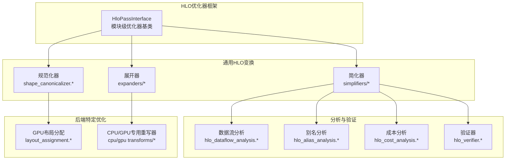
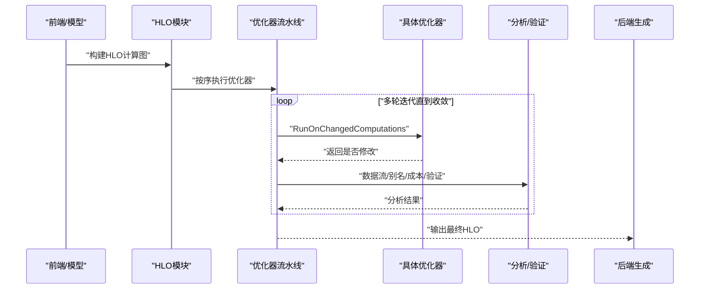
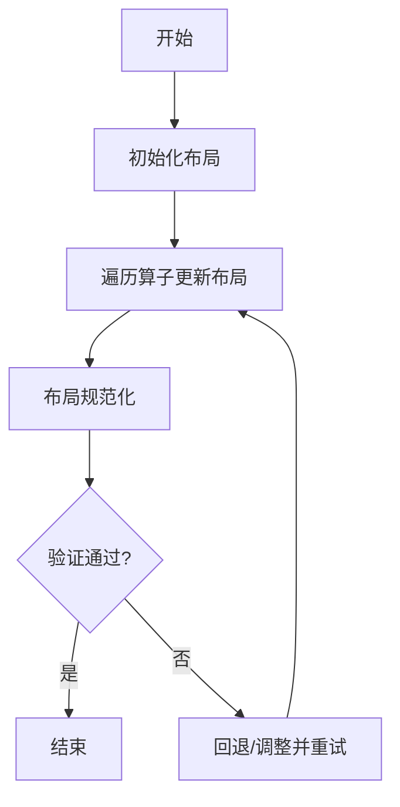
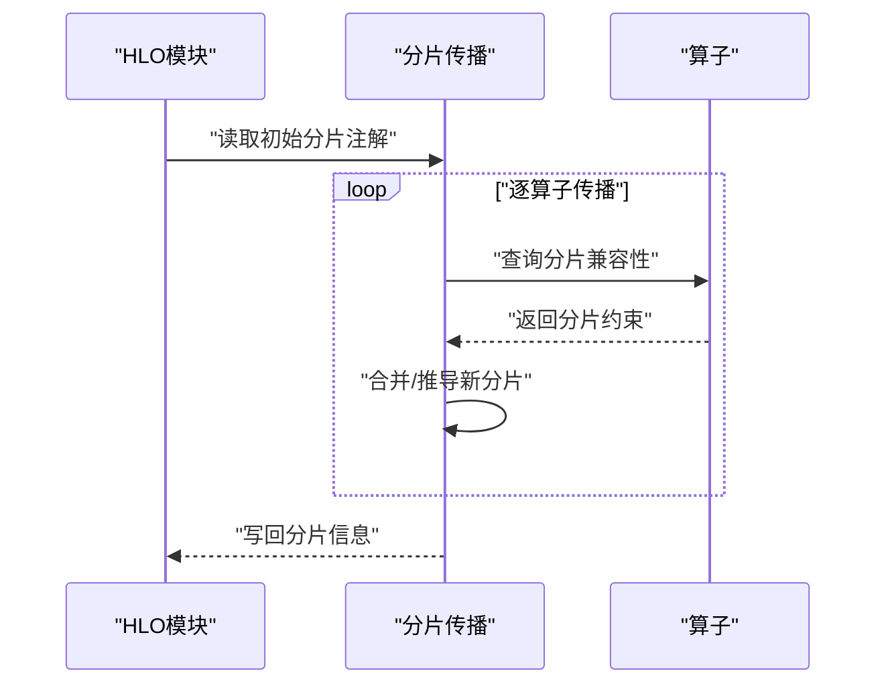
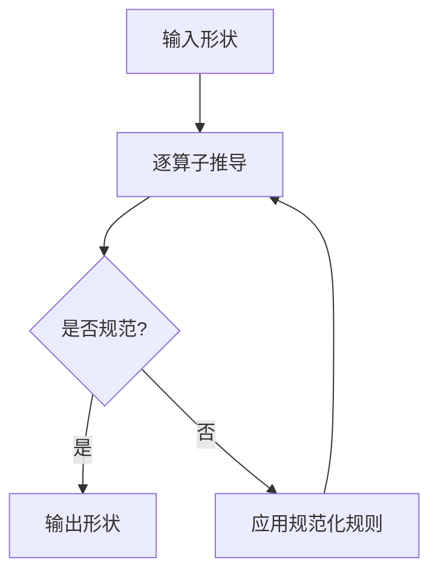
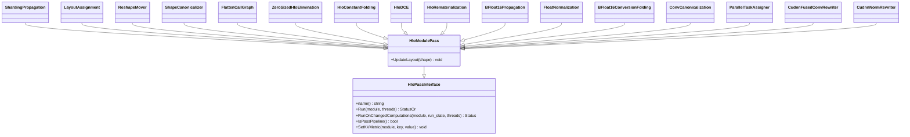
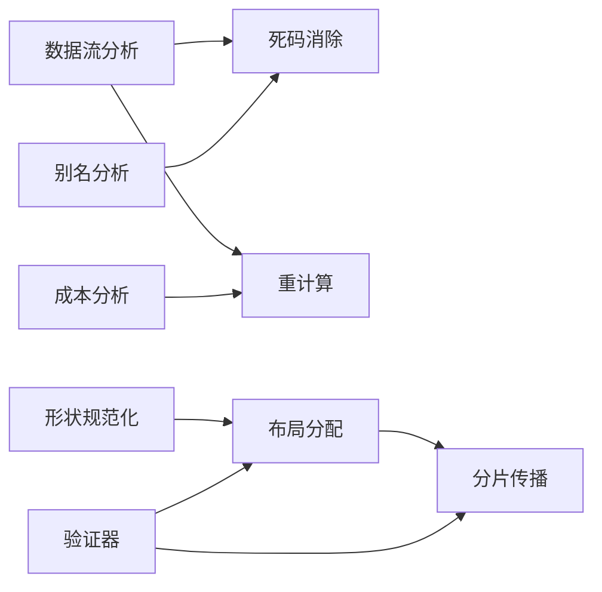

# HLO优化器

<cite>
**本文引用的文件**
- [xla\hlo\pass\hlo_pass_interface.h](file://xla\hlo\pass\hlo_pass_interface.h)
- [docs\hlo_passes.md](file://docs\hlo_passes.md)
- [xla\service\sharding_propagation.h](file://xla\service\sharding_propagation.h)
- [xla\service\sharding_propagation.cc](file://xla\service\sharding_propagation.cc)
- [xla\backends\gpu\transforms\layout_assignment.h](file://xla\backends\gpu\transforms\layout_assignment.h)
- [xla\backends\gpu\transforms\layout_assignment.cc](file://xla\backends\gpu\transforms\layout_assignment.cc)
- [xla\hlo\transforms\simplifiers\reshape_mover.h](file://xla\hlo\transforms\simplifiers\reshape_mover.h)
- [xla\hlo\transforms\simplifiers\reshape_mover.cc](file://xla\hlo\transforms\simplifiers\reshape_mover.cc)
- [xla\hlo\transforms\shape_canonicalizer.h](file://xla\hlo\transforms\shape_canonicalizer.h)
- [xla\hlo\transforms\shape_canonicalizer.cc](file://xla\hlo\transforms\shape_canonicalizer.cc)
- [xla\hlo\transforms\expanders\reshape_decomposer.h](file://xla\hlo\transforms\expanders\reshape_decomposer.h)
- [xla\hlo\transforms\expanders\reshape_decomposer.cc](file://xla\hlo\transforms\expanders\reshape_decomposer.cc)
- [xla\hlo\analysis\hlo_dataflow_analysis.h](file://xla\hlo\analysis\hlo_dataflow_analysis.h)
- [xla\hlo\analysis\hlo_alias_analysis.h](file://xla\hlo\analysis\hlo_alias_analysis.h)
- [xla\service\hlo_cost_analysis.h](file://xla\service\hlo_cost_analysis.h)
- [xla\service\hlo_verifier.h](file://xla\service\hlo_verifier.h)
- [xla\hlo\transforms\simplifiers\hlo_constant_folding.h](file://xla\hlo\transforms\simplifiers\hlo_constant_folding.h)
- [xla\hlo\transforms\simplifiers\hlo_dce.h](file://xla\hlo\transforms\simplifiers\hlo_dce.h)
- [xla\hlo\transforms\simplifiers\hlo_rematerialization.h](file://xla\hlo\transforms\simplifiers\hlo_rematerialization.h)
- [xla\hlo\transforms\bfloat16_propagation.h](file://xla\hlo\transforms\bfloat16_propagation.h)
- [xla\hlo\transforms\simplifiers\float_normalization.h](file://xla\hlo\transforms\simplifiers\float_normalization.h)
- [xla\hlo\transforms\simplifiers\bfloat16_conversion_folding.h](file://xla\hlo\transforms\simplifiers\bfloat16_conversion_folding.h)
- [xla\service\cpu\conv_canonicalization.h](file://xla\service\cpu\conv_canonicalization.h)
- [xla\service\gpu\transforms\cudnn_fused_conv_rewriter.h](file://xla\service\gpu\transforms\cudnn_fused_conv_rewriter.h)
- [xla\service\gpu\transforms\cudnn_norm_rewriter.h](file://xla\service\gpu\transforms\cudnn_norm_rewriter.h)
- [xla\service\cpu\parallel_task_assignment.h](file://xla\service\cpu\parallel_task_assignment.h)
- [xla\service\gpu\transforms\cudnn_fused_conv_rewriter.cc](file://xla\service\gpu\transforms\cudnn_fused_conv_rewriter.cc)
- [xla\service\gpu\transforms\cudnn_norm_rewriter.cc](file://xla\service\gpu\transforms\cudnn_norm_rewriter.cc)
- [xla\service\cpu\conv_canonicalization.cc](file://xla\service\cpu\conv_canonicalization.cc)
- [xla\service\cpu\parallel_task_assignment.cc](file://xla\service\cpu\parallel_task_assignment.cc)
- [xla\hlo\transforms\simplifiers\flatten_call_graph.h](file://xla\hlo\transforms\simplifiers\flatten_call_graph.h)
- [xla\hlo\transforms\simplifiers\flatten_call_graph.cc](file://xla\hlo\transforms\simplifiers\flatten_call_graph.cc)
- [xla\hlo\transforms\simplifiers\zero_sized_hlo_elimination.h](file://xla\hlo\transforms\simplifiers\zero_sized_hlo_elimination.h)
- [xla\hlo\transforms\simplifiers\zero_sized_hlo_elimination.cc](file://xla\hlo\transforms\simplifiers\zero_sized_hlo_elimination.cc)
</cite>

## 目录
1. [引言](#引言)
2. [项目结构](#项目结构)
3. [核心组件](#核心组件)
4. [架构总览](#架构总览)
5. [详细组件分析](#详细组件分析)
6. [依赖分析](#依赖分析)
7. [性能考虑](#性能考虑)
8. [故障排查指南](#故障排查指南)
9. [结论](#结论)
10. [附录](#附录)

## 引言
本文件系统性梳理XLA中的HLO（High-Level Optimizer）优化器体系，覆盖优化器分类、优化目标、关键优化技术（布局分配、分片传播、形状推断）、算法原理与约束、执行顺序与依赖关系，并提供可操作的实现与集成建议。文档同时给出效果评估指标与性能基准方法，帮助开发者在新增或调整优化器时与既有流水线协同工作。

## 项目结构
XLA的HLO优化器主要分布在以下区域：
- 通用HLO变换：xla/hlo/transforms 下的simplifiers、expanders、canonicalizers等子目录
- 分析与验证：xla/hlo/analysis 与 xla/service 下的验证与成本分析
- 后端特定优化：xla/service/{cpu,gpu} 与 xla/backends/gpu/transforms
- 优化器框架：xla/hlo/pass

图示来源
- [xla\hlo\pass\hlo_pass_interface.h](file://xla\hlo\pass\hlo_pass_interface.h#L40-L161)
- [docs\hlo_passes.md](file://docs\hlo_passes.md#L1-L231)

章节来源
- [xla\hlo\pass\hlo_pass_interface.h](file://xla\hlo\pass\hlo_pass_interface.h#L40-L161)
- [docs\hlo_passes.md](file://docs\hlo_passes.md#L1-L231)

## 核心组件
- 优化器接口与运行状态
  - HloPassInterface定义了统一的Run/RunOnChangedComputations接口、迭代状态RunState，以及模块元数据度量设置能力
  - HloModulePass作为模块级优化器基类，提供布局更新钩子以适配不同后端
- 通用HLO变换
  - 简化器：常数折叠、死代码消除、重计算（Rematerialization）、调用图扁平化、零大小HLO消除、reshape移动等
  - 展开器：reshape分解等
  - 规范化器：形状规范化
- 分析与验证
  - 数据流/别名分析、成本分析、验证器
- 后端特定优化
  - GPU布局分配、CPU/GPU专用重写器（如cuDNN融合）

章节来源
- [xla\hlo\pass\hlo_pass_interface.h](file://xla\hlo\pass\hlo_pass_interface.h#L40-L161)
- [docs\hlo_passes.md](file://docs\hlo_passes.md#L48-L231)

## 架构总览
下图展示了HLO优化器在编译流水线中的位置与交互：

图示来源
- [xla\hlo\pass\hlo_pass_interface.h](file://xla\hlo\pass\hlo_pass_interface.h#L103-L113)
- [xla\hlo\analysis\hlo_dataflow_analysis.h](file://xla\hlo\analysis\hlo_dataflow_analysis.h)
- [xla\hlo\analysis\hlo_alias_analysis.h](file://xla\hlo\analysis\hlo_alias_analysis.h)
- [xla\service\hlo_cost_analysis.h](file://xla\service\hlo_cost_analysis.h)
- [xla\service\hlo_verifier.h](file://xla\service\hlo_verifier.h)

## 详细组件分析

### 布局分配（Layout Assignment）
- 目标：为张量选择最优内存布局（含维度顺序、分块、对齐），提升访存与算子效率
- 关键点
  - 影响因素：后端特性（如GPU的Wmma/寄存器分块）、算子语义（卷积/归约/批量矩阵乘）、形状与分片
  - 迭代策略：基于启发式与局部最优尝试，结合验证器确保不变量
  - 与形状/分片的关系：布局变化可能触发形状规范化与分片传播
- 典型流程
  - 初始化布局（从类型/形状推导）
  - 遍历算子，根据后端规则与代价模型更新布局
  - 规范化并回填到形状
  - 验证布局一致性

图示来源
- [xla\backends\gpu\transforms\layout_assignment.h](file://xla\backends\gpu\transforms\layout_assignment.h)
- [xla\backends\gpu\transforms\layout_assignment.cc](file://xla\backends\gpu\transforms\layout_assignment.cc)

章节来源
- [xla\backends\gpu\transforms\layout_assignment.h](file://xla\backends\gpu\transforms\layout_assignment.h)
- [xla\backends\gpu\transforms\layout_assignment.cc](file://xla\backends\gpu\transforms\layout_assignment.cc)

### 分片传播（Sharding Propagation）
- 目标：在多设备拓扑上将计算与数据分片，保持语义正确并最小化通信
- 关键点
  - 从输入/注解出发，沿数据流传播分片方案
  - 与布局/形状相互影响：某些分片模式需要特定布局
  - 在TPU等硬件上支持空间划分（非batch维）
- 典型流程
  - 解析用户/编译期分片注解
  - 沿算子传播分片（考虑算子对分片的兼容性）
  - 与布局/形状规范化协调
  - 生成最终分片计划

图示来源
- [xla\service\sharding_propagation.h](file://xla\service\sharding_propagation.h)
- [xla\service\sharding_propagation.cc](file://xla\service\sharding_propagation.cc)

章节来源
- [xla\service\sharding_propagation.h](file://xla\service\sharding_propagation.h)
- [xla\service\sharding_propagation.cc](file://xla\service\sharding_propagation.cc)

### 形状推断与规范化（Shape Inference & Canonicalization）
- 目标：确保形状一致、合法且符合后端期望；将语义等价但表达不同的形状标准化
- 关键点
  - 形状一致性检查与推导
  - 规范化器将不规范的形状转换为标准形式（如维度顺序、标签）
  - 与布局/分片协同：规范化可能改变布局需求
- 典型流程
  - 从根节点开始，递归推导每个算子的输出形状
  - 应用规范化规则
  - 验证形状约束

图示来源
- [xla\hlo\transforms\shape_canonicalizer.h](file://xla\hlo\transforms\shape_canonicalizer.h)
- [xla\hlo\transforms\shape_canonicalizer.cc](file://xla\hlo\transforms\shape_canonicalizer.cc)

章节来源
- [xla\hlo\transforms\shape_canonicalizer.h](file://xla\hlo\transforms\shape_canonicalizer.h)
- [xla\hlo\transforms\shape_canonicalizer.cc](file://xla\hlo\transforms\shape_canonicalizer.cc)

### 通用优化器示例

#### 重计算（Rematerialization）
- 目标：通过重新计算中间结果降低活跃寄存器/内存占用
- 约束：需权衡计算与内存，避免热点被过度重算
- 执行顺序：通常在早期进行，为后续布局/分片优化腾挪空间

章节来源
- [xla\hlo\transforms\simplifiers\hlo_rematerialization.h](file://xla\hlo\transforms\simplifiers\hlo_rematerialization.h)

#### 常数折叠（Constant Folding）
- 目标：将编译期可计算的表达式替换为常量
- 约束：仅在确定性上下文有效，避免破坏动态行为

章节来源
- [xla\hlo\transforms\simplifiers\hlo_constant_folding.h](file://xla\hlo\transforms\simplifiers\hlo_constant_folding.h)

#### 死代码消除（Dead Code Elimination）
- 目标：移除无用结果，减少后续处理负担
- 约束：需与别名/数据流分析协同，防止误删

章节来源
- [xla\hlo\transforms\simplifiers\hlo_dce.h](file://xla\hlo\transforms\simplifiers\hlo_dce.h)

#### 调用图扁平化（Call Graph Flattening）
- 目标：将嵌套调用转换为树形结构，便于静态内存分配
- 约束：需克隆计算体，控制体积增长

章节来源
- [xla\hlo\transforms\simplifiers\flatten_call_graph.h](file://xla\hlo\transforms\simplifiers\flatten_call_graph.h)
- [xla\hlo\transforms\simplifiers\flatten_call_graph.cc](file://xla\hlo\transforms\simplifiers\flatten_call_graph.cc)

#### 零大小HLO消除（Zero-sized HLO Elimination）
- 目标：将零维/零长度操作替换为等价常量，减少运行时分支

章节来源
- [xla\hlo\transforms\simplifiers\zero_sized_hlo_elimination.h](file://xla\hlo\transforms\simplifiers\zero_sized_hlo_elimination.h)
- [xla\hlo\transforms\simplifiers\zero_sized_hlo_elimination.cc](file://xla\hlo\transforms\simplifiers\zero_sized_hlo_elimination.cc)

#### reshape移动（Reshape Mover）
- 目标：将reshape/transpose移动到不影响算子融合的位置，提升融合率
- 约束：需保持语义等价，避免引入额外拷贝

章节来源
- [xla\hlo\transforms\simplifiers\reshape_mover.h](file://xla\hlo\transforms\simplifiers\reshape_mover.h)
- [xla\hlo\transforms\simplifiers\reshape_mover.cc](file://xla\hlo\transforms\simplifiers\reshape_mover.cc)

#### bfloat16相关优化
- bfloat16传播与混合精度去除、转换折叠
- 目标：降低带宽与存储占用，提升吞吐

章节来源
- [xla\hlo\transforms\bfloat16_propagation.h](file://xla\hlo\transforms\bfloat16_propagation.h)
- [xla\hlo\transforms\simplifiers\float_normalization.h](file://xla\hlo\transforms\simplifiers\float_normalization.h)
- [xla\hlo\transforms\simplifiers\bfloat16_conversion_folding.h](file://xla\hlo\transforms\simplifiers\bfloat16_conversion_folding.h)

#### 后端特定优化
- CPU：卷积规范化、并行任务分配
- GPU：cuDNN融合重写（卷积/归一化）

章节来源
- [xla\service\cpu\conv_canonicalization.h](file://xla\service\cpu\conv_canonicalization.h)
- [xla\service\cpu\parallel_task_assignment.h](file://xla\service\cpu\parallel_task_assignment.h)
- [xla\service\gpu\transforms\cudnn_fused_conv_rewriter.h](file://xla\service\gpu\transforms\cudnn_fused_conv_rewriter.h)
- [xla\service\gpu\transforms\cudnn_norm_rewriter.h](file://xla\service\gpu\transforms\cudnn_norm_rewriter.h)

### 类关系与依赖（代码级）

图示来源
- [xla\hlo\pass\hlo_pass_interface.h](file://xla\hlo\pass\hlo_pass_interface.h#L40-L161)
- [xla\service\sharding_propagation.h](file://xla\service\sharding_propagation.h)
- [xla\backends\gpu\transforms\layout_assignment.h](file://xla\backends\gpu\transforms\layout_assignment.h)
- [xla\hlo\transforms\simplifiers\reshape_mover.h](file://xla\hlo\transforms\simplifiers\reshape_mover.h)
- [xla\hlo\transforms\shape_canonicalizer.h](file://xla\hlo\transforms\shape_canonicalizer.h)
- [xla\hlo\transforms\simplifiers\flatten_call_graph.h](file://xla\hlo\transforms\simplifiers\flatten_call_graph.h)
- [xla\hlo\transforms\simplifiers\zero_sized_hlo_elimination.h](file://xla\hlo\transforms\simplifiers\zero_sized_hlo_elimination.h)
- [xla\hlo\transforms\simplifiers\hlo_constant_folding.h](file://xla\hlo\transforms\simplifiers\hlo_constant_folding.h)
- [xla\hlo\transforms\simplifiers\hlo_dce.h](file://xla\hlo\transforms\simplifiers\hlo_dce.h)
- [xla\hlo\transforms\simplifiers\hlo_rematerialization.h](file://xla\hlo\transforms\simplifiers\hlo_rematerialization.h)
- [xla\hlo\transforms\bfloat16_propagation.h](file://xla\hlo\transforms\bfloat16_propagation.h)
- [xla\hlo\transforms\simplifiers\float_normalization.h](file://xla\hlo\transforms\simplifiers\float_normalization.h)
- [xla\hlo\transforms\simplifiers\bfloat16_conversion_folding.h](file://xla\hlo\transforms\simplifiers\bfloat16_conversion_folding.h)
- [xla\service\cpu\conv_canonicalization.h](file://xla\service\cpu\conv_canonicalization.h)
- [xla\service\cpu\parallel_task_assignment.h](file://xla\service\cpu\parallel_task_assignment.h)
- [xla\service\gpu\transforms\cudnn_fused_conv_rewriter.h](file://xla\service\gpu\transforms\cudnn_fused_conv_rewriter.h)
- [xla\service\gpu\transforms\cudnn_norm_rewriter.h](file://xla\service\gpu\transforms\cudnn_norm_rewriter.h)

## 依赖分析
- 低耦合高内聚：各优化器继承自HloModulePass，遵循统一接口，便于组合与迭代
- 依赖链
  - 形状规范化/布局分配通常先于分片传播，以保证布局与分片的一致性
  - 数据流/别名分析为死码消除、重计算等提供安全边界
  - 成本分析指导重计算与布局选择
  - 验证器贯穿于关键节点，确保不变量
- 可能的循环依赖
  - 通过“仅对变更计算图运行”的机制与RunState迭代控制，避免无限循环

图示来源
- [xla\hlo\analysis\hlo_dataflow_analysis.h](file://xla\hlo\analysis\hlo_dataflow_analysis.h)
- [xla\hlo\analysis\hlo_alias_analysis.h](file://xla\hlo\analysis\hlo_alias_analysis.h)
- [xla\service\hlo_cost_analysis.h](file://xla\service\hlo_cost_analysis.h)
- [xla\hlo\transforms\shape_canonicalizer.h](file://xla\hlo\transforms\shape_canonicalizer.h)
- [xla\backends\gpu\transforms\layout_assignment.h](file://xla\backends\gpu\transforms\layout_assignment.h)
- [xla\service\sharding_propagation.h](file://xla\service\sharding_propagation.h)
- [xla\service\hlo_verifier.h](file://xla\service\hlo_verifier.h)

章节来源
- [xla\hlo\analysis\hlo_dataflow_analysis.h](file://xla\hlo\analysis\hlo_dataflow_analysis.h)
- [xla\hlo\analysis\hlo_alias_analysis.h](file://xla\hlo\analysis\hlo_alias_analysis.h)
- [xla\service\hlo_cost_analysis.h](file://xla\service\hlo_cost_analysis.h)
- [xla\service\hlo_verifier.h](file://xla\service\hlo_verifier.h)

## 性能考虑
- 评估指标
  - 内存占用（激活/临时缓冲区峰值）
  - 计算强度（FLOPs/带宽）
  - 编译时间（总时间/单个Pass耗时）
  - 运行时吞吐（样本/秒）
  - 通信量（多设备场景）
- 基准测试建议
  - 使用hlo-opt工具独立运行单个Pass，对比前后形状/布局/分片统计
  - 结合成本分析与验证器输出，量化收益
  - 多规模/多算子组合测试，覆盖热点路径

## 故障排查指南
- 常见问题
  - 布局不一致：检查布局规范化与后端规则
  - 分片冲突：核对分片传播与布局/形状的兼容性
  - 形状推断错误：确认规范化器与算子形状约束
  - 误删/误增：核查数据流/别名分析与DCE/Rematerialization
- 工具与方法
  - 使用验证器与成本分析定位异常
  - 逐步禁用/启用Pass，二分定位问题Pass
  - 导出中间HLO，人工比对布局/分片/形状

章节来源
- [xla\service\hlo_verifier.h](file://xla\service\hlo_verifier.h)
- [xla\service\hlo_cost_analysis.h](file://xla\service\hlo_cost_analysis.h)

## 结论
HLO优化器体系以模块化接口为核心，围绕布局、分片、形状三大支柱展开，辅以丰富的通用优化器与后端特定重写器。通过严格的分析与验证、清晰的执行顺序与依赖关系，实现了在多后端上的高效与稳定。新增优化器应遵循统一接口、最小侵入原则，并与既有分析/验证工具协同。

## 附录

### 实现新优化器的步骤
- 继承HloModulePass，实现RunImpl与RunOnChangedComputations
- 明确输入/输出形状与布局约束，必要时调用UpdateLayout
- 在合适阶段插入流水线（参考通用优化器顺序）
- 提供单元测试与回归测试，使用hlo-opt工具验证
- 与数据流/别名/成本/验证工具协作，确保安全性与可观测性

章节来源
- [xla\hlo\pass\hlo_pass_interface.h](file://xla\hlo\pass\hlo_pass_interface.h#L131-L141)

### 通用优化器顺序建议（概念性）
- 早期：重计算、常数折叠、调用图扁平化
- 中期：形状规范化、reshape移动、别名/数据流分析驱动的DCE
- 后期：布局分配、分片传播、bfloat16优化
- 尾声：验证与成本分析收尾

图示来源
- [docs\hlo_passes.md](file://docs\hlo_passes.md#L48-L231)