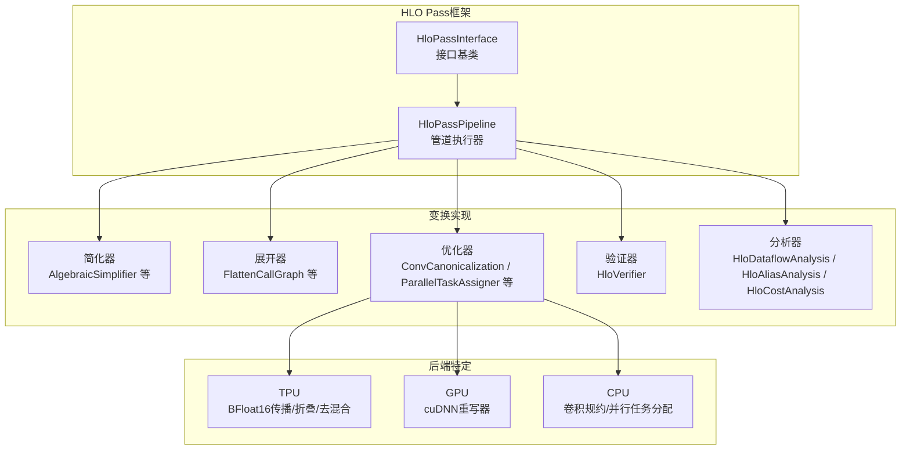
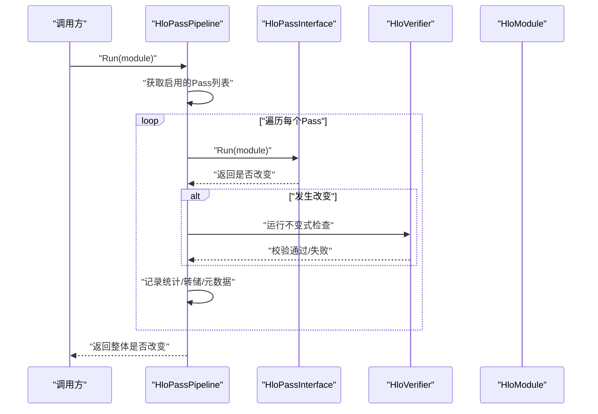
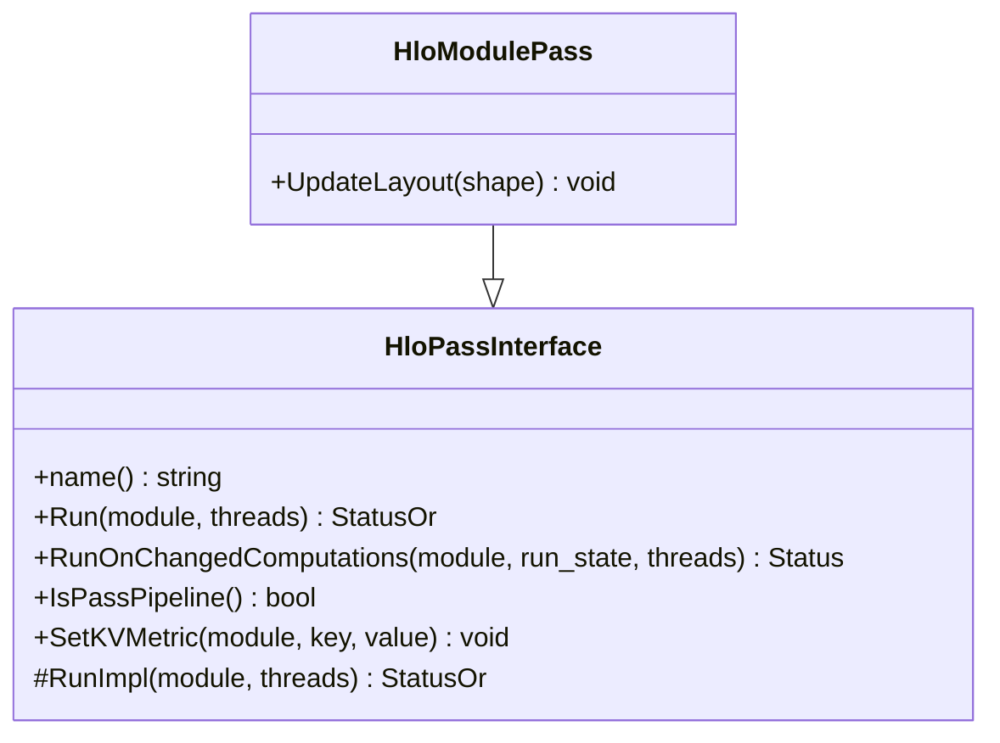
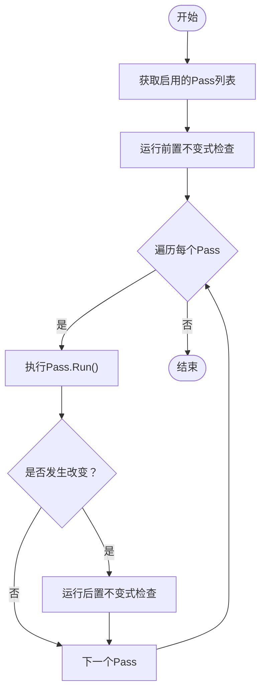
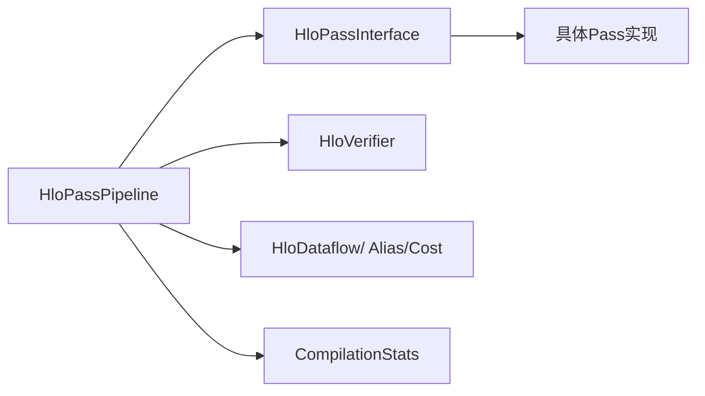

# HLO变换系统

<cite>
**本文引用的文件**
- [hlo_pass_interface.h](file://xla/hlo/pass/hlo_pass_interface.h)
- [hlo_pass_interface.cc](file://xla/hlo/pass/hlo_pass_interface.cc)
- [hlo_pass_pipeline.h](file://xla/hlo/pass/hlo_pass_pipeline.h)
- [hlo_pass_pipeline.cc](file://xla/hlo/pass/hlo_pass_pipeline.cc)
- [hlo_passes.md](file://docs/hlo_passes.md)
- [test_hlo_passes.md](file://docs/test_hlo_passes.md)
- [hlo_verifier.h](file://xla/service/hlo_verifier.h)
- [hlo_cost_analysis.h](file://xla/service/hlo_cost_analysis.h)
- [hlo_dataflow_analysis.h](file://xla/hlo/analysis/hlo_dataflow_analysis.h)
- [hlo_alias_analysis.h](file://xla/hlo/analysis/hlo_alias_analysis.h)
- [bfloat16_propagation.h](file://xla/hlo/transforms/bfloat16_propagation.h)
- [bfloat16_conversion_folding.h](file://xla/hlo/transforms/simplifiers/bfloat16_conversion_folding.h)
- [bfloat16_mixed_precision_removal.h](file://xla/hlo/transforms/simplifiers/bfloat16_mixed_precision_removal.h)
- [algebraic_simplifier.h](file://xla/hlo/transforms/simplifiers/algebraic_simplifier.h)
- [hlo_constant_folding.h](file://xla/hlo/transforms/simplifiers/hlo_constant_folding.h)
- [hlo_dce.h](file://xla/hlo/transforms/simplifiers/hlo_dce.h)
- [flatten_call_graph.h](file://xla/hlo/transforms/simplifiers/flatten_call_graph.h)
- [reshape_mover.h](file://xla/hlo/transforms/simplifiers/reshape_mover.h)
- [zero_sized_hlo_elimination.h](file://xla/hlo/transforms/simplifiers/zero_sized_hlo_elimination.h)
- [hlo_rematerialization.h](file://xla/hlo/transforms/simplifiers/hlo_rematerialization.h)
- [cudnn_fused_conv_rewriter.h](file://xla/service/gpu/transforms/cudnn_fused_conv_rewriter.h)
- [cudnn_norm_rewriter.h](file://xla/service/gpu/transforms/cudnn_norm_rewriter.h)
- [conv_canonicalization.h](file://xla/service/cpu/conv_canonicalization.h)
- [parallel_task_assigner.h](file://xla/service/cpu/parallel_task_assigner.h)
- [sharding_propagation.h](file://xla/service/sharding_propagation.h)
- [gather_expander.h](file://xla/service/gather_expander.h)
- [batchnorm_expander.h](file://xla/service/batchnorm_expander.h)
- [hlo_pass.cc](file://xla/python/hlo_pass.cc)
</cite>

## 目录
1. [引言](#引言)
2. [项目结构](#项目结构)
3. [核心组件](#核心组件)
4. [架构总览](#架构总览)
5. [详细组件分析](#详细组件分析)
6. [依赖关系分析](#依赖关系分析)
7. [性能考虑](#性能考虑)
8. [故障排除指南](#故障排除指南)
9. [结论](#结论)
10. [附录](#附录)

## 引言
本文件面向HLO（High-Level Optimizer）变换系统的开发者与使用者，系统化阐述HLO Pass管道架构、变换执行流程、各类变换类型（简化器、展开器、优化器、验证器）及其内置规则的实现原理与适用场景，并提供开发自定义HLO变换的实践路径、组合策略、执行顺序与依赖关系管理方法。同时给出性能分析、调试技术与故障排除建议，以及可扩展性与插件机制的设计要点。

## 项目结构
围绕HLO变换系统的关键代码主要分布在以下位置：
- HLO Pass框架：xla/hlo/pass
- 变换实现：xla/hlo/transforms、xla/service（CPU/GPU/TPU特定）
- 分析工具：xla/hlo/analysis
- 文档：docs 下的 hlo_passes.md、test_hlo_passes.md 等
- Python绑定：xla/python/hlo_pass.cc

下图展示了与HLO变换系统直接相关的模块关系：

图表来源
- [hlo_pass_interface.h](file://xla/hlo/pass/hlo_pass_interface.h#L40-L141)
- [hlo_pass_pipeline.h](file://xla/hlo/pass/hlo_pass_pipeline.h#L38-L161)
- [hlo_passes.md](file://docs/hlo_passes.md#L1-L231)

章节来源
- [hlo_pass_interface.h](file://xla/hlo/pass/hlo_pass_interface.h#L1-L161)
- [hlo_pass_pipeline.h](file://xla/hlo/pass/hlo_pass_pipeline.h#L1-L166)
- [hlo_passes.md](file://docs/hlo_passes.md#L1-L231)

## 核心组件
- HloPassInterface：所有HLO Pass的统一接口，定义了Run、RunOnChangedComputations、name等核心方法；支持在多次迭代中维护RunState以跟踪变更集合。
- HloPassPipeline：HLO Pass管道，负责按序执行多个Pass、注入不变式检查器、统计与转储控制、调试选项过滤、性能标注与日志记录。
- HloModulePass：模块级变换的基类，提供布局更新等后端相关能力。
- 分析与验证：HloVerifier、HloDataflowAnalysis、HloAliasAnalysis、HloCostAnalysis等，用于验证图不变式、数据流关系、别名关系与计算成本估算。

章节来源
- [hlo_pass_interface.h](file://xla/hlo/pass/hlo_pass_interface.h#L40-L156)
- [hlo_pass_interface.cc](file://xla/hlo/pass/hlo_pass_interface.cc#L26-L36)
- [hlo_pass_pipeline.h](file://xla/hlo/pass/hlo_pass_pipeline.h#L38-L161)
- [hlo_pass_pipeline.cc](file://xla/hlo/pass/hlo_pass_pipeline.cc#L291-L321)
- [hlo_verifier.h](file://xla/service/hlo_verifier.h)
- [hlo_dataflow_analysis.h](file://xla/hlo/analysis/hlo_dataflow_analysis.h)
- [hlo_alias_analysis.h](file://xla/hlo/analysis/hlo_alias_analysis.h)
- [hlo_cost_analysis.h](file://xla/service/hlo_cost_analysis.h)

## 架构总览
HLO变换系统采用“接口+管道”的分层设计：
- 接口层：HloPassInterface定义统一的变换契约，确保所有Pass具备一致的生命周期与返回语义。
- 管道层：HloPassPipeline串联多个Pass，提供调试开关、不变式检查、转储钩子、统计与性能标注。
- 实现层：具体变换（简化器、展开器、优化器、验证器）按职责实现于transforms与service目录，按平台细分。
- 分析层：独立的分析Pass不修改图，但提供验证与度量能力，作为管道中的不变式检查器使用。

图表来源
- [hlo_pass_pipeline.cc](file://xla/hlo/pass/hlo_pass_pipeline.cc#L134-L220)
- [hlo_pass_pipeline.h](file://xla/hlo/pass/hlo_pass_pipeline.h#L97-L161)
- [hlo_pass_interface.h](file://xla/hlo/pass/hlo_pass_interface.h#L78-L113)
- [hlo_verifier.h](file://xla/service/hlo_verifier.h)

## 详细组件分析

### HloPassInterface与HloModulePass
- 设计要点
  - Run与RunOnChangedComputations：前者一次性对整个模块执行；后者基于RunState仅对变更的计算图执行，提升迭代效率。
  - RunState：维护迭代次数、全局变更集合、上一次与本次变更集合，支持增量收敛。
  - 元数据与指标：SetKVMetric用于向模块元数据写入键值度量，便于追踪与分析。
  - 布局更新：HloModulePass提供UpdateLayout，适配不同后端对形状布局的要求。
- 复杂度与性能
  - RunOnChangedComputations可显著降低重复工作，复杂度与变更规模成正比。
  - 增量执行需谨慎处理跨计算图的依赖，避免遗漏。

图表来源
- [hlo_pass_interface.h](file://xla/hlo/pass/hlo_pass_interface.h#L40-L156)

章节来源
- [hlo_pass_interface.h](file://xla/hlo/pass/hlo_pass_interface.h#L40-L156)
- [hlo_pass_interface.cc](file://xla/hlo/pass/hlo_pass_interface.cc#L26-L36)

### HloPassPipeline
- 设计要点
  - AddPass/AddInvariantChecker：构建管道，支持模板构造Pass实例；不变式检查器在每次Pass前后运行，且必须保证不修改图。
  - 调试与过滤：通过DebugOptions动态启用/禁用特定Pass或整条管道，支持正则匹配转储。
  - 统计与元数据：记录每个Pass开始/结束、模块唯一ID、是否发生改变、错误码等。
  - 性能标注：使用TraceMe/ScopedAnnotation进行性能采样与可视化。
- 执行流程
  - 预置不变式检查 → 记录管道开始元数据 → 按序执行Pass → 若发生改变则运行不变式检查 → 记录Pass结束元数据 → 更新统计信息 → 条件性转储中间结果。

图表来源
- [hlo_pass_pipeline.cc](file://xla/hlo/pass/hlo_pass_pipeline.cc#L134-L220)
- [hlo_pass_pipeline.h](file://xla/hlo/pass/hlo_pass_pipeline.h#L97-L161)

章节来源
- [hlo_pass_pipeline.h](file://xla/hlo/pass/hlo_pass_pipeline.h#L38-L161)
- [hlo_pass_pipeline.cc](file://xla/hlo/pass/hlo_pass_pipeline.cc#L291-L321)

### 变换类型与内置规则

#### 简化器（Simplifiers）
- 作用：执行代数简化、常量折叠、死代码消除、零大小HLO消除、重定位reshape/transpose等，减少算子数量与内存占用。
- 典型实现与场景
  - AlgebraicSimplifier：类似LLVM的instcombine，进行表达式合并与简化。
  - HloConstantFolding：编译期常量替换。
  - HloDCE：移除无用结果的运算。
  - ReshapeMover：将reshape/transpose移动到元素级运算附近以便融合或消除。
  - ZeroSizedHloElimination：将零维操作替换为零大小常量。
  - HloRematerialization：选择性重计算以降低长存活寄存器压力。
- 应用场景
  - 通用CPU/GPU/TPU均可受益；TPU还可结合bfloat16相关Pass进一步优化。

章节来源
- [hlo_passes.md](file://docs/hlo_passes.md#L66-L117)
- [algebraic_simplifier.h](file://xla/hlo/transforms/simplifiers/algebraic_simplifier.h)
- [hlo_constant_folding.h](file://xla/hlo/transforms/simplifiers/hlo_constant_folding.h)
- [hlo_dce.h](file://xla/hlo/transforms/simplifiers/hlo_dce.h)
- [reshape_mover.h](file://xla/hlo/transforms/simplifiers/reshape_mover.h)
- [zero_sized_hlo_elimination.h](file://xla/hlo/transforms/simplifiers/zero_sized_hlo_elimination.h)
- [hlo_rematerialization.h](file://xla/hlo/transforms/simplifiers/hlo_rematerialization.h)

#### 展开器（Expanders）
- 作用：将不被后端直接支持的HLO转换为可发射形式，或生成更高效的等价序列。
- 典型实现与场景
  - FlattenCallGraph：将调用图扁平化为树，满足静态内存分配约束。
  - GatherExpander / BatchNormExpander：将不支持的操作展开为后端可发射序列。
- 应用场景
  - 后端合法性与效率要求；TPU多核分区前的图规范化。

章节来源
- [hlo_passes.md](file://docs/hlo_passes.md#L91-L158)
- [flatten_call_graph.h](file://xla/hlo/transforms/simplifiers/flatten_call_graph.h)
- [gather_expander.h](file://xla/service/gather_expander.h)
- [batchnorm_expander.h](file://xla/service/batchnorm_expander.h)

#### 优化器（Optimizers）
- 作用：针对特定后端进行图级优化，提升吞吐与资源利用率。
- 典型实现与场景
  - CPU：ConvCanonicalization（卷积规约）、ParallelTaskAssigner（并行任务分配）。
  - GPU：cuDNN重写器（融合卷积/归一化为库调用）。
  - TPU：ShardingPropagation（空间划分）、BFloat16传播/折叠/去混合。
- 应用场景
  - 不同硬件特性下的吞吐与带宽优化；多设备并行。

章节来源
- [hlo_passes.md](file://docs/hlo_passes.md#L118-L195)
- [conv_canonicalization.h](file://xla/service/cpu/conv_canonicalization.h)
- [parallel_task_assigner.h](file://xla/service/cpu/parallel_task_assigner.h)
- [cudnn_fused_conv_rewriter.h](file://xla/service/gpu/transforms/cudnn_fused_conv_rewriter.h)
- [cudnn_norm_rewriter.h](file://xla/service/gpu/transforms/cudnn_norm_rewriter.h)
- [sharding_propagation.h](file://xla/service/sharding_propagation.h)
- [bfloat16_propagation.h](file://xla/hlo/transforms/bfloat16_propagation.h)
- [bfloat16_conversion_folding.h](file://xla/hlo/transforms/simplifiers/bfloat16_conversion_folding.h)
- [bfloat16_mixed_precision_removal.h](file://xla/hlo/transforms/simplifiers/bfloat16_mixed_precision_removal.h)

#### 验证器（Verifiers）
- 作用：在变换前后验证图的不变式，确保变换正确性与一致性。
- 典型实现与场景
  - HloVerifier：验证HLO图的各种不变式。
  - HloDataflowAnalysis / HloAliasAnalysis：数据流与别名关系分析。
  - HloCostAnalysis：计算FLOP与内存使用估计。
- 应用场景
  - 管道中的不变式检查器；调试与回归测试。

章节来源
- [hlo_passes.md](file://docs/hlo_passes.md#L196-L231)
- [hlo_verifier.h](file://xla/service/hlo_verifier.h)
- [hlo_dataflow_analysis.h](file://xla/hlo/analysis/hlo_dataflow_analysis.h)
- [hlo_alias_analysis.h](file://xla/hlo/analysis/hlo_alias_analysis.h)
- [hlo_cost_analysis.h](file://xla/service/hlo_cost_analysis.h)

### 自定义HLO变换开发指南
- 开发步骤
  - 继承HloModulePass或HloPassInterface，实现RunImpl与name。
  - 在RunImpl中对HloModule/HloComputation进行遍历与修改；若涉及形状布局，请调用UpdateLayout。
  - 将自定义Pass加入HloPassPipeline，必要时注册为不变式检查器。
  - 使用单元测试工具（FileCheck/LIT/hlo-opt）编写测试，确保行为可预期。
- 示例参考
  - 参考现有简化器/展开器/优化器/验证器的实现模式与命名约定。
  - 参考Python绑定入口以了解如何在前端集成。

章节来源
- [hlo_pass_interface.h](file://xla/hlo/pass/hlo_pass_interface.h#L143-L156)
- [hlo_pass_pipeline.h](file://xla/hlo/pass/hlo_pass_pipeline.h#L51-L90)
- [test_hlo_passes.md](file://docs/test_hlo_passes.md#L1-L88)
- [hlo_pass.cc](file://xla/python/hlo_pass.cc)

### 变换组合策略、执行顺序与依赖关系管理
- 组合策略
  - 将高频且安全的简化器前置，尽早消除冗余；将后端特定优化器置于靠近Lowering阶段。
  - 将验证器作为不变式检查器插入关键节点前后，确保每一步变换后的图保持正确性。
- 执行顺序
  - 一般遵循：展开（合法性）→ 简化（体积/代价）→ 优化（后端）→ 验证（不变式）。
  - 对于需要多次迭代收敛的Pass，利用RunState的增量执行与变更集合。
- 依赖关系管理
  - 通过DebugOptions的启用/禁用名单与正则转储，精细化控制与观测。
  - 利用模块元数据记录每个Pass的开始/结束、模块ID、是否改变、错误码，便于回溯。

章节来源
- [hlo_pass_pipeline.cc](file://xla/hlo/pass/hlo_pass_pipeline.cc#L222-L276)
- [hlo_pass_pipeline.h](file://xla/hlo/pass/hlo_pass_pipeline.h#L106-L131)
- [hlo_pass_interface.h](file://xla/hlo/pass/hlo_pass_interface.h#L46-L74)

## 依赖关系分析
- 组件耦合
  - HloPassPipeline依赖HloPassInterface的统一契约，解耦具体变换实现。
  - 分析器与验证器作为“只读”组件，与变换Pass松耦合，通过不变式检查器接入管道。
- 外部依赖
  - Abseil状态/字符串/哈希容器；tsl/profiler进行性能标注；调试选项与转储工具链。
- 循环依赖
  - 通过接口与管道抽象避免循环依赖；分析器与验证器不修改图，天然避免副作用循环。

图表来源
- [hlo_pass_pipeline.h](file://xla/hlo/pass/hlo_pass_pipeline.h#L38-L161)
- [hlo_pass_interface.h](file://xla/hlo/pass/hlo_pass_interface.h#L40-L156)
- [hlo_verifier.h](file://xla/service/hlo_verifier.h)
- [hlo_dataflow_analysis.h](file://xla/hlo/analysis/hlo_dataflow_analysis.h)
- [hlo_alias_analysis.h](file://xla/hlo/analysis/hlo_alias_analysis.h)
- [hlo_cost_analysis.h](file://xla/service/hlo_cost_analysis.h)

## 性能考虑
- 迭代与增量
  - 使用RunOnChangedComputations与RunState减少重复工作，尤其在多轮迭代中。
- 统计与元数据
  - 通过CompilationStats记录每个Pass的耗时与错误，辅助热点识别与回归定位。
- 转储与采样
  - 条件性转储中间HLO，配合性能标注工具进行剖析；合理设置转储正则，避免过度IO。
- 后端适配
  - 在RunImpl中根据后端特性调整布局与形状，减少Lowering阶段的额外工作。

章节来源
- [hlo_pass_pipeline.cc](file://xla/hlo/pass/hlo_pass_pipeline.cc#L162-L220)
- [hlo_pass_interface.h](file://xla/hlo/pass/hlo_pass_interface.h#L143-L156)

## 故障排除指南
- 常见问题
  - Pass报告未改变但HLO实际变化，或相反：启用调试选项触发严格校验，输出详细日志与HLO文本。
  - 不变式检查失败：检查Pass是否修改了不应修改的图结构；查看失败前后的HLO文本。
  - 转储文件缺失：确认DebugOptions中的转储正则与条件；检查模块元数据中保存的转储文件名。
- 定位手段
  - 使用LIT与hlo-opt进行端到端验证；结合FileCheck进行精确匹配。
  - 通过模块元数据与统计信息定位异常Pass。
- 修复建议
  - 修正Pass的变更报告；确保不变式检查器不修改图；必要时拆分或重排Pass顺序。

章节来源
- [hlo_pass_pipeline.cc](file://xla/hlo/pass/hlo_pass_pipeline.cc#L106-L130)
- [hlo_pass_pipeline.cc](file://xla/hlo/pass/hlo_pass_pipeline.cc#L77-L99)
- [test_hlo_passes.md](file://docs/test_hlo_passes.md#L42-L87)

## 结论
HLO变换系统通过统一的Pass接口与管道执行框架，实现了从通用简化到后端特定优化的全栈图变换能力。借助RunState的增量执行、不变式检查器、统计与转储机制，系统在保证正确性的同时提供了良好的可观测性与可扩展性。开发者可据此快速实现自定义变换，并通过严格的测试与调试流程保障质量。

## 附录
- 参考文档
  - HLO Passes概述与示例：[hlo_passes.md](file://docs/hlo_passes.md#L1-L231)
  - 编写HLO Pass单元测试：[test_hlo_passes.md](file://docs/test_hlo_passes.md#L1-L88)
- 关键实现文件索引
  - 接口与管道：[hlo_pass_interface.h](file://xla/hlo/pass/hlo_pass_interface.h#L1-L161)、[hlo_pass_pipeline.h](file://xla/hlo/pass/hlo_pass_pipeline.h#L1-L166)、[hlo_pass_pipeline.cc](file://xla/hlo/pass/hlo_pass_pipeline.cc#L1-L321)
  - 分析与验证：[hlo_verifier.h](file://xla/service/hlo_verifier.h)、[hlo_dataflow_analysis.h](file://xla/hlo/analysis/hlo_dataflow_analysis.h)、[hlo_alias_analysis.h](file://xla/hlo/analysis/hlo_alias_analysis.h)、[hlo_cost_analysis.h](file://xla/service/hlo_cost_analysis.h)
  - 变换示例：[algebraic_simplifier.h](file://xla/hlo/transforms/simplifiers/algebraic_simplifier.h)、[hlo_constant_folding.h](file://xla/hlo/transforms/simplifiers/hlo_constant_folding.h)、[hlo_dce.h](file://xla/hlo/transforms/simplifiers/hlo_dce.h)、[flatten_call_graph.h](file://xla/hlo/transforms/simplifiers/flatten_call_graph.h)、[reshape_mover.h](file://xla/hlo/transforms/simplifiers/reshape_mover.h)、[zero_sized_hlo_elimination.h](file://xla/hlo/transforms/simplifiers/zero_sized_hlo_elimination.h)、[hlo_rematerialization.h](file://xla/hlo/transforms/simplifiers/hlo_rematerialization.h)、[bfloat16_propagation.h](file://xla/hlo/transforms/bfloat16_propagation.h)、[bfloat16_conversion_folding.h](file://xla/hlo/transforms/simplifiers/bfloat16_conversion_folding.h)、[bfloat16_mixed_precision_removal.h](file://xla/hlo/transforms/simplifiers/bfloat16_mixed_precision_removal.h)、[cudnn_fused_conv_rewriter.h](file://xla/service/gpu/transforms/cudnn_fused_conv_rewriter.h)、[cudnn_norm_rewriter.h](file://xla/service/gpu/transforms/cudnn_norm_rewriter.h)、[conv_canonicalization.h](file://xla/service/cpu/conv_canonicalization.h)、[parallel_task_assigner.h](file://xla/service/cpu/parallel_task_assigner.h)、[sharding_propagation.h](file://xla/service/sharding_propagation.h)、[gather_expander.h](file://xla/service/gather_expander.h)、[batchnorm_expander.h](file://xla/service/batchnorm_expander.h)
  - Python绑定：[hlo_pass.cc](file://xla/python/hlo_pass.cc)