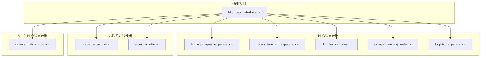
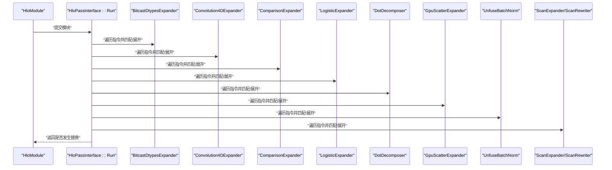
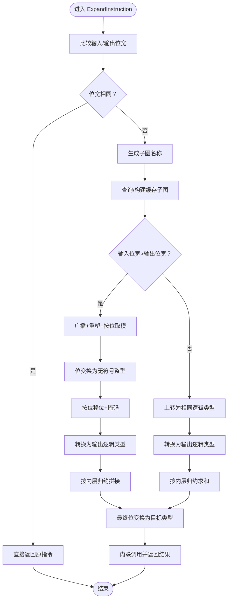
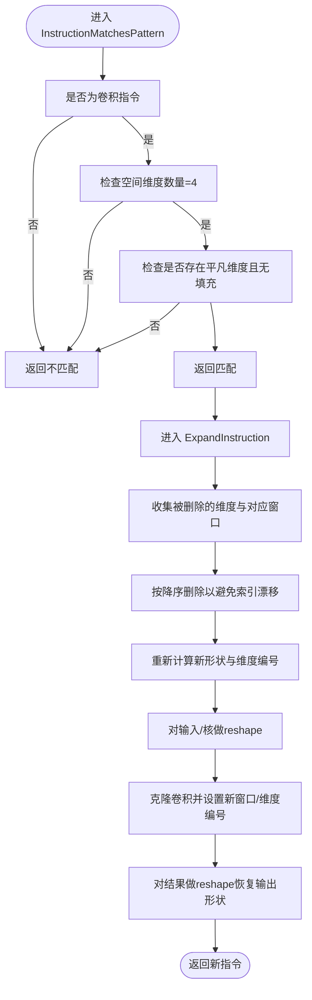
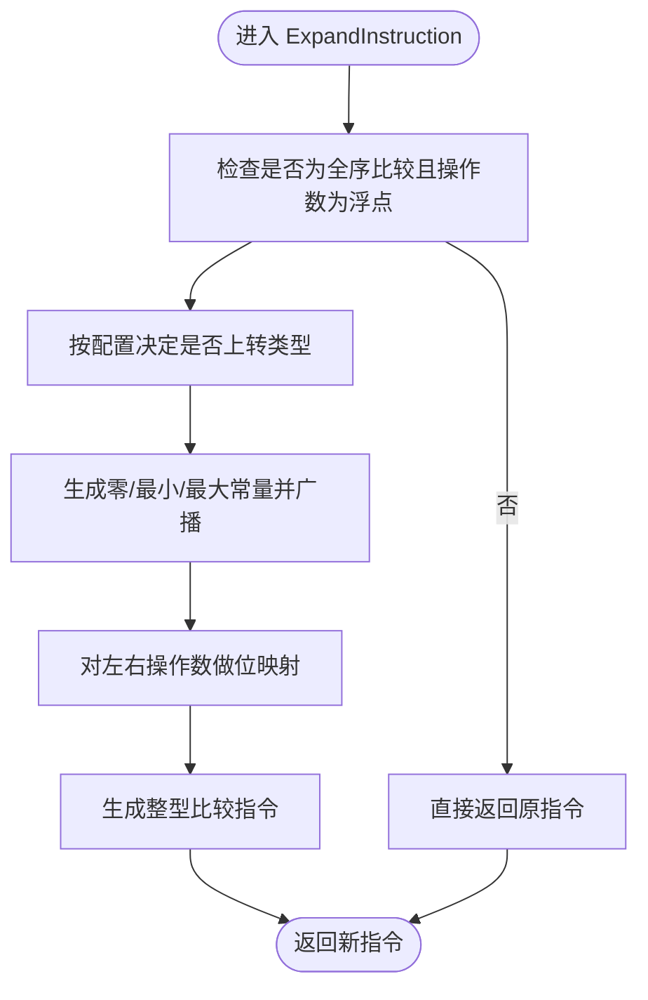
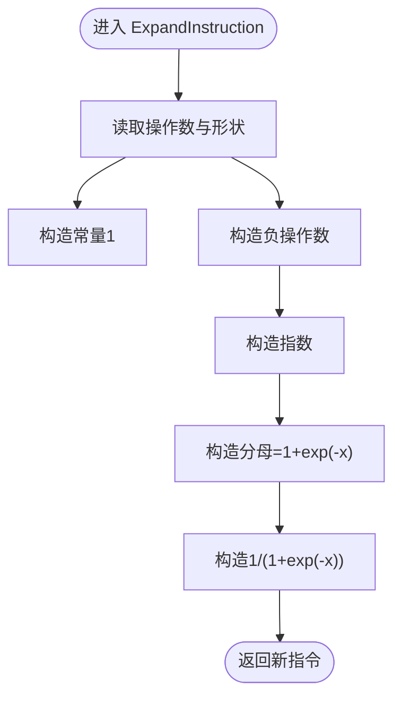
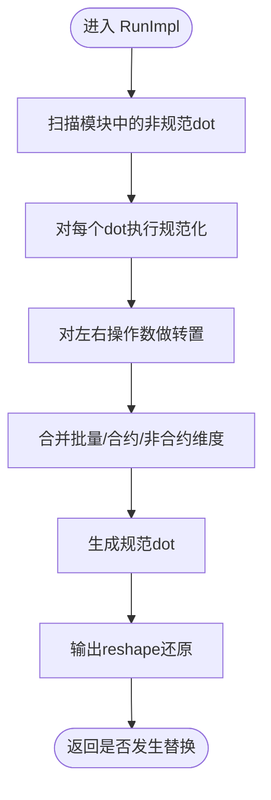
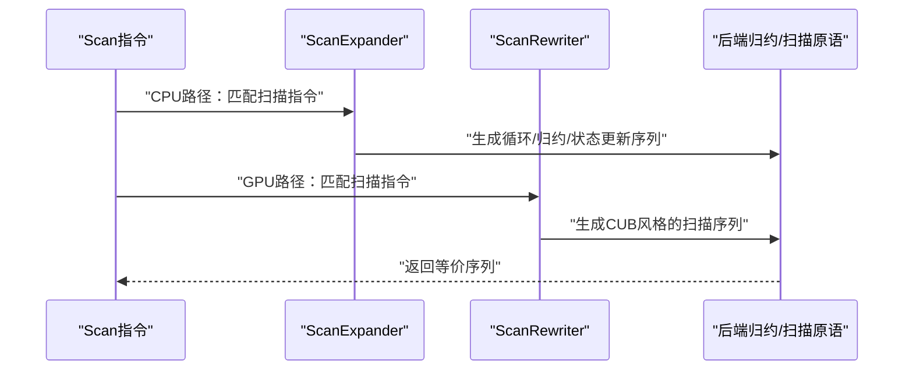
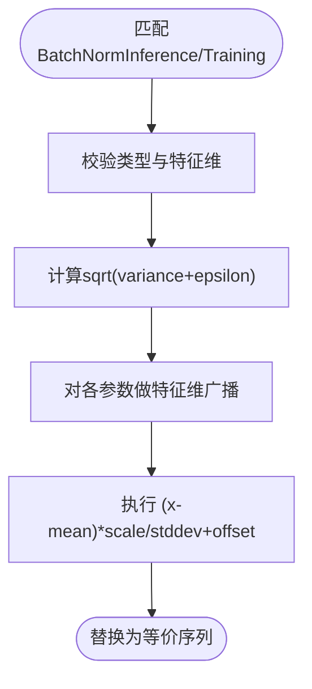
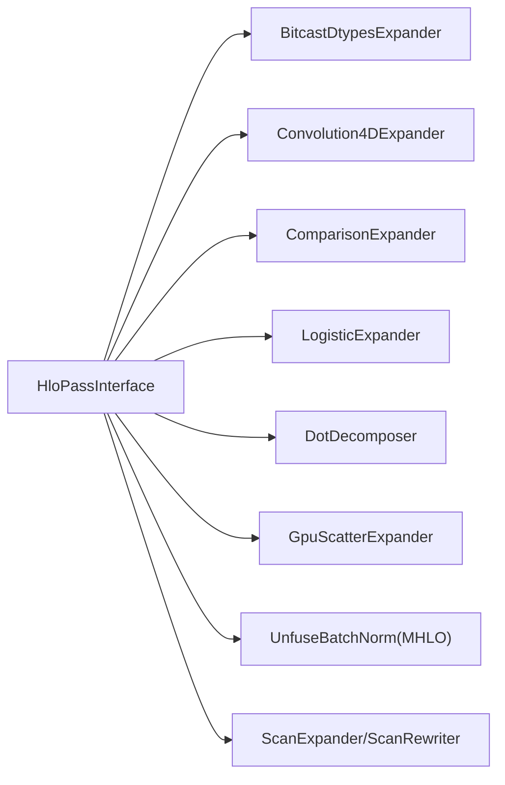

# HLO展开器

<cite>
**本文引用的文件**
- [bitcast_dtypes_expander.cc](file://xla/hlo/transforms/expanders/bitcast_dtypes_expander.cc)
- [convolution_4d_expander.cc](file://xla/hlo/transforms/expanders/convolution_4d_expander.cc)
- [scatter_expander.cc](file://xla/backends/gpu/transforms/scatter_expander.cc)
- [hlo_pass_interface.cc](file://xla/hlo/pass/hlo_pass_interface.cc)
- [dot_decomposer.cc](file://xla/hlo/transforms/expanders/dot_decomposer.cc)
- [comparison_expander.cc](file://xla/hlo/transforms/expanders/comparison_expander.cc)
- [logistic_expander.cc](file://xla/hlo/transforms/expanders/logistic_expander.cc)
- [unfuse_batch_norm.cc](file://xla/mlir_hlo/mhlo/transforms/unfuse_batch_norm/unfuse_batch_norm.cc)
- [scan_expander.cc](file://xla/service/scan_expander.cc)
- [scan_rewriter.cc](file://xla/backends/gpu/transforms/scan_rewriter.cc)
</cite>

## 目录
1. [引言](#引言)
2. [项目结构](#项目结构)
3. [核心组件](#核心组件)
4. [架构总览](#架构总览)
5. [详细组件分析](#详细组件分析)
6. [依赖分析](#依赖分析)
7. [性能考量](#性能考量)
8. [故障排查指南](#故障排查指南)
9. [结论](#结论)
10. [附录：扩展新展开器指南](#附录扩展新展开器指南)

## 引言
本文件系统性阐述XLA中的HLO展开器体系，聚焦其作用机制、展开策略、输入输出格式转换、中间表示生成、与底层硬件指令集的映射关系、性能优化与可扩展性。文档覆盖以下展开器类型：位变换类型转换展开、卷积展开、比较运算展开、逻辑斯蒂函数展开、批归一化展开（MHLO层解熔合）、扫描展开（CPU/GPU后端）。通过图示与路径引用帮助读者快速定位实现细节并进行二次开发。

## 项目结构
围绕HLO展开器的相关代码主要分布在如下位置：
- HLO层展开器：位于 xla/hlo/transforms/expanders 下，包含多种针对HLO指令的展开策略。
- 后端特定展开器：位于 xla/backends/*/transforms 下，如GPU后端的scatter与scan重写。
- MLIR-HLO层展开器：位于 xla/mlir_hlo/mhlo/transforms 下，如unfuse_batch_norm。
- 通用HLO Pass接口：位于 xla/hlo/pass 下，定义了展开器作为Pass的统一入口与执行框架。

**图表来源**
- [bitcast_dtypes_expander.cc](file://xla/hlo/transforms/expanders/bitcast_dtypes_expander.cc#L1-L144)
- [convolution_4d_expander.cc](file://xla/hlo/transforms/expanders/convolution_4d_expander.cc#L1-L180)
- [dot_decomposer.cc](file://xla/hlo/transforms/expanders/dot_decomposer.cc#L1-L283)
- [comparison_expander.cc](file://xla/hlo/transforms/expanders/comparison_expander.cc#L1-L163)
- [logistic_expander.cc](file://xla/hlo/transforms/expanders/logistic_expander.cc#L1-L49)
- [scatter_expander.cc](file://xla/backends/gpu/transforms/scatter_expander.cc#L1-L34)
- [scan_rewriter.cc](file://xla/backends/gpu/transforms/scan_rewriter.cc)
- [unfuse_batch_norm.cc](file://xla/mlir_hlo/mhlo/transforms/unfuse_batch_norm/unfuse_batch_norm.cc#L1-L382)
- [hlo_pass_interface.cc](file://xla/hlo/pass/hlo_pass_interface.cc#L1-L39)

**章节来源**
- [hlo_pass_interface.cc](file://xla/hlo/pass/hlo_pass_interface.cc#L26-L36)

## 核心组件
- 展开器接口与运行框架
  - 统一的HloPassInterface::Run负责接收HloModule，遍历计算图并调用具体展开器的RunImpl或ExpandInstruction。
  - 展开器以“匹配模式+展开实现”的方式工作：先判定是否命中目标指令，再生成等价的低级HLO序列。
- 典型展开器职责
  - 类型转换展开：将复杂位宽/类型转换分解为更基础的位操作与类型转换组合。
  - 卷积展开：将高维卷积中具有平凡维度的场景降维，减少核函数复杂度。
  - 比较展开：对浮点数的全序比较进行整型位序映射，保证语义正确性。
  - 逻辑斯蒂函数展开：用指数与加法/除法表达sigmoid，便于后端优化。
  - 扫描展开：将扫描算子转换为循环累加形式，便于后端调度与内存访问优化。
  - 批归一化展开（MHLO）：将融合的BN分解为标准算子序列，降低后端特殊支持成本。

**章节来源**
- [hlo_pass_interface.cc](file://xla/hlo/pass/hlo_pass_interface.cc#L26-L36)
- [bitcast_dtypes_expander.cc](file://xla/hlo/transforms/expanders/bitcast_dtypes_expander.cc#L45-L141)
- [convolution_4d_expander.cc](file://xla/hlo/transforms/expanders/convolution_4d_expander.cc#L32-L55)
- [comparison_expander.cc](file://xla/hlo/transforms/expanders/comparison_expander.cc#L81-L92)
- [logistic_expander.cc](file://xla/hlo/transforms/expanders/logistic_expander.cc#L29-L31)
- [unfuse_batch_norm.cc](file://xla/mlir_hlo/mhlo/transforms/unfuse_batch_norm/unfuse_batch_norm.cc#L106-L170)
- [scan_expander.cc](file://xla/service/scan_expander.cc)
- [scan_rewriter.cc](file://xla/backends/gpu/transforms/scan_rewriter.cc)

## 架构总览
下图展示了从模块入口到具体展开器执行的整体流程，以及不同展开器在模块中的协作关系。

**图表来源**
- [hlo_pass_interface.cc](file://xla/hlo/pass/hlo_pass_interface.cc#L26-L36)
- [bitcast_dtypes_expander.cc](file://xla/hlo/transforms/expanders/bitcast_dtypes_expander.cc#L45-L141)
- [convolution_4d_expander.cc](file://xla/hlo/transforms/expanders/convolution_4d_expander.cc#L57-L177)
- [comparison_expander.cc](file://xla/hlo/transforms/expanders/comparison_expander.cc#L94-L160)
- [logistic_expander.cc](file://xla/hlo/transforms/expanders/logistic_expander.cc#L33-L46)
- [dot_decomposer.cc](file://xla/hlo/transforms/expanders/dot_decomposer.cc#L252-L280)
- [scatter_expander.cc](file://xla/backends/gpu/transforms/scatter_expander.cc#L24-L31)
- [unfuse_batch_norm.cc](file://xla/mlir_hlo/mhlo/transforms/unfuse_batch_norm/unfuse_batch_norm.cc#L366-L378)
- [scan_expander.cc](file://xla/service/scan_expander.cc)
- [scan_rewriter.cc](file://xla/backends/gpu/transforms/scan_rewriter.cc)

## 详细组件分析

### 位变换类型转换展开（BitcastDtypesExpander）
- 作用机制
  - 当输入与输出元素类型的存储位宽不一致时，通过位级拆分/拼接与按位移位、掩码、归约等方式，将位模式解释为另一种类型。
  - 对于输入位宽大于输出的情况，采用广播+重塑+按内层索引取位的方式；对于输入位宽小于输出的情况，先转为相同逻辑类型，再左移与归约拼接。
- 输入输出格式
  - 输入：形状与元素类型不同的HLO指令（例如从大位宽到小位宽的位变换）。
  - 输出：由一系列基础指令组成的等价序列，最终类型转换为目标元素类型。
- 中间表示生成
  - 使用XlaBuilder构建内部子图，缓存计算图以避免重复构造；随后内联调用以消除额外调用开销。
- 性能要点
  - 通过内联减少函数调用与临时缓冲；在某些情况下，reshape/broadcast可能引入额外开销，需结合后端特性权衡。

**图表来源**
- [bitcast_dtypes_expander.cc](file://xla/hlo/transforms/expanders/bitcast_dtypes_expander.cc#L45-L133)

**章节来源**
- [bitcast_dtypes_expander.cc](file://xla/hlo/transforms/expanders/bitcast_dtypes_expander.cc#L45-L141)

### 卷积展开（Convolution4DExpander）
- 作用机制
  - 针对4D输入且存在至少一个空间维度大小为1且窗口无填充的卷积，将其视为“平凡维度”，删除这些维度并相应调整维度编号与窗口，随后通过reshape连接到标准卷积。
- 输入输出格式
  - 输入：4D卷积（含输入/核/输出的空间维度编号与窗口参数）。
  - 输出：等价的低维卷积，配合reshape恢复到原始输出形状。
- 中间表示生成
  - 构造新的维度编号、窗口与形状，使用reshape与clone后的卷积指令组合，最后在输出端做reshape。
- 性能要点
  - 删除平凡维度可显著降低核函数复杂度与访存压力；需注意维度重标号的稳定性与顺序删除策略。

**图表来源**
- [convolution_4d_expander.cc](file://xla/hlo/transforms/expanders/convolution_4d_expander.cc#L32-L177)

**章节来源**
- [convolution_4d_expander.cc](file://xla/hlo/transforms/expanders/convolution_4d_expander.cc#L32-L55)
- [convolution_4d_expander.cc](file://xla/hlo/transforms/expanders/convolution_4d_expander.cc#L57-L177)

### 比较展开（ComparisonExpander）
- 作用机制
  - 对浮点数的全序比较，通过将浮点位模式映射到有符号整型，使比较在整型序下保持与数学全序一致（处理±0与NaN边界）。
  - 支持按配置将某些类型先上转为更高精度整型，再进行位映射，以提升数值稳定性。
- 输入输出格式
  - 输入：带全序标记的比较指令，左右操作数为浮点类型。
  - 输出：等价的整型比较指令。
- 中间表示生成
  - 构造零、最小值、最大值常量并广播；根据是否含负零与NaN分支进行位翻转/选择；最终生成比较指令。
- 性能要点
  - 位映射避免了复杂的浮点比较分支，但会引入额外的位变换与广播；对F8E8M0FNU等特殊类型采用直接位变换。

**图表来源**
- [comparison_expander.cc](file://xla/hlo/transforms/expanders/comparison_expander.cc#L94-L160)

**章节来源**
- [comparison_expander.cc](file://xla/hlo/transforms/expanders/comparison_expander.cc#L81-L92)
- [comparison_expander.cc](file://xla/hlo/transforms/expanders/comparison_expander.cc#L94-L160)

### 逻辑斯蒂函数展开（LogisticExpander）
- 作用机制
  - 将logistic函数用指数、加法与除法组合实现，便于后端利用高效原生算子或近似实现。
- 输入输出格式
  - 输入：单操作数的logistic指令。
  - 输出：等价的exp/neg/add/div序列。
- 中间表示生成
  - 使用工具函数构造标量常量与二元运算，最终返回除法结果。
- 性能要点
  - 该展开通常有利于后端融合与向量化；若后端具备专用logistic原语，可关闭此展开以保留原语。

**图表来源**
- [logistic_expander.cc](file://xla/hlo/transforms/expanders/logistic_expander.cc#L33-L46)

**章节来源**
- [logistic_expander.cc](file://xla/hlo/transforms/expanders/logistic_expander.cc#L29-L31)
- [logistic_expander.cc](file://xla/hlo/transforms/expanders/logistic_expander.cc#L33-L46)

### 点积分解（DotDecomposer）
- 作用机制
  - 将非规范化的dot（多合约维、批量维非前缀、非最外侧非合约维等）规范化为标准三段式（批量维+非合约维+合约维），通过转置与reshape实现。
- 输入输出格式
  - 输入：任意dot指令（维度编号与形状可能非规范）。
  - 输出：等价的规范dot与reshape序列。
- 中间表示生成
  - 分别对左右操作数进行规范化排列与合并维度，生成规范dot，并在输出端做reshape还原。
- 性能要点
  - 规范化后更利于后端GEMM/收缩优化；但转置与reshape会带来额外内存与访存成本，需结合后端能力评估。

**图表来源**
- [dot_decomposer.cc](file://xla/hlo/transforms/expanders/dot_decomposer.cc#L252-L280)
- [dot_decomposer.cc](file://xla/hlo/transforms/expanders/dot_decomposer.cc#L150-L248)

**章节来源**
- [dot_decomposer.cc](file://xla/hlo/transforms/expanders/dot_decomposer.cc#L252-L280)

### 扫描展开（ScanExpander 与 ScanRewriter）
- 作用机制
  - CPU后端：将扫描算子展开为循环累加的形式，便于统一调度与内存管理。
  - GPU后端：提供扫描重写规则，将扫描转换为适合CUB等库的归约/扫描原语序列。
- 输入输出格式
  - 输入：扫描指令（含扫描维度、元素类型、状态维度等）。
  - 输出：等价的循环/归约/扫描序列。
- 中间表示生成
  - 依据扫描属性与后端能力，插入循环、归约、状态传递与输出拼接等基本HLO指令。
- 性能要点
  - 循环展开有利于流水线与寄存器利用；GPU端需考虑块内共享内存与跨块通信。

**图表来源**
- [scan_expander.cc](file://xla/service/scan_expander.cc)
- [scan_rewriter.cc](file://xla/backends/gpu/transforms/scan_rewriter.cc)

**章节来源**
- [scan_expander.cc](file://xla/service/scan_expander.cc)
- [scan_rewriter.cc](file://xla/backends/gpu/transforms/scan_rewriter.cc)

### 批归一化展开（MHLO UnfuseBatchNorm）
- 作用机制
  - 将融合的BatchNormInference/Training分解为标准算子序列：减均值、乘尺度、除标准差、加偏移；训练模式下还包含均值与方差的计算。
  - 支持静态/动态形状与特征维广播。
- 输入输出格式
  - 输入：mhlo::BatchNormInferenceOp/TrainingOp。
  - 输出：由add/mul/div/reshape/broadcast/reduce等构成的等价序列。
- 中间表示生成
  - 使用PatternRewriter构造算子序列，必要时插入动态shape与广播；训练模式返回三个结果（标准化张量、均值、方差）。
- 性能要点
  - 解熔合后便于后端通用算子优化；但会增加算子数量与内存带宽消耗，需结合具体后端评估。

**图表来源**
- [unfuse_batch_norm.cc](file://xla/mlir_hlo/mhlo/transforms/unfuse_batch_norm/unfuse_batch_norm.cc#L106-L170)
- [unfuse_batch_norm.cc](file://xla/mlir_hlo/mhlo/transforms/unfuse_batch_norm/unfuse_batch_norm.cc#L255-L362)

**章节来源**
- [unfuse_batch_norm.cc](file://xla/mlir_hlo/mhlo/transforms/unfuse_batch_norm/unfuse_batch_norm.cc#L106-L170)
- [unfuse_batch_norm.cc](file://xla/mlir_hlo/mhlo/transforms/unfuse_batch_norm/unfuse_batch_norm.cc#L255-L362)

### 散开展开（GpuScatterExpander）
- 作用机制
  - 针对GPU后端不支持的大元素类型或元组散射，判定并拦截此类散射指令，以便后续进一步展开或报错。
- 输入输出格式
  - 输入：散射指令（tuple或元素类型>64bit）。
  - 输出：由后端或上层Pass处理（通常为展开或错误）。
- 性能要点
  - 提前拦截可避免无效编译路径，确保后端兼容性。

**章节来源**
- [scatter_expander.cc](file://xla/backends/gpu/transforms/scatter_expander.cc#L24-L31)

## 依赖分析
- 组件耦合
  - 展开器均依赖HloPassInterface统一入口，遵循“匹配—展开—替换”的模式。
  - 位变换展开依赖builder与类型工具；卷积展开依赖形状工具与维度重标号；比较展开依赖位映射与常量生成；逻辑斯蒂展开依赖工具函数；点积分解依赖规范化工具；扫描展开依赖后端归约/扫描原语；批归一化展开依赖MLIR模式重写框架。
- 外部依赖
  - MLIR模式重写（mhlo）用于MHLO层的UnfuseBatchNorm。
  - 后端特定重写（如GPU Scan Rewriter）用于将扫描映射到CUB等库。

**图表来源**
- [hlo_pass_interface.cc](file://xla/hlo/pass/hlo_pass_interface.cc#L26-L36)
- [bitcast_dtypes_expander.cc](file://xla/hlo/transforms/expanders/bitcast_dtypes_expander.cc#L45-L141)
- [convolution_4d_expander.cc](file://xla/hlo/transforms/expanders/convolution_4d_expander.cc#L57-L177)
- [comparison_expander.cc](file://xla/hlo/transforms/expanders/comparison_expander.cc#L94-L160)
- [logistic_expander.cc](file://xla/hlo/transforms/expanders/logistic_expander.cc#L33-L46)
- [dot_decomposer.cc](file://xla/hlo/transforms/expanders/dot_decomposer.cc#L252-L280)
- [scatter_expander.cc](file://xla/backends/gpu/transforms/scatter_expander.cc#L24-L31)
- [unfuse_batch_norm.cc](file://xla/mlir_hlo/mhlo/transforms/unfuse_batch_norm/unfuse_batch_norm.cc#L366-L378)
- [scan_expander.cc](file://xla/service/scan_expander.cc)
- [scan_rewriter.cc](file://xla/backends/gpu/transforms/scan_rewriter.cc)

**章节来源**
- [hlo_pass_interface.cc](file://xla/hlo/pass/hlo_pass_interface.cc#L26-L36)

## 性能考量
- 通用原则
  - 减少不必要的reshape与broadcast，优先使用规范化输入（如DotDecomposer）以利于后端融合。
  - 在GPU端，扫描展开应尽量映射到CUB等高性能库，避免手工循环导致的访存与同步开销。
  - 批归一化解熔合后，可通过后端算子融合与内存重排进一步优化。
- 展开器特定
  - 位变换展开：内联可减少调用开销，但可能引入额外reshape；建议结合后端布局与内存带宽评估。
  - 卷积展开：删除平凡维度显著降低计算量；注意reshape与维度重标号的成本。
  - 比较展开：整型位映射避免分支，但引入位变换与广播；对F8E8M0FNU等类型可直接位变换。
  - 逻辑斯蒂展开：利于后端融合，若后端有专用原语可关闭以保留原语。
  - 扫描展开：CPU端循环展开利于流水线；GPU端应尽量映射到归约/扫描原语。

[本节为通用指导，无需列出章节来源]

## 故障排查指南
- 常见问题
  - 展开后性能下降：检查是否引入过多reshape/broadcast，或是否未内联子图。
  - GPU不支持的散射：确认GpuScatterExpander是否拦截并触发后续展开或错误。
  - 扫描无法映射：检查后端是否提供CUB扫描支持，或是否需要CPU路径展开。
  - 批归一化异常：确认UnfuseBatchNorm是否正确处理动态形状与特征维。
- 定位手段
  - 使用HLO转储与可视化工具观察展开前后指令序列变化。
  - 结合后端日志与指标（访存、吞吐、延迟）定位瓶颈。

**章节来源**
- [scatter_expander.cc](file://xla/backends/gpu/transforms/scatter_expander.cc#L24-L31)
- [unfuse_batch_norm.cc](file://xla/mlir_hlo/mhlo/transforms/unfuse_batch_norm/unfuse_batch_norm.cc#L106-L170)

## 结论
HLO展开器通过“匹配—展开—替换”机制，将高层语义指令转换为后端友好的低级序列，兼顾通用性与可扩展性。不同类型展开器针对特定算子与后端约束设计，既保证正确性，又为性能优化预留空间。结合规范化输入、后端原语映射与合理的内存布局，可获得稳定而高效的执行效果。

[本节为总结性内容，无需列出章节来源]

## 附录：扩展新展开器指南
- 设计步骤
  - 明确目标指令与展开策略：确定匹配条件与等价序列。
  - 实现匹配函数：返回是否命中目标指令。
  - 实现展开函数：生成等价HLO序列，必要时使用builder或工具函数。
  - 注册到Pass：通过HloPassInterface::Run参与模块遍历。
- 集成要点
  - 保持输入/输出形状一致性与类型兼容。
  - 尽量复用现有builder与工具函数，减少重复代码。
  - 考虑后端映射：优先映射到后端原语或常见算子组合。
  - 添加测试：覆盖典型形状、边界条件与后端差异。
- 参考实现路径
  - 匹配与展开模板：参考 [bitcast_dtypes_expander.cc](file://xla/hlo/transforms/expanders/bitcast_dtypes_expander.cc#L45-L141)、[comparison_expander.cc](file://xla/hlo/transforms/expanders/comparison_expander.cc#L94-L160)、[logistic_expander.cc](file://xla/hlo/transforms/expanders/logistic_expander.cc#L33-L46)。
  - 形状与维度工具：参考 [convolution_4d_expander.cc](file://xla/hlo/transforms/expanders/convolution_4d_expander.cc#L57-L177)、[dot_decomposer.cc](file://xla/hlo/transforms/expanders/dot_decomposer.cc#L150-L248)。
  - MHLO模式重写：参考 [unfuse_batch_norm.cc](file://xla/mlir_hlo/mhlo/transforms/unfuse_batch_norm/unfuse_batch_norm.cc#L366-L378)。
  - 后端重写：参考 [scan_rewriter.cc](file://xla/backends/gpu/transforms/scan_rewriter.cc)。

**章节来源**
- [bitcast_dtypes_expander.cc](file://xla/hlo/transforms/expanders/bitcast_dtypes_expander.cc#L45-L141)
- [comparison_expander.cc](file://xla/hlo/transforms/expanders/comparison_expander.cc#L94-L160)
- [logistic_expander.cc](file://xla/hlo/transforms/expanders/logistic_expander.cc#L33-L46)
- [convolution_4d_expander.cc](file://xla/hlo/transforms/expanders/convolution_4d_expander.cc#L57-L177)
- [dot_decomposer.cc](file://xla/hlo/transforms/expanders/dot_decomposer.cc#L150-L248)
- [unfuse_batch_norm.cc](file://xla/mlir_hlo/mhlo/transforms/unfuse_batch_norm/unfuse_batch_norm.cc#L366-L378)
- [scan_rewriter.cc](file://xla/backends/gpu/transforms/scan_rewriter.cc)