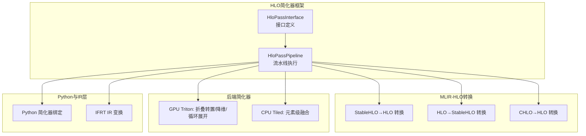
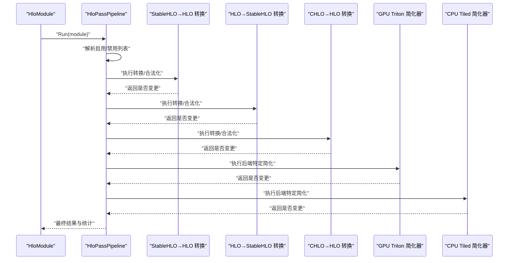
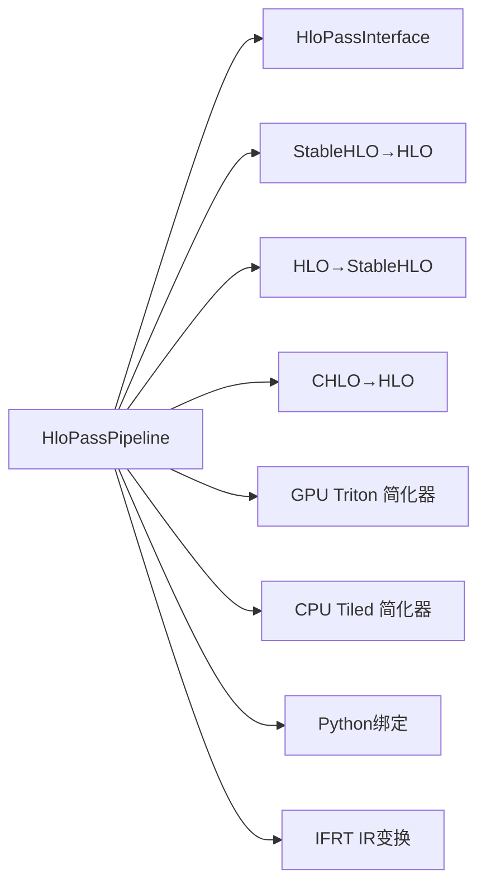

# HLO简化器

<cite>
**本文引用的文件**
- [xla/hlo/pass/hlo_pass_interface.cc](file://xla/hlo/pass/hlo_pass_interface.cc)
- [xla/hlo/pass/hlo_pass_pipeline.cc](file://xla/hlo/pass/hlo_pass_pipeline.cc)
- [xla/hlo/pass/hlo_pass_pipeline_test.cc](file://xla/hlo/pass/hlo_pass_pipeline_test.cc)
- [xla/mlir_hlo/mhlo/transforms/stablehlo_legalize_to_hlo/stablehlo_legalize_to_hlo_pass.cc](file://xla/mlir_hlo/mhlo/transforms/stablehlo_legalize_to_hlo/stablehlo_legalize_to_hlo_pass.cc)
- [xla/mlir_hlo/mhlo/transforms/hlo_legalize_to_stablehlo/hlo_legalize_to_stablehlo_pass.cc](file://xla/mlir_hlo/mhlo/transforms/hlo_legalize_to_stablehlo/hlo_legalize_to_stablehlo_pass.cc)
- [xla/mlir_hlo/mhlo/transforms/chlo_legalize_to_hlo/chlo_legalize_to_hlo_pass.cc](file://xla/mlir_hlo/mhlo/transforms/chlo_legalize_to_hlo/chlo_legalize_to_hlo_pass.cc)
- [xla/backends/gpu/codegen/triton/transforms/triton_xla_fold_transpose_pass.cc](file://xla/backends/gpu/codegen/triton/transforms/triton_xla_fold_transpose_pass.cc)
- [xla/backends/gpu/codegen/triton/transforms/triton_xla_squeeze_dims_pass.cc](file://xla/backends/gpu/codegen/triton/transforms/triton_xla_squeeze_dims_pass.cc)
- [xla/backends/gpu/codegen/triton/transforms/triton_xla_unswitch_loops_pass.cc](file://xla/backends/gpu/codegen/triton/transforms/triton_xla_unswitch_loops_pass.cc)
- [xla/backends/gpu/codegen/triton/transforms/triton_xla_lower_xtile_pass.cc](file://xla/backends/gpu/codegen/triton/transforms/triton_xla_lower_xtile_pass.cc)
- [xla/backends/cpu/codegen/tiled/transforms/fuse_elementwise_pass.cc](file://xla/backends/cpu/codegen/tiled/transforms/fuse_elementwise_pass.cc)
- [xla/python/hlo_pass.cc](file://xla/python/hlo_pass.cc)
- [xla/python/ifrt/ir/transforms/ifrt_atom_programs_from_vhlo_pass.cc](file://xla/python/ifrt/ir/transforms/ifrt_atom_programs_from_vhlo_pass.cc)
- [xla/python/ifrt/ir/transforms/ifrt_atom_programs_to_vhlo_pass.cc](file://xla/python/ifrt/ir/transforms/ifrt_atom_programs_to_vhlo_pass.cc)
- [xla/hlo/transforms/README.md](file://xla/hlo/transforms/README.md)
- [xla/hlo/transforms/README.md](file://xla/hlo/transforms/README.md)
</cite>

## 目录
1. [引言](#引言)
2. [项目结构](#项目结构)
3. [核心组件](#核心组件)
4. [架构总览](#架构总览)
5. [详细组件分析](#详细组件分析)
6. [依赖关系分析](#依赖关系分析)
7. [性能考量](#性能考量)
8. [故障排查指南](#故障排查指南)
9. [结论](#结论)
10. [附录](#附录)

## 引言
本文件系统性梳理XLA中的HLO（High-Level Optimizer）简化器体系，聚焦于条件简化、复制移除、转置折叠、指令融合等核心优化技术。文档从接口与流水线框架入手，逐步深入到具体简化器的实现原理、应用场景、触发条件与效果评估，并给出简化器间的交互与组合策略、性能影响分析、优化建议，以及新简化器的开发与测试验证方法。

## 项目结构
围绕HLO简化器的关键位置包括：
- HLO简化器接口与流水线：位于 xla/hlo/pass，提供统一的简化器接口与执行流水线。
- MLIR-HLO转换与合法化：位于 xla/mlir_hlo/mhlo/transforms，负责稳定HLO与HLO之间的互转与合法化，为后续优化奠定基础。
- 后端特定简化器：位于后端代码生成路径中，如GPU Triton变换与CPU tiled变换，涵盖转置折叠、维度压缩、循环展开等。
- Python绑定与IR变换：位于 xla/python 与 xla/python/ifrt/ir/transforms，提供简化器的Python入口与IR层变换。

图表来源
- [xla/hlo/pass/hlo_pass_interface.cc](file://xla/hlo/pass/hlo_pass_interface.cc#L26-L36)
- [xla/hlo/pass/hlo_pass_pipeline.cc](file://xla/hlo/pass/hlo_pass_pipeline.cc#L291-L318)
- [xla/mlir_hlo/mhlo/transforms/stablehlo_legalize_to_hlo/stablehlo_legalize_to_hlo_pass.cc](file://xla/mlir_hlo/mhlo/transforms/stablehlo_legalize_to_hlo/stablehlo_legalize_to_hlo_pass.cc)
- [xla/mlir_hlo/mhlo/transforms/hlo_legalize_to_stablehlo/hlo_legalize_to_stablehlo_pass.cc](file://xla/mlir_hlo/mhlo/transforms/hlo_legalize_to_stablehlo/hlo_legalize_to_stablehlo_pass.cc)
- [xla/mlir_hlo/mhlo/transforms/chlo_legalize_to_hlo/chlo_legalize_to_hlo_pass.cc](file://xla/mlir_hlo/mhlo/transforms/chlo_legalize_to_hlo/chlo_legalize_to_hlo_pass.cc)
- [xla/backends/gpu/codegen/triton/transforms/triton_xla_fold_transpose_pass.cc](file://xla/backends/gpu/codegen/triton/transforms/triton_xla_fold_transpose_pass.cc)
- [xla/backends/gpu/codegen/triton/transforms/triton_xla_squeeze_dims_pass.cc](file://xla/backends/gpu/codegen/triton/transforms/triton_xla_squeeze_dims_pass.cc)
- [xla/backends/gpu/codegen/triton/transforms/triton_xla_unswitch_loops_pass.cc](file://xla/backends/gpu/codegen/triton/transforms/triton_xla_unswitch_loops_pass.cc)
- [xla/backends/cpu/codegen/tiled/transforms/fuse_elementwise_pass.cc](file://xla/backends/cpu/codegen/tiled/transforms/fuse_elementwise_pass.cc)
- [xla/python/hlo_pass.cc](file://xla/python/hlo_pass.cc)
- [xla/python/ifrt/ir/transforms/ifrt_atom_programs_from_vhlo_pass.cc](file://xla/python/ifrt/ir/transforms/ifrt_atom_programs_from_vhlo_pass.cc)
- [xla/python/ifrt/ir/transforms/ifrt_atom_programs_to_vhlo_pass.cc](file://xla/python/ifrt/ir/transforms/ifrt_atom_programs_to_vhlo_pass.cc)

章节来源
- [xla/hlo/pass/hlo_pass_interface.cc](file://xla/hlo/pass/hlo_pass_interface.cc#L26-L36)
- [xla/hlo/pass/hlo_pass_pipeline.cc](file://xla/hlo/pass/hlo_pass_pipeline.cc#L291-L318)

## 核心组件
- HloPassInterface：定义简化器的统一接口，支持对HloModule或其独占指针进行Run调用，并返回是否发生变更。
- HloPassPipeline：负责按顺序执行一组简化器，支持启用/禁用列表、调试选项、中间状态转储、不变式检查与统计收集。

这些组件共同构成HLO简化器的“骨架”，确保简化器以一致的方式被注册、调度与验证。

章节来源
- [xla/hlo/pass/hlo_pass_interface.cc](file://xla/hlo/pass/hlo_pass_interface.cc#L26-L36)
- [xla/hlo/pass/hlo_pass_pipeline.cc](file://xla/hlo/pass/hlo_pass_pipeline.cc#L134-L220)
- [xla/hlo/pass/hlo_pass_pipeline.cc](file://xla/hlo/pass/hlo_pass_pipeline.cc#L222-L276)

## 架构总览
下图展示了从模块进入简化器流水线，到MLIR-HLO转换与后端特定简化的整体流程。

图表来源
- [xla/hlo/pass/hlo_pass_pipeline.cc](file://xla/hlo/pass/hlo_pass_pipeline.cc#L134-L220)
- [xla/mlir_hlo/mhlo/transforms/stablehlo_legalize_to_hlo/stablehlo_legalize_to_hlo_pass.cc](file://xla/mlir_hlo/mhlo/transforms/stablehlo_legalize_to_hlo/stablehlo_legalize_to_hlo_pass.cc)
- [xla/mlir_hlo/mhlo/transforms/hlo_legalize_to_stablehlo/hlo_legalize_to_stablehlo_pass.cc](file://xla/mlir_hlo/mhlo/transforms/hlo_legalize_to_stablehlo/hlo_legalize_to_stablehlo_pass.cc)
- [xla/mlir_hlo/mhlo/transforms/chlo_legalize_to_hlo/chlo_legalize_to_hlo_pass.cc](file://xla/mlir_hlo/mhlo/transforms/chlo_legalize_to_hlo/chlo_legalize_to_hlo_pass.cc)
- [xla/backends/gpu/codegen/triton/transforms/triton_xla_fold_transpose_pass.cc](file://xla/backends/gpu/codegen/triton/transforms/triton_xla_fold_transpose_pass.cc)
- [xla/backends/cpu/codegen/tiled/transforms/fuse_elementwise_pass.cc](file://xla/backends/cpu/codegen/tiled/transforms/fuse_elementwise_pass.cc)

## 详细组件分析

### 条件简化（Conditional Simplification）
- 设计原理
  - 将条件分支（Conditional）在编译期展开或合并，消除冗余分支判断，减少运行时开销。
  - 常见策略：常量条件折叠、分支合并、公共子表达式提取。
- 实现要点
  - 在HLO IR层面识别条件节点与其分支，基于常量传播与分支可达性分析决定是否可展开或合并。
  - 需要保持语义等价性，避免破坏控制流与数据依赖。
- 应用场景
  - 动态形状或参数驱动的分支逻辑；训练/推理阶段差异导致的条件分支。
- 触发条件
  - 条件节点的谓词为常量；或分支间存在高度相似的计算图。
- 效果评估
  - 减少分支判断与跳转；可能增加代码体积；需权衡。
- 代码示例路径
  - 条件节点处理与展开逻辑通常在HLO变换层实现，可参考条件/分支相关变换文件。

[本节为概念性说明，不直接分析具体文件，故无章节来源]

### 复制移除（Redundant Copy Removal）
- 设计原理
  - 检测并移除不必要的内存复制，避免重复数据搬运。
  - 利用别名分析与缓冲区生命周期管理，确保移除后仍满足数据一致性。
- 实现要点
  - 识别连续写入/读取的缓冲区；检测写后读（WAW/WAR）与写后写（RAW）依赖。
  - 在保证正确性的前提下，合并或删除中间拷贝。
- 应用场景
  - 中间结果未被外部引用；跨算子边界的数据传递可内联。
- 触发条件
  - 缓冲区仅在局部作用域使用；无外部别名。
- 效果评估
  - 显著降低带宽占用与延迟；可能增加寄存器压力。
- 代码示例路径
  - 可参考HLO分析与别名分析相关模块，定位复制检测与移除逻辑。

[本节为概念性说明，不直接分析具体文件，故无章节来源]

### 转置折叠（Transpose Folding）
- 设计原理
  - 将相邻的转置与算子进行重排或融合，避免显式转置操作，减少额外内存访问。
  - 通过布局变换与算子融合，使数据访问更贴近内存局部性。
- 实现要点
  - 识别形如“Transpose + Op”或“Op + Transpose”的模式，尝试将转置内联到算子内部或重排执行顺序。
  - 需要确保算子支持非标准布局或进行布局转换。
- 应用场景
  - 卷积、矩阵乘法、归约等对内存访问敏感的算子。
- 触发条件
  - 转置与后续算子可融合；算子支持灵活布局。
- 效果评估
  - 显著提升缓存命中率；可能增加算子复杂度。
- 代码示例路径
  - GPU Triton后端的转置折叠简化器文件路径如下：
    - [xla/backends/gpu/codegen/triton/transforms/triton_xla_fold_transpose_pass.cc](file://xla/backends/gpu/codegen/triton/transforms/triton_xla_fold_transpose_pass.cc)

章节来源
- [xla/backends/gpu/codegen/triton/transforms/triton_xla_fold_transpose_pass.cc](file://xla/backends/gpu/codegen/triton/transforms/triton_xla_fold_transpose_pass.cc)

### 指令融合（Instruction Fusion）
- 设计原理
  - 将多个小指令融合为单个高效指令，减少指令条数与内存往返。
  - 常见类型：元素级融合、卷积融合、归约融合。
- 实现要点
  - 识别可融合的指令序列，建立依赖图，选择合适的融合点。
  - 融合后需重新布局与调度，确保性能收益大于实现成本。
- 应用场景
  - 批量小算子（如激活函数、偏置加法）与卷积/矩阵乘法。
- 触发条件
  - 指令间存在强依赖且无副作用冲突；目标后端支持融合后的算子。
- 效果评估
  - 提升吞吐量与能效；可能增加热点区域的计算密度。
- 代码示例路径
  - CPU Tiled后端的元素级融合简化器文件路径如下：
    - [xla/backends/cpu/codegen/tiled/transforms/fuse_elementwise_pass.cc](file://xla/backends/cpu/codegen/tiled/transforms/fuse_elementwise_pass.cc)

章节来源
- [xla/backends/cpu/codegen/tiled/transforms/fuse_elementwise_pass.cc](file://xla/backends/cpu/codegen/tiled/transforms/fuse_elementwise_pass.cc)

### 维度压缩与循环展开（Squeeze Dimensions & Loop Unswitching）
- 设计原理
  - 维度压缩：去除大小为1的维度，减少访存与算子开销。
  - 循环展开：将循环体展开以提高指令级并行与减少分支开销。
- 实现要点
  - 维度压缩需保持形状兼容与布局一致性。
  - 循环展开需考虑寄存器与缓存压力，避免过度展开。
- 应用场景
  - 批处理/通道维度为1的张量；固定迭代次数的循环。
- 触发条件
  - 维度大小恒为1；循环迭代次数可预测。
- 效果评估
  - 降低访存与控制开销；可能增大寄存器需求。
- 代码示例路径
  - GPU Triton后端的维度压缩与循环展开简化器文件路径如下：
    - [xla/backends/gpu/codegen/triton/transforms/triton_xla_squeeze_dims_pass.cc](file://xla/backends/gpu/codegen/triton/transforms/triton_xla_squeeze_dims_pass.cc)
    - [xla/backends/gpu/codegen/triton/transforms/triton_xla_unswitch_loops_pass.cc](file://xla/backends/gpu/codegen/triton/transforms/triton_xla_unswitch_loops_pass.cc)

章节来源
- [xla/backends/gpu/codegen/triton/transforms/triton_xla_squeeze_dims_pass.cc](file://xla/backends/gpu/codegen/triton/transforms/triton_xla_squeeze_dims_pass.cc)
- [xla/backends/gpu/codegen/triton/transforms/triton_xla_unswitch_loops_pass.cc](file://xla/backends/gpu/codegen/triton/transforms/triton_xla_unswitch_loops_pass.cc)

### MLIR-HLO转换与合法化（StableHLO/HLO/CHLO）
- 设计原理
  - 将稳定HLO（StableHLO）转换为HLO，或将HLO转换为稳定HLO，以便在不同工具链间互通。
  - CHLO（Chlo）为HLO扩展，提供复数运算等能力，转换后可进一步优化。
- 实现要点
  - 保持语义等价；处理形状、布局与数据类型映射。
- 应用场景
  - 导出/导入模型；跨框架互操作。
- 触发条件
  - 输入为对应格式的HLO/MLIR模块。
- 效果评估
  - 提升互操作性；可能引入额外转换成本。
- 代码示例路径
  - StableHLO→HLO 转换：[xla/mlir_hlo/mhlo/transforms/stablehlo_legalize_to_hlo/stablehlo_legalize_to_hlo_pass.cc](file://xla/mlir_hlo/mhlo/transforms/stablehlo_legalize_to_hlo/stablehlo_legalize_to_hlo_pass.cc)
  - HLO→StableHLO 转换：[xla/mlir_hlo/mhlo/transforms/hlo_legalize_to_stablehlo/hlo_legalize_to_stablehlo_pass.cc](file://xla/mlir_hlo/mhlo/transforms/hlo_legalize_to_stablehlo/hlo_legalize_to_stablehlo_pass.cc)
  - CHLO→HLO 转换：[xla/mlir_hlo/mhlo/transforms/chlo_legalize_to_hlo/chlo_legalize_to_hlo_pass.cc](file://xla/mlir_hlo/mhlo/transforms/chlo_legalize_to_hlo/chlo_legalize_to_hlo_pass.cc)

章节来源
- [xla/mlir_hlo/mhlo/transforms/stablehlo_legalize_to_hlo/stablehlo_legalize_to_hlo_pass.cc](file://xla/mlir_hlo/mhlo/transforms/stablehlo_legalize_to_hlo/stablehlo_legalize_to_hlo_pass.cc)
- [xla/mlir_hlo/mhlo/transforms/hlo_legalize_to_stablehlo/hlo_legalize_to_stablehlo_pass.cc](file://xla/mlir_hlo/mhlo/transforms/hlo_legalize_to_stablehlo/hlo_legalize_to_stablehlo_pass.cc)
- [xla/mlir_hlo/mhlo/transforms/chlo_legalize_to_hlo/chlo_legalize_to_hlo_pass.cc](file://xla/mlir_hlo/mhlo/transforms/chlo_legalize_to_hlo/chlo_legalize_to_hlo_pass.cc)

### Python绑定与IR层变换
- 设计原理
  - 提供Python侧简化器入口，便于快速原型与集成。
  - IFRT IR变换用于将虚拟HLO（VHLO）程序拆分为原子程序或回退为VHLO，便于后端执行。
- 实现要点
  - 通过Python绑定桥接C++简化器；IR变换需保持程序语义。
- 应用场景
  - 快速实验与脚本化优化；多设备/多进程场景。
- 触发条件
  - 模块配置允许Python简化器；IR变换符合当前执行计划。
- 效果评估
  - 提升易用性；可能引入额外的桥接开销。
- 代码示例路径
  - Python简化器绑定：[xla/python/hlo_pass.cc](file://xla/python/hlo_pass.cc)
  - IFRT原子程序变换（从VHLO）：[xla/python/ifrt/ir/transforms/ifrt_atom_programs_from_vhlo_pass.cc](file://xla/python/ifrt/ir/transforms/ifrt_atom_programs_from_vhlo_pass.cc)
  - IFRT原子程序变换（到VHLO）：[xla/python/ifrt/ir/transforms/ifrt_atom_programs_to_vhlo_pass.cc](file://xla/python/ifrt/ir/transforms/ifrt_atom_programs_to_vhlo_pass.cc)

章节来源
- [xla/python/hlo_pass.cc](file://xla/python/hlo_pass.cc)
- [xla/python/ifrt/ir/transforms/ifrt_atom_programs_from_vhlo_pass.cc](file://xla/python/ifrt/ir/transforms/ifrt_atom_programs_from_vhlo_pass.cc)
- [xla/python/ifrt/ir/transforms/ifrt_atom_programs_to_vhlo_pass.cc](file://xla/python/ifrt/ir/transforms/ifrt_atom_programs_to_vhlo_pass.cc)

## 依赖关系分析
简化器之间存在以下依赖与耦合：
- 流水线依赖：HloPassPipeline统一调度所有简化器，简化器需遵循接口约定。
- 转换前置：MLIR-HLO转换通常在通用简化器之前执行，确保HLO IR处于可优化形态。
- 后端特定：GPU/Triton与CPU/Tiled的简化器针对硬件特性定制，彼此独立但可组合。
- 不变式检查：流水线在每次变化后运行不变式检查，确保简化器不破坏图结构。

图表来源
- [xla/hlo/pass/hlo_pass_pipeline.cc](file://xla/hlo/pass/hlo_pass_pipeline.cc#L134-L220)
- [xla/hlo/pass/hlo_pass_interface.cc](file://xla/hlo/pass/hlo_pass_interface.cc#L26-L36)
- [xla/mlir_hlo/mhlo/transforms/stablehlo_legalize_to_hlo/stablehlo_legalize_to_hlo_pass.cc](file://xla/mlir_hlo/mhlo/transforms/stablehlo_legalize_to_hlo/stablehlo_legalize_to_hlo_pass.cc)
- [xla/mlir_hlo/mhlo/transforms/hlo_legalize_to_stablehlo/hlo_legalize_to_stablehlo_pass.cc](file://xla/mlir_hlo/mhlo/transforms/hlo_legalize_to_stablehlo/hlo_legalize_to_stablehlo_pass.cc)
- [xla/mlir_hlo/mhlo/transforms/chlo_legalize_to_hlo/chlo_legalize_to_hlo_pass.cc](file://xla/mlir_hlo/mhlo/transforms/chlo_legalize_to_hlo/chlo_legalize_to_hlo_pass.cc)
- [xla/backends/gpu/codegen/triton/transforms/triton_xla_fold_transpose_pass.cc](file://xla/backends/gpu/codegen/triton/transforms/triton_xla_fold_transpose_pass.cc)
- [xla/backends/cpu/codegen/tiled/transforms/fuse_elementwise_pass.cc](file://xla/backends/cpu/codegen/tiled/transforms/fuse_elementwise_pass.cc)
- [xla/python/hlo_pass.cc](file://xla/python/hlo_pass.cc)
- [xla/python/ifrt/ir/transforms/ifrt_atom_programs_from_vhlo_pass.cc](file://xla/python/ifrt/ir/transforms/ifrt_atom_programs_from_vhlo_pass.cc)
- [xla/python/ifrt/ir/transforms/ifrt_atom_programs_to_vhlo_pass.cc](file://xla/python/ifrt/ir/transforms/ifrt_atom_programs_to_vhlo_pass.cc)

## 性能考量
- 时间复杂度
  - 简化器通常为线性或接近线性的图遍历，复杂度与指令数量成正比。
  - 融合类简化器可能引入指数级搜索空间，需剪枝与启发式策略。
- 空间复杂度
  - 复制移除与转置折叠主要降低内存占用；融合可能增加中间结果。
- 并发与流水线
  - 流水线按序执行，但可在不同简化器间并行执行（取决于后端与硬件）。
- 调试与验证
  - 使用哈希校验与不变式检查，确保简化器不引入错误。
  - 支持按正则表达式转储中间HLO，便于定位问题。

[本节为一般性指导，不直接分析具体文件，故无章节来源]

## 故障排查指南
- 简化器未生效
  - 检查是否被禁用或仅启用列表排除；确认名称匹配。
  - 查看流水线日志与转储文件，确认执行顺序与是否报告变更。
- 语义错误
  - 运行不变式检查，定位破坏图结构的简化器。
  - 对照前后HLO文本，核对形状、布局与数据类型。
- 性能回退
  - 关注是否过度融合或展开导致寄存器/缓存压力过大。
  - 调整简化器顺序或关闭部分简化器进行A/B对比。

章节来源
- [xla/hlo/pass/hlo_pass_pipeline.cc](file://xla/hlo/pass/hlo_pass_pipeline.cc#L101-L130)
- [xla/hlo/pass/hlo_pass_pipeline.cc](file://xla/hlo/pass/hlo_pass_pipeline.cc#L134-L220)

## 结论
HLO简化器通过统一接口与流水线框架，结合MLIR-HLO转换与后端特定优化，形成从IR到硬件特化的完整优化链。条件简化、复制移除、转置折叠与指令融合等技术在不同层级协同工作，显著提升性能与能效。合理设计简化器顺序、严格验证与监控，是获得稳定收益的关键。

[本节为总结性内容，不直接分析具体文件，故无章节来源]

## 附录

### 开发新简化器的步骤
- 定义接口与实现
  - 继承HloPassInterface，实现Run方法与名称标识。
- 注册到流水线
  - 将简化器加入HloPassPipeline，设置启用/禁用列表与执行顺序。
- 编写测试
  - 使用单元测试与Golden文件对比，验证前后HLO一致性与性能指标。
- 性能评估
  - 对比基准模型，关注吞吐量、延迟与内存占用的变化。

章节来源
- [xla/hlo/pass/hlo_pass_interface.cc](file://xla/hlo/pass/hlo_pass_interface.cc#L26-L36)
- [xla/hlo/pass/hlo_pass_pipeline.cc](file://xla/hlo/pass/hlo_pass_pipeline.cc#L222-L276)
- [xla/hlo/pass/hlo_pass_pipeline_test.cc](file://xla/hlo/pass/hlo_pass_pipeline_test.cc)