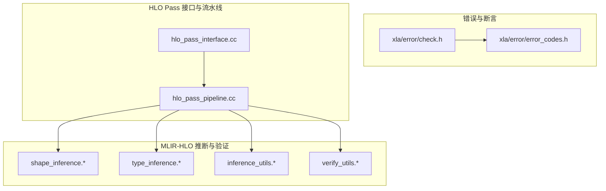
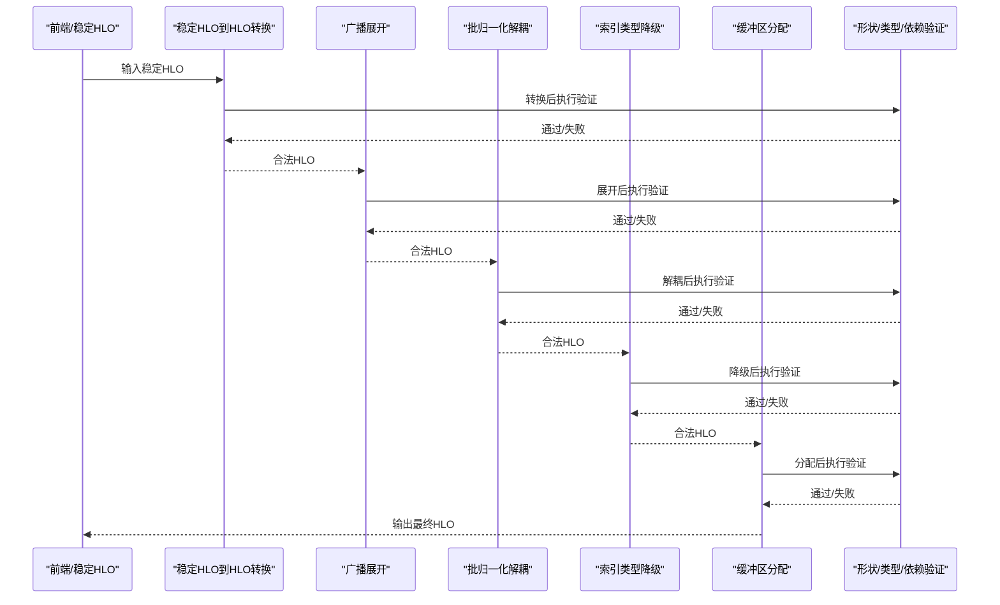
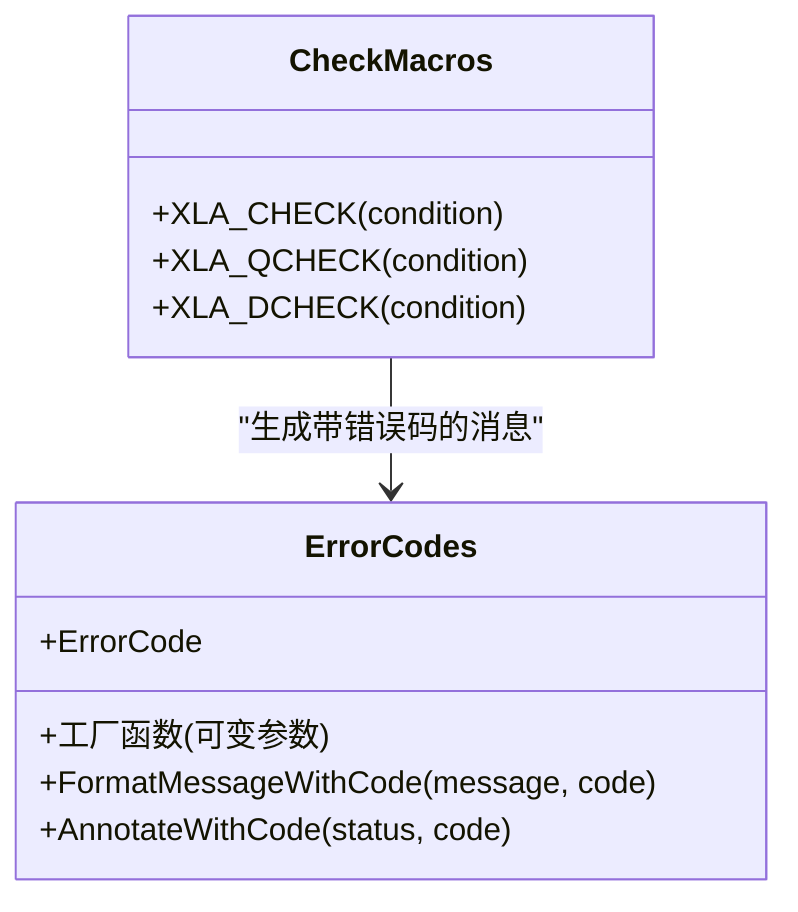
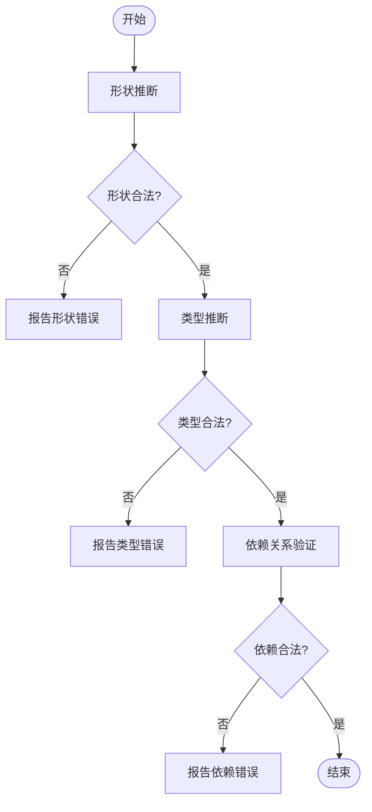
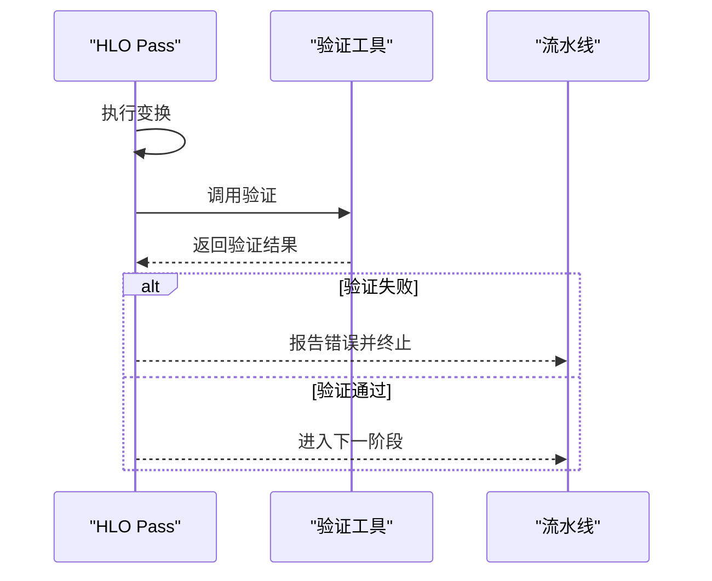
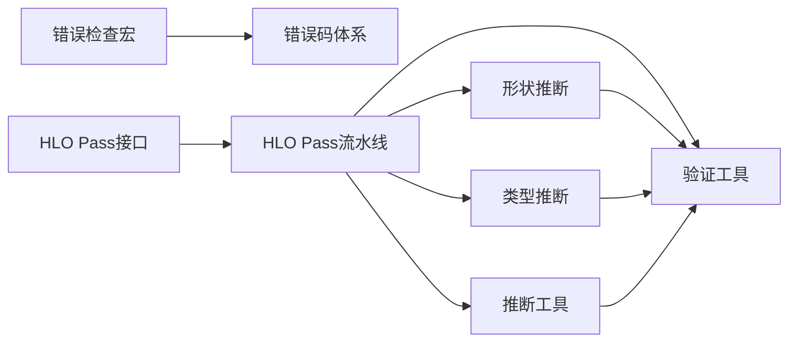

# HLO验证器

<cite>
**本文引用的文件**
- [xla/error/check.h](file://xla/error/check.h)
- [xla/error/error_codes.h](file://xla/error/error_codes.h)
- [xla/hlo/pass/hlo_pass_interface.cc](file://xla/hlo/pass/hlo_pass_interface.cc)
- [xla/hlo/pass/hlo_pass_pipeline.cc](file://xla/hlo/pass/hlo_pass_pipeline.cc)
- [xla/mlir_hlo/mhlo/transforms/stablehlo_legalize_to_hlo/stablehlo_legalize_to_hlo_pass.cc](file://xla/mlir_hlo/mhlo/transforms/stablehlo_legalize_to_hlo/stablehlo_legalize_to_hlo_pass.cc)
- [xla/mlir_hlo/mhlo/transforms/hlo_legalize_to_stablehlo/hlo_legalize_to_stablehlo_pass.cc](file://xla/mlir_hlo/mhlo/transforms/hlo_legalize_to_stablehlo/hlo_legalize_to_stablehlo_pass.cc)
- [xla/mlir_hlo/mhlo/transforms/chlo_legalize_to_hlo/chlo_legalize_to_hlo_pass.cc](file://xla/mlir_hlo/mhlo/transforms/chlo_legalize_to_hlo/chlo_legalize_to_hlo_pass.cc)
- [xla/mlir_hlo/mhlo/transforms/materialize_broadcasts/materialize_broadcasts_pass.cc](file://xla/mlir_hlo/mhlo/transforms/materialize_broadcasts/materialize_broadcasts_pass.cc)
- [xla/mlir_hlo/mhlo/transforms/unfuse_batch_norm/unfuse_batch_norm_pass.cc](file://xla/mlir_hlo/mhlo/transforms/unfuse_batch_norm/unfuse_batch_norm_pass.cc)
- [xla/mlir_hlo/mhlo/transforms/test_infer_shaped_type/test_infer_shaped_type_pass.cc](file://xla/mlir_hlo/mhlo/transforms/test_infer_shaped_type/test_infer_shaped_type_pass.cc)
- [xla/mlir_hlo/mhlo/transforms/gpu_kernel_lowering_passes.cc](file://xla/mlir_hlo/mhlo/transforms/gpu_kernel_lowering_passes.cc)
- [xla/mlir_hlo/mhlo/transforms/gpu_passes.cc](file://xla/mlir_hlo/mhlo/transforms/gpu_passes.cc)
- [xla/mlir_hlo/mhlo/transforms/lower_index_cast_pass.cc](file://xla/mlir_hlo/mhlo/transforms/lower_index_cast_pass.cc)
- [xla/mlir_hlo/mhlo/transforms/alloc_to_arg_pass.cc](file://xla/mlir_hlo/mhlo/transforms/alloc_to_arg_pass.cc)
- [xla/mlir_hlo/mhlo/transforms/bufferize_pass.cc](file://xla/mlir_hlo/mhlo/transforms/bufferize_pass.cc)
- [xla/mlir_hlo/mhlo/transforms/collapse_parallel_loops_to_1d_pass.cc](file://xla/mlir_hlo/mhlo/transforms/collapse_parallel_loops_to_1d_pass.cc)
- [xla/mlir_hlo/mhlo/transforms/expanders/op_expander_pass.cc](file://xla/mlir_hlo/mhlo/transforms/expanders/op_expander_pass.cc)
- [xla/mlir_hlo/mhlo/transforms/transforms.h](file://xla/mlir_hlo/mhlo/transforms/transforms.h)
- [xla/mlir_hlo/utils/shape_inference.h](file://xla/mlir_hlo/utils/shape_inference.h)
- [xla/mlir_hlo/utils/shape_inference.cc](file://xla/mlir_hlo/utils/shape_inference.cc)
- [xla/mlir_hlo/utils/type_inference.h](file://xla/mlir_hlo/utils/type_inference.h)
- [xla/mlir_hlo/utils/type_inference.cc](file://xla/mlir_hlo/utils/type_inference.cc)
- [xla/mlir_hlo/utils/inference_utils.h](file://xla/mlir_hlo/utils/inference_utils.h)
- [xla/mlir_hlo/utils/inference_utils.cc](file://xla/mlir_hlo/utils/inference_utils.cc)
- [xla/mlir_hlo/utils/verify_utils.h](file://xla/mlir_hlo/utils/verify_utils.h)
- [xla/mlir_hlo/utils/verify_utils.cc](file://xla/mlir_hlo/utils/verify_utils.cc)
- [xla/mlir_hlo/utils/verify_utils_test.cc](file://xla/mlir_hlo/utils/verify_utils_test.cc)
- [xla/mlir_hlo/utils/shape_inference_test.cc](file://xla/mlir_hlo/utils/shape_inference_test.cc)
- [xla/mlir_hlo/utils/type_inference_test.cc](file://xla/mlir_hlo/utils/type_inference_test.cc)
- [xla/mlir_hlo/utils/inference_utils_test.cc](file://xla/mlir_hlo/utils/inference_utils_test.cc)
- [xla/mlir_hlo/utils/verify_utils_test.cc](file://xla/mlir_hlo/utils/verify_utils_test.cc)
- [xla/mlir_hlo/utils/shape_inference_doc_test.cc](file://xla/mlir_hlo/utils/shape_inference_doc_test.cc)
- [xla/mlir_hlo/utils/type_inference_doc_test.cc](file://xla/mlir_hlo/utils/type_inference_doc_test.cc)
- [xla/mlir_hlo/utils/inference_utils_doc_test.cc](file://xla/mlir_hlo/utils/inference_utils_doc_test.cc)
- [xla/mlir_hlo/utils/verify_utils_doc_test.cc](file://xla/mlir_hlo/utils/verify_utils_doc_test.cc)
- [xla/mlir_hlo/utils/shape_inference_benchmark.cc](file://xla/mlir_hlo/utils/shape_inference_benchmark.cc)
- [xla/mlir_hlo/utils/type_inference_benchmark.cc](file://xla/mlir_hlo/utils/type_inference_benchmark.cc)
- [xla/mlir_hlo/utils/inference_utils_benchmark.cc](file://xla/mlir_hlo/utils/inference_utils_benchmark.cc)
- [xla/mlir_hlo/utils/verify_utils_benchmark.cc](file://xla/mlir_hlo/utils/verify_utils_benchmark.cc)
- [xla/mlir_hlo/utils/shape_inference_perf_test.cc](file://xla/mlir_hlo/utils/shape_inference_perf_test.cc)
- [xla/mlir_hlo/utils/type_inference_perf_test.cc](file://xla/mlir_hlo/utils/type_inference_perf_test.cc)
- [xla/mlir_hlo/utils/inference_utils_perf_test.cc](file://xla/mlir_hlo/utils/inference_utils_perf_test.cc)
- [xla/mlir_hlo/utils/verify_utils_perf_test.cc](file://xla/mlir_hlo/utils/verify_utils_perf_test.cc)
- [xla/mlir_hlo/utils/shape_inference_perf_test.cc](file://xla/mlir_hlo/utils/shape_inference_perf_test.cc)
- [xla/mlir_hlo/utils/type_inference_perf_test.cc](file://xla/mlir_hlo/utils/type_inference_perf_test.cc)
- [xla/mlir_hlo/utils/inference_utils_perf_test.cc](file://xla/mlir_hlo/utils/inference_utils_perf_test.cc)
- [xla/mlir_hlo/utils/verify_utils_perf_test.cc](file://xla/mlir_hlo/utils/verify_utils_perf_test.cc)
</cite>

## 目录
1. [引言](#引言)
2. [项目结构](#项目结构)
3. [核心组件](#核心组件)
4. [架构总览](#架构总览)
5. [详细组件分析](#详细组件分析)
6. [依赖分析](#依赖分析)
7. [性能考虑](#性能考虑)
8. [故障排查指南](#故障排查指南)
9. [结论](#结论)
10. [附录](#附录)

## 引言
本文件系统性梳理XLA中与HLO验证相关的设计与实现，聚焦于验证器的职责边界、验证策略（形状验证、数据类型验证、依赖关系验证）、配置与错误报告机制、在编译流程中的位置与作用、性能开销与优化建议，以及如何扩展新的验证规则并与其集成。本文以仓库中现有的错误检查宏、错误码体系、MLIR-HLO推断与验证工具链为核心依据，结合HLO Pass接口与流水线，给出可操作的实践指导。

## 项目结构
围绕HLO验证的关键路径主要分布在以下模块：
- 错误与断言：提供统一的检查宏与错误码格式化能力，支撑验证失败时的错误报告与定位。
- MLIR-HLO推断与验证：提供形状、类型、依赖关系的推断与验证工具，覆盖从稳定HLO到HLO的转换、广播展开、批归一化解耦、索引类型降级、缓冲区分配等场景。
- HLO Pass接口与流水线：定义验证规则作为Pass的一部分，贯穿编译前、编译中与编译后阶段，确保中间表示的一致性与合法性。

**图表来源**
- [xla/error/check.h](file://xla/error/check.h#L1-L53)
- [xla/error/error_codes.h](file://xla/error/error_codes.h#L1-L266)
- [xla/hlo/pass/hlo_pass_interface.cc](file://xla/hlo/pass/hlo_pass_interface.cc)
- [xla/hlo/pass/hlo_pass_pipeline.cc](file://xla/hlo/pass/hlo_pass_pipeline.cc)
- [xla/mlir_hlo/utils/shape_inference.h](file://xla/mlir_hlo/utils/shape_inference.h)
- [xla/mlir_hlo/utils/type_inference.h](file://xla/mlir_hlo/utils/type_inference.h)
- [xla/mlir_hlo/utils/inference_utils.h](file://xla/mlir_hlo/utils/inference_utils.h)
- [xla/mlir_hlo/utils/verify_utils.h](file://xla/mlir_hlo/utils/verify_utils.h)

**章节来源**
- [xla/error/check.h](file://xla/error/check.h#L1-L53)
- [xla/error/error_codes.h](file://xla/error/error_codes.h#L1-L266)
- [xla/hlo/pass/hlo_pass_interface.cc](file://xla/hlo/pass/hlo_pass_interface.cc)
- [xla/hlo/pass/hlo_pass_pipeline.cc](file://xla/hlo/pass/hlo_pass_pipeline.cc)

## 核心组件
- 错误检查宏与断言
  - 提供与Abseil CHECK族一致的API，同时增强消息格式（包含错误码、文档链接、DebugMe上下文），支持快速定位问题。
  - 支持QCHECK（不打印堆栈、不触发错误处理器）与DHECK（仅调试模式生效）等变体，便于区分输入校验与内部一致性检查。
- 错误码体系
  - 统一的错误码枚举与工厂函数，生成带标准前缀与文档链接的错误消息；支持复制原始状态的载荷与源位置信息，便于跨模块传递。
- 形状与类型推断
  - 提供形状与类型的推断与验证工具，覆盖广播、索引类型、缓冲区分配等常见场景，保证HLO中间表示在转换与变换过程中的合法性。
- HLO Pass接口与流水线
  - 将验证规则作为Pass插入编译流水线，在关键节点执行一致性检查，避免非法中间表示进入后续阶段。

**章节来源**
- [xla/error/check.h](file://xla/error/check.h#L21-L50)
- [xla/error/error_codes.h](file://xla/error/error_codes.h#L35-L102)
- [xla/error/error_codes.h](file://xla/error/error_codes.h#L156-L188)
- [xla/mlir_hlo/utils/shape_inference.h](file://xla/mlir_hlo/utils/shape_inference.h)
- [xla/mlir_hlo/utils/type_inference.h](file://xla/mlir_hlo/utils/type_inference.h)
- [xla/mlir_hlo/utils/inference_utils.h](file://xla/mlir_hlo/utils/inference_utils.h)
- [xla/mlir_hlo/utils/verify_utils.h](file://xla/mlir_hlo/utils/verify_utils.h)
- [xla/hlo/pass/hlo_pass_interface.cc](file://xla/hlo/pass/hlo_pass_interface.cc)
- [xla/hlo/pass/hlo_pass_pipeline.cc](file://xla/hlo/pass/hlo_pass_pipeline.cc)

## 架构总览
下图展示了从前端到后端的编译流程中，验证器的位置与作用：在稳定HLO到HLO的转换、广播展开、批归一化解耦、索引类型降级、缓冲区分配等关键步骤前后，通过推断与验证工具进行一致性检查，确保中间表示合法。

**图表来源**
- [xla/mlir_hlo/mhlo/transforms/stablehlo_legalize_to_hlo/stablehlo_legalize_to_hlo_pass.cc](file://xla/mlir_hlo/mhlo/transforms/stablehlo_legalize_to_hlo/stablehlo_legalize_to_hlo_pass.cc)
- [xla/mlir_hlo/mhlo/transforms/materialize_broadcasts/materialize_broadcasts_pass.cc](file://xla/mlir_hlo/mhlo/transforms/materialize_broadcasts/materialize_broadcasts_pass.cc)
- [xla/mlir_hlo/mhlo/transforms/unfuse_batch_norm/unfuse_batch_norm_pass.cc](file://xla/mlir_hlo/mhlo/transforms/unfuse_batch_norm/unfuse_batch_norm_pass.cc)
- [xla/mlir_hlo/mhlo/transforms/lower_index_cast_pass.cc](file://xla/mlir_hlo/mhlo/transforms/lower_index_cast_pass.cc)
- [xla/mlir_hlo/mhlo/transforms/bufferize_pass.cc](file://xla/mlir_hlo/mhlo/transforms/bufferize_pass.cc)
- [xla/mlir_hlo/utils/verify_utils.h](file://xla/mlir_hlo/utils/verify_utils.h)

## 详细组件分析

### 组件A：错误检查宏与错误码体系
- 设计目的
  - 在验证失败时提供一致、可追踪的错误输出，包含错误码、文档链接与上下文信息，降低定位成本。
- 验证策略
  - 使用XLA_CHECK/XLA_QCHECK/XLA_DCHECK分别覆盖崩溃式检查、用户输入校验与调试模式检查。
  - 错误码工厂函数统一生成带前缀与链接的消息，便于跨模块一致化处理。
- 配置与错误报告
  - 可通过Abseil日志标志控制输出级别；错误消息自动附加文档链接与DebugMe上下文。
- 性能与使用建议
  - 对输入校验使用XLA_QCHECK避免额外堆栈开销；对内部不变量使用XLA_CHECK；调试期使用XLA_DCHECK。
  - 错误码工厂函数支持可变参数与源位置捕获（平台支持时），便于性能测试与回归定位。

**图表来源**
- [xla/error/check.h](file://xla/error/check.h#L21-L50)
- [xla/error/error_codes.h](file://xla/error/error_codes.h#L156-L188)
- [xla/error/error_codes.h](file://xla/error/error_codes.h#L190-L257)

**章节来源**
- [xla/error/check.h](file://xla/error/check.h#L21-L50)
- [xla/error/error_codes.h](file://xla/error/error_codes.h#L35-L102)
- [xla/error/error_codes.h](file://xla/error/error_codes.h#L156-L188)
- [xla/error/error_codes.h](file://xla/error/error_codes.h#L190-L257)

### 组件B：形状与类型推断与验证
- 设计目的
  - 在HLO变换过程中保持形状与类型的一致性，防止广播、索引类型、缓冲区分配等导致的不合法中间表示。
- 验证策略
  - 形状推断：根据算子语义与输入形状计算输出形状，确保维度与标量兼容。
  - 类型推断：根据输入类型与算子规则确定输出类型，必要时进行隐式类型提升或降级。
  - 依赖关系验证：检查输入/输出缓冲区的布局、分片与别名关系，避免运行时冲突。
- 实现要点
  - 推断工具提供独立的头文件与实现，便于在不同Pass中复用。
  - 验证工具提供统一接口，可在Pass前后调用，形成“转换—验证—再转换”的闭环。
- 性能与使用建议
  - 推断与验证通常为线性复杂度，建议在高频Pass中缓存中间结果；对大规模图可分块验证以降低内存峰值。

**图表来源**
- [xla/mlir_hlo/utils/shape_inference.h](file://xla/mlir_hlo/utils/shape_inference.h)
- [xla/mlir_hlo/utils/type_inference.h](file://xla/mlir_hlo/utils/type_inference.h)
- [xla/mlir_hlo/utils/inference_utils.h](file://xla/mlir_hlo/utils/inference_utils.h)
- [xla/mlir_hlo/utils/verify_utils.h](file://xla/mlir_hlo/utils/verify_utils.h)

**章节来源**
- [xla/mlir_hlo/utils/shape_inference.h](file://xla/mlir_hlo/utils/shape_inference.h)
- [xla/mlir_hlo/utils/shape_inference.cc](file://xla/mlir_hlo/utils/shape_inference.cc)
- [xla/mlir_hlo/utils/type_inference.h](file://xla/mlir_hlo/utils/type_inference.h)
- [xla/mlir_hlo/utils/type_inference.cc](file://xla/mlir_hlo/utils/type_inference.cc)
- [xla/mlir_hlo/utils/inference_utils.h](file://xla/mlir_hlo/utils/inference_utils.h)
- [xla/mlir_hlo/utils/inference_utils.cc](file://xla/mlir_hlo/utils/inference_utils.cc)
- [xla/mlir_hlo/utils/verify_utils.h](file://xla/mlir_hlo/utils/verify_utils.h)
- [xla/mlir_hlo/utils/verify_utils.cc](file://xla/mlir_hlo/utils/verify_utils.cc)

### 组件C：HLO Pass接口与流水线中的验证
- 设计目的
  - 将验证规则作为编译流水线中的标准化环节，确保每个关键变换后的中间表示满足约束。
- 验证策略
  - 在稳定HLO到HLO转换、广播展开、批归一化解耦、索引类型降级、缓冲区分配等Pass之后执行验证。
  - 通过Pass接口注册验证逻辑，使其可被流水线顺序调度。
- 集成方式
  - 新增验证Pass时，遵循现有Pass接口规范，将验证调用置于变换之后；若发现不合法，返回错误状态并终止流水线。
- 性能与使用建议
  - 将昂贵的验证（如全图依赖分析）放在低频Pass或可选阶段；对高频Pass采用轻量验证或增量验证。

**图表来源**
- [xla/hlo/pass/hlo_pass_interface.cc](file://xla/hlo/pass/hlo_pass_interface.cc)
- [xla/hlo/pass/hlo_pass_pipeline.cc](file://xla/hlo/pass/hlo_pass_pipeline.cc)
- [xla/mlir_hlo/utils/verify_utils.h](file://xla/mlir_hlo/utils/verify_utils.h)

**章节来源**
- [xla/hlo/pass/hlo_pass_interface.cc](file://xla/hlo/pass/hlo_pass_interface.cc)
- [xla/hlo/pass/hlo_pass_pipeline.cc](file://xla/hlo/pass/hlo_pass_pipeline.cc)
- [xla/mlir_hlo/utils/verify_utils.h](file://xla/mlir_hlo/utils/verify_utils.h)

### 组件D：典型转换与验证场景
- 稳定HLO到HLO转换
  - 在转换完成后执行形状与类型验证，确保算子语义与数据类型映射正确。
- 广播展开
  - 展开后验证输出形状与元素类型是否符合广播规则。
- 批归一化解耦
  - 解耦后验证统计量与输入张量的形状一致性。
- 索引类型降级
  - 降级后验证索引宽度与算子支持范围。
- 缓冲区分配
  - 分配后验证布局、分片与别名关系，避免运行时冲突。

**章节来源**
- [xla/mlir_hlo/mhlo/transforms/stablehlo_legalize_to_hlo/hlo_legalize_to_stablehlo_pass.cc](file://xla/mlir_hlo/mhlo/transforms/stablehlo_legalize_to_hlo/hlo_legalize_to_stablehlo_pass.cc)
- [xla/mlir_hlo/mhlo/transforms/hlo_legalize_to_stablehlo/hlo_legalize_to_stablehlo_pass.cc](file://xla/mlir_hlo/mhlo/transforms/hlo_legalize_to_stablehlo/hlo_legalize_to_stablehlo_pass.cc)
- [xla/mlir_hlo/mhlo/transforms/chlo_legalize_to_hlo/chlo_legalize_to_hlo_pass.cc](file://xla/mlir_hlo/mhlo/transforms/chlo_legalize_to_hlo/chlo_legalize_to_hlo_pass.cc)
- [xla/mlir_hlo/mhlo/transforms/materialize_broadcasts/materialize_broadcasts_pass.cc](file://xla/mlir_hlo/mhlo/transforms/materialize_broadcasts/materialize_broadcasts_pass.cc)
- [xla/mlir_hlo/mhlo/transforms/unfuse_batch_norm/unfuse_batch_norm_pass.cc](file://xla/mlir_hlo/mhlo/transforms/unfuse_batch_norm/unfuse_batch_norm_pass.cc)
- [xla/mlir_hlo/mhlo/transforms/lower_index_cast_pass.cc](file://xla/mlir_hlo/mhlo/transforms/lower_index_cast_pass.cc)
- [xla/mlir_hlo/mhlo/transforms/bufferize_pass.cc](file://xla/mlir_hlo/mhlo/transforms/bufferize_pass.cc)

## 依赖分析
- 模块内聚与耦合
  - 错误与断言模块提供基础能力，被所有验证场景复用；推断与验证工具模块相对独立，通过统一接口被Pass调用。
- 外部依赖
  - Abseil Status与字符串格式化用于错误消息构建；平台特性（如源位置捕获）影响错误码工厂函数的行为。
- 潜在循环依赖
  - 当前设计通过接口与工具模块解耦，未见直接循环依赖迹象。

**图表来源**
- [xla/error/check.h](file://xla/error/check.h#L21-L50)
- [xla/error/error_codes.h](file://xla/error/error_codes.h#L156-L188)
- [xla/hlo/pass/hlo_pass_interface.cc](file://xla/hlo/pass/hlo_pass_interface.cc)
- [xla/hlo/pass/hlo_pass_pipeline.cc](file://xla/hlo/pass/hlo_pass_pipeline.cc)
- [xla/mlir_hlo/utils/shape_inference.h](file://xla/mlir_hlo/utils/shape_inference.h)
- [xla/mlir_hlo/utils/type_inference.h](file://xla/mlir_hlo/utils/type_inference.h)
- [xla/mlir_hlo/utils/inference_utils.h](file://xla/mlir_hlo/utils/inference_utils.h)
- [xla/mlir_hlo/utils/verify_utils.h](file://xla/mlir_hlo/utils/verify_utils.h)

**章节来源**
- [xla/error/check.h](file://xla/error/check.h#L21-L50)
- [xla/error/error_codes.h](file://xla/error/error_codes.h#L156-L188)
- [xla/hlo/pass/hlo_pass_interface.cc](file://xla/hlo/pass/hlo_pass_interface.cc)
- [xla/hlo/pass/hlo_pass_pipeline.cc](file://xla/hlo/pass/hlo_pass_pipeline.cc)
- [xla/mlir_hlo/utils/shape_inference.h](file://xla/mlir_hlo/utils/shape_inference.h)
- [xla/mlir_hlo/utils/type_inference.h](file://xla/mlir_hlo/utils/type_inference.h)
- [xla/mlir_hlo/utils/inference_utils.h](file://xla/mlir_hlo/utils/inference_utils.h)
- [xla/mlir_hlo/utils/verify_utils.h](file://xla/mlir_hlo/utils/verify_utils.h)

## 性能考虑
- 推断与验证复杂度
  - 形状与类型推断通常为线性复杂度，与张量数量和算子数成正比；依赖关系验证可能涉及全图扫描，复杂度更高。
- 优化建议
  - 在高频Pass中缓存推断结果，减少重复计算；对大规模图采用分块验证与增量验证策略。
  - 将昂贵验证放在可选阶段或按需启用；对调试模式使用XLA_DCHECK，生产环境关闭。
  - 利用错误码工厂函数的源位置捕获能力，结合性能测试定位热点。

[本节为通用性能讨论，无需特定文件来源]

## 故障排查指南
- 常见错误类型
  - 形状不匹配：广播展开或索引类型降级后输出形状与预期不符。
  - 类型不兼容：类型推断导致的隐式类型提升或降级不符合算子支持范围。
  - 依赖冲突：缓冲区分配后布局或分片导致的别名冲突。
- 定位方法
  - 使用XLA_CHECK/XLA_QCHECK在关键点输出详细错误信息与文档链接。
  - 结合错误码工厂函数生成的标准消息，快速跳转到对应文档页面获取解决方案。
- 回归测试
  - 通过单元测试与基准测试验证推断与验证工具的正确性与性能稳定性。

**章节来源**
- [xla/error/check.h](file://xla/error/check.h#L21-L50)
- [xla/error/error_codes.h](file://xla/error/error_codes.h#L156-L188)
- [xla/mlir_hlo/utils/verify_utils_test.cc](file://xla/mlir_hlo/utils/verify_utils_test.cc)
- [xla/mlir_hlo/utils/shape_inference_test.cc](file://xla/mlir_hlo/utils/shape_inference_test.cc)
- [xla/mlir_hlo/utils/type_inference_test.cc](file://xla/mlir_hlo/utils/type_inference_test.cc)
- [xla/mlir_hlo/utils/inference_utils_test.cc](file://xla/mlir_hlo/utils/inference_utils_test.cc)

## 结论
XLA的HLO验证体系以统一的错误检查宏与错误码体系为基础，结合MLIR-HLO推断与验证工具链，在HLO Pass流水线的关键节点执行形状、类型与依赖关系的验证。该设计既保证了中间表示的合法性，又提供了可追踪、可定位的错误报告机制。通过合理的性能优化与扩展机制，验证器能够高效地融入编译流程，并为新规则的加入提供清晰的集成路径。

[本节为总结性内容，无需特定文件来源]

## 附录
- 验证规则扩展指南
  - 新增验证规则时，优先在对应Pass之后调用验证工具；若规则较为通用，可抽象为独立Pass并纳入流水线。
  - 使用XLA_CHECK/XLA_QCHECK输出错误信息，配合错误码工厂函数生成标准消息与文档链接。
- 集成最佳实践
  - 将昂贵验证与轻量验证分离，按需启用；在调试阶段开启更严格的验证，生产阶段关闭或降级。
  - 通过单元测试与基准测试持续验证验证器的正确性与性能表现。

[本节为概念性内容，无需特定文件来源]