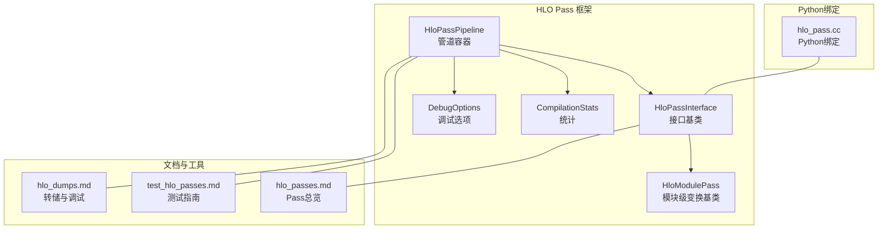
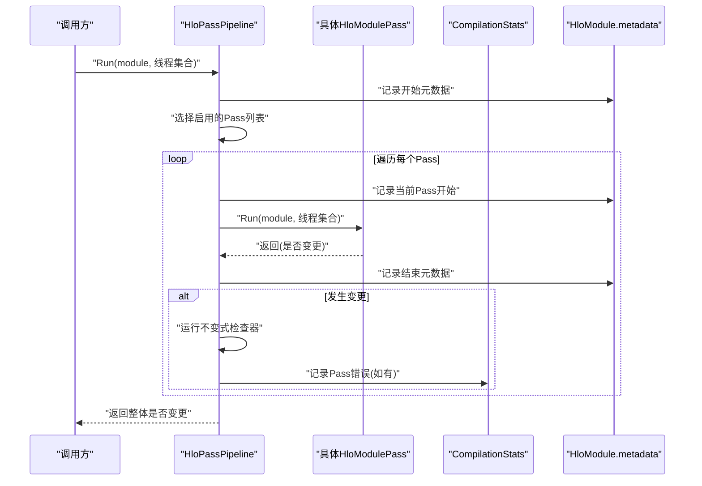
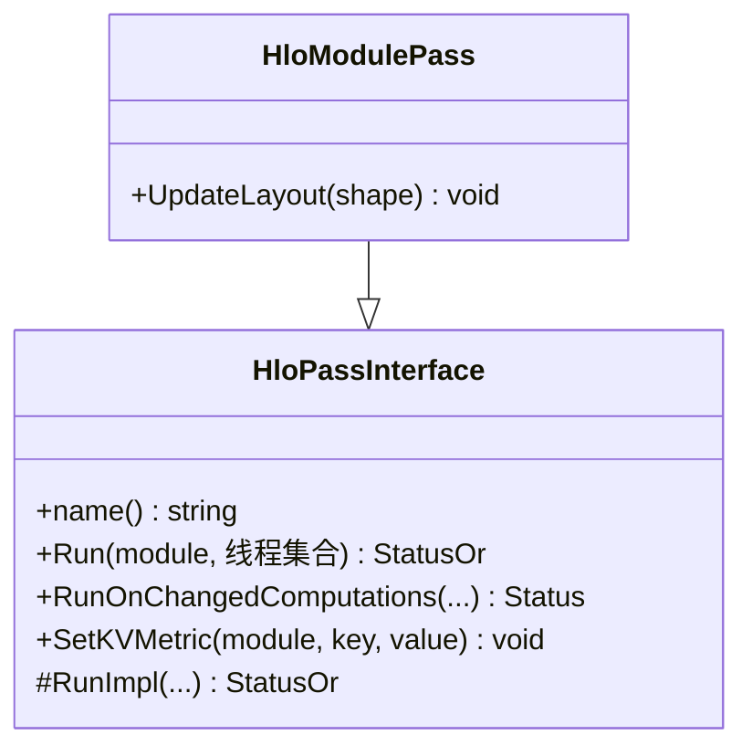
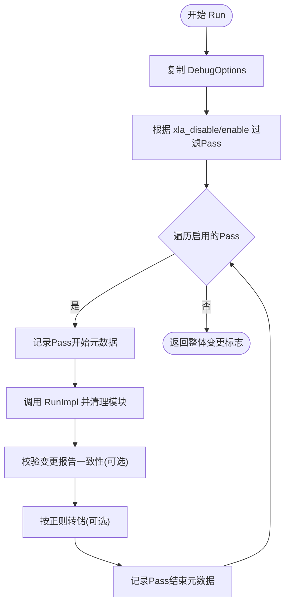
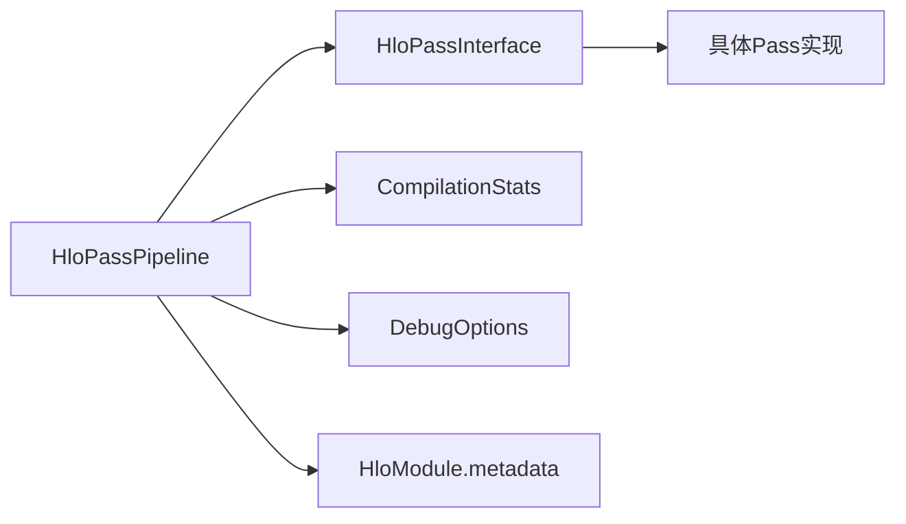

# 自定义HLO变换

<cite>
**本文引用的文件**
- [hlo_pass_interface.h](file://xla/hlo/pass/hlo_pass_interface.h)
- [hlo_pass_pipeline.h](file://xla/hlo/pass/hlo_pass_pipeline.h)
- [hlo_pass_pipeline.cc](file://xla/hlo/pass/hlo_pass_pipeline.cc)
- [hlo_passes.md](file://docs/hlo_passes.md)
- [test_hlo_passes.md](file://docs/test_hlo_passes.md)
- [hlo_dumps.md](file://docs/hlo_dumps.md)
- [hlo_pass.cc](file://xla/python/hlo_pass.cc)
</cite>

## 目录
1. [引言](#引言)
2. [项目结构](#项目结构)
3. [核心组件](#核心组件)
4. [架构总览](#架构总览)
5. [详细组件分析](#详细组件分析)
6. [依赖关系分析](#依赖关系分析)
7. [性能考量](#性能考量)
8. [故障排查指南](#故障排查指南)
9. [结论](#结论)
10. [附录](#附录)

## 引言
本指南面向需要在XLA中开发与集成自定义HLO变换（Pass）的工程师。内容覆盖从接口设计、实现要求、注册与生命周期管理、执行上下文，到测试策略、调试与性能分析、版本与兼容性考虑，以及最佳实践与常见陷阱。读者无需深入编译器背景，即可按步骤完成从设计到上线的全流程。

## 项目结构
围绕HLO Pass框架的关键位置如下：
- 接口与管道：xla/hlo/pass/hlo_pass_interface.h、xla/hlo/pass/hlo_pass_pipeline.h/.cc
- 文档：docs/hlo_passes.md、docs/test_hlo_passes.md、docs/hlo_dumps.md
- Python绑定：xla/python/hlo_pass.cc

下图给出与本文相关的文件级关系概览：

图表来源
- [hlo_pass_interface.h](file://xla/hlo/pass/hlo_pass_interface.h#L40-L161)
- [hlo_pass_pipeline.h](file://xla/hlo/pass/hlo_pass_pipeline.h#L38-L166)
- [hlo_pass_pipeline.cc](file://xla/hlo/pass/hlo_pass_pipeline.cc#L44-L321)
- [hlo_passes.md](file://docs/hlo_passes.md#L1-L231)
- [test_hlo_passes.md](file://docs/test_hlo_passes.md#L1-L88)
- [hlo_dumps.md](file://docs/hlo_dumps.md#L1-L261)
- [hlo_pass.cc](file://xla/python/hlo_pass.cc)

章节来源
- [hlo_passes.md](file://docs/hlo_passes.md#L1-L231)

## 核心组件
- HloPassInterface：所有HLO Pass的抽象接口，定义了名称、运行入口、变更报告、度量设置等通用能力，并提供“增量运行”支持（RunOnChangedComputations）。
- HloModulePass：模块级变换的基类，扩展了布局更新等后端相关能力。
- HloPassPipeline：Pass管道容器，负责顺序执行多个Pass、注入不变式检查器、统计与转储、启用/禁用控制、执行线程过滤等。

关键职责与约定
- 变更报告：每个Pass应返回是否对模块产生变更；框架会据此决定后续流程与统计。
- 不变式检查：可在管道中插入只检查不修改的Pass，确保每次或每次变更后都满足预期。
- 执行线程：支持按线程集合限定作用域，便于多线程/多设备场景。
- 调试与转储：通过DebugOptions控制是否转储中间结果、是否验证“变更报告一致性”。

章节来源
- [hlo_pass_interface.h](file://xla/hlo/pass/hlo_pass_interface.h#L40-L161)
- [hlo_pass_pipeline.h](file://xla/hlo/pass/hlo_pass_pipeline.h#L38-L166)
- [hlo_pass_pipeline.cc](file://xla/hlo/pass/hlo_pass_pipeline.cc#L134-L220)

## 架构总览
下图展示了从调用到执行、再到统计与转储的整体流程：

图表来源
- [hlo_pass_pipeline.cc](file://xla/hlo/pass/hlo_pass_pipeline.cc#L134-L220)
- [hlo_pass_pipeline.h](file://xla/hlo/pass/hlo_pass_pipeline.h#L97-L161)
- [hlo_pass_interface.h](file://xla/hlo/pass/hlo_pass_interface.h#L78-L141)

## 详细组件分析

### HloPassInterface 类族
- 设计要点
  - Run接口统一返回是否变更，便于管道短路与统计。
  - RunOnChangedComputations提供增量运行语义，适合大规模图的迭代优化。
  - SetKVMetric用于在模块元数据中写入键值度量，便于观测与诊断。
- 实现要求
  - RunImpl必须实现具体变换逻辑；若涉及布局调整，可复用HloModulePass的UpdateLayout。
  - 若实现RunOnChangedComputations，需正确维护RunState的迭代状态与变更集。

图表来源
- [hlo_pass_interface.h](file://xla/hlo/pass/hlo_pass_interface.h#L40-L161)

章节来源
- [hlo_pass_interface.h](file://xla/hlo/pass/hlo_pass_interface.h#L40-L161)

### HloPassPipeline 管道
- 设计要点
  - 支持AddPass/AddInvariantChecker两类注册方式；支持仅在Debug构建启用不变式检查。
  - 通过DebugOptions动态启用/禁用特定Pass或整条管道，便于灰度与回滚。
  - 在每次Pass前后记录元数据、可选转储中间结果、校验“变更报告一致性”。
- 生命周期
  - 构造时传入名称与可选统计实例；首次Run后标记run_called_，禁止再添加Pass。
  - 每次Run复制一份DebugOptions，避免Pass内部修改影响后续执行。
- 执行上下文
  - 支持execution_threads过滤，仅对指定线程内的计算进行处理。
  - 统一的统计与追踪埋点，便于性能分析与问题定位。

图表来源
- [hlo_pass_pipeline.cc](file://xla/hlo/pass/hlo_pass_pipeline.cc#L222-L276)
- [hlo_pass_pipeline.cc](file://xla/hlo/pass/hlo_pass_pipeline.cc#L134-L220)
- [hlo_pass_pipeline.h](file://xla/hlo/pass/hlo_pass_pipeline.h#L97-L161)

章节来源
- [hlo_pass_pipeline.h](file://xla/hlo/pass/hlo_pass_pipeline.h#L38-L166)
- [hlo_pass_pipeline.cc](file://xla/hlo/pass/hlo_pass_pipeline.cc#L134-L220)

### 注册机制与执行上下文
- 注册
  - 使用HloPassPipeline::AddPass注册具体Pass；也可使用AddInvariantChecker插入只检查不变式的Pass。
  - 通过DebugOptions的xla_disable_hlo_passes与xla_enable_hlo_passes_only实现按名称粒度的开关。
- 执行上下文
  - execution_threads为空表示全量执行；非空时仅对匹配线程内的计算生效。
  - 模块元数据中记录当前Pass名称、管道名称、模块唯一ID、是否发生变更等信息。

章节来源
- [hlo_pass_pipeline.h](file://xla/hlo/pass/hlo_pass_pipeline.h#L51-L90)
- [hlo_pass_pipeline.cc](file://xla/hlo/pass/hlo_pass_pipeline.cc#L222-L276)
- [hlo_pass_interface.h](file://xla/hlo/pass/hlo_pass_interface.h#L78-L128)

### 测试策略与示例路径
- FileCheck + CHECK行内化：推荐在输入HLO文本中直接嵌入CHECK注释，提升可读性与一致性。
- LIT运行器与hlo-opt：结合LIT与hlo-opt工具，将CHECK置于对应输入IR旁，支持平台与阶段定制。
- 自动生成CHECK脚本：可先运行Pass得到输出，再用工具自动插入CHECK指令，随后人工核验。
- 避免“叶子节点遍历匹配”的繁琐测试：优先采用上述方法。

章节来源
- [test_hlo_passes.md](file://docs/test_hlo_passes.md#L1-L88)

### 调试与可视化
- 转储与查看
  - 使用XLA_FLAGS控制转储格式（文本/HLO Proto/HLO Snapshot/HTML/URL），并指定转储目录。
  - 通过--xla_dump_hlo_pass_re按正则匹配特定Pass阶段进行转储。
- 工具链
  - hlo-opt可用于转换HLO文本与Proto格式，便于对比与复现。
  - run_hlo_module可用于在指定后端上重放转储的模块，快速定位问题。

章节来源
- [hlo_dumps.md](file://docs/hlo_dumps.md#L1-L261)

### Python绑定
- Python侧可通过hlo_pass.cc提供的绑定调用HLO Pass管道，便于在高层框架中集成与调试。

章节来源
- [hlo_pass.cc](file://xla/python/hlo_pass.cc)

## 依赖关系分析
- 组件耦合
  - HloPassPipeline强依赖HloPassInterface，以多态方式调度不同Pass。
  - 通过CompilationStats与模块元数据实现可观测性与统计。
- 外部依赖
  - DebugOptions来自模块配置，驱动启用/禁用与转储行为。
  - TraceMe/ScopedAnnotation用于性能追踪与火焰图采集。

图表来源
- [hlo_pass_pipeline.h](file://xla/hlo/pass/hlo_pass_pipeline.h#L38-L166)
- [hlo_pass_interface.h](file://xla/hlo/pass/hlo_pass_interface.h#L40-L161)

章节来源
- [hlo_pass_pipeline.h](file://xla/hlo/pass/hlo_pass_pipeline.h#L38-L166)
- [hlo_pass_interface.h](file://xla/hlo/pass/hlo_pass_interface.h#L40-L161)

## 性能考量
- 增量运行：实现RunOnChangedComputations可显著降低大规模图的重复工作量。
- 变更报告一致性：开启相关调试选项可强制校验“是否变更”与“HLO哈希变化”一致性，避免静默错误。
- 统计与追踪：利用CompilationStats与TraceMe/ScopedAnnotation定位热点Pass与瓶颈。
- 转储策略：仅在必要时开启中间Pass转储，避免I/O开销影响性能。

## 故障排查指南
- 变更报告不一致
  - 现象：Pass声称未变更但HLO哈希已变化，或相反。
  - 处理：启用相应调试选项，结合转储与日志定位具体Pass并修正实现。
- 不变式检查失败
  - 现象：插入的不变式检查器返回错误或报告变更。
  - 处理：检查该检查器是否误改图；修复后重新运行。
- 转储定位
  - 使用--xla_dump_hlo_pass_re按名称过滤，配合hlo-opt与run_hlo_module进行复现与验证。
- 兼容性与回归
  - 通过FileCheck/LIT测试固定期望输出，确保升级不会引入回归。

章节来源
- [hlo_pass_pipeline.cc](file://xla/hlo/pass/hlo_pass_pipeline.cc#L106-L130)
- [hlo_dumps.md](file://docs/hlo_dumps.md#L76-L98)
- [test_hlo_passes.md](file://docs/test_hlo_passes.md#L42-L87)

## 结论
自定义HLO变换的核心在于遵循统一的接口契约、合理使用管道与增量运行、严格测试与可观测性。通过本文的流程与工具，可以系统地完成从设计到上线的全生命周期管理，并在复杂模型与多后端场景中保持稳定性与可维护性。

## 附录

### 实践步骤清单（从零到一）
- 设计阶段
  - 明确变换目标与前置/后置条件，确定是否需要不变式检查。
  - 评估是否需要增量运行与线程级作用域。
- 实现阶段
  - 继承HloModulePass或HloPassInterface，实现RunImpl与（可选）RunOnChangedComputations。
  - 如涉及布局，复用UpdateLayout或在变换后显式更新。
- 集成阶段
  - 将自定义Pass加入HloPassPipeline，必要时添加不变式检查器。
  - 通过DebugOptions控制启用/禁用与转储策略。
- 测试阶段
  - 使用FileCheck/LIT与hlo-opt编写测试，确保输出稳定。
  - 对关键路径增加性能追踪与统计。
- 上线与运维
  - 保留测试与转储策略，建立回归监控与问题复现流程。

### 版本兼容性与向后兼容性
- 向后兼容
  - 新增Pass时尽量保持默认关闭，通过xla_enable_hlo_passes_only灰度发布。
  - 保持接口稳定，避免破坏既有Pass的执行语义。
- 版本演进
  - 通过模块元数据记录Pass版本与参数，便于回溯与迁移。
  - 对可能破坏性的变更，提供迁移脚本与过渡期策略。