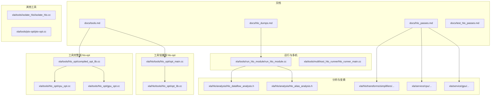
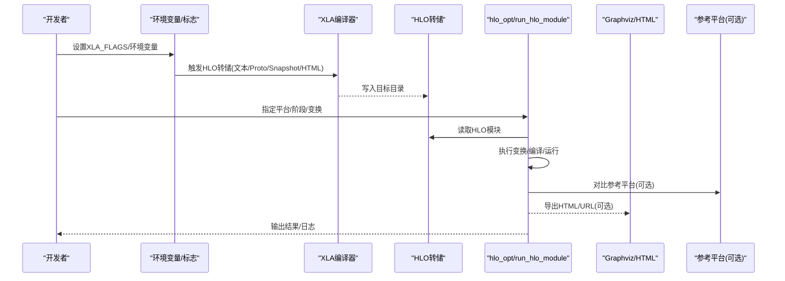
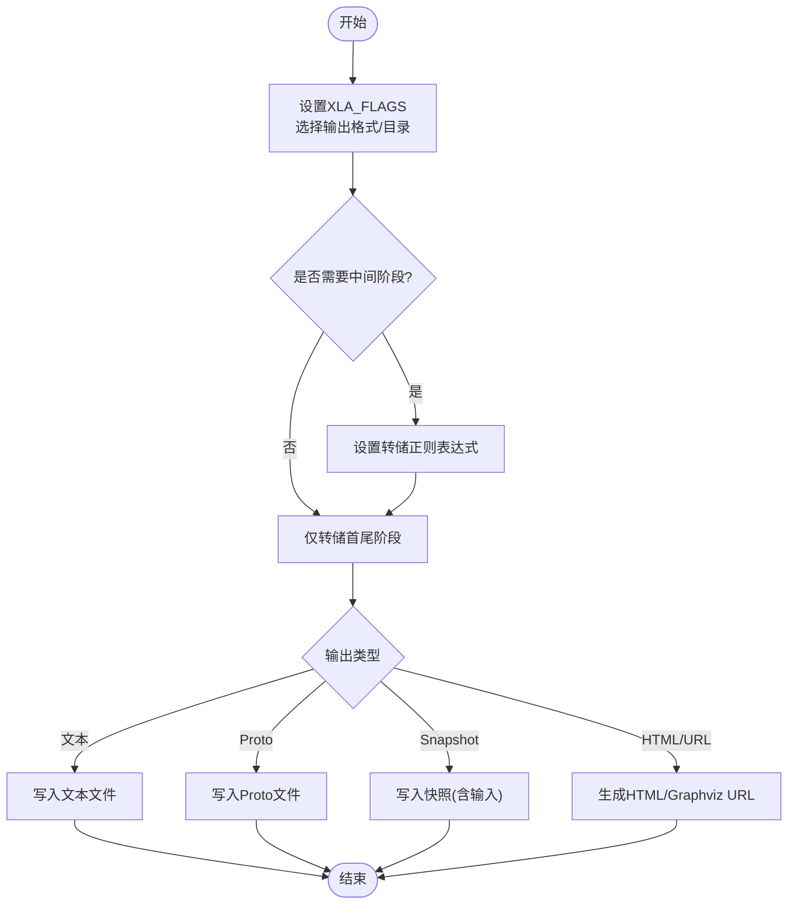
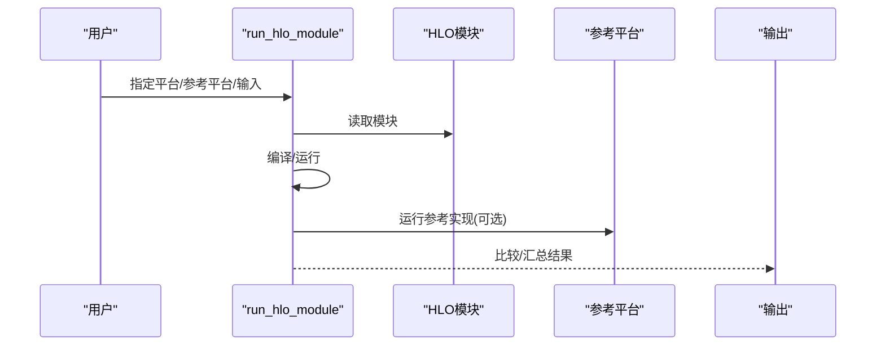
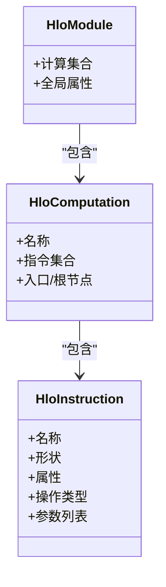
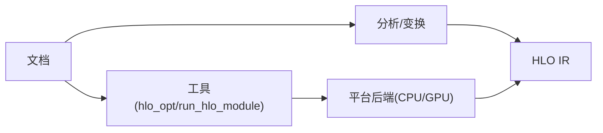

# HLO调试工具

<cite>
**本文引用的文件**
- [docs/hlo_dumps.md](file://docs/hlo_dumps.md)
- [docs/tools.md](file://docs/tools.md)
- [docs/hlo_passes.md](file://docs/hlo_passes.md)
- [docs/test_hlo_passes.md](file://docs/test_hlo_passes.md)
- [xla/tools/hlo_opt/BUILD](file://xla/tools/hlo_opt/BUILD)
- [xla/tools/hlo_opt/compiled_opt_lib.cc](file://xla/tools/hlo_opt/compiled_opt_lib.cc)
- [xla/tools/hlo_opt/cpu_opt.cc](file://xla/tools/hlo_opt/cpu_opt.cc)
- [xla/tools/hlo_opt/gpu_opt.cc](file://xla/tools/hlo_opt/gpu_opt.cc)
- [xla/hlo/tools/hlo_opt/opt_lib.cc](file://xla/hlo/tools/hlo_opt/opt_lib.cc)
- [xla/hlo/tools/hlo_opt/opt_main.cc](file://xla/hlo/tools/hlo_opt/opt_main.cc)
- [xla/tools/run_hlo_module/BUILD](file://xla/tools/run_hlo_module/BUILD)
- [xla/tools/run_hlo_module/run_hlo_module.cc](file://xla/tools/run_hlo_module/run_hlo_module.cc)
- [xla/tools/multihost_hlo_runner/BUILD](file://xla/tools/multihost_hlo_runner/BUILD)
- [xla/tools/multihost_hlo_runner/hlo_runner_main.cc](file://xla/tools/multihost_hlo_runner/hlo_runner_main.cc)
- [xla/tools/isolate_hlo/BUILD](file://xla/tools/isolate_hlo/BUILD)
- [xla/tools/isolate_hlo/isolate_hlo.cc](file://xla/tools/isolate_hlo/isolate_hlo.cc)
- [xla/tools/ptx-opt/BUILD](file://xla/tools/ptx-opt/BUILD)
- [xla/tools/ptx-opt/ptx-opt.cc](file://xla/tools/ptx-opt/ptx-opt.cc)
- [xla/hlo/analysis/hlo_dataflow_analysis.h](file://xla/hlo/analysis/hlo_dataflow_analysis.h)
- [xla/hlo/analysis/hlo_alias_analysis.h](file://xla/hlo/analysis/hlo_alias_analysis.h)
- [xla/hlo/transforms/simplifiers/algebraic_simplifier.h](file://xla/hlo/transforms/simplifiers/algebraic_simplifier.h)
- [xla/hlo/transforms/simplifiers/hlo_rematerialization.h](file://xla/hlo/transforms/simplifiers/hlo_rematerialization.h)
- [xla/hlo/transforms/simplifiers/hlo_constant_folding.h](file://xla/hlo/transforms/simplifiers/hlo_constant_folding.h)
- [xla/hlo/transforms/simplifiers/hlo_dce.h](file://xla/hlo/transforms/simplifiers/hlo_dce.h)
- [xla/hlo/transforms/simplifiers/flatten_call_graph.h](file://xla/hlo/transforms/simplifiers/flatten_call_graph.h)
- [xla/hlo/transforms/simplifiers/reshape_mover.h](file://xla/hlo/transforms/simplifiers/reshape_mover.h)
- [xla/hlo/transforms/simplifiers/zero_sized_hlo_elimination.h](file://xla/hlo/transforms/simplifiers/zero_sized_hlo_elimination.h)
- [xla/service/gpu/transforms/cudnn_fused_conv_rewriter.h](file://xla/service/gpu/transforms/cudnn_fused_conv_rewriter.h)
- [xla/service/gpu/transforms/cudnn_norm_rewriter.h](file://xla/service/gpu/transforms/cudnn_norm_rewriter.h)
- [xla/service/cpu/conv_canonicalization.h](file://xla/service/cpu/conv_canonicalization.h)
- [xla/service/cpu/parallel_task_assignment.h](file://xla/service/cpu/parallel_task_assignment.h)
- [xla/service/hlo_cost_analysis.h](file://xla/service/hlo_cost_analysis.h)
- [xla/service/sharding_propagation.h](file://xla/service/sharding_propagation.h)
- [xla/service/gather_expander.h](file://xla/service/gather_expander.h)
- [xla/service/batchnorm_expander.h](file://xla/service/batchnorm_expander.h)
- [xla/python/profiler_utils.h](file://xla/python/profiler_utils.h)
- [xla/python/profiler_utils.cc](file://xla/python/profiler_utils.cc)
- [xla/backends/cpu/benchmarks/hlo_benchmark_runner.h](file://xla/backends/cpu/benchmarks/hlo_benchmark_runner.h)
- [xla/backends/cpu/benchmarks/hlo_benchmark_runner.cc](file://xla/backends/cpu/benchmarks/hlo_benchmark_runner.cc)
</cite>

## 目录
1. [简介](#简介)
2. [项目结构](#项目结构)
3. [核心组件](#核心组件)
4. [架构总览](#架构总览)
5. [详细组件分析](#详细组件分析)
6. [依赖分析](#依赖分析)
7. [性能考虑](#性能考虑)
8. [故障排查指南](#故障排查指南)
9. [结论](#结论)
10. [附录](#附录)

## 简介
本文件系统性梳理并讲解XLA/HLO调试工具链，包括：
- HLO转储（文本、协议缓冲区、快照、HTML/Graphviz可视化）的生成与使用
- 可视化工具与渲染方式
- HLO比较工具hlo_diff的原理与使用场景（概念性说明）
- HLO优化工具hlo_opt的功能特性、命令行选项与平台支持
- 使用调试工具进行问题诊断的实践路径
- HLO图的图形化表示、节点属性与依赖关系分析
- 性能分析、内存使用监控与执行跟踪技术
- 调试输出的格式规范与解析方法

## 项目结构
围绕HLO调试与工具链，相关文档与源码主要分布在以下区域：
- 文档：docs目录下的hlo_dumps.md、tools.md、hlo_passes.md、test_hlo_passes.md
- 工具二进制：xla/tools与xla/hlo/tools下各工具的构建与实现
- 分析与变换：xla/hlo/analysis与xla/hlo/transforms中的分析器与优化器
- 后端特定：xla/service/cpu、xla/service/gpu等后端的专用变换
- 性能与追踪：xla/python/profiler_utils与后端基准工具



**图表来源**
- [docs/hlo_dumps.md](file://docs/hlo_dumps.md#L1-L261)
- [docs/tools.md](file://docs/tools.md#L1-L334)
- [xla/hlo/tools/hlo_opt/opt_main.cc](file://xla/hlo/tools/hlo_opt/opt_main.cc)
- [xla/hlo/tools/hlo_opt/opt_lib.cc](file://xla/hlo/tools/hlo_opt/opt_lib.cc)
- [xla/tools/hlo_opt/compiled_opt_lib.cc](file://xla/tools/hlo_opt/compiled_opt_lib.cc)
- [xla/tools/hlo_opt/cpu_opt.cc](file://xla/tools/hlo_opt/cpu_opt.cc)
- [xla/tools/hlo_opt/gpu_opt.cc](file://xla/tools/hlo_opt/gpu_opt.cc)
- [xla/tools/run_hlo_module/run_hlo_module.cc](file://xla/tools/run_hlo_module/run_hlo_module.cc)
- [xla/tools/multihost_hlo_runner/hlo_runner_main.cc](file://xla/tools/multihost_hlo_runner/hlo_runner_main.cc)
- [xla/tools/isolate_hlo/isolate_hlo.cc](file://xla/tools/isolate_hlo/isolate_hlo.cc)
- [xla/tools/ptx-opt/ptx-opt.cc](file://xla/tools/ptx-opt/ptx-opt.cc)
- [xla/hlo/analysis/hlo_dataflow_analysis.h](file://xla/hlo/analysis/hlo_dataflow_analysis.h)
- [xla/hlo/transforms/simplifiers/algebraic_simplifier.h](file://xla/hlo/transforms/simplifiers/algebraic_simplifier.h)

**章节来源**
- [docs/hlo_dumps.md](file://docs/hlo_dumps.md#L1-L261)
- [docs/tools.md](file://docs/tools.md#L1-L334)

## 核心组件
- HLO转储与可视化
  - 支持文本、协议缓冲区、快照、Graphviz URL/HTML等多种输出形式
  - 可按正则筛选中间阶段转储，便于定位优化过程中的问题
  - 提供运行与重放能力，便于离线验证与回归
- hlo_opt（HLO优化工具）
  - 轻量版：面向硬件无关的单个或组合HLO变换
  - 完整版：支持CPU/GPU平台、LLVM/Triton/PTX等中间态输出
  - 支持列出可用变换、设备无关运行、以及Autotune结果加载/导出
- run_hlo_module（HLO运行与对比）
  - 预优化HLO直接运行，并可与参考解释器平台对比
  - 支持批量运行与多平台
- multihost_hlo_runner（多主机/SPMD）
  - 支持跨主机通信与SPMD场景的HLO运行
- isolate_hlo（问题隔离）
  - 将可疑指令抽取为最小可复现模块
- ptx-opt（LLVM到PTX）
  - 在LLVMIR上执行优化并生成PTX，支持LLVMIR中间产物转储

**章节来源**
- [docs/hlo_dumps.md](file://docs/hlo_dumps.md#L18-L261)
- [docs/tools.md](file://docs/tools.md#L22-L334)
- [xla/hlo/tools/hlo_opt/opt_main.cc](file://xla/hlo/tools/hlo_opt/opt_main.cc)
- [xla/tools/hlo_opt/compiled_opt_lib.cc](file://xla/tools/hlo_opt/compiled_opt_lib.cc)

## 架构总览
下图展示了从“生成HLO转储”到“运行/比较/可视化”的端到端流程。



**图表来源**
- [docs/hlo_dumps.md](file://docs/hlo_dumps.md#L14-L110)
- [docs/tools.md](file://docs/tools.md#L22-L120)
- [xla/tools/run_hlo_module/run_hlo_module.cc](file://xla/tools/run_hlo_module/run_hlo_module.cc)
- [xla/tools/hlo_opt/compiled_opt_lib.cc](file://xla/tools/hlo_opt/compiled_opt_lib.cc)

## 详细组件分析

### HLO转储与可视化
- 转储类型
  - 文本：人类可读，适合快速审阅
  - 协议缓冲区：结构化、机器可读，适合自动化处理
  - 快照：包含输入数据，便于重放
  - Graphviz URL/HTML：小图可视化，便于直观理解
- 生成方式
  - 环境变量设置XLA_FLAGS，指定输出目录与格式
  - 支持按正则筛选中间阶段转储，便于定位问题
- 重放与运行
  - 使用run_hlo_module对转储进行重放，支持CPU/GPU平台
  - 可强制使用伪造数据或使用快照数据
- 实践建议
  - 建议同时保留“before_optimizations”、“after优化”、“buffer-assignment”等关键阶段文件
  - 大图建议使用interactive_graphviz或分块查看



**图表来源**
- [docs/hlo_dumps.md](file://docs/hlo_dumps.md#L14-L110)

**章节来源**
- [docs/hlo_dumps.md](file://docs/hlo_dumps.md#L18-L261)

### run_hlo_module（HLO运行与对比）
- 功能要点
  - 直接运行预优化HLO模块
  - 默认与参考解释器平台对比，便于行为一致性检查
  - 支持批量运行与多平台
- 使用场景
  - 快速验证HLO正确性
  - 回归测试与离线重放
  - 与其他平台（如Interpreter/CPU/GPU）对比差异



**图表来源**
- [docs/tools.md](file://docs/tools.md#L22-L64)
- [xla/tools/run_hlo_module/run_hlo_module.cc](file://xla/tools/run_hlo_module/run_hlo_module.cc)

**章节来源**
- [docs/tools.md](file://docs/tools.md#L22-L64)

### multihost_hlo_runner（多主机/SPMD）
- 功能要点
  - 支持SPMD与跨主机通信
  - 类似run_hlo_module，但具备多机能力
- 使用场景
  - 多设备/多主机模型训练与推理的HLO验证
  - SPMD分区后的模块运行与对比

**章节来源**
- [docs/tools.md](file://docs/tools.md#L45-L64)
- [xla/tools/multihost_hlo_runner/hlo_runner_main.cc](file://xla/tools/multihost_hlo_runner/hlo_runner_main.cc)

### hlo_opt（HLO优化工具）
- 轻量版（xla/hlo/tools）
  - 面向硬件无关的HLO变换与格式转换
  - 支持列出变换、运行单个或多个变换、转换HLO文本/Proto
- 完整版（xla/tools）
  - 支持CPU/GPU平台、LLVM/Triton/PTX等中间态输出
  - 设备无关运行、Autotune结果加载/导出
  - 列表展示可用阶段与变换，便于开发与调试

```mermaid
flowchart TD
A["输入HLO(文本/Proto)"] --> B{"目标阶段?"}
B --> |HLO(变换后)| C["执行HLO变换(硬件无关)"]
B --> |LLVM/PTX/Triton| D["平台编译(需平台信息)"]
C --> E["输出(文本/Proto/HTML)"]
D --> E
E --> F["可选: Autotune结果加载/导出"]
```

**图表来源**
- [docs/tools.md](file://docs/tools.md#L65-L183)
- [xla/hlo/tools/hlo_opt/opt_main.cc](file://xla/hlo/tools/hlo_opt/opt_main.cc)
- [xla/tools/hlo_opt/compiled_opt_lib.cc](file://xla/tools/hlo_opt/compiled_opt_lib.cc)

**章节来源**
- [docs/tools.md](file://docs/tools.md#L65-L183)
- [xla/hlo/tools/hlo_opt/opt_lib.cc](file://xla/hlo/tools/hlo_opt/opt_lib.cc)
- [xla/tools/hlo_opt/cpu_opt.cc](file://xla/tools/hlo_opt/cpu_opt.cc)
- [xla/tools/hlo_opt/gpu_opt.cc](file://xla/tools/hlo_opt/gpu_opt.cc)

### isolate_hlo（问题隔离）
- 功能要点
  - 将可疑指令抽取为独立、最小化的HLO模块
  - 便于快速定位与复现问题
- 使用建议
  - 先通过转储定位疑似指令，再用isolate_hlo生成最小复现
  - 结合hlo_opt运行隔离模块，验证问题是否稳定复现

**章节来源**
- [docs/tools.md](file://docs/tools.md#L309-L334)
- [xla/tools/isolate_hlo/isolate_hlo.cc](file://xla/tools/isolate_hlo/isolate_hlo.cc)

### ptx-opt（LLVM到PTX）
- 功能要点
  - 在LLVMIR上执行优化并生成PTX
  - 支持在各阶段转储LLVMIR，便于GPU后端调试
- 使用场景
  - GPU后端中间态调试与性能分析
  - 与hlo_opt配合，定位LLVM/Triton阶段的问题

**章节来源**
- [docs/tools.md](file://docs/tools.md#L295-L308)
- [xla/tools/ptx-opt/ptx-opt.cc](file://xla/tools/ptx-opt/ptx-opt.cc)

### HLO比较工具 hlo_diff（概念性说明）
- 工作原理（概念）
  - 解析两个HLO模块（文本或Proto），提取节点集合、边关系与属性
  - 计算节点级差异（操作类型、形状、属性）、边级差异（依赖关系变化）
  - 输出差异报告，标注新增/删除/变更节点与边
- 使用场景
  - 优化前后对比：确认变换是否按预期生效
  - 回归检测：新提交导致的HLO结构变化
  - 故障定位：快速识别引入问题的优化步骤
- 注意事项
  - 需要稳定的节点标识与属性序列化
  - 对于大规模图，建议分块比较或基于关键子图比较

[本节为概念性说明，不直接分析具体文件，故无“章节来源”]

### HLO图的图形化表示、节点属性与依赖关系分析
- 图形化表示
  - 节点：HLO指令（如add、dot、fusion等）
  - 边：数据依赖（参数、操作结果）
  - 属性：形状、维度、布局、精度、注解等
- 可视化工具
  - Graphviz URL/HTML：适合小规模图
  - 大图：建议使用interactive_graphviz或分块渲染
- 依赖关系分析
  - 数据流分析：识别值的定义与使用
  - 别名分析：识别必须别名关系，避免误删共享缓冲
  - 成本分析：估算FLOPs与内存占用，辅助优化决策



**图表来源**
- [xla/hlo/analysis/hlo_dataflow_analysis.h](file://xla/hlo/analysis/hlo_dataflow_analysis.h)
- [xla/hlo/analysis/hlo_alias_analysis.h](file://xla/hlo/analysis/hlo_alias_analysis.h)

**章节来源**
- [docs/hlo_dumps.md](file://docs/hlo_dumps.md#L57-L70)
- [xla/hlo/analysis/hlo_dataflow_analysis.h](file://xla/hlo/analysis/hlo_dataflow_analysis.h)
- [xla/hlo/analysis/hlo_alias_analysis.h](file://xla/hlo/analysis/hlo_alias_analysis.h)

### 性能分析、内存使用监控与执行跟踪
- 性能分析
  - 使用hlo_opt对单个变换进行时间测量，便于发现细微回归
  - 结合run_hlo_module进行端到端性能对比
- 内存使用监控
  - 通过成本分析与别名分析识别潜在内存压力
  - rematerialization等变换用于权衡计算与内存
- 执行跟踪
  - Python侧profiler工具可用于收集执行轨迹
  - 后端基准工具可用于CPU/GPU端到端性能评估

**章节来源**
- [docs/tools.md](file://docs/tools.md#L262-L274)
- [xla/python/profiler_utils.h](file://xla/python/profiler_utils.h)
- [xla/python/profiler_utils.cc](file://xla/python/profiler_utils.cc)
- [xla/backends/cpu/benchmarks/hlo_benchmark_runner.h](file://xla/backends/cpu/benchmarks/hlo_benchmark_runner.h)
- [xla/backends/cpu/benchmarks/hlo_benchmark_runner.cc](file://xla/backends/cpu/benchmarks/hlo_benchmark_runner.cc)

### 调试输出的格式规范与解析方法
- 文本HLO
  - 模块声明、计算体、指令定义、参数与根节点
  - 属性键值对（形状、维度、布局、精度等）
- Proto/HLO
  - 结构化字段映射到文本属性
  - 可通过hlo_opt进行互转
- 快照
  - 包含HLO模块与输入数据，便于重放
- 解析建议
  - 使用hlo_opt进行格式转换与校验
  - 使用FileCheck/LIT进行自动化测试与回归

**章节来源**
- [docs/hlo_dumps.md](file://docs/hlo_dumps.md#L229-L247)
- [docs/tools.md](file://docs/tools.md#L275-L294)
- [docs/test_hlo_passes.md](file://docs/test_hlo_passes.md#L6-L88)

## 依赖分析
- 组件耦合
  - 文档层提供使用指南与最佳实践
  - 工具层分为轻量版与完整版，分别面向不同场景
  - 分析与变换层为工具提供算法基础
- 平台与后端
  - 完整版hlo_opt依赖CPU/GPU特定注册库
  - run_hlo_module依赖平台后端以完成编译与运行
- 外部依赖
  - Graphviz用于HTML/URL可视化
  - Autotune结果文件用于设备无关编译



**图表来源**
- [docs/tools.md](file://docs/tools.md#L65-L183)
- [xla/tools/hlo_opt/compiled_opt_lib.cc](file://xla/tools/hlo_opt/compiled_opt_lib.cc)
- [xla/tools/run_hlo_module/run_hlo_module.cc](file://xla/tools/run_hlo_module/run_hlo_module.cc)

**章节来源**
- [docs/tools.md](file://docs/tools.md#L65-L183)

## 性能考虑
- 优先使用轻量版hlo_opt进行单变换调试，减少编译开销
- 对大模型全编译耗时较长时，采用“变换粒度”测量以快速定位热点
- 合理使用快照与参考平台对比，避免重复全量运行
- 利用成本分析与别名分析指导内存优化策略

[本节为通用指导，不直接分析具体文件，故无“章节来源”]

## 故障排查指南
- 无法生成转储
  - 检查XLA_FLAGS与输出目录权限
  - 确认程序初始化阶段已设置环境变量
- 转储过大难以分析
  - 使用正则筛选中间阶段，或导出Graphviz URL/HTML
  - 使用isolate_hlo生成最小复现
- 运行失败或行为异常
  - 使用run_hlo_module与参考平台对比
  - 逐步应用hlo_opt变换，定位引发问题的步骤
- Autotune相关错误
  - 设备无关编译时禁用或加载预存的Autotune结果
- 测试与回归
  - 使用FileCheck/LIT与generate_hlo_test_checks.py自动生成与维护测试检查

**章节来源**
- [docs/hlo_dumps.md](file://docs/hlo_dumps.md#L137-L209)
- [docs/tools.md](file://docs/tools.md#L142-L183)
- [docs/test_hlo_passes.md](file://docs/test_hlo_passes.md#L69-L88)

## 结论
通过系统化地使用HLO转储、可视化与工具链，可以高效地完成XLA/HLO的调试与优化工作。建议在日常开发中：
- 建立标准化的转储与重放流程
- 使用hlo_opt进行细粒度调试与性能测量
- 结合run_hlo_module与参考平台进行一致性验证
- 借助分析与变换工具提升内存与计算效率
- 以文档与测试规范保障可重复性与可维护性

[本节为总结性内容，不直接分析具体文件，故无“章节来源”]

## 附录
- 常用命令与选项索引
  - 转储：XLA_FLAGS配置、正则筛选、Graphviz/HTML输出
  - 运行：run_hlo_module平台选择、参考平台对比、批量运行
  - 优化：hlo_opt平台/阶段/变换、Autotune结果管理、格式转换
  - 多机：multihost_hlo_runner SPMD与跨主机
  - 隔离：isolate_hlo最小化复现
  - PTX：ptx-opt LLVMIR到PTX与中间态转储

[本节为概览性内容，不直接分析具体文件，故无“章节来源”]