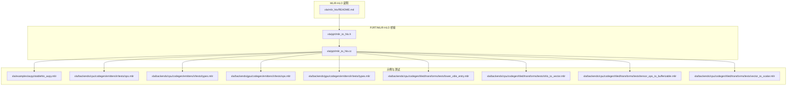
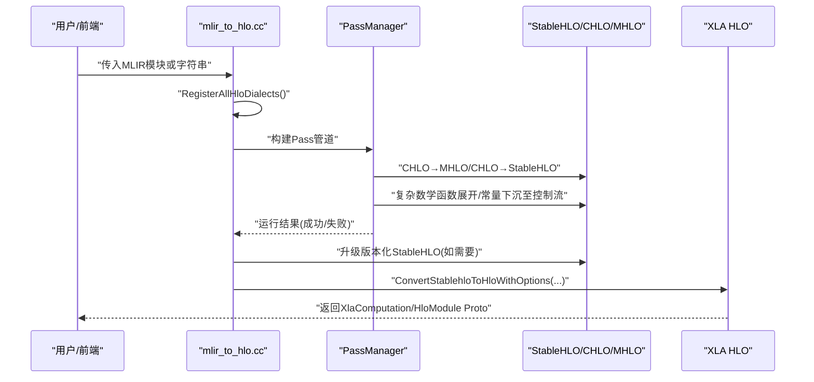
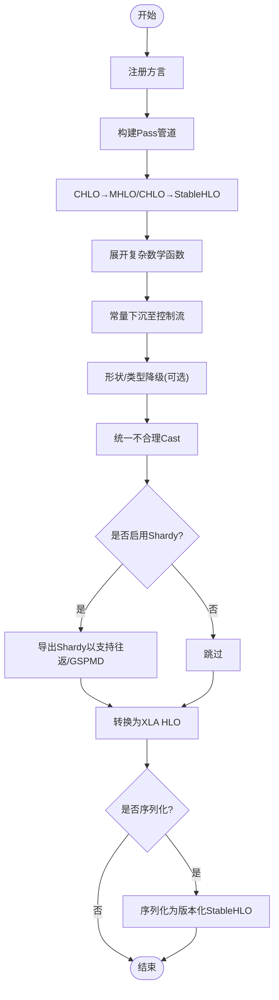
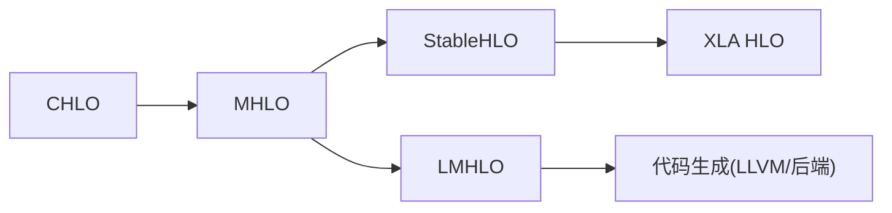
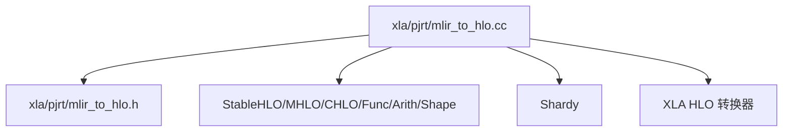

# MLIR集成

<cite>
**本文引用的文件**
- [xla\mlir_hlo\README.md](file://xla/mlir_hlo/README.md)
- [xla\pjrt\mlir_to_hlo.cc](file://xla/pjrt/mlir_to_hlo.cc)
- [xla\pjrt\mlir_to_hlo.h](file://xla/pjrt/mlir_to_hlo.h)
- [xla\examples\axpy\stablehlo_axpy.mlir](file://xla/examples/axpy/stablehlo_axpy.mlir)
- [xla\backends\cpu\codegen\emitters\ir\tests\ops.mlir](file://xla/backends/cpu/codegen/emitters/ir/tests/ops.mlir)
- [xla\backends\cpu\codegen\emitters\ir\tests\types.mlir](file://xla/backends/cpu/codegen/emitters/ir/tests\types.mlir)
- [xla\backends\cpu\codegen\tiled\transforms\tests\lower_xtile_entry.mlir](file://xla/backends/cpu/codegen/tiled/transforms/tests/lower_xtile_entry.mlir)
- [xla\backends\cpu\codegen\tiled\transforms\tests\shlo_to_vector.mlir](file://xla/backends/cpu/codegen/tiled/transforms/tests/shlo_to_vector.mlir)
- [xla\backends\cpu\codegen\tiled\transforms\tests\tensor_ops_to_bufferizable.mlir](file://xla/backends/cpu/codegen/tiled/transforms/tests/tensor_ops_to_bufferizable.mlir)
- [xla\backends\cpu\codegen\tiled\transforms\tests\vector_to_scalar.mlir](file://xla/backends/cpu/codegen/tiled/transforms/tests/vector_to_scalar.mlir)
- [xla\backends\gpu\codegen\emitters\ir\tests\ops.mlir](file://xla/backends/gpu/codegen/emitters/ir/tests/ops.mlir)
- [xla\backends\gpu\codegen\emitters\ir\tests\types.mlir](file://xla/backends/gpu/codegen/emitters/ir/tests\types.mlir)
</cite>

## 目录
1. [引言](#引言)
2. [项目结构](#项目结构)
3. [核心组件](#核心组件)
4. [架构总览](#架构总览)
5. [详细组件分析](#详细组件分析)
6. [依赖关系分析](#依赖关系分析)
7. [性能考量](#性能考量)
8. [故障排查指南](#故障排查指南)
9. [结论](#结论)
10. [附录](#附录)

## 引言
本文件面向希望理解并使用XLA与MLIR框架集成的工程师与研究者，重点覆盖以下方面：
- XLA如何通过MHLO与StableHLO方言接入MLIR生态；
- 从HLO到MLIR的转换路径、Pass管道与变换系统；
- MLIR工具链使用方法（以mlir-opt为主）与自定义Pass开发要点；
- MLIR内存模型、类型系统与属性系统在XLA中的集成方式；
- 调试工具、可视化方法与性能分析实践。

本文件严格基于仓库中现有源码与文档进行归纳总结，并通过图示帮助读者建立端到端的理解。

## 项目结构
围绕MLIR集成的关键位置与文件如下：
- MLIR-HLO项目说明与构建：xla/mlir_hlo/README.md
- MLIR到XLA计算图的转换入口与Pass管道：xla/pjrt/mlir_to_hlo.{h,cc}
- 示例与测试用MLIR IR：xla/examples/axpy/stablehlo_axpy.mlir
- 后端生成器与变换测试样例：xla/backends/*/codegen/*/{ir,transforms}/tests/*.mlir

**图表来源**
- [xla\mlir_hlo\README.md](file://xla/mlir_hlo/README.md#L1-L288)
- [xla\pjrt\mlir_to_hlo.h](file://xla/pjrt/mlir_to_hlo.h#L1-L122)
- [xla\pjrt\mlir_to_hlo.cc](file://xla/pjrt/mlir_to_hlo.cc#L1-L386)
- [xla\examples\axpy\stablehlo_axpy.mlir](file://xla/examples/axpy/stablehlo_axpy.mlir)
- [xla\backends\cpu\codegen\emitters\ir\tests\ops.mlir](file://xla/backends/cpu/codegen/emitters/ir/tests/ops.mlir)
- [xla\backends\cpu\codegen\emitters\ir\tests\types.mlir](file://xla/backends/cpu/codegen/emitters/ir/tests\types.mlir)
- [xla\backends\gpu\codegen\emitters\ir\tests\ops.mlir](file://xla/backends/gpu/codegen/emitters/ir/tests/ops.mlir)
- [xla\backends\gpu\codegen\emitters\ir\tests\types.mlir](file://xla/backends/gpu/codegen/emitters/ir/tests\types.mlir)
- [xla\backends\cpu\codegen\tiled\transforms\tests\lower_xtile_entry.mlir](file://xla/backends/cpu/codegen/tiled/transforms/tests/lower_xtile_entry.mlir)
- [xla\backends\cpu\codegen\tiled\transforms\tests\shlo_to_vector.mlir](file://xla/backends/cpu/codegen/tiled/transforms/tests/shlo_to_vector.mlir)
- [xla\backends\cpu\codegen\tiled\transforms\tests\tensor_ops_to_bufferizable.mlir](file://xla/backends/cpu/codegen/tiled/transforms/tests/tensor_ops_to_bufferizable.mlir)
- [xla\backends\cpu\codegen\tiled\transforms\tests\vector_to_scalar.mlir](file://xla/backends/cpu/codegen/tiled/transforms/tests/vector_to_scalar.mlir)

**章节来源**
- [xla\mlir_hlo\README.md](file://xla/mlir_hlo/README.md#L1-L288)
- [xla\pjrt\mlir_to_hlo.h](file://xla/pjrt/mlir_to_hlo.h#L1-L122)
- [xla\pjrt\mlir_to_hlo.cc](file://xla/pjrt/mlir_to_hlo.cc#L1-L386)

## 核心组件
- MLIR-HLO与StableHLO方言
  - MLIR-HLO项目提供CHLO、MHLO、LMHLO三类方言，用于端到端编译管线。
  - StableHLO作为可移植的序列化格式，支持版本兼容与反序列化升级。
- PJRT桥接层
  - 提供将MLIR模块解析为XLA计算图的接口，内置一系列Pass管道完成CHLO→MHLO/CHLO→StableHLO等转换。
- 示例与测试IR
  - 提供稳定的StableHLO示例与各类后端生成器/变换的测试IR，便于验证Pass效果与生成目标代码。

**章节来源**
- [xla\mlir_hlo\README.md](file://xla/mlir_hlo/README.md#L106-L288)
- [xla\pjrt\mlir_to_hlo.h](file://xla/pjrt/mlir_to_hlo.h#L37-L122)
- [xla\pjrt\mlir_to_hlo.cc](file://xla/pjrt/mlir_to_hlo.cc#L85-L386)
- [xla\examples\axpy\stablehlo_axpy.mlir](file://xla/examples/axpy/stablehlo_axpy.mlir)

## 架构总览
下图展示了从MLIR模块到XLA HLO计算图的主要流程：注册方言→执行转换Pass→序列化/反序列化→最终导出HLO。

**图表来源**
- [xla\pjrt\mlir_to_hlo.cc](file://xla/pjrt/mlir_to_hlo.cc#L85-L178)
- [xla\pjrt\mlir_to_hlo.h](file://xla/pjrt/mlir_to_hlo.h#L47-L56)

## 详细组件分析

### 组件A：从MLIR到XLA的转换流水线
- 方言注册
  - 在上下文中注册Arith、Func、Shape、MLProgram、MHLO、StableHLO、Shardy等方言，确保解析与Pass执行时可用。
- Pass管道
  - StableHLO复杂数学函数展开；
  - 将常量下沉到控制流区域（适配XLA函数式控制流）；
  - CHLO→MHLO高阶算子保留策略；
  - CHLO→StableHLO合法化；
  - 形状与类型降级（必要时）；
  - 不合理Cast统一；
  - 可选：Shardy导出以支持HLO往返或GSPMD分区。
- 序列化与版本兼容
  - 支持将模块序列化为稳定字节码或版本化StableHLO便携制品；
  - 自动选择较小版本以保证前后兼容；
  - 对不稳定方言进行检测与报错。

**图表来源**
- [xla\pjrt\mlir_to_hlo.cc](file://xla/pjrt/mlir_to_hlo.cc#L103-L178)
- [xla\pjrt\mlir_to_hlo.cc](file://xla/pjrt/mlir_to_hlo.cc#L284-L361)

**章节来源**
- [xla\pjrt\mlir_to_hlo.cc](file://xla/pjrt/mlir_to_hlo.cc#L85-L178)
- [xla\pjrt\mlir_to_hlo.cc](file://xla/pjrt/mlir_to_hlo.cc#L284-L361)
- [xla\pjrt\mlir_to_hlo.h](file://xla/pjrt/mlir_to_hlo.h#L37-L122)

### 组件B：StableHLO与MHLO方言
- 角色定位
  - CHLO：靠近前端的客户端HLO方言，支持隐式广播等特性；
  - MHLO：中间层“元”HLO，扩展动态形状与更多算子；
  - LMHLO：缓冲区域（memref）上的后期HLO，承载分配后的副作用操作；
  - StableHLO：可移植序列化格式，支持版本兼容与反序列化升级。
- 与XLA的关系
  - MHLO/MHLO→StableHLO是XLA当前主要的中间表示；
  - StableHLO可进一步导出为XLA HLO，或作为便携制品在不同版本间传递。

**图表来源**
- [xla\mlir_hlo\README.md](file://xla/mlir_hlo/README.md#L122-L244)

**章节来源**
- [xla\mlir_hlo\README.md](file://xla/mlir_hlo/README.md#L106-L244)

### 组件C：示例与测试IR
- 示例
  - xla/examples/axpy/stablehlo_axpy.mlir：StableHLO示例，适合学习与验证Pass效果。
- 测试IR
  - CPU/GPU后端的emitters与tiled transforms提供了大量测试IR，涵盖算子、类型、向量化、缓冲区化等场景，可用于验证Pass正确性与生成目标代码质量。

**章节来源**
- [xla\examples\axpy\stablehlo_axpy.mlir](file://xla/examples/axpy/stablehlo_axpy.mlir)
- [xla\backends\cpu\codegen\emitters\ir\tests\ops.mlir](file://xla/backends/cpu/codegen/emitters/ir/tests/ops.mlir)
- [xla\backends\cpu\codegen\emitters\ir\tests\types.mlir](file://xla/backends/cpu/codegen/emitters/ir/tests\types.mlir)
- [xla\backends\gpu\codegen\emitters\ir\tests\ops.mlir](file://xla/backends/gpu/codegen/emitters/ir/tests/ops.mlir)
- [xla\backends\gpu\codegen\emitters\ir\tests\types.mlir](file://xla/backends/gpu/codegen/emitters/ir/tests\types.mlir)
- [xla\backends\cpu\codegen\tiled\transforms\tests\lower_xtile_entry.mlir](file://xla/backends/cpu/codegen/tiled/transforms/tests/lower_xtile_entry.mlir)
- [xla\backends\cpu\codegen\tiled\transforms\tests\shlo_to_vector.mlir](file://xla/backends/cpu/codegen/tiled/transforms/tests/shlo_to_vector.mlir)
- [xla\backends\cpu\codegen\tiled\transforms\tests\tensor_ops_to_bufferizable.mlir](file://xla/backends/cpu/codegen/tiled/transforms/tests/tensor_ops_to_bufferizable.mlir)
- [xla\backends\cpu\codegen\tiled\transforms\tests\vector_to_scalar.mlir](file://xla/backends/cpu/codegen/tiled/transforms/tests/vector_to_scalar.mlir)

### 组件D：类型系统与属性系统集成
- 类型系统
  - 使用MLIR内置类型（如标量、张量、形状等），StableHLO/MHLO/CHLO方言对类型进行语义约束与验证。
- 属性系统
  - StableHLO/CHLO/MHLO/Func/Arith等方言提供丰富的属性（如维度、布局、sharding等），用于表达形状、并行策略与语义信息。
- 集成点
  - 在Pass中读取/修改属性以驱动变换（例如形状推导、sharding传播、向量化标记等）；在序列化阶段保留或降级属性以满足版本兼容。

**章节来源**
- [xla\pjrt\mlir_to_hlo.cc](file://xla/pjrt/mlir_to_hlo.cc#L85-L94)
- [xla\pjrt\mlir_to_hlo.h](file://xla/pjrt/mlir_to_hlo.h#L37-L51)

### 组件E：内存模型与缓冲区分配
- 内存模型
  - LMHLO阶段操作memref，体现缓冲区域与副作用（如分配、拷贝、写入）。
- 分配与调度
  - 通过调度与内存/缓冲区分配，将MHLO/LMHLO映射到具体设备内存布局与访问模式。
- 集成点
  - 生成器与变换（如向量化、循环展开、缓冲区复制转循环）在该阶段进行，以适配后端硬件特性。

**章节来源**
- [xla\mlir_hlo\README.md](file://xla/mlir_hlo/README.md#L224-L244)
- [xla\backends\cpu\codegen\tiled\transforms\tests\memref_copy_to_loops.mlir](file://xla/backends/cpu/codegen/tiled/transforms/tests/memref_copy_to_loops.mlir)

## 依赖关系分析
- 外部依赖
  - MLIR核心库（Arith、Func、Shape、MLProgram等）；
  - StableHLO与MHLO方言库；
  - Shardy方言（用于分片与网格传播）。
- 内部依赖
  - xla/pjrt/mlir_to_hlo.cc依赖StableHLO/CHLO/MHLO Pass集合与XLA HLO转换器；
  - 示例与测试IR依赖相应后端生成器与变换Pass。

**图表来源**
- [xla\pjrt\mlir_to_hlo.cc](file://xla/pjrt/mlir_to_hlo.cc#L85-L94)
- [xla\pjrt\mlir_to_hlo.h](file://xla/pjrt/mlir_to_hlo.h#L33-L34)

**章节来源**
- [xla\pjrt\mlir_to_hlo.cc](file://xla/pjrt/mlir_to_hlo.cc#L85-L94)
- [xla\pjrt\mlir_to_hlo.h](file://xla/pjrt/mlir_to_hlo.h#L33-L34)

## 性能考量
- Pass顺序与组合
  - 数学函数展开与形状/类型降级应尽量靠前，减少后续Pass的回溯成本；
  - 常量下沉到控制流有助于XLA函数式控制流优化。
- 并行与向量化
  - 利用StableHLO/MHLO属性标记并行维度与向量化级别，结合后端变换Pass提升吞吐。
- 序列化与版本兼容
  - 使用版本化StableHLO可降低跨版本传播成本，但需权衡兼容窗口与功能损失。

[本节为通用指导，不直接分析特定文件]

## 故障排查指南
- 解析失败
  - 若解析StableHLO模块失败，检查是否为版本化制品且超出兼容范围；可通过升级版本化StableHLO或调整目标版本解决。
- 不稳定方言
  - 当模块包含非StableHLO/非Shardy方言时，序列化会失败；使用FindPotentiallyUnstableDialects定位问题方言并清理。
- Pass执行失败
  - 查看诊断输出与错误码，确认Pass顺序与输入IR是否满足合法性约束；优先在最小IR上复现问题。
- Shardy/GSPMD冲突
  - 若模块包含GSPMD属性/操作而启用Shardy，需先导出Shardy再回退到GSPMD路径，避免不一致。

**章节来源**
- [xla\pjrt\mlir_to_hlo.cc](file://xla/pjrt/mlir_to_hlo.cc#L180-L203)
- [xla\pjrt\mlir_to_hlo.cc](file://xla/pjrt/mlir_to_hlo.cc#L254-L273)
- [xla\pjrt\mlir_to_hlo.cc](file://xla/pjrt/mlir_to_hlo.cc#L105-L117)
- [xla\pjrt\mlir_to_hlo.cc](file://xla/pjrt/mlir_to_hlo.cc#L231-L252)

## 结论
XLA通过StableHLO/MHLO/CHLO与Shardy等MLIR方言实现了对现代编译器基础设施的全面接入，配合完善的Pass管道与序列化机制，既保证了与XLA HLO的互通，又为未来向上游MLIR TCP演进奠定了基础。借助示例与测试IR，开发者可以快速验证与优化自己的变换与Pass。

[本节为总结性内容，不直接分析特定文件]

## 附录

### A. MLIR工具链与mlir-opt使用建议
- 基本用法
  - 使用mlir-opt加载StableHLO/MHLO/CHLO模块，按需添加Pass，输出中间态或最终IR。
- 常见Pass组合
  - CHLO→MHLO/CHLO→StableHLO合法化；
  - 复杂数学函数展开；
  - 形状/类型降级；
  - 常量下沉至控制流；
  - 不合理Cast统一。
- 输出与调试
  - 使用-v标志打印Pass执行日志；
  - 导出中间IR以便对比Pass前后差异。

[本节为通用指导，不直接分析特定文件]

### B. 自定义Pass开发要点
- 设计原则
  - 明确输入/输出方言与类型约束；
  - 保持属性与形状推导的正确性；
  - 与现有StableHLO/MHLO/CHLO/Func/Arith等方言协同工作。
- 开发流程
  - 以示例IR为基础，编写最小可复现用例；
  - 逐步添加验证与规范化逻辑；
  - 在CPU/GPU后端变换测试IR上验证跨平台行为。

[本节为通用指导，不直接分析特定文件]