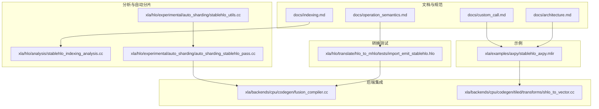
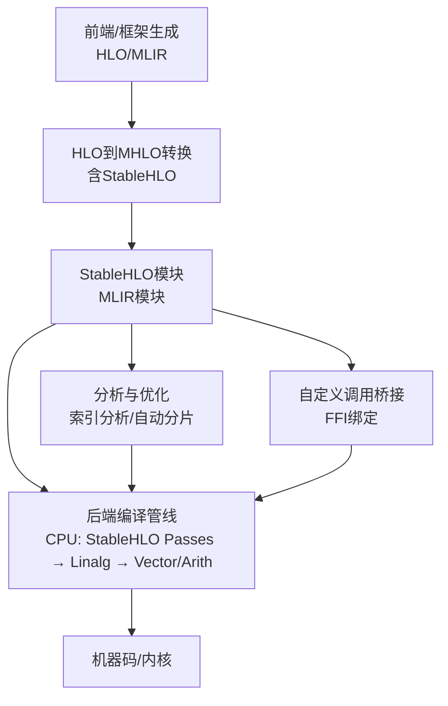
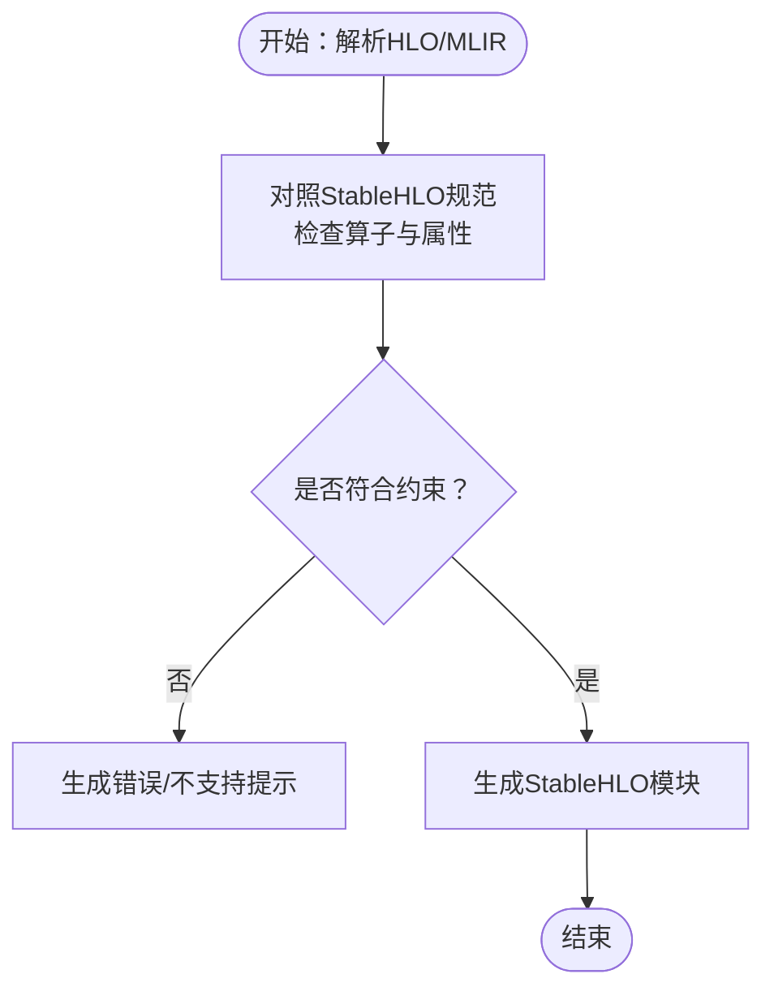
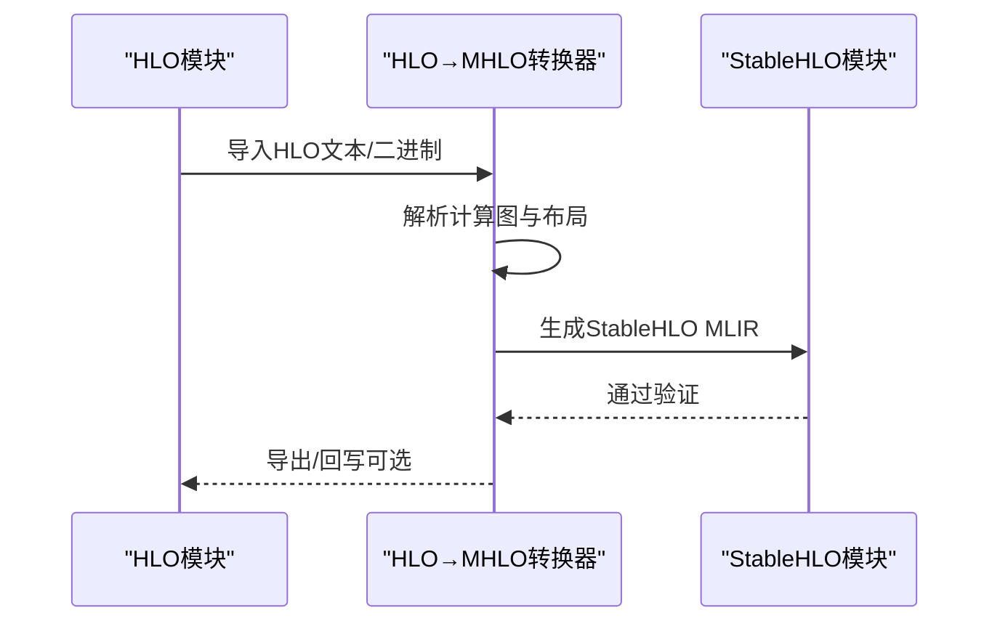
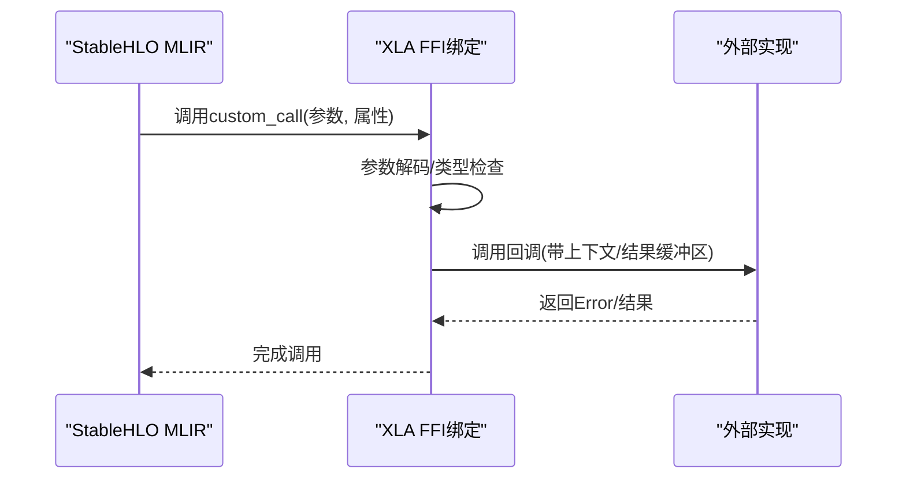
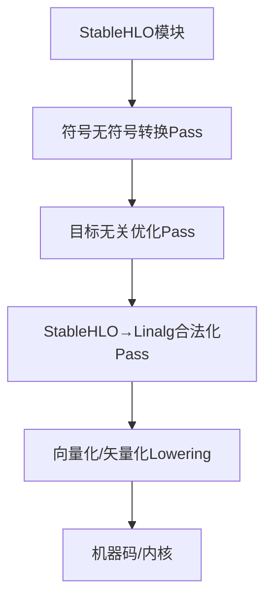
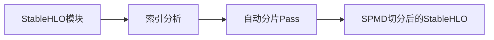
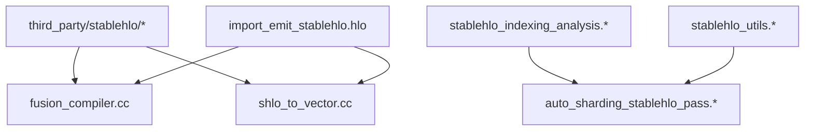

# StableHLO规范

<cite>
**本文引用的文件**
- [third_party/stablehlo/BUILD.bazel](file://third_party/stablehlo/BUILD.bazel)
- [xla/examples/axpy/stablehlo_axpy.mlir](file://xla/examples/axpy/stablehlo_axpy.mlir)
- [docs/architecture.md](file://docs/architecture.md)
- [docs/custom_call.md](file://docs/custom_call.md)
- [docs/operation_semantics.md](file://docs/operation_semantics.md)
- [docs/indexing.md](file://docs/indexing.md)
- [xla/hlo/translate/hlo_to_mhlo/tests/import_emit_stablehlo.hlo](file://xla/hlo/translate/hlo_to_mhlo/tests/import_emit_stablehlo.hlo)
- [xla/backends/cpu/codegen/fusion_compiler.cc](file://xla/backends/cpu/codegen/fusion_compiler.cc)
- [xla/backends/cpu/codegen/tiled/transforms/shlo_to_vector.cc](file://xla/backends/cpu/codegen/tiled/transforms/shlo_to_vector.cc)
- [xla/hlo/analysis/stablehlo_indexing_analysis.cc](file://xla/hlo/analysis/stablehlo_indexing_analysis.cc)
- [xla/hlo/analysis/stablehlo_indexing_analysis.h](file://xla/hlo/analysis/stablehlo_indexing_analysis.h)
- [xla/hlo/experimental/auto_sharding/auto_sharding_stablehlo_pass.cc](file://xla/hlo/experimental/auto_sharding/auto_sharding_stablehlo_pass.cc)
- [xla/hlo/experimental/auto_sharding/auto_sharding_stablehlo_pass.h](file://xla/hlo/experimental/auto_sharding/auto_sharding_stablehlo_pass.h)
- [xla/hlo/experimental/auto_sharding/stablehlo_utils.cc](file://xla/hlo/experimental/auto_sharding/stablehlo_utils.cc)
- [xla/hlo/experimental/auto_sharding/stablehlo_utils.h](file://xla/hlo/experimental/auto_sharding/stablehlo_utils.h)
- [xla/hlo/experimental/auto_sharding/stablehlo_utils_test.cc](file://xla/hlo/experimental/auto_sharding/stablehlo_utils_test.cc)
</cite>

## 目录
1. [引言](#引言)
2. [项目结构](#项目结构)
3. [核心组件](#核心组件)
4. [架构总览](#架构总览)
5. [详细组件分析](#详细组件分析)
6. [依赖关系分析](#依赖关系分析)
7. [性能考量](#性能考量)
8. [故障排查指南](#故障排查指南)
9. [结论](#结论)
10. [附录](#附录)

## 引言
本文件系统化梳理StableHLO在XLA中的角色、设计目标、操作集与语义规则、与标准HLO的转换与兼容性、版本与演进策略，并结合仓库内的示例与实现，给出验证、测试与最佳实践建议。StableHLO作为标准化的HLO方言，旨在提供稳定、可移植且可验证的中间表示，用于模型序列化、跨框架交换与编译器优化。

## 项目结构
围绕StableHLO的关键位置与职责如下：
- 文档层：提供StableHLO规范链接、操作语义映射与自定义调用说明
- 示例层：提供StableHLO MLIR示例，展示典型算子与函数结构
- 转换层：从HLO到MHLO（含StableHLO）的导入/导出测试样例
- 后端集成层：CPU后端对StableHLO的Lowering与优化Pass集成
- 分析与自动分片：针对StableHLO的索引分析与自动分片Pass
- 自定义调用：通过StableHLO自定义调用桥接外部实现

**图表来源**
- [docs/architecture.md](file://docs/architecture.md#L37-L37)
- [docs/operation_semantics.md](file://docs/operation_semantics.md#L1-L100)
- [docs/custom_call.md](file://docs/custom_call.md#L87-L92)
- [docs/indexing.md](file://docs/indexing.md#L180-L180)
- [xla/examples/axpy/stablehlo_axpy.mlir](file://xla/examples/axpy/stablehlo_axpy.mlir#L1-L10)
- [xla/hlo/translate/hlo_to_mhlo/tests/import_emit_stablehlo.hlo](file://xla/hlo/translate/hlo_to_mhlo/tests/import_emit_stablehlo.hlo#L1-L50)
- [xla/backends/cpu/codegen/fusion_compiler.cc](file://xla/backends/cpu/codegen/fusion_compiler.cc#L99-L102)
- [xla/backends/cpu/codegen/tiled/transforms/shlo_to_vector.cc](file://xla/backends/cpu/codegen/tiled/transforms/shlo_to_vector.cc#L46-L46)
- [xla/hlo/analysis/stablehlo_indexing_analysis.cc](file://xla/hlo/analysis/stablehlo_indexing_analysis.cc#L1-L50)
- [xla/hlo/experimental/auto_sharding/auto_sharding_stablehlo_pass.cc](file://xla/hlo/experimental/auto_sharding/auto_sharding_stablehlo_pass.cc#L1-L50)
- [xla/hlo/experimental/auto_sharding/stablehlo_utils.cc](file://xla/hlo/experimental/auto_sharding/stablehlo_utils.cc#L1-L50)

**章节来源**
- [docs/architecture.md](file://docs/architecture.md#L37-L37)
- [docs/operation_semantics.md](file://docs/operation_semantics.md#L1-L100)
- [docs/custom_call.md](file://docs/custom_call.md#L87-L92)
- [docs/indexing.md](file://docs/indexing.md#L180-L180)
- [xla/examples/axpy/stablehlo_axpy.mlir](file://xla/examples/axpy/stablehlo_axpy.mlir#L1-L10)
- [xla/hlo/translate/hlo_to_mhlo/tests/import_emit_stablehlo.hlo](file://xla/hlo/translate/hlo_to_mhlo/tests/import_emit_stablehlo.hlo#L1-L50)
- [xla/backends/cpu/codegen/fusion_compiler.cc](file://xla/backends/cpu/codegen/fusion_compiler.cc#L99-L102)
- [xla/backends/cpu/codegen/tiled/transforms/shlo_to_vector.cc](file://xla/backends/cpu/codegen/tiled/transforms/shlo_to_vector.cc#L46-L46)
- [xla/hlo/analysis/stablehlo_indexing_analysis.cc](file://xla/hlo/analysis/stablehlo_indexing_analysis.cc#L1-L50)
- [xla/hlo/experimental/auto_sharding/auto_sharding_stablehlo_pass.cc](file://xla/hlo/experimental/auto_sharding/auto_sharding_stablehlo_pass.cc#L1-L50)
- [xla/hlo/experimental/auto_sharding/stablehlo_utils.cc](file://xla/hlo/experimental/auto_sharding/stablehlo_utils.cc#L1-L50)

## 核心组件
- 规范与语义映射
  - 文档明确StableHLO与HLO操作的对应关系与差异，例如某些HLO内部原语不进入StableHLO。
- 操作集与属性
  - 通过测试样例可见StableHLO包含丰富的算子族，如归约、广播、卷积、比较、自定义调用等；属性涵盖维度标注、精度配置、通道句柄等。
- 转换与兼容性
  - 提供从HLO到StableHLO的导入/导出测试，确保语义一致性与布局信息保留。
- 后端Lowering与优化
  - CPU后端集成StableHLO Pass链，包括符号无符号转换、目标无关优化、Linalg合法化等。
- 分析与自动分片
  - 针对StableHLO的索引分析与自动分片Pass，支撑大规模并行与SPMD场景。
- 自定义调用
  - 通过StableHLO自定义调用桥接外部实现，支持属性解码与运行时参数约束。

**章节来源**
- [docs/operation_semantics.md](file://docs/operation_semantics.md#L1-L100)
- [xla/hlo/translate/hlo_to_mhlo/tests/import_emit_stablehlo.hlo](file://xla/hlo/translate/hlo_to_mhlo/tests/import_emit_stablehlo.hlo#L1-L50)
- [docs/custom_call.md](file://docs/custom_call.md#L87-L92)
- [xla/backends/cpu/codegen/fusion_compiler.cc](file://xla/backends/cpu/codegen/fusion_compiler.cc#L268-L363)
- [xla/hlo/analysis/stablehlo_indexing_analysis.cc](file://xla/hlo/analysis/stablehlo_indexing_analysis.cc#L1-L50)
- [xla/hlo/experimental/auto_sharding/auto_sharding_stablehlo_pass.cc](file://xla/hlo/experimental/auto_sharding/auto_sharding_stablehlo_pass.cc#L1-L50)

## 架构总览
StableHLO在XLA中的位置与交互如下：

**图表来源**
- [docs/architecture.md](file://docs/architecture.md#L37-L37)
- [xla/backends/cpu/codegen/fusion_compiler.cc](file://xla/backends/cpu/codegen/fusion_compiler.cc#L99-L102)
- [xla/backends/cpu/codegen/tiled/transforms/shlo_to_vector.cc](file://xla/backends/cpu/codegen/tiled/transforms/shlo_to_vector.cc#L126-L136)
- [docs/custom_call.md](file://docs/custom_call.md#L87-L92)

## 详细组件分析

### 组件A：StableHLO操作语义与约束
- 设计目标
  - 提供稳定、可移植的中间表示，便于跨框架交换与长期维护。
  - 通过明确的属性与维度标注，确保布局与并行语义可被下游编译器正确理解。
- 约束与差异
  - 文档指出部分HLO内部原语（如特定Start/Done变体、Bitcast等）不在StableHLO中出现，避免引入不稳定细节。
- 典型算子族
  - 归约类：all_reduce、reduce_scatter、all_gather等
  - 变换类：broadcast_in_dim、transpose、reshape等
  - 计算类：convolution、dot_general、算术/逻辑/比较运算
  - 控制流与元数据：create_token、after_all、tuple、get_tuple_element
  - 自定义扩展：custom_call（通过FFI绑定）
- 语义规则
  - 维度标注与窗口参数需满足布局与步幅约束
  - 精度配置与容差控制（如result_accuracy）影响数值稳定性
  - 令牌与元数据在StableHLO中以专用类型与算子表达

**图表来源**
- [docs/operation_semantics.md](file://docs/operation_semantics.md#L1-L100)
- [xla/hlo/translate/hlo_to_mhlo/tests/import_emit_stablehlo.hlo](file://xla/hlo/translate/hlo_to_mhlo/tests/import_emit_stablehlo.hlo#L1-L50)

**章节来源**
- [docs/operation_semantics.md](file://docs/operation_semantics.md#L1-L100)
- [xla/hlo/translate/hlo_to_mhlo/tests/import_emit_stablehlo.hlo](file://xla/hlo/translate/hlo_to_mhlo/tests/import_emit_stablehlo.hlo#L1-L50)

### 组件B：StableHLO与HLO的转换与兼容性
- 转换流程
  - 通过导入/导出测试样例，验证HLO到StableHLO的映射与回写一致性。
  - 关键点：布局、维度标注、通道句柄、全局设备ID标志等属性的保留与规范化。
- 兼容性保证
  - 文档强调StableHLO作为标准化方言，提供稳定的语义边界，避免HLO内部不稳定细节外显。
  - 对于不支持的HLO原语，应通过分解或替代方案映射至StableHLO。

**图表来源**
- [xla/hlo/translate/hlo_to_mhlo/tests/import_emit_stablehlo.hlo](file://xla/hlo/translate/hlo_to_mhlo/tests/import_emit_stablehlo.hlo#L1-L50)
- [docs/architecture.md](file://docs/architecture.md#L37-L37)

**章节来源**
- [xla/hlo/translate/hlo_to_mhlo/tests/import_emit_stablehlo.hlo](file://xla/hlo/translate/hlo_to_mhlo/tests/import_emit_stablehlo.hlo#L1-L50)
- [docs/architecture.md](file://docs/architecture.md#L37-L37)

### 组件C：StableHLO自定义调用与FFI绑定
- 自定义调用
  - 使用StableHLO的custom_call操作声明外部实现，通过backend_config传递属性。
- FFI绑定
  - 支持缓冲区参数/结果、变参、枚举与结构化属性解码，以及平台上下文（如GPU流）注入。
- 运行时约束
  - 结果采用目的地传递风格，由运行时分配缓冲区；Handler负责类型检查与错误返回。

**图表来源**
- [docs/custom_call.md](file://docs/custom_call.md#L87-L92)
- [docs/custom_call.md](file://docs/custom_call.md#L175-L177)
- [docs/custom_call.md](file://docs/custom_call.md#L193-L201)

**章节来源**
- [docs/custom_call.md](file://docs/custom_call.md#L87-L92)
- [docs/custom_call.md](file://docs/custom_call.md#L175-L177)
- [docs/custom_call.md](file://docs/custom_call.md#L193-L201)

### 组件D：StableHLO后端Lowering与优化
- CPU后端集成
  - 在融合编译器中引入StableHLO Pass，包括符号无符号转换、目标无关优化、Linalg合法化等。
- 向量/算子Lowering
  - 将StableHLO算子（如dot_general、transpose、reduce、broadcast等）Lowering到Vector/Linalg/Arith。
- 性能优化
  - 通过StableHLO阶段的通用优化减少后续Lowering复杂度，提升向量化与并行效率。

**图表来源**
- [xla/backends/cpu/codegen/fusion_compiler.cc](file://xla/backends/cpu/codegen/fusion_compiler.cc#L268-L363)
- [xla/backends/cpu/codegen/tiled/transforms/shlo_to_vector.cc](file://xla/backends/cpu/codegen/tiled/transforms/shlo_to_vector.cc#L126-L136)

**章节来源**
- [xla/backends/cpu/codegen/fusion_compiler.cc](file://xla/backends/cpu/codegen/fusion_compiler.cc#L99-L102)
- [xla/backends/cpu/codegen/fusion_compiler.cc](file://xla/backends/cpu/codegen/fusion_compiler.cc#L268-L363)
- [xla/backends/cpu/codegen/tiled/transforms/shlo_to_vector.cc](file://xla/backends/cpu/codegen/tiled/transforms/shlo_to_vector.cc#L126-L136)

### 组件E：StableHLO分析与自动分片
- 索引分析
  - 针对StableHLO的索引分析用于推导数据访问模式与并行维度。
- 自动分片Pass
  - 基于StableHLO的布局与维度标注，生成SPMD切分与通信模式，提升大规模并行效率。

**图表来源**
- [xla/hlo/analysis/stablehlo_indexing_analysis.cc](file://xla/hlo/analysis/stablehlo_indexing_analysis.cc#L1-L50)
- [xla/hlo/experimental/auto_sharding/auto_sharding_stablehlo_pass.cc](file://xla/hlo/experimental/auto_sharding/auto_sharding_stablehlo_pass.cc#L1-L50)
- [xla/hlo/experimental/auto_sharding/stablehlo_utils.cc](file://xla/hlo/experimental/auto_sharding/stablehlo_utils.cc#L1-L50)

**章节来源**
- [xla/hlo/analysis/stablehlo_indexing_analysis.cc](file://xla/hlo/analysis/stablehlo_indexing_analysis.cc#L1-L50)
- [xla/hlo/experimental/auto_sharding/auto_sharding_stablehlo_pass.cc](file://xla/hlo/experimental/auto_sharding/auto_sharding_stablehlo_pass.cc#L1-L50)
- [xla/hlo/experimental/auto_sharding/stablehlo_utils.cc](file://xla/hlo/experimental/auto_sharding/stablehlo_utils.cc#L1-L50)

### 组件F：StableHLO示例与使用
- 示例文件展示了StableHLO函数定义、基本算子（如broadcast_in_dim、multiply、add）与返回值结构。
- 该示例可用于学习StableHLO语法、参数与返回类型标注，以及与MLIR函数的对应关系。

**章节来源**
- [xla/examples/axpy/stablehlo_axpy.mlir](file://xla/examples/axpy/stablehlo_axpy.mlir#L1-L10)

## 依赖关系分析
- 外部依赖
  - StableHLO Dialect与相关Pass位于third_party/stablehlo，XLA通过头文件与Pass注册接入。
- 内部耦合
  - HLO→MHLO转换测试驱动StableHLO的导入/导出行为，确保与文档规范一致。
  - CPU后端Pass链依赖StableHLO的符号无符号转换与Linalg合法化，以获得更好的向量化效果。
- 分析与自动分片
  - 索引分析与自动分片Pass依赖StableHLO的布局与维度标注，形成闭环优化。

**图表来源**
- [third_party/stablehlo/BUILD.bazel](file://third_party/stablehlo/BUILD.bazel#L1-L1)
- [xla/backends/cpu/codegen/fusion_compiler.cc](file://xla/backends/cpu/codegen/fusion_compiler.cc#L99-L102)
- [xla/backends/cpu/codegen/tiled/transforms/shlo_to_vector.cc](file://xla/backends/cpu/codegen/tiled/transforms/shlo_to_vector.cc#L46-L46)
- [xla/hlo/translate/hlo_to_mhlo/tests/import_emit_stablehlo.hlo](file://xla/hlo/translate/hlo_to_mhlo/tests/import_emit_stablehlo.hlo#L1-L50)
- [xla/hlo/analysis/stablehlo_indexing_analysis.cc](file://xla/hlo/analysis/stablehlo_indexing_analysis.cc#L1-L50)
- [xla/hlo/experimental/auto_sharding/auto_sharding_stablehlo_pass.cc](file://xla/hlo/experimental/auto_sharding/auto_sharding_stablehlo_pass.cc#L1-L50)
- [xla/hlo/experimental/auto_sharding/stablehlo_utils.cc](file://xla/hlo/experimental/auto_sharding/stablehlo_utils.cc#L1-L50)

**章节来源**
- [third_party/stablehlo/BUILD.bazel](file://third_party/stablehlo/BUILD.bazel#L1-L1)
- [xla/backends/cpu/codegen/fusion_compiler.cc](file://xla/backends/cpu/codegen/fusion_compiler.cc#L99-L102)
- [xla/backends/cpu/codegen/tiled/transforms/shlo_to_vector.cc](file://xla/backends/cpu/codegen/tiled/transforms/shlo_to_vector.cc#L46-L46)
- [xla/hlo/translate/hlo_to_mhlo/tests/import_emit_stablehlo.hlo](file://xla/hlo/translate/hlo_to_mhlo/tests/import_emit_stablehlo.hlo#L1-L50)
- [xla/hlo/analysis/stablehlo_indexing_analysis.cc](file://xla/hlo/analysis/stablehlo_indexing_analysis.cc#L1-L50)
- [xla/hlo/experimental/auto_sharding/auto_sharding_stablehlo_pass.cc](file://xla/hlo/experimental/auto_sharding/auto_sharding_stablehlo_pass.cc#L1-L50)
- [xla/hlo/experimental/auto_sharding/stablehlo_utils.cc](file://xla/hlo/experimental/auto_sharding/stablehlo_utils.cc#L1-L50)

## 性能考量
- StableHLO阶段优化
  - 通过目标无关优化与Linalg合法化降低后续向量化难度，提升整体吞吐。
- 向量化与并行
  - dot_general、transpose、reduce等算子的Lowering直接影响SIMD/向量指令利用率。
- 自动分片
  - 基于StableHLO布局的SPMD切分与通信生成，有助于大规模集群上的高效并行。

[本节为通用指导，无需具体文件分析]

## 故障排查指南
- 自定义调用失败
  - 检查backend_config属性解码是否与Handler签名匹配；确认返回Error的路径与错误码。
- Lowering异常
  - 确认StableHLO Pass顺序与启用选项（如enablePrimitiveOps），定位在StableHLO→Linalg阶段的问题。
- 索引/分片问题
  - 核对维度标注与布局信息，确保索引分析与自动分片Pass输入与StableHLO模块一致。

**章节来源**
- [docs/custom_call.md](file://docs/custom_call.md#L50-L76)
- [xla/backends/cpu/codegen/fusion_compiler.cc](file://xla/backends/cpu/codegen/fusion_compiler.cc#L357-L363)
- [xla/hlo/analysis/stablehlo_indexing_analysis.cc](file://xla/hlo/analysis/stablehlo_indexing_analysis.cc#L1-L50)

## 结论
StableHLO在XLA中承担标准化中间表示的角色，通过严格的语义与属性约束，确保跨框架交换与长期维护的稳定性。文档、示例、转换测试与后端集成共同构成了从规范到实现的完整闭环。配合索引分析与自动分片，StableHLO为大规模并行与高性能编译提供了坚实基础。

[本节为总结性内容，无需具体文件分析]

## 附录
- 版本与演进策略
  - 文档未直接给出版本号，但StableHLO自定义调用文档提及PJRT式版本化与未来稳定性承诺，表明其遵循实验期→稳定期的演进路径。
- 最佳实践
  - 使用StableHLO自定义调用时，优先采用明确的属性解码与缓冲区约束，减少运行时开销与不确定性。
  - 在StableHLO阶段完成尽可能多的通用优化，再进行Lowering，以获得更优的向量化与并行效果。

**章节来源**
- [docs/custom_call.md](file://docs/custom_call.md#L12-L15)