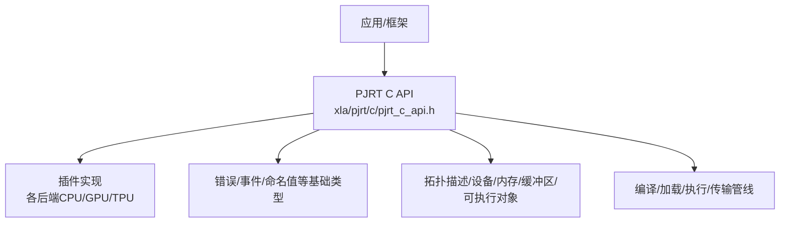
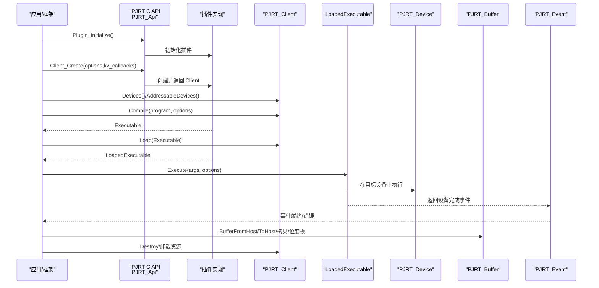
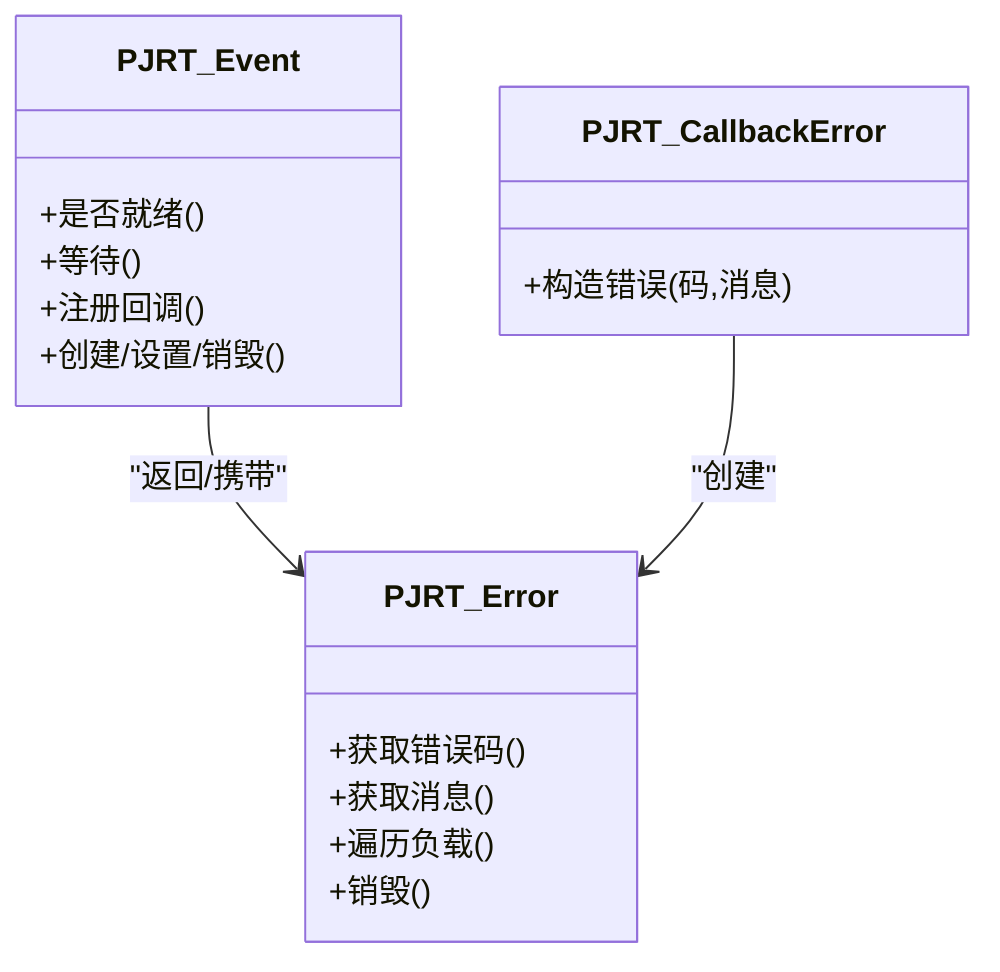
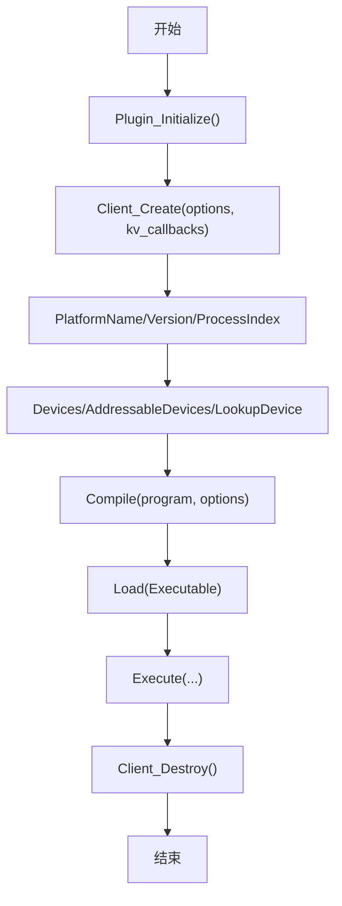
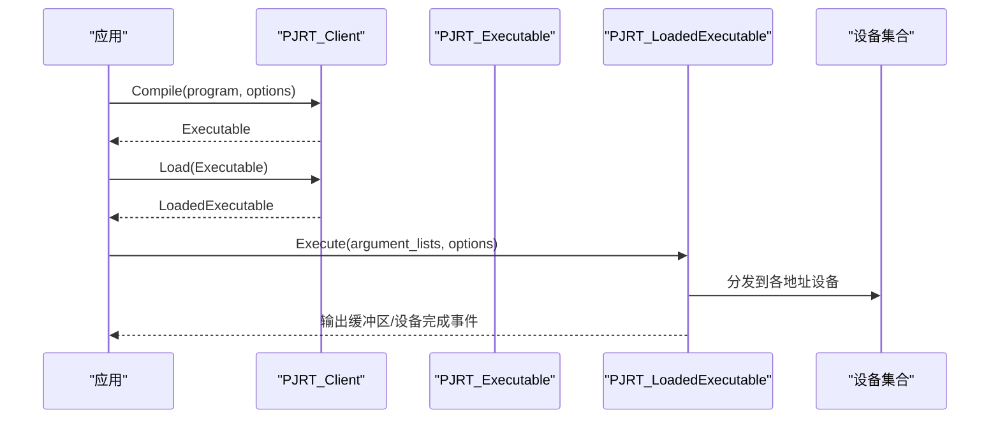
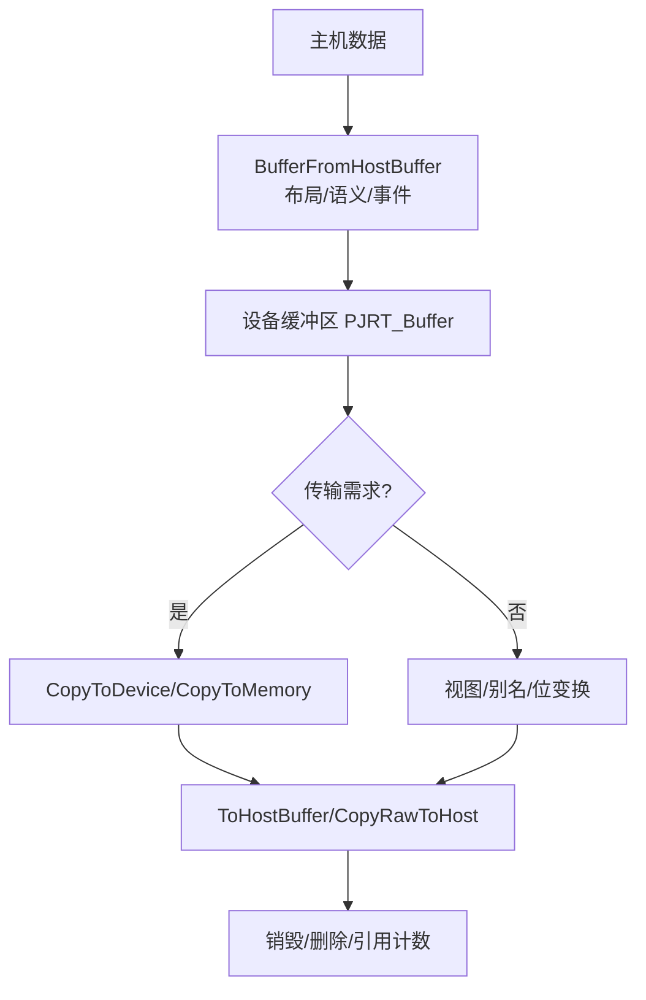
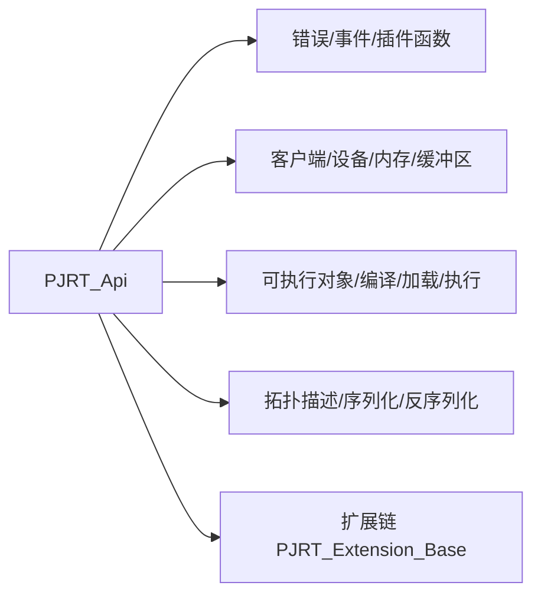

# C API接口

<cite>
**本文引用的文件**
- [xla\pjrt\c\pjrt_c_api.h](file://xla/pjrt/c/pjrt_c_api.h)
- [xla\c\c_api_decl.h](file://xla/c/c_api_decl.h)
- [xla\pjrt\c\README.md](file://xla/pjrt/c/README.md)
- [docs\pjrt\index.md](file://docs/pjrt/index.md)
- [docs\pjrt\examples.md](file://docs/pjrt/examples.md)
</cite>

## 目录
1. [简介](#简介)
2. [项目结构](#项目结构)
3. [核心组件](#核心组件)
4. [架构总览](#架构总览)
5. [详细组件分析](#详细组件分析)
6. [依赖关系分析](#依赖关系分析)
7. [性能考量](#性能考量)
8. [故障排查指南](#故障排查指南)
9. [结论](#结论)
10. [附录](#附录)

## 简介
本文件为 OpenXLA/XLA 的 PJRT C API 提供系统化、可操作的接口文档。内容覆盖：
- 函数接口定义与调用流程
- 数据结构与枚举类型
- 设备初始化、编译器配置、执行器创建与内存管理
- 错误处理机制与线程安全注意事项
- 多后端（CPU/GPU/TPU）集成要点
- 基于 C API 的 XLA 程序编译与执行示例路径指引

## 项目结构
PJRT C API 的核心接口定义位于 xla/pjrt/c/pjrt_c_api.h，配套的扩展与示例文档位于 xla/pjrt/c/ 与 docs/pjrt/ 目录中；XLA 层面的 C 接口声明位于 xla/c/c_api_decl.h。

图表来源
- [xla\pjrt\c\pjrt_c_api.h](file://xla/pjrt/c/pjrt_c_api.h#L1-L120)
- [xla\c\c_api_decl.h](file://xla/c/c_api_decl.h#L1-L30)

章节来源
- [xla\pjrt\c\README.md](file://xla/pjrt/c/README.md#L1-L24)
- [docs\pjrt\index.md](file://docs/pjrt/index.md#L1-L32)

## 核心组件
- 插件与平台抽象：通过 PJRT_Api 结构体暴露统一入口，按需填充各后端能力。
- 客户端生命周期：Plugin 初始化 → Client 创建 → 设备/拓扑查询 → 编译/加载/执行 → 资源销毁。
- 执行上下文与事件：异步执行通过 PJRT_Event 表达完成状态与错误。
- 缓冲区与内存：主机/设备/内存空间之间的数据传输与视图管理。
- 拓扑与设备：描述硬件拓扑、设备属性与默认内存空间。

章节来源
- [xla\pjrt\c\pjrt_c_api.h](file://xla/pjrt/c/pjrt_c_api.h#L2898-L3078)
- [xla\pjrt\c\pjrt_c_api.h](file://xla/pjrt/c/pjrt_c_api.h#L289-L380)

## 架构总览
下图展示了从应用到后端插件的调用链路与关键对象交互：

图表来源
- [xla\pjrt\c\pjrt_c_api.h](file://xla/pjrt/c/pjrt_c_api.h#L2917-L2930)
- [xla\pjrt\c\pjrt_c_api.h](file://xla/pjrt/c/pjrt_c_api.h#L712-L744)
- [xla\pjrt\c\pjrt_c_api.h](file://xla/pjrt/c/pjrt_c_api.h#L1969-L2006)
- [xla\pjrt\c\pjrt_c_api.h](file://xla/pjrt/c/pjrt_c_api.h#L1165-L1211)

## 详细组件分析

### 1) 错误处理与事件模型
- 错误对象 PJRT_Error：统一承载错误码与消息，调用者负责释放。
- 事件 PJRT_Event：表达异步工作完成或错误，支持轮询、等待、回调。
- 回调错误构造器 PJRT_CallbackError：在回调中构造错误对象。

图表来源
- [xla\pjrt\c\pjrt_c_api.h](file://xla/pjrt/c/pjrt_c_api.h#L126-L216)
- [xla\pjrt\c\pjrt_c_api.h](file://xla/pjrt/c/pjrt_c_api.h#L272-L380)

章节来源
- [xla\pjrt\c\pjrt_c_api.h](file://xla/pjrt/c/pjrt_c_api.h#L126-L216)
- [xla\pjrt\c\pjrt_c_api.h](file://xla/pjrt/c/pjrt_c_api.h#L272-L380)

### 2) 插件与客户端生命周期
- 插件初始化：Plugin_Initialize（一次性）
- 客户端创建：Client_Create（可选传入键值存储回调）
- 平台信息：PlatformName/Version/ProcessIndex
- 设备与拓扑：Devices/AddressableDevices/LookupDevice/LookupAddressableDevice
- 资源销毁：Client_Destroy

图表来源
- [xla\pjrt\c\pjrt_c_api.h](file://xla/pjrt/c/pjrt_c_api.h#L247-L271)
- [xla\pjrt\c\pjrt_c_api.h](file://xla/pjrt/c/pjrt_c_api.h#L480-L508)
- [xla\pjrt\c\pjrt_c_api.h](file://xla/pjrt/c/pjrt_c_api.h#L578-L637)
- [xla\pjrt\c\pjrt_c_api.h](file://xla/pjrt/c/pjrt_c_api.h#L712-L744)

章节来源
- [xla\pjrt\c\pjrt_c_api.h](file://xla/pjrt/c/pjrt_c_api.h#L247-L271)
- [xla\pjrt\c\pjrt_c_api.h](file://xla/pjrt/c/pjrt_c_api.h#L480-L508)
- [xla\pjrt\c\pjrt_c_api.h](file://xla/pjrt/c/pjrt_c_api.h#L578-L637)

### 3) 编译与执行
- 编译：Client_Compile 或 TopologyDescription + Compile
- 加载：Client_Load
- 执行：LoadedExecutable_Execute（支持多设备、多参数、输出缓冲区、设备完成事件）
- 可选：ExecuteOptions 中的 send/recv 回调、launch_id、非捐赠输入索引、MultiSlice 配置等

图表来源
- [xla\pjrt\c\pjrt_c_api.h](file://xla/pjrt/c/pjrt_c_api.h#L712-L744)
- [xla\pjrt\c\pjrt_c_api.h](file://xla/pjrt/c/pjrt_c_api.h#L731-L744)
- [xla\pjrt\c\pjrt_c_api.h](file://xla/pjrt/c/pjrt_c_api.h#L1969-L2006)

章节来源
- [xla\pjrt\c\pjrt_c_api.h](file://xla/pjrt/c/pjrt_c_api.h#L712-L744)
- [xla\pjrt\c\pjrt_c_api.h](file://xla/pjrt/c/pjrt_c_api.h#L1969-L2006)

### 4) 内存与缓冲区管理
- 主机到设备：BufferFromHostBuffer（支持布局、语义、事件）
- 设备到主机：ToHostBuffer/CopyRawToHost/CopyRawToHostFuture
- 设备间/内存间复制：CopyToDevice/CopyToMemory
- 视图与别名：CreateViewOfDeviceBuffer/CreateAliasBuffer/FulfillAliasBuffer
- 销毁与删除：Buffer_Destroy/Delete/IsDeleted
- 外部引用计数：Increase/DecreaseExternalReferenceCount
- 不安全指针与位变换：UnsafePointer/Bitcast

图表来源
- [xla\pjrt\c\pjrt_c_api.h](file://xla/pjrt/c/pjrt_c_api.h#L1165-L1211)
- [xla\pjrt\c\pjrt_c_api.h](file://xla/pjrt/c/pjrt_c_api.h#L2348-L2399)
- [xla\pjrt\c\pjrt_c_api.h](file://xla/pjrt/c/pjrt_c_api.h#L2463-L2511)

章节来源
- [xla\pjrt\c\pjrt_c_api.h](file://xla/pjrt/c/pjrt_c_api.h#L1165-L1211)
- [xla\pjrt\c\pjrt_c_api.h](file://xla/pjrt/c/pjrt_c_api.h#L2348-L2399)
- [xla\pjrt\c\pjrt_c_api.h](file://xla/pjrt/c/pjrt_c_api.h#L2463-L2511)

### 5) 拓扑与设备描述
- 拓扑：TopologyDescription_Create/Destroy/Serialize/Deserialize/Attributes/Fingerprint
- 设备描述：DeviceDescription_Id/ProcessIndex/Attributes/Kind/DebugString/ToString
- 设备：GetDescription/IsAddressable/LocalHardwareId/AddressableMemories/DefaultMemory/MemoryStats

章节来源
- [xla\pjrt\c\pjrt_c_api.h](file://xla/pjrt/c/pjrt_c_api.h#L2727-L2870)
- [xla\pjrt\c\pjrt_c_api.h](file://xla/pjrt/c/pjrt_c_api.h#L1288-L1376)
- [xla\pjrt\c\pjrt_c_api.h](file://xla/pjrt/c/pjrt_c_api.h#L1379-L1491)

### 6) 关键数据结构与枚举

- 错误码（基于 Abseil 状态码）
- 命名值（字符串/整型/整型数组/浮点/布尔）
- 设备缓冲区元素类型（标量/复数/低精度/令牌等）
- 主机缓冲区语义（只读/传输完成前不变/零拷贝不可变/零拷贝可变）
- 内存布局（平铺/步幅）

章节来源
- [xla\pjrt\c\pjrt_c_api.h](file://xla/pjrt/c/pjrt_c_api.h#L159-L178)
- [xla\pjrt\c\pjrt_c_api.h](file://xla/pjrt/c/pjrt_c_api.h#L219-L245)
- [xla\pjrt\c\pjrt_c_api.h](file://xla/pjrt/c/pjrt_c_api.h#L888-L952)
- [xla\pjrt\c\pjrt_c_api.h](file://xla/pjrt/c/pjrt_c_api.h#L954-L987)
- [xla\pjrt\c\pjrt_c_api.h](file://xla/pjrt/c/pjrt_c_api.h#L1027-L1036)

### 7) 示例与使用路径
- JAX CUDA 插件示例路径：[示例参考](file://docs/pjrt/examples.md#L3-L8)
- 框架侧集成参考：JAX/GoMLX/ZML 等
- 硬件插件实现参考：XLA CPU/GPU/TPU 插件与第三方实现

章节来源
- [docs\pjrt\examples.md](file://docs/pjrt/examples.md#L1-L39)
- [docs\pjrt\index.md](file://docs/pjrt/index.md#L19-L30)

## 依赖关系分析
- 版本与兼容性：通过 PJRT_Api_Version.major/minor 与结构体大小检查实现前后向兼容。
- 扩展机制：PJRT_Extension_Base 链表用于承载后端特定扩展（如 GPU 自定义调用、布局扩展、收集通信等）。
- API 结构体：PJRT_Api 将所有函数指针集中管理，便于动态加载与版本匹配。

图表来源
- [xla\pjrt\c\pjrt_c_api.h](file://xla/pjrt/c/pjrt_c_api.h#L2898-L3078)
- [xla\pjrt\c\pjrt_c_api.h](file://xla/pjrt/c/pjrt_c_api.h#L81-L89)

章节来源
- [xla\pjrt\c\pjrt_c_api.h](file://xla/pjrt/c/pjrt_c_api.h#L91-L124)
- [xla\pjrt\c\pjrt_c_api.h](file://xla/pjrt/c/pjrt_c_api.h#L81-L89)
- [xla\pjrt\c\pjrt_c_api.h](file://xla/pjrt/c/pjrt_c_api.h#L2898-L3078)

## 性能考量
- 异步执行与事件：优先使用事件模型避免阻塞，合理设置设备完成事件以并行化后续步骤。
- 零拷贝与语义选择：根据数据生命周期选择合适的 HostBufferSemantics，减少不必要的内存拷贝。
- 流式传输：CopyToDeviceStream 支持分块传输，注意粒度对齐与总字节数限制。
- 内存统计：Device_MemoryStats/CompiledMemoryStats 有助于估算峰值占用与优化分配策略。
- 多设备/多副本：通过 ExecuteOptions.launch_id 与设备分配信息协调分布式执行顺序与一致性。

[本节为通用指导，不直接分析具体文件]

## 故障排查指南
- 错误诊断：使用 Error_Message/Error_GetCode 获取人类可读错误与错误码；通过 Error_ForEachPayload 获取附加负载信息。
- 事件状态：Event_IsReady/Event_Error/Event_Await 用于判断异步任务完成与错误；Event_OnReady 注册回调处理完成通知。
- 设备/内存状态：Device_MemoryStats/Memory_DebugString/Memory_ToString 用于定位设备/内存问题。
- 执行注入：Device_PoisonExecution 可用于调试场景提前使执行失败并携带错误信息。
- 线程安全：KV 存储回调要求线程安全，避免跨插件键冲突；回调中使用的字符串仅在回调期间有效，需自行复制保存。

章节来源
- [xla\pjrt\c\pjrt_c_api.h](file://xla/pjrt/c/pjrt_c_api.h#L126-L216)
- [xla\pjrt\c\pjrt_c_api.h](file://xla/pjrt/c/pjrt_c_api.h#L272-L380)
- [xla\pjrt\c\pjrt_c_api.h](file://xla/pjrt/c/pjrt_c_api.h#L1444-L1491)
- [xla\pjrt\c\pjrt_c_api.h](file://xla/pjrt/c/pjrt_c_api.h#L1493-L1516)

## 结论
PJRT C API 提供了统一、可扩展且跨后端一致的设备编程接口。通过清晰的生命周期管理、完善的错误与事件模型、灵活的缓冲区与内存传输机制，以及版本化的扩展与兼容性设计，开发者可以高效地在 CPU/GPU/TPU 等平台上构建 XLA 程序的编译与执行流水线。建议在实际集成时：
- 明确插件初始化与客户端创建流程
- 使用事件模型管理异步执行
- 合理选择缓冲区语义与传输方式
- 利用内存统计与调试接口优化性能与稳定性

[本节为总结性内容，不直接分析具体文件]

## 附录

### A. 设备初始化与编译器配置要点
- 插件初始化：确保 Plugin_Initialize 在任何其他 API 调用之前被调用。
- 客户端创建：根据后端特性传入 create_options 与 KV 回调；多进程/多节点场景可利用 KV 接口共享信息。
- 编译选项：CompileOptionsProto 由调用方序列化传入，确保与后端版本兼容。

章节来源
- [xla\pjrt\c\pjrt_c_api.h](file://xla/pjrt/c/pjrt_c_api.h#L247-L271)
- [xla\pjrt\c\pjrt_c_api.h](file://xla/pjrt/c/pjrt_c_api.h#L480-L508)
- [xla\pjrt\c\pjrt_c_api.h](file://xla/pjrt/c/pjrt_c_api.h#L712-L725)

### B. 执行器创建与执行流程
- 先 Compile 再 Load，随后通过 LoadedExecutable_Execute 执行。
- ExecuteOptions 支持 send/recv 回调、launch_id、非捐赠输入索引、MultiSlice 配置等高级特性。

章节来源
- [xla\pjrt\c\pjrt_c_api.h](file://xla/pjrt/c/pjrt_c_api.h#L712-L744)
- [xla\pjrt\c\pjrt_c_api.h](file://xla/pjrt/c/pjrt_c_api.h#L1917-L1967)
- [xla\pjrt\c\pjrt_c_api.h](file://xla/pjrt/c/pjrt_c_api.h#L1969-L2006)

### C. 内存管理与传输
- 主机到设备：BufferFromHostBuffer 支持布局与语义控制；事件用于指示安全释放主机数据。
- 设备到主机：ToHostBuffer/CopyRawToHost/CopyRawToHostFuture 支持批量与延迟触发。
- 设备间/内存间：CopyToDevice/CopyToMemory；流式传输 CopyToDeviceStream 适合大块数据。

章节来源
- [xla\pjrt\c\pjrt_c_api.h](file://xla/pjrt/c/pjrt_c_api.h#L1165-L1211)
- [xla\pjrt\c\pjrt_c_api.h](file://xla/pjrt/c/pjrt_c_api.h#L2348-L2399)
- [xla\pjrt\c\pjrt_c_api.h](file://xla/pjrt/c/pjrt_c_api.h#L2651-L2724)

### D. 线程安全与并发注意事项
- KV 回调必须线程安全，避免键冲突；回调参数仅在回调期间有效，需复制保存。
- 事件回调中的错误对象所有权归回调方，需调用 PJRT_Error_Destroy 释放。
- 多设备执行时，确保 launch_id 与设备分配一致，避免跨主机/进程的调度错配。

章节来源
- [xla\pjrt\c\pjrt_c_api.h](file://xla/pjrt/c/pjrt_c_api.h#L401-L428)
- [xla\pjrt\c\pjrt_c_api.h](file://xla/pjrt/c/pjrt_c_api.h#L336-L355)
- [xla\pjrt\c\pjrt_c_api.h](file://xla/pjrt/c/pjrt_c_api.h#L1931-L1946)

### E. 多后端集成指南
- CPU：遵循 CPU 插件实现模式，关注同步/异步传输与内存统计。
- GPU：结合 PJRT C API GPU 扩展（如自定义调用、布局扩展），参考示例与测试文件。
- TPU：利用拓扑描述与设备分配信息，配合 MultiSlice 配置进行多切片执行。

章节来源
- [docs\pjrt\examples.md](file://docs/pjrt/examples.md#L28-L39)
- [xla\pjrt\c\README.md](file://xla/pjrt/c/README.md#L1-L24)

### F. XLA 程序编译与执行示例路径
以下为基于仓库的实际文件路径，可用于对照理解 C API 的调用顺序与参数组织：
- 插件初始化与客户端创建：[Client_Create](file://xla/pjrt/c/pjrt_c_api.h#L507-L508)
- 设备查询与编译：[Client_Devices](file://xla/pjrt/c/pjrt_c_api.h#L589-L589)、[Client_Compile](file://xla/pjrt/c/pjrt_c_api.h#L729-L729)
- 加载与执行：[Client_Load](file://xla/pjrt/c/pjrt_c_api.h#L744-L744)、[LoadedExecutable_Execute](file://xla/pjrt/c/pjrt_c_api.h#L2006-L2006)
- 主机到设备传输：[Client_BufferFromHostBuffer](file://xla/pjrt/c/pjrt_c_api.h#L1210-L1210)
- 设备到主机传输：[Buffer_ToHostBuffer](file://xla/pjrt/c/pjrt_c_api.h#L2371-L2371)
- 拓扑描述与序列化：[TopologyDescription_Create](file://xla/pjrt/c/pjrt_c_api.h#L2741-L2741)、[TopologyDescription_Serialize](file://xla/pjrt/c/pjrt_c_api.h#L2826-L2826)

章节来源
- [xla\pjrt\c\pjrt_c_api.h](file://xla/pjrt/c/pjrt_c_api.h#L507-L508)
- [xla\pjrt\c\pjrt_c_api.h](file://xla/pjrt/c/pjrt_c_api.h#L589-L589)
- [xla\pjrt\c\pjrt_c_api.h](file://xla/pjrt/c/pjrt_c_api.h#L729-L729)
- [xla\pjrt\c\pjrt_c_api.h](file://xla/pjrt/c/pjrt_c_api.h#L744-L744)
- [xla\pjrt\c\pjrt_c_api.h](file://xla/pjrt/c/pjrt_c_api.h#L1210-L1210)
- [xla\pjrt\c\pjrt_c_api.h](file://xla/pjrt/c/pjrt_c_api.h#L2371-L2371)
- [xla\pjrt\c\pjrt_c_api.h](file://xla/pjrt/c/pjrt_c_api.h#L2741-L2741)
- [xla\pjrt\c\pjrt_c_api.h](file://xla/pjrt/c/pjrt_c_api.h#L2826-L2826)