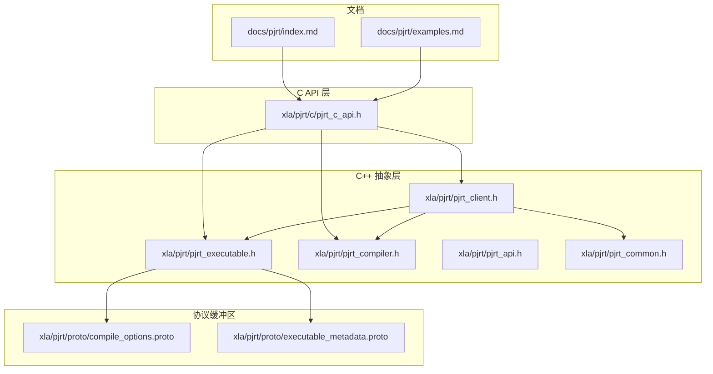
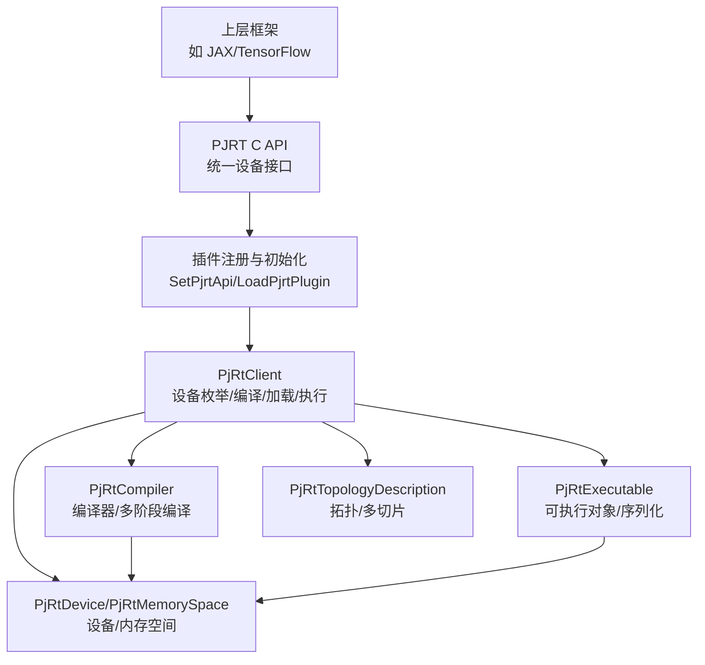
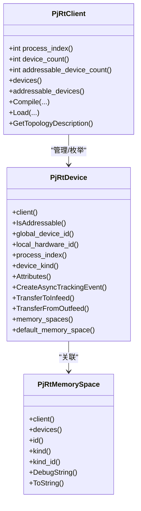
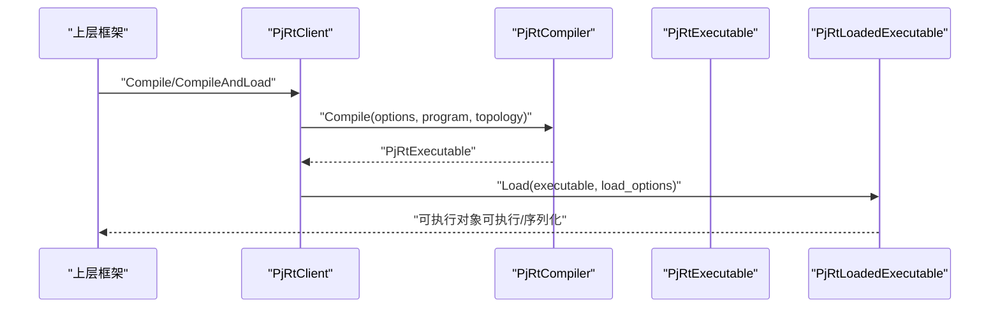
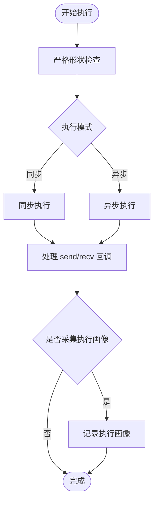
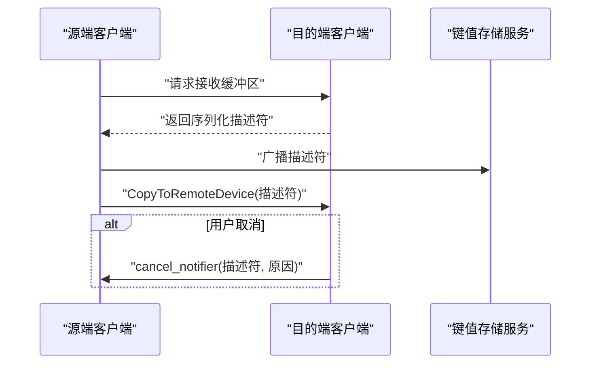
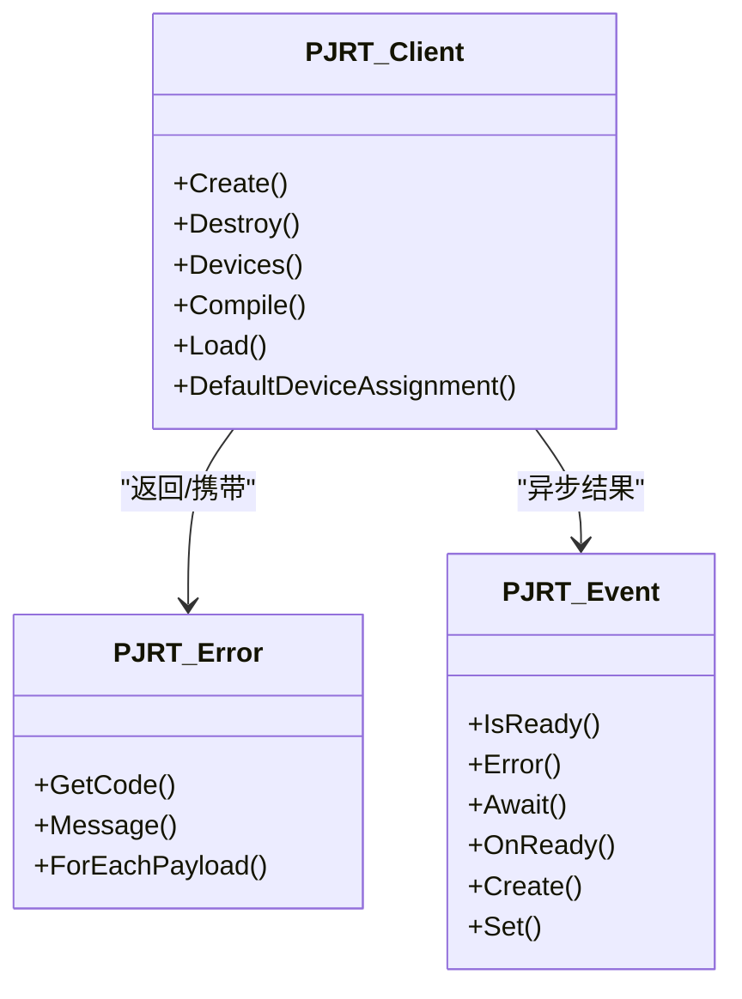
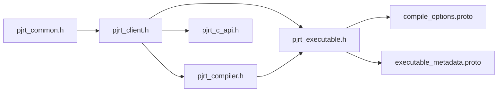

# PJRT API

<cite>
**本文引用的文件**
- [xla\pjrt\c\pjrt_c_api.h](file://xla/pjrt/c/pjrt_c_api.h)
- [xla\pjrt\pjrt_api.h](file://xla/pjrt/pjrt_api.h)
- [xla\pjrt\pjrt_client.h](file://xla/pjrt/pjrt_client.h)
- [xla\pjrt\pjrt_client.cc](file://xla/pjrt/pjrt_client.cc)
- [xla\pjrt\pjrt_executable.h](file://xla/pjrt/pjrt_executable.h)
- [xla\pjrt\pjrt_compiler.h](file://xla/pjrt/pjrt_compiler.h)
- [xla\pjrt\pjrt_common.h](file://xla/pjrt/pjrt_common.h)
- [xla\pjrt\proto\compile_options.proto](file://xla/pjrt/proto/compile_options.proto)
- [xla\pjrt\proto\executable_metadata.proto](file://xla/pjrt/proto/executable_metadata.proto)
- [docs\pjrt\index.md](file://docs/pjrt/index.md)
- [docs\pjrt\examples.md](file://docs/pjrt/examples.md)
</cite>

## 目录
1. [简介](#简介)
2. [项目结构](#项目结构)
3. [核心组件](#核心组件)
4. [架构总览](#架构总览)
5. [详细组件分析](#详细组件分析)
6. [依赖关系分析](#依赖关系分析)
7. [性能考虑](#性能考虑)
8. [故障排查指南](#故障排查指南)
9. [结论](#结论)
10. [附录](#附录)

## 简介
本文件为 PJRT（Python JIT Runtime）API 的系统化技术文档，覆盖 C API 与 Python 绑定的统一设备接口设计目标与实现要点。PJRT 的长期愿景是：上层框架（如 TensorFlow、JAX 等）通过 PJRT 调用底层设备实现，设备侧以 PJRT 插件形式提供，对框架保持透明与解耦。本文重点阐述以下方面：
- 设备管理与拓扑描述
- 编译与加载流程（含多阶段编译）
- 数组与缓冲区操作
- 分布式执行与跨主机传输
- 错误处理策略、性能优化与最佳实践
- 协议缓冲区定义与序列化格式
- 与传统 XLA 客户端的差异与优势

## 项目结构
围绕 PJRT 的关键目录与文件如下：
- C API 头文件：统一的 C 接口定义，包含错误、事件、客户端、设备、可执行对象等结构体与函数指针签名
- C++ 抽象接口：PjRtClient、PjRtExecutable、PjRtCompiler 等抽象类，定义高层语义与扩展点
- 协议缓冲区：编译选项、可执行元数据等序列化结构
- 文档：PJRT 总览与示例，帮助理解插件机制与框架集成



**图表来源**
- [xla\pjrt\c\pjrt_c_api.h](file://xla/pjrt/c/pjrt_c_api.h#L1-L800)
- [xla\pjrt\pjrt_client.h](file://xla/pjrt/pjrt_client.h#L1-L800)
- [xla\pjrt\pjrt_executable.h](file://xla/pjrt/pjrt_executable.h#L1-L431)
- [xla\pjrt\pjrt_compiler.h](file://xla/pjrt/pjrt_compiler.h#L1-L554)
- [xla\pjrt\pjrt_api.h](file://xla/pjrt/pjrt_api.h#L1-L52)
- [xla\pjrt\pjrt_common.h](file://xla/pjrt/pjrt_common.h#L1-L60)
- [xla\pjrt\proto\compile_options.proto](file://xla/pjrt/proto/compile_options.proto#L1-L181)
- [xla\pjrt\proto\executable_metadata.proto](file://xla/pjrt/proto/executable_metadata.proto#L1-L36)
- [docs\pjrt\index.md](file://docs/pjrt/index.md#L1-L32)
- [docs\pjrt\examples.md](file://docs/pjrt/examples.md#L1-L39)

**章节来源**
- [docs\pjrt\index.md](file://docs/pjrt/index.md#L1-L32)
- [docs\pjrt\examples.md](file://docs/pjrt/examples.md#L1-L39)

## 核心组件
- PJRT 插件注册与全局 API 管理：通过设备类型映射与全局 API 指针管理，支持按平台加载插件并初始化
- 客户端（PjRtClient）：统一的运行时入口，负责设备枚举、编译、加载、执行、内存分配与拓扑信息
- 可执行对象（PjRtExecutable/PjRtLoadedExecutable）：封装编译产物，支持序列化、反序列化、成本分析与元数据查询
- 编译器（PjRtCompiler）：面向平台的编译后端，支持默认编译器、变体编译器与多阶段编译（PhaseCompiler）
- 拓扑描述（PjRtTopologyDescription）：描述多进程/多芯片/多切片拓扑，用于编译与执行规划
- C API：以结构体与函数指针形式暴露统一接口，便于语言绑定与跨进程边界调用

**章节来源**
- [xla\pjrt\pjrt_api.h](file://xla/pjrt/pjrt_api.h#L27-L47)
- [xla\pjrt\pjrt_client.h](file://xla/pjrt/pjrt_client.h#L509-L761)
- [xla\pjrt\pjrt_executable.h](file://xla/pjrt/pjrt_executable.h#L85-L164)
- [xla\pjrt\pjrt_compiler.h](file://xla/pjrt/pjrt_compiler.h#L100-L183)
- [xla\pjrt\c\pjrt_c_api.h](file://xla/pjrt/c/pjrt_c_api.h#L118-L124)

## 架构总览
下图展示了从上层框架到设备插件的整体调用链与职责划分。



**图表来源**
- [xla\pjrt\c\pjrt_c_api.h](file://xla/pjrt/c/pjrt_c_api.h#L248-L271)
- [xla\pjrt\pjrt_api.h](file://xla/pjrt/pjrt_api.h#L29-L47)
- [xla\pjrt\pjrt_client.h](file://xla/pjrt/pjrt_client.h#L509-L761)
- [xla\pjrt\pjrt_compiler.h](file://xla/pjrt/pjrt_compiler.h#L400-L428)
- [xla\pjrt\pjrt_executable.h](file://xla/pjrt/pjrt_executable.h#L321-L414)

## 详细组件分析

### 设备与内存空间
- PjRtDevice 提供设备属性、ID、进程索引、供应商属性、异步事件、入出站队列传输等能力；支持默认与特定内存空间查询
- PjRtMemorySpace 表示与设备关联的内存域，提供 ID、kind、设备集合等信息
- PjRtClient 提供设备列表、地址可访问设备、默认设备分配、拓扑描述等



**图表来源**
- [xla\pjrt\pjrt_client.h](file://xla/pjrt/pjrt_client.h#L114-L265)
- [xla\pjrt\pjrt_client.h](file://xla/pjrt/pjrt_client.h#L84-L112)

**章节来源**
- [xla\pjrt\pjrt_client.h](file://xla/pjrt/pjrt_client.h#L114-L265)
- [xla\pjrt\pjrt_client.h](file://xla/pjrt/pjrt_client.h#L84-L112)

### 编译与加载流程
- PjRtCompiler 支持基于 XlaComputation 或 MLIR Module 的编译，并可返回 PjRtExecutable
- PjRtClient 提供 Compile/CompileAndLoad 与 Load/LoadSerializedExecutable 接口
- PjRtExecutable 支持序列化、指纹、成本分析、参数/输出布局与内存种类查询
- 多阶段编译（PjRtPhaseCompiler）允许插件注册多个编译阶段并按序执行



**图表来源**
- [xla\pjrt\pjrt_compiler.h](file://xla/pjrt/pjrt_compiler.h#L400-L462)
- [xla\pjrt\pjrt_client.h](file://xla/pjrt/pjrt_client.h#L634-L695)
- [xla\pjrt\pjrt_executable.h](file://xla/pjrt/pjrt_executable.h#L321-L414)

**章节来源**
- [xla\pjrt\pjrt_compiler.h](file://xla/pjrt/pjrt_compiler.h#L400-L462)
- [xla\pjrt\pjrt_client.h](file://xla/pjrt/pjrt_client.h#L634-L695)
- [xla\pjrt\pjrt_executable.h](file://xla/pjrt/pjrt_executable.h#L321-L414)

### 执行与回调
- ExecuteOptions 支持严格形状检查、send/recv 回调、执行模式（同步/异步）、流 ID、调用位置等
- SendCallback/RecvCallback 允许在执行过程中进行跨设备/跨主机的数据通道交互
- PjRtLoadedExecutable 提供执行入口与成本分析



**图表来源**
- [xla\pjrt\pjrt_executable.h](file://xla/pjrt/pjrt_executable.h#L224-L319)

**章节来源**
- [xla\pjrt\pjrt_executable.h](file://xla/pjrt/pjrt_executable.h#L224-L319)

### 跨主机传输与分布式执行
- PjRtClient 支持两种跨主机传输方式：新式接收/发送接口与旧式 Make/Receive + 序列化描述符
- 通过键值存储回调（KV Get/TryGet/Put）支持多进程/多节点协调
- 支持跨主机取消通知与状态回调，避免死锁与悬挂



**图表来源**
- [xla\pjrt\pjrt_client.h](file://xla/pjrt/pjrt_client.h#L472-L483)
- [xla\pjrt\c\pjrt_c_api.h](file://xla/pjrt/c/pjrt_c_api.h#L401-L478)

**章节来源**
- [xla\pjrt\pjrt_client.h](file://xla/pjrt/pjrt_client.h#L472-L483)
- [xla\pjrt\c\pjrt_c_api.h](file://xla/pjrt/c/pjrt_c_api.h#L401-L478)

### C API 与 Python 绑定
- C API 使用结构体与函数指针，配合扩展链（PJRT_Extension_Base）实现向后兼容与特性扩展
- 错误模型采用 PJRT_Error，包含错误码与负载（payload），回调可通过回调错误构造器传递错误
- 事件（PJRT_Event）用于异步工作完成通知，支持等待与回调
- Python 绑定通过语言桥接（如 pybind11）对接 C API 结构与方法



**图表来源**
- [xla\pjrt\c\pjrt_c_api.h](file://xla/pjrt/c/pjrt_c_api.h#L127-L216)
- [xla\pjrt\c\pjrt_c_api.h](file://xla/pjrt/c/pjrt_c_api.h#L272-L380)
- [xla\pjrt\c\pjrt_c_api.h](file://xla/pjrt/c/pjrt_c_api.h#L380-L508)

**章节来源**
- [xla\pjrt\c\pjrt_c_api.h](file://xla/pjrt/c/pjrt_c_api.h#L127-L216)
- [xla\pjrt\c\pjrt_c_api.h](file://xla/pjrt/c/pjrt_c_api.h#L272-L380)
- [xla\pjrt\c\pjrt_c_api.h](file://xla/pjrt/c/pjrt_c_api.h#L380-L508)

### 协议缓冲区与序列化
- 编译选项（CompileOptionsProto）：参数布局、打包参数、设备分配、优化级别、环境覆盖、GPU 目标配置等
- 可执行元数据（PjRtExecutableMetadata）：编译内存统计、平台特定元数据等
- 支持将可执行对象与编译选项一起序列化，便于跨进程/跨版本加载

```mermaid
erDiagram
COMPILE_OPTIONS_PROTO {
bool parameter_is_tupled_arguments
bytes serialized_multi_slice_config
map env_option_overrides
stream_se.GpuTargetConfigProto target_config
bool allow_in_place_mlir_modification
PrecisionConfig_Precision matrix_unit_operand_precision
optional string compiler_variant
}
EXECUTABLE_METADATA {
CompiledMemoryStatsProto compiled_memory_stats
google_protobuf.Any platform_specific_metadata
}
COMPILE_OPTIONS_PROTO ||--o{ EXECUTABLE_METADATA : "可随可执行对象序列化"
```

**图表来源**
- [xla\pjrt\proto\compile_options.proto](file://xla/pjrt/proto/compile_options.proto#L160-L181)
- [xla\pjrt\proto\executable_metadata.proto](file://xla/pjrt/proto/executable_metadata.proto#L32-L36)

**章节来源**
- [xla\pjrt\proto\compile_options.proto](file://xla/pjrt/proto/compile_options.proto#L1-L181)
- [xla\pjrt\proto\executable_metadata.proto](file://xla/pjrt/proto/executable_metadata.proto#L1-L36)

## 依赖关系分析
- 抽象层与实现层解耦：C++ 抽象类定义高层语义，具体设备以插件形式接入
- 编译器注册与变体：通过注册表支持默认编译器与不同变体（远程/本地）
- 拓扑驱动编译：拓扑描述贯穿编译与执行，支持多切片与多主机场景
- C API 作为语言绑定桥梁：统一的结构体与函数指针便于 Python 等语言绑定



**图表来源**
- [xla\pjrt\pjrt_common.h](file://xla/pjrt/pjrt_common.h#L30-L57)
- [xla\pjrt\pjrt_client.h](file://xla/pjrt/pjrt_client.h#L1-L800)
- [xla\pjrt\pjrt_executable.h](file://xla/pjrt/pjrt_executable.h#L1-L431)
- [xla\pjrt\pjrt_compiler.h](file://xla/pjrt/pjrt_compiler.h#L1-L554)
- [xla\pjrt\c\pjrt_c_api.h](file://xla/pjrt/c/pjrt_c_api.h#L1-L800)
- [xla\pjrt\proto\compile_options.proto](file://xla/pjrt/proto/compile_options.proto#L1-L181)
- [xla\pjrt\proto\executable_metadata.proto](file://xla/pjrt/proto/executable_metadata.proto#L1-L36)

**章节来源**
- [xla\pjrt\pjrt_common.h](file://xla/pjrt/pjrt_common.h#L30-L57)
- [xla\pjrt\pjrt_client.h](file://xla/pjrt/pjrt_client.h#L1-L800)
- [xla\pjrt\pjrt_executable.h](file://xla/pjrt/pjrt_executable.h#L1-L431)
- [xla\pjrt\pjrt_compiler.h](file://xla/pjrt/pjrt_compiler.h#L1-L554)
- [xla\pjrt\c\pjrt_c_api.h](file://xla/pjrt/c/pjrt_c_api.h#L1-L800)
- [xla\pjrt\proto\compile_options.proto](file://xla/pjrt/proto/compile_options.proto#L1-L181)
- [xla\pjrt\proto\executable_metadata.proto](file://xla/pjrt/proto/executable_metadata.proto#L1-L36)

## 性能考虑
- 异步执行与事件：利用 PJRT_Event 实现非阻塞等待与回调，减少线程阻塞
- 执行模式选择：根据场景选择同步或异步执行，平衡吞吐与延迟
- 形状与布局：合理设置参数布局与严格形状检查，避免运行时额外转换
- 多阶段编译：在编译流水线中分阶段优化，降低单次编译压力
- 内存统计与成本分析：通过编译内存统计与成本分析指导资源规划与优化
- 跨主机传输：优先使用新式接收/发送接口，减少中间态与悬挂风险

[本节为通用建议，不直接分析具体文件]

## 故障排查指南
- 错误模型：统一使用 PJRT_Error，包含错误码与负载，回调可通过回调错误构造器传递错误
- 事件状态：通过 PJRT_Event_Await 获取最终状态，确保正确释放错误对象
- 取消与悬挂：跨主机传输需确保取消路径与发送路径一致，避免悬挂
- 版本与兼容性：关注 PJRT API 主/次版本号，使用结构体大小字段检测兼容性

**章节来源**
- [xla\pjrt\c\pjrt_c_api.h](file://xla/pjrt/c/pjrt_c_api.h#L127-L216)
- [xla\pjrt\c\pjrt_c_api.h](file://xla/pjrt/c/pjrt_c_api.h#L272-L380)
- [xla\pjrt\c\pjrt_c_api.h](file://xla/pjrt/c/pjrt_c_api.h#L380-L508)

## 结论
PJRT 通过统一的 C API 与 C++ 抽象层，实现了框架与设备实现的解耦，支持多平台、多拓扑与多阶段编译，具备良好的扩展性与跨语言绑定能力。结合完善的错误处理、事件机制与协议缓冲区序列化，PJRT 在分布式执行与性能优化方面提供了坚实基础。

[本节为总结性内容，不直接分析具体文件]

## 附录

### 与传统 XLA 客户端的差异与优势
- 统一接口：PJRT C API 作为统一设备接口，屏蔽底层实现细节，便于多框架共享
- 插件机制：设备侧以插件形式实现，框架无需感知具体硬件差异
- 多阶段编译：支持多阶段编译流水线，便于引入自定义优化与验证
- 分布式原生：内建跨主机传输与拓扑描述，简化多机多卡编程
- 语言绑定友好：结构体与函数指针设计便于 Python 等语言绑定

**章节来源**
- [docs\pjrt\index.md](file://docs/pjrt/index.md#L6-L12)
- [docs\pjrt\examples.md](file://docs/pjrt/examples.md#L16-L39)

### 示例与参考
- JAX CUDA 插件示例：通过包装 C API 插件实现与测试
- 框架集成参考：JAX、GoMLX、ZML 等对 PJRT 的使用与封装

**章节来源**
- [docs\pjrt\examples.md](file://docs/pjrt/examples.md#L3-L8)
- [docs\pjrt\examples.md](file://docs/pjrt/examples.md#L16-L39)