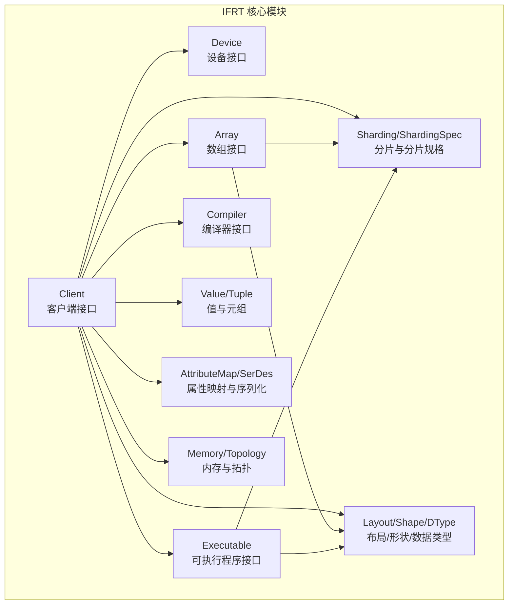
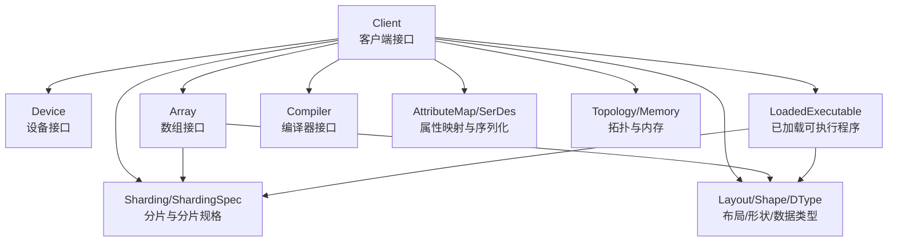
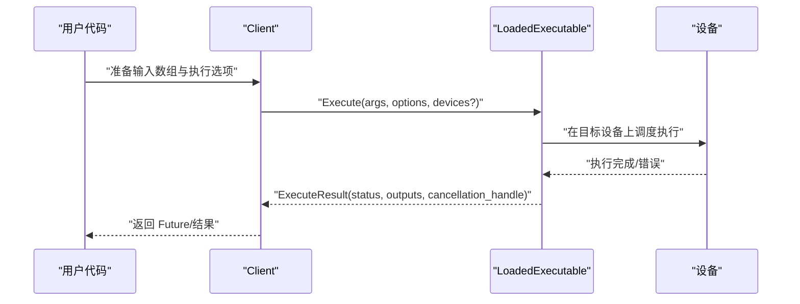
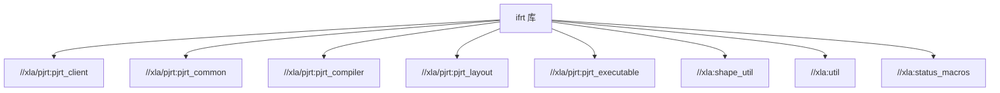

# IFRT高级接口

<cite>
**本文引用的文件**
- [README.md](file://xla/python/ifrt/README.md)
- [BUILD](file://xla/python/ifrt/BUILD)
- [client.h](file://xla/python/ifrt/client.h)
- [array.h](file://xla/python/ifrt/array.h)
- [device.h](file://xla/python/ifrt/device.h)
- [executable.h](file://xla/python/ifrt/executable.h)
</cite>

## 目录
1. [简介](#简介)
2. [项目结构](#项目结构)
3. [核心组件](#核心组件)
4. [架构总览](#架构总览)
5. [详细组件分析](#详细组件分析)
6. [依赖分析](#依赖分析)
7. [性能考虑](#性能考虑)
8. [故障排查指南](#故障排查指南)
9. [结论](#结论)
10. [附录](#附录)

## 简介
本文件为 IFRT（Immediate Function Runtime）高级 Python 接口的权威技术文档。IFRT 是位于用户框架（如 JAX、PyTorch、TensorFlow）与底层运行时之间的高层 ML 运行时 API，目标是提升跨硬件配置的可移植性，并通过声明式方式表达工作负载，将执行策略交给运行时实现。

IFRT 的设计目标包括：
- 与现有 PjRt 低层 API 解耦，使迁移更简单，但随时间演进可能逐步差异化。
- 支持异步执行、分布式执行、内存管理与设备抽象。
- 提供编译与执行的高级接口，便于与 NumPy 数组互操作并进行内存布局优化。

本文件面向希望使用 IFRT 高级接口进行机器学习计算图编译与执行的工程师，覆盖 Client、Array、Device、Executable 等核心类的接口规范、异步执行模型、内存管理、设备抽象与分布式执行支持，并给出性能调优与最佳实践建议。

## 项目结构
IFRT 的核心 C++ 头文件位于 xla/python/ifrt 目录，主要模块如下：
- 客户端与编译器：Client、Compiler
- 设备与拓扑：Device、DeviceList、Topology
- 数值与形状：DType、Shape、Layout、IndexDomain
- 数组与分片：Array、Sharding、ShardingSpec、ArraySpec
- 可执行程序：Executable、LoadedExecutable、ExecuteOptions
- 值与元组：Value、Tuple
- 序列化与版本：SerDes、ExecutableVersion
- 其他：AttributeMap、Memory、HostCallback、Program、RemapPlan 等

图表来源
- [BUILD](file://xla/python/ifrt/BUILD#L21-L72)
- [client.h](file://xla/python/ifrt/client.h#L68-L422)
- [array.h](file://xla/python/ifrt/array.h#L63-L144)
- [device.h](file://xla/python/ifrt/device.h#L41-L139)
- [executable.h](file://xla/python/ifrt/executable.h#L64-L333)

章节来源
- [README.md](file://xla/python/ifrt/README.md#L1-L37)
- [BUILD](file://xla/python/ifrt/BUILD#L21-L72)

## 核心组件
本节概述 IFRT 高级 Python 接口的核心类及其职责与关系。

- Client（客户端）
  - 职责：封装与计算设备及内存交互的运行时；提供数组构造、复制、重映射、位视图转换、重新分片、拓扑查询、默认布局获取、属性订阅等能力。
  - 关键能力：从主机缓冲区创建数组、按分片规格组装/拆分数组、在设备间复制数组、取消执行、获取默认布局、订阅设备属性变化等。
- Array（数组）
  - 职责：表示一个或多个分片缓冲区组成的逻辑数组；提供 dtype、形状、分片信息、PJRT 布局、拆分为单设备数组、全复制分片、拷贝到主机缓冲区等。
- Device（设备）
  - 职责：表示可执行计算的单一设备；提供平台名、设备种类、调试字符串、默认内存、可用内存列表、是否可寻址、进程索引等。
- Executable（可执行程序）
  - 职责：部分编译后的可加载计算；LoadedExecutable 表示已加载可执行程序，支持执行、序列化、成本分析、HLO 模块导出、输出内存种类等。
  - ExecuteOptions：执行选项，包含启动 ID、不可捐赠输入索引集合、是否填充状态、执行流 ID、自定义选项等。

章节来源
- [client.h](file://xla/python/ifrt/client.h#L68-L422)
- [array.h](file://xla/python/ifrt/array.h#L63-L144)
- [device.h](file://xla/python/ifrt/device.h#L41-L139)
- [executable.h](file://xla/python/ifrt/executable.h#L64-L333)

## 架构总览
下图展示了 IFRT 高级接口的系统架构与组件交互关系，体现从客户端到设备、数组、可执行程序以及分片/布局的协作。

图表来源
- [client.h](file://xla/python/ifrt/client.h#L68-L422)
- [array.h](file://xla/python/ifrt/array.h#L63-L144)
- [executable.h](file://xla/python/ifrt/executable.h#L64-L333)

## 详细组件分析

### Client 类接口规范
- 主机缓冲区到数组
  - 从主机缓冲区创建数组：支持指定数据指针、数据类型、形状、字节步幅、分片、布局、主机缓冲区语义与完成回调。
  - 从主机缓冲区分片创建多个数组：支持按分片规格批量创建数组，要求同一设备列表与内存种类一致。
  - 创建错误数组：根据错误状态与数组规格批量创建错误数组。
- 组装/拆分数组
  - 将单设备数组组装为更大数组：支持指定 dtype、形状、分片、数组复制语义与单设备分片语义。
  - 拆分数组为单设备数组：返回每个设备上的分片数组。
- 设备间复制与重映射
  - 在设备间复制数组：要求输入数组具有相同的源设备列表与内存种类，可能返回未实现或无效参数错误。
  - 重映射数组：基于重映射计划对分片进行元数据级重排，不改变物理布局。
  - 位视图转换：对分片解释进行元数据级转换，保持每分片大小不变。
  - 重新分片：根据新规格进行分片重排，若目标规格包含布局则应用该布局。
- 异步与取消
  - 获取就绪事件：等待一组值全部就绪，遵循错误聚合与优先选择规则。
  - 取消执行：尝试取消排队中的执行，成功则输出数组与 Future 转为错误，否则继续执行至完成。
- 平台与拓扑
  - 平台信息：平台名称、版本、平台 ID。
  - 属性：客户端能力属性（如可序列化性）。
  - 设备发现：设备总数、可寻址设备数、设备列表、默认设备分配、设备查找、设备列表构造。
  - 拓扑：针对给定设备列表获取拓扑。
  - 默认布局：针对给定 dtype、维度、设备与内存种类获取 PJRT 默认布局；或针对给定分片维度获取自定义布局。
- 订阅设备属性变化：对选定设备的属性变更进行订阅，回调返回错误时终止订阅。

章节来源
- [client.h](file://xla/python/ifrt/client.h#L68-L422)

### Array 类接口规范
- 基本属性
  - 数据类型、形状、分片、共享指针分片、PJRT 布局、自定义布局。
- 操作
  - 拆分为单设备数组：支持复制语义与单设备分片语义。
  - 全复制分片：在完全复制场景下直接获取一个分片以避免全拆分。
  - 拷贝到主机缓冲区：支持字节步幅与复制语义，返回 Future；数据需在 Future 就绪前保持有效。

章节来源
- [array.h](file://xla/python/ifrt/array.h#L63-L144)

### Device 类接口规范
- 基本属性
  - 所属客户端、全局唯一设备 ID、设备属性映射、平台名称、设备种类、调试字符串、默认内存、可用内存列表、是否可寻址、进程索引。
- 回调与订阅
  - 设备属性变更回调类型与订阅对象生命周期控制。

章节来源
- [device.h](file://xla/python/ifrt/device.h#L41-L139)

### Executable/LoadedExecutable 类接口规范
- Executable（部分编译）
  - 唯一名、指纹、序列化、设备数量、生成代码大小、编译内存统计、参数/输出分片、参数/输出布局、HLO 模块、输出内存种类、成本分析等。
- LoadedExecutable（已加载）
  - 客户端、唯一名、指纹、可执行版本、序列化、人类可读程序文本、用户上下文、设备数量、生成代码大小、编译内存统计、参数/输出分片、可捐赠输入索引、参数/输出布局、HLO 模块、输出内存种类、成本分析。
  - Execute：执行已加载可执行程序，支持执行选项与可选设备列表；返回执行结果（状态 Future、输出数组、取消句柄）。
  - 删除选项：设置删除时的流 ID 等副作用控制。
- ExecuteOptions
  - 启动 ID、不可捐赠输入索引集合、是否填充状态、执行流 ID、自定义选项、序列化/反序列化。

章节来源
- [executable.h](file://xla/python/ifrt/executable.h#L64-L333)

### 异步执行模式与执行流程
下图展示 IFRT 的异步执行流程，从执行选项到执行结果的状态与输出数组的产生。

图表来源
- [executable.h](file://xla/python/ifrt/executable.h#L282-L301)

### 内存管理与设备抽象
- 设备与内存
  - Device 提供默认内存与可用内存列表，支持是否可寻址与进程索引。
  - Client 提供默认布局查询与设备间复制、重映射、位视图转换、重新分片等元数据操作。
- 主机缓冲区语义
  - 支持不可变仅调用期间、不可变直到传输完成、零拷贝三种语义，配合完成回调确保资源释放与生命周期管理。
- 分片与布局
  - Array 与 Executable 均围绕 Sharding 与 Layout 展开，支持自定义布局与 PJRT 布局，默认布局由 Client 提供。

章节来源
- [device.h](file://xla/python/ifrt/device.h#L79-L94)
- [client.h](file://xla/python/ifrt/client.h#L102-L136)
- [array.h](file://xla/python/ifrt/array.h#L75-L84)

### 分布式执行支持
- 设备列表与拓扑
  - Client 支持获取设备列表、拓扑、默认设备分配、设备查找与设备列表构造。
- 执行范围
  - LoadedExecutable.Execute 支持在指定设备列表上执行，若未指定则在编译/加载时绑定的设备上执行。
- 属性订阅
  - 支持订阅设备属性变化，便于动态感知拓扑与能力变化。

章节来源
- [client.h](file://xla/python/ifrt/client.h#L364-L413)
- [executable.h](file://xla/python/ifrt/executable.h#L282-L301)

### 与 NumPy 数组的转换与内存布局优化
- 主机缓冲区到数组
  - 通过 Client::MakeArrayFromHostBuffer 与 HostBuffer 结构体，支持指定数据指针、数据类型、形状、字节步幅与布局，实现与 NumPy 的零拷贝或不可变语义。
- 拷贝到主机缓冲区
  - Array::CopyToHostBuffer 支持将设备侧数组拷贝回主机，可指定字节步幅与复制语义，便于与 NumPy 数组对接。
- 布局优化
  - 使用 Client::GetDefaultPjRtLayout 或 GetDefaultLayout 获取默认布局，结合字节步幅与分片策略减少不必要的数据重排与传输。

章节来源
- [client.h](file://xla/python/ifrt/client.h#L104-L136)
- [array.h](file://xla/python/ifrt/array.h#L128-L131)

### 错误处理机制
- 状态与 Future
  - 多数 API 返回 absl::StatusOr 或 tsl::Future<>，错误通过 Future 或 StatusOr 返回。
- 取消执行
  - Client::CancelExecution 支持最佳努力取消排队中的执行，成功则输出数组与 Future 转为错误。
- 错误聚合
  - Client::GetReadyFuture 对一组值的就绪采用“全部就绪后统一填充”的策略，错误情况下由实现选择一个错误作为返回。

章节来源
- [client.h](file://xla/python/ifrt/client.h#L300-L320)
- [executable.h](file://xla/python/ifrt/executable.h#L282-L301)

## 依赖分析
IFRT 的构建文件显示其核心库 ifrt 由大量源文件组成，并依赖 PjRt 客户端、布局、编译器、服务端工具与 Abseil 等基础库。下图展示 IFRT 与 PjRt 的关键依赖关系。

图表来源
- [BUILD](file://xla/python/ifrt/BUILD#L79-L137)

章节来源
- [BUILD](file://xla/python/ifrt/BUILD#L21-L72)
- [BUILD](file://xla/python/ifrt/BUILD#L79-L137)

## 性能考虑
- 复制语义选择
  - 在数组复制、重映射、位视图转换与重新分片时，合理选择 ArrayCopySemantics（总是复制、复用输入、捐赠输入），以平衡内存占用与吞吐。
- 布局与步幅
  - 使用默认布局或自定义布局，尽量避免非重排的字节步幅，减少数据重排与额外拷贝。
- 零拷贝与不可变语义
  - 在满足生命周期约束的前提下，优先使用零拷贝或不可变直到传输完成语义，降低 CPU-GPU/TPU 间数据搬运开销。
- 执行流与并发
  - 利用 ExecuteOptions 中的 execution_stream_id 与 launch_id，确保多设备/多主机执行顺序与并发可控。
- 取消与资源回收
  - 对长时间运行的执行使用取消机制，及时回收不再使用的输入数组（捐赠输入）以释放设备内存。

## 故障排查指南
- 设备不可寻址或内存种类不一致
  - 设备间复制要求输入数组具有相同源设备列表与内存种类，否则会返回无效参数错误。
- 布局不兼容
  - 位视图转换与布局变更在某些平台上可能受限，遇到 UNIMPLEMENTED 时应检查目标布局与 dtype 是否允许。
- 主机缓冲区生命周期
  - 零拷贝与不可变直到传输完成语义下，必须保证数据在数组生命周期内保持有效，完成后由回调通知释放。
- 取消执行失败
  - 取消是最佳努力，实现可能不支持取消；若取消失败，执行将继续完成。

章节来源
- [client.h](file://xla/python/ifrt/client.h#L218-L284)
- [array.h](file://xla/python/ifrt/array.h#L101-L131)
- [executable.h](file://xla/python/ifrt/executable.h#L282-L301)

## 结论
IFRT 高级 Python 接口通过清晰的 Client、Array、Device、Executable 抽象，提供了面向未来的高性能、可移植、可扩展的 ML 运行时接口。借助异步执行、分布式执行、内存管理与设备抽象，以及与 NumPy 的高效互操作，IFRT 能够满足现代机器学习训练与推理的复杂需求。建议在实际工程中结合复制语义、布局优化与执行流控制，持续评估与调优性能，并利用取消与资源回收机制保障稳定性。

## 附录
- 示例用法（路径参考）
  - 从主机缓冲区创建数组：参见 [client.h](file://xla/python/ifrt/client.h#L104-L136)
  - 拆分/组装数组：参见 [client.h](file://xla/python/ifrt/client.h#L210-L216) 与 [array.h](file://xla/python/ifrt/array.h#L87-L99)
  - 设备间复制：参见 [client.h](file://xla/python/ifrt/client.h#L218-L235)
  - 重映射/位视图/重新分片：参见 [client.h](file://xla/python/ifrt/client.h#L237-L284)
  - 执行可执行程序：参见 [executable.h](file://xla/python/ifrt/executable.h#L282-L301)
  - 获取默认布局：参见 [client.h](file://xla/python/ifrt/client.h#L376-L391)