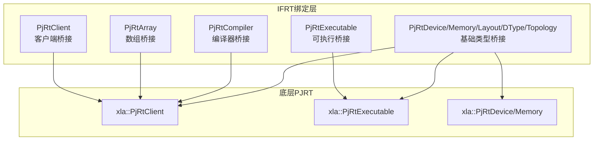
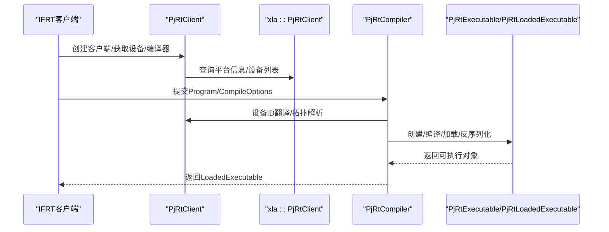
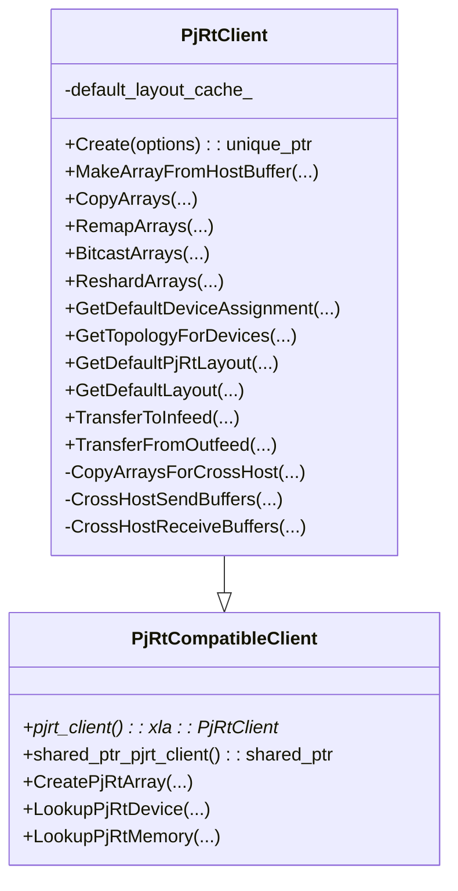
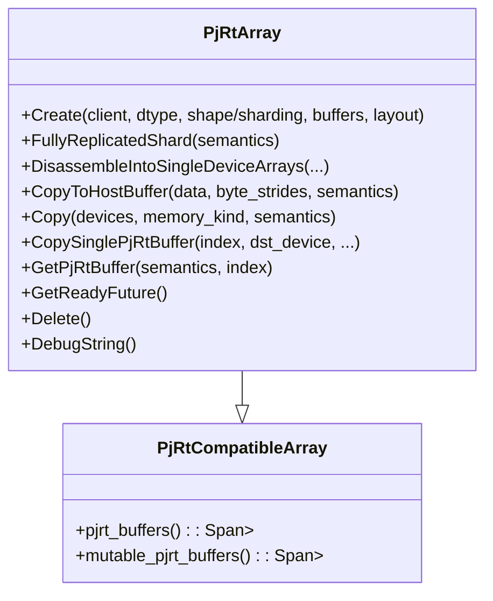
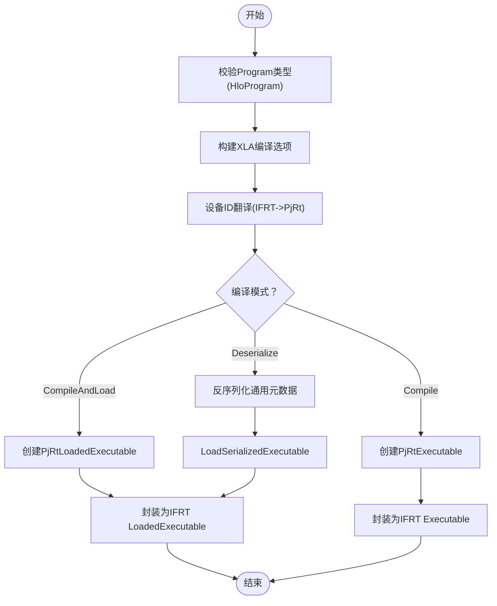
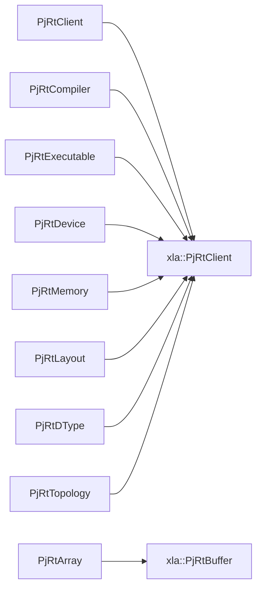

# PJRT-IFRT绑定接口

<cite>
**本文引用的文件**
- [pjrt_client.h](file://xla/python/pjrt_ifrt/pjrt_client.h)
- [pjrt_client.cc](file://xla/python/pjrt_ifrt/pjrt_client.cc)
- [pjrt_array.h](file://xla/python/pjrt_ifrt/pjrt_array.h)
- [pjrt_compiler.cc](file://xla/python/pjrt_ifrt/pjrt_compiler.cc)
- [pjrt_executable.h](file://xla/python/pjrt_ifrt/pjrt_executable.h)
- [pjrt_executable.cc](file://xla/python/pjrt_ifrt/pjrt_executable.cc)
- [pjrt_device.h](file://xla/python/pjrt_ifrt/pjrt_device.h)
- [pjrt_device.cc](file://xla/python/pjrt_ifrt/pjrt_device.cc)
- [pjrt_memory.h](file://xla/python/pjrt_ifrt/pjrt_memory.h)
- [pjrt_memory.cc](file://xla/python/pjrt_ifrt/pjrt_memory.cc)
- [pjrt_layout.h](file://xla/python/pjrt_ifrt/pjrt_layout.h)
- [pjrt_layout.cc](file://xla/python/pjrt_ifrt/pjrt_layout.cc)
- [pjrt_dtype.h](file://xla/python/pjrt_ifrt/pjrt_dtype.h)
- [pjrt_dtype.cc](file://xla/python/pjrt_ifrt/pjrt_dtype.cc)
- [pjrt_topology.h](file://xla/python/pjrt_ifrt/pjrt_topology.h)
- [pjrt_topology.cc](file://xla/python/pjrt_ifrt/pjrt_topology.cc)
- [ifrt_client.cc](file://xla/backends/cpu/nanort/ifrt_client.cc)
- [ifrt_client.h](file://xla/backends/cpu/nanort/ifrt_client.h)
- [ifrt_client_test.cc](file://xla/backends/cpu/nanort/ifrt_client_test.cc)
- [client.h](file://xla/python/compile_only_ifrt/client.h)
- [client.cc](file://xla/python/compile_only_ifrt/client.cc)
</cite>

## 目录
1. [简介](#简介)
2. [项目结构](#项目结构)
3. [核心组件](#核心组件)
4. [架构总览](#架构总览)
5. [详细组件分析](#详细组件分析)
6. [依赖关系分析](#依赖关系分析)
7. [性能考虑](#性能考虑)
8. [故障排除指南](#故障排除指南)
9. [结论](#结论)
10. [附录：Python使用示例与兼容性](#附录python使用示例与兼容性)

## 简介
本文件面向开发者与高级用户，系统化阐述PJRT-IFRT绑定接口的设计与实现，重点覆盖以下方面：
- 桥接层实现：PjRtClient、PjRtExecutable、PjRtArray等绑定类的完整接口规范与职责边界
- 后端适配与设备枚举：如何从底层PjRtClient抽象出IFRT设备视图，支持全局拓扑交换与进程内/跨进程设备映射
- 编译与执行：IFRT编译器到PjRt可执行对象的转换、序列化/反序列化、加载与执行流程
- 多硬件后端：通过统一IFRT接口访问CPU/GPU/TPU等后端，展示典型用法与注意事项
- 兼容性与差异：与传统PJRT接口的兼容性、性能特性与使用场景差异
- 故障排除与调试：常见问题定位、日志与诊断技巧

## 项目结构
PJRT-IFRT绑定位于xla/python/pjrt_ifrt目录，核心文件组织如下：
- 客户端与数组：pjrt_client.{h,cc}、pjrt_array.h
- 编译器与可执行：pjrt_compiler.cc、pjrt_executable.{h,cc}
- 设备/内存/布局/DType/拓扑：pjrt_device.{h,cc}、pjrt_memory.{h,cc}、pjrt_layout.{h,cc}、pjrt_dtype.{h,cc}、pjrt_topology.{h,cc}
- 后端适配示例：xla/backends/cpu/nanort/ifrt_client.{h,cc}及测试
- 编译专用客户端：xla/python/compile_only_ifrt/client.{h,cc}

**图表来源**
- [pjrt_client.h](file://xla/python/pjrt_ifrt/pjrt_client.h#L130-L483)
- [pjrt_array.h](file://xla/python/pjrt_ifrt/pjrt_array.h#L67-L236)
- [pjrt_compiler.cc](file://xla/python/pjrt_ifrt/pjrt_compiler.cc#L93-L243)
- [pjrt_executable.h](file://xla/python/pjrt_ifrt/pjrt_executable.h#L1-L200)

**章节来源**
- [pjrt_client.h](file://xla/python/pjrt_ifrt/pjrt_client.h#L1-L483)
- [pjrt_client.cc](file://xla/python/pjrt_ifrt/pjrt_client.cc#L1-L800)
- [pjrt_array.h](file://xla/python/pjrt_ifrt/pjrt_array.h#L1-L236)
- [pjrt_compiler.cc](file://xla/python/pjrt_ifrt/pjrt_compiler.cc#L1-L243)

## 核心组件
本节概述桥接层的关键类与职责：
- PjRtCompatibleClient/PjRtClient：封装xla::PjRtClient，提供IFRT风格的设备/数组/编译器接口，并负责拓扑交换、跨主机传输与默认布局缓存
- PjRtCompatibleArray/PjRtArray：封装一组xla::PjRtBuffer，暴露IFRT数组语义（动态/静态形状、分片、布局、拷贝、删除）
- PjRtCompiler：将IFRT Program/CompileOptions转换为PjRt编译选项，调用PjRtExecutable/PjRtLoadedExecutable完成编译/加载/反序列化
- PjRtExecutable：包装PjRtExecutable或PjRtLoadedExecutable，提供IFRT LoadedExecutable语义
- 基础类型桥接：PjRtDevice、PjRtMemory、PjRtLayout、PjRtDType、PjRtTopology等

**章节来源**
- [pjrt_client.h](file://xla/python/pjrt_ifrt/pjrt_client.h#L83-L483)
- [pjrt_array.h](file://xla/python/pjrt_ifrt/pjrt_array.h#L54-L236)
- [pjrt_compiler.cc](file://xla/python/pjrt_ifrt/pjrt_compiler.cc#L55-L243)

## 架构总览
下图展示了IFRT桥接层与底层PJRT的关系，以及编译/执行的关键路径。

**图表来源**
- [pjrt_client.cc](file://xla/python/pjrt_ifrt/pjrt_client.cc#L782-L800)
- [pjrt_compiler.cc](file://xla/python/pjrt_ifrt/pjrt_compiler.cc#L107-L176)
- [pjrt_executable.h](file://xla/python/pjrt_ifrt/pjrt_executable.h#L1-L200)

## 详细组件分析

### PjRtClient：桥接客户端
职责要点：
- 封装xla::PjRtClient，暴露IFRT风格的设备/数组/编译器接口
- 负责设备拓扑构建：支持直接从PjRtClient推导全局拓扑，或通过KV存储进行拓扑交换
- 跨主机传输：在后端不支持原生跨主机传输时，提供基于KV存储的发送/接收流程
- 默认布局缓存：按DType/维度/MemoryKind缓存PjRt默认布局，提升性能
- 属性与运行时元数据：导出平台属性、C API版本等

关键接口与行为：
- Create/CreateOptions：支持传入分布式客户端、KV存储、进程数/ID、超时配置、传输服务器工厂、强制DCN传输开关、全局设备映射等
- MakeArrayFromHostBuffer/多分片重排/位转换/分片重分布：统一IFRT数组构造与变换
- 设备查询：GetDefaultDeviceAssignment/LookupDevice/LookupAddressableDevice/MakeDeviceList
- 拓扑：GetTopologyForDevices/GetDefaultPjRtLayout/GetDefaultLayout
- 传输：TransferToInfeed/TransferFromOutfeed
- 跨主机复制：CopyArraysForCrossHost/CopyArraysForCrossHostFallback
- 默认布局缓存：default_layout_cache_

**图表来源**
- [pjrt_client.h](file://xla/python/pjrt_ifrt/pjrt_client.h#L83-L483)

**章节来源**
- [pjrt_client.h](file://xla/python/pjrt_ifrt/pjrt_client.h#L130-L483)
- [pjrt_client.cc](file://xla/python/pjrt_ifrt/pjrt_client.cc#L107-L800)

### PjRtArray：桥接数组
职责要点：
- 包装一组xla::PjRtBuffer，支持单/多分片、静态/动态形状、自定义/默认布局
- 提供DisassembleIntoSingleDeviceArrays、CopyToHostBuffer、GetReadyFuture、Delete等操作
- 支持从PjRtBuffer快速构造IFRT数组，或从多个PjRtBuffer构造多分片数组

关键接口与行为：
- Create静态/动态形状、单/多分片重载
- pjrt_buffers()/mutable_pjrt_buffers()：直接访问底层缓冲区
- FullyReplicatedShard、Copy、CopySinglePjRtBuffer：分片级复制与缓冲区提取
- GetPjRtBuffer：按语义与索引获取底层缓冲区
- DebugString/Delete/IsDeleted：调试与生命周期管理

**图表来源**
- [pjrt_array.h](file://xla/python/pjrt_ifrt/pjrt_array.h#L54-L236)

**章节来源**
- [pjrt_array.h](file://xla/python/pjrt_ifrt/pjrt_array.h#L67-L236)

### PjRtCompiler：桥接编译器
职责要点：
- 将IFRT Program/CompileOptions转换为PjRt编译选项，处理设备ID翻译与设备分配
- 支持CompileAndLoad（返回LoadedExecutable）与Compile（返回Executable），以及DeserializeLoadedExecutable（反序列化并加载）
- 可选线程池用于异步编译

关键流程：
- TranslateDeviceIds：将IFRT设备ID翻译为PjRt全局设备ID
- CompileAndLoad：创建PjRtLoadedExecutable并封装为IFRT LoadedExecutable
- Compile：创建PjRtExecutable（非加载态）
- DeserializeLoadedExecutable：反序列化通用元数据，调用PjRtClient::LoadSerializedExecutable并封装

**图表来源**
- [pjrt_compiler.cc](file://xla/python/pjrt_ifrt/pjrt_compiler.cc#L107-L239)

**章节来源**
- [pjrt_compiler.cc](file://xla/python/pjrt_ifrt/pjrt_compiler.cc#L55-L243)

### PjRtExecutable：桥接可执行
职责要点：
- 包装PjRtExecutable或PjRtLoadedExecutable，提供IFRT LoadedExecutable语义
- 支持序列化/反序列化通用元数据，便于跨进程/跨会话复用
- 与PjRtCompiler配合完成编译/加载/反序列化流程

**章节来源**
- [pjrt_executable.h](file://xla/python/pjrt_ifrt/pjrt_executable.h#L1-L200)
- [pjrt_executable.cc](file://xla/python/pjrt_ifrt/pjrt_executable.cc#L1-L200)

### 基础类型桥接：设备/内存/布局/DType/拓扑
职责要点：
- PjRtDevice：封装xla::PjRtDevice，提供IFRT设备视图（含属性、进程/分区索引、调试字符串）
- PjRtMemory：封装xla::PjRtMemorySpace，提供IFRT内存空间语义
- PjRtLayout：封装xla::PjRtLayout，提供IFRT布局语义
- PjRtDType：封装xla::PjRtDType，提供IFRT数据类型语义
- PjRtTopology：封装拓扑描述，支持从PjRtClient生成或通过KV存储交换

**章节来源**
- [pjrt_device.h](file://xla/python/pjrt_ifrt/pjrt_device.h#L1-L200)
- [pjrt_device.cc](file://xla/python/pjrt_ifrt/pjrt_device.cc#L1-L200)
- [pjrt_memory.h](file://xla/python/pjrt_ifrt/pjrt_memory.h#L1-L200)
- [pjrt_memory.cc](file://xla/python/pjrt_ifrt/pjrt_memory.cc#L1-L200)
- [pjrt_layout.h](file://xla/python/pjrt_ifrt/pjrt_layout.h#L1-L200)
- [pjrt_layout.cc](file://xla/python/pjrt_ifrt/pjrt_layout.cc#L1-L200)
- [pjrt_dtype.h](file://xla/python/pjrt_ifrt/pjrt_dtype.h#L1-L200)
- [pjrt_dtype.cc](file://xla/python/pjrt_ifrt/pjrt_dtype.cc#L1-L200)
- [pjrt_topology.h](file://xla/python/pjrt_ifrt/pjrt_topology.h#L1-L200)
- [pjrt_topology.cc](file://xla/python/pjrt_ifrt/pjrt_topology.cc#L1-L200)

## 依赖关系分析
- 组件耦合
  - PjRtClient强依赖xla::PjRtClient，同时维护设备/内存映射与默认布局缓存
  - PjRtArray依赖PjRtCompatibleClient与PjRtBuffer集合
  - PjRtCompiler依赖PjRtClient进行设备ID翻译与编译/加载
  - 基础类型桥接模块彼此独立，但共享IFRT与PjRt之间的类型映射
- 外部依赖
  - 分布式协调：KV存储用于拓扑交换；分布式客户端用于进程信息监控
  - 传输服务：可选的TransferServerInterface用于跨主机缓冲区传输
- 循环依赖
  - 通过前向声明与RTTI避免循环依赖；各桥接类以组合为主

**图表来源**
- [pjrt_client.h](file://xla/python/pjrt_ifrt/pjrt_client.h#L40-L72)
- [pjrt_array.h](file://xla/python/pjrt_ifrt/pjrt_array.h#L32-L46)
- [pjrt_compiler.cc](file://xla/python/pjrt_ifrt/pjrt_compiler.cc#L29-L50)

**章节来源**
- [pjrt_client.h](file://xla/python/pjrt_ifrt/pjrt_client.h#L40-L72)
- [pjrt_array.h](file://xla/python/pjrt_ifrt/pjrt_array.h#L32-L46)
- [pjrt_compiler.cc](file://xla/python/pjrt_ifrt/pjrt_compiler.cc#L29-L50)

## 性能考虑
- 默认布局缓存：PjRtClient对常用DType/形状/MemoryKind的默认布局进行缓存，减少重复查询开销
- 异步编译：PjRtCompiler可配置线程池，将编译任务异步化，避免阻塞主线程
- 跨主机传输优化：优先使用后端原生跨主机传输API；若不可用，则通过KV存储进行发送/接收，必要时可强制使用DCN传输
- 设备排序与映射：支持按进程索引排序设备，有助于网络局部性与一致性

[本节为通用性能建议，无需特定文件引用]

## 故障排除指南
常见问题与排查步骤：
- 拓扑交换失败
  - 检查KV存储可用性与权限；确认use_kv_store_for_topology_exchange设置
  - 核对num_processes/process_id配置是否与实际一致
  - 查看日志中拓扑交换超时与错误码
- 跨主机传输异常
  - 若后端不支持原生跨主机传输，检查CrossHostSendBuffers/CrossHostReceiveBuffers流程
  - 确认cross_host_transfer_timeout设置合理
  - 如需，启用force_dcn_cross_host_transfers进行降级路径验证
- 设备ID映射错误
  - 使用GetGlobalDeviceId核验IFRT设备ID到PjRt全局设备ID的映射
  - 在CreateOptions中提供GlobalDeviceMapping时，确保地址可寻设备数量与映射完整性
- 编译/加载失败
  - 检查TranslateDeviceIds是否成功将IFRT设备ID翻译为PjRt全局设备ID
  - 核对CompileOptions中的设备分配与设备序号
- 日志与诊断
  - 关注PjRtClient初始化过程中的设备摘要日志
  - 利用SubscribeToAttributeChanges（如实现）订阅设备属性变化
  - 在编译阶段打印Program与CompileOptions的关键字段

**章节来源**
- [pjrt_client.cc](file://xla/python/pjrt_ifrt/pjrt_client.cc#L440-L580)
- [pjrt_client.cc](file://xla/python/pjrt_ifrt/pjrt_client.cc#L740-L765)
- [pjrt_compiler.cc](file://xla/python/pjrt_ifrt/pjrt_compiler.cc#L57-L91)

## 结论
PJRT-IFRT绑定接口通过清晰的桥接层设计，将底层PjRt能力映射到IFRT统一抽象之上，实现了：
- 一致的设备/数组/编译/执行接口
- 灵活的拓扑交换与跨主机传输策略
- 高效的默认布局缓存与异步编译机制
- 对CPU/GPU/TPU等后端的透明适配

该设计既保持了与传统PJRT接口的兼容性，又为上层应用提供了更易用、可扩展的编程模型。

[本节为总结性内容，无需特定文件引用]

## 附录：Python使用示例与兼容性

### 兼容性与使用场景差异
- 兼容性
  - PjRtCompatibleClient提供直接访问xla::PjRtClient的能力（如pjrt_client()/shared_ptr_pjrt_client()），便于在需要时绕过IFRT抽象
  - 属性系统导出插件属性与C API版本，便于工具链与运行时检测
- 使用场景差异
  - IFRT更适合多后端统一抽象与未来演进；PJRT适合直接利用后端特定能力
  - IFRT在跨主机传输与拓扑管理上提供更高层的封装

**章节来源**
- [pjrt_client.h](file://xla/python/pjrt_ifrt/pjrt_client.h#L91-L127)
- [pjrt_client.cc](file://xla/python/pjrt_ifrt/pjrt_client.cc#L109-L128)

### Python示例（概念性说明）
以下示例展示通过PJRT-IFRT绑定访问不同硬件后端的典型流程（请根据实际环境调整路径与参数）：
- CPU后端
  - 加载CPU插件的PjRtClient
  - 构造PjRtClient桥接对象
  - 使用MakeArrayFromHostBuffer创建数组
  - 通过PjRtCompiler编译HLO程序，得到LoadedExecutable并执行
- GPU后端
  - 加载GPU插件的PjRtClient
  - 配置设备分配与分片策略
  - 执行跨主机传输（如需）并进行编译/加载
- TPU后端
  - 加载TPU插件的PjRtClient
  - 使用拓扑交换获取全局设备视图
  - 反序列化已编译的可执行对象以加速启动

[本节为概念性示例说明，无需特定文件引用]

### 后端适配示例（CPU nanORT）
仓库中包含CPU后端的nanORT适配示例，展示了如何将PjRtClient与IFRT设备/数组对接：
- ifrt_client.cc/h：实现IFRT设备与PjRt设备的桥接
- ifrt_client_test.cc：验证设备/数组功能与拓扑交换

**章节来源**
- [ifrt_client.cc](file://xla/backends/cpu/nanort/ifrt_client.cc#L85-L87)
- [ifrt_client.h](file://xla/backends/cpu/nanort/ifrt_client.h#L1-L200)
- [ifrt_client_test.cc](file://xla/backends/cpu/nanort/ifrt_client_test.cc#L46-L46)

### 编译专用客户端
编译专用客户端（compile_only_ifrt）展示了如何仅使用IFRT绑定进行编译与拓扑处理：
- client.h/cc：封装编译相关接口与工具函数

**章节来源**
- [client.h](file://xla/python/compile_only_ifrt/client.h#L55-L59)
- [client.cc](file://xla/python/compile_only_ifrt/client.cc#L28-L30)