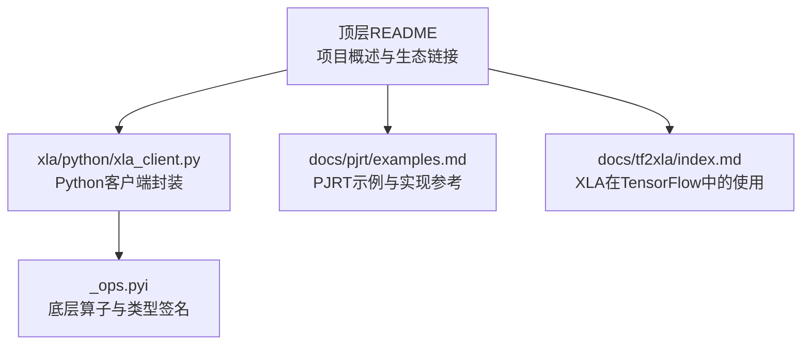
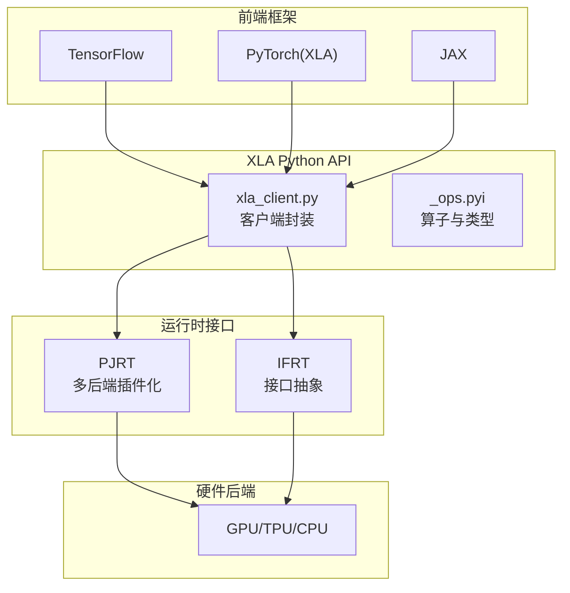
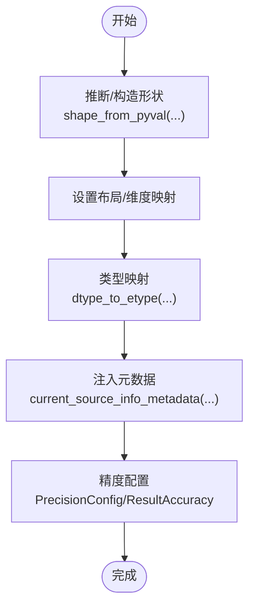
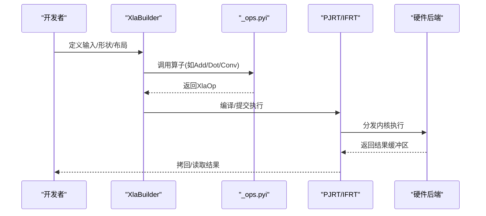
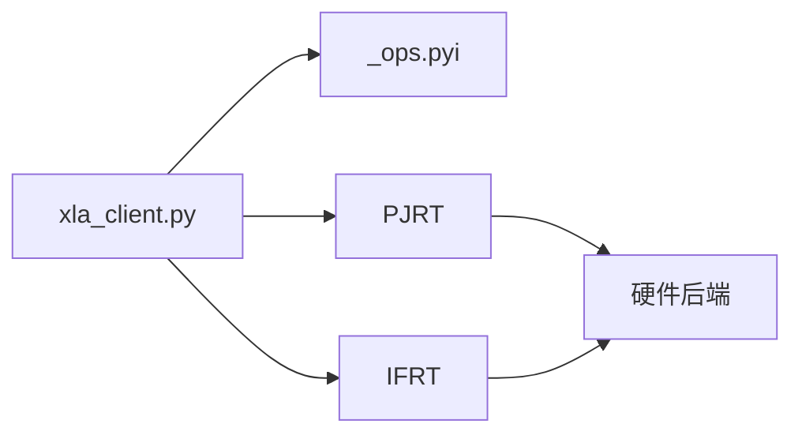

# Python API使用示例

<cite>
**本文引用的文件**
- [README.md](file://README.md)
- [xla_client.py](file://xla/python/xla_client.py)
- [_ops.pyi](file://xla/python/_ops.pyi)
- [examples.md](file://docs/pjrt/examples.md)
- [index.md](file://docs/tf2xla/index.md)
</cite>

## 目录
1. [简介](#简介)
2. [项目结构](#项目结构)
3. [核心组件](#核心组件)
4. [架构总览](#架构总览)
5. [详细组件分析](#详细组件分析)
6. [依赖分析](#依赖分析)
7. [性能考虑](#性能考虑)
8. [故障排查指南](#故障排查指南)
9. [结论](#结论)
10. [附录](#附录)

## 简介
本教程面向希望在Python中直接使用XLA进行高性能张量计算与编译的开发者。内容覆盖从设备与数组初始化、基础与高级张量操作、计算图构建与执行，到与TensorFlow、PyTorch（通过XLA桥接）及NumPy的互操作。同时提供PJRT与IFRT两种运行时接口的应用场景与选择建议，并给出性能基准测试、内存优化技巧与常见问题的解决方案。

## 项目结构
XLA Python API的核心位于 xla/python 目录，包含客户端封装、底层算子类型定义、构建器与编译器接口等模块。顶层README提供了XLA在机器学习生态中的定位与相关前端（如TensorFlow、PyTorch、JAX）的链接。

**图表来源**
- [README.md](file://README.md#L1-L50)
- [xla_client.py](file://xla/python/xla_client.py#L1-L450)
- [_ops.pyi](file://xla/python/_ops.pyi#L1-L702)
- [examples.md](file://docs/pjrt/examples.md#L1-L39)
- [index.md](file://docs/tf2xla/index.md#L1-L235)

**章节来源**
- [README.md](file://README.md#L1-L50)

## 核心组件
- Python客户端封装：提供形状推断、数据类型映射、元数据与精度配置等工具函数，便于在Python侧构造XLA计算图与执行。
- 底层算子类型与符号：通过类型注释文件暴露XLA原生算子、形状、精度、结果精度等核心概念，支撑高层API与底层实现的一致性。
- 运行时接口：PJRT（进程间运行时）与IFRT（接口抽象）分别面向多后端插件化与统一接口抽象，二者在实际应用中有不同的适用场景与权衡。

**章节来源**
- [xla_client.py](file://xla/python/xla_client.py#L40-L141)
- [_ops.pyi](file://xla/python/_ops.pyi#L24-L91)

## 架构总览
下图展示了XLA Python API在系统中的位置与交互关系：上层通过TensorFlow或PyTorch（经XLA桥接）生成XLA计算图；Python客户端负责形状与类型处理、元数据注入；底层通过PJRT/IFRT与硬件后端通信并执行。

**图表来源**
- [README.md](file://README.md#L11-L24)
- [xla_client.py](file://xla/python/xla_client.py#L1-L450)
- [_ops.pyi](file://xla/python/_ops.pyi#L1-L702)
- [examples.md](file://docs/pjrt/examples.md#L1-L39)

## 详细组件分析

### 设备初始化与环境准备
- 选择运行时：根据部署需求选择PJRT或IFRT。PJRT适合需要与多后端插件对接的场景；IFRT适合统一接口抽象与跨平台一致性。
- 前端集成：若使用TensorFlow，可借助其XLA编译能力；若使用PyTorch，可通过XLA桥接进入XLA执行路径。
- 环境变量与标志：可结合XLA与前端框架的标志位进行调试与性能调优（例如XLA转储、自动聚簇等）。

**章节来源**
- [README.md](file://README.md#L11-L24)
- [index.md](file://docs/tf2xla/index.md#L35-L144)

### 数组与形状操作
- 形状与布局：通过形状描述符与布局参数控制张量维度与内存布局，支持动态形状与多维切片。
- 数据类型映射：将XLA元素类型与NumPy/自定义类型映射，确保在Python侧与底层执行一致。
- 元数据与精度：可为算子注入源码位置信息与精度配置，便于调试与数值稳定性控制。

**图表来源**
- [xla_client.py](file://xla/python/xla_client.py#L143-L156)
- [xla_client.py](file://xla/python/xla_client.py#L79-L81)
- [xla_client.py](file://xla/python/xla_client.py#L129-L140)
- [xla_client.py](file://xla/python/xla_client.py#L84-L110)

**章节来源**
- [xla_client.py](file://xla/python/xla_client.py#L40-L141)

### 计算图构建与执行
- 构建器与算子：通过底层算子符号与类型定义，组合出加减乘除、卷积、归约、变换等复杂计算图。
- 执行策略：在PJRT/IFRT下提交编译后的可执行体，按需进行异步执行与结果收集。

**图表来源**
- [_ops.pyi](file://xla/python/_ops.pyi#L556-L702)
- [xla_client.py](file://xla/python/xla_client.py#L33-L37)

**章节来源**
- [_ops.pyi](file://xla/python/_ops.pyi#L24-L91)

### 与TensorFlow集成
- 显式编译：使用装饰器或模型编译选项启用XLA，获得更紧凑的内核与更好的带宽利用。
- 自动聚簇：在不修改源码的前提下，由XLA自动识别可融合子图并生成优化后的内核。
- 可视化与调试：通过转储XLA程序与LLVM/PTX中间表示，辅助定位性能瓶颈与错误。

**章节来源**
- [index.md](file://docs/tf2xla/index.md#L35-L198)

### 与PyTorch集成（通过XLA）
- 使用XLA后端：将PyTorch张量转换至XLA设备，借助XLA编译与执行加速训练/推理。
- 与NumPy互操作：通过缓冲区拷贝与类型转换，实现CPU侧NumPy数组与XLA设备张量之间的高效互操作。

**章节来源**
- [README.md](file://README.md#L11-L24)

### 与NumPy互操作
- 类型与形状：利用类型映射与形状推断，确保在NumPy与XLA之间传递数据时保持语义一致。
- 内存与拷贝：在频繁互操作场景下，尽量减少主机-设备拷贝次数，优先在设备侧进行计算。

**章节来源**
- [xla_client.py](file://xla/python/xla_client.py#L40-L141)

### ifrt与pjrt_ifrt的选择标准
- PJRT（进程间运行时）：强调多后端插件化与灵活扩展，适合需要直接对接不同硬件后端或已有PJRT插件生态的场景。
- IFRT（接口抽象）：强调统一接口与跨平台一致性，适合需要在多种后端间切换或对抽象层有更高要求的场景。
- 实践建议：若已有PJRT插件与部署流程，优先选择PJRT；若追求接口一致性与可移植性，可采用IFRT抽象层。

**章节来源**
- [examples.md](file://docs/pjrt/examples.md#L1-L39)

## 依赖分析
- 组件耦合：Python客户端封装与底层算子类型紧密耦合，前者负责高层语义（形状、类型、元数据），后者提供底层算子能力。
- 外部依赖：与前端框架（TensorFlow、PyTorch）、NumPy、JAX等存在间接依赖，通过XLA桥接进入统一执行路径。
- 运行时依赖：PJRT/IFRT作为执行后端，承担与硬件后端的通信职责。

**图表来源**
- [xla_client.py](file://xla/python/xla_client.py#L1-L450)
- [_ops.pyi](file://xla/python/_ops.pyi#L1-L702)

**章节来源**
- [xla_client.py](file://xla/python/xla_client.py#L1-L450)
- [_ops.pyi](file://xla/python/_ops.pyi#L1-L702)

## 性能考虑
- 图融合与内核复用：通过XLA自动聚簇或显式编译，减少中间结果写回内存，提升带宽利用率。
- 动态形状与布局：合理设置动态维度与布局，避免不必要的重排与拷贝。
- 精度与数值稳定：在允许范围内调整精度配置与结果容差，平衡性能与数值稳定性。
- 调试与剖析：利用XLA转储与前端标志位输出中间表示，定位热点与异常路径。

**章节来源**
- [index.md](file://docs/tf2xla/index.md#L146-L198)

## 故障排查指南
- 形状与布局不匹配：检查形状推断与布局参数，确保与算子期望一致。
- 类型不兼容：确认数据类型映射是否正确，避免隐式转换导致的精度损失。
- 执行失败与超时：查看XLA转储与日志，结合前端标志位定位问题根因。
- 内存不足：减少主机-设备拷贝、合并小张量、使用合适的批大小与布局。

**章节来源**
- [xla_client.py](file://xla/python/xla_client.py#L143-L195)

## 结论
XLA Python API为高性能张量计算提供了从形状/类型处理到算子构建与执行的完整链路。结合TensorFlow、PyTorch（经XLA桥接）与NumPy，可在不同前端与后端间灵活切换。选择PJRT或IFRT取决于具体部署与抽象需求。通过合理的性能调优与调试手段，可显著提升模型训练与推理效率。

## 附录
- 快速开始：参考顶层README了解XLA在ML生态中的定位与相关前端链接。
- 示例与实现参考：参阅PJRT示例文档，了解多语言/多后端的集成方式。
- TensorFlow使用指南：参阅XLA在TensorFlow中的使用索引，掌握编译、聚簇与调试方法。

**章节来源**
- [README.md](file://README.md#L1-L50)
- [examples.md](file://docs/pjrt/examples.md#L1-L39)
- [index.md](file://docs/tf2xla/index.md#L1-L235)