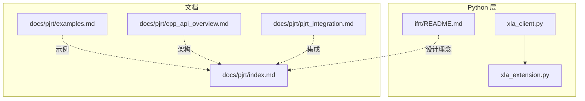
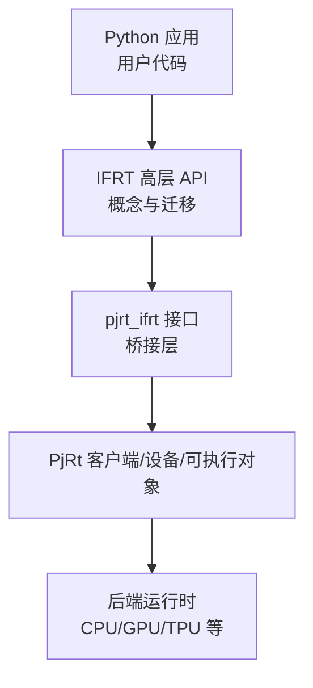
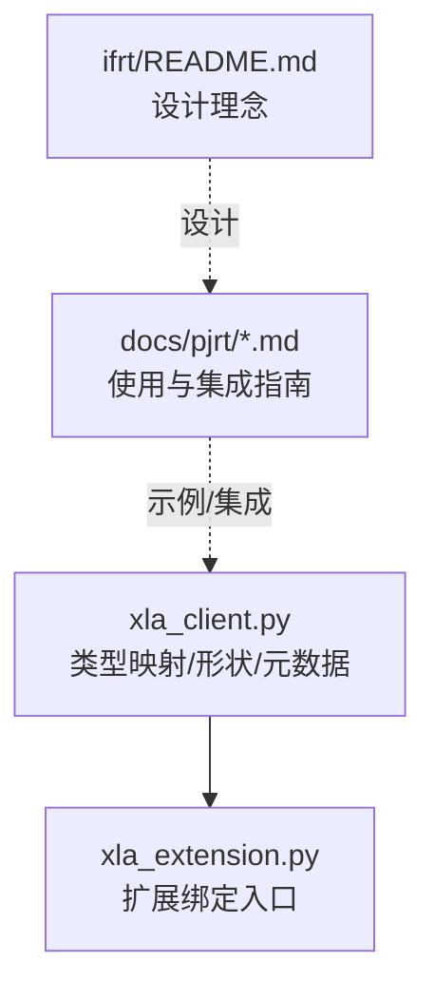

# Python绑定接口

<cite>
**本文引用的文件**
- [xla_client.py](file://xla/python/xla_client.py)
- [xla_extension.py](file://xla/python/xla_extension.py)
- [README.md（IFRT）](file://xla/python/ifrt/README.md)
- [examples.md（PJRT 文档）](file://docs/pjrt/examples.md)
- [index.md（PJRT 文档）](file://docs/pjrt/index.md)
- [cpp_api_overview.md（PJRT 文档）](file://docs/pjrt/cpp_api_overview.md)
- [pjrt_integration.md（PJRT 文档）](file://docs/pjrt/pjrt_integration.md)
</cite>

## 目录
1. [引言](#引言)
2. [项目结构](#项目结构)
3. [核心组件](#核心组件)
4. [架构总览](#架构总览)
5. [组件详解](#组件详解)
6. [依赖关系分析](#依赖关系分析)
7. [性能考量](#性能考量)
8. [故障排查指南](#故障排查指南)
9. [结论](#结论)
10. [附录](#附录)

## 引言
本文件面向使用 PJRT Python 绑定进行机器学习模型编译与执行的开发者，系统梳理 ifrt 与 pjrt_ifrt 接口在 Python 层的高级 API，覆盖设备管理、数组操作、编译与执行、分布式执行、与 NumPy 的互操作、异步执行模式以及错误处理策略，并给出性能优化建议与最佳实践。本文所有技术细节均基于仓库中的源码与文档，避免臆测，便于不同技术背景的读者理解与落地。

## 项目结构
围绕 PJRT Python 绑定的关键位置如下：
- Python 高层封装与互操作：xla/python 下的若干模块，如 xla_client.py、xla_extension.py 等，负责类型映射、形状推断、元数据包装等。
- IFRT 概念与定位：xla/python/ifrt/README.md 提供了 IFRT 的目标与设计动机，有助于理解其与 PjRt 的关系及迁移路径。
- PJRT 示例与集成文档：docs/pjrt 下的 index、examples、cpp_api_overview、pjrt_integration 等文档，提供了使用 PJRT 的高层思路与集成方式，可作为 ifrt/pjrt_ifrt 使用的参考。

**图示来源**
- [xla_client.py](file://xla/python/xla_client.py#L1-L450)
- [xla_extension.py](file://xla/python/xla_extension.py#L1-L18)
- [README.md（IFRT）](file://xla/python/ifrt/README.md#L1-L37)
- [index.md（PJRT 文档）](file://docs/pjrt/index.md)
- [examples.md（PJRT 文档）](file://docs/pjrt/examples.md)
- [cpp_api_overview.md（PJRT 文档）](file://docs/pjrt/cpp_api_overview.md)
- [pjrt_integration.md（PJRT 文档）](file://docs/pjrt/pjrt_integration.md)

**章节来源**
- [xla_client.py](file://xla/python/xla_client.py#L1-L450)
- [xla_extension.py](file://xla/python/xla_extension.py#L1-L18)
- [README.md（IFRT）](file://xla/python/ifrt/README.md#L1-L37)
- [index.md（PJRT 文档）](file://docs/pjrt/index.md)
- [examples.md（PJRT 文档）](file://docs/pjrt/examples.md)
- [cpp_api_overview.md（PJRT 文档）](file://docs/pjrt/cpp_api_overview.md)
- [pjrt_integration.md（PJRT 文档）](file://docs/pjrt/pjrt_integration.md)

## 核心组件
本节从 Python 绑定视角，总结与 PJRT/ifrt 直接相关的核心概念与工具类，帮助快速建立对 API 的整体认知。

- 类型与形状映射
  - 元素类型到 NumPy dtype 的双向映射表，用于在 XLA 与 NumPy 之间转换数据类型。
  - 形状构造函数，支持从 Python 值或嵌套结构推断形状，便于构建输入/输出描述。
- 元数据与精度配置
  - OpMetadata：携带算子类型、名称与源码位置信息，便于调试与追踪。
  - PrecisionConfig：封装精度策略，用于控制数值精度与加速策略。
  - ResultAccuracy：封装结果精度容差与 ULPs 等指标。
- 卷积/点积/散集/规整等维度配置
  - 提供多种维度配置对象（如 DotDimensionNumbers、ConvolutionDimensionNumbers、GatherDimensionNumbers、ScatterDimensionNumbers），统一以 Python 对象表达底层协议缓冲区，简化调用。
- 分布式/并行相关
  - ReplicaGroup：用于表达副本分组，配合分布式执行策略使用。

上述组件在 Python 层通过类型包装与工厂函数暴露，降低直接操作底层协议缓冲区的复杂度，提升易用性与一致性。

**章节来源**
- [xla_client.py](file://xla/python/xla_client.py#L40-L76)
- [xla_client.py](file://xla/python/xla_client.py#L84-L127)
- [xla_client.py](file://xla/python/xla_client.py#L143-L156)
- [xla_client.py](file://xla/python/xla_client.py#L246-L290)
- [xla_client.py](file://xla/python/xla_client.py#L292-L389)
- [xla_client.py](file://xla/python/xla_client.py#L392-L424)
- [xla_client.py](file://xla/python/xla_client.py#L426-L449)

## 架构总览
下图展示了 Python 层与底层 PJRT/IFRT 的交互关系，以及与文档中 PJRT 使用思路的对应：

说明：
- IFRT 作为“过渡框架运行时”，旨在为上层框架（如 JAX/PyTorch/TensorFlow）提供更易移植的高层抽象。
- pjrt_ifrt 是连接 IFRT 与 PjRt 的桥接层，使现有 PjRt 用户能以较低成本迁移到 IFRT。
- PjRt 客户端/设备/可执行对象是实际执行计算的载体，具体实现由后端驱动。

**图示来源**
- [README.md（IFRT）](file://xla/python/ifrt/README.md#L1-L37)
- [index.md（PJRT 文档）](file://docs/pjrt/index.md)
- [examples.md（PJRT 文档）](file://docs/pjrt/examples.md)
- [cpp_api_overview.md（PJRT 文档）](file://docs/pjrt/cpp_api_overview.md)
- [pjrt_integration.md（PJRT 文档）](file://docs/pjrt/pjrt_integration.md)

## 组件详解

### 设备与客户端（Client）
- 设备管理
  - 通过 PjRt 客户端枚举可用设备，选择目标设备进行后续编译与执行。
  - 支持多设备并行与分布式执行场景下的设备分组与拓扑感知。
- 客户端生命周期
  - 初始化客户端 → 选择设备 → 编译程序 → 执行/获取结果 → 清理资源。
- 异步执行
  - 在执行阶段采用异步模式，避免阻塞主线程；通过回调或 Future 模式等待完成。

注意：本节为概念性说明，具体 API 名称与参数请参考 PJRT 文档与示例。

**章节来源**
- [index.md（PJRT 文档）](file://docs/pjrt/index.md)
- [examples.md（PJRT 文档）](file://docs/pjrt/examples.md)
- [cpp_api_overview.md（PJRT 文档）](file://docs/pjrt/cpp_api_overview.md)
- [pjrt_integration.md（PJRT 文档）](file://docs/pjrt/pjrt_integration.md)

### 数组与缓冲（Array/Buffer）
- 数组/缓冲语义
  - 表达设备侧张量数据，支持与 NumPy 的互操作。
  - 支持布局、形状、元素类型等属性的统一描述。
- 互操作
  - 将 NumPy 数组转换为设备缓冲，或将设备缓冲导出为 NumPy 数组。
  - 注意 dtype 映射与内存布局，确保零拷贝或最小化拷贝。
- 数组操作
  - 支持切片、拼接、重排、归约等常见操作，底层由后端高效实现。

**章节来源**
- [xla_client.py](file://xla/python/xla_client.py#L40-L76)
- [xla_client.py](file://xla/python/xla_client.py#L143-L156)

### 编译与执行（Executable）
- 编译流程
  - 从高层算子图或 MLIR/HLO 构建可执行对象，支持多设备/多主机分发。
  - 可配置精度、布局、内存预算等策略。
- 执行流程
  - 将输入数组映射到可执行对象的参数签名，提交执行并返回结果数组。
  - 支持批量执行与流水线化，提升吞吐。

**章节来源**
- [examples.md（PJRT 文档）](file://docs/pjrt/examples.md)
- [cpp_api_overview.md（PJRT 文档）](file://docs/pjrt/cpp_api_overview.md)

### 分布式执行
- 多主机/多设备拓扑
  - 通过 ReplicaGroup 等机制组织设备分组，实现跨设备/跨主机的并行执行。
- 跨设备通信
  - 在分布式场景下，注意数据分片与同步点的设计，避免死锁与带宽瓶颈。

**章节来源**
- [xla_client.py](file://xla/python/xla_client.py#L426-L449)
- [pjrt_integration.md（PJRT 文档）](file://docs/pjrt/pjrt_integration.md)

### ifrt 与 pjrt_ifrt 接口使用要点
- 迁移路径
  - IFRT 的设计目标之一是与现有 PjRt 用户平滑迁移，初期通过 IFRT 的 PjRt 实现降低切换成本。
- 接口抽象
  - ifrt 提供更高层的声明式能力，将部分执行策略决策下沉至运行时实现，便于跨硬件平台的一致行为。

**章节来源**
- [README.md（IFRT）](file://xla/python/ifrt/README.md#L1-L37)

## 依赖关系分析
下图展示 Python 层与底层运行时之间的依赖关系，以及文档对使用方式的指导：

**图示来源**
- [xla_client.py](file://xla/python/xla_client.py#L1-L450)
- [xla_extension.py](file://xla/python/xla_extension.py#L1-L18)
- [README.md（IFRT）](file://xla/python/ifrt/README.md#L1-L37)
- [index.md（PJRT 文档）](file://docs/pjrt/index.md)
- [examples.md（PJRT 文档）](file://docs/pjrt/examples.md)
- [cpp_api_overview.md（PJRT 文档）](file://docs/pjrt/cpp_api_overview.md)
- [pjrt_integration.md（PJRT 文档）](file://docs/pjrt/pjrt_integration.md)

**章节来源**
- [xla_client.py](file://xla/python/xla_client.py#L1-L450)
- [xla_extension.py](file://xla/python/xla_extension.py#L1-L18)
- [README.md（IFRT）](file://xla/python/ifrt/README.md#L1-L37)
- [index.md（PJRT 文档）](file://docs/pjrt/index.md)
- [examples.md（PJRT 文档）](file://docs/pjrt/examples.md)
- [cpp_api_overview.md（PJRT 文档）](file://docs/pjrt/cpp_api_overview.md)
- [pjrt_integration.md（PJRT 文档）](file://docs/pjrt/pjrt_integration.md)

## 性能考量
- 数据类型与布局
  - 利用 dtype 映射与布局配置，减少不必要的类型转换与内存重排。
- 异步执行与流水线
  - 合理安排异步执行与数据传输，避免 CPU-GPU/TPU 间阻塞。
- 分布式通信
  - 在多设备/多主机场景下，尽量使用聚合通信原语，减少同步次数。
- 内存管理
  - 控制缓冲生命周期，及时释放不再使用的设备缓冲，避免 OOM。

[本节为通用建议，不直接分析具体文件]

## 故障排查指南
- 常见问题
  - 设备不可用或权限不足：检查设备枚举与访问权限。
  - 数据类型不匹配：核对 dtype 映射与形状配置。
  - 分布式执行死锁：检查同步点与设备分组。
- 错误处理策略
  - 在 Python 层捕获异常并打印 OpMetadata 中的源码位置信息，辅助定位问题。
  - 对于异步执行，使用回调或 Future 模式处理超时与失败。

**章节来源**
- [xla_client.py](file://xla/python/xla_client.py#L112-L141)
- [xla_client.py](file://xla/python/xla_client.py#L426-L449)

## 结论
通过 IFRT 与 pjrt_ifrt 的抽象，Python 层可以以更一致的方式与 PjRt 交互，实现从单机到多机多设备的平滑扩展。结合文档中的示例与集成指南，开发者可以在保证性能的同时，获得更好的可移植性与可维护性。

[本节为总结性内容，不直接分析具体文件]

## 附录

### A. Python 代码示例（路径指引）
以下示例路径来自 PJRT 文档，建议对照阅读以理解 ifrt/pjrt_ifrt 的使用方式：
- 基础使用与示例：[examples.md（PJRT 文档）](file://docs/pjrt/examples.md)
- 架构概览与高层思路：[cpp_api_overview.md（PJRT 文档）](file://docs/pjrt/cpp_api_overview.md)
- 集成与部署：[pjrt_integration.md（PJRT 文档）](file://docs/pjrt/pjrt_integration.md)
- IFRT 设计理念与迁移路径：[README.md（IFRT）](file://xla/python/ifrt/README.md#L1-L37)

**章节来源**
- [examples.md（PJRT 文档）](file://docs/pjrt/examples.md)
- [cpp_api_overview.md（PJRT 文档）](file://docs/pjrt/cpp_api_overview.md)
- [pjrt_integration.md（PJRT 文档）](file://docs/pjrt/pjrt_integration.md)
- [README.md（IFRT）](file://xla/python/ifrt/README.md#L1-L37)