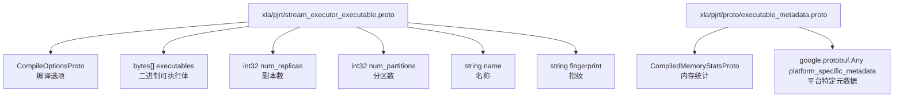
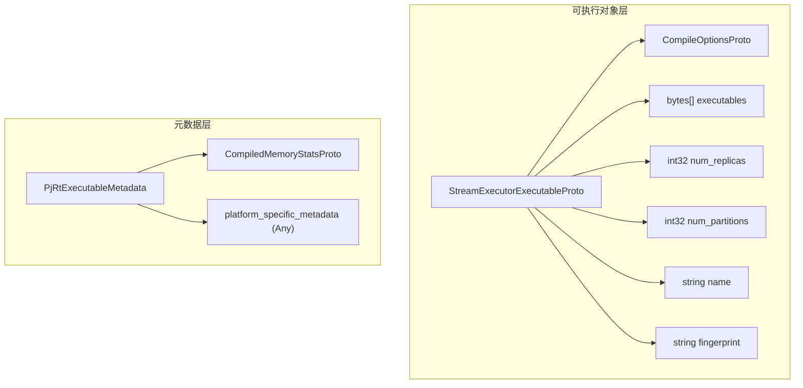
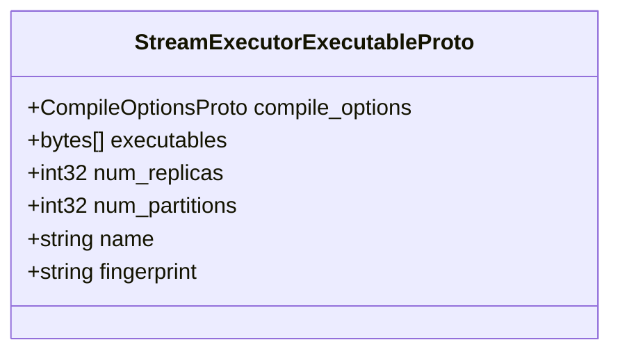
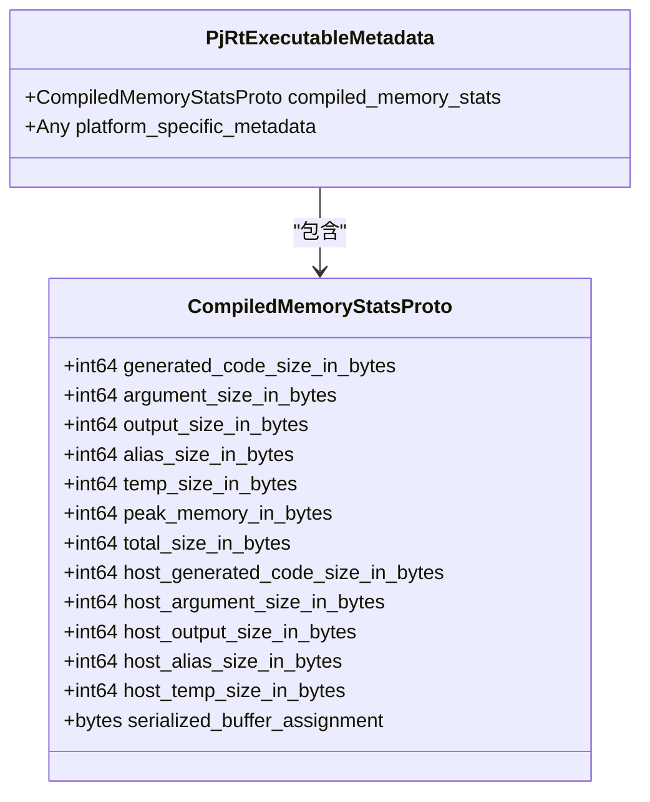
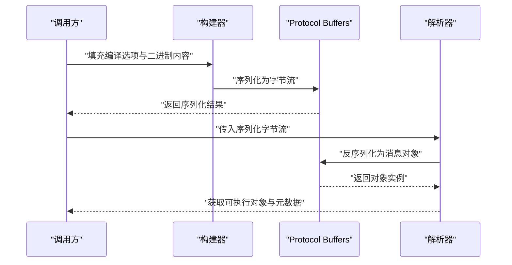
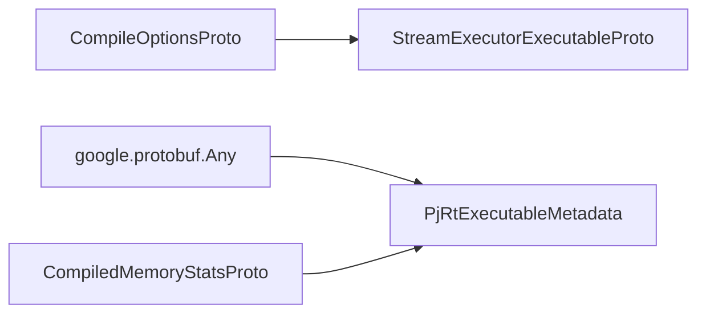

# 协议定义

<cite>
**本文引用的文件**
- [xla/pjrt/stream_executor_executable.proto](file://xla/pjrt/stream_executor_executable.proto)
- [xla/pjrt/proto/executable_metadata.proto](file://xla/pjrt/proto/executable_metadata.proto)
</cite>

## 目录
1. [简介](#简介)
2. [项目结构](#项目结构)
3. [核心组件](#核心组件)
4. [架构总览](#架构总览)
5. [详细组件分析](#详细组件分析)
6. [依赖关系分析](#依赖关系分析)
7. [性能考量](#性能考量)
8. [故障排查指南](#故障排查指南)
9. [结论](#结论)
10. [附录](#附录)

## 简介
本技术文档聚焦于XLA PJRT（Python xla Runtime）协议定义，系统梳理与PJRT相关的关键Protocol Buffers消息，覆盖编译选项、可执行对象元数据、内存统计与平台特定元数据等。文档旨在帮助开发者理解消息字段语义、数据类型与序列化格式，提供协议示例的构建与解析思路，明确版本兼容性与扩展策略，并给出协议扩展与自定义消息类型的实现建议。

## 项目结构
与PJRT协议直接相关的Protocol Buffers文件主要位于以下位置：
- 可执行对象序列化：xla/pjrt/stream_executor_executable.proto
- 可执行元数据与内存统计：xla/pjrt/proto/executable_metadata.proto

图表来源
- [xla/pjrt/stream_executor_executable.proto](file://xla/pjrt/stream_executor_executable.proto#L22-L29)
- [xla/pjrt/proto/executable_metadata.proto](file://xla/pjrt/proto/executable_metadata.proto#L8-L35)

章节来源
- [xla/pjrt/stream_executor_executable.proto](file://xla/pjrt/stream_executor_executable.proto#L1-L30)
- [xla/pjrt/proto/executable_metadata.proto](file://xla/pjrt/proto/executable_metadata.proto#L1-L36)

## 核心组件
本节对关键Protocol Buffers消息进行逐条说明，包括字段含义、数据类型与序列化格式要点。

- StreamExecutorExecutableProto
  - compile_options: 编译选项，类型为CompileOptionsProto（来自导入的compile_options.proto）
  - executables: 字节数组列表，表示各设备或分区上的二进制可执行体
  - num_replicas: 副本数量，整型
  - num_partitions: 分区数量，整型
  - name: 可执行对象名称，字符串
  - fingerprint: 指纹标识，字符串

- CompiledMemoryStatsProto
  - 设备侧内存统计：生成代码大小、参数大小、输出大小、别名大小、临时大小、峰值内存、总大小
  - 主机侧内存统计：主机端生成代码大小、主机端参数大小、主机端输出大小、主机端别名大小、主机端临时大小
  - serialized_buffer_assignment: 序列化的缓冲区分配信息（字节）
  - 平台特定元数据：google.protobuf.Any封装，用于承载后端特定信息

- PjRtExecutableMetadata
  - compiled_memory_stats: 可选的CompiledMemoryStatsProto
  - platform_specific_metadata: 可选的Any类型平台特定元数据

章节来源
- [xla/pjrt/stream_executor_executable.proto](file://xla/pjrt/stream_executor_executable.proto#L22-L29)
- [xla/pjrt/proto/executable_metadata.proto](file://xla/pjrt/proto/executable_metadata.proto#L8-L35)

## 架构总览
下图展示了可执行对象与元数据在PJRT中的组织方式：顶层可执行对象携带编译选项与二进制内容，同时通过元数据对象提供内存统计与平台特定信息。

图表来源
- [xla/pjrt/stream_executor_executable.proto](file://xla/pjrt/stream_executor_executable.proto#L22-L29)
- [xla/pjrt/proto/executable_metadata.proto](file://xla/pjrt/proto/executable_metadata.proto#L32-L35)

## 详细组件分析

### 组件A：StreamExecutorExecutableProto
该消息用于序列化一个可执行对象及其编译配置，便于跨进程/跨平台传输与持久化。

图表来源
- [xla/pjrt/stream_executor_executable.proto](file://xla/pjrt/stream_executor_executable.proto#L22-L29)

章节来源
- [xla/pjrt/stream_executor_executable.proto](file://xla/pjrt/stream_executor_executable.proto#L22-L29)

### 组件B：PjRtExecutableMetadata 与 CompiledMemoryStatsProto
该组合消息提供可执行对象的内存使用统计与平台特定元数据，支持运行时优化与诊断。

图表来源
- [xla/pjrt/proto/executable_metadata.proto](file://xla/pjrt/proto/executable_metadata.proto#L8-L35)

章节来源
- [xla/pjrt/proto/executable_metadata.proto](file://xla/pjrt/proto/executable_metadata.proto#L8-L35)

### 组件C：序列化与解析流程（概念示意）
以下序列图展示从构建到解析的典型流程，帮助理解消息的使用方式。

（此图为概念流程图，不对应具体源码文件）

## 依赖关系分析
- StreamExecutorExecutableProto依赖CompileOptionsProto（来自外部导入），用于表达编译期配置。
- PjRtExecutableMetadata依赖google.protobuf.Any，以支持平台特定扩展。
- 二者共同构成可执行对象的完整描述与运行时元信息。

图表来源
- [xla/pjrt/stream_executor_executable.proto](file://xla/pjrt/stream_executor_executable.proto#L20-L23)
- [xla/pjrt/proto/executable_metadata.proto](file://xla/pjrt/proto/executable_metadata.proto#L34-L35)

章节来源
- [xla/pjrt/stream_executor_executable.proto](file://xla/pjrt/stream_executor_executable.proto#L20-L23)
- [xla/pjrt/proto/executable_metadata.proto](file://xla/pjrt/proto/executable_metadata.proto#L34-L35)

## 性能考量
- 内存统计字段可用于运行时资源规划与热点识别，建议结合峰值内存与总大小进行容量评估。
- 二进制可执行体采用字节数组存储，注意避免不必要的拷贝与重复序列化。
- Any类型的平台特定元数据应谨慎使用，仅在必要时启用，以减少序列化开销。

（本节为通用指导，不涉及具体文件分析）

## 故障排查指南
- 字段缺失或类型不匹配：检查序列化/反序列化过程中的字段映射与版本一致性。
- Any字段无法解析：确认平台特定元数据的类型注册与解析路径正确。
- 内存统计异常：核对compiled_memory_stats字段是否完整，以及serialized_buffer_assignment是否有效。

（本节为通用指导，不涉及具体文件分析）

## 结论
本文档梳理了XLA PJRT中与可执行对象及元数据相关的Protocol Buffers定义，明确了消息字段语义、数据类型与序列化要点，并提供了扩展与兼容性建议。实际应用中，请结合具体后端与平台特性，合理使用Any类型的平台特定元数据，确保协议演进的稳定性与可维护性。

（本节为总结性内容，不涉及具体文件分析）

## 附录

### 版本兼容性与迁移策略
- 向后兼容：新增字段应使用保留字段编号，避免破坏现有序列化；尽量保持默认值安全。
- 向前兼容：移除字段时应标记为reserved，避免新旧版本交错导致的解析错误。
- 迁移策略：通过平台特定元数据（Any）承载实验性功能，在稳定后再纳入标准字段。

（本节为通用指导，不涉及具体文件分析）

### 协议扩展指南与自定义消息类型实现
- 新增标准字段：在现有消息中添加新字段，确保编号不冲突且提供合理的默认值。
- 使用Any扩展：对于平台特定或实验性功能，优先使用google.protobuf.Any封装，避免污染通用协议。
- 自定义消息类型：遵循proto3语法，保持字段类型稳定，提供清晰的命名空间与注释，便于后续维护。

（本节为通用指导，不涉及具体文件分析）