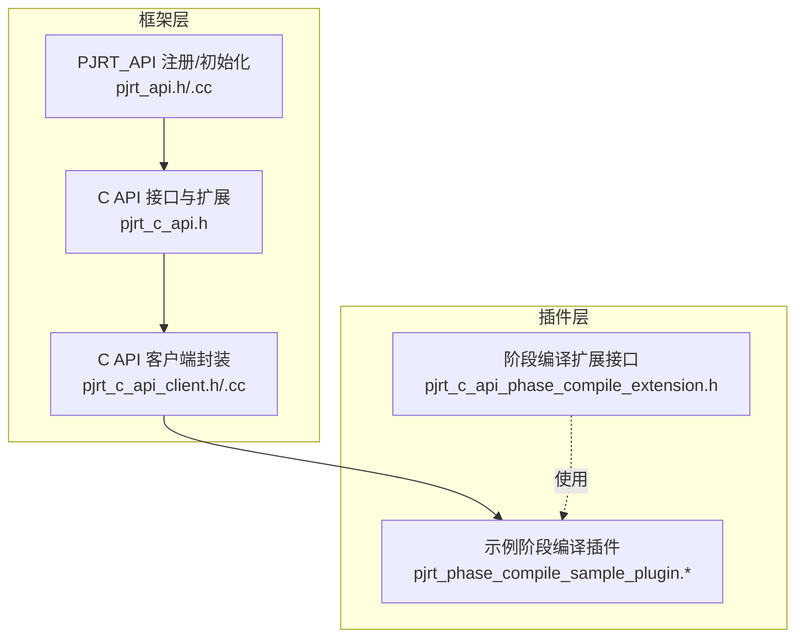
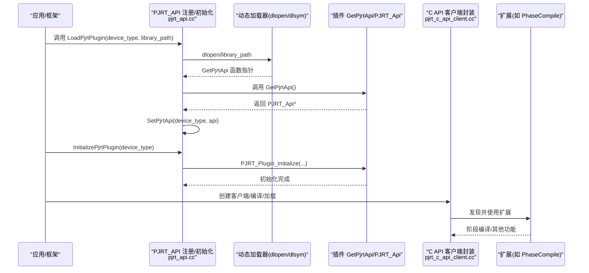
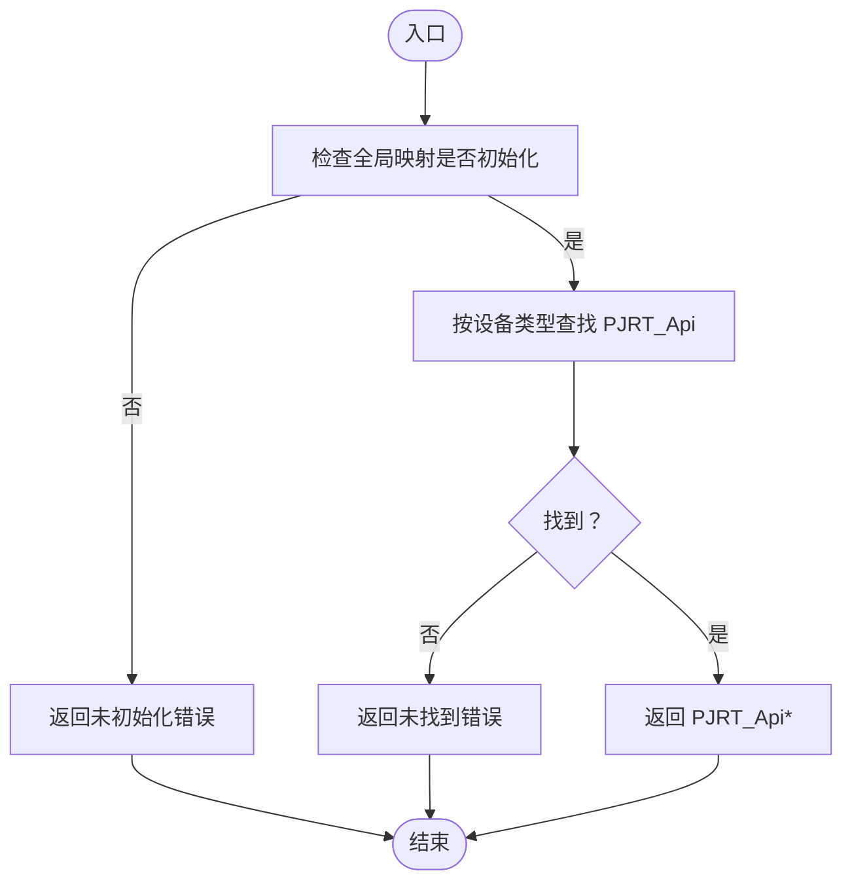
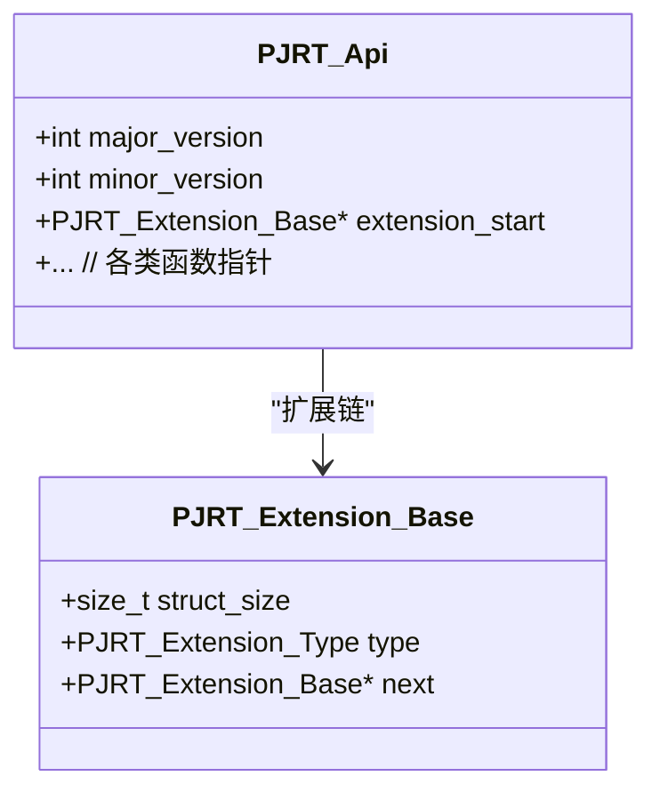
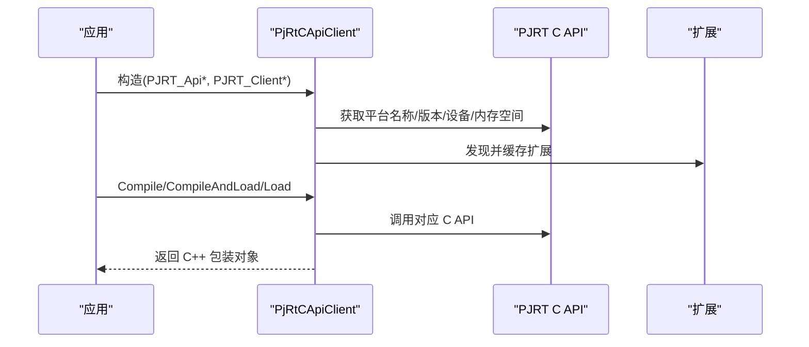
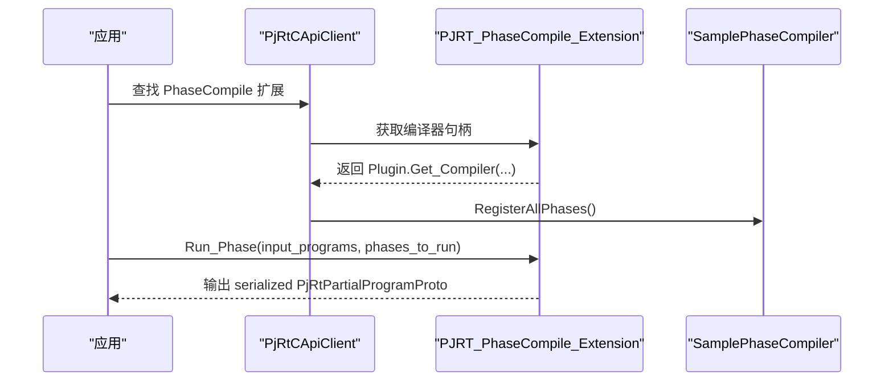
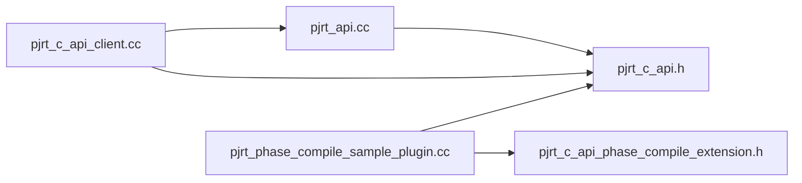

# 插件系统

<cite>
**本文引用的文件**
- [xla/pjrt/pjrt_api.h](file://xla/pjrt/pjrt_api.h)
- [xla/pjrt/pjrt_api.cc](file://xla/pjrt/pjrt_api.cc)
- [xla/pjrt/c/pjrt_c_api.h](file://xla/pjrt/c/pjrt_c_api.h)
- [xla/pjrt/c/pjrt_c_api_phase_compile_extension.h](file://xla/pjrt/c/pjrt_c_api_phase_compile_extension.h)
- [xla/pjrt/c_api_client/pjrt_c_api_client.h](file://xla/pjrt/c_api_client/pjrt_c_api_client.h)
- [xla/pjrt/c_api_client/pjrt_c_api_client.cc](file://xla/pjrt/c_api_client/pjrt_c_api_client.cc)
- [xla/pjrt/pjrt_phase_compile_sample_plugin.h](file://xla/pjrt/pjrt_phase_compile_sample_plugin.h)
- [xla/pjrt/pjrt_phase_compile_sample_plugin.cc](file://xla/pjrt/pjrt_phase_compile_sample_plugin.cc)
- [docs/pjrt/index.md](file://docs/pjrt/index.md)
- [docs/pjrt/examples.md](file://docs/pjrt/examples.md)
- [docs/developing_new_backend.md](file://docs/developing_new_backend.md)
</cite>

## 目录
1. [简介](#简介)
2. [项目结构](#项目结构)
3. [核心组件](#核心组件)
4. [架构总览](#架构总览)
5. [详细组件分析](#详细组件分析)
6. [依赖关系分析](#依赖关系分析)
7. [性能考虑](#性能考虑)
8. [故障排查指南](#故障排查指南)
9. [结论](#结论)
10. [附录](#附录)

## 简介
本文件系统化梳理 XLA 的 PJRT 插件体系，覆盖插件注册机制、动态加载与生命周期管理；给出从零开发自定义后端插件（C API 实现与 Python 绑定）的步骤与最佳实践；明确接口规范、版本管理与兼容性策略；并提供调试、测试与部署建议。

## 项目结构
围绕 PJRT 插件系统的关键目录与文件：
- 插件注册与动态加载：xla/pjrt/pjrt_api.h, xla/pjrt/pjrt_api.cc
- C API 接口与扩展：xla/pjrt/c/pjrt_c_api.h
- 阶段编译扩展：xla/pjrt/c/pjrt_c_api_phase_compile_extension.h
- C API 客户端封装：xla/pjrt/c_api_client/pjrt_c_api_client.h, xla/pjrt/c_api_client/pjrt_c_api_client.cc
- 示例插件（阶段编译）：xla/pjrt/pjrt_phase_compile_sample_plugin.h, xla/pjrt/pjrt_phase_compile_sample_plugin.cc
- 文档与示例：docs/pjrt/index.md, docs/pjrt/examples.md, docs/developing_new_backend.md

图表来源
- [xla/pjrt/pjrt_api.h](file://xla/pjrt/pjrt_api.h#L29-L47)
- [xla/pjrt/pjrt_api.cc](file://xla/pjrt/pjrt_api.cc#L59-L124)
- [xla/pjrt/c/pjrt_c_api.h](file://xla/pjrt/c/pjrt_c_api.h#L98-L124)
- [xla/pjrt/c_api_client/pjrt_c_api_client.h](file://xla/pjrt/c_api_client/pjrt_c_api_client.h#L352-L576)
- [xla/pjrt/c_api_client/pjrt_c_api_client.cc](file://xla/pjrt/c_api_client/pjrt_c_api_client.cc#L162-L183)
- [xla/pjrt/c/pjrt_c_api_phase_compile_extension.h](file://xla/pjrt/c/pjrt_c_api_phase_compile_extension.h#L141-L148)
- [xla/pjrt/pjrt_phase_compile_sample_plugin.h](file://xla/pjrt/pjrt_phase_compile_sample_plugin.h#L36-L88)

章节来源
- [xla/pjrt/pjrt_api.h](file://xla/pjrt/pjrt_api.h#L29-L47)
- [xla/pjrt/pjrt_api.cc](file://xla/pjrt/pjrt_api.cc#L59-L124)
- [xla/pjrt/c/pjrt_c_api.h](file://xla/pjrt/c/pjrt_c_api.h#L98-L124)
- [xla/pjrt/c_api_client/pjrt_c_api_client.h](file://xla/pjrt/c_api_client/pjrt_c_api_client.h#L352-L576)
- [xla/pjrt/c_api_client/pjrt_c_api_client.cc](file://xla/pjrt/c_api_client/pjrt_c_api_client.cc#L162-L183)
- [xla/pjrt/c/pjrt_c_api_phase_compile_extension.h](file://xla/pjrt/c/pjrt_c_api_phase_compile_extension.h#L141-L148)
- [xla/pjrt/pjrt_phase_compile_sample_plugin.h](file://xla/pjrt/pjrt_phase_compile_sample_plugin.h#L36-L88)

## 核心组件
- 插件注册与全局映射
  - 全局设备类型到 PJRT_Api 的映射表，提供查询、设置、获取已注册设备类型列表的能力。
  - 关键函数：PjrtApi、SetPjrtApi、GetRegisteredPjrtApis。
- 动态加载与初始化
  - LoadPjrtPlugin：通过 dlopen/dlsym 获取 GetPjrtApi 符号，调用以获得 PJRT_Api 并注册。
  - InitializePjrtPlugin：校验 API 版本兼容性（支持前向兼容开关），调用 PJRT_Plugin_Initialize。
- C API 接口与扩展
  - 定义 PJRT_Api、版本号、错误模型、事件模型、客户端/设备/可执行对象等。
  - 扩展类型枚举（含 PhaseCompile、Profiler、CustomPartitioner 等）。
- C API 客户端封装
  - 将 C API 对象包装为 C++ 友好接口，负责设备/内存空间/拓扑描述/编译/加载/执行等。
  - 支持扩展发现与回调注册。
- 示例阶段编译插件
  - 展示如何实现 PhaseCompile 扩展：注册阶段、验证输入、编译流程、导出 GetPjrtApi。
  - 提供稳定 HLO 序列化/反序列化工具类。

章节来源
- [xla/pjrt/pjrt_api.h](file://xla/pjrt/pjrt_api.h#L29-L47)
- [xla/pjrt/pjrt_api.cc](file://xla/pjrt/pjrt_api.cc#L59-L124)
- [xla/pjrt/c/pjrt_c_api.h](file://xla/pjrt/c/pjrt_c_api.h#L98-L124)
- [xla/pjrt/c_api_client/pjrt_c_api_client.h](file://xla/pjrt/c_api_client/pjrt_c_api_client.h#L352-L576)
- [xla/pjrt/c_api_client/pjrt_c_api_client.cc](file://xla/pjrt/c_api_client/pjrt_c_api_client.cc#L162-L183)
- [xla/pjrt/c/pjrt_c_api_phase_compile_extension.h](file://xla/pjrt/c/pjrt_c_api_phase_compile_extension.h#L141-L148)
- [xla/pjrt/pjrt_phase_compile_sample_plugin.h](file://xla/pjrt/pjrt_phase_compile_sample_plugin.h#L36-L88)

## 架构总览
下图展示了从应用侧到插件侧的调用链路与关键交互点。

图表来源
- [xla/pjrt/pjrt_api.cc](file://xla/pjrt/pjrt_api.cc#L100-L124)
- [xla/pjrt/pjrt_api.cc](file://xla/pjrt/pjrt_api.cc#L152-L206)
- [xla/pjrt/c_api_client/pjrt_c_api_client.cc](file://xla/pjrt/c_api_client/pjrt_c_api_client.cc#L162-L183)
- [xla/pjrt/c/pjrt_c_api_phase_compile_extension.h](file://xla/pjrt/c/pjrt_c_api_phase_compile_extension.h#L141-L148)

## 详细组件分析

### 组件A：插件注册与动态加载（pjrt_api）
- 设计要点
  - 全局哈希表保存设备类型到 PJRT_Api 指针及“是否已初始化”标记。
  - SetPjrtApi 去重并记录初始化状态；IsPjrtPluginInitialized 用于幂等检查。
  - LoadPjrtPlugin 在非 Windows 平台使用 dlopen/dlsym 加载库并解析符号。
  - InitializePjrtPlugin 校验 API 版本兼容性（前向兼容开关 ENABLE_PJRT_COMPATIBILITY 控制）。
- 生命周期
  - 注册：SetPjrtApi
  - 加载：LoadPjrtPlugin
  - 初始化：InitializePjrtPlugin
  - 查询：PjrtApi、GetRegisteredPjrtApis

图表来源
- [xla/pjrt/pjrt_api.h](file://xla/pjrt/pjrt_api.h#L29-L47)
- [xla/pjrt/pjrt_api.cc](file://xla/pjrt/pjrt_api.cc#L59-L98)

章节来源
- [xla/pjrt/pjrt_api.h](file://xla/pjrt/pjrt_api.h#L29-L47)
- [xla/pjrt/pjrt_api.cc](file://xla/pjrt/pjrt_api.cc#L59-L98)
- [xla/pjrt/pjrt_api.cc](file://xla/pjrt/pjrt_api.cc#L100-L124)
- [xla/pjrt/pjrt_api.cc](file://xla/pjrt/pjrt_api.cc#L152-L206)

### 组件B：C API 接口与扩展（pjrt_c_api）
- 设计要点
  - 定义 PJRT_Api 结构体、版本号（major/minor）、扩展链（PJRT_Extension_Base）。
  - 错误模型统一为 PJRT_Error*，调用方负责释放。
  - 客户端/设备/缓冲区/可执行对象等抽象均通过 C API 访问。
  - 扩展类型涵盖 Profiler、CustomPartitioner、PhaseCompile、FFI、Collectives 等。
- 版本与兼容性
  - 通过 PJRT_Api_Version.major_version/minor_version 字段声明兼容范围。
  - 通过 struct_size 字段实现“结构体大小演进”的向后兼容。

图表来源
- [xla/pjrt/c/pjrt_c_api.h](file://xla/pjrt/c/pjrt_c_api.h#L98-L124)
- [xla/pjrt/c/pjrt_c_api.h](file://xla/pjrt/c/pjrt_c_api.h#L81-L89)

章节来源
- [xla/pjrt/c/pjrt_c_api.h](file://xla/pjrt/c/pjrt_c_api.h#L98-L124)
- [xla/pjrt/c/pjrt_c_api.h](file://xla/pjrt/c/pjrt_c_api.h#L81-L89)

### 组件C：C API 客户端封装（pjrt_c_api_client）
- 设计要点
  - 将 C API 对象（PJRT_Client/Device/Buffer/Executable 等）封装为 C++ 友好接口。
  - 自动发现扩展（如 AbiVersion、Callback、HostAllocator、PhaseCompile 等）。
  - 提供编译/加载/执行/拓扑描述/默认设备分配等能力。
- 生命周期
  - 构造时初始化设备/内存空间/属性/扩展，并记录平台信息。
  - 编译/加载/销毁由 C API 客户端协调。

图表来源
- [xla/pjrt/c_api_client/pjrt_c_api_client.h](file://xla/pjrt/c_api_client/pjrt_c_api_client.h#L352-L576)
- [xla/pjrt/c_api_client/pjrt_c_api_client.cc](file://xla/pjrt/c_api_client/pjrt_c_api_client.cc#L162-L183)

章节来源
- [xla/pjrt/c_api_client/pjrt_c_api_client.h](file://xla/pjrt/c_api_client/pjrt_c_api_client.h#L352-L576)
- [xla/pjrt/c_api_client/pjrt_c_api_client.cc](file://xla/pjrt/c_api_client/pjrt_c_api_client.cc#L162-L183)

### 组件D：阶段编译扩展与示例插件（phase compile）
- 设计要点
  - 阶段编译扩展提供“获取编译器、运行阶段、列举阶段名、销毁 C 缓冲区”等能力。
  - 示例插件实现一个稳定的“稳定 HLO 到优化稳定 HLO”的阶段，包含序列化/反序列化工具。
  - 插件通过 CreateSamplePhaseCompileExtension 和 GetSamplePhaseCompilePjrtApi 导出接口。
- 开发流程（概念）
  - 实现 PhaseCompile 扩展函数（获取编译器/销毁编译器/运行阶段/列举阶段名）。
  - 在 GetPjrtApi 中返回包含扩展的 PJRT_Api。
  - 在 InitializePjrtPlugin 中完成插件初始化。

图表来源
- [xla/pjrt/c/pjrt_c_api_phase_compile_extension.h](file://xla/pjrt/c/pjrt_c_api_phase_compile_extension.h#L141-L148)
- [xla/pjrt/pjrt_phase_compile_sample_plugin.cc](file://xla/pjrt/pjrt_phase_compile_sample_plugin.cc#L195-L220)

章节来源
- [xla/pjrt/c/pjrt_c_api_phase_compile_extension.h](file://xla/pjrt/c/pjrt_c_api_phase_compile_extension.h#L141-L148)
- [xla/pjrt/pjrt_phase_compile_sample_plugin.h](file://xla/pjrt/pjrt_phase_compile_sample_plugin.h#L36-L88)
- [xla/pjrt/pjrt_phase_compile_sample_plugin.cc](file://xla/pjrt/pjrt_phase_compile_sample_plugin.cc#L195-L220)

## 依赖关系分析
- 组件耦合
  - pjrt_api.cc 依赖 C API 头文件（pjrt_c_api.h）与辅助头（pjrt_c_api_helpers.h）。
  - c_api_client 依赖 pjrt_api.h 以获取已注册的 PJRT_Api，并通过扩展接口访问插件能力。
  - 示例插件依赖 C API 扩展头与编译器接口。
- 外部依赖
  - 动态加载在非 Windows 平台使用 dlopen/dlsym；Windows 平台暂不支持 LoadPjrtPlugin。
  - 稳定 HLO 序列化/反序列化依赖 MLIR 稳定 HLO 工具链。

图表来源
- [xla/pjrt/pjrt_api.cc](file://xla/pjrt/pjrt_api.cc#L32-L33)
- [xla/pjrt/c_api_client/pjrt_c_api_client.cc](file://xla/pjrt/c_api_client/pjrt_c_api_client.cc#L63-L69)
- [xla/pjrt/pjrt_phase_compile_sample_plugin.cc](file://xla/pjrt/pjrt_phase_compile_sample_plugin.cc#L42-L48)

章节来源
- [xla/pjrt/pjrt_api.cc](file://xla/pjrt/pjrt_api.cc#L32-L33)
- [xla/pjrt/c_api_client/pjrt_c_api_client.cc](file://xla/pjrt/c_api_client/pjrt_c_api_client.cc#L63-L69)
- [xla/pjrt/pjrt_phase_compile_sample_plugin.cc](file://xla/pjrt/pjrt_phase_compile_sample_plugin.cc#L42-L48)

## 性能考虑
- 动态加载开销
  - dlopen/dlsym 仅在首次加载插件时发生；建议在进程启动阶段尽早加载并初始化，避免运行时抖动。
- 版本兼容性检查
  - InitializePjrtPlugin 中的版本校验会带来少量 CPU 开销，但能显著降低 ABI 不匹配导致的崩溃风险。
- 扩展发现与回调
  - C API 客户端在构造时遍历扩展链并缓存，后续访问直接命中缓存，避免重复扫描。
- 阶段编译
  - 示例插件对稳定 HLO 进行简化 Pass，建议在 CI 中进行稳定性与性能回归测试。

## 故障排查指南
- 常见错误与定位
  - “未初始化”：确保先调用 SetPjrtApi 或 LoadPjrtPlugin 再查询或初始化。
  - “未找到设备类型”：确认设备类型大小写无关的规范化处理与注册一致。
  - “Windows 不支持动态加载”：在 Windows 平台需采用替代方案或使用支持的构建方式。
  - “版本不兼容”：根据错误提示调整插件或框架的 PJRT_API 版本，或启用/禁用前向兼容开关。
- 调试建议
  - 启用日志（框架侧与插件侧），关注 LoadPjrtPlugin 成功路径与 InitializePjrtPlugin 的版本输出。
  - 使用 C API 客户端封装提供的扩展能力（如 AbiVersion、Callback）进行行为验证。
  - 阶段编译问题优先检查输入格式（稳定 HLO 字节码）与消费者阶段列表。

章节来源
- [xla/pjrt/pjrt_api.cc](file://xla/pjrt/pjrt_api.cc#L59-L98)
- [xla/pjrt/pjrt_api.cc](file://xla/pjrt/pjrt_api.cc#L100-L124)
- [xla/pjrt/pjrt_api.cc](file://xla/pjrt/pjrt_api.cc#L174-L198)
- [xla/pjrt/c_api_client/pjrt_c_api_client.cc](file://xla/pjrt/c_api_client/pjrt_c_api_client.cc#L162-L183)

## 结论
XLA 的 PJRT 插件体系通过清晰的 C API 接口、严格的版本与兼容性策略、以及完善的扩展机制，为多后端统一抽象提供了坚实基础。开发者可基于示例插件快速实现自定义后端，并通过 C API 客户端封装与阶段编译扩展提升可维护性与可观测性。

## 附录

### A. 插件开发步骤（从零到一）
- 步骤概览
  - 实现 GetPjrtApi，返回包含扩展的 PJRT_Api。
  - 在 InitializePjrtPlugin 中完成一次性初始化。
  - 通过 LoadPjrtPlugin 动态加载或在进程启动时注册 SetPjrtApi。
  - 使用 C API 客户端封装进行编译/加载/执行。
- 参考路径
  - 示例插件导出接口：GetSamplePhaseCompilePjrtApi
  - 阶段编译扩展：CreateSamplePhaseCompileExtension
  - C API 客户端封装：PjRtCApiClient

章节来源
- [xla/pjrt/pjrt_phase_compile_sample_plugin.cc](file://xla/pjrt/pjrt_phase_compile_sample_plugin.cc#L242-L252)
- [xla/pjrt/pjrt_phase_compile_sample_plugin.cc](file://xla/pjrt/pjrt_phase_compile_sample_plugin.cc#L216-L220)
- [xla/pjrt/c_api_client/pjrt_c_api_client.h](file://xla/pjrt/c_api_client/pjrt_c_api_client.h#L352-L576)

### B. 接口规范与兼容性
- 接口规范
  - PJRT_Api 必须声明自身 major/minor 版本，并提供扩展链起始节点。
  - 所有结构体通过 struct_size 字段实现向后兼容。
- 兼容性策略
  - 前向兼容开关 ENABLE_PJRT_COMPATIBILITY 控制是否允许插件 minor 版本低于最小支持值。
  - 建议插件 minor 版本不低于框架最小支持版本（kMinPjRtMinor）。

章节来源
- [xla/pjrt/c/pjrt_c_api.h](file://xla/pjrt/c/pjrt_c_api.h#L98-L124)
- [xla/pjrt/pjrt_api.cc](file://xla/pjrt/pjrt_api.cc#L42-L49)
- [xla/pjrt/pjrt_api.cc](file://xla/pjrt/pjrt_api.cc#L174-L198)

### C. 文档与示例参考
- PJRT 总览与资源：docs/pjrt/index.md
- 示例与第三方实现：docs/pjrt/examples.md
- 新后端开发背景与场景：docs/developing_new_backend.md

章节来源
- [docs/pjrt/index.md](file://docs/pjrt/index.md#L6-L31)
- [docs/pjrt/examples.md](file://docs/pjrt/examples.md#L1-L39)
- [docs/developing_new_backend.md](file://docs/developing_new_backend.md#L1-L77)