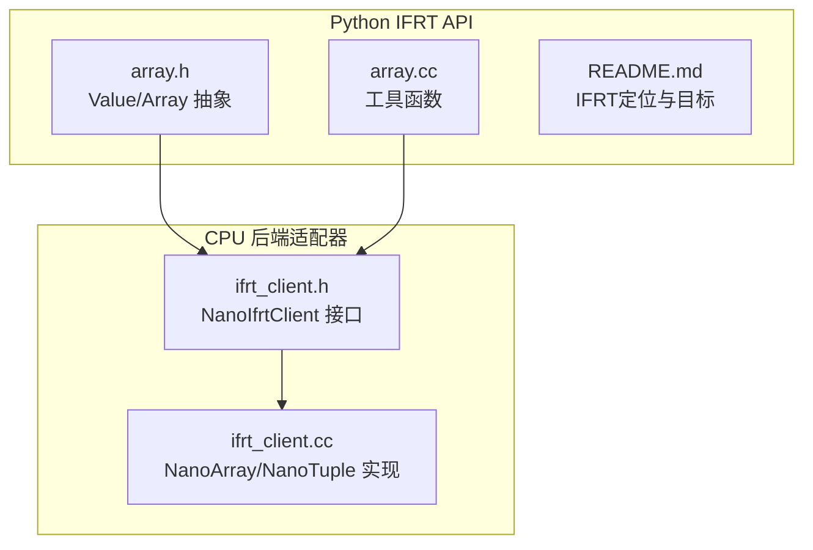
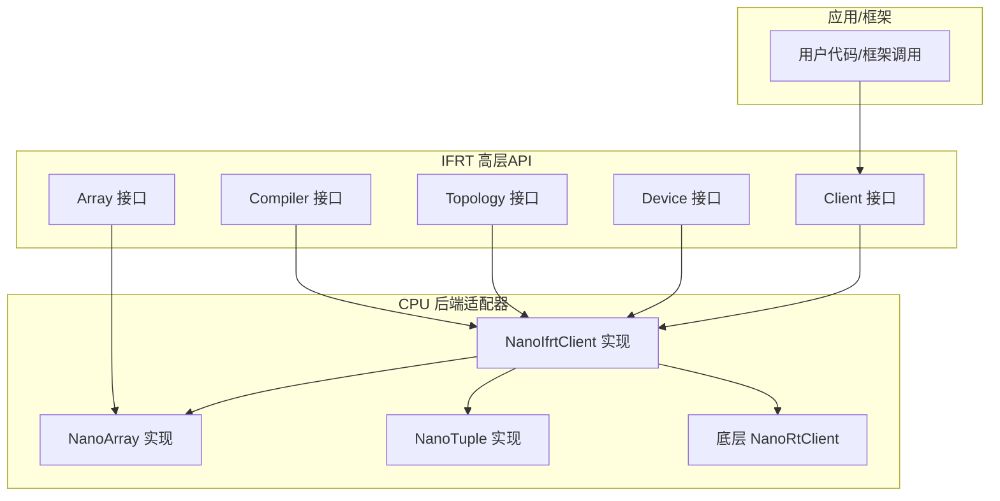
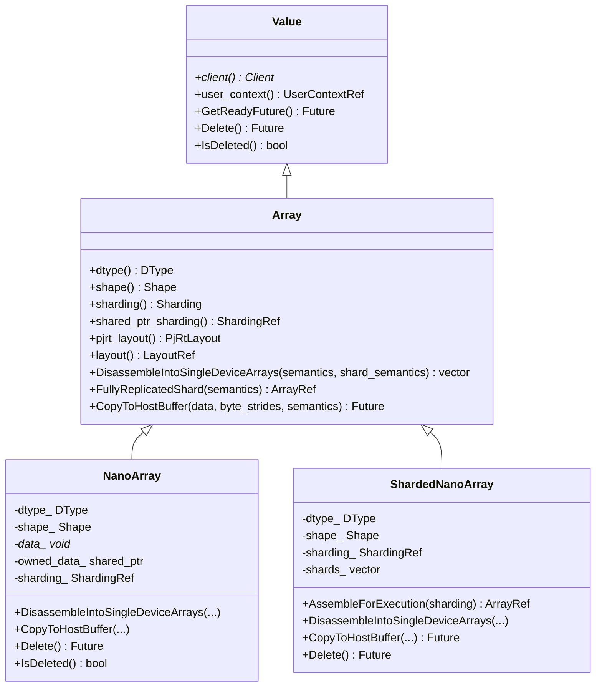
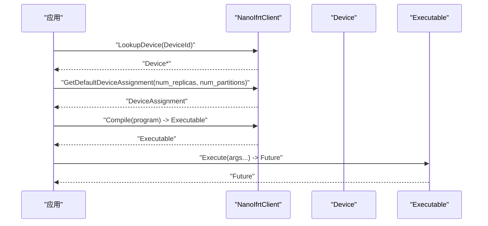
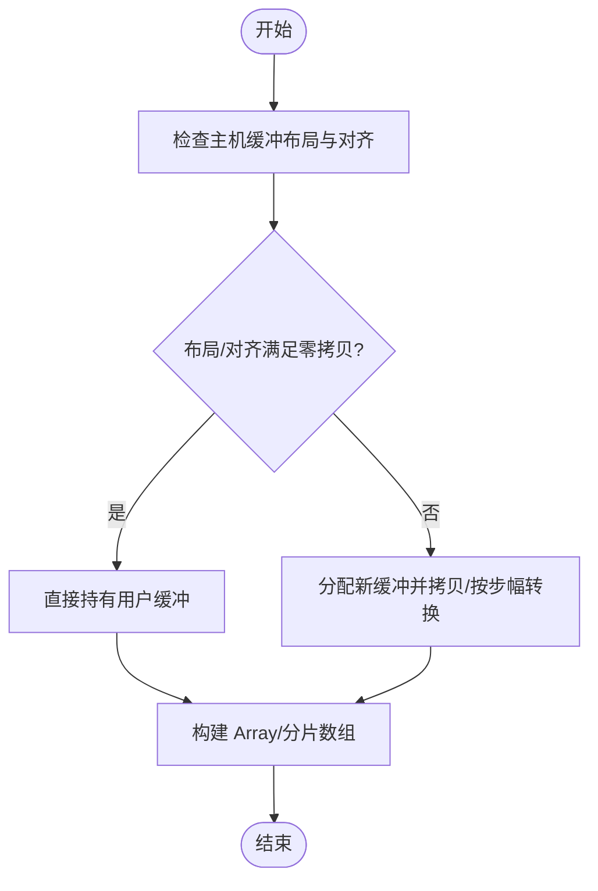

# IFRT接口

<cite>
**本文引用的文件**
- [README.md](file://xla/python/ifrt/README.md)
- [array.h](file://xla/python/ifrt/array.h)
- [array.cc](file://xla/python/ifrt/array.cc)
- [ifrt_client.h](file://xla/backends/cpu/nanort/ifrt_client.h)
- [ifrt_client.cc](file://xla/backends/cpu/nanort/ifrt_client.cc)
</cite>

## 目录
1. [简介](#简介)
2. [项目结构](#项目结构)
3. [核心组件](#核心组件)
4. [架构总览](#架构总览)
5. [详细组件分析](#详细组件分析)
6. [依赖关系分析](#依赖关系分析)
7. [性能考量](#性能考量)
8. [故障排查指南](#故障排查指南)
9. [结论](#结论)
10. [附录：使用示例与最佳实践](#附录使用示例与最佳实践)

## 简介
本文件面向XLA IFRT（Inter-Frame Runtime）接口的使用者与维护者，系统化阐述IFRT的高级抽象层与运行时行为，重点覆盖以下方面：
- 高级抽象层：Array、Client、Device等核心概念及其职责边界
- 异构设备支持与多设备并行执行：通过分片（Sharding）与拓扑（Topology）协同实现
- 分布式计算能力：基于设备列表与默认设备分配策略
- 跨设备数据传输与计算：从主机到设备、设备间复制、重映射与位视图（bitcast）
- 与传统PJRT接口的差异与优势：更高层的声明式语义、更好的可移植性与迁移友好性
- 设备拓扑管理、内存分配策略与执行计划优化建议

IFRT旨在作为用户框架（如JAX、PyTorch、TensorFlow）与底层运行时之间的可移植抽象层，使框架在不同硬件配置与部署场景下保持一致的编程模型。

章节来源
- file://xla/python/ifrt/README.md#L1-L37

## 项目结构
围绕IFRT的源码主要分布在如下位置：
- Python IFRT高层API与类型定义：xla/python/ifrt/
- CPU后端的NanoRT适配器（NanoIfrtClient）：xla/backends/cpu/nanort/ifrt_client.{h,cc}

下图给出与本文相关的文件与模块关系概览：

图表来源
- [array.h](file://xla/python/ifrt/array.h#L65-L134)
- [array.cc](file://xla/python/ifrt/array.cc#L28-L35)
- [ifrt_client.h](file://xla/backends/cpu/nanort/ifrt_client.h#L83-L247)
- [ifrt_client.cc](file://xla/backends/cpu/nanort/ifrt_client.cc#L159-L570)

章节来源
- file://xla/python/ifrt/README.md#L1-L37
- file://xla/python/ifrt/array.h#L1-L144
- file://xla/python/ifrt/array.cc#L1-L39
- file://xla/backends/cpu/nanort/ifrt_client.h#L1-L252
- file://xla/backends/cpu/nanort/ifrt_client.cc#L1-L800

## 核心组件
本节对IFRT的关键抽象进行深入解析，帮助读者建立统一的概念模型。

- Array（数组）
  - 表达一个逻辑数组，可能由多个分片缓冲区组成
  - 提供形状、数据类型、分片策略、布局等信息
  - 支持拆分为单设备数组、获取全复制分片、拷贝到主机缓冲区等操作
  - 参考路径：[array.h](file://xla/python/ifrt/array.h#L65-L134)

- Client（客户端）
  - 提供创建数组、组装分片、复制/重映射数组、默认编译器、拓扑查询、设备枚举等能力
  - 在CPU后端中，NanoIfrtClient是IFRT Client的具体实现，负责桥接底层NanoRtClient
  - 参考路径：[ifrt_client.h](file://xla/backends/cpu/nanort/ifrt_client.h#L83-L247)

- Device（设备）
  - 表示可寻址的计算设备，支持属性订阅、设备列表构造等
  - Client提供设备枚举与查找接口
  - 参考路径：[ifrt_client.h](file://xla/backends/cpu/nanort/ifrt_client.h#L191-L200)

- 拓扑（Topology）
  - 用于描述设备集合的物理或逻辑拓扑关系，便于调度与通信规划
  - 参考路径：[ifrt_client.h](file://xla/backends/cpu/nanort/ifrt_client.h#L203-L204)

- 编译器（Compiler）与可执行（Executable）
  - Client提供默认编译器；可执行对象承载编译后的程序并在设备上执行
  - 参考路径：[ifrt_client.h](file://xla/backends/cpu/nanort/ifrt_client.h#L201-L201)

- 布局与分片（Layout/Sharding）
  - Array提供PJRT布局与自定义布局；Sharding决定数据如何分布到设备
  - 参考路径：[array.h](file://xla/python/ifrt/array.h#L75-L85)

章节来源
- file://xla/python/ifrt/array.h#L65-L134
- file://xla/backends/cpu/nanort/ifrt_client.h#L83-L247

## 架构总览
下图展示了IFRT高层抽象与CPU后端适配器之间的交互关系，以及典型的数据流与控制流。

图表来源
- [ifrt_client.h](file://xla/backends/cpu/nanort/ifrt_client.h#L83-L247)
- [ifrt_client.cc](file://xla/backends/cpu/nanort/ifrt_client.cc#L159-L570)
- [array.h](file://xla/python/ifrt/array.h#L65-L134)

## 详细组件分析

### Array 类与生命周期
- 关键职责
  - 描述逻辑数组的形状、类型、分片与布局
  - 提供拆分（Disassemble）、全复制分片（FullyReplicatedShard）、拷贝到主机缓冲（CopyToHostBuffer）等操作
  - 支持不同的拷贝语义（总是复制、复用输入、捐赠输入），以平衡性能与资源占用
- 数据结构与复杂度
  - 形状与分片信息决定了拆分/组装的复杂度，通常与元素数量成正比
  - 拷贝到主机缓冲的时间复杂度与元素数量线性相关
- 错误处理
  - 不支持未知尺寸的标量类型
  - 对于不满足布局要求的分片，可能返回未实现或失败状态
- 性能要点
  - 尽量使用默认布局与连续内存，避免额外的字节步幅转换
  - 充分利用“复用输入/捐赠输入”语义减少不必要的内存拷贝

图表来源
- [array.h](file://xla/python/ifrt/array.h#L65-L134)
- [ifrt_client.cc](file://xla/backends/cpu/nanort/ifrt_client.cc#L159-L570)

章节来源
- file://xla/python/ifrt/array.h#L65-L134
- file://xla/backends/cpu/nanort/ifrt_client.cc#L159-L570

### Client 与设备管理
- 职责边界
  - 创建/组装数组、复制/重映射数组、默认编译器、拓扑查询、设备枚举与查找
  - 在CPU后端中，NanoIfrtClient封装底层NanoRtClient，并实现IFRT Client接口
- 设备拓扑
  - 支持根据设备集合生成拓扑，便于后续调度与通信规划
- 默认设备分配
  - 提供按副本数与分区数生成默认设备分配的能力，便于分布式执行

图表来源
- [ifrt_client.h](file://xla/backends/cpu/nanort/ifrt_client.h#L191-L200)
- [ifrt_client.h](file://xla/backends/cpu/nanort/ifrt_client.h#L201-L201)

章节来源
- file://xla/backends/cpu/nanort/ifrt_client.h#L191-L200
- file://xla/backends/cpu/nanort/ifrt_client.h#L201-L201

### 数据传输与跨设备操作
- 主机到设备
  - 通过MakeArrayFromHostBuffer创建数组，支持零拷贝条件（行主序、稠密布局、满足对齐要求）
  - 参考路径：[ifrt_client.h](file://xla/backends/cpu/nanort/ifrt_client.h#L116-L121)
- 设备间复制与重映射
  - CopyArrays支持在设备间复制数组，可指定目标设备与内存类型
  - RemapArrays支持按RemapPlan进行重映射（当前注释为未实现）
  - 参考路径：[ifrt_client.h](file://xla/backends/cpu/nanort/ifrt_client.h#L145-L153)
- 位视图（bitcast）
  - BitcastArrays允许在不改变底层数据的前提下改变解释方式
  - 参考路径：[ifrt_client.h](file://xla/backends/cpu/nanort/ifrt_client.h#L155-L158)
- 拆分与组装
  - DisassembleIntoSingleDeviceArrays将分片数组拆分为单设备数组
  - AssembleArrayFromSingleDeviceArrays从单设备数组组装回分片数组
  - 参考路径：[ifrt_client.h](file://xla/backends/cpu/nanort/ifrt_client.h#L133-L143)

图表来源
- [ifrt_client.cc](file://xla/backends/cpu/nanort/ifrt_client.cc#L204-L256)

章节来源
- file://xla/backends/cpu/nanort/ifrt_client.h#L116-L158
- file://xla/backends/cpu/nanort/ifrt_client.cc#L204-L256

### 执行与未来（Future）机制
- 所有异步操作返回Future，便于框架侧进行流水线化与并发控制
- NanoIfrtClient中的值类型均立即就绪（Ready），简化了CPU后端的执行模型
- 参考路径：[ifrt_client.cc](file://xla/backends/cpu/nanort/ifrt_client.cc#L113-L117)

章节来源
- file://xla/backends/cpu/nanort/ifrt_client.cc#L113-L117

## 依赖关系分析
- IFRT高层API（array.h）定义了Array/Value等抽象，被后端实现（如NanoIfrtClient）所继承与实现
- NanoIfrtClient在头文件中声明了完整的Client接口，在实现文件中提供了Array/NanoTuple等具体类
- 客户端与底层NanoRtClient之间存在封装关系，便于在不改变上层API的情况下替换后端

图表来源
- [array.h](file://xla/python/ifrt/array.h#L65-L134)
- [ifrt_client.h](file://xla/backends/cpu/nanort/ifrt_client.h#L83-L247)
- [ifrt_client.cc](file://xla/backends/cpu/nanort/ifrt_client.cc#L159-L570)

章节来源
- file://xla/python/ifrt/array.h#L65-L134
- file://xla/backends/cpu/nanort/ifrt_client.h#L83-L247
- file://xla/backends/cpu/nanort/ifrt_client.cc#L159-L570

## 性能考量
- 内存对齐与布局
  - 使用行主序、稠密布局与满足对齐要求的缓冲可实现零拷贝创建
  - 若布局不兼容，需进行步幅转换，带来额外开销
  - 参考路径：[ifrt_client.cc](file://xla/backends/cpu/nanort/ifrt_client.cc#L209-L256)
- 拷贝语义选择
  - kAlwaysCopy保证安全但增加内存压力
  - kReuseInput/kDonateInput在性能与资源回收之间取得平衡
  - 参考路径：[array.h](file://xla/python/ifrt/array.h#L44-L59)
- 分片策略
  - 充分利用单设备分片（SingleDeviceSharding）可获得更优的执行性能
  - 全复制数组在某些场景下可避免拆分/组装成本
  - 参考路径：[ifrt_client.cc](file://xla/backends/cpu/nanort/ifrt_client.cc#L333-L383)
- 执行模型
  - NanoIfrtClient中的值类型均为立即就绪，适合轻量级执行与低延迟场景
  - 参考路径：[ifrt_client.cc](file://xla/backends/cpu/nanort/ifrt_client.cc#L136-L137)

## 故障排查指南
- 主机缓冲布局不兼容
  - 现象：创建数组失败或拷贝到主机缓冲时报未实现
  - 处理：确保布局为行主序且稠密，或提供正确的字节步幅
  - 参考路径：[ifrt_client.cc](file://xla/backends/cpu/nanort/ifrt_client.cc#L209-L256)
- 分片组装失败
  - 现象：AssembleArrayFromSingleDeviceArrays返回错误
  - 处理：确认分片数量与索引域形状与期望一致；全复制分片可直接返回
  - 参考路径：[ifrt_client.cc](file://xla/backends/cpu/nanort/ifrt_client.cc#L692-L748)
- 访问已删除对象
  - 现象：访问已删除的值返回先决条件失败
  - 处理：避免在Delete之后继续使用对象
  - 参考路径：[ifrt_client.cc](file://xla/backends/cpu/nanort/ifrt_client.cc#L146-L151)
- 重映射功能未实现
  - 现象：RemapArrays返回未实现错误
  - 处理：在当前实现中暂不支持，可改用其他重排策略
  - 参考路径：[ifrt_client.h](file://xla/backends/cpu/nanort/ifrt_client.h#L151-L153)

章节来源
- file://xla/backends/cpu/nanort/ifrt_client.cc#L146-L151
- file://xla/backends/cpu/nanort/ifrt_client.cc#L209-L256
- file://xla/backends/cpu/nanort/ifrt_client.cc#L692-L748
- file://xla/backends/cpu/nanort/ifrt_client.h#L151-L153

## 结论
IFRT通过高阶抽象与清晰的职责划分，为多硬件、多设备与分布式场景提供了统一的编程模型。结合CPU后端的NanoIfrtClient实现，用户可在保持高性能的同时，享受更高的可移植性与更平滑的迁移路径。建议在实际工程中优先采用单设备分片、行主序稠密布局与合适的拷贝语义，以获得最佳性能与稳定性。

## 附录：使用示例与最佳实践
以下示例以“路径+步骤”的形式给出，帮助快速上手IFRT的常见用法。请根据自身框架与后端选择合适的实现。

- 创建主机数组并零拷贝传递到设备
  - 步骤
    - 准备行主序、稠密布局的主机缓冲
    - 调用创建数组接口，传入数据指针、数据类型、形状、分片与布局
    - 参考路径：[ifrt_client.h](file://xla/backends/cpu/nanort/ifrt_client.h#L116-L121)
- 拆分分片数组为单设备数组
  - 步骤
    - 调用拆分接口，选择拷贝语义
    - 获取每个设备上的分片数组
    - 参考路径：[ifrt_client.h](file://xla/backends/cpu/nanort/ifrt_client.h#L133-L143)
- 将单设备数组组装回分片数组
  - 步骤
    - 提供分片数组与分片策略
    - 调用组装接口，必要时进行稀疏/全复制处理
    - 参考路径：[ifrt_client.h](file://xla/backends/cpu/nanort/ifrt_client.h#L133-L143)
- 在设备间复制数组
  - 步骤
    - 指定目标设备与内存类型
    - 调用复制接口，等待Future完成
    - 参考路径：[ifrt_client.h](file://xla/backends/cpu/nanort/ifrt_client.h#L145-L149)
- 重映射数组（当前未实现）
  - 步骤
    - 当前实现返回未实现错误，建议改用其他重排策略
    - 参考路径：[ifrt_client.h](file://xla/backends/cpu/nanort/ifrt_client.h#L151-L153)
- 位视图（bitcast）
  - 步骤
    - 指定位视图的目标规格，调用位视图接口
    - 参考路径：[ifrt_client.h](file://xla/backends/cpu/nanort/ifrt_client.h#L155-L158)
- 查询默认布局与拓扑
  - 步骤
    - 获取默认PJRT布局与自定义布局
    - 查询设备拓扑，用于分布式调度
    - 参考路径：[ifrt_client.h](file://xla/backends/cpu/nanort/ifrt_client.h#L206-L208)
- 设备枚举与默认设备分配
  - 步骤
    - 枚举设备与可寻址设备
    - 生成默认设备分配（副本数与分区数）
    - 参考路径：[ifrt_client.h](file://xla/backends/cpu/nanort/ifrt_client.h#L183-L200)

章节来源
- file://xla/backends/cpu/nanort/ifrt_client.h#L116-L158
- file://xla/backends/cpu/nanort/ifrt_client.h#L183-L208