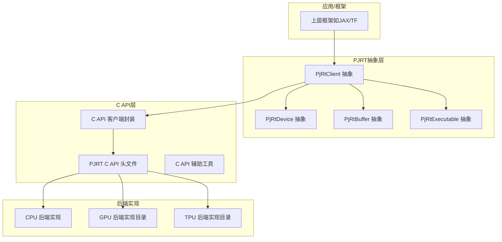
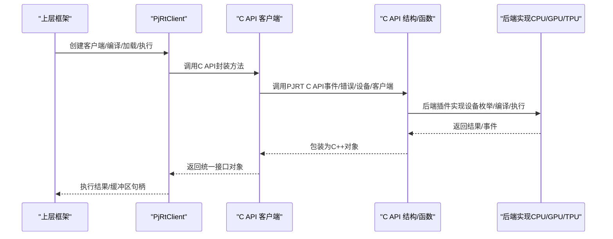
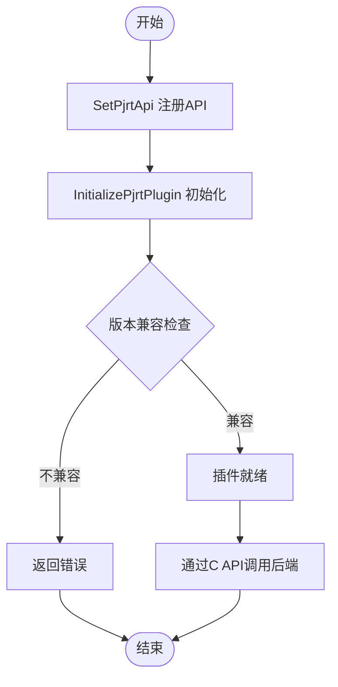
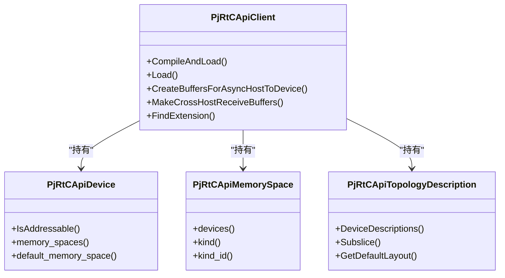
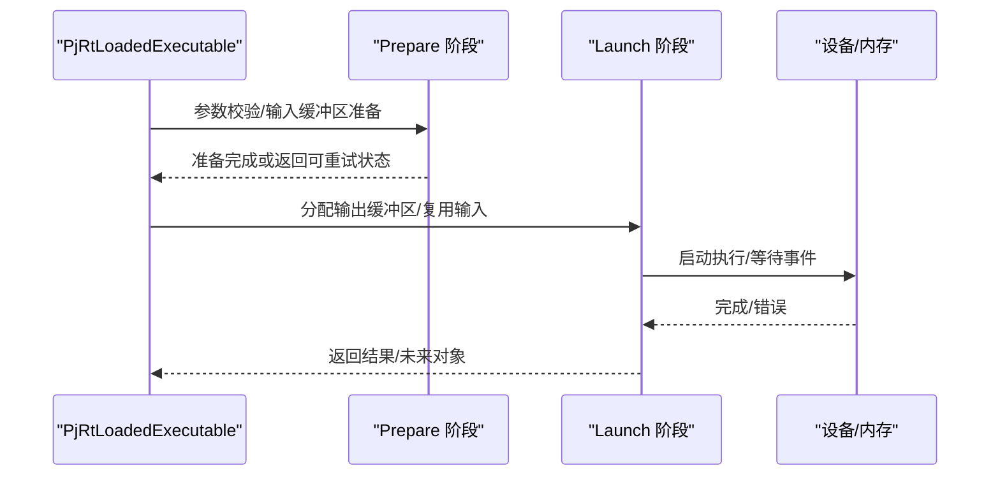
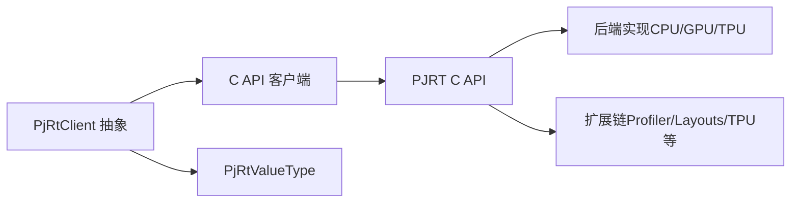

# PJRT集成

<cite>
**本文引用的文件**
- [xla\pjrt\pjrt_api.h](file://xla/pjrt/pjrt_api.h)
- [xla\pjrt\pjrt_api.cc](file://xla/pjrt/pjrt_api.cc)
- [xla\pjrt\c\pjrt_c_api.h](file://xla/pjrt/c/pjrt_c_api.h)
- [xla\pjrt\c\pjrt_c_api_helpers.h](file://xla/pjrt/c/pjrt_c_api_helpers.h)
- [xla\pjrt\c_api_client\pjrt_c_api_client.h](file://xla/pjrt/c_api_client/pjrt_c_api_client.h)
- [xla\pjrt\pjrt_client.h](file://xla/pjrt/pjrt_client.h)
- [xla\pjrt\common_pjrt_client.h](file://xla/pjrt/common_pjrt_client.h)
- [xla\pjrt\cpu\cpu_client.h](file://xla/pjrt/cpu/cpu_client.h)
- [xla\pjrt\pjrt_executable.h](file://xla/pjrt/pjrt_executable.h)
- [xla\pjrt\pjrt_common.h](file://xla/pjrt/pjrt_common.h)
- [docs\pjrt\index.md](file://docs/pjrt/index.md)
</cite>

## 目录
1. [简介](#简介)
2. [项目结构](#项目结构)
3. [核心组件](#核心组件)
4. [架构总览](#架构总览)
5. [详细组件分析](#详细组件分析)
6. [依赖关系分析](#依赖关系分析)
7. [性能考虑](#性能考虑)
8. [故障排查指南](#故障排查指南)
9. [结论](#结论)
10. [附录](#附录)

## 简介
本文件面向XLA PJRT（Python Extension for XLA Runtime）集成，系统化阐述PJRT与XLA的集成架构，涵盖C API包装、扩展加载与生命周期管理；对比不同后端（CPU/GPU/TPU）的实现差异与配置要点；给出通过PJRT进行高性能计算执行的实践路径；说明与Google Cloud TPU、NVIDIA GPU等硬件平台的对接方式；并总结性能监控、资源管理与故障诊断的最佳实践。

## 项目结构
- PJRT核心接口与抽象定义位于顶层头文件中，统一了设备、内存空间、可执行对象与编译选项等概念。
- C API层提供跨语言/跨实现的统一调用面，配合辅助工具完成类型转换、错误处理与扩展链遍历。
- C API客户端封装C API为C++对象模型，桥接上层框架与底层插件。
- 后端实现以“通用基类 + 具体后端”的方式组织：CPU后端提供完整实现；GPU/TPU后端在仓库中以目录形式存在，具体实现文件需按实际构建启用。

图表来源
- [xla\pjrt\c\pjrt_c_api.h](file://xla/pjrt/c/pjrt_c_api.h#L1-L120)
- [xla\pjrt\c_api_client\pjrt_c_api_client.h](file://xla/pjrt/c_api_client/pjrt_c_api_client.h#L352-L576)
- [xla\pjrt\cpu\cpu_client.h](file://xla/pjrt/cpu/cpu_client.h#L85-L120)

章节来源
- [xla\pjrt\c\pjrt_c_api.h](file://xla/pjrt/c/pjrt_c_api.h#L1-L120)
- [xla\pjrt\c_api_client\pjrt_c_api_client.h](file://xla/pjrt/c_api_client/pjrt_c_api_client.h#L352-L576)
- [xla\pjrt\cpu\cpu_client.h](file://xla/pjrt/cpu/cpu_client.h#L85-L120)

## 核心组件
- PJRT抽象层
  - PjRtClient：会话级入口，负责设备枚举、编译/加载、执行、缓冲区管理与拓扑描述。
  - PjRtDevice/PjRtMemorySpace：设备与内存空间抽象，支持多内存域与跨主机传输。
  - PjRtExecutable/PjRtLoadedExecutable：编译产物与已加载可执行对象，支持序列化、元数据查询与成本分析。
- C API层
  - PJRT C API：统一的ABI稳定接口，定义事件、错误、设备、客户端、可执行对象等结构与回调。
  - C API辅助工具：类型转换、错误码映射、扩展链查找、回调包装等。
  - C API客户端：将C API对象映射到C++对象模型，提供统一的编译/执行/传输接口。
- 生命周期与插件机制
  - 插件注册与初始化：通过SetPjrtApi与InitializePjrtPlugin完成插件绑定与版本兼容性检查。
  - 扩展加载：LoadPjrtPlugin基于动态库符号加载GetPjrtApi并注册。

章节来源
- [xla\pjrt\pjrt_client.h](file://xla/pjrt/pjrt_client.h#L509-L684)
- [xla\pjrt\c\pjrt_c_api.h](file://xla/pjrt/c/pjrt_c_api.h#L118-L125)
- [xla\pjrt\c_api_client\pjrt_c_api_client.h](file://xla/pjrt/c_api_client/pjrt_c_api_client.h#L352-L576)
- [xla\pjrt\pjrt_api.h](file://xla/pjrt/pjrt_api.h#L29-L48)
- [xla\pjrt\pjrt_api.cc](file://xla/pjrt/pjrt_api.cc#L59-L124)

## 架构总览
下图展示了从上层框架到后端插件的调用链路与职责划分：

图表来源
- [xla\pjrt\c_api_client\pjrt_c_api_client.h](file://xla/pjrt/c_api_client/pjrt_c_api_client.h#L352-L576)
- [xla\pjrt\c\pjrt_c_api.h](file://xla/pjrt/c/pjrt_c_api.h#L507-L508)
- [xla\pjrt\cpu\cpu_client.h](file://xla/pjrt/cpu/cpu_client.h#L145-L157)

## 详细组件分析

### C API与插件加载机制
- 插件注册与初始化
  - SetPjrtApi：将设备类型映射到PJRT_Api指针。
  - InitializePjrtPlugin：校验主次版本兼容性并调用后端初始化。
  - LoadPjrtPlugin：动态加载库并解析GetPjrtApi符号，随后注册。
- 版本兼容策略
  - 框架侧维护最小兼容次版本号，可通过环境变量控制严格/宽松兼容模式。
- 错误与事件
  - 统一的PJRT_Error结构与错误码，配套事件模型用于异步完成通知。

图表来源
- [xla\pjrt\pjrt_api.cc](file://xla/pjrt/pjrt_api.cc#L152-L206)
- [xla\pjrt\pjrt_api.h](file://xla/pjrt/pjrt_api.h#L40-L48)

章节来源
- [xla\pjrt\pjrt_api.h](file://xla/pjrt/pjrt_api.h#L29-L48)
- [xla\pjrt\pjrt_api.cc](file://xla/pjrt/pjrt_api.cc#L59-L124)
- [xla\pjrt\c\pjrt_c_api.h](file://xla/pjrt/c/pjrt_c_api.h#L118-L125)

### C API客户端封装
- 设备/内存空间/拓扑描述
  - 将C API的设备描述、内存描述与拓扑描述映射为C++对象，提供默认布局、属性访问与子切片能力。
- 编译/加载/执行
  - 提供Compile/CompileAndLoad/Load/LoadSerializedExecutable等统一接口，支持程序序列化格式（HLO/MLIR）。
- 回调与扩展
  - 支持注册回调、查找扩展类型（如Profiler、Layouts、TPU Topology等），并进行参数校验与转换。

图表来源
- [xla\pjrt\c_api_client\pjrt_c_api_client.h](file://xla/pjrt/c_api_client/pjrt_c_api_client.h#L352-L576)
- [xla\pjrt\c_api_client\pjrt_c_api_client.h](file://xla/pjrt/c_api_client/pjrt_c_api_client.h#L77-L117)
- [xla\pjrt\c_api_client\pjrt_c_api_client.h](file://xla/pjrt/c_api_client/pjrt_c_api_client.h#L237-L337)

章节来源
- [xla\pjrt\c_api_client\pjrt_c_api_client.h](file://xla/pjrt/c_api_client/pjrt_c_api_client.h#L352-L576)
- [xla\pjrt\c_api_client\pjrt_c_api_client.h](file://xla/pjrt/c_api_client/pjrt_c_api_client.h#L77-L117)

### 通用客户端与执行流程
- 通用客户端
  - CommonPjRtClient提供通用的缓冲区分配、线性化、事件跟踪、设备事件集等能力，作为各后端的基类。
- 执行阶段
  - Prepare/Launch两阶段执行：Prepare可重试（如OOM），Launch保证成功；支持多设备/多副本/多分区调度。
- 输出与别名
  - 支持输出缓冲区复用、参数捐赠、别名缓冲区创建与满足回调。

图表来源
- [xla\pjrt\common_pjrt_client.h](file://xla/pjrt/common_pjrt_client.h#L532-L576)
- [xla\pjrt\pjrt_executable.h](file://xla/pjrt/pjrt_executable.h#L421-L440)

章节来源
- [xla\pjrt\common_pjrt_client.h](file://xla/pjrt/common_pjrt_client.h#L532-L576)
- [xla\pjrt\pjrt_executable.h](file://xla/pjrt/pjrt_executable.h#L421-L440)

### CPU后端实现要点
- 设备与内存
  - 提供进程索引、设备计数、地址可寻设备列表、默认布局与拓扑描述。
- 编译/加载
  - 支持XlaComputation与MLIR模块编译，生成可加载的CPU可执行对象。
- 异步与收集通信
  - 提供收集通信事件的链接与同步，避免固定线程池导致的死锁。
- 零拷贝与转置优化
  - 支持零拷贝直传与转置计划缓存，提升主机到设备的数据搬运效率。

章节来源
- [xla\pjrt\cpu\cpu_client.h](file://xla/pjrt/cpu/cpu_client.h#L85-L120)
- [xla\pjrt\cpu\cpu_client.h](file://xla/pjrt/cpu/cpu_client.h#L145-L157)
- [xla\pjrt\cpu\cpu_client.h](file://xla/pjrt/cpu/cpu_client.h#L216-L225)

### GPU/TPU后端差异与配置
- 目录结构
  - GPU/TPU后端以独立目录存在，具体实现文件需在构建时启用。
- 差异点
  - 设备描述、内存布局、拓扑信息、编译器变体、设备特定属性与扩展（如TPU拓扑扩展）等。
- 配置要点
  - 平台版本字符串（CUDA/libtpu版本）、默认布局、设备分配策略、多切片/多主机拓扑等。

章节来源
- [xla\pjrt\cpu\cpu_client.h](file://xla/pjrt/cpu/cpu_client.h#L118-L124)
- [xla\pjrt\c_api_client\pjrt_c_api_client.h](file://xla/pjrt/c_api_client/pjrt_c_api_client.h#L237-L337)

### 与Google Cloud TPU/NVIDIA GPU的集成
- Google Cloud TPU
  - 通过C API客户端封装拓扑描述与设备属性，使用TPU拓扑扩展进行设备坐标、芯片/核心索引映射与默认布局推导。
- NVIDIA GPU
  - 通过GPU后端实现（目录存在）提供设备枚举、内存空间、默认布局与编译器目标配置；结合CUDA运行时与驱动栈完成执行。

章节来源
- [xla\pjrt\c_api_client\pjrt_c_api_client.h](file://xla/pjrt/c_api_client/pjrt_c_api_client.h#L237-L337)
- [xla\pjrt\cpu\cpu_client.h](file://xla/pjrt/cpu/cpu_client.h#L118-L124)

### 性能监控、资源管理与执行选项
- 执行选项
  - 支持严格形状检查、非捐赠输入索引集合、执行流ID、调用位置溯源、发送/接收回调与数据布局（主要/次要顺序）。
- 成本分析与内存统计
  - 可对可执行对象进行HLO成本分析与编译期内存统计，辅助容量规划与热点定位。
- 资源管理
  - 通过内存空间描述、默认布局与设备事件集，实现缓冲区生命周期与依赖管理。

章节来源
- [xla\pjrt\pjrt_executable.h](file://xla/pjrt/pjrt_executable.h#L224-L319)
- [xla\pjrt\c_api_client\pjrt_c_api_client.h](file://xla/pjrt/c_api_client/pjrt_c_api_client.h#L699-L761)

## 依赖关系分析
- 抽象到实现
  - PjRtClient抽象依赖C API客户端，后者再依赖C API与后端实现。
- 类型与值
  - PjRtValueType统一了Python到C++的多态值类型，便于插件属性传递与选项覆盖。
- 扩展链
  - 通过PJRT_Extension_Base链表式扩展，C API客户端可按类型查找扩展并进行功能增强。

图表来源
- [xla\pjrt\c_api_client\pjrt_c_api_client.h](file://xla/pjrt/c_api_client/pjrt_c_api_client.h#L505-L521)
- [xla\pjrt\c\pjrt_c_api.h](file://xla/pjrt/c/pjrt_c_api.h#L81-L89)
- [xla\pjrt\pjrt_common.h](file://xla/pjrt/pjrt_common.h#L35-L41)

章节来源
- [xla\pjrt\c_api_client\pjrt_c_api_client.h](file://xla/pjrt/c_api_client/pjrt_c_api_client.h#L505-L521)
- [xla\pjrt\c\pjrt_c_api.h](file://xla/pjrt/c/pjrt_c_api.h#L81-L89)
- [xla\pjrt\pjrt_common.h](file://xla/pjrt/pjrt_common.h#L35-L41)

## 性能考虑
- 两阶段执行与OOM重试
  - Prepare/Launch分离允许在Prepare阶段失败时重试（如调整内存分配策略），减少Launch失败概率。
- 数据布局与零拷贝
  - 使用主要/次要布局与零拷贝直传，降低主机到设备的复制开销。
- 线程池与事件
  - 合理设置线程池大小与事件驱动，避免固定线程池导致的收集通信死锁。
- 成本分析与内存统计
  - 利用成本分析与编译期内存统计指导参数规模与布局选择。

## 故障排查指南
- 插件初始化失败
  - 检查设备类型是否正确、插件是否已SetPjrtApi、版本兼容性是否满足最小次版本要求。
- C API错误与事件
  - 使用PjrtErrorToStatus获取人类可读错误消息；通过事件模型等待完成并检查错误状态。
- 回调与扩展
  - 确认扩展类型查找成功、回调参数校验通过、用户态状态管理正确。
- 跨主机传输
  - 确保接收端先创建接收缓冲区，发送端在收到描述符后发起远程拷贝；取消时需确保一致性。

章节来源
- [xla\pjrt\c_api_client\pjrt_c_api_client.h](file://xla/pjrt/c_api_client/pjrt_c_api_client.h#L533-L539)
- [xla\pjrt\c\pjrt_c_api_helpers.h](file://xla/pjrt/c/pjrt_c_api_helpers.h#L134-L145)
- [xla\pjrt\c\pjrt_c_api.h](file://xla/pjrt/c/pjrt_c_api.h#L126-L138)

## 结论
PJRT通过C API提供了统一的设备抽象与插件化后端实现，结合C++客户端封装，实现了从上层框架到底层硬件的清晰分层。CPU后端提供完整实现参考，GPU/TPU后端以目录形式存在，需按平台启用。通过版本兼容检查、扩展链与事件模型，PJRT在可移植性与性能之间取得平衡，适合在多硬件平台上进行高性能计算执行。

## 附录
- 更多资源与设计文档参见PJRT文档索引。

章节来源
- [docs\pjrt\index.md](file://docs/pjrt/index.md#L1-L32)