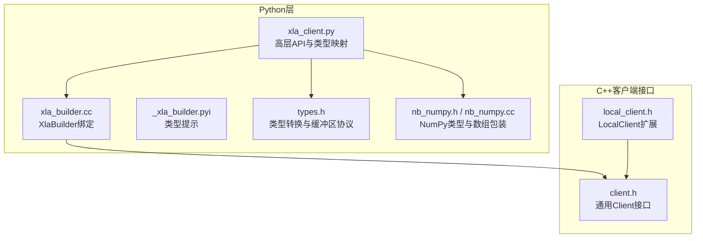
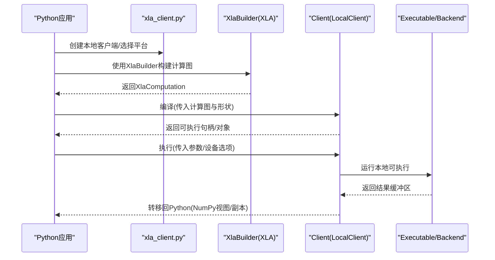
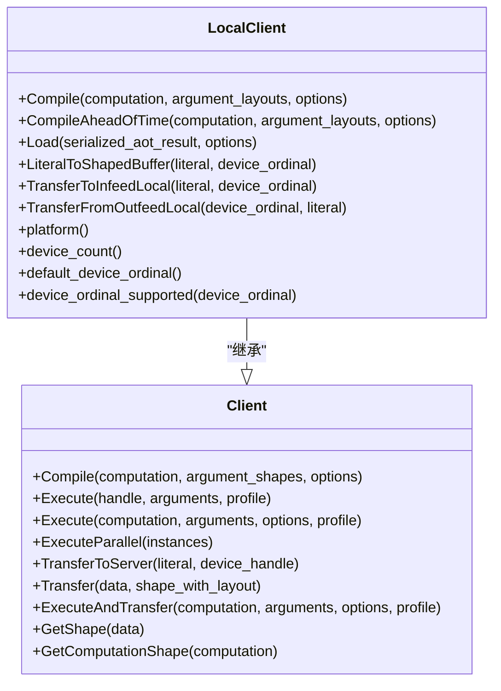
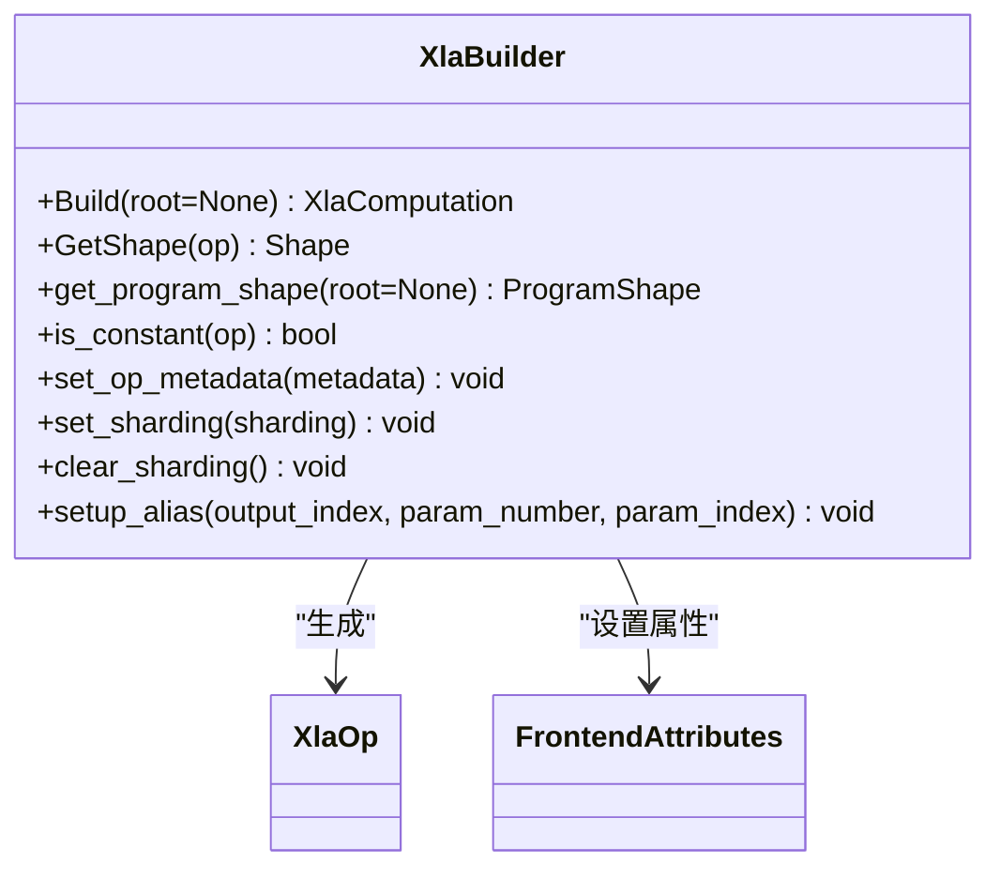
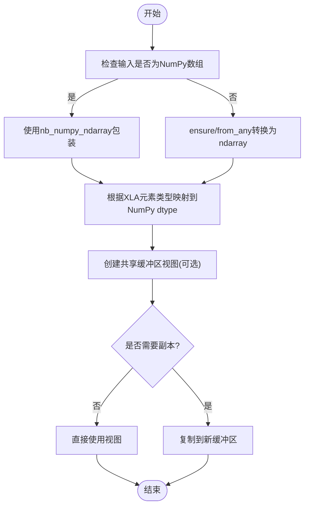
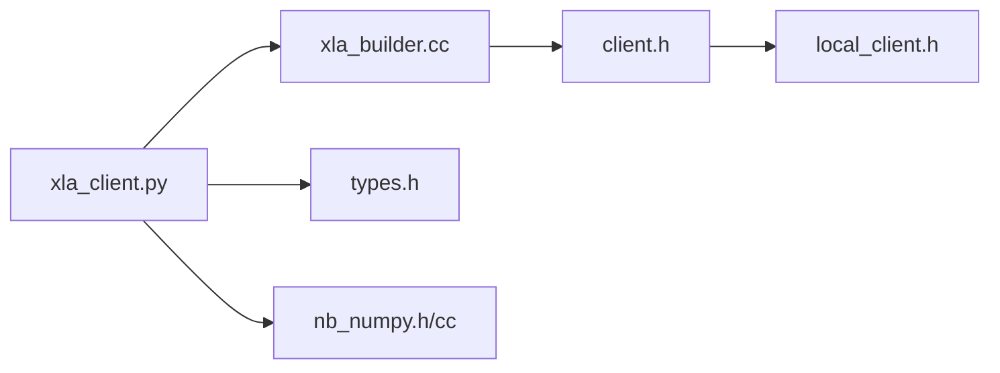
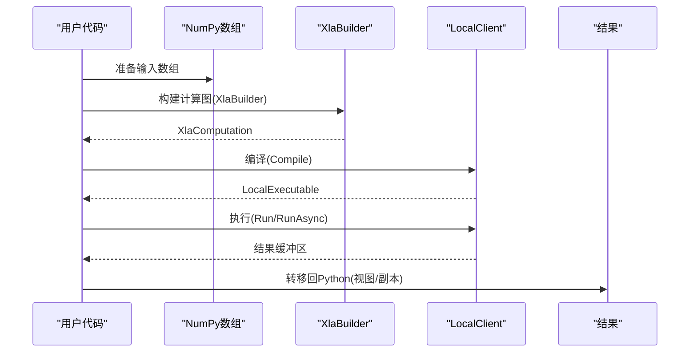

# Python客户端API

<cite>
**本文引用的文件**
- [xla_client.py](file://xla/python/xla_client.py)
- [_xla_builder.pyi](file://xla/python/_xla_builder.pyi)
- [xla_builder.cc](file://xla/python/xla_builder.cc)
- [client.h](file://xla/client/client.h)
- [local_client.h](file://xla/client/local_client.h)
- [types.h](file://xla/python/types.h)
- [nb_numpy.h](file://xla/python/nb_numpy.h)
- [nb_numpy.cc](file://xla/python/nb_numpy.cc)
- [xla_compiler_test.py](file://xla/python/xla_compiler_test.py)
- [examples.md](file://docs/pjrt/examples.md)
</cite>

## 目录
1. [简介](#简介)
2. [项目结构](#项目结构)
3. [核心组件](#核心组件)
4. [架构总览](#架构总览)
5. [组件详解](#组件详解)
6. [依赖关系分析](#依赖关系分析)
7. [性能考量](#性能考量)
8. [故障排查指南](#故障排查指南)
9. [结论](#结论)
10. [附录：端到端工作流示例](#附录端到端工作流示例)

## 简介
本文件面向使用XLA Python客户端API的开发者，系统性阐述以下主题：
- 本地客户端创建、计算编译、执行控制与结果获取的完整流程
- XLA Builder API的使用模式与HLO计算图构建要点
- Python与XLA之间的数据类型映射、NumPy数组交互与内存管理策略
- 错误处理、性能优化与调试技巧

目标是帮助读者在不深入C++实现细节的前提下，掌握从Python到XLA编译器的端到端工作流程，并能高效定位问题与优化性能。

## 项目结构
围绕Python客户端API的关键目录与文件如下：
- Python绑定与高层封装：xla/python 下的 xla_client.py、_xla_builder.pyi、xla_builder.cc、types.h、nb_numpy.h、nb_numpy.cc
- 客户端接口定义：xla/client 下的 client.h、local_client.h
- 示例与参考：xla/python/xla_compiler_test.py、docs/pjrt/examples.md

**图表来源**
- [xla_client.py](file://xla/python/xla_client.py#L1-L450)
- [xla_builder.cc](file://xla/python/xla_builder.cc#L105-L160)
- [_xla_builder.pyi](file://xla/python/_xla_builder.pyi#L31-L49)
- [client.h](file://xla/client/client.h#L42-L222)
- [local_client.h](file://xla/client/local_client.h#L142-L254)
- [types.h](file://xla/python/types.h#L40-L101)
- [nb_numpy.h](file://xla/python/nb_numpy.h#L43-L104)
- [nb_numpy.cc](file://xla/python/nb_numpy.cc#L40-L108)

**章节来源**
- [xla_client.py](file://xla/python/xla_client.py#L1-L450)
- [client.h](file://xla/client/client.h#L42-L222)
- [local_client.h](file://xla/client/local_client.h#L142-L254)

## 核心组件
- 本地客户端与执行管线
  - Client：统一的编译、执行、传输与查询接口，支持编译缓存、并行执行、设备句柄管理等
  - LocalClient：在同进程场景下提供本地编译（Compile）、异步运行（RunAsync）、设备内存分配与数据搬运等能力
- XLA Builder与计算图
  - XlaBuilder：以Python类形式暴露XLA计算图构建能力，支持设置元数据、分片、别名等
  - XlaOp：计算图中的节点抽象
- 类型与NumPy互操作
  - dtype映射：XLA元素类型与NumPy/ML dtypes之间的双向映射
  - 缓冲区协议：通过PEP 3118格式描述符与类型提示，实现零拷贝视图与共享内存
  - NumPy数组包装：nb_dtype、nb_numpy_ndarray对NumPy数组的轻量封装与校验

**章节来源**
- [client.h](file://xla/client/client.h#L42-L222)
- [local_client.h](file://xla/client/local_client.h#L142-L254)
- [xla_client.py](file://xla/python/xla_client.py#L40-L76)
- [types.h](file://xla/python/types.h#L40-L101)
- [nb_numpy.h](file://xla/python/nb_numpy.h#L43-L104)
- [nb_numpy.cc](file://xla/python/nb_numpy.cc#L40-L108)

## 架构总览
下图展示了从Python调用到XLA编译器与执行后端的整体路径，以及与NumPy数组的交互点。

**图表来源**
- [xla_client.py](file://xla/python/xla_client.py#L1-L450)
- [xla_builder.cc](file://xla/python/xla_builder.cc#L105-L160)
- [client.h](file://xla/client/client.h#L67-L101)
- [local_client.h](file://xla/client/local_client.h#L156-L178)

## 组件详解

### 本地客户端与执行控制
- 编译阶段
  - Client::Compile：接收XlaComputation与参数形状，返回可执行句柄；适合长期复用
  - LocalClient::Compile：在本地服务上编译，返回LocalExecutable，支持AOT编译与加载
- 执行阶段
  - Client::Execute：执行已编译可执行或直接执行计算
  - LocalClient::Run/RunAsync：本地运行，支持异步与参数捐赠（donate arg buffers）
- 数据传输
  - TransferToServer/Transfer：在主机与设备间搬运数据
  - TransferToInfeed/TransferFromOutfeed：入/出队列接口
- 查询与诊断
  - GetShape/GetComputationShape：查询数据与程序形状
  - ExecuteAndTransfer：一次执行并取回结果

**图表来源**
- [client.h](file://xla/client/client.h#L67-L200)
- [local_client.h](file://xla/client/local_client.h#L156-L222)

**章节来源**
- [client.h](file://xla/client/client.h#L67-L200)
- [local_client.h](file://xla/client/local_client.h#L156-L222)

### XLA Builder API与HLO计算图
- XlaBuilder绑定
  - 支持构造函数、Build/Build(root)、GetShape、get_program_shape、is_constant
  - 元数据与分片：set_op_metadata、set_sharding、clear_sharding
  - 别名设置：setUpAlias用于输出与参数间的别名关系
- 类型提示
  - _xla_builder.pyi提供XlaBuilder、XlaOp、FrontendAttributes的类型签名

**图表来源**
- [xla_builder.cc](file://xla/python/xla_builder.cc#L115-L160)
- [_xla_builder.pyi](file://xla/python/_xla_builder.pyi#L31-L49)

**章节来源**
- [xla_builder.cc](file://xla/python/xla_builder.cc#L115-L160)
- [_xla_builder.pyi](file://xla/python/_xla_builder.pyi#L31-L49)

### Python与NumPy交互、数据类型与内存管理
- 数据类型映射
  - XLA元素类型到NumPy/ML dtypes的双向映射表，覆盖布尔、整数、浮点、复数及多种半精度/低位宽类型
  - 提供dtype_to_etype便捷查询
- 缓冲区协议与视图
  - types.h提供Dtype/PrimitiveType与IFRT dtype之间的转换
  - nb_numpy.h/cc提供nb_dtype与nb_numpy_ndarray，支持从任意数组确保为ndarray、读取dtype/shape/strides/data等
  - LiteralToPython将XLA字面量转为(嵌套)NumPy数组视图，避免复制
- 内存管理
  - 优先使用共享缓冲区视图（零拷贝）进行输入/输出
  - 对于需要独立内存的场景，使用ensure/from_any构造新数组
  - 参数捐赠（donate arg buffers）减少内存占用与拷贝

**图表来源**
- [types.h](file://xla/python/types.h#L40-L101)
- [nb_numpy.h](file://xla/python/nb_numpy.h#L73-L104)
- [nb_numpy.cc](file://xla/python/nb_numpy.cc#L84-L108)
- [xla_client.py](file://xla/python/xla_client.py#L40-L76)

**章节来源**
- [xla_client.py](file://xla/python/xla_client.py#L40-L76)
- [types.h](file://xla/python/types.h#L40-L101)
- [nb_numpy.h](file://xla/python/nb_numpy.h#L73-L104)
- [nb_numpy.cc](file://xla/python/nb_numpy.cc#L84-L108)

### 错误处理与调试
- 异常与状态
  - C++侧广泛使用absl::Status/StatusOr进行错误传播，Python绑定通过ValueOrThrowWrapper抛出异常
- 源码映射与元数据
  - current_source_info_metadata可用于在XLA计算图中记录源文件位置，便于定位问题
- 性能剖析
  - Client/LocalClient支持执行时填充ExecutionProfile，结合外部工具进行热点分析

**章节来源**
- [xla_client.py](file://xla/python/xla_client.py#L129-L141)
- [client.h](file://xla/client/client.h#L76-L101)
- [local_client.h](file://xla/client/local_client.h#L59-L77)

## 依赖关系分析
- Python层依赖
  - xla_client.py依赖JAX的xla_client导出符号、XlaBuilder/XlaOp类型提示
  - XlaBuilder绑定由xla_builder.cc导出，供Python侧直接使用
  - 类型转换与NumPy互操作由types.h与nb_numpy.h/cc提供
- C++层依赖
  - Client/LocalClient定义了统一的编译、执行、传输接口
  - LocalClient在Client基础上增加本地编译与设备内存管理

**图表来源**
- [xla_client.py](file://xla/python/xla_client.py#L24-L37)
- [xla_builder.cc](file://xla/python/xla_builder.cc#L105-L160)
- [client.h](file://xla/client/client.h#L42-L222)
- [local_client.h](file://xla/client/local_client.h#L142-L254)
- [types.h](file://xla/python/types.h#L40-L101)
- [nb_numpy.h](file://xla/python/nb_numpy.h#L43-L104)

**章节来源**
- [xla_client.py](file://xla/python/xla_client.py#L24-L37)
- [xla_builder.cc](file://xla/python/xla_builder.cc#L105-L160)
- [client.h](file://xla/client/client.h#L42-L222)
- [local_client.h](file://xla/client/local_client.h#L142-L254)
- [types.h](file://xla/python/types.h#L40-L101)
- [nb_numpy.h](file://xla/python/nb_numpy.h#L43-L104)

## 性能考量
- 避免不必要的数据传输
  - 尽可能在设备侧完成计算，减少TransferToServer/Transfer往返
  - 使用共享视图（共享缓冲区）传递输入/输出
- 复用可执行
  - 使用Client::Compile缓存编译产物，多次执行同一计算
  - LocalClient::CompileAheadOfTime持久化AOT结果，按需加载
- 异步执行与参数捐赠
  - RunAsync减少主机等待时间；在满足约束条件下启用参数捐赠降低内存峰值
- 分片与布局
  - 合理设置分片策略与布局，匹配硬件特性，提升吞吐
- 调试与剖析
  - 开启执行剖析（ExecutionProfile），定位热点算子与带宽瓶颈

[本节为通用指导，无需特定文件来源]

## 故障排查指南
- 常见错误类型
  - 形状/布局不匹配：检查参数形状与布局与编译时一致
  - 设备不兼容：确认LocalExecutable与运行设备兼容
  - 数据类型不支持：核对XLA元素类型与NumPy/ML dtypes映射
- 定位手段
  - 启用源码映射：current_source_info_metadata在XLA图中标注源文件与行列号
  - 查看执行配置：ExecutionOptions/ExecutableBuildOptions
  - 检查通道与队列：Infeed/Outfeed设备句柄与replica_id
- 参考示例
  - xla_compiler_test.py展示了从ndarray构造Literal并验证内容一致性，可作为数据搬运正确性的参考

**章节来源**
- [xla_client.py](file://xla/python/xla_client.py#L129-L141)
- [client.h](file://xla/client/client.h#L114-L152)
- [xla_compiler_test.py](file://xla/python/xla_compiler_test.py#L47-L79)

## 结论
XLA Python客户端API提供了从计算图构建、编译、执行到结果取回的完整链路，并通过类型映射与NumPy互操作实现高效的内存管理。结合本地客户端的编译缓存、异步执行与参数捐赠等能力，可在保证正确性的同时显著提升性能。建议在实际工程中：
- 明确数据类型与布局，尽量使用共享视图
- 复用可执行，合理设置分片与布局
- 使用源码映射与剖析工具进行问题定位与优化

[本节为总结性内容，无需特定文件来源]

## 附录：端到端工作流示例
以下示例以步骤形式描述典型流程，便于快速上手与对照实现。

- 步骤1：准备输入数据
  - 使用NumPy数组，必要时通过ensure/from_any确保为ndarray
  - 获取dtype并映射到XLA元素类型
- 步骤2：构建计算图
  - 使用XlaBuilder创建计算图，设置元数据与分片
  - 通过XlaOp连接算子，最终Build得到XlaComputation
- 步骤3：编译与执行
  - 通过LocalClient::Compile或Client::Compile进行编译
  - 使用Run/RunAsync执行，必要时开启参数捐赠
- 步骤4：结果取回
  - 通过Transfer/ExecuteAndTransfer将设备侧结果转移回Python
  - 若仅需视图，优先使用共享缓冲区避免复制

**图表来源**
- [xla_client.py](file://xla/python/xla_client.py#L1-L450)
- [xla_builder.cc](file://xla/python/xla_builder.cc#L115-L160)
- [local_client.h](file://xla/client/local_client.h#L156-L178)
- [types.h](file://xla/python/types.h#L109-L110)

**章节来源**
- [xla_client.py](file://xla/python/xla_client.py#L1-L450)
- [xla_builder.cc](file://xla/python/xla_builder.cc#L115-L160)
- [local_client.h](file://xla/client/local_client.h#L156-L178)
- [types.h](file://xla/python/types.h#L109-L110)
- [examples.md](file://docs/pjrt/examples.md#L16-L18)