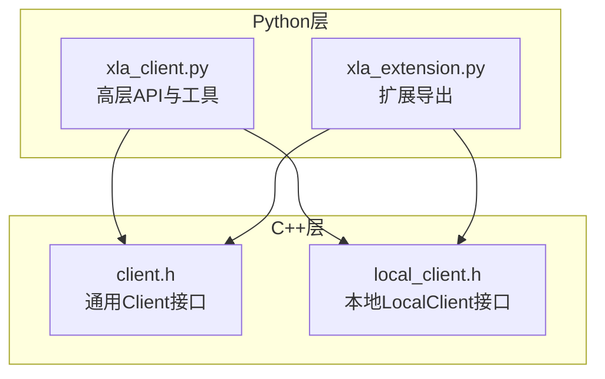
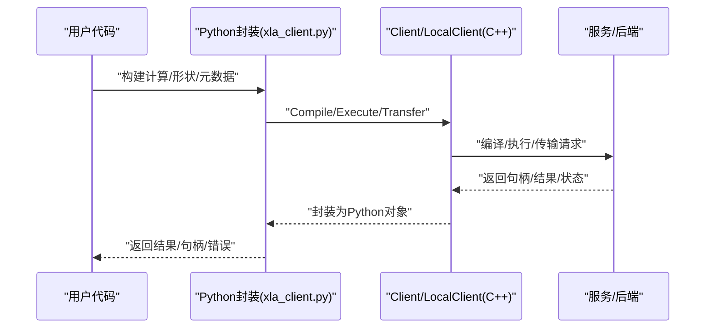
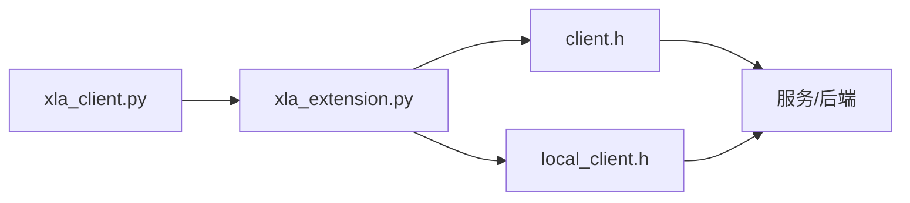

# Python接口

<cite>
**本文引用的文件**
- [xla_client.py](file://xla/python/xla_client.py)
- [xla_extension.py](file://xla/python/xla_extension.py)
- [client.h](file://xla/client/client.h)
- [local_client.h](file://xla/client/local_client.h)
- [README.md](file://README.md)
- [pjrt_integration.md](file://docs/pjrt/pjrt_integration.md)
- [cpp_api_overview.md](file://docs/pjrt/cpp_api_overview.md)
- [examples.md](file://docs/pjrt/examples.md)
- [index.md](file://docs/pjrt/index.md)
- [tf2xla/index.md](file://docs/tf2xla/index.md)
</cite>

## 目录
1. [简介](#简介)
2. [项目结构](#项目结构)
3. [核心组件](#核心组件)
4. [架构总览](#架构总览)
5. [组件详解](#组件详解)
6. [依赖关系分析](#依赖关系分析)
7. [性能考量](#性能考量)
8. [故障排查指南](#故障排查指南)
9. [结论](#结论)
10. [附录](#附录)

## 简介
本文件面向使用XLA Python接口进行机器学习模型编译与执行的开发者，系统性梳理以下内容：
- Python客户端API：数据类型映射、形状与布局、算子元数据、卷积/点积/归集/散射等维度配置辅助函数。
- IFRT接口与PJRT集成：跨后端统一运行时抽象、可插拔设备与执行器、多平台一致性。
- 计算构建、编译选项、执行控制与结果获取的完整流程。
- 与主流ML框架（TensorFlow、PyTorch、JAX）的集成方式与最佳实践。
- 性能调优建议与调试工具使用指南。

## 项目结构
XLA Python接口由两部分组成：
- Python侧封装与工具：位于 xla/python 下，提供高层API、类型映射、形状推断与元数据生成等。
- C++侧客户端与本地编译执行：位于 xla/client 下，定义了通用Client与LocalClient接口，支持编译、执行、传输、常量计算等能力。

图表来源
- [xla_client.py](file://xla/python/xla_client.py#L1-L450)
- [xla_extension.py](file://xla/python/xla_extension.py#L1-L18)
- [client.h](file://xla/client/client.h#L42-L222)
- [local_client.h](file://xla/client/local_client.h#L142-L254)

章节来源
- [xla_client.py](file://xla/python/xla_client.py#L1-L450)
- [xla_extension.py](file://xla/python/xla_extension.py#L1-L18)
- [client.h](file://xla/client/client.h#L42-L222)
- [local_client.h](file://xla/client/local_client.h#L142-L254)

## 核心组件
- 数据类型与形状
  - 元素类型到NumPy类型的双向映射表，覆盖布尔、整数、浮点、复数及多种半精度/稀疏类型。
  - 形状构造工具：从Python值推断形状，支持嵌套元组树结构。
- 精度与数值稳健性
  - 精度配置对象PrecisionConfig，支持逐操作数精度策略。
  - 结果精度校验对象ResultAccuracy，支持绝对误差、相对误差与ULP阈值。
- 元数据与源码定位
  - OpMetadata用于记录算子类型、名称与源码位置信息，便于调试与可视化。
- 卷积/点积/归集/散射维度配置
  - 提供构建卷积维度规范、点积维度规范、归集/散射维度规范的辅助函数，支持字符串规范与显式对象。
- 填充配置
  - 支持从“VALID/SAME”或三元组列表构建PaddingConfig，自动计算对称/非对称填充。
- 设备与并行分组
  - ReplicaGroup与分组工具，支持多副本/多设备拓扑下的并行执行。

章节来源
- [xla_client.py](file://xla/python/xla_client.py#L40-L76)
- [xla_client.py](file://xla/python/xla_client.py#L84-L141)
- [xla_client.py](file://xla/python/xla_client.py#L143-L195)
- [xla_client.py](file://xla/python/xla_client.py#L197-L244)
- [xla_client.py](file://xla/python/xla_client.py#L246-L289)
- [xla_client.py](file://xla/python/xla_client.py#L292-L389)
- [xla_client.py](file://xla/python/xla_client.py#L392-L424)
- [xla_client.py](file://xla/python/xla_client.py#L426-L450)

## 架构总览
XLA Python接口通过Python封装调用底层C++客户端，实现从高层计算图/算子到编译、执行与结果回传的全链路。结合PJRT/IFRT，可实现跨平台、多后端的一致执行体验。

图表来源
- [xla_client.py](file://xla/python/xla_client.py#L1-L450)
- [client.h](file://xla/client/client.h#L67-L101)
- [local_client.h](file://xla/client/local_client.h#L156-L178)

## 组件详解

### Python客户端API（xla_client.py）
- 类型与形状
  - 元素类型到dtype映射、反向映射字典，确保跨语言一致性。
  - 从Python值推断形状，支持嵌套元组树，便于动态形状处理。
- 精度与元数据
  - 精度配置对象与结果精度对象，支持细粒度数值稳健性控制。
  - 源码信息元数据生成，自动提取调用栈文件名与行列号。
- 卷积/点积/归集/散射维度
  - 从字符串规范（如"NCHW/HWIO/NCHW"）或显式元组构建维度配置。
- 填充与并行
  - 将"VALID"/"SAME"映射为填充参数；支持从三元组序列构建PaddingConfig。
  - 提供ReplicaGroup与分组工具，便于多设备拓扑表达。

章节来源
- [xla_client.py](file://xla/python/xla_client.py#L40-L76)
- [xla_client.py](file://xla/python/xla_client.py#L143-L195)
- [xla_client.py](file://xla/python/xla_client.py#L292-L389)
- [xla_client.py](file://xla/python/xla_client.py#L426-L450)

### C++客户端接口（client.h / local_client.h）
- 通用Client
  - 编译：Compile，支持指定参数形状与执行选项。
  - 执行：Execute与ExecuteAndTransfer，支持并行执行、设备选择、执行剖析。
  - 传输：TransferToServer/Transfer/TransferToInfeed/TransferFromOutfeed。
  - 常量计算：ComputeConstant，用于静态推断。
- 本地LocalClient
  - 编译：Compile/CompileAheadOfTime，支持构建选项与AOT持久化。
  - 加载：Load，从序列化或模块加载已编译可执行。
  - 本地传输：TransferToInfeedLocal/TransferFromOutfeedLocal。
  - 设备查询：device_count、default_device_ordinal、device_ordinal_supported。

章节来源
- [client.h](file://xla/client/client.h#L67-L101)
- [client.h](file://xla/client/client.h#L117-L164)
- [local_client.h](file://xla/client/local_client.h#L156-L178)
- [local_client.h](file://xla/client/local_client.h#L180-L216)

### IFRT与PJRT集成
- PJRT统一运行时
  - 跨后端一致的设备抽象、可执行对象、缓冲区管理与事件同步。
  - 支持CPU/GPU/TPU等后端，以及分布式场景。
- IFRT桥接
  - 在XLA与具体后端之间提供中间层，屏蔽后端差异。
- 集成文档
  - 参考PJRT文档索引、C++概览、示例与集成指南。

章节来源
- [index.md](file://docs/pjrt/index.md)
- [cpp_api_overview.md](file://docs/pjrt/cpp_api_overview.md)
- [examples.md](file://docs/pjrt/examples.md)
- [pjrt_integration.md](file://docs/pjrt/pjrt_integration.md)

### 与主流ML框架的集成
- TensorFlow
  - 通过TF/XLA路径与XLA编译器集成，支持XLA编译优化与自定义算子。
- PyTorch
  - 通过PJRT后端或第三方桥接，将PyTorch张量与XLA可执行对接。
- JAX
  - 使用jaxlib中的xla_client作为底层绑定，直接调用XLA编译与执行。

章节来源
- [tf2xla/index.md](file://docs/tf2xla/index.md)
- [xla_extension.py](file://xla/python/xla_extension.py#L17-L18)

## 依赖关系分析
Python封装依赖于底层C++客户端，并通过扩展模块导出核心能力。PJRT/IFRT作为可插拔层，连接不同后端平台。

图表来源
- [xla_client.py](file://xla/python/xla_client.py#L1-L450)
- [xla_extension.py](file://xla/python/xla_extension.py#L1-L18)
- [client.h](file://xla/client/client.h#L42-L222)
- [local_client.h](file://xla/client/local_client.h#L142-L254)

章节来源
- [xla_client.py](file://xla/python/xla_client.py#L1-L450)
- [xla_extension.py](file://xla/python/xla_extension.py#L1-L18)
- [client.h](file://xla/client/client.h#L42-L222)
- [local_client.h](file://xla/client/local_client.h#L142-L254)

## 性能考量
- 编译缓存与持久化
  - 利用LocalClient的AOT编译与加载，避免重复编译开销。
- 执行选项与设备选择
  - 明确设备序号与布局，减少跨设备传输与重排成本。
- 传输优化
  - 合理使用TransferToServer/TransferFromOutfeed，避免频繁小块传输。
- 并行与分片
  - 使用ReplicaGroup与分组工具，结合后端特性进行多设备并行。
- 数值稳健性
  - 通过PrecisionConfig与ResultAccuracy控制精度与容差，平衡性能与稳定性。

## 故障排查指南
- 编译失败
  - 检查输入形状与布局是否匹配，确认执行选项与设备兼容。
- 执行异常
  - 查看执行剖析与错误码，定位热点算子与内存瓶颈。
- 传输问题
  - 核对目标设备与副本编号，确保Infeed/Outfeed队列正确配置。
- 调试工具
  - 使用源码元数据定位算子来源，结合PJRT/IFRT日志与剖析工具进行诊断。

章节来源
- [client.h](file://xla/client/client.h#L117-L164)
- [local_client.h](file://xla/client/local_client.h#L180-L216)

## 结论
XLA Python接口提供了从高层构建到底层执行的完整能力，配合PJRT/IFRT实现了跨平台一致性与可扩展性。通过合理利用编译选项、执行控制与传输策略，可在保证数值稳健性的前提下获得优异性能。与TensorFlow、PyTorch、JAX的集成路径清晰，适合在多框架生态中统一部署与优化。

## 附录
- 快速开始与示例
  - 参考PJRT示例文档，了解典型编译与执行流程。
- 参考资料
  - XLA与PJRT官方文档索引页。

章节来源
- [examples.md](file://docs/pjrt/examples.md)
- [README.md](file://README.md)