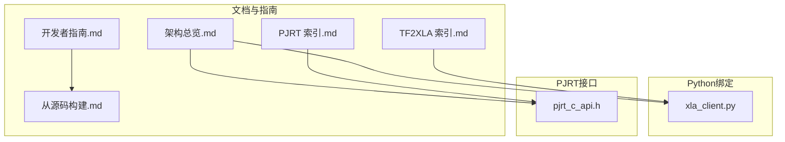
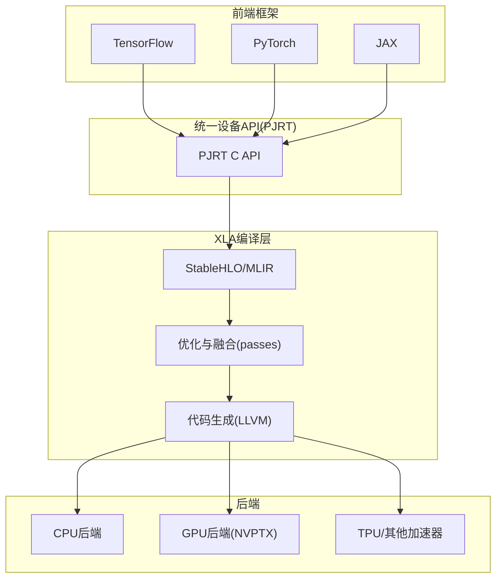
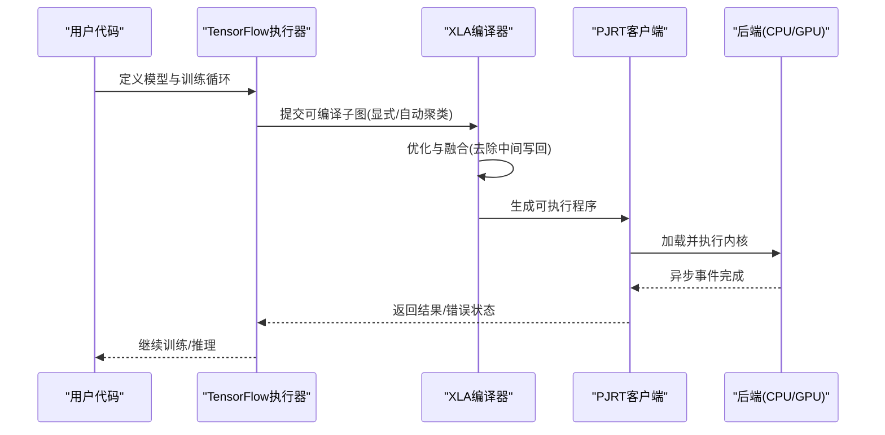
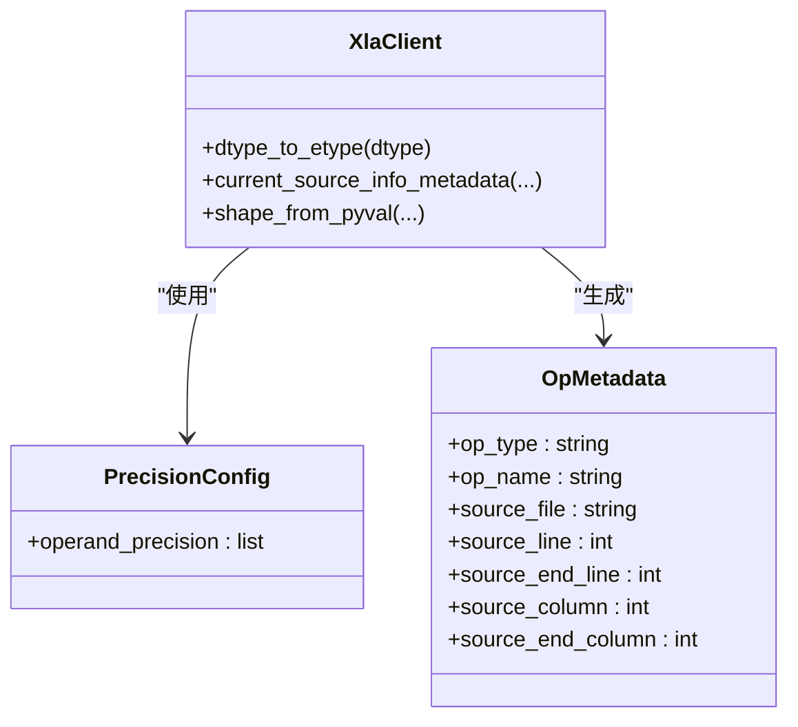
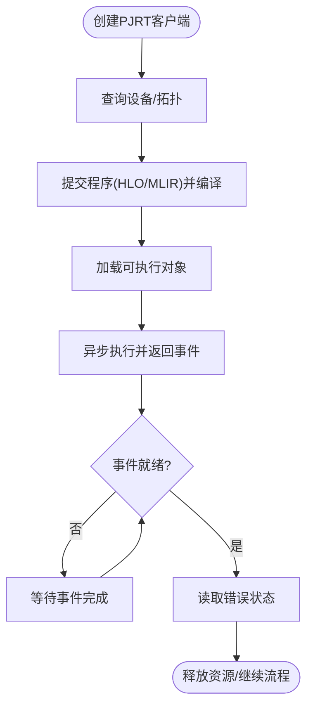
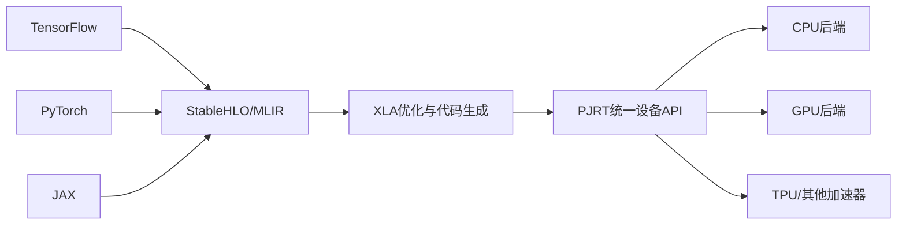

# 框架绑定

<cite>
**本文引用的文件**   
- [README.md](file://README.md)
- [架构总览.md](file://docs/architecture.md)
- [开发者指南.md](file://docs/developer_guide.md)
- [从源码构建.md](file://docs/build_from_source.md)
- [TF2XLA 索引.md](file://docs/tf2xla/index.md)
- [PJRT 索引.md](file://docs/pjrt/index.md)
- [xla_client.py](file://xla/python/xla_client.py)
- [pjrt_c_api.h](file://xla/pjrt/c/pjrt_c_api.h)
</cite>

## 目录
1. [简介](#简介)
2. [项目结构](#项目结构)
3. [核心组件](#核心组件)
4. [架构总览](#架构总览)
5. [详细组件分析](#详细组件分析)
6. [依赖分析](#依赖分析)
7. [性能考虑](#性能考虑)
8. [故障排查指南](#故障排查指南)
9. [结论](#结论)
10. [附录](#附录)

## 简介
本文件面向需要在主流机器学习框架（TensorFlow、PyTorch、JAX）中启用XLA加速的工程师与研究者，系统梳理XLA与这些框架的集成方式、API映射关系、自动微分与反向传播支持现状、以及性能优化与兼容性问题处理方法。XLA通过将高层模型图转换为针对目标硬件优化的内核，显著降低运行时开销、提升吞吐与能效。

## 项目结构
- 文档层：包含XLA整体架构、开发者指南、从源码构建、PJRT统一设备API、以及TF2XLA使用指南等。
- Python绑定层：提供XLA Python接口，用于形状描述、精度配置、元数据标注、以及与JAX底层xla_client的桥接。
- PJRT层：定义跨框架统一的设备与执行API，作为框架到后端的适配器。
- 后端与工具链：包括CPU/GPU后端、MLIR/StableHLO编译管线、以及调试与可视化工具。

**图表来源**
- [架构总览.md](file://docs/architecture.md#L1-L72)
- [开发者指南.md](file://docs/developer_guide.md#L1-L133)
- [从源码构建.md](file://docs/build_from_source.md#L1-L184)
- [TF2XLA 索引.md](file://docs/tf2xla/index.md#L1-L235)
- [PJRT 索引.md](file://docs/pjrt/index.md#L1-L32)
- [xla_client.py](file://xla/python/xla_client.py#L1-L450)
- [pjrt_c_api.h](file://xla/pjrt/c/pjrt_c_api.h#L1-L800)

**章节来源**
- [README.md](file://README.md#L1-L50)
- [架构总览.md](file://docs/architecture.md#L1-L72)
- [开发者指南.md](file://docs/developer_guide.md#L1-L133)
- [从源码构建.md](file://docs/build_from_source.md#L1-L184)
- [TF2XLA 索引.md](file://docs/tf2xla/index.md#L1-L235)
- [PJRT 索引.md](file://docs/pjrt/index.md#L1-L32)
- [xla_client.py](file://xla/python/xla_client.py#L1-L450)
- [pjrt_c_api.h](file://xla/pjrt/c/pjrt_c_api.h#L1-L800)

## 核心组件
- XLA编译器与StableHLO：接收来自前端的模型图，进行融合、内存调度与目标无关优化，再进入后端生成机器码。
- PJRT统一设备API：为框架提供一致的设备发现、编译、加载、执行与事件管理能力，屏蔽后端差异。
- Python绑定：提供形状、精度、元数据等高层封装，并与JAX底层xla_client互通，便于自定义算子与调试。
- 前端集成要点：TensorFlow通过显式编译或自动聚类；PyTorch/JAX通过各自XLA插件或运行时桥接到PJRT。

**章节来源**
- [架构总览.md](file://docs/architecture.md#L35-L72)
- [xla_client.py](file://xla/python/xla_client.py#L40-L141)
- [pjrt_c_api.h](file://xla/pjrt/c/pjrt_c_api.h#L380-L800)

## 架构总览
下图展示了XLA在多框架生态中的位置与交互路径：前端框架将模型图转换为StableHLO，XLA进行优化与代码生成，最终由后端（CPU/GPU/TPU）执行；PJRT作为统一设备抽象，连接框架与后端。

**图表来源**
- [架构总览.md](file://docs/architecture.md#L35-L72)
- [PJRT 索引.md](file://docs/pjrt/index.md#L6-L32)

## 详细组件分析

### TensorFlow 集成（TF2XLA）
- 显式编译：使用装饰器或模型编译选项开启XLA，获得细粒度控制与更强的融合潜力。
- 自动聚类：无需修改代码即可对子图进行自动编译，适合快速验证与上线。
- 分布式策略：可在镜像/多机多卡策略下对step函数进行显式编译以获得更好融合效果。
- 调试与可视化：通过环境变量导出HLO/LLVM/PTX中间表示，辅助定位性能瓶颈与兼容性问题。

**图表来源**
- [TF2XLA 索引.md](file://docs/tf2xla/index.md#L35-L144)

**章节来源**
- [TF2XLA 索引.md](file://docs/tf2xla/index.md#L35-L144)

### PyTorch 集成（通过XLA）
- 运行时桥接：PyTorch通过XLA运行时桥接到PJRT，实现张量在主机与设备间的传输、编译与执行。
- 自动微分：XLA在编译时对可微路径进行融合与优化，反向传播通过融合后的内核高效执行。
- 性能优化：建议结合静态形状推断、减少主机-设备往返、利用融合与内存重用。

（本节为概念性说明，不直接分析具体文件）

### JAX 集成（通过PJRT与xla_client）
- Python绑定：xla_client.py提供形状、精度、元数据等高层封装，并与JAX底层xla_client互通，便于自定义算子与调试。
- 精度与数值：支持多种元素类型与精度配置，便于在混合精度场景下保持数值稳定。
- 元数据与追踪：可通过OpMetadata与源码位置映射，辅助定位算子来源与性能热点。

**图表来源**
- [xla_client.py](file://xla/python/xla_client.py#L84-L141)

**章节来源**
- [xla_client.py](file://xla/python/xla_client.py#L40-L141)

### PJRT 统一设备API
- 设备与拓扑：提供平台名、版本、设备列表、拓扑描述等查询能力，支持分布式进程信息更新。
- 编译与加载：支持以HLO/MLIR格式提交程序，返回可加载的可执行对象。
- 执行与事件：异步执行返回事件对象，支持回调与等待，错误状态统一由PJRT_Error承载。
- 扩展机制：通过扩展类型链表支持GPU自定义调用、布局、内存描述、收集通信等扩展。

**图表来源**
- [pjrt_c_api.h](file://xla/pjrt/c/pjrt_c_api.h#L380-L800)

**章节来源**
- [pjrt_c_api.h](file://xla/pjrt/c/pjrt_c_api.h#L115-L124)
- [pjrt_c_api.h](file://xla/pjrt/c/pjrt_c_api.h#L272-L380)
- [pjrt_c_api.h](file://xla/pjrt/c/pjrt_c_api.h#L507-L744)

## 依赖分析
- 前端到XLA：通过StableHLO/MLIR作为统一中间表示，确保跨框架兼容与可移植性。
- XLA到后端：目标无关优化后进入后端，CPU/GPU使用LLVM生成机器码；扩展类型支持更多后端特性。
- 统一抽象：PJRT作为框架与后端之间的适配层，屏蔽设备差异，简化框架接入成本。

**图表来源**
- [架构总览.md](file://docs/architecture.md#L35-L72)
- [PJRT 索引.md](file://docs/pjrt/index.md#L6-L32)

**章节来源**
- [架构总览.md](file://docs/architecture.md#L35-L72)
- [PJRT 索引.md](file://docs/pjrt/index.md#L6-L32)

## 性能考虑
- 融合优先：尽量使用显式编译或自动聚类，使短生命周期算子被融合，减少中间存储与带宽占用。
- 形状与布局：静态形状推断有助于常数传播与更激进的优化；合理布局可减少寄存器压力。
- 主机-设备往返：减少频繁同步与小块传输，合并多次调用，利用异步事件流水线。
- 精度与数值：在满足精度要求的前提下选择更低精度类型，平衡吞吐与稳定性。
- 资源与拓扑：在多设备/多进程环境中，合理分配设备与分区，避免争用与通信瓶颈。

（本节提供通用指导，不直接分析具体文件）

## 故障排查指南
- 收集编译产物：使用环境变量导出HLO/IR/PTX等中间表示，便于复现与定位问题。
- 自动聚类调试：开启聚类调试输出，查看XLA子图嵌入情况，确认融合是否按预期发生。
- 错误状态：通过PJRT事件与错误对象获取详细错误码与消息，结合源码位置映射定位问题。
- 版本与ABI：关注PJRT API主次版本号，确保框架侧与后端实现兼容。

**章节来源**
- [TF2XLA 索引.md](file://docs/tf2xla/index.md#L146-L198)
- [pjrt_c_api.h](file://xla/pjrt/c/pjrt_c_api.h#L126-L216)

## 结论
XLA通过StableHLO与PJRT实现了对多框架的统一加速路径：前端框架只需对接PJRT，即可享受XLA的融合优化与高性能后端执行。对于自动微分与反向传播，XLA在编译阶段进行融合与内存优化，通常能显著提升训练/推理效率。实践中应结合显式编译与自动聚类策略，配合调试与性能分析工具，持续迭代优化。

## 附录
- 快速开始与构建参考：参见开发者指南与从源码构建文档，了解容器化与Bazel构建流程。
- 更多资料：参阅README中的官方链接与社区资源。

**章节来源**
- [开发者指南.md](file://docs/developer_guide.md#L1-L133)
- [从源码构建.md](file://docs/build_from_source.md#L1-L184)
- [README.md](file://README.md#L17-L29)