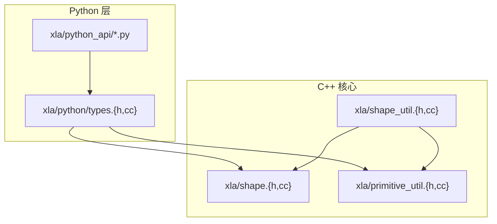
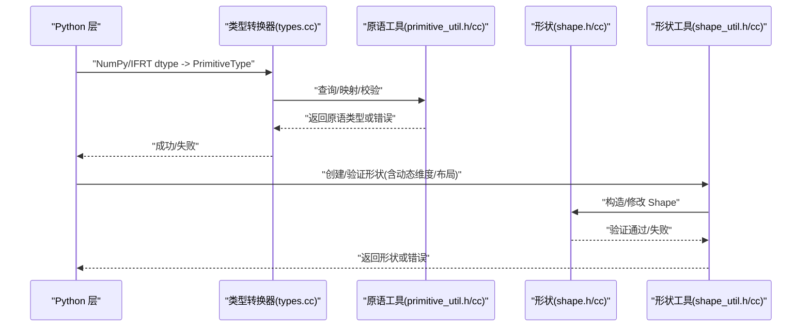
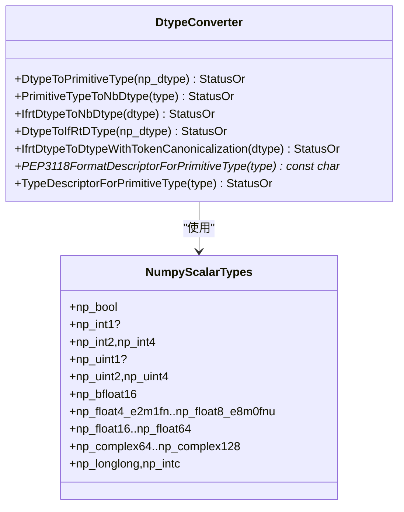
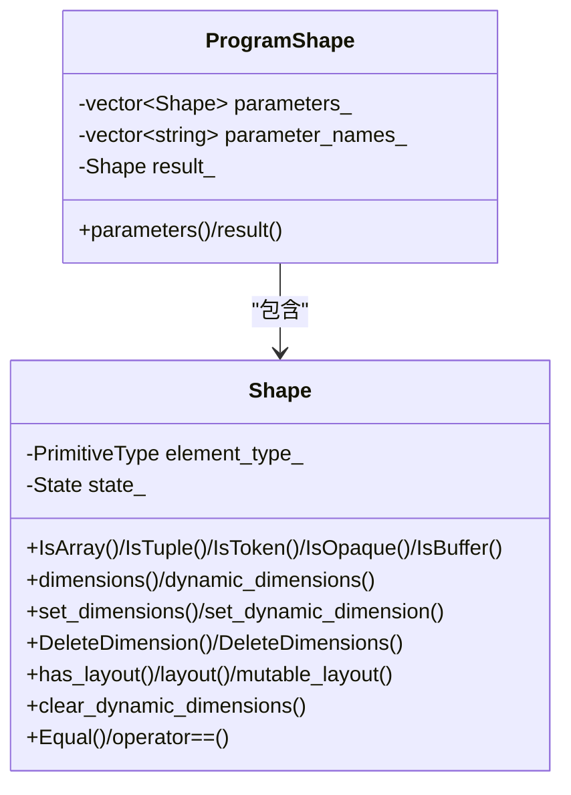
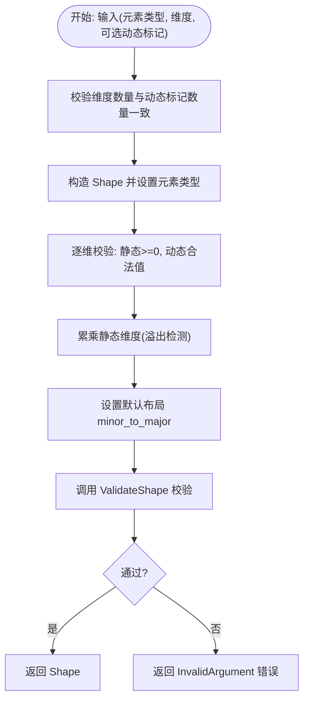
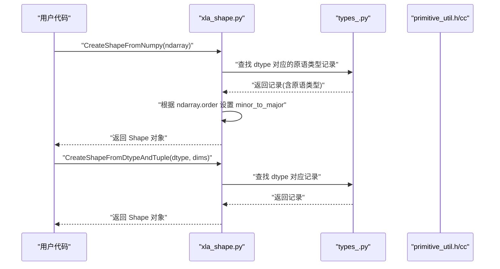
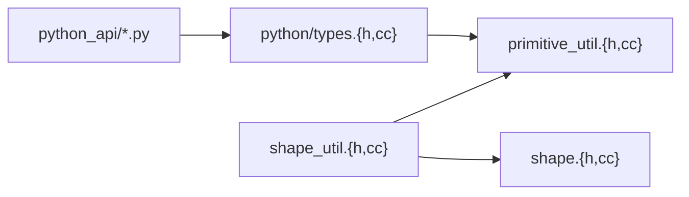

# 类型与形状系统

<cite>
**本文档引用的文件**
- [xla/python/types.h](file://xla/python/types.h)
- [xla/python/types.cc](file://xla/python/types.cc)
- [xla/shape.h](file://xla/shape.h)
- [xla/shape.cc](file://xla/shape.cc)
- [xla/shape_util.h](file://xla/shape_util.h)
- [xla/shape_util.cc](file://xla/shape_util.cc)
- [xla/primitive_util.h](file://xla/primitive_util.h)
- [xla/primitive_util.cc](file://xla/primitive_util.cc)
- [xla/python_api/xla_shape.py](file://xla/python_api/xla_shape.py)
- [xla/python_api/xla_shape_test.py](file://xla/python_api/xla_shape_test.py)
- [xla/python_api/types_.py](file://xla/python_api/types_.py)
</cite>

## 目录
1. [简介](#简介)
2. [项目结构](#项目结构)
3. [核心组件](#核心组件)
4. [架构总览](#架构总览)
5. [详细组件分析](#详细组件分析)
6. [依赖关系分析](#依赖关系分析)
7. [性能考虑](#性能考虑)
8. [故障排除指南](#故障排除指南)
9. [结论](#结论)
10. [附录](#附录)

## 简介
本文件系统性梳理 XLA 的 Python 类型与形状系统，覆盖以下关键主题：
- 数据类型定义与映射：从 NumPy、ml_dtypes 到 XLA 原语类型的双向转换与校验
- 形状表示与验证：数组、元组、缓冲区、令牌、不透明类型；静态/动态维度与布局
- 形状推断与广播：兼容性判断、秩对齐、元素类型一致性
- 与 NumPy/TensorFlow 的类型映射关系及最佳实践
- 类型安全检查、形状一致性验证与错误处理策略

## 项目结构
围绕类型与形状系统的关键模块如下：
- Python 层类型与转换：负责 NumPy/IFRT 与 XLA 原语类型的互转、格式描述符生成、Python 数组与 Literal 的互换
- C++ 核心类型与形状：Shape/ProgramShape 的定义、动态维度、布局、验证与比较
- 形状工具集：形状工厂、尺寸计算、序列化、打印、索引遍历、兼容性判断
- 原语类型工具：位宽、精度、浮点属性、类型族分类与转换策略

**图表来源**
- [xla/python/types.h](file://xla/python/types.h#L38-L158)
- [xla/python/types.cc](file://xla/python/types.cc#L55-L573)
- [xla/shape.h](file://xla/shape.h#L44-L882)
- [xla/shape_util.h](file://xla/shape_util.h#L104-L800)
- [xla/primitive_util.h](file://xla/primitive_util.h#L41-L954)
- [xla/python_api/xla_shape.py](file://xla/python_api/xla_shape.py#L23-L152)

**章节来源**
- [xla/python/types.h](file://xla/python/types.h#L38-L158)
- [xla/python/types.cc](file://xla/python/types.cc#L55-L573)
- [xla/shape.h](file://xla/shape.h#L44-L882)
- [xla/shape_util.h](file://xla/shape_util.h#L104-L800)
- [xla/primitive_util.h](file://xla/primitive_util.h#L41-L954)
- [xla/python_api/xla_shape.py](file://xla/python_api/xla_shape.py#L23-L152)

## 核心组件
- Python 类型与转换
  - NumPy/IFRT 与 XLA 原语类型的双向映射与校验
  - PEP3118 格式描述符与 NumPy 风格 typestr 生成
  - Literal 与 Python 数组的零拷贝互转
- C++ 形状模型
  - Shape/ProgramShape 的状态机设计（数组/元组/令牌/不透明/缓冲区）
  - 动态维度、布局、维度删除与插入、动态维度清理
- 形状工具集
  - 形状工厂（标量、元组、带布局形状）、尺寸与字节大小计算、序列化
  - 兼容性判断（忽略元素类型/精度/布局/维度等）、结构相等性
- 原语类型工具
  - 浮点/整数/复数族分类、位宽/字节宽、精度比较、类型切换与枚举

**章节来源**
- [xla/python/types.cc](file://xla/python/types.cc#L117-L573)
- [xla/shape.h](file://xla/shape.h#L61-L882)
- [xla/shape_util.cc](file://xla/shape_util.cc#L294-L800)
- [xla/primitive_util.h](file://xla/primitive_util.h#L413-L954)

## 架构总览
XLA 类型与形状系统的运行时交互流程如下：

**图表来源**
- [xla/python/types.cc](file://xla/python/types.cc#L117-L381)
- [xla/primitive_util.h](file://xla/primitive_util.h#L413-L954)
- [xla/shape.h](file://xla/shape.h#L61-L882)
- [xla/shape_util.cc](file://xla/shape_util.cc#L294-L446)

## 详细组件分析

### 组件A：Python 类型与转换
- 职责
  - 将 NumPy/IFRT dtype 映射到 XLA 原语类型，并进行有效性校验
  - 生成 PEP3118 格式描述符与 NumPy 风格 typestr
  - 将 Literal 转换为共享缓冲区的 Python 数组，避免数据复制
- 关键接口
  - DtypeToPrimitiveType、PrimitiveTypeToNbDtype、IfrtDtypeToNbDtype、DtypeToIfRtDType
  - IfrtDtypeToDtypeWithTokenCanonicalization
  - LiteralToPython、PEP3118FormatDescriptorForPrimitiveType、TypeDescriptorForPrimitiveType
- 设计要点
  - 使用静态哈希表缓存内置与自定义 dtype 映射，提升性能
  - 支持 ml_dtypes 中的自定义低精度类型（如 bf16、f4e2m1fn、f8e4m3 等）
  - 对于令牌类型进行特殊归一化，避免暴露给 JAX 类型系统

**图表来源**
- [xla/python/types.h](file://xla/python/types.h#L40-L102)
- [xla/python/types.cc](file://xla/python/types.cc#L117-L431)

**章节来源**
- [xla/python/types.h](file://xla/python/types.h#L40-L102)
- [xla/python/types.cc](file://xla/python/types.cc#L117-L431)

### 组件B：C++ 形状模型（Shape/ProgramShape）
- 职责
  - 表达数组/元组/令牌/不透明/缓冲区形状
  - 支持动态维度（含有界/无界）、布局、维度删除/插入、动态维度清理
  - 提供等价性比较（可忽略布局/元素类型/维度/动态标记等）
- 关键接口
  - Shape 构造函数（数组/元组/令牌/不透明/缓冲区）
  - set_element_type、add_dimensions、set_dimensions、set_dynamic_dimension
  - DeleteDimension/DeleteDimensions、clear_dynamic_dimensions
  - has_layout/mutable_layout/clear_layout、Equal 比较器
  - ProgramShape 参数/结果形状管理

**图表来源**
- [xla/shape.h](file://xla/shape.h#L61-L882)
- [xla/shape.cc](file://xla/shape.cc#L53-L413)

**章节来源**
- [xla/shape.h](file://xla/shape.h#L61-L882)
- [xla/shape.cc](file://xla/shape.cc#L53-L413)

### 组件C：形状工具集（ShapeUtil）
- 职责
  - 形状工厂：MakeValidatedShape/MakeValidatedTupleShape/MakeValidatedBufferShape
  - 尺寸与内存：ElementsIn/ByteSizeOf/SerializedSize、动态维度乘积
  - 打印与序列化：HumanString/HumanStringWithLayout、ToProto/FromProto
  - 兼容性与结构：Compatible/CompatibleIgnoringElementType/EqualStructure
  - 索引与遍历：ForEachSubshape/ForEachLeafShape、GetSubshape/IndexIsValid
- 关键算法
  - MakeValidatedShape：校验维度合法性、溢出检测、默认布局设置
  - Compatible：递归比较元组树结构与维度，支持忽略特定属性
  - ForEachSubshape：深度优先遍历子形状，支持可传播状态的访问器

**图表来源**
- [xla/shape_util.cc](file://xla/shape_util.cc#L294-L348)

**章节来源**
- [xla/shape_util.h](file://xla/shape_util.h#L104-L800)
- [xla/shape_util.cc](file://xla/shape_util.cc#L294-L800)

### 组件D：原语类型工具（primitive_util）
- 职责
  - 浮点属性：尾数位宽、指数位宽、下溢/上溢指数、负零存在性
  - 类型族判定：整数/浮点/复数/有符号/无符号
  - 类型切换与枚举：基于模板的多分派，按类型分支执行
  - 安全转换判断：CastPreservesValues（保持精度/范围/特殊值）
- 关键接口
  - FloatingPointTypeSwitch/IntegralTypeSwitch/ComplexTypeSwitch/ArrayTypeSwitch
  - BitWidth/ByteWidth/StorageBitWidth、HigherPrecisionElementType
  - CastPreservesValues、SignedIntegralTypeForBitWidth

**章节来源**
- [xla/primitive_util.h](file://xla/primitive_util.h#L413-L954)
- [xla/primitive_util.cc](file://xla/primitive_util.cc#L126-L225)

### 组件E：Python API（xla_shape 与类型映射）
- 职责
  - 从 NumPy 数组/嵌套元组推断 XLA 形状与布局
  - 将 NumPy dtype 映射到 XLA 原语类型记录表
- 关键接口
  - CreateShapeFromNumpy：根据数组布局自动设置 minor_to_major
  - CreateShapeFromDtypeAndTuple：从 dtype 和维度元组创建形状
  - types_.MAP_DTYPE_TO_RECORD：NumPy dtype 到 XLA 记录的映射

**图表来源**
- [xla/python_api/xla_shape.py](file://xla/python_api/xla_shape.py#L96-L152)
- [xla/python_api/types_.py](file://xla/python_api/types_.py#L38-L128)

**章节来源**
- [xla/python_api/xla_shape.py](file://xla/python_api/xla_shape.py#L23-L152)
- [xla/python_api/xla_shape_test.py](file://xla/python_api/xla_shape_test.py#L28-L116)
- [xla/python_api/types_.py](file://xla/python_api/types_.py#L38-L128)

## 依赖关系分析
- Python 类型层依赖 C++ 原语类型工具进行类型族判定与位宽计算
- 形状工具集在构造/修改形状时依赖原语类型工具与布局工具
- Python API 通过 types_.py 间接依赖 C++ 原语类型工具提供的类型信息

**图表来源**
- [xla/python/types.cc](file://xla/python/types.cc#L117-L381)
- [xla/primitive_util.h](file://xla/primitive_util.h#L413-L954)
- [xla/shape_util.cc](file://xla/shape_util.cc#L294-L446)
- [xla/shape.h](file://xla/shape.h#L61-L882)
- [xla/python_api/types_.py](file://xla/python_api/types_.py#L38-L128)

**章节来源**
- [xla/python/types.cc](file://xla/python/types.cc#L117-L381)
- [xla/shape_util.cc](file://xla/shape_util.cc#L294-L446)
- [xla/primitive_util.h](file://xla/primitive_util.h#L413-L954)
- [xla/python_api/types_.py](file://xla/python_api/types_.py#L38-L128)

## 性能考虑
- 映射缓存
  - Python 类型转换中使用静态哈希表缓存 dtype 到原语类型的映射，避免重复导入与查找开销
- 溢出检测
  - 形状工厂在累乘静态维度时进行溢出检测，提前失败以避免后续错误
- 布局默认化
  - 未指定布局时采用默认 major-to-minor 或 descending 布局，减少显式布局设置成本
- 零拷贝互转
  - LiteralToPython 通过共享底层缓冲区避免数据复制，降低内存与拷贝开销

[本节为通用指导，无需具体文件引用]

## 故障排除指南
- 类型映射失败
  - 症状：Unknown NumPy dtype 或 Unimplemented primitive type
  - 排查：确认 dtype 是否在内置/自定义映射表中；检查 ml_dtypes 版本是否支持对应类型
  - 参考路径：[DtypeToPrimitiveType](file://xla/python/types.cc#L117-L190)
- 形状维度非法
  - 症状：Invalid dimension size 或 overflow in static extent product
  - 排查：检查维度是否非负或动态上界是否为 kUnboundedSize；确认累乘未溢出
  - 参考路径：[MakeValidatedShape](file://xla/shape_util.cc#L294-L348)
- 布局不匹配
  - 症状：比较形状时布局差异导致不相等
  - 排查：使用 Equal().IgnoreLayout() 进行忽略布局的比较；或确保布局一致
  - 参考路径：[Shape::Equal](file://xla/shape.h#L454-L525)
- 元素类型不兼容
  - 症状：CastPreservesValues 返回 false
  - 排查：检查目标类型是否能保持源类型的精度/范围/特殊值
  - 参考路径：[CastPreservesValues](file://xla/primitive_util.cc#L147-L225)

**章节来源**
- [xla/python/types.cc](file://xla/python/types.cc#L117-L190)
- [xla/shape_util.cc](file://xla/shape_util.cc#L294-L348)
- [xla/shape.h](file://xla/shape.h#L454-L525)
- [xla/primitive_util.cc](file://xla/primitive_util.cc#L147-L225)

## 结论
XLA 的类型与形状系统通过 Python/C++ 分层协作，实现了从 NumPy/IFRT 到 XLA 原语类型的高可靠映射，以及对数组/元组/缓冲区/令牌/不透明形状的完整建模。借助完善的形状工具集与原语类型工具，系统提供了严格的验证、灵活的比较与高效的内存互转能力。遵循本文档中的最佳实践，可在跨框架集成与高性能计算场景中获得稳定可靠的类型与形状行为。

[本节为总结，无需具体文件引用]

## 附录

### A. 与 NumPy/TensorFlow 的类型映射
- NumPy → XLA
  - bool_/int8/16/32/64/uint8/16/32/64/float16/32/64/complex64/128 → 对应 PRED/S8/S16/S32/S64/U8/U16/U32/U64/F16/F32/F64/C64/C128
  - bfloat16、float4_e2m1fn、float8_e3m4、float8_e4m3、float8_e4m3fn、float8_e4m3b11fnuz、float8_e4m3fnuz、float8_e5m2、float8_e5m2fnuz、float8_e8m0fnu、int1/int2/int4/uint1/uint2/uint4 → 通过 ml_dtypes 映射
- XLA → NumPy
  - 通过 PrimitiveTypeToNbDtype 生成对应的 NumPy dtype 描述
- Python API
  - CreateShapeFromNumpy 自动根据数组布局设置 minor_to_major
  - types_.py 提供 dtype 到原语类型的映射表

**章节来源**
- [xla/python/types.cc](file://xla/python/types.cc#L192-L381)
- [xla/python_api/xla_shape.py](file://xla/python_api/xla_shape.py#L96-L152)
- [xla/python_api/types_.py](file://xla/python_api/types_.py#L38-L128)

### B. 形状推断与广播规则
- 形状推断
  - 通过 ShapeUtil::MakeValidatedShape 构造并校验形状，自动设置默认布局
  - 通过 ShapeUtil::Compatible/CompatibleIgnoringElementType 判断兼容性
- 广播规则
  - 通过 SameRank/SameDimensions/CompatibleIgnoringElementType 等工具进行维度与类型一致性检查
  - 对元组形状递归比较，支持忽略特定属性（如布局、元素类型）

**章节来源**
- [xla/shape_util.h](file://xla/shape_util.h#L238-L310)
- [xla/shape_util.cc](file://xla/shape_util.cc#L190-L234)

### C. 示例参考路径
- 将 NumPy 数组转换为 XLA 形状
  - [CreateShapeFromNumpy](file://xla/python_api/xla_shape.py#L122-L137)
- 将 Python 数组转换为 XLA Literal 并共享缓冲区
  - [CastToArray/LiteralToPython](file://xla/python/types.cc#L549-L573)
- 创建带布局的形状
  - [MakeValidatedShapeWithDenseLayout](file://xla/shape_util.cc#L350-L362)

**章节来源**
- [xla/python_api/xla_shape.py](file://xla/python_api/xla_shape.py#L122-L137)
- [xla/python/types.cc](file://xla/python/types.cc#L549-L573)
- [xla/shape_util.cc](file://xla/shape_util.cc#L350-L362)