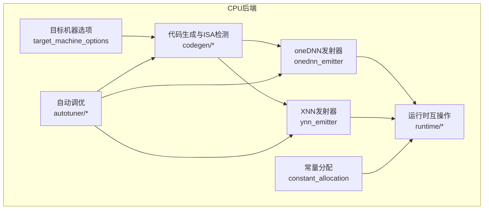
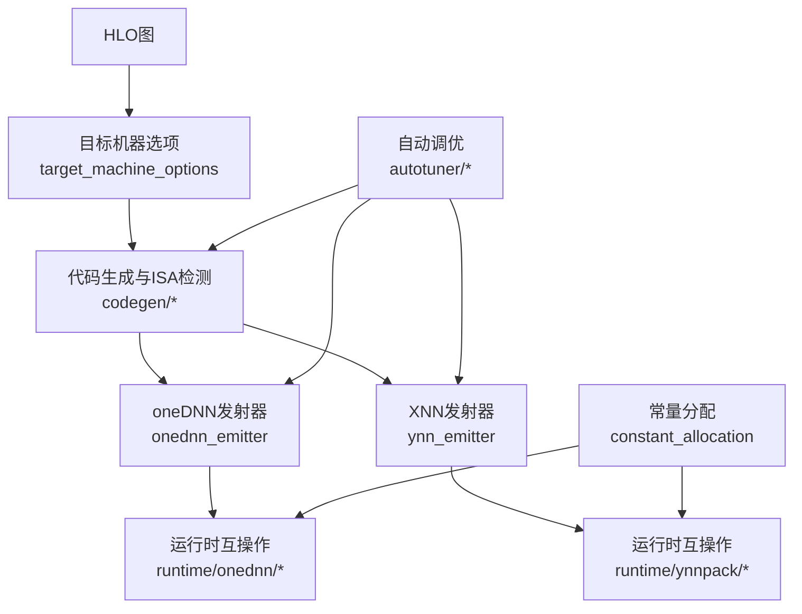
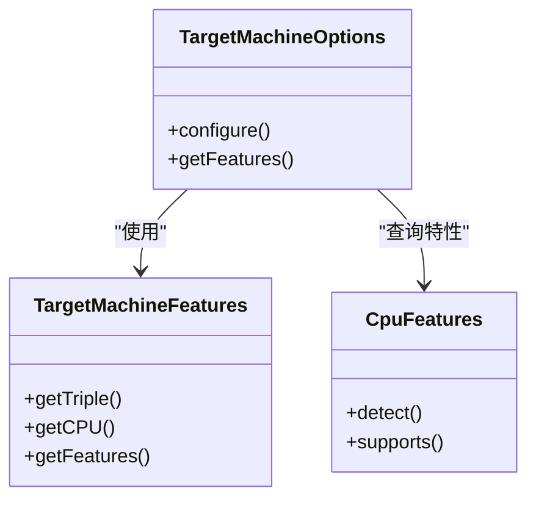
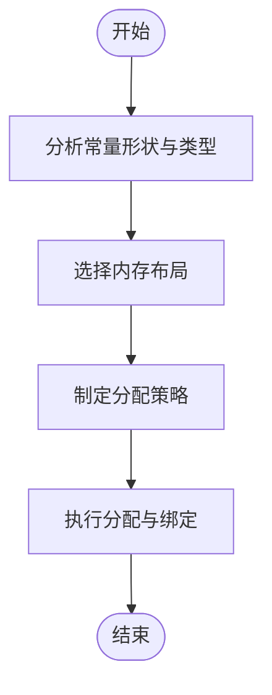
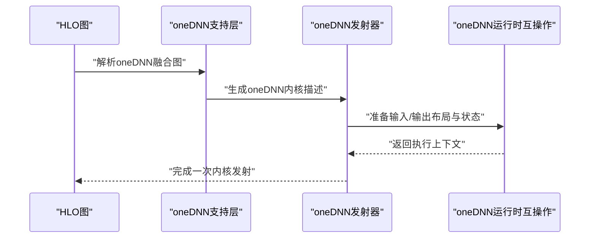
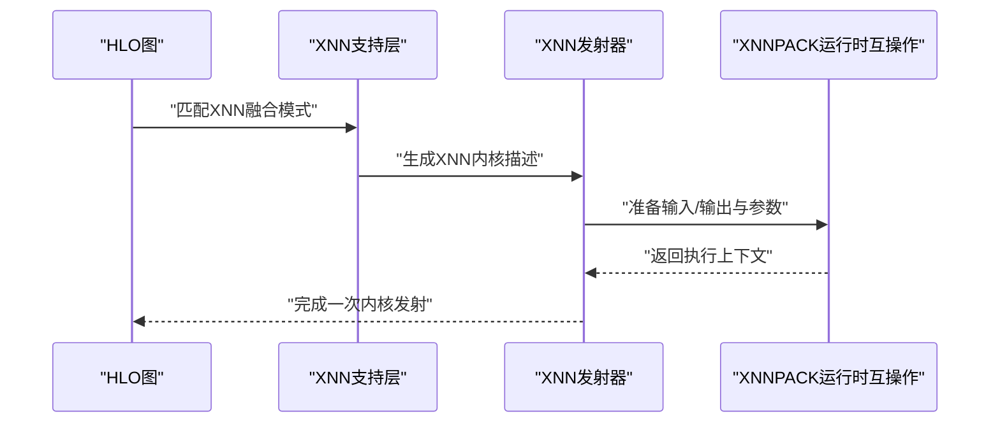
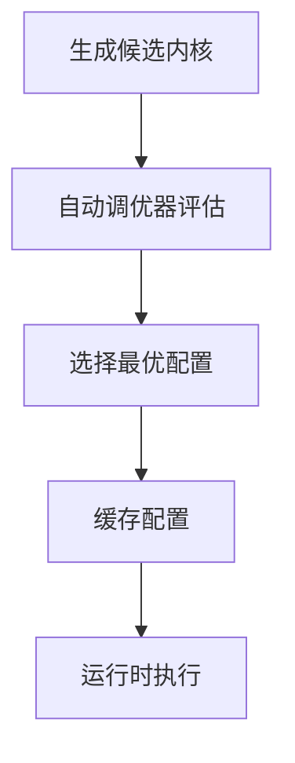
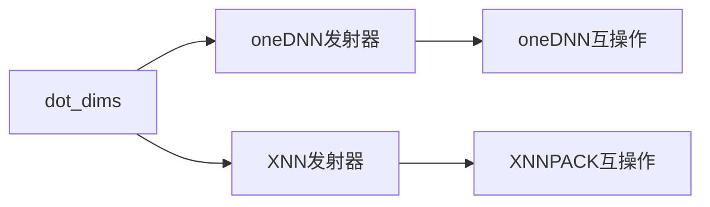
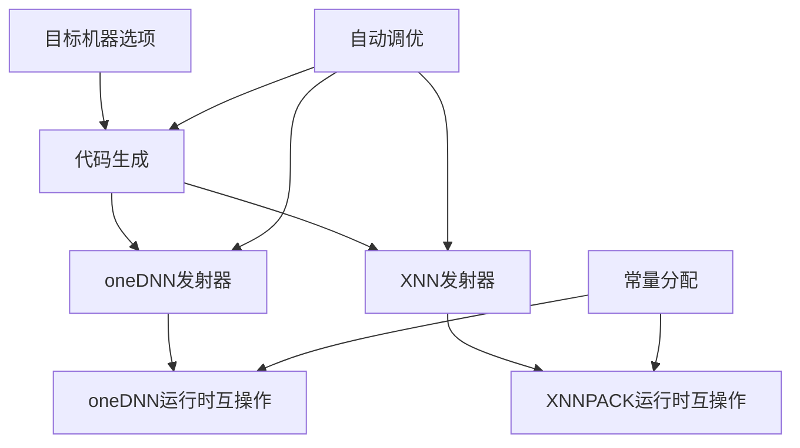

# CPU后端

<cite>
**本文引用的文件**
- [xla/backends/cpu/BUILD](file://xla/backends/cpu/BUILD)
- [docs/developing_new_backend.md](file://docs/developing_new_backend.md)
- [docs/hlo_passes.md](file://docs/hlo_passes.md)
- [docs/hlo_dumps.md](file://docs/hlo_dumps.md)
- [docs/terminology.md](file://docs/terminology.md)
- [xla/backends/cpu/target_machine_options.h](file://xla/backends/cpu/target_machine_options.h)
- [xla/backends/cpu/target_machine_options.cc](file://xla/backends/cpu/target_machine_options.cc)
- [xla/backends/cpu/constant_allocation.h](file://xla/backends/cpu/constant_allocation.h)
- [xla/backends/cpu/constant_allocation.cc](file://xla/backends/cpu/constant_allocation.cc)
- [xla/backends/cpu/onednn_emitter.h](file://xla/backends/cpu/onednn_emitter.h)
- [xla/backends/cpu/onednn_emitter.cc](file://xla/backends/cpu/onednn_emitter.cc)
- [xla/backends/cpu/onednn_support.h](file://xla/backends/cpu/onednn_support.h)
- [xla/backends/cpu/onednn_support.cc](file://xla/backends/cpu/onednn_support.cc)
- [xla/backends/cpu/ynn_emitter.h](file://xla/backends/cpu/ynn_emitter.h)
- [xla/backends/cpu/ynn_emitter.cc](file://xla/backends/cpu/ynn_emitter.cc)
- [xla/backends/cpu/ynn_support.h](file://xla/backends/cpu/ynn_support.h)
- [xla/backends/cpu/ynn_support.cc](file://xla/backends/cpu/ynn_support.cc)
- [xla/backends/cpu/autotuner/llvm_kernel_autotuner.h](file://xla/backends/cpu/autotuner/llvm_kernel_autotuner.h)
- [xla/backends/cpu/autotuner/llvm_kernel_autotuner.cc](file://xla/backends/cpu/autotuner/llvm_kernel_autotuner.cc)
- [xla/backends/cpu/autotuner/llvm_kernel_backend.h](file://xla/backends/cpu/autotuner/llvm_kernel_backend.h)
- [xla/backends/cpu/autotuner/llvm_kernel_backend.cc](file://xla/backends/cpu/autotuner/llvm_kernel_backend.cc)
- [xla/backends/cpu/autotuner/cpu_profiler.h](file://xla/backends/cpu/autotuner/cpu_profiler.h)
- [xla/backends/cpu/autotuner/cpu_profiler.cc](file://xla/backends/cpu/autotuner/cpu_profiler.cc)
- [xla/backends/cpu/autotuner/autotuner.h](file://xla/backends/cpu/autotuner/autotuner.h)
- [xla/backends/cpu/autotuner/autotuner.cc](file://xla/backends/cpu/autotuner/autotuner.cc)
- [xla/backends/cpu/benchmarks/BUILD](file://xla/backends/cpu/benchmarks/BUILD)
- [xla/backends/cpu/benchmarks/cpu_benchmark.h](file://xla/backends/cpu/benchmarks/cpu_benchmark.h)
- [xla/backends/cpu/benchmarks/cpu_benchmark.cc](file://xla/backends/cpu/benchmarks/cpu_benchmark.cc)
- [xla/backends/cpu/runtime/dot_dims.h](file://xla/backends/cpu/runtime/dot_dims.h)
- [xla/backends/cpu/runtime/dot_dims.cc](file://xla/backends/cpu/runtime/dot_dims.cc)
- [xla/backends/cpu/runtime/ynnpack/ynn_interop.h](file://xla/backends/cpu/runtime/ynnpack/ynn_interop.h)
- [xla/backends/cpu/runtime/ynnpack/ynn_interop.cc](file://xla/backends/cpu/runtime/ynnpack/ynn_interop.cc)
- [xla/backends/cpu/runtime/onednn/onednn_interop.h](file://xla/backends/cpu/runtime/onednn/onednn_interop.h)
- [xla/backends/cpu/runtime/onednn/onednn_interop.cc](file://xla/backends/cpu/runtime/onednn/onednn_interop.cc)
- [xla/backends/cpu/codegen/target_machine_features.h](file://xla/backends/cpu/codegen/target_machine_features.h)
- [xla/backends/cpu/codegen/target_machine_features.cc](file://xla/backends/cpu/codegen/target_machine_features.cc)
- [xla/backends/cpu/codegen/cpu_features.h](file://xla/backends/cpu/codegen/cpu_features.h)
- [xla/backends/cpu/codegen/cpu_features.cc](file://xla/backends/cpu/codegen/cpu_features.cc)
- [xla/backends/cpu/codegen/cpu_isa_detection.h](file://xla/backends/cpu/codegen/cpu_isa_detection.h)
- [xla/backends/cpu/codegen/cpu_isa_detection.cc](file://xla/backends/cpu/codegen/cpu_isa_detection.cc)
- [xla/backends/cpu/codegen/cpu_isa_detection_test.cc](file://xla/backends/cpu/codegen/cpu_isa_detection_test.cc)
- [xla/backends/cpu/codegen/cpu_isa_detection_test.h](file://xla/backends/cpu/codegen/cpu_isa_detection_test.h)
- [xla/backends/cpu/codegen/cpu_isa_detection_test.cc](file://xla/backends/cpu/codegen/cpu_isa_detection_test.cc)
- [xla/backends/cpu/codegen/cpu_isa_detection_test.h](file://xla/backends/cpu/codegen/cpu_isa_detection_test.h)
- [xla/backends/cpu/codegen/cpu_isa_detection_test.cc](file://xla/backends/cpu/codegen/cpu_isa_detection_test.cc)
- [xla/backends/cpu/codegen/cpu_isa_detection_test.h](file://xla/backends/cpu/codegen/cpu_isa_detection_test.h)
- [xla/backends/cpu/codegen/cpu_isa_detection_test.cc](file://xla/backends/cpu/codegen/cpu_isa_detection_test.cc)
- [xla/backends/cpu/codegen/cpu_isa_detection_test.h](file://xla/backends/cpu/codegen/cpu_isa_detection_test.h)
- [xla/backends/cpu/codegen/cpu_isa_detection_test.cc](file://xla/backends/cpu/codegen/cpu_isa_detection_test.cc)
- [xla/backends/cpu/codegen/cpu_isa_detection_test.h](file://xla/backends/cpu/codegen/cpu_isa_detection_test.h)
- [xla/backends/cpu/codegen/cpu_isa_detection_test.cc](file://xla/backends/cpu/codegen/cpu_isa_detection_test.cc)
- [xla/backends/cpu/codegen/cpu_isa_detection_test.h](file://xla/backends/cpu/codegen/cpu_isa_detection_test.h)
- [xla/backends/cpu/codegen/cpu_isa_detection_test.cc](file://xla/backends/cpu/codegen/cpu_isa_detection_test.cc)
- [xla/backends/cpu/codegen/cpu_isa_detection_test.h](file://xla/backends/cpu/codegen/cpu_isa_detection_test.h)
- [xla/backends/cpu/codegen/cpu_isa_detection_test.cc](file://xla/backends/cpu/codegen/cpu_isa_detection_test.cc)
- [xla/backends/cpu/codegen/cpu_isa_detection_test.h](file://xla/backends/cpu/codegen/cpu_isa_detection_test.h)
- [xla/backends/cpu/codegen/cpu_isa_detection_test.cc](file......)
</cite>

## 目录
1. [简介](#简介)
2. [项目结构](#项目结构)
3. [核心组件](#核心组件)
4. [架构总览](#架构总览)
5. [详细组件分析](#详细组件分析)
6. [依赖关系分析](#依赖关系分析)
7. [性能考虑](#性能考虑)
8. [故障排除指南](#故障排除指南)
9. [结论](#结论)
10. [附录](#附录)

## 简介
本文件系统性梳理XLA CPU后端的实现架构与关键能力，覆盖代码生成、内核发射、内存管理、执行调度、oneDNN融合、XNN融合优化、目标机器选项配置、自动调优机制、常量分配策略以及运行时组件。文档同时提供性能优化建议、多线程执行模型与内存布局优化思路，并给出调试与故障排除方法，帮助开发者高效理解并使用XLA CPU后端。

## 项目结构
XLA CPU后端位于xla/backends/cpu目录，围绕“编译器/代码生成/运行时”三层组织，辅以autotuner与benchmarks模块支撑自动调优与基准测试。其关键模块包括：
- 代码生成与目标机器选项：target_machine_options、codegen下的cpu_features、cpu_isa_detection、target_machine_features
- 内存与常量分配：constant_allocation
- 融合与发射：onednn_emitter、ynn_emitter及其支持模块
- 自动调优：autotuner（llvm_kernel_autotuner、llvm_kernel_backend、cpu_profiler、autotuner）
- 运行时互操作：runtime下的dot_dims、ynnpack/ynn_interop、onednn/onednn_interop
- 构建与可见性：backends/cpu/BUILD

图表来源
- [xla/backends/cpu/BUILD](file://xla/backends/cpu/BUILD#L1-L246)
- [xla/backends/cpu/target_machine_options.h](file://xla/backends/cpu/target_machine_options.h)
- [xla/backends/cpu/constant_allocation.h](file://xla/backends/cpu/constant_allocation.h)
- [xla/backends/cpu/onednn_emitter.h](file://xla/backends/cpu/onednn_emitter.h)
- [xla/backends/cpu/ynn_emitter.h](file://xla/backends/cpu/ynn_emitter.h)
- [xla/backends/cpu/autotuner/autotuner.h](file://xla/backends/cpu/autotuner/autotuner.h)
- [xla/backends/cpu/runtime/dot_dims.h](file://xla/backends/cpu/runtime/dot_dims.h)

章节来源
- [xla/backends/cpu/BUILD](file://xla/backends/cpu/BUILD#L1-L246)

## 核心组件
- 目标机器选项与ISA检测：负责解析目标平台特性、选择合适的ISA与指令集扩展，为代码生成提供依据。
- 常量分配：对常量进行内存布局与分配策略优化，减少运行时拷贝与内存碎片。
- oneDNN与XNN发射器：分别对接oneDNN与XNNPACK，实现卷积/矩阵乘等算子的融合与高效内核发射。
- 自动调优：基于LLVM内核的自动调优框架，结合CPU特性与运行时数据，选择最优参数组合。
- 运行时互操作：封装oneDNN/XNNPACK与XLA运行时之间的桥接，处理数据布局、形状与状态转换。

章节来源
- [xla/backends/cpu/target_machine_options.h](file://xla/backends/cpu/target_machine_options.h)
- [xla/backends/cpu/constant_allocation.h](file://xla/backends/cpu/constant_allocation.h)
- [xla/backends/cpu/onednn_emitter.h](file://xla/backends/cpu/onednn_emitter.h)
- [xla/backends/cpu/ynn_emitter.h](file://xla/backends/cpu/ynn_emitter.h)
- [xla/backends/cpu/autotuner/autotuner.h](file://xla/backends/cpu/autotuner/autotuner.h)
- [xla/backends/cpu/runtime/dot_dims.h](file://xla/backends/cpu/runtime/dot_dims.h)

## 架构总览
XLA CPU后端采用“编译期优化+运行时高效发射”的设计。编译阶段通过目标机器选项与ISA检测确定最佳代码路径；运行时通过oneDNN/XNN发射器将HLO图映射到高性能内核，并由常量分配与运行时互操作保障内存与数据布局的正确性。

图表来源
- [xla/backends/cpu/target_machine_options.h](file://xla/backends/cpu/target_machine_options.h)
- [xla/backends/cpu/onednn_emitter.h](file://xla/backends/cpu/onednn_emitter.h)
- [xla/backends/cpu/ynn_emitter.h](file://xla/backends/cpu/ynn_emitter.h)
- [xla/backends/cpu/constant_allocation.h](file://xla/backends/cpu/constant_allocation.h)
- [xla/backends/cpu/autotuner/autotuner.h](file://xla/backends/cpu/autotuner/autotuner.h)
- [xla/backends/cpu/runtime/onednn/onednn_interop.h](file://xla/backends/cpu/runtime/onednn/onednn_interop.h)
- [xla/backends/cpu/runtime/ynnpack/ynn_interop.h](file://xla/backends/cpu/runtime/ynnpack/ynn_interop.h)

## 详细组件分析

### 目标机器选项与ISA检测
- 功能要点
  - 解析目标平台特性，选择ISA与指令集扩展，确保生成代码在目标CPU上具备最佳性能。
  - 与LLVM TargetParser集成，保证与后端工具链一致的特性识别。
- 关键接口与实现
  - 目标机器选项：定义与解析目标平台特性，供代码生成阶段使用。
  - ISA检测：检测CPU指令集可用性，决定是否启用特定加速路径。
  - CPU特性与目标机器特征：封装底层特性与目标描述，供发射器与运行时使用。

图表来源
- [xla/backends/cpu/target_machine_options.h](file://xla/backends/cpu/target_machine_options.h)
- [xla/backends/cpu/codegen/cpu_features.h](file://xla/backends/cpu/codegen/cpu_features.h)
- [xla/backends/cpu/codegen/target_machine_features.h](file://xla/backends/cpu/codegen/target_machine_features.h)

章节来源
- [xla/backends/cpu/target_machine_options.cc](file://xla/backends/cpu/target_machine_options.cc)
- [xla/backends/cpu/codegen/cpu_features.cc](file://xla/backends/cpu/codegen/cpu_features.cc)
- [xla/backends/cpu/codegen/target_machine_features.cc](file://xla/backends/cpu/codegen/target_machine_features.cc)
- [xla/backends/cpu/codegen/cpu_isa_detection.h](file://xla/backends/cpu/codegen/cpu_isa_detection.h)
- [xla/backends/cpu/codegen/cpu_isa_detection.cc](file://xla/backends/cpu/codegen/cpu_isa_detection.cc)

### 常量分配策略
- 功能要点
  - 对常量张量进行内存布局优化与分配策略选择，减少运行时拷贝与内存占用。
  - 与缓冲区分配器协作，确保常量在生命周期内的可复用性与一致性。
- 关键流程
  - 形状与类型分析 → 布局选择 → 分配策略决策 → 运行时绑定。

图表来源
- [xla/backends/cpu/constant_allocation.h](file://xla/backends/cpu/constant_allocation.h)
- [xla/backends/cpu/constant_allocation.cc](file://xla/backends/cpu/constant_allocation.cc)

章节来源
- [xla/backends/cpu/constant_allocation.h](file://xla/backends/cpu/constant_allocation.h)
- [xla/backends/cpu/constant_allocation.cc](file://xla/backends/cpu/constant_allocation.cc)

### oneDNN融合与发射
- 功能要点
  - 将HLO中的算子融合为oneDNN支持的图，生成高效的内核调用序列。
  - 提供oneDNN支持层与发射器，处理形状、布局与数据类型转换。
- 组件关系
  - 支持层：解析oneDNN图与目标机器特性，生成oneDNN可执行单元。
  - 发射器：将融合后的节点映射到oneDNN内核，处理输入输出布局与状态。

图表来源
- [xla/backends/cpu/onednn_support.h](file://xla/backends/cpu/onednn_support.h)
- [xla/backends/cpu/onednn_support.cc](file://xla/backends/cpu/onednn_support.cc)
- [xla/backends/cpu/onednn_emitter.h](file://xla/backends/cpu/onednn_emitter.h)
- [xla/backends/cpu/onednn_emitter.cc](file://xla/backends/cpu/onednn_emitter.cc)
- [xla/backends/cpu/runtime/onednn/onednn_interop.h](file://xla/backends/cpu/runtime/onednn/onednn_interop.h)
- [xla/backends/cpu/runtime/onednn/onednn_interop.cc](file://xla/backends/cpu/runtime/onednn/onednn_interop.cc)

章节来源
- [xla/backends/cpu/onednn_support.h](file://xla/backends/cpu/onednn_support.h)
- [xla/backends/cpu/onednn_support.cc](file://xla/backends/cpu/onednn_support.cc)
- [xla/backends/cpu/onednn_emitter.h](file://xla/backends/cpu/onednn_emitter.h)
- [xla/backends/cpu/onednn_emitter.cc](file://xla/backends/cpu/onednn_emitter.cc)

### XNN融合与发射
- 功能要点
  - 针对卷积、激活等常见算子，利用XNNPACK进行融合与高效内核发射。
  - 提供XNN支持层与发射器，处理XNNPACK的参数与状态。
- 组件关系
  - 支持层：匹配HLO模式并生成XNNPACK融合图。
  - 发射器：将融合节点映射到XNNPACK内核，处理布局与数据类型。

图表来源
- [xla/backends/cpu/ynn_support.h](file://xla/backends/cpu/ynn_support.h)
- [xla/backends/cpu/ynn_support.cc](file://xla/backends/cpu/ynn_support.cc)
- [xla/backends/cpu/ynn_emitter.h](file://xla/backends/cpu/ynn_emitter.h)
- [xla/backends/cpu/ynn_emitter.cc](file://xla/backends/cpu/ynn_emitter.cc)
- [xla/backends/cpu/runtime/ynnpack/ynn_interop.h](file://xla/backends/cpu/runtime/ynnpack/ynn_interop.h)
- [xla/backends/cpu/runtime/ynnpack/ynn_interop.cc](file://xla/backends/cpu/runtime/ynnpack/ynn_interop.cc)

章节来源
- [xla/backends/cpu/ynn_support.h](file://xla/backends/cpu/ynn_support.h)
- [xla/backends/cpu/ynn_support.cc](file://xla/backends/cpu/ynn_support.cc)
- [xla/backends/cpu/ynn_emitter.h](file://xla/backends/cpu/ynn_emitter.h)
- [xla/backends/cpu/ynn_emitter.cc](file://xla/backends/cpu/ynn_emitter.cc)

### 自动调优机制
- 功能要点
  - 基于LLVM内核的自动调优框架，结合CPU特性与运行时数据，选择最优参数组合。
  - 包含内核后端、自动调优器与CPU性能剖析器，形成闭环优化。
- 流程概览
  - 编译期生成候选内核 → 运行时采样与评估 → 选择最优配置并缓存结果。

图表来源
- [xla/backends/cpu/autotuner/llvm_kernel_autotuner.h](file://xla/backends/cpu/autotuner/llvm_kernel_autotuner.h)
- [xla/backends/cpu/autotuner/llvm_kernel_autotuner.cc](file://xla/backends/cpu/autotuner/llvm_kernel_autotuner.cc)
- [xla/backends/cpu/autotuner/llvm_kernel_backend.h](file://xla/backends/cpu/autotuner/llvm_kernel_backend.h)
- [xla/backends/cpu/autotuner/llvm_kernel_backend.cc](file://xla/backends/cpu/autotuner/llvm_kernel_backend.cc)
- [xla/backends/cpu/autotuner/cpu_profiler.h](file://xla/backends/cpu/autotuner/cpu_profiler.h)
- [xla/backends/cpu/autotuner/cpu_profiler.cc](file://xla/backends/cpu/autotuner/cpu_profiler.cc)
- [xla/backends/cpu/autotuner/autotuner.h](file://xla/backends/cpu/autotuner/autotuner.h)
- [xla/backends/cpu/autotuner/autotuner.cc](file://xla/backends/cpu/autotuner/autotuner.cc)

章节来源
- [xla/backends/cpu/autotuner/llvm_kernel_autotuner.h](file://xla/backends/cpu/autotuner/llvm_kernel_autotuner.h)
- [xla/backends/cpu/autotuner/llvm_kernel_autotuner.cc](file://xla/backends/cpu/autotuner/llvm_kernel_autotuner.cc)
- [xla/backends/cpu/autotuner/llvm_kernel_backend.h](file://xla/backends/cpu/autotuner/llvm_kernel_backend.h)
- [xla/backends/cpu/autotuner/llvm_kernel_backend.cc](file://xla/backends/cpu/autotuner/llvm_kernel_backend.cc)
- [xla/backends/cpu/autotuner/cpu_profiler.h](file://xla/backends/cpu/autotuner/cpu_profiler.h)
- [xla/backends/cpu/autotuner/cpu_profiler.cc](file://xla/backends/cpu/autotuner/cpu_profiler.cc)
- [xla/backends/cpu/autotuner/autotuner.h](file://xla/backends/cpu/autotuner/autotuner.h)
- [xla/backends/cpu/autotuner/autotuner.cc](file://xla/backends/cpu/autotuner/autotuner.cc)

### 运行时互操作与数据维度
- 功能要点
  - 封装oneDNN与XNNPACK与XLA运行时之间的桥接，处理数据布局、形状与状态转换。
  - dot_dims用于矩阵乘等算子的维度信息传递与校验。
- 组件关系
  - oneDNN互操作：oneDNN发射器 → oneDNN运行时互操作
  - XNNPACK互操作：XNN发射器 → XNNPACK运行时互操作
  - 数据维度：dot_dims贯穿发射器与运行时

图表来源
- [xla/backends/cpu/onednn_emitter.h](file://xla/backends/cpu/onednn_emitter.h)
- [xla/backends/cpu/ynn_emitter.h](file://xla/backends/cpu/ynn_emitter.h)
- [xla/backends/cpu/runtime/onednn/onednn_interop.h](file://xla/backends/cpu/runtime/onednn/onednn_interop.h)
- [xla/backends/cpu/runtime/ynnpack/ynn_interop.h](file://xla/backends/cpu/runtime/ynnpack/ynn_interop.h)
- [xla/backends/cpu/runtime/dot_dims.h](file://xla/backends/cpu/runtime/dot_dims.h)

章节来源
- [xla/backends/cpu/runtime/onednn/onednn_interop.h](file://xla/backends/cpu/runtime/onednn/onednn_interop.h)
- [xla/backends/cpu/runtime/onednn/onednn_interop.cc](file://xla/backends/cpu/runtime/onednn/onednn_interop.cc)
- [xla/backends/cpu/runtime/ynnpack/ynn_interop.h](file://xla/backends/cpu/runtime/ynnpack/ynn_interop.h)
- [xla/backends/cpu/runtime/ynnpack/ynn_interop.cc](file://xla/backends/cpu/runtime/ynnpack/ynn_interop.cc)
- [xla/backends/cpu/runtime/dot_dims.h](file://xla/backends/cpu/runtime/dot_dims.h)
- [xla/backends/cpu/runtime/dot_dims.cc](file://xla/backends/cpu/runtime/dot_dims.cc)

## 依赖关系分析
- 模块耦合
  - 目标机器选项与ISA检测为上游依赖，影响后续代码生成与发射器选择。
  - oneDNN与XNN发射器共享常量分配与运行时互操作，降低重复实现。
  - 自动调优模块横切编译与运行时，提升整体性能稳定性。
- 外部依赖
  - oneDNN与XNNPACK作为高性能数学库，提供融合与内核实现基础。
  - LLVM TargetParser与Support用于目标机器特性解析与工具链集成。

图表来源
- [xla/backends/cpu/BUILD](file://xla/backends/cpu/BUILD#L1-L246)
- [xla/backends/cpu/target_machine_options.h](file://xla/backends/cpu/target_machine_options.h)
- [xla/backends/cpu/onednn_emitter.h](file://xla/backends/cpu/onednn_emitter.h)
- [xla/backends/cpu/ynn_emitter.h](file://xla/backends/cpu/ynn_emitter.h)
- [xla/backends/cpu/constant_allocation.h](file://xla/backends/cpu/constant_allocation.h)
- [xla/backends/cpu/autotuner/autotuner.h](file://xla/backends/cpu/autotuner/autotuner.h)
- [xla/backends/cpu/runtime/onednn/onednn_interop.h](file://xla/backends/cpu/runtime/onednn/onednn_interop.h)
- [xla/backends/cpu/runtime/ynnpack/ynn_interop.h](file://xla/backends/cpu/runtime/ynnpack/ynn_interop.h)

章节来源
- [xla/backends/cpu/BUILD](file://xla/backends/cpu/BUILD#L1-L246)

## 性能考虑
- 代码生成与目标机器选项
  - 合理配置目标机器选项，启用适合的ISA与指令集扩展，避免过度保守或不兼容。
  - 结合CPU特性检测，动态选择最优路径，减少不必要的分支与开销。
- 内存与常量分配
  - 对常量进行布局优化与复用，减少运行时拷贝与内存碎片。
  - 利用常量池与共享内存策略，提升缓存命中率。
- 融合与发射
  - oneDNN与XNN融合优先级：根据算子类型与数据规模选择oneDNN或XNN，必要时混合使用。
  - 控制融合深度，避免过度融合导致寄存器压力与启动开销增加。
- 自动调优
  - 在编译期与运行期结合自动调优，持续优化内核参数与执行路径。
  - 使用CPU性能剖析器收集热点，指导调优策略迭代。
- 多线程执行模型
  - 合理划分任务粒度，避免过度并行导致上下文切换开销。
  - 利用线程池与工作窃取策略，平衡负载与资源占用。
- 内存布局优化
  - 优先采用连续内存布局，提升缓存局部性。
  - 对频繁访问的数据进行预取与对齐，减少TLB抖动。

## 故障排除指南
- oneDNN/XNN融合失败
  - 检查目标机器选项与ISA检测结果，确认oneDNN/XNN支持的特性是否满足。
  - 核对输入/输出布局与数据类型，确保符合oneDNN/XNN要求。
- 内存分配异常
  - 审视常量分配策略，确认形状与布局计算正确。
  - 检查运行时互操作的内存绑定与生命周期管理。
- 自动调优不生效
  - 确认自动调优器已启用且配置正确。
  - 使用CPU性能剖析器定位瓶颈，调整调优范围与评估指标。
- 性能退化
  - 回归对比不同目标机器选项与融合策略，定位性能回归点。
  - 检查多线程执行模型与内存布局，避免竞争与缓存失效。

## 结论
XLA CPU后端通过目标机器选项与ISA检测、oneDNN/XNN融合、常量分配与运行时互操作，构建了从编译到执行的完整优化链路。配合自动调优与性能剖析，能够持续提升在不同CPU平台上的执行效率。遵循本文的优化建议与故障排除方法，可有效提升开发与调试效率。

## 附录
- 相关文档与术语
  - 开发新后端指南：[docs/developing_new_backend.md](file://docs/developing_new_backend.md)
  - HLO优化与Pass：[docs/hlo_passes.md](file://docs/hlo_passes.md)
  - HLO转Thunk文档：[docs/hlo_to_thunks.md](file://docs/hlo_to_thunks.md)
  - 术语表：[docs/terminology.md](file://docs/terminology.md)
- 基准测试
  - CPU基准构建与示例：[xla/backends/cpu/benchmarks/BUILD](file://xla/backends/cpu/benchmarks/BUILD)
  - CPU基准头与实现：[xla/backends/cpu/benchmarks/cpu_benchmark.h](file://xla/backends/cpu/benchmarks/cpu_benchmark.h), [xla/backends/cpu/benchmarks/cpu_benchmark.cc](file://xla/backends/cpu/benchmarks/cpu_benchmark.cc)