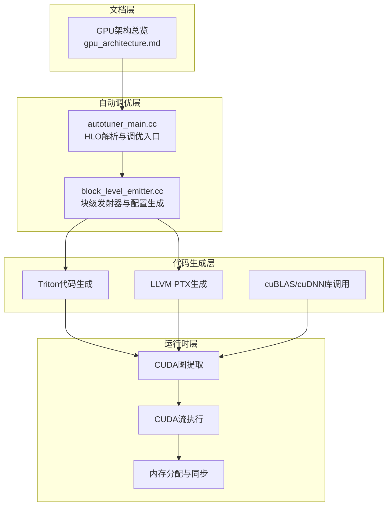
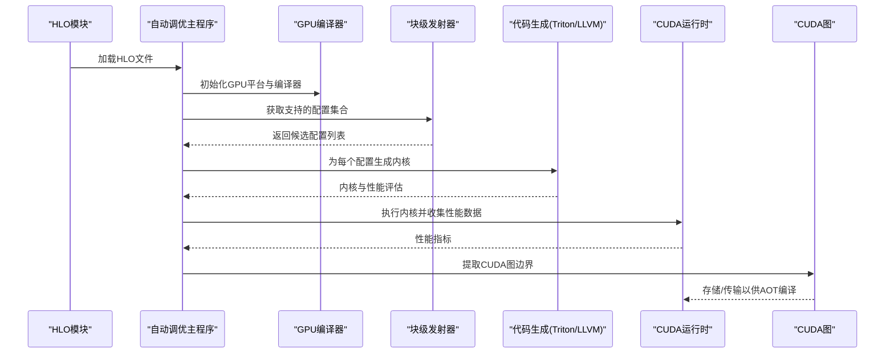
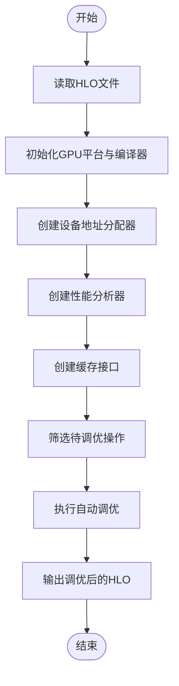
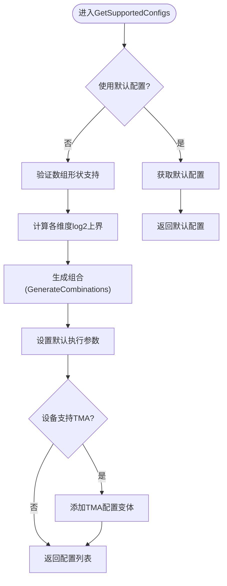
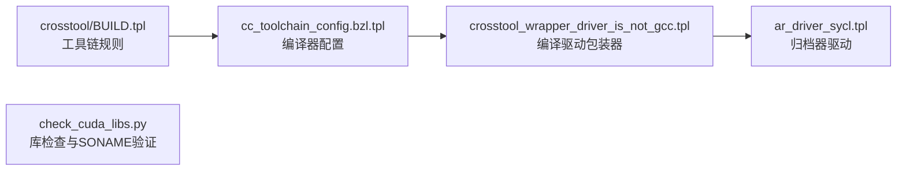
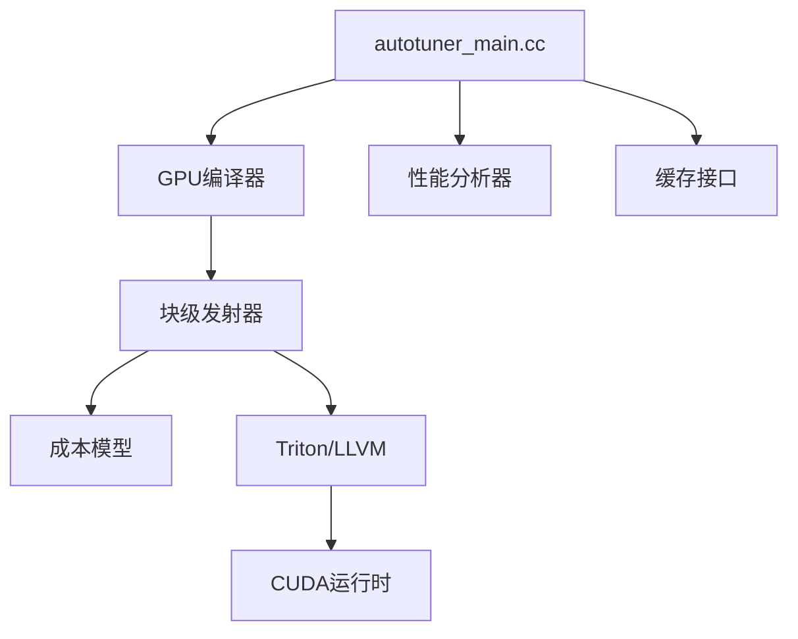

# CUDA后端

<cite>
**本文引用的文件**
- [gpu架构总览.md](file://docs/gpu_architecture.md)
- [autotuner_main.cc](file://xla/backends/gpu/autotuner/autotuner_main.cc)
- [block_level_emitter.cc](file://xla/backends/gpu/autotuner/block_level_emitter.cc)
- [check_cuda_libs.py](file://third_party/gpus/check_cuda_libs.py)
- [gpu配置构建脚本](file://third_party/gpus/crosstool/BUILD.tpl)
- [CUDA配置模板](file://third_party/gpus/crosstool/cc_toolchain_config.bzl.tpl)
- [CUDA工具链配置](file://third_party/gpus/crosstool/clang/bin/crosstool_wrapper_driver_is_not_gcc.tpl)
- [CUDA运行时配置](file://third_party/gpus/crosstool/clang/bin/ar_driver_sycl.tpl)
- [CUDA编译器断言](file://build_tools/configure/assert_cuda_clang.cu.cc)
- [CUDA库检查脚本](file://third_party/gpus/check_cuda_libs.py)
- [CUDA多GPU运行脚本](file://build_tools/rocm/run_xla_multi_gpu.sh)
- [CUDA并行执行脚本](file://build_tools/ci/parallel_gpu_execute.sh)
- [CUDA架构文档](file://docs/gpu_architecture.md)
- [CUDA后端配置](file://third_party/gpus/crosstool/BUILD.tpl)
- [CUDA工具链模板](file://third_party/gpus/crosstool/cc_toolchain_config.bzl.tpl)
- [CUDA工具链包装器](file://third_party/gpus/crosstool/clang/bin/crosstool_wrapper_driver_is_not_gcc.tpl)
- [CUDA运行时驱动](file://third_party/gpus/crosstool/clang/bin/ar_driver_sycl.tpl)
- [CUDA编译器断言源码](file://build_tools/configure/assert_cuda_clang.cu.cc)
- [CUDA库检查实现](file://third_party/gpus/check_cuda_libs.py)
- [CUDA多GPU运行脚本](file://build_tools/rocm/run_xla_multi_gpu.sh)
- [CUDA并行执行脚本](file://build_tools/ci/parallel_gpu_execute.sh)
</cite>

## 目录
1. [简介](#简介)
2. [项目结构](#项目结构)
3. [核心组件](#核心组件)
4. [架构概览](#架构概览)
5. [详细组件分析](#详细组件分析)
6. [依赖关系分析](#依赖关系分析)
7. [性能考虑](#性能考虑)
8. [故障排除指南](#故障排除指南)
9. [结论](#结论)
10. [附录](#附录)

## 简介
本文件面向XLA CUDA后端的开发者与使用者，系统性阐述CUDA编译器集成、NVIDIA GPU内核生成与优化策略、CUDA流执行与内存管理、同步机制、自动调优功能、内核参数搜索算法以及性能分析工具。同时覆盖CUDA多GPU并行、NCCL通信支持与NVSHMEM集成的配置要点，并提供配置选项、调试技巧与性能优化最佳实践。

## 项目结构
XLA的CUDA后端由以下关键层次构成：
- 文档层：提供GPU架构总览与流水线说明
- 自动调优层：包含HLO模块解析、GPU平台初始化、自动调优执行器与缓存接口
- 代码生成层：基于Triton与LLVM的内核生成，结合库选择（cuBLAS、cuDNN）
- 运行时层：CUDA图提取、流执行、内存分配与同步

**图表来源**
- [gpu架构总览.md](file://docs/gpu_architecture.md#L1-L254)
- [autotuner_main.cc](file://xla/backends/gpu/autotuner/autotuner_main.cc#L1-L194)
- [block_level_emitter.cc](file://xla/backends/gpu/autotuner/block_level_emitter.cc#L1-L417)

**章节来源**
- [gpu架构总览.md](file://docs/gpu_architecture.md#L1-L254)
- [autotuner_main.cc](file://xla/backends/gpu/autotuner/autotuner_main.cc#L1-L194)
- [block_level_emitter.cc](file://xla/backends/gpu/autotuner/block_level_emitter.cc#L1-L417)

## 核心组件
- 自动调优主程序：负责加载HLO模块、初始化GPU平台、创建编译器与性能分析器、建立缓存、执行自动调优并输出结果
- 块级发射器：为融合操作生成候选配置（如tile大小、warp数量、stage数等），并可扩展TMA（Tensor Memory Access）支持
- GPU性能模型：基于索引分析的成本模型，用于指导tile参数搜索
- 编译器与代码生成：根据HLO指令选择库调用或直接生成PTX/Triton内核
- 运行时执行：CUDA图提取、流调度、内存分配与同步

**章节来源**
- [autotuner_main.cc](file://xla/backends/gpu/autotuner/autotuner_main.cc#L78-L169)
- [block_level_emitter.cc](file://xla/backends/gpu/autotuner/block_level_emitter.cc#L217-L308)

## 架构概览
下图展示从HLO到CUDA内核执行的整体流程，包括自动调优、代码生成与运行时执行阶段：

**图表来源**
- [autotuner_main.cc](file://xla/backends/gpu/autotuner/autotuner_main.cc#L86-L169)
- [block_level_emitter.cc](file://xla/backends/gpu/autotuner/block_level_emitter.cc#L217-L308)
- [gpu架构总览.md](file://docs/gpu_architecture.md#L217-L254)

## 详细组件分析

### 自动调优主程序（autotuner_main.cc）
- 功能职责
  - 解析HLO文件并加载模块
  - 获取GPU平台与编译器实例
  - 创建设备地址分配器与线程池
  - 初始化性能分析器与缓存接口
  - 遍历HLO指令，筛选需要自动调优的融合与库调用
  - 执行自动调优并输出结果
- 关键流程
  - 平台发现与编译器获取
  - 后端注册与目标配置
  - 性能分析器创建与缓存初始化
  - 指令过滤逻辑（区分cublas/cudnn与融合类型）
  - 调优执行与结果打印

**图表来源**
- [autotuner_main.cc](file://xla/backends/gpu/autotuner/autotuner_main.cc#L78-L169)

**章节来源**
- [autotuner_main.cc](file://xla/backends/gpu/autotuner/autotuner_main.cc#L78-L169)

### 块级发射器（block_level_emitter.cc）
- 功能职责
  - 为融合指令生成候选配置空间（tile大小、warp数量、stage数、是否允许TMA）
  - 基于成本模型（索引性能模型）推导默认配置
  - 将配置应用到HLO指令的后端配置中
  - 支持零维尺寸与对数空间搜索
- 关键算法
  - 组合生成：按维度对tile大小进行对数空间遍历
  - 零维处理：特殊标记与保留策略
  - TMA扩展：在支持的设备上为配置集添加TMA变体
  - 成本模型：通过索引分析寻找最优tiling

**图表来源**
- [block_level_emitter.cc](file://xla/backends/gpu/autotuner/block_level_emitter.cc#L217-L308)

**章节来源**
- [block_level_emitter.cc](file://xla/backends/gpu/autotuner/block_level_emitter.cc#L217-L308)

### CUDA编译器集成与工具链
- 工具链配置
  - crosstool构建模板定义CUDA工具链规则
  - 工具链配置模板提供编译器与链接器参数
  - 包装器脚本处理编译驱动与交叉编译
- 库检查与验证
  - 库存在性与SONAME一致性检查
  - 适用于不同平台的库路径验证

**图表来源**
- [gpu配置构建脚本](file://third_party/gpus/crosstool/BUILD.tpl)
- [CUDA配置模板](file://third_party/gpus/crosstool/cc_toolchain_config.bzl.tpl)
- [CUDA工具链配置](file://third_party/gpus/crosstool/clang/bin/crosstool_wrapper_driver_is_not_gcc.tpl)
- [CUDA运行时配置](file://third_party/gpus/crosstool/clang/bin/ar_driver_sycl.tpl)
- [CUDA库检查脚本](file://third_party/gpus/check_cuda_libs.py#L43-L64)

**章节来源**
- [gpu配置构建脚本](file://third_party/gpus/crosstool/BUILD.tpl)
- [CUDA配置模板](file://third_party/gpus/crosstool/cc_toolchain_config.bzl.tpl)
- [CUDA工具链配置](file://third_party/gpus/crosstool/clang/bin/crosstool_wrapper_driver_is_not_gcc.tpl)
- [CUDA运行时配置](file://third_party/gpus/crosstool/clang/bin/ar_driver_sycl.tpl)
- [CUDA库检查脚本](file://third_party/gpus/check_cuda_libs.py#L43-L64)

### CUDA流执行、内存分配与同步
- 流执行
  - 通过CUDA流队列内核启动与依赖管理
  - 支持多流并发与同步点设置
- 内存分配
  - 设备地址分配器封装底层CUDA内存管理
  - 支持主机-设备间传输与零拷贝优化
- 同步机制
  - 事件与流同步确保正确性与时序控制
  - CUDA图中的同步边界优化

**章节来源**
- [autotuner_main.cc](file://xla/backends/gpu/autotuner/autotuner_main.cc#L113-L123)

### 自动调优与内核参数搜索
- 搜索空间设计
  - 对数尺度tile大小探索
  - 多维度组合生成与零维特殊处理
- 成本模型
  - 基于索引分析的性能预测
  - 为默认配置提供启发式建议
- 缓存与并行
  - 文件缓存接口存储历史结果
  - 线程池并行评估多个配置

**章节来源**
- [block_level_emitter.cc](file://xla/backends/gpu/autotuner/block_level_emitter.cc#L128-L151)
- [block_level_emitter.cc](file://xla/backends/gpu/autotuner/block_level_emitter.cc#L310-L337)

### 多GPU并行、NCCL通信与NVSHMEM集成
- 多GPU并行
  - 通过JAX pjit等框架进行SPMD分区与并行调度
  - 利用XLA布局分配与融合优化减少带宽压力
- NCCL通信
  - 在多设备场景下进行聚合通信与同步
  - 与XLA SPMD分区器协同优化通信-计算重叠
- NVSHMEM
  - 分布式共享内存抽象，简化跨节点通信
  - 与NCCL配合实现高性能多节点训练

**章节来源**
- [gpu架构总览.md](file://docs/gpu_architecture.md#L77-L129)

## 依赖关系分析
- 组件耦合
  - 自动调优主程序依赖编译器、性能分析器与缓存接口
  - 块级发射器依赖设备信息与成本模型
  - 代码生成层依赖Triton与LLVM后端
- 外部依赖
  - CUDA工具链与运行时库
  - cuBLAS/cuDNN/cuSOLVER等NVIDIA库
  - NCCL与NVSHMEM分布式通信栈

**图表来源**
- [autotuner_main.cc](file://xla/backends/gpu/autotuner/autotuner_main.cc#L108-L136)
- [block_level_emitter.cc](file://xla/backends/gpu/autotuner/block_level_emitter.cc#L317-L337)

**章节来源**
- [autotuner_main.cc](file://xla/backends/gpu/autotuner/autotuner_main.cc#L108-L136)
- [block_level_emitter.cc](file://xla/backends/gpu/autotuner/block_level_emitter.cc#L317-L337)

## 性能考虑
- 融合优先：最大化融合以减少HBM往返，提升内存吞吐
- tile参数：对关键算子进行对数尺度搜索，结合成本模型指导
- TMA利用：在Hopper及以上架构启用TMA以降低访存开销
- 图提取：对稳定子图进行CUDA图提取，减少启动开销
- 通信优化：在多GPU场景下重叠通信与计算，使用NCCL优化拓扑

[本节为通用性能建议，无需特定文件引用]

## 故障排除指南
- 库缺失或版本不匹配
  - 使用库检查脚本验证CUDA相关库的存在与SONAME一致性
  - 参考工具链配置确保编译器与运行时版本兼容
- 自动调优失败
  - 检查HLO指令是否被正确识别为可调优对象
  - 确认缓存目录权限与磁盘空间
- 多GPU通信异常
  - 核对NCCL环境变量与拓扑配置
  - 使用多GPU运行脚本进行最小化复现

**章节来源**
- [CUDA库检查脚本](file://third_party/gpus/check_cuda_libs.py#L66-L82)
- [CUDA多GPU运行脚本](file://build_tools/rocm/run_xla_multi_gpu.sh)
- [CUDA并行执行脚本](file://build_tools/ci/parallel_gpu_execute.sh)

## 结论
XLA CUDA后端通过自动调优、成本模型与Triton/LLVM代码生成实现了高性能GPU内核生成；借助CUDA图与流执行进一步降低启动开销并优化内存访问。结合NCCL与NVSHMEM，可在多GPU与多节点场景下实现高效并行。建议在实际部署中结合硬件特性与工作负载，系统性地进行tile搜索、TMA启用与通信拓扑优化。

[本节为总结性内容，无需特定文件引用]

## 附录

### 配置选项与调试技巧
- 调试标志
  - 使用XLA调试选项控制自动调优级别与缓存行为
  - 启用详细日志以追踪HLO优化与代码生成过程
- 编译器配置
  - 通过工具链模板调整编译器参数与优化等级
  - 在不同GPU架构上选择合适的PTX/SM目标
- 性能分析
  - 使用内置性能分析器收集内核时间分布
  - 对比不同tile配置与TMA启用前后的性能差异

**章节来源**
- [autotuner_main.cc](file://xla/backends/gpu/autotuner/autotuner_main.cc#L120-L127)
- [block_level_emitter.cc](file://xla/backends/gpu/autotuner/block_level_emitter.cc#L310-L337)