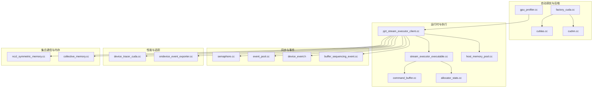
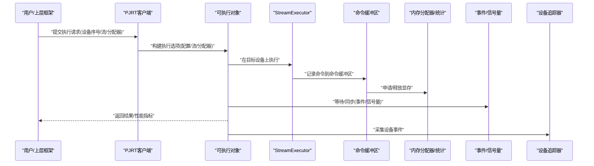
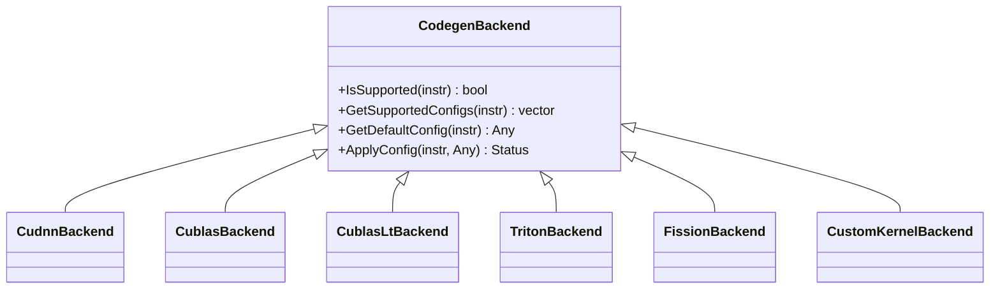
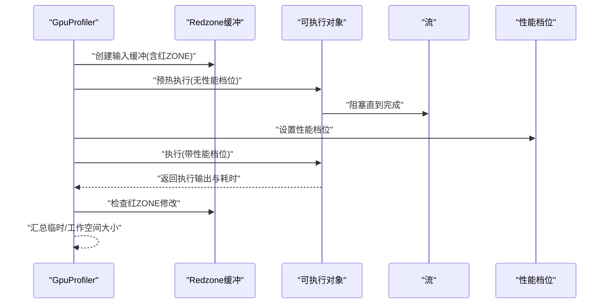
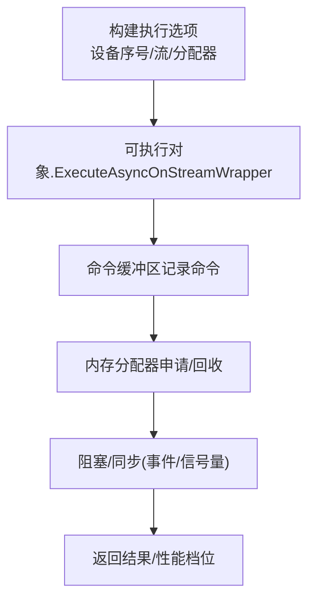
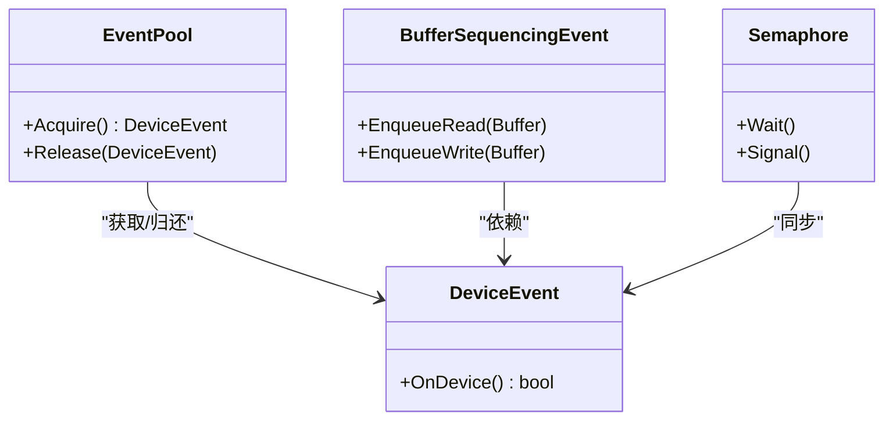
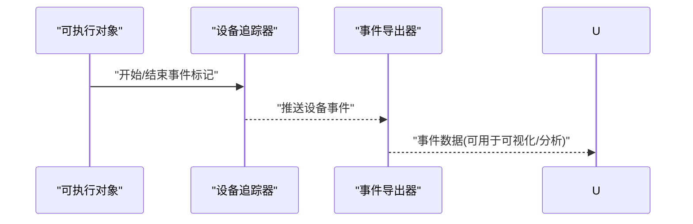
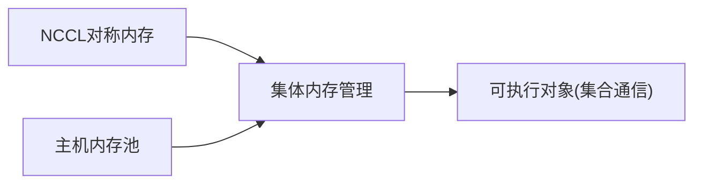
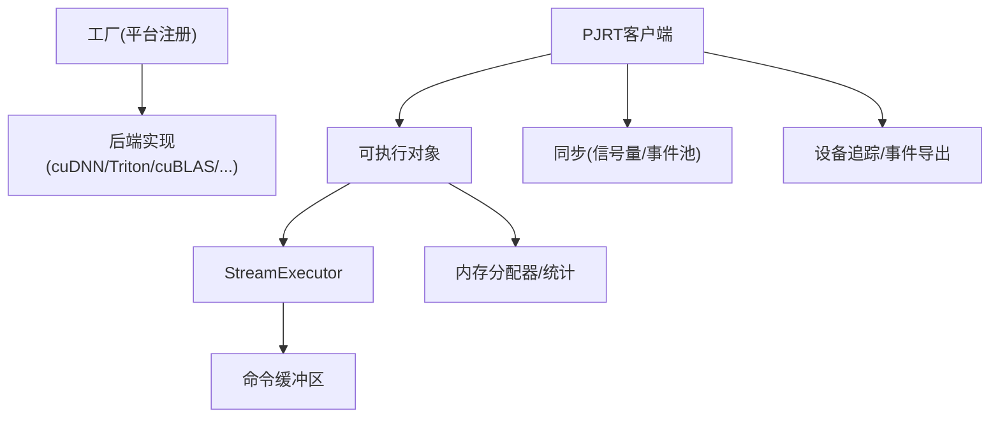

# GPU运行时

<cite>
**本文引用的文件**
- [xla/backends/gpu/autotuner/gpu_profiler.cc](file://xla/backends/gpu/autotuner/gpu_profiler.cc)
- [xla/backends/gpu/autotuner/factory_cuda.cc](file://xla/backends/gpu/autotuner/factory_cuda.cc)
- [xla/backends/gpu/autotuner/cublas.cc](file://xla/backends/gpu/autotuner/cublas.cc)
- [xla/backends/gpu/autotuner/cudnn.cc](file://xla/backends/gpu/autotuner/cudnn.cc)
- [xla/pjrt/pjrt_stream_executor_client.cc](file://xla/pjrt/pjrt_stream_executor_client.cc)
- [xla/pjrt/stream_executor_executable.cc](file://xla/pjrt/stream_executor_executable.cc)
- [xla/stream_executor/command_buffer.cc](file://xla/stream_executor/command_buffer.cc)
- [xla/stream_executor/allocator_stats.cc](file://xla/stream_executor/allocator_stats.cc)
- [xla/backends/profiler/gpu/device_tracer_cuda.cc](file://xla/backends/profiler/gpu/device_tracer_cuda.cc)
- [xla/backends/profiler/gpu/ondevice_event_exporter.cc](file://xla/backends/profiler/gpu/ondevice_event_exporter.cc)
- [xla/backends/gpu/runtime/collective_memory.cc](file://xla/backends/gpu/runtime/collective_memory.cc)
- [xla/backends/gpu/runtime/host_memory_pool.cc](file://xla/backends/gpu/runtime/host_memory_pool.cc)
- [xla/pjrt/errors.cc](file://xla/pjrt/errors.cc)
- [xla/pjrt/errors.h](file://xla/pjrt/errors.h)
- [xla/pjrt/exceptions.h](file://xla/pjrt/exceptions.h)
- [xla/pjrt/semaphore.cc](file://xla/pjrt/semaphore.cc)
- [xla/pjrt/semaphore.h](file://xla/pjrt/semaphore.h)
- [xla/pjrt/event_pool.cc](file://xla/pjrt/event_pool.cc)
- [xla/pjrt/event_pool.h](file://xla/pjrt/event_pool.h)
- [xla/pjrt/device_event.h](file://xla/pjrt/device_event.h)
- [xla/pjrt/buffer_sequencing_event.cc](file://xla/pjrt/buffer_sequencing_event.cc)
- [xla/pjrt/buffer_sequencing_event.h](file://xla/pjrt/buffer_sequencing_event.h)
- [xla/pjrt/common_pjrt_client.cc](file://xla/pjrt/common_pjrt_client.cc)
- [xla/pjrt/common_pjrt_client.h](file://xla/pjrt/common_pjrt_client.h)
- [xla/service/gpu/stream_executor_util.cc](file://xla/service/gpu/stream_executor_util.cc)
- [xla/backends/gpu/collectives/nccl_symmetric_memory.cc](file://xla/backends/gpu/collectives/nccl_symmetric_memory.cc)
</cite>

## 目录
1. [简介](#简介)
2. [项目结构](#项目结构)
3. [核心组件](#核心组件)
4. [架构总览](#架构总览)
5. [组件详解](#组件详解)
6. [依赖关系分析](#依赖关系分析)
7. [性能考量](#性能考量)
8. [故障排除指南](#故障排除指南)
9. [结论](#结论)
10. [附录](#附录)

## 简介
本文件面向XLA GPU运行时系统，聚焦以下主题：GPU设备管理与生命周期、内存分配与回收、GPU流执行器与命令缓冲区管理、同步原语、事件跟踪与性能计数器、资源监控、设备拓扑与NUMA感知、内存带宽优化、错误处理与异常恢复、调试工具、API使用示例、性能调优建议与故障排除。

## 项目结构
围绕GPU运行时的关键代码分布在如下模块：
- 自动调优与后端选择：CUDA/ROCm平台的自动调优工厂、cuBLAS/cuDNN/Triton等后端实现
- 运行时执行与内存：PJRT客户端、可执行对象、命令缓冲区、内存池与统计
- 同步与事件：信号量、事件池、设备事件、缓冲区序列化事件
- 性能与追踪：设备侧CUDA追踪器、设备事件导出器
- 集体通信与内存：NCCL对称内存、主机内存池

**图表来源**
- [xla/backends/gpu/autotuner/factory_cuda.cc](file://xla/backends/gpu/autotuner/factory_cuda.cc#L84-L136)
- [xla/backends/gpu/autotuner/cublas.cc](file://xla/backends/gpu/autotuner/cublas.cc#L45-L131)
- [xla/backends/gpu/autotuner/cudnn.cc](file://xla/backends/gpu/autotuner/cudnn.cc#L345-L416)
- [xla/backends/gpu/autotuner/gpu_profiler.cc](file://xla/backends/gpu/autotuner/gpu_profiler.cc#L91-L115)
- [xla/pjrt/pjrt_stream_executor_client.cc](file://xla/pjrt/pjrt_stream_executor_client.cc)
- [xla/pjrt/stream_executor_executable.cc](file://xla/pjrt/stream_executor_executable.cc)
- [xla/stream_executor/command_buffer.cc](file://xla/stream_executor/command_buffer.cc)
- [xla/stream_executor/allocator_stats.cc](file://xla/stream_executor/allocator_stats.cc)
- [xla/backends/profiler/gpu/device_tracer_cuda.cc](file://xla/backends/profiler/gpu/device_tracer_cuda.cc)
- [xla/backends/profiler/gpu/ondevice_event_exporter.cc](file://xla/backends/profiler/gpu/ondevice_event_exporter.cc)
- [xla/backends/gpu/collectives/nccl_symmetric_memory.cc](file://xla/backends/gpu/collectives/nccl_symmetric_memory.cc)
- [xla/backends/gpu/runtime/collective_memory.cc](file://xla/backends/gpu/runtime/collective_memory.cc)
- [xla/backends/gpu/runtime/host_memory_pool.cc](file://xla/backends/gpu/runtime/host_memory_pool.cc)
- [xla/pjrt/semaphore.cc](file://xla/pjrt/semaphore.cc)
- [xla/pjrt/event_pool.cc](file://xla/pjrt/event_pool.cc)
- [xla/pjrt/device_event.h](file://xla/pjrt/device_event.h)
- [xla/pjrt/buffer_sequencing_event.cc](file://xla/pjrt/buffer_sequencing_event.cc)

**章节来源**
- [xla/backends/gpu/autotuner/factory_cuda.cc](file://xla/backends/gpu/autotuner/factory_cuda.cc#L84-L136)
- [xla/backends/gpu/autotuner/cublas.cc](file://xla/backends/gpu/autotuner/cublas.cc#L45-L131)
- [xla/backends/gpu/autotuner/cudnn.cc](file://xla/backends/gpu/autotuner/cudnn.cc#L345-L416)
- [xla/backends/gpu/autotuner/gpu_profiler.cc](file://xla/backends/gpu/autotuner/gpu_profiler.cc#L91-L115)
- [xla/pjrt/pjrt_stream_executor_client.cc](file://xla/pjrt/pjrt_stream_executor_client.cc)
- [xla/pjrt/stream_executor_executable.cc](file://xla/pjrt/stream_executor_executable.cc)
- [xla/stream_executor/command_buffer.cc](file://xla/stream_executor/command_buffer.cc)
- [xla/stream_executor/allocator_stats.cc](file://xla/stream_executor/allocator_stats.cc)
- [xla/backends/profiler/gpu/device_tracer_cuda.cc](file://xla/backends/profiler/gpu/device_tracer_cuda.cc)
- [xla/backends/profiler/gpu/ondevice_event_exporter.cc](file://xla/backends/profiler/gpu/ondevice_event_exporter.cc)
- [xla/backends/gpu/collectives/nccl_symmetric_memory.cc](file://xla/backends/gpu/collectives/nccl_symmetric_memory.cc)
- [xla/backends/gpu/runtime/collective_memory.cc](file://xla/backends/gpu/runtime/collective_memory.cc)
- [xla/backends/gpu/runtime/host_memory_pool.cc](file://xla/backends/gpu/runtime/host_memory_pool.cc)
- [xla/pjrt/semaphore.cc](file://xla/pjrt/semaphore.cc)
- [xla/pjrt/event_pool.cc](file://xla/pjrt/event_pool.cc)
- [xla/pjrt/device_event.h](file://xla/pjrt/device_event.h)
- [xla/pjrt/buffer_sequencing_event.cc](file://xla/pjrt/buffer_sequencing_event.cc)

## 核心组件
- 自动调优后端工厂：按平台注册多种代码生成后端（cuDNN、Triton、cuBLAS、cuBLASLt、Fission+后端），支持融合重写与算子重写管线。
- GPU配置与执行：通过GpuProfiler封装输入缓冲、预热、执行、输出校验与性能采样；结合Redzone保护与参考输出比较。
- PJRT执行路径：从PJRT客户端到可执行对象，再到StreamExecutor执行器与命令缓冲区，贯穿内存分配与同步。
- 同步与事件：信号量、事件池、设备事件、缓冲区序列化事件，支撑跨流与跨设备的有序执行。
- 性能与追踪：设备侧CUDA追踪器与事件导出器，用于采集设备时间线与事件数据。
- 集合通信与内存：NCCL对称内存与集体内存管理，配合主机内存池进行大张量传输与共享。

**章节来源**
- [xla/backends/gpu/autotuner/factory_cuda.cc](file://xla/backends/gpu/autotuner/factory_cuda.cc#L84-L136)
- [xla/backends/gpu/autotuner/gpu_profiler.cc](file://xla/backends/gpu/autotuner/gpu_profiler.cc#L117-L171)
- [xla/pjrt/pjrt_stream_executor_client.cc](file://xla/pjrt/pjrt_stream_executor_client.cc)
- [xla/pjrt/stream_executor_executable.cc](file://xla/pjrt/stream_executor_executable.cc)
- [xla/stream_executor/command_buffer.cc](file://xla/stream_executor/command_buffer.cc)
- [xla/pjrt/semaphore.cc](file://xla/pjrt/semaphore.cc)
- [xla/pjrt/event_pool.cc](file://xla/pjrt/event_pool.cc)
- [xla/backends/profiler/gpu/device_tracer_cuda.cc](file://xla/backends/profiler/gpu/device_tracer_cuda.cc)
- [xla/backends/profiler/gpu/ondevice_event_exporter.cc](file://xla/backends/profiler/gpu/ondevice_event_exporter.cc)
- [xla/backends/gpu/collectives/nccl_symmetric_memory.cc](file://xla/backends/gpu/collectives/nccl_symmetric_memory.cc)
- [xla/backends/gpu/runtime/collective_memory.cc](file://xla/backends/gpu/runtime/collective_memory.cc)
- [xla/backends/gpu/runtime/host_memory_pool.cc](file://xla/backends/gpu/runtime/host_memory_pool.cc)

## 架构总览
下图展示从用户侧到设备侧的执行链路：PJRT客户端负责设备描述、编译与执行选项；可执行对象在指定流上执行；命令缓冲区承载内核调度；内存分配器与统计模块保障显存生命周期；同步原语确保顺序；设备追踪器与事件导出器提供性能观测。

**图表来源**
- [xla/pjrt/pjrt_stream_executor_client.cc](file://xla/pjrt/pjrt_stream_executor_client.cc)
- [xla/pjrt/stream_executor_executable.cc](file://xla/pjrt/stream_executor_executable.cc)
- [xla/stream_executor/command_buffer.cc](file://xla/stream_executor/command_buffer.cc)
- [xla/stream_executor/allocator_stats.cc](file://xla/stream_executor/allocator_stats.cc)
- [xla/backends/profiler/gpu/device_tracer_cuda.cc](file://xla/backends/profiler/gpu/device_tracer_cuda.cc)
- [xla/backends/profiler/gpu/ondevice_event_exporter.cc](file://xla/backends/profiler/gpu/ondevice_event_exporter.cc)

## 组件详解

### 自动调优后端工厂与后端实现
- 工厂函数按平台注册后端列表，包括cuDNN、Triton、cuBLAS、cuBLASLt、Fission+组合后端，并支持根据允许白名单裁剪。
- 各后端提供“是否支持”“默认配置”“可用配置枚举”“应用配置”等接口，统一通过Any包装的后端配置传递。

**图表来源**
- [xla/backends/gpu/autotuner/factory_cuda.cc](file://xla/backends/gpu/autotuner/factory_cuda.cc#L84-L136)
- [xla/backends/gpu/autotuner/cudnn.cc](file://xla/backends/gpu/autotuner/cudnn.cc#L345-L416)
- [xla/backends/gpu/autotuner/cublas.cc](file://xla/backends/gpu/autotuner/cublas.cc#L45-L131)

**章节来源**
- [xla/backends/gpu/autotuner/factory_cuda.cc](file://xla/backends/gpu/autotuner/factory_cuda.cc#L84-L136)
- [xla/backends/gpu/autotuner/cudnn.cc](file://xla/backends/gpu/autotuner/cudnn.cc#L345-L416)
- [xla/backends/gpu/autotuner/cublas.cc](file://xla/backends/gpu/autotuner/cublas.cc#L45-L131)

### GPU配置与执行流程（GpuProfiler）
- 输入缓冲：基于程序形状构造输入缓冲，启用红_ZONE保护与可选初始化。
- 预热与执行：先执行一次预热，再在性能档位下执行，收集计算耗时。
- 输出校验：对输出缓冲与参考缓冲逐叶形状比较，支持容差比较。
- 资源统计：汇总临时/工作空间大小，辅助内存规划。

**图表来源**
- [xla/backends/gpu/autotuner/gpu_profiler.cc](file://xla/backends/gpu/autotuner/gpu_profiler.cc#L117-L171)
- [xla/backends/gpu/autotuner/gpu_profiler.cc](file://xla/backends/gpu/autotuner/gpu_profiler.cc#L173-L189)
- [xla/backends/gpu/autotuner/gpu_profiler.cc](file://xla/backends/gpu/autotuner/gpu_profiler.cc#L191-L205)
- [xla/backends/gpu/autotuner/gpu_profiler.cc](file://xla/backends/gpu/autotuner/gpu_profiler.cc#L207-L226)

**章节来源**
- [xla/backends/gpu/autotuner/gpu_profiler.cc](file://xla/backends/gpu/autotuner/gpu_profiler.cc#L117-L171)
- [xla/backends/gpu/autotuner/gpu_profiler.cc](file://xla/backends/gpu/autotuner/gpu_profiler.cc#L173-L189)
- [xla/backends/gpu/autotuner/gpu_profiler.cc](file://xla/backends/gpu/autotuner/gpu_profiler.cc#L191-L205)
- [xla/backends/gpu/autotuner/gpu_profiler.cc](file://xla/backends/gpu/autotuner/gpu_profiler.cc#L207-L226)

### PJRT执行路径与命令缓冲区
- PJRT客户端负责解析设备描述、编译选项与运行选项，选择目标设备与流。
- 可执行对象在指定流上异步执行，利用命令缓冲区记录内核启动与内存操作。
- 内存分配器与统计模块贯穿生命周期，提供分配/回收与统计信息。

**图表来源**
- [xla/pjrt/pjrt_stream_executor_client.cc](file://xla/pjrt/pjrt_stream_executor_client.cc)
- [xla/pjrt/stream_executor_executable.cc](file://xla/pjrt/stream_executor_executable.cc)
- [xla/stream_executor/command_buffer.cc](file://xla/stream_executor/command_buffer.cc)
- [xla/stream_executor/allocator_stats.cc](file://xla/stream_executor/allocator_stats.cc)

**章节来源**
- [xla/pjrt/pjrt_stream_executor_client.cc](file://xla/pjrt/pjrt_stream_executor_client.cc)
- [xla/pjrt/stream_executor_executable.cc](file://xla/pjrt/stream_executor_executable.cc)
- [xla/stream_executor/command_buffer.cc](file://xla/stream_executor/command_buffer.cc)
- [xla/stream_executor/allocator_stats.cc](file://xla/stream_executor/allocator_stats.cc)

### 同步原语与事件模型
- 信号量：用于跨流或跨设备的并发控制与屏障。
- 事件池：复用事件对象，降低频繁创建销毁开销。
- 设备事件：抽象设备侧事件，便于统一管理。
- 缓冲区序列化事件：保证缓冲区读写顺序，避免竞态。

**图表来源**
- [xla/pjrt/semaphore.cc](file://xla/pjrt/semaphore.cc)
- [xla/pjrt/semaphore.h](file://xla/pjrt/semaphore.h)
- [xla/pjrt/event_pool.cc](file://xla/pjrt/event_pool.cc)
- [xla/pjrt/event_pool.h](file://xla/pjrt/event_pool.h)
- [xla/pjrt/device_event.h](file://xla/pjrt/device_event.h)
- [xla/pjrt/buffer_sequencing_event.cc](file://xla/pjrt/buffer_sequencing_event.cc)
- [xla/pjrt/buffer_sequencing_event.h](file://xla/pjrt/buffer_sequencing_event.h)

**章节来源**
- [xla/pjrt/semaphore.cc](file://xla/pjrt/semaphore.cc)
- [xla/pjrt/semaphore.h](file://xla/pjrt/semaphore.h)
- [xla/pjrt/event_pool.cc](file://xla/pjrt/event_pool.cc)
- [xla/pjrt/event_pool.h](file://xla/pjrt/event_pool.h)
- [xla/pjrt/device_event.h](file://xla/pjrt/device_event.h)
- [xla/pjrt/buffer_sequencing_event.cc](file://xla/pjrt/buffer_sequencing_event.cc)
- [xla/pjrt/buffer_sequencing_event.h](file://xla/pjrt/buffer_sequencing_event.h)

### 性能计数器与事件追踪
- 设备侧CUDA追踪器：采集设备时间线与内核事件，支持细粒度性能观测。
- 设备事件导出器：将设备事件导出到上层分析工具，形成统一事件视图。

**图表来源**
- [xla/backends/profiler/gpu/device_tracer_cuda.cc](file://xla/backends/profiler/gpu/device_tracer_cuda.cc)
- [xla/backends/profiler/gpu/ondevice_event_exporter.cc](file://xla/backends/profiler/gpu/ondevice_event_exporter.cc)

**章节来源**
- [xla/backends/profiler/gpu/device_tracer_cuda.cc](file://xla/backends/profiler/gpu/device_tracer_cuda.cc)
- [xla/backends/profiler/gpu/ondevice_event_exporter.cc](file://xla/backends/profiler/gpu/ondevice_event_exporter.cc)

### 集体通信与内存管理
- NCCL对称内存：在多设备场景下提供对称可见的内存视图，简化跨设备访问。
- 集体内存：管理集合通信所需的缓冲与元数据，协调多设备一致性。
- 主机内存池：为大张量或频繁分配场景提供高效内存池化策略。

**图表来源**
- [xla/backends/gpu/collectives/nccl_symmetric_memory.cc](file://xla/backends/gpu/collectives/nccl_symmetric_memory.cc)
- [xla/backends/gpu/runtime/collective_memory.cc](file://xla/backends/gpu/runtime/collective_memory.cc)
- [xla/backends/gpu/runtime/host_memory_pool.cc](file://xla/backends/gpu/runtime/host_memory_pool.cc)

**章节来源**
- [xla/backends/gpu/collectives/nccl_symmetric_memory.cc](file://xla/backends/gpu/collectives/nccl_symmetric_memory.cc)
- [xla/backends/gpu/runtime/collective_memory.cc](file://xla/backends/gpu/runtime/collective_memory.cc)
- [xla/backends/gpu/runtime/host_memory_pool.cc](file://xla/backends/gpu/runtime/host_memory_pool.cc)

## 依赖关系分析
- 平台与后端：工厂函数依赖平台对象注册，后端实现依赖StreamExecutor能力（BLAS/DNN）。
- 执行链路：PJRT客户端依赖可执行对象与StreamExecutor；可执行对象依赖命令缓冲区与内存分配器。
- 同步与事件：事件池与信号量解耦执行与同步；缓冲区序列化事件确保数据依赖正确性。
- 性能与监控：设备追踪器与事件导出器独立于执行链路，提供观测能力。

**图表来源**
- [xla/backends/gpu/autotuner/factory_cuda.cc](file://xla/backends/gpu/autotuner/factory_cuda.cc#L138-L141)
- [xla/pjrt/pjrt_stream_executor_client.cc](file://xla/pjrt/pjrt_stream_executor_client.cc)
- [xla/pjrt/stream_executor_executable.cc](file://xla/pjrt/stream_executor_executable.cc)
- [xla/stream_executor/command_buffer.cc](file://xla/stream_executor/command_buffer.cc)
- [xla/stream_executor/allocator_stats.cc](file://xla/stream_executor/allocator_stats.cc)
- [xla/backends/profiler/gpu/device_tracer_cuda.cc](file://xla/backends/profiler/gpu/device_tracer_cuda.cc)
- [xla/backends/profiler/gpu/ondevice_event_exporter.cc](file://xla/backends/profiler/gpu/ondevice_event_exporter.cc)

**章节来源**
- [xla/backends/gpu/autotuner/factory_cuda.cc](file://xla/backends/gpu/autotuner/factory_cuda.cc#L138-L141)
- [xla/pjrt/pjrt_stream_executor_client.cc](file://xla/pjrt/pjrt_stream_executor_client.cc)
- [xla/pjrt/stream_executor_executable.cc](file://xla/pjrt/stream_executor_executable.cc)
- [xla/stream_executor/command_buffer.cc](file://xla/stream_executor/command_buffer.cc)
- [xla/stream_executor/allocator_stats.cc](file://xla/stream_executor/allocator_stats.cc)
- [xla/backends/profiler/gpu/device_tracer_cuda.cc](file://xla/backends/profiler/gpu/device_tracer_cuda.cc)
- [xla/backends/profiler/gpu/ondevice_event_exporter.cc](file://xla/backends/profiler/gpu/ondevice_event_exporter.cc)

## 性能考量
- 算法选择：优先选择适合硬件代际的算法（如cuBLASLt/F8回退、cuDNN融合计划），减少fallback路径。
- 流与命令缓冲区：合理划分流，避免过度串行；批量内核与合并内存操作以提升吞吐。
- 内存带宽优化：利用对称内存与主机内存池，减少跨设备/主机拷贝；尽量在设备侧复用缓冲。
- 红ZONE与校验：在调试阶段启用红ZONE与输出校验，尽早暴露竞态与越界问题。
- 性能档位：仅在需要时开启性能档位，避免影响稳定性；使用预热减少首帧抖动。
- NUMA感知：在多插槽/多GPU场景中，尽量让CPU本地内存与设备靠近，降低跨NUMA带宽损耗。

[本节为通用指导，无需列出具体文件来源]

## 故障排除指南
- 错误类型与处理：PJRT错误与异常定义集中于错误模块，便于统一捕获与转换。
- 常见问题定位：
  - 执行失败：检查执行选项（设备序号、流、分配器）、后端配置是否匹配硬件能力。
  - 内存不足：核查临时/工作空间大小、红ZONE保护是否触发、是否启用主机内存池。
  - 同步问题：确认事件/信号量使用是否正确，缓冲区序列化事件是否覆盖所有读写。
  - 性能异常：对比不同后端配置与算法，启用设备追踪器采集事件。
- 恢复建议：在自动调优阶段使用独占锁避免并发干扰；必要时降级到稳定算法；启用参考输出比较验证正确性。

**章节来源**
- [xla/pjrt/errors.cc](file://xla/pjrt/errors.cc)
- [xla/pjrt/errors.h](file://xla/pjrt/errors.h)
- [xla/pjrt/exceptions.h](file://xla/pjrt/exceptions.h)
- [xla/backends/gpu/autotuner/gpu_profiler.cc](file://xla/backends/gpu/autotuner/gpu_profiler.cc#L191-L205)
- [xla/backends/gpu/autotuner/gpu_profiler.cc](file://xla/backends/gpu/autotuner/gpu_profiler.cc#L207-L226)

## 结论
XLA GPU运行时通过PJRT执行路径、自动调优后端、命令缓冲区与内存分配器、同步与事件模型、以及设备侧追踪，形成了完整的端到端执行栈。结合红ZONE保护、参考输出比较与性能档位，既保证了正确性也兼顾了可观测性。在多设备/多插槽场景下，应重视对称内存、主机内存池与NUMA感知，以获得最佳带宽与延迟表现。

[本节为总结性内容，无需列出具体文件来源]

## 附录

### API使用示例（路径指引）
- 创建GPU Profiler并执行：参见路径
  - [xla/backends/gpu/autotuner/gpu_profiler.cc](file://xla/backends/gpu/autotuner/gpu_profiler.cc#L91-L115)
  - [xla/backends/gpu/autotuner/gpu_profiler.cc](file://xla/backends/gpu/autotuner/gpu_profiler.cc#L117-L171)
- 获取后端支持的配置：参见路径
  - [xla/backends/gpu/autotuner/cudnn.cc](file://xla/backends/gpu/autotuner/cudnn.cc#L382-L397)
  - [xla/backends/gpu/autotuner/cublas.cc](file://xla/backends/gpu/autotuner/cublas.cc#L45-L131)
- 注册平台后端：参见路径
  - [xla/backends/gpu/autotuner/factory_cuda.cc](file://xla/backends/gpu/autotuner/factory_cuda.cc#L138-L141)
- 设置执行选项与流：参见路径
  - [xla/pjrt/pjrt_stream_executor_client.cc](file://xla/pjrt/pjrt_stream_executor_client.cc)
  - [xla/pjrt/stream_executor_executable.cc](file://xla/pjrt/stream_executor_executable.cc)
- 使用信号量与事件池：参见路径
  - [xla/pjrt/semaphore.cc](file://xla/pjrt/semaphore.cc)
  - [xla/pjrt/event_pool.cc](file://xla/pjrt/event_pool.cc)
- 启用设备追踪：参见路径
  - [xla/backends/profiler/gpu/device_tracer_cuda.cc](file://xla/backends/profiler/gpu/device_tracer_cuda.cc)
  - [xla/backends/profiler/gpu/ondevice_event_exporter.cc](file://xla/backends/profiler/gpu/ondevice_event_exporter.cc)

### 性能调优建议（路径指引）
- 选择合适后端与算法：参见路径
  - [xla/backends/gpu/autotuner/factory_cuda.cc](file://xla/backends/gpu/autotuner/factory_cuda.cc#L84-L136)
  - [xla/backends/gpu/autotuner/cudnn.cc](file://xla/backends/gpu/autotuner/cudnn.cc#L345-L416)
  - [xla/backends/gpu/autotuner/cublas.cc](file://xla/backends/gpu/autotuner/cublas.cc#L45-L131)
- 利用命令缓冲区与流：参见路径
  - [xla/stream_executor/command_buffer.cc](file://xla/stream_executor/command_buffer.cc)
  - [xla/pjrt/pjrt_stream_executor_client.cc](file://xla/pjrt/pjrt_stream_executor_client.cc)
- 内存带宽优化：参见路径
  - [xla/backends/gpu/runtime/host_memory_pool.cc](file://xla/backends/gpu/runtime/host_memory_pool.cc)
  - [xla/backends/gpu/collectives/nccl_symmetric_memory.cc](file://xla/backends/gpu/collectives/nccl_symmetric_memory.cc)
- NUMA感知：参见路径
  - [xla/service/gpu/stream_executor_util.cc](file://xla/service/gpu/stream_executor_util.cc)