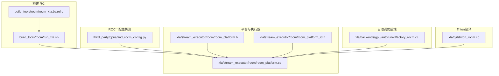
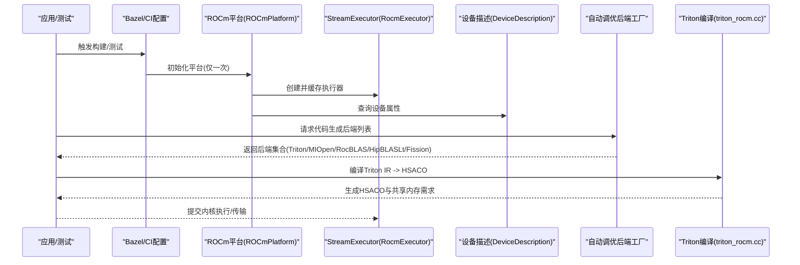
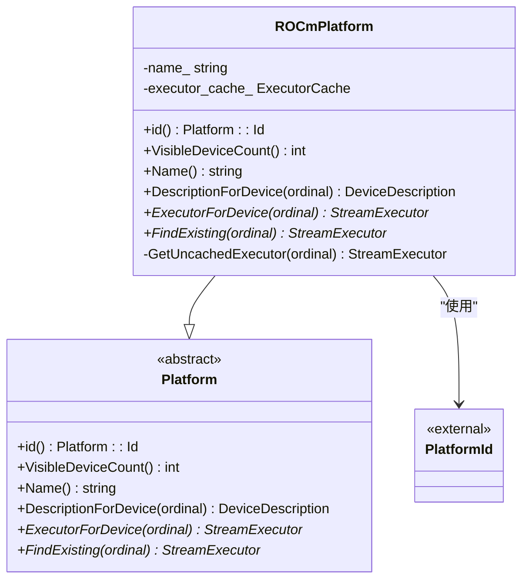
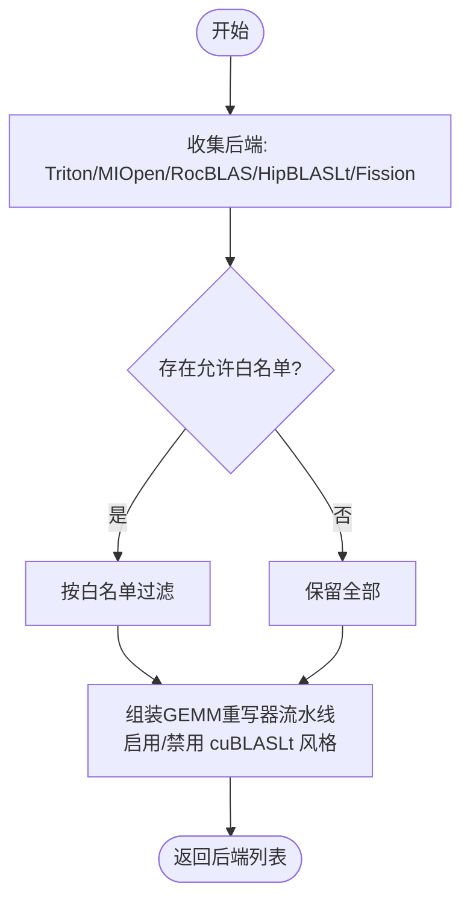
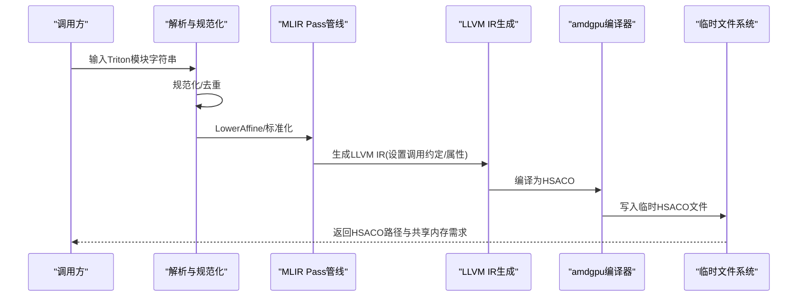
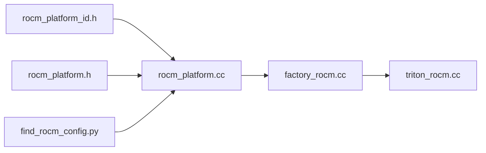

# ROCm后端

<cite>
**本文引用的文件**
- [build_tools/rocm/rocm_xla.bazelrc](file://build_tools/rocm/rocm_xla.bazelrc)
- [build_tools/rocm/run_xla.sh](file://build_tools/rocm/run_xla.sh)
- [third_party/gpus/find_rocm_config.py](file://third_party/gpus/find_rocm_config.py)
- [xla/pjrt/triton_rocm.cc](file://xla/pjrt/triton_rocm.cc)
- [xla/backends/gpu/autotuner/factory_rocm.cc](file://xla/backends/gpu/autotuner/factory_rocm.cc)
- [xla/stream_executor/rocm/rocm_platform.cc](file://xla/stream_executor/rocm/rocm_platform.cc)
- [xla/stream_executor/rocm/rocm_platform.h](file://xla/stream_executor/rocm/rocm_platform.h)
- [xla/stream_executor/rocm/rocm_platform_id.h](file://xla/stream_executor/rocm/rocm_platform_id.h)
</cite>

## 目录
1. [简介](#简介)
2. [项目结构](#项目结构)
3. [核心组件](#核心组件)
4. [架构总览](#架构总览)
5. [详细组件分析](#详细组件分析)
6. [依赖分析](#依赖分析)
7. [性能考虑](#性能考虑)
8. [故障排除指南](#故障排除指南)
9. [结论](#结论)
10. [附录](#附录)

## 简介
本文件系统化梳理XLA的ROCm后端，覆盖AMD GPU支持、HIP编译器集成、ROCm运行时环境、内核生成策略、内存管理与流执行机制、自动调优与性能优化技术、调试工具、多GPU配置与通信库支持、硬件兼容性要求、安装配置与环境变量设置，以及实践示例与基准测试建议。内容基于仓库中已实现的ROCm平台初始化、设备描述、代码生成后端（含Triton/HIP/BLAS等）与CI配置等源码进行归纳总结。

## 项目结构
围绕ROCm后端的关键目录与文件如下：
- 构建与CI配置：build_tools/rocm/*.rc、*.sh
- ROCm配置探测：third_party/gpus/find_rocm_config.py
- 平台与执行器：xla/stream_executor/rocm/*
- 自动调优后端工厂：xla/backends/gpu/autotuner/factory_rocm.cc
- Triton到HSACO编译：xla/pjrt/triton_rocm.cc

图表来源
- [build_tools/rocm/rocm_xla.bazelrc](file://build_tools/rocm/rocm_xla.bazelrc#L1-L104)
- [build_tools/rocm/run_xla.sh](file://build_tools/rocm/run_xla.sh#L1-L69)
- [third_party/gpus/find_rocm_config.py](file://third_party/gpus/find_rocm_config.py#L1-L447)
- [xla/stream_executor/rocm/rocm_platform.cc](file://xla/stream_executor/rocm/rocm_platform.cc#L1-L126)
- [xla/stream_executor/rocm/rocm_platform.h](file://xla/stream_executor/rocm/rocm_platform.h#L1-L77)
- [xla/stream_executor/rocm/rocm_platform_id.h](file://xla/stream_executor/rocm/rocm_platform_id.h#L1-L35)
- [xla/backends/gpu/autotuner/factory_rocm.cc](file://xla/backends/gpu/autotuner/factory_rocm.cc#L1-L129)
- [xla/pjrt/triton_rocm.cc](file://xla/pjrt/triton_rocm.cc#L1-L187)

章节来源
- [build_tools/rocm/rocm_xla.bazelrc](file://build_tools/rocm/rocm_xla.bazelrc#L1-L104)
- [build_tools/rocm/run_xla.sh](file://build_tools/rocm/run_xla.sh#L1-L69)
- [third_party/gpus/find_rocm_config.py](file://third_party/gpus/find_rocm_config.py#L1-L447)
- [xla/stream_executor/rocm/rocm_platform.cc](file://xla/stream_executor/rocm/rocm_platform.cc#L1-L126)
- [xla/stream_executor/rocm/rocm_platform.h](file://xla/stream_executor/rocm/rocm_platform.h#L1-L77)
- [xla/stream_executor/rocm/rocm_platform_id.h](file://xla/stream_executor/rocm/rocm_platform_id.h#L1-L35)
- [xla/backends/gpu/autotuner/factory_rocm.cc](file://xla/backends/gpu/autotuner/factory_rocm.cc#L1-L129)
- [xla/pjrt/triton_rocm.cc](file://xla/pjrt/triton_rocm.cc#L1-L187)

## 核心组件
- ROCm平台注册与初始化：负责一次性初始化HIP运行时、枚举可见设备、缓存并提供StreamExecutor实例。
- 设备描述：从ROCm驱动获取设备属性，供上层编译与执行阶段使用。
- 自动调优后端工厂：在ROCm平台上注册多种代码生成后端（Triton、MIOpen、RocBLAS、HipBLASLt、Fission），按策略选择最优路径。
- Triton到HSACO编译：将Triton IR经MLIR Pass管线转换为LLVM IR，并通过ROCm amdgpu后端编译为HSACO二进制。
- CI与构建配置：提供Bazel配置、标签过滤、并行测试与多GPU环境变量设置。

章节来源
- [xla/stream_executor/rocm/rocm_platform.cc](file://xla/stream_executor/rocm/rocm_platform.cc#L65-L126)
- [xla/stream_executor/rocm/rocm_platform.h](file://xla/stream_executor/rocm/rocm_platform.h#L34-L77)
- [xla/backends/gpu/autotuner/factory_rocm.cc](file://xla/backends/gpu/autotuner/factory_rocm.cc#L76-L129)
- [xla/pjrt/triton_rocm.cc](file://xla/pjrt/triton_rocm.cc#L66-L187)

## 架构总览
下图展示XLA ROCm后端从平台初始化到内核生成与执行的关键交互：

图表来源
- [xla/stream_executor/rocm/rocm_platform.cc](file://xla/stream_executor/rocm/rocm_platform.cc#L65-L126)
- [xla/backends/gpu/autotuner/factory_rocm.cc](file://xla/backends/gpu/autotuner/factory_rocm.cc#L76-L129)
- [xla/pjrt/triton_rocm.cc](file://xla/pjrt/triton_rocm.cc#L66-L187)

## 详细组件分析

### ROCm平台与执行器
- 平台职责：单例注册、一次性HIP初始化、设备计数查询、设备描述与执行器缓存。
- 执行器：基于设备序号创建并初始化，提供后续编译与执行能力。
- 平台标识：通过唯一平台ID避免循环依赖，便于后端工厂按平台注册。

图表来源
- [xla/stream_executor/rocm/rocm_platform.h](file://xla/stream_executor/rocm/rocm_platform.h#L34-L77)
- [xla/stream_executor/rocm/rocm_platform.cc](file://xla/stream_executor/rocm/rocm_platform.cc#L65-L126)
- [xla/stream_executor/rocm/rocm_platform_id.h](file://xla/stream_executor/rocm/rocm_platform_id.h#L24-L30)

章节来源
- [xla/stream_executor/rocm/rocm_platform.cc](file://xla/stream_executor/rocm/rocm_platform.cc#L65-L126)
- [xla/stream_executor/rocm/rocm_platform.h](file://xla/stream_executor/rocm/rocm_platform.h#L34-L77)
- [xla/stream_executor/rocm/rocm_platform_id.h](file://xla/stream_executor/rocm/rocm_platform_id.h#L24-L30)

### 自动调优后端工厂（ROCm）
- 后端集合：Triton、MIOpen、RocBLAS、HipBLASLt、Fission（组合不同重写器与后端）。
- 策略选择：根据设备计算能力与运行时版本、是否启用特定加速（如cuBLASLt风格）动态拼装流水线。
- 允许白名单：可按需裁剪后端集合以聚焦目标场景。

图表来源
- [xla/backends/gpu/autotuner/factory_rocm.cc](file://xla/backends/gpu/autotuner/factory_rocm.cc#L76-L129)

章节来源
- [xla/backends/gpu/autotuner/factory_rocm.cc](file://xla/backends/gpu/autotuner/factory_rocm.cc#L53-L129)

### Triton到HSACO编译流程
- 解析与规范化：解析Triton MLIR模块，执行规范化与去重Pass。
- MLIR转换：Lower Affine、标准化、去除调试信息。
- 目标选择：依据ROCm计算能力确定Warp/CTA/Stage参数。
- LLVM生成与调用约定：设置AMDGPU调用约定、工作组大小等属性。
- 编译输出：调用amdgpu后端生成HSACO，写入临时文件供后续加载执行。

图表来源
- [xla/pjrt/triton_rocm.cc](file://xla/pjrt/triton_rocm.cc#L66-L187)

章节来源
- [xla/pjrt/triton_rocm.cc](file://xla/pjrt/triton_rocm.cc#L66-L187)

### ROCm配置探测与构建集成
- 配置探测：扫描ROCM_PATH指定的安装目录，解析各子组件头文件版本号，输出统一配置字典。
- 构建集成：默认ROCM_PATH=/opt/rocm；脚本会尝试通过rocm-smi/rocminfo检测GPU数量与架构，用于并行测试与目标选择。

章节来源
- [third_party/gpus/find_rocm_config.py](file://third_party/gpus/find_rocm_config.py#L40-L98)
- [third_party/gpus/find_rocm_config.py](file://third_party/gpus/find_rocm_config.py#L101-L131)
- [third_party/gpus/find_rocm_config.py](file://third_party/gpus/find_rocm_config.py#L409-L433)
- [build_tools/rocm/run_xla.sh](file://build_tools/rocm/run_xla.sh#L24-L38)

## 依赖分析
- 平台与执行器：ROCmPlatform依赖平台ID与执行器缓存，通过一次性初始化确保HIP运行时可用。
- 自动调优后端：依赖设备描述与运行时版本，按平台ID注册到工厂。
- Triton编译：依赖MLIR/LLVM/ROCDL方言与amdgpu后端，最终生成HSACO。

图表来源
- [xla/stream_executor/rocm/rocm_platform.cc](file://xla/stream_executor/rocm/rocm_platform.cc#L65-L126)
- [xla/stream_executor/rocm/rocm_platform.h](file://xla/stream_executor/rocm/rocm_platform.h#L34-L77)
- [xla/stream_executor/rocm/rocm_platform_id.h](file://xla/stream_executor/rocm/rocm_platform_id.h#L24-L30)
- [xla/backends/gpu/autotuner/factory_rocm.cc](file://xla/backends/gpu/autotuner/factory_rocm.cc#L76-L129)
- [xla/pjrt/triton_rocm.cc](file://xla/pjrt/triton_rocm.cc#L66-L187)
- [third_party/gpus/find_rocm_config.py](file://third_party/gpus/find_rocm_config.py#L409-L433)

章节来源
- [xla/stream_executor/rocm/rocm_platform.cc](file://xla/stream_executor/rocm/rocm_platform.cc#L65-L126)
- [xla/backends/gpu/autotuner/factory_rocm.cc](file://xla/backends/gpu/autotuner/factory_rocm.cc#L76-L129)
- [xla/pjrt/triton_rocm.cc](file://xla/pjrt/triton_rocm.cc#L66-L187)
- [third_party/gpus/find_rocm_config.py](file://third_party/gpus/find_rocm_config.py#L409-L433)

## 性能考虑
- 并行编译与测试：CI配置启用并行构建与测试，结合XLA标志提升编译并行度。
- 多GPU并行：通过环境变量控制可见设备与通道数，配合并行执行策略。
- 自动调优后端：按设备能力与运行时版本选择最优GEMM重写器与后端组合，减少手工调参成本。
- Triton参数：根据架构选择Warp/CTA/Stage，合理设置共享内存上限，避免溢出。

章节来源
- [build_tools/rocm/rocm_xla.bazelrc](file://build_tools/rocm/rocm_xla.bazelrc#L52-L58)
- [build_tools/rocm/run_xla.sh](file://build_tools/rocm/run_xla.sh#L65-L66)
- [xla/backends/gpu/autotuner/factory_rocm.cc](file://xla/backends/gpu/autotuner/factory_rocm.cc#L53-L72)
- [xla/pjrt/triton_rocm.cc](file://xla/pjrt/triton_rocm.cc#L96-L114)

## 故障排除指南
- HIP初始化失败：检查ROCm驱动与运行时是否正确安装，确认HIP_VISIBLE_DEVICES与设备权限。
- 设备计数为0或不可见：确认rocm-smi/rocminfo可用，查看平台初始化日志。
- 版本不匹配：使用配置探测脚本核对ROCM/HIP/MIOpen/rocBLAS等组件版本，确保满足最低要求。
- 编译错误（Triton->HSACO）：检查MLIR Pass链是否成功，确认amdgpu后端可用与目标三元组正确。
- CI并行问题：调整并行度与资源限制，必要时关闭分片或降低并发。

章节来源
- [xla/stream_executor/rocm/rocm_platform.cc](file://xla/stream_executor/rocm/rocm_platform.cc#L43-L53)
- [third_party/gpus/find_rocm_config.py](file://third_party/gpus/find_rocm_config.py#L409-L433)
- [xla/pjrt/triton_rocm.cc](file://xla/pjrt/triton_rocm.cc#L98-L104)

## 结论
XLA ROCm后端通过平台初始化、设备描述、多后端自动调优与Triton到HSACO编译链路，实现了对AMD GPU的系统化支持。结合CI与构建配置，可在多GPU环境下高效并行测试与编译。建议在生产环境中优先启用自动调优后端，并根据具体硬件选择合适的Triton参数与XLA编译并行策略以获得最佳性能。

## 附录

### 安装与环境配置要点
- 设置ROCM_PATH指向ROCm安装根目录，默认为/opt/rocm。
- 使用配置探测脚本验证组件版本与路径。
- 在CI脚本中设置HIP_VISIBLE_DEVICES与并行度，确保测试稳定性。
- 通过Bazel配置启用所需sanitizer与并行动态策略。

章节来源
- [third_party/gpus/find_rocm_config.py](file://third_party/gpus/find_rocm_config.py#L40-L51)
- [build_tools/rocm/run_xla.sh](file://build_tools/rocm/run_xla.sh#L40-L46)
- [build_tools/rocm/rocm_xla.bazelrc](file://build_tools/rocm/rocm_xla.bazelrc#L49-L58)

### 实际使用示例与基准测试建议
- 示例：使用run_xla.sh在本地或CI中运行带AMD标签的测试集，自动选择GPU并行度与目标架构。
- 基准：建议在相同拓扑与驱动版本下对比不同后端（Triton/MIOpen/RocBLAS/HipBLASLt）的吞吐与延迟，并记录XLA编译时间与峰值内存占用。

章节来源
- [build_tools/rocm/run_xla.sh](file://build_tools/rocm/run_xla.sh#L51-L68)