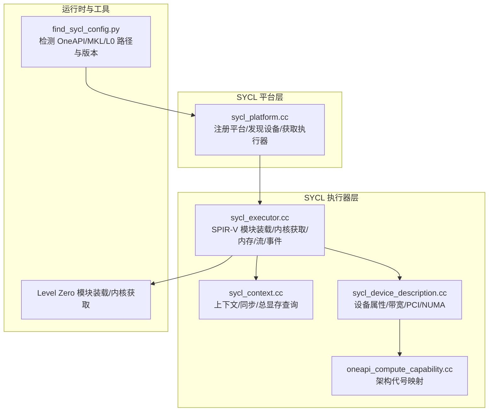
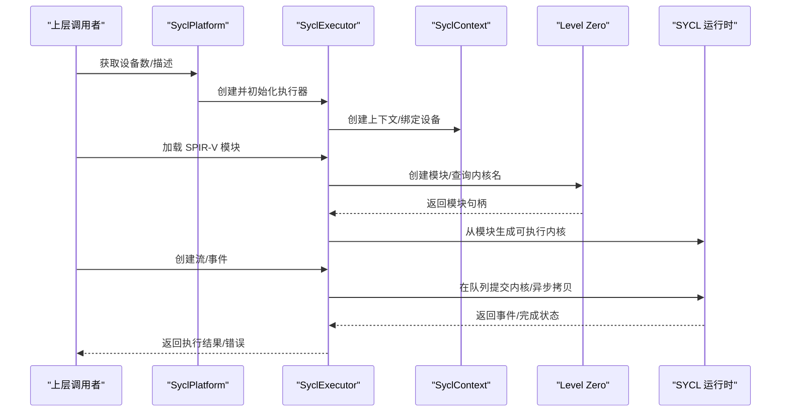
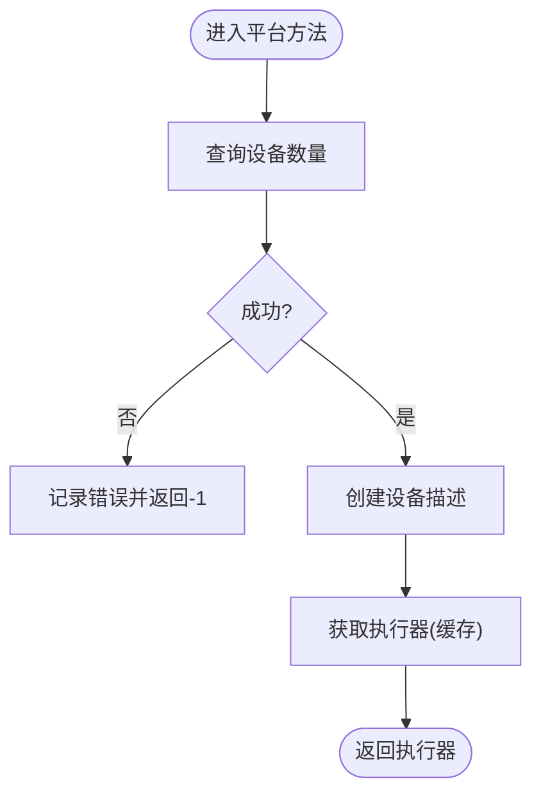
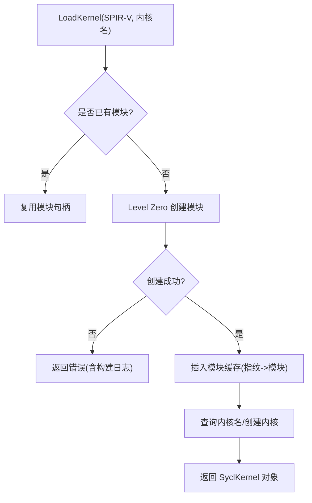
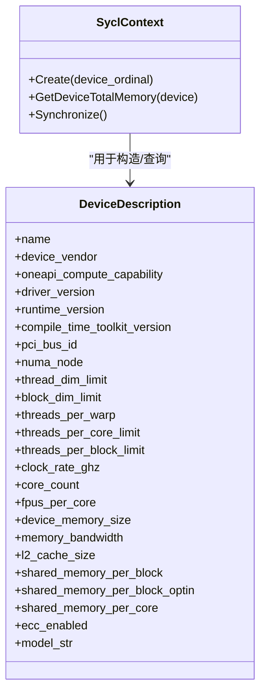
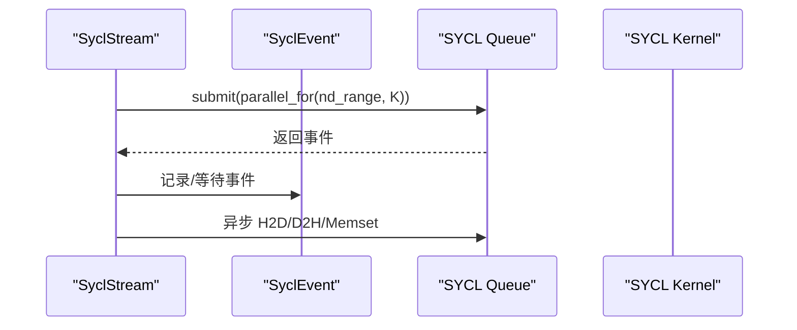
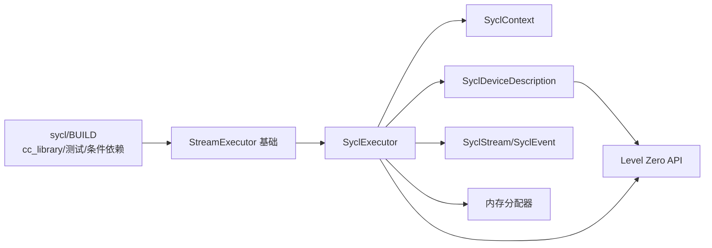

# SYCL后端

<cite>
**本文引用的文件**
- [xla\stream_executor\sycl\BUILD](file://xla/stream_executor/sycl/BUILD)
- [xla\stream_executor\sycl\sycl_platform.cc](file://xla/stream_executor/sycl/sycl_platform.cc)
- [xla\stream_executor\sycl\sycl_executor.cc](file://xla/stream_executor/sycl/sycl_executor.cc)
- [xla\stream_executor\sycl\sycl_context.cc](file://xla/stream_executor/sycl/sycl_context.cc)
- [xla\stream_executor\sycl\sycl_device_description.cc](file://xla/stream_executor/sycl/sycl_device_description.cc)
- [xla\stream_executor\sycl\sycl_stream.cc](file://xla/stream_executor/sycl/sycl_stream.cc)
- [xla\stream_executor\sycl\sycl_kernel.cc](file://xla/stream_executor/sycl/sycl_kernel.cc)
- [xla\stream_executor\sycl\oneapi_compute_capability.cc](file://xla/stream_executor/sycl/oneapi_compute_capability.cc)
- [xla\service\gpu\custom_kernel_emitter_sycl_stub.cc](file://xla/service/gpu/custom_kernel_emitter_sycl_stub.cc)
- [third_party\gpus\find_sycl_config.py](file://third_party/gpus/find_sycl_config.py)
</cite>

## 目录
1. [简介](#简介)
2. [项目结构](#项目结构)
3. [核心组件](#核心组件)
4. [架构总览](#架构总览)
5. [组件详解](#组件详解)
6. [依赖关系分析](#依赖关系分析)
7. [性能考量](#性能考量)
8. [故障排查指南](#故障排查指南)
9. [结论](#结论)
10. [附录：配置与兼容性](#附录配置与兼容性)

## 简介
本文件系统化梳理 XLA 的 SYCL 后端设计与实现，聚焦以下目标：
- 跨厂商异构计算支持：通过 OneAPI SYCL 运行时与 Level-Zero 驱动抽象，统一 Intel GPU（如 PVC、BMG、DG2）的编程模型。
- OneAPI SYCL 编译器集成与运行时适配：以 SPIR-V 为中间表示加载与执行内核，借助 Level Zero 模块装载与内核获取。
- 设备抽象与内存管理：封装 SYCL 设备、上下文、流、事件与内存分配器，提供主机/设备/共享内存的统一接口。
- 自动调优与性能分析：基于设备能力与缓存策略的模块复用、常量共享缓存、同步与计时；结合日志与 VLOG 提供可观测性。
- 配置与兼容性：通过环境变量与脚本检测 OneAPI 工具链、MKL、Level Zero，支持不同厂商 GPU 的能力识别与特性估算。

## 项目结构
SYCL 后端位于 StreamExecutor 子系统中，采用“平台-执行器-设备描述-上下文-流-事件-内核-内存”的分层组织，并通过 Bazel 构建规则按条件启用。

**图示来源**
- [xla\stream_executor\sycl\sycl_platform.cc](file://xla/stream_executor/sycl/sycl_platform.cc#L40-L72)
- [xla\stream_executor\sycl\sycl_executor.cc](file://xla/stream_executor/sycl/sycl_executor.cc#L440-L533)
- [xla\stream_executor\sycl\sycl_context.cc](file://xla/stream_executor/sycl/sycl_context.cc#L20-L34)
- [xla\stream_executor\sycl\sycl_device_description.cc](file://xla/stream_executor/sycl/sycl_device_description.cc#L154-L287)
- [xla\stream_executor\sycl\oneapi_compute_capability.cc](file://xla/stream_executor/sycl/oneapi_compute_capability.cc#L30-L49)
- [third_party\gpus\find_sycl_config.py](file://third_party/gpus/find_sycl_config.py#L181-L199)

**章节来源**
- [xla\stream_executor\sycl\BUILD](file://xla/stream_executor/sycl/BUILD#L1-L91)
- [xla\stream_executor\sycl\sycl_platform.cc](file://xla/stream_executor/sycl/sycl_platform.cc#L40-L89)

## 核心组件
- 平台与发现：平台类负责可见设备数量统计、设备描述创建与执行器缓存获取。
- 执行器：负责 SPIR-V 模块装载、内核函数提取、常量共享缓存、内存分配与释放、流与事件管理。
- 上下文：持有 SYCL 上下文与设备序号，提供同步与总显存查询。
- 设备描述：通过 Level Zero 查询设备属性，构造 DeviceDescription，包含带宽、PCI、NUMA、线程/块限制、缓存与共享内存等。
- 计算能力：将 IP 版本映射到 PVC/BMG/DG2 等架构代号，用于带宽估算与特性判断。
- 流与事件：封装 SYCL queue 与事件，支持参数打包、异步拷贝与内存填充。
- 内核：封装 SYCL kernel，支持参数打包数组与可选共享内存参数传递。
- 配置检测：Python 脚本检测 OneAPI 工具链、MKL、Level Zero 安装路径与版本。

**章节来源**
- [xla\stream_executor\sycl\sycl_platform.cc](file://xla/stream_executor/sycl/sycl_platform.cc#L40-L89)
- [xla\stream_executor\sycl\sycl_executor.cc](file://xla/stream_executor/sycl/sycl_executor.cc#L425-L715)
- [xla\stream_executor\sycl\sycl_context.cc](file://xla/stream_executor/sycl/sycl_context.cc#L20-L34)
- [xla\stream_executor\sycl\sycl_device_description.cc](file://xla/stream_executor/sycl/sycl_device_description.cc#L154-L287)
- [xla\stream_executor\sycl\oneapi_compute_capability.cc](file://xla/stream_executor/sycl/oneapi_compute_capability.cc#L30-L79)
- [xla\stream_executor\sycl\sycl_stream.cc](file://xla/stream_executor/sycl/sycl_stream.cc#L24-L92)
- [xla\stream_executor\sycl\sycl_kernel.cc](file://xla/stream_executor/sycl/sycl_kernel.cc#L46-L120)
- [third_party\gpus\find_sycl_config.py](file://third_party/gpus/find_sycl_config.py#L181-L199)

## 架构总览
SYCL 后端以“平台-执行器-设备描述-上下文-流-事件-内核-内存”为主线，通过 Level Zero 与 SYCL 运行时桥接，实现对 Intel GPU 的统一抽象与高效执行。

**图示来源**
- [xla\stream_executor\sycl\sycl_platform.cc](file://xla/stream_executor/sycl/sycl_platform.cc#L53-L72)
- [xla\stream_executor\sycl\sycl_executor.cc](file://xla/stream_executor/sycl/sycl_executor.cc#L440-L533)
- [xla\stream_executor\sycl\sycl_executor.cc](file://xla/stream_executor/sycl/sycl_executor.cc#L113-L164)
- [xla\stream_executor\sycl\sycl_executor.cc](file://xla/stream_executor/sycl/sycl_executor.cc#L166-L237)

## 组件详解

### 平台与设备发现
- 可见设备数量通过设备池查询；失败时记录错误并返回负值。
- 设备描述由执行器创建，内部委托给设备描述工厂。
- 执行器缓存按设备序号创建与复用，避免重复初始化。

**图示来源**
- [xla\stream_executor\sycl\sycl_platform.cc](file://xla/stream_executor/sycl/sycl_platform.cc#L42-L65)

**章节来源**
- [xla\stream_executor\sycl\sycl_platform.cc](file://xla/stream_executor/sycl/sycl_platform.cc#L40-L89)

### 执行器：SPIR-V 模块装载与内核获取
- 输入校验：要求提供 SPIR-V 字节流与内核名。
- 模块缓存：以二进制内容指纹作为键，避免重复装载；并发安全通过互斥锁保护。
- Level Zero 接口：创建模块、查询内核名列表、从模块创建内核句柄，再包装为 SYCL kernel。
- 常量共享：基于内容指纹缓存只读常量，减少重复传输与分配。
- 内存分配：支持设备/主机/共享内存三类，分别映射到对应 SYCL 分配 API。
- 同步：提供全局同步与按流同步。

**图示来源**
- [xla\stream_executor\sycl\sycl_executor.cc](file://xla/stream_executor/sycl/sycl_executor.cc#L440-L533)
- [xla\stream_executor\sycl\sycl_executor.cc](file://xla/stream_executor/sycl/sycl_executor.cc#L113-L164)
- [xla\stream_executor\sycl\sycl_executor.cc](file://xla/stream_executor/sycl/sycl_executor.cc#L166-L237)

**章节来源**
- [xla\stream_executor\sycl\sycl_executor.cc](file://xla/stream_executor/sycl/sycl_executor.cc#L425-L715)

### 上下文与设备描述
- 上下文：持有 SYCL 上下文与设备序号，提供设备总显存查询与流池同步。
- 设备描述：通过 Level Zero 查询设备属性（名称、PCI、NUMA）、计算属性（线程/块限制、共享内存、缓存大小）、驱动与运行时版本，并进行带宽估算与模型字符串拼装。

**图示来源**
- [xla\stream_executor\sycl\sycl_context.cc](file://xla/stream_executor/sycl/sycl_context.cc#L20-L34)
- [xla\stream_executor\sycl\sycl_device_description.cc](file://xla/stream_executor/sycl/sycl_device_description.cc#L154-L287)

**章节来源**
- [xla\stream_executor\sycl\sycl_context.cc](file://xla/stream_executor/sycl/sycl_context.cc#L20-L34)
- [xla\stream_executor\sycl\sycl_device_description.cc](file://xla/stream_executor/sycl/sycl_device_description.cc#L55-L287)

### 流、事件与内核启动
- 流：封装 SYCL queue，支持等待其他流、记录/等待事件、异步内存填充与拷贝。
- 事件：与 SYCL 事件交互，支持流间等待。
- 内核：支持参数打包数组与设备地址数组，按 arity 与共享内存参数数量校验，最终通过流提交内核执行。

**图示来源**
- [xla\stream_executor\sycl\sycl_stream.cc](file://xla/stream_executor/sycl/sycl_stream.cc#L24-L92)
- [xla\stream_executor\sycl\sycl_stream.cc](file://xla/stream_executor/sycl/sycl_stream.cc#L114-L142)
- [xla\stream_executor\sycl\sycl_kernel.cc](file://xla/stream_executor/sycl/sycl_kernel.cc#L46-L120)

**章节来源**
- [xla\stream_executor\sycl\sycl_stream.cc](file://xla/stream_executor/sycl/sycl_stream.cc#L24-L200)
- [xla\stream_executor\sycl\sycl_kernel.cc](file://xla/stream_executor/sycl/sycl_kernel.cc#L46-L120)

### 计算能力与架构映射
- 将底层 IP 版本映射到 PVC/BMG/DG2 等架构代号，用于带宽估算与特性判断。
- 支持从原型消息与字符串转换，便于日志与诊断。

**章节来源**
- [xla\stream_executor\sycl\oneapi_compute_capability.cc](file://xla/stream_executor/sycl/oneapi_compute_capability.cc#L30-L79)

### 自定义内核发射占位
- 当前 SYCL 平台尚未实现 PTX 自定义内核发射，返回未实现错误。

**章节来源**
- [xla\service\gpu\custom_kernel_emitter_sycl_stub.cc](file://xla/service/gpu/custom_kernel_emitter_sycl_stub.cc#L23-L28)

## 依赖关系分析
- 构建层面：Bazel 条件启用 SYCL 平台库，依赖平台管理、执行器基础组件与 ABSEIL。
- 运行时层面：执行器依赖 SYCL 上下文、设备描述、流/事件、内存分配器；通过 Level Zero 实现模块装载与内核获取。
- 设备能力：设备描述依赖 Level Zero 查询属性，结合计算能力模块进行带宽与特性估算。

**图示来源**
- [xla\stream_executor\sycl\BUILD](file://xla/stream_executor/sycl/BUILD#L31-L91)
- [xla\stream_executor\sycl\sycl_executor.cc](file://xla/stream_executor/sycl/sycl_executor.cc#L285-L329)

**章节来源**
- [xla\stream_executor\sycl\BUILD](file://xla/stream_executor/sycl/BUILD#L1-L91)
- [xla\stream_executor\sycl\sycl_executor.cc](file://xla/stream_executor/sycl/sycl_executor.cc#L285-L329)

## 性能考量
- 模块缓存与去重：以 SPIR-V 二进制指纹为键缓存模块，避免重复装载与构建日志开销。
- 常量共享：基于内容指纹缓存只读常量，减少重复传输与分配。
- 同步策略：提供按流与全局同步，建议在关键路径使用按流同步以提升并发。
- 带宽估算：针对 PVC/BMG/DG2 的带宽硬编码估算，便于自动调优与调度决策。
- 日志与 VLOG：大量 VLOG(2/3) 输出内核参数、模块状态与资源操作，便于定位性能瓶颈。

**章节来源**
- [xla\stream_executor\sycl\sycl_executor.cc](file://xla/stream_executor/sycl/sycl_executor.cc#L560-L627)
- [xla\stream_executor\sycl\sycl_device_description.cc](file://xla/stream_executor/sycl/sycl_device_description.cc#L61-L74)

## 故障排查指南
- 设备不可见或数量为负：检查平台初始化与设备池查询，关注错误日志。
- 模块装载失败：查看 Level Zero 模块创建返回码与构建日志字符串，确认 SPIR-V 合法性与目标设备匹配。
- 内核获取失败：确认内核名正确且模块包含该符号；在 VLOG(2) 下观察模块内核名列表。
- 内存分配/释放异常：检查空指针与大小对齐，关注错误日志中的状态字符串。
- 同步失败：确认流已提交任务并正确记录事件，必要时切换为全局同步进行定位。
- 配置问题：使用配置检测脚本输出 OneAPI/MKL/L0 路径与版本，确保环境变量正确设置。

**章节来源**
- [xla\stream_executor\sycl\sycl_executor.cc](file://xla/stream_executor/sycl/sycl_executor.cc#L113-L164)
- [xla\stream_executor\sycl\sycl_executor.cc](file://xla/stream_executor/sycl/sycl_executor.cc#L166-L237)
- [third_party\gpus\find_sycl_config.py](file://third_party/gpus/find_sycl_config.py#L202-L213)

## 结论
XLA 的 SYCL 后端通过 SYCL 运行时与 Level Zero 的组合，实现了对 Intel GPU 的统一抽象与高效执行。其核心在于：
- 以 SPIR-V 为中心的模块装载与内核获取；
- 设备描述与计算能力的标准化；
- 流/事件与内存管理的细粒度控制；
- 模块与常量缓存带来的性能收益；
- 丰富的日志与 VLOG 提升可观测性。

当前尚未覆盖 NVIDIA/AMD 的 SYCL 后端实现，但该架构具备良好的扩展性，可在保持一致接口的前提下接入其他厂商的 SYCL 运行时与驱动。

## 附录：配置与兼容性
- 环境变量与工具链检测
  - 使用 Python 脚本检测 OneAPI 工具链、MKL、Level Zero 的安装路径与版本，输出到标准输出，便于构建系统与 CI 使用。
  - 默认工具链路径与基座版本解析逻辑可被覆盖。
- 兼容性说明
  - 平台标签与条件编译：构建脚本中带有“oneapi-only”标签，表明当前实现面向 OneAPI 生态。
  - 架构支持：设备描述与带宽估算针对 PVC/BMG/DG2；其他架构需扩展映射表与带宽数据。
  - 自定义内核：PTX 自定义内核发射在 SYCL 平台尚未实现，需等待后续完善。

**章节来源**
- [third_party\gpus\find_sycl_config.py](file://third_party/gpus/find_sycl_config.py#L181-L199)
- [xla\stream_executor\sycl\BUILD](file://xla/stream_executor/sycl/BUILD#L42-L45)
- [xla\stream_executor\sycl\sycl_device_description.cc](file://xla/stream_executor/sycl/sycl_device_description.cc#L61-L74)
- [xla\service\gpu\custom_kernel_emitter_sycl_stub.cc](file://xla/service/gpu/custom_kernel_emitter_sycl_stub.cc#L23-L28)