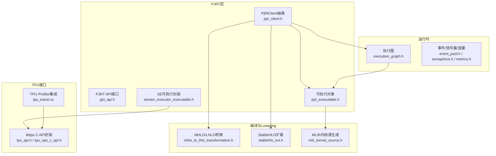
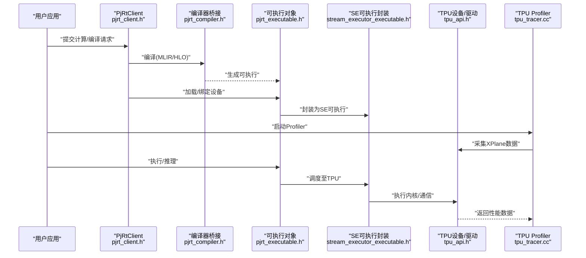
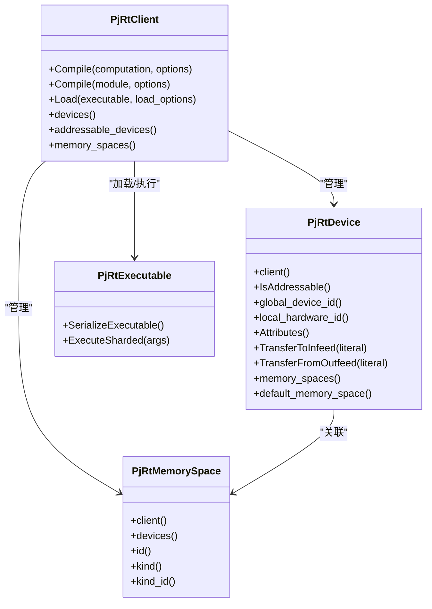
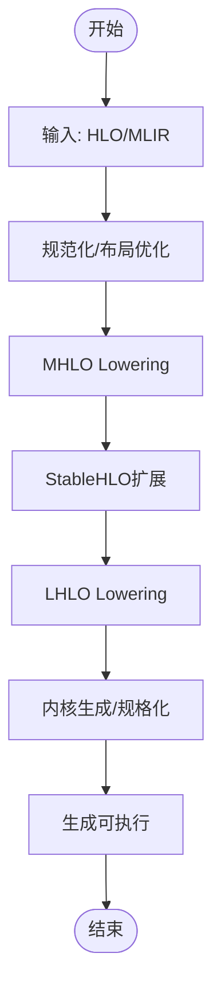
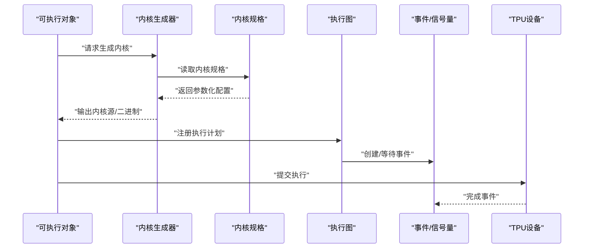
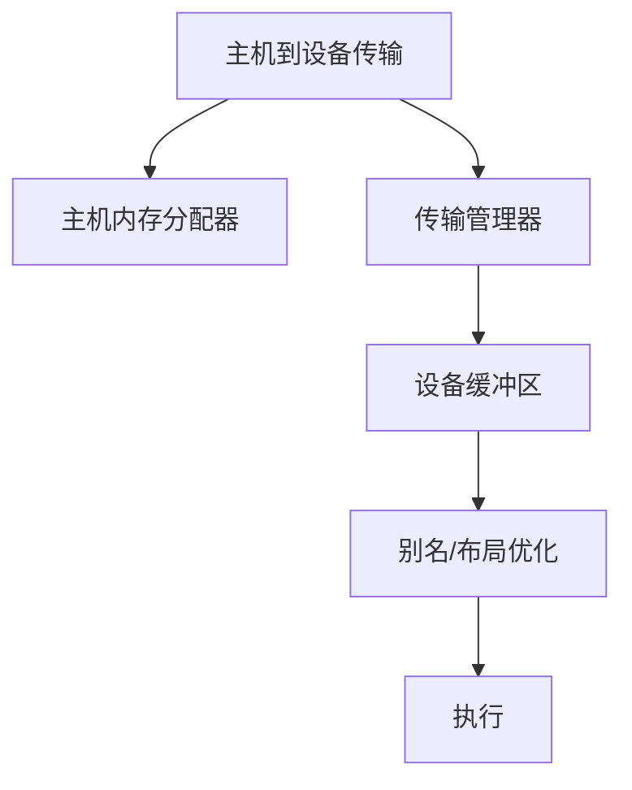
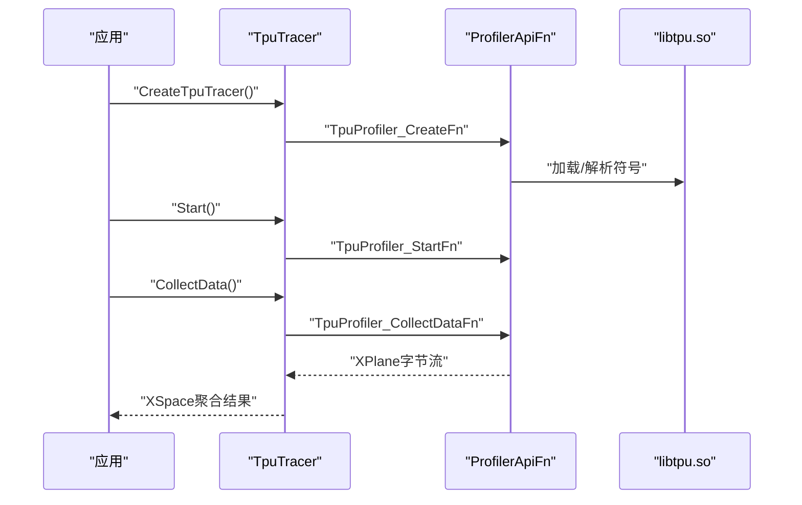
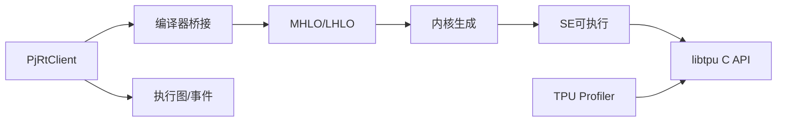

# TPU后端

<cite>
**本文引用的文件**
- [xla\backends\profiler\tpu\tpu_tracer.cc](file://xla/backends/profiler/tpu/tpu_tracer.cc)
- [xla\pjrt\tpu_constants.h](file://xla/pjrt/tpu_constants.h)
- [xla\pjrt\pjrt_api.h](file://xla/pjrt/pjrt_api.h)
- [xla\pjrt\pjrt_client.h](file://xla/pjrt/pjrt_client.h)
- [xla\hlo\ir\hlo_input_output_alias_config.cc](file://xla/hlo/ir/hlo_input_output_alias_config.cc)
- [xla\hlo\ir\hlo_input_output_alias_config.h](file://xla/hlo/ir/hlo_input_output_alias_config.h)
- [xla\hlo\transforms\simplifiers\optimize_input_output_buffer_alias.cc](file://xla/hlo/transforms/simplifiers/optimize_input_output_buffer_alias.cc)
- [xla\hlo\transforms\simplifiers\optimize_input_output_buffer_alias.h](file://xla/hlo/transforms/simplifiers/optimize_input_output_buffer_alias.h)
- [xla\mlir_hlo\mhlo\mhlo_to_lhlo_transformation.cc](file://xla/mlir_hlo/mhlo/mhlo_to_lhlo_transformation.cc)
- [xla\mlir_hlo\mhlo\mhlo_to_lhlo_transformation.h](file://xla/mlir_hlo/mhlo/mhlo_to_lhlo_transformation.h)
- [xla\mlir_hlo\stablehlo_ext\stablehlo_ext.cc](file://xla/mlir_hlo/stablehlo_ext/stablehlo_ext.cc)
- [xla\mlir_hlo\stablehlo_ext\stablehlo_ext.h](file://xla/mlir_hlo/stablehlo_ext/stablehlo_ext.h)
- [xla\codegeneration\mlir_kernel_source.cc](file://xla/codegen/mlir_kernel_source.cc)
- [xla\codegen\mlir_kernel_source.h](file://xla/codegen/mlir_kernel_source.h)
- [xla\codegen\kernel_spec.cc](file://xla/codegen/kernel_spec.cc)
- [xla\codegen\kernel_spec.h](file://xla/codegen/kernel_spec.h)
- [xla\service\execution_graph.cc](file://xla/runtime/execution_graph.cc)
- [xla\service\execution_graph.h](file://xla/runtime/execution_graph.h)
- [xla\stream_executor\tpu\tpu_api.h](file://xla/stream_executor/tpu/tpu_api.h)
- [xla\stream_executor\tpu\tpu_ops_c_api.h](file://xla/stream_executor/tpu/tpu_ops_c_api.h)
- [xla\stream_executor\tpu\tsl_status_helper.h](file://xla/stream_executor/tpu/tsl_status_helper.h)
- [xla\pjrt\mlir_to_hlo.cc](file://xla/pjrt/mlir_to_hlo.cc)
- [xla\pjrt\mlir_to_hlo.h](file://xla/pjrt/mlir_to_hlo.h)
- [xla\pjrt\infer_dispatch_info.cc](file://xla/pjrt/infer_dispatch_info.cc)
- [xla\pjrt\infer_dispatch_info.h](file://xla/pjrt/infer_dispatch_info.h)
- [xla\pjrt\transpose.cc](file://xla/pjrt/transpose.cc)
- [xla\pjrt\transpose.h](file://xla/pjrt/transpose.h)
- [xla\pjrt\transpose_kernels.h](file://xla/pjrt/transpose_kernels.h)
- [xla\pjrt\host_memory_allocator.cc](file://xla/pjrt/host_memory_allocator.cc)
- [xla\pjrt\host_memory_allocator.h](file://xla/pjrt/host_memory_allocator.h)
- [xla\pjrt\host_memory_spaces.cc](file://xla/pjrt/host_memory_spaces.cc)
- [xla\pjrt\host_memory_spaces.h](file://xla/pjrt/host_memory_spaces.h)
- [xla\pjrt\host_to_device_transfer_manager.cc](file://xla/pjrt/host_to_device_transfer_manager.cc)
- [xla\pjrt\host_to_device_transfer_manager.h](file://xla/pjrt/host_to_device_transfer_manager.h)
- [xla\pjrt\tracked_device_buffer.cc](file://xla/pjrt/tracked_device_buffer.cc)
- [xla\pjrt\tracked_device_buffer.h](file://xla/pjrt/tracked_device_buffer.h)
- [xla\pjrt\raw_buffer.cc](file://xla/pjrt/raw_buffer.cc)
- [xla\pjrt\raw_buffer.h](file://xla/pjrt/raw_buffer.h)
- [xla\pjrt\async_work_runner.h](file://xla/pjrt/async_work_runner.h)
- [xla\pjrt\event_pool.h](file://xla/pjrt/event_pool.h)
- [xla\pjrt\semaphore.cc](file://xla/pjrt/semaphore.cc)
- [xla\pjrt\semaphore.h](file://xla/pjrt/semaphore.h)
- [xla\pjrt\metrics.cc](file://xla/pjrt/metrics.cc)
- [xla\pjrt\metrics.h](file://xla/pjrt/metrics.h)
- [xla\pjrt\errors.cc](file://xla/pjrt/errors.cc)
- [xla\pjrt\errors.h](file://xla/pjrt/errors.h)
- [xla\pjrt\exceptions.h](file://xla/pjrt/exceptions.h)
- [xla\pjrt\string_utils.cc](file://xla/pjrt/string_utils.cc)
- [xla\pjrt\string_utils.h](file://xla/pjrt/string_utils.h)
- [xla\pjrt\utils.cc](file://xla/pjrt/utils.cc)
- [xla\pjrt\utils.h](file://xla/pjrt/utils.h)
- [xla\pjrt\worker_thread.cc](file://xla/pjrt/worker_thread.cc)
- [xla\pjrt\worker_thread.h](file://xla/pjrt/worker_thread.h)
- [xla\pjrt\layout_mode.cc](file://xla/pjrt/layout_mode.cc)
- [xla\pjrt\layout_mode.h](file://xla/pjrt/layout_mode.h)
- [xla\pjrt\compiled_memory_stats.cc](file://xla/pjrt/compiled_memory_stats.cc)
- [xla\pjrt\compiled_memory_stats.h](file://xla/pjrt/compiled_memory_stats.h)
- [xla\pjrt\partial_program_utils.cc](file://xla/pjrt/partial_program_utils.cc)
- [xla\pjrt\partial_program_utils.h](file://xla/pjrt/partial_program_utils.h)
- [xla\pjrt\infer_dispatch_info.cc](file://xla/pjrt/infer_dispatch_info.cc)
- [xla\pjrt\infer_dispatch_info.h](file://xla/pjrt/infer_dispatch_info.h)
- [xla\pjrt\pjrt_executable.cc](file://xla/pjrt/pjrt_executable.cc)
- [xla\pjrt\pjrt_executable.h](file://xla/pjrt/pjrt_executable.h)
- [xla\pjrt\stream_executor_executable.cc](file://xla/pjrt/stream_executor_executable.cc)
- [xla\pjrt\stream_executor_executable.h](file://xla/pjrt/stream_executor_executable.h)
- [xla\pjrt\stream_executor_executable.proto](file://xla/pjrt/stream_executor_executable.proto)
- [xla\pjrt\stream_executor_pjrt_abi_version.cc](file://xla/pjrt/stream_executor_pjrt_abi_version.cc)
- [xla\pjrt\stream_executor_pjrt_abi_version.h](file://xla/pjrt/stream_executor_pjrt_abi_version.h)
- [xla\pjrt\stream_executor_platform_id_mapping.cc](file://xla/pjrt/stream_executor_platform_id_mapping.cc)
- [xla\pjrt\stream_executor_platform_id_mapping.h](file://xla/pjrt/stream_executor_platform_id_mapping.h)
- [xla\pjrt\pjrt_compiler.cc](file://xla/pjrt/pjrt_compiler.cc)
- [xla\pjrt\pjrt_compiler.h](file://xla/pjrt/pjrt_compiler.h)
- [xla\pjrt\c\pjrt_c_api.h](file://xla/pjrt/c/pjrt_c_api.h)
- [xla\pjrt\c\docs\pjrt_integration_guide.md](file://xla/pjrt/c/docs/pjrt_integration_guide.md)
- [xla\examples\axpy\stablehlo_axpy.mlir](file://xla/examples/axpy/stablehlo_axpy.mlir)
- [xla\examples\axpy\stablehlo_compile_test.cc](file://xla/examples/axpy/stablehlo_compile_test.cc)
- [xla\docs\architecture.md](file://xla/docs/architecture.md)
- [xla\docs\hlo_to_thunks.md](file://xla/docs/hlo_to_thunks.md)
- [xla\docs\hlo_passes.md](file://xla/docs/hlo_passes.md)
- [xla\docs\shapes.md](file://xla/docs/shapes.md)
- [xla\docs\tiled_layout.md](file://xla/docs/tiled_layout.md)
- [xla\docs\custom_call.md](file://xla/docs/custom_call.md)
- [xla\docs\operation_semantics.md](file://xla/docs/operation_semantics.md)
- [xla\docs\developer_guide.md](file://xla/docs/developer_guide.md)
- [xla\docs\developing_new_backend.md](file://xla/docs/developing_new_backend.md)
- [xla\docs\flags_guidance.md](file://xla/docs/flags_guidance.md)
- [xla\docs\hlo_dumps.md](file://xla/docs/hlo_dumps.md)
- [xla\docs\persisted_autotuning.md](file://xla/docs/persisted_autotuning.md)
- [xla\docs\ooom_debugging.md](file://xla/docs/oom_debugging.md)
- [xla\docs\megascale\overview.md](file://xla/docs/megascale/overview.md)
- [xla\docs\megascale\debugging_workflow.md](file://xla/docs/megascale/debugging_workflow.md)
- [xla\docs\pjrt\index.md](file://xla/docs/pjrt/index.md)
- [xla\docs\pjrt\cpp_api_overview.md](file://xla/docs/pjrt/cpp_api_overview.md)
- [xla\docs\pjrt\examples.md](file://xla/docs/pjrt/examples.md)
- [xla\docs\pjrt\pjrt_integration.md](file://xla/docs/pjrt/pjrt_integration.md)
- [xla\docs\build_from_source.md](file://xla/docs/build_from_source.md)
- [xla\docs\tools.md](file://xla/docs/tools.md)
- [xla\docs\tools_multihost_hlo_runner.md](file://xla/docs/tools_multihost_hlo_runner.md)
- [xla\docs\error_codes.md](file://xla/docs/error_codes.md)
- [xla\docs\errors_overview.md](file://xla/docs/errors_overview.md)
- [xla\docs\errors\error_0100.md](file://xla/docs/errors/error_0100.md)
- [xla\docs\errors\error_0101.md](file://xla/docs/errors/error_0101.md)
- [xla\docs\errors\error_0102.md](file://xla/docs/errors/error_0102.md)
- [xla\docs\errors\error_0200.md](file://xla/docs/errors/error_0200.md)
- [xla\docs\errors\error_1000.md](file://xla/docs/errors/error_1000.md)
- [xla\docs\errors\error_1001.md](file://xla/docs/errors/error_1001.md)
- [xla\docs\errors\error_1200.md](file://xla/docs/errors/error_1200.md)
- [xla\docs\errors\error_2001.md](file://xla/docs/errors/error_2001.md)
- [xla\docs\errors\error_2002.md](file://xla/docs/errors/error_2002.md)
- [xla\docs\errors\error_2003.md](file://xla/docs/errors/error_2003.md)
- [xla\docs\errors\error_3000.md](file://xla/docs/errors/error_3000.md)
- [xla\docs\errors\error_3001.md](file://xla/docs/errors/error_3001.md)
</cite>

## 目录
1. [简介](#简介)
2. [项目结构](#项目结构)
3. [核心组件](#核心组件)
4. [架构总览](#架构总览)
5. [详细组件分析](#详细组件分析)
6. [依赖关系分析](#依赖关系分析)
7. [性能考虑](#性能考虑)
8. [故障排查指南](#故障排查指南)
9. [结论](#结论)
10. [附录](#附录)

## 简介
本文件面向XLA TPU后端，系统性梳理TPU硬件特性在XLA中的适配方式，以及从HLO/MLIR到内核生成与执行调度的关键路径。内容覆盖：
- TPU硬件与内存层次、通信模式与设备属性
- XLA编译管线：HLO到MLIR、稳定化（StableHLO）与Lowering（LHLO）
- 内核生成与调度：内核规格、分发推断、执行图与事件同步
- PJRT接口与插件机制：平台常量、内存空间、传输管理
- 性能调优与故障诊断：缓冲区别名、布局优化、内存统计、错误码
- 部署与最佳实践：构建、集成与多主机工具链

## 项目结构
TPU后端相关代码主要分布在以下模块：
- PJRT运行时与客户端：设备、内存空间、缓冲区、传输、编译器桥接
- HLO/MLIR中间表示与Lowering：MHLO/LHLO转换、StableHLO扩展
- StreamExecutor TPU接口：libtpu C API封装、状态辅助
- 运行时执行图与事件：执行图、异步工作、信号量与度量
- 文档与示例：架构、HLO到Thunk流程、形状与平铺布局、错误码等

图表来源
- [xla\pjrt\pjrt_api.h](file://xla/pjrt/pjrt_api.h#L29-L47)
- [xla\pjrt\pjrt_client.h](file://xla/pjrt/pjrt_client.h#L509-L626)
- [xla\mlir_hlo\mhlo\mhlo_to_lhlo_transformation.h](file://xla/mlir_hlo/mhlo/mhlo_to_lhlo_transformation.h)
- [xla\mlir_hlo\stablehlo_ext\stablehlo_ext.h](file://xla/mlir_hlo/stablehlo_ext/stablehlo_ext.h)
- [xla\codegen\mlir_kernel_source.h](file://xla/codegen/mlir_kernel_source.h)
- [xla\stream_executor\tpu\tpu_api.h](file://xla/stream_executor/tpu/tpu_api.h)
- [xla\backends\profiler\tpu\tpu_tracer.cc](file://xla/backends/profiler/tpu/tpu_tracer.cc#L193-L209)
- [xla\service\execution_graph.h](file://xla/runtime/execution_graph.h)
- [xla\pjrt\event_pool.h](file://xla/pjrt/event_pool.h)
- [xla\pjrt\semaphore.h](file://xla/pjrt/semaphore.h)
- [xla\pjrt\metrics.h](file://xla/pjrt/metrics.h)

章节来源
- [xla\pjrt\pjrt_client.h](file://xla/pjrt/pjrt_client.h#L509-L626)
- [xla\docs\architecture.md](file://xla/docs/architecture.md)

## 核心组件
- 设备与内存空间
  - PjRtDevice/PjRtMemorySpace定义了设备属性、内存空间、默认布局与跨主机传输接口；TPU平台通过平台常量标识HBM内存空间种类。
- 编译与加载
  - PjRtClient支持以XlaComputation或MLIR Module进行编译与加载；编译器桥接负责HLO/MLIR到后端可执行的转换。
- 执行与调度
  - 执行图描述任务拓扑；事件池与信号量用于同步；异步工作线程驱动后台任务。
- Profiling与追踪
  - TPU Profiler通过libtpu C API采集XPlane数据并合并到XSpace。

章节来源
- [xla\pjrt\pjrt_client.h](file://xla/pjrt/pjrt_client.h#L84-L112)
- [xla\pjrt\tpu_constants.h](file://xla/pjrt/tpu_constants.h#L23-L23)
- [xla\backends\profiler\tpu\tpu_tracer.cc](file://xla/backends/profiler/tpu/tpu_tracer.cc#L106-L166)

## 架构总览
下图展示从用户侧到TPU设备的端到端路径：用户通过PJRT API提交计算，编译器将HLO/MLIR Lowering为后端可执行，随后由执行图与事件系统调度至TPU设备，期间借助libtpu完成Profiling与底层通信。

图表来源
- [xla\pjrt\pjrt_client.h](file://xla/pjrt/pjrt_client.h#L634-L656)
- [xla\pjrt\pjrt_compiler.h](file://xla/pjrt/pjrt_compiler.h)
- [xla\pjrt\pjrt_executable.h](file://xla/pjrt/pjrt_executable.h)
- [xla\pjrt\stream_executor_executable.h](file://xla/pjrt/stream_executor_executable.h)
- [xla\stream_executor\tpu\tpu_api.h](file://xla/stream_executor/tpu/tpu_api.h)
- [xla\backends\profiler\tpu\tpu_tracer.cc](file://xla/backends/profiler/tpu/tpu_tracer.cc#L119-L165)

## 详细组件分析

### 组件A：PJRT客户端与设备抽象
- 职责
  - 提供统一的设备发现、编译、加载、执行与传输接口；支持跨主机接收/发送缓冲区；暴露默认布局与设备分配策略。
- 关键点
  - 设备属性与内存空间：通过PjRtDevice/PjRtMemorySpace抽象设备能力与内存域；TPU平台使用“device”作为HBM内存空间种类标识。
  - 传输管理：提供主机到设备的异步传输流与跨主机收发缓冲区管理。
  - 编译接口：支持XlaComputation与MLIR Module两种输入，便于从HLO/MLIR直接编译。

图表来源
- [xla\pjrt\pjrt_client.h](file://xla/pjrt/pjrt_client.h#L114-L265)
- [xla\pjrt\pjrt_client.h](file://xla/pjrt/pjrt_client.h#L509-L626)
- [xla\pjrt\tpu_constants.h](file://xla/pjrt/tpu_constants.h#L23-L23)

章节来源
- [xla\pjrt\pjrt_client.h](file://xla/pjrt/pjrt_client.h#L114-L265)
- [xla\pjrt\tpu_constants.h](file://xla/pjrt/tpu_constants.h#L23-L23)

### 组件B：编译流程与HLO/MLIR转换
- 流程概览
  - 输入：XlaComputation或MLIR Module
  - 中间：MHLO/LHLO Lowering与StableHLO扩展
  - 输出：后端可执行（如SE可执行），随后由执行图调度
- 关键文件
  - MHLO/LHLO转换：mhlo_to_lhlo_transformation
  - StableHLO扩展：stablehlo_ext
  - MLIR内核源生成：mlir_kernel_source
  - MLIR到HLO转换桥接：mlir_to_hlo
  - 分发信息推断：infer_dispatch_info

图表来源
- [xla\mlir_hlo\mhlo\mhlo_to_lhlo_transformation.h](file://xla/mlir_hlo/mhlo/mhlo_to_lhlo_transformation.h)
- [xla\mlir_hlo\stablehlo_ext\stablehlo_ext.h](file://xla/mlir_hlo/stablehlo_ext/stablehlo_ext.h)
- [xla\codegen\mlir_kernel_source.h](file://xla/codegen/mlir_kernel_source.h)
- [xla\pjrt\mlir_to_hlo.h](file://xla/pjrt/mlir_to_hlo.h)
- [xla\pjrt\infer_dispatch_info.h](file://xla/pjrt/infer_dispatch_info.h)

章节来源
- [xla\docs\hlo_to_thunks.md](file://xla/docs/hlo_to_thunks.md)
- [xla\docs\hlo_passes.md](file://xla/docs/hlo_passes.md)
- [xla\docs\shapes.md](file://xla/docs/shapes.md)
- [xla\docs\tiled_layout.md](file://xla/docs/tiled_layout.md)

### 组件C：内核生成与执行调度
- 内核生成
  - 依据Lowered IR生成后端内核源码，结合内核规格（kernel_spec）进行参数化与优化。
- 执行调度
  - 执行图描述节点间的依赖关系；事件池与信号量协调并发；异步工作线程处理后台任务。
- TPU特化
  - 通过SE可执行封装与libtpu C API对接设备驱动；Profiler采集XPlane数据。

图表来源
- [xla\codegen\kernel_spec.h](file://xla/codegen/kernel_spec.h)
- [xla\service\execution_graph.h](file://xla/runtime/execution_graph.h)
- [xla\pjrt\event_pool.h](file://xla/pjrt/event_pool.h)
- [xla\pjrt\semaphore.h](file://xla/pjrt/semaphore.h)
- [xla\pjrt\stream_executor_executable.h](file://xla/pjrt/stream_executor_executable.h)

章节来源
- [xla\codegen\kernel_spec.cc](file://xla/codegen/kernel_spec.cc)
- [xla\service\execution_graph.cc](file://xla/runtime/execution_graph.cc)
- [xla\pjrt\async_work_runner.h](file://xla/pjrt/async_work_runner.h)

### 组件D：传输与内存管理
- 主机内存与设备缓冲
  - 主机侧内存分配器与设备缓冲跟踪：host_memory_allocator、tracked_device_buffer、raw_buffer
  - 主机到设备传输管理：host_to_device_transfer_manager
- 布局与别名优化
  - HLO输入/输出缓冲区别名配置与优化：hlo_input_output_alias_config、optimize_input_output_buffer_alias
- 跨主机收发
  - 支持跨主机接收/发送缓冲区与取消通知回调，确保一致性与避免死锁。

图表来源
- [xla\pjrt\host_memory_allocator.h](file://xla/pjrt/host_memory_allocator.h)
- [xla\pjrt\tracked_device_buffer.h](file://xla/pjrt/tracked_device_buffer.h)
- [xla\pjrt\raw_buffer.h](file://xla/pjrt/raw_buffer.h)
- [xla\pjrt\host_to_device_transfer_manager.h](file://xla/pjrt/host_to_device_transfer_manager.h)
- [xla\hlo\ir\hlo_input_output_alias_config.h](file://xla/hlo/ir/hlo_input_output_alias_config.h)
- [xla\hlo\transforms\simplifiers\optimize_input_output_buffer_alias.h](file://xla/hlo/transforms/simplifiers/optimize_input_output_buffer_alias.h)

章节来源
- [xla\pjrt\host_memory_allocator.cc](file://xla/pjrt/host_memory_allocator.cc)
- [xla\pjrt\tracked_device_buffer.cc](file://xla/pjrt/tracked_device_buffer.cc)
- [xla\pjrt\raw_buffer.cc](file://xla/pjrt/raw_buffer.cc)
- [xla\hlo\ir\hlo_input_output_alias_config.cc](file://xla/hlo/ir/hlo_input_output_alias_config.cc)
- [xla\hlo\transforms\simplifiers\optimize_input_output_buffer_alias.cc](file://xla/hlo/transforms/simplifiers/optimize_input_output_buffer_alias.cc)

### 组件E：Profiler与追踪
- TPU Profiler通过libtpu C API动态加载与初始化，创建Profiler实例，启动/停止采集，并将序列化的XPlane数据反序列化后合并到XSpace。
- 环境变量TPU_LIBRARY_PATH控制libtpu.so的加载路径。

图表来源
- [xla\backends\profiler\tpu\tpu_tracer.cc](file://xla/backends/profiler/tpu/tpu_tracer.cc#L106-L166)
- [xla\backends\profiler\tpu\tpu_tracer.cc](file://xla/backends/profiler/tpu/tpu_tracer.cc#L171-L189)

章节来源
- [xla\backends\profiler\tpu\tpu_tracer.cc](file://xla/backends/profiler/tpu/tpu_tracer.cc#L106-L166)

## 依赖关系分析
- 组件耦合
  - PjRtClient是上层入口，依赖编译器桥接与可执行对象；可执行对象进一步依赖SE封装与内核生成。
  - 执行图与事件系统贯穿调度与同步；Profiler与libtpu紧密耦合。
- 外部依赖
  - libtpu C API：提供Profiler与设备操作接口；通过环境变量控制库路径。
  - StableHLO/MLIR：作为中间IR，连接前端与后端。

图表来源
- [xla\pjrt\pjrt_client.h](file://xla/pjrt/pjrt_client.h#L634-L656)
- [xla\mlir_hlo\mhlo\mhlo_to_lhlo_transformation.h](file://xla/mlir_hlo/mhlo/mhlo_to_lhlo_transformation.h)
- [xla\codegen\mlir_kernel_source.h](file://xla/codegen/mlir_kernel_source.h)
- [xla\stream_executor\tpu\tpu_ops_c_api.h](file://xla/stream_executor/tpu/tpu_ops_c_api.h)
- [xla\backends\profiler\tpu\tpu_tracer.cc](file://xla/backends/profiler/tpu/tpu_tracer.cc#L193-L209)

章节来源
- [xla\stream_executor\tpu\tpu_api.h](file://xla/stream_executor/tpu/tpu_api.h)
- [xla\stream_executor\tpu\tsl_status_helper.h](file://xla/stream_executor/tpu/tsl_status_helper.h)

## 性能考虑
- 缓冲区别名与布局优化
  - 利用HLO输入/输出缓冲区别名配置与优化Pass减少拷贝与内存占用。
- 平铺布局与形状
  - 合理的形状与平铺布局有助于提升访存与并行效率。
- 内存统计与度量
  - 使用compiled_memory_stats与metrics收集编译期与运行期指标，定位瓶颈。
- 异步与并发
  - 通过异步工作线程与事件池提升吞吐；注意跨设备传输资源争用导致的死锁风险。

章节来源
- [xla\hlo\ir\hlo_input_output_alias_config.cc](file://xla/hlo/ir/hlo_input_output_alias_config.cc)
- [xla\hlo\transforms\simplifiers\optimize_input_output_buffer_alias.cc](file://xla/hlo/transforms/simplifiers/optimize_input_output_buffer_alias.cc)
- [xla\docs\tiled_layout.md](file://xla/docs/tiled_layout.md)
- [xla\docs\shapes.md](file://xla/docs/shapes.md)
- [xla\pjrt\compiled_memory_stats.h](file://xla/pjrt/compiled_memory_stats.h)
- [xla\pjrt\metrics.h](file://xla/pjrt/metrics.h)
- [xla\pjrt\async_work_runner.h](file://xla/pjrt/async_work_runner.h)

## 故障排查指南
- 错误码与错误处理
  - 统一的错误与异常处理接口，配合Profiler状态辅助类将C状态映射为absl::Status。
- 常见问题
  - libtpu库加载失败：检查TPU_LIBRARY_PATH与libtpu.so可用性。
  - Profiler初始化失败：确认设备类型匹配且C API已正确初始化。
  - 跨主机传输阻塞：遵循收发/取消通知契约，避免重复或遗漏。
- 参考文档
  - 错误码与错误概览文档提供系统化的问题定位指引。

章节来源
- [xla\backends\profiler\tpu\tpu_tracer.cc](file://xla/backends/profiler/tpu/tpu_tracer.cc#L53-L86)
- [xla\backends\profiler\tpu\tpu_tracer.cc](file://xla/backends/profiler/tpu/tpu_tracer.cc#L171-L189)
- [xla\docs\error_codes.md](file://xla/docs/error_codes.md)
- [xla\docs\errors_overview.md](file://xla/docs/errors_overview.md)
- [xla\docs\errors\error_0100.md](file://xla/docs/errors/error_0100.md)
- [xla\docs\errors\error_0101.md](file://xla/docs/errors/error_0101.md)
- [xla\docs\errors\error_0102.md](file://xla/docs/errors/error_0102.md)
- [xla\docs\errors\error_0200.md](file://xla/docs/errors/error_0200.md)
- [xla\docs\errors\error_1000.md](file://xla/docs/errors/error_1000.md)
- [xla\docs\errors\error_1001.md](file://xla/docs/errors/error_1001.md)
- [xla\docs\errors\error_1200.md](file://xla/docs/errors/error_1200.md)
- [xla\docs\errors\error_2001.md](file://xla/docs/errors/error_2001.md)
- [xla\docs\errors\error_2002.md](file://xla/docs/errors/error_2002.md)
- [xla\docs\errors\error_2003.md](file://xla/docs/errors/error_2003.md)
- [xla\docs\errors\error_3000.md](file://xla/docs/errors/error_3000.md)
- [xla\docs\errors\error_3001.md](file://xla/docs/errors/error_3001.md)

## 结论
XLA TPU后端通过PJRT统一接口、HLO/MLIR中间表示与Lowering、SE可执行封装及libtpu驱动，实现了从高层计算图到底层内核与设备执行的完整链路。借助Profiler、事件同步与传输管理，系统在多主机场景下具备良好的可观测性与可扩展性。建议在实际部署中关注布局优化、别名策略与内存统计，结合错误码与日志进行快速定位与调优。

## 附录
- 部署与构建
  - 参考构建与开发指南，确保依赖与工具链齐备。
- 示例与工具
  - StableHLO示例与多主机HLO运行工具可用于验证与调试。
- 文档索引
  - 架构、HLO到Thunk流程、HLO Pass、形状与布局、自定义算子语义、开发者指南、新后端开发指南、标志位指导、HLO转储、持久化自动调优、OOM调试、Megascale概览与调试流程、PJRT文档、从源码构建、工具与多主机HLO运行器、错误码与错误概览。

章节来源
- [xla\docs\build_from_source.md](file://xla/docs/build_from_source.md)
- [xla\docs\tools.md](file://xla/docs/tools.md)
- [xla\docs\tools_multihost_hlo_runner.md](file://xla/docs/tools_multihost_hlo_runner.md)
- [xla\examples\axpy\stablehlo_axpy.mlir](file://xla/examples/axpy/stablehlo_axpy.mlir)
- [xla\examples\axpy\stablehlo_compile_test.cc](file://xla/examples/axpy/stablehlo_compile_test.cc)
- [xla\docs\architecture.md](file://xla/docs/architecture.md)
- [xla\docs\hlo_to_thunks.md](file://xla/docs/hlo_to_thunks.md)
- [xla\docs\hlo_passes.md](file://xla/docs/hlo_passes.md)
- [xla\docs\shapes.md](file://xla/docs/shapes.md)
- [xla\docs\tiled_layout.md](file://xla/docs/tiled_layout.md)
- [xla\docs\custom_call.md](file://xla/docs/custom_call.md)
- [xla\docs\operation_semantics.md](file://xla/docs/operation_semantics.md)
- [xla\docs\developer_guide.md](file://xla/docs/developer_guide.md)
- [xla\docs\developing_new_backend.md](file://xla/docs/developing_new_backend.md)
- [xla\docs\flags_guidance.md](file://xla/docs/flags_guidance.md)
- [xla\docs\hlo_dumps.md](file://xla/docs/hlo_dumps.md)
- [xla\docs\persisted_autotuning.md](file://xla/docs/persisted_autotuning.md)
- [xla\docs\ooom_debugging.md](file://xla/docs/oom_debugging.md)
- [xla\docs\megascale\overview.md](file://xla/docs/megascale/overview.md)
- [xla\docs\megascale\debugging_workflow.md](file://xla/docs/megascale/debugging_workflow.md)
- [xla\docs\pjrt\index.md](file://xla/docs/pjrt/index.md)
- [xla\docs\pjrt\cpp_api_overview.md](file://xla/docs/pjrt/cpp_api_overview.md)
- [xla\docs\pjrt\examples.md](file://xla/docs/pjrt/examples.md)
- [xla\docs\pjrt\pjrt_integration.md](file://xla/docs/pjrt/pjrt_integration.md)