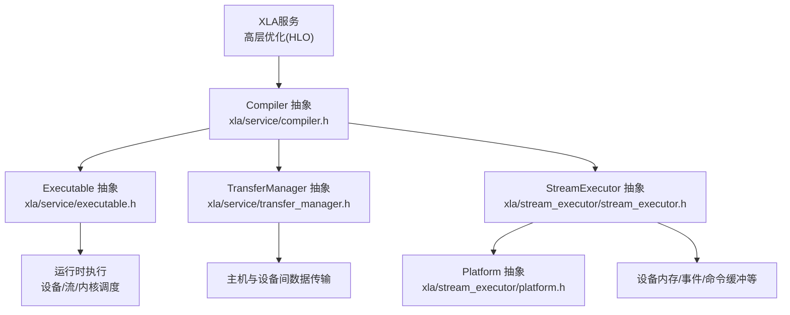
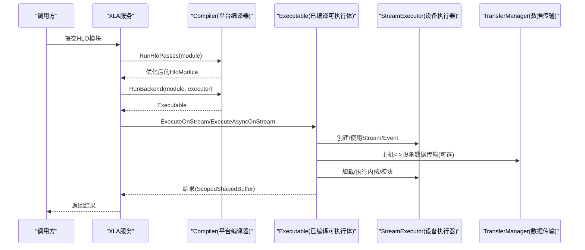
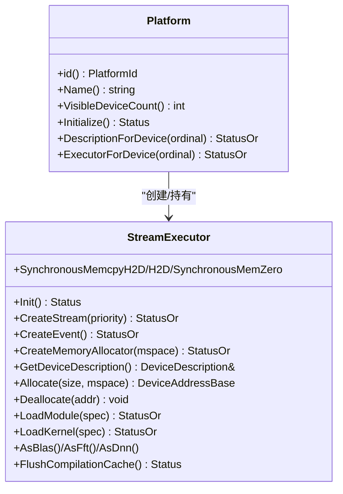
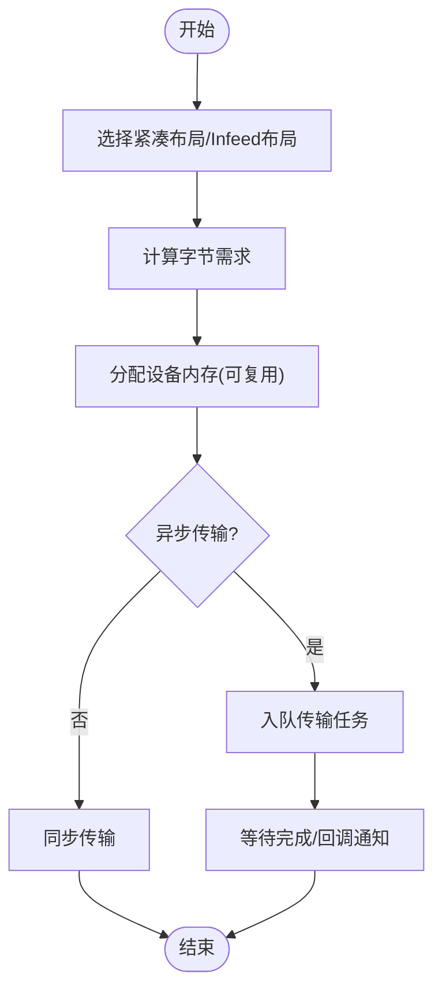
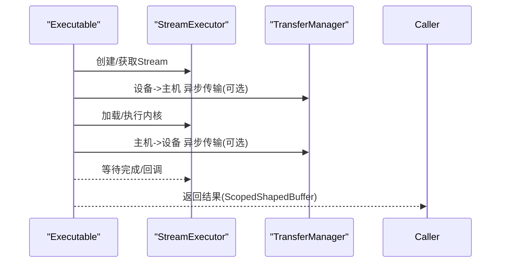
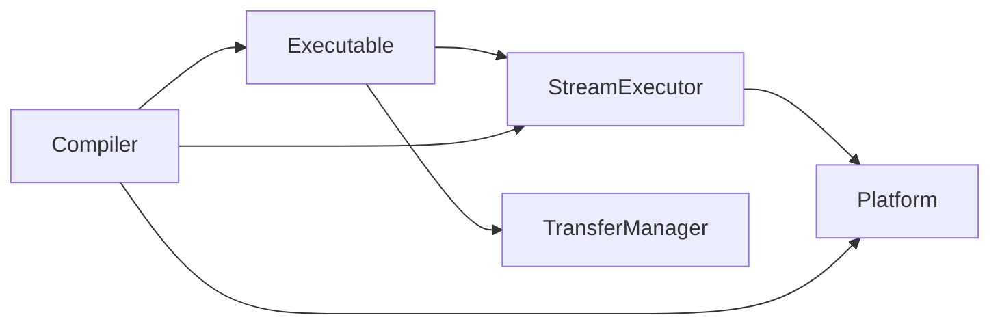

# 后端开发指南

<cite>
**本文引用的文件**
- [developing_new_backend.md](file://docs/developing_new_backend.md)
- [compiler.h](file://xla/service/compiler.h)
- [platform.h](file://xla/stream_executor/platform.h)
- [stream_executor.h](file://xla/stream_executor/stream_executor.h)
- [executable.h](file://xla/service/executable.h)
- [transfer_manager.h](file://xla/service/transfer_manager.h)
</cite>

## 目录
1. [引言](#引言)
2. [项目结构](#项目结构)
3. [核心组件](#核心组件)
4. [架构总览](#架构总览)
5. [组件详解](#组件详解)
6. [依赖关系分析](#依赖关系分析)
7. [性能考量](#性能考量)
8. [故障排查指南](#故障排查指南)
9. [结论](#结论)
10. [附录](#附录)

## 引言
本指南面向系统工程师与后端开发者，目标是帮助你在XLA中为新硬件或新架构实现一个可扩展、可维护的自定义后端。XLA通过抽象接口与注册机制，将上层HLO优化与底层代码生成/执行解耦，从而显著降低为新硬件适配的成本。你将基于抽象层（Compiler、Executable、TransferManager、StreamExecutor）进行实现，并通过平台注册与编译器工厂完成集成。

## 项目结构
围绕后端开发的关键目录与文件如下：
- 文档与指导：docs/developing_new_backend.md
- 编译器抽象：xla/service/compiler.h
- 平台抽象：xla/stream_executor/platform.h
- 执行器抽象：xla/stream_executor/stream_executor.h
- 可执行体抽象：xla/service/executable.h
- 数据传输抽象：xla/service/transfer_manager.h



图表来源
- [compiler.h](file://xla/service/compiler.h#L93-L107)
- [executable.h](file://xla/service/executable.h#L261-L269)
- [transfer_manager.h](file://xla/service/transfer_manager.h#L41-L47)
- [stream_executor.h](file://xla/stream_executor/stream_executor.h#L62-L70)
- [platform.h](file://xla/stream_executor/platform.h#L43-L57)

章节来源
- [developing_new_backend.md](file://docs/developing_new_backend.md#L1-L77)

## 核心组件
- 平台与设备抽象（Platform/StreamExecutor）
  - Platform负责平台标识、初始化、可见设备数、设备描述查询、以及获取StreamExecutor。
  - StreamExecutor封装单设备能力：创建/同步流、事件、内存分配与拷贝、加载/卸载模块与内核、BLAS/FFT/DNN加速库桥接、命令缓冲、统计与缓存清理等。
- 编译器抽象（Compiler）
  - Compiler作为平台级编译器接口，负责HLO优化、后端代码生成、AOT编译、编译器工厂注册、度量钩子等。
- 可执行体抽象（Executable）
  - Executable统一跨平台执行入口：同步/异步执行、多流并行执行、执行结果封装、统计信息、可选的HLO快照导出。
- 数据传输抽象（TransferManager）
  - TransferManager负责主机与设备之间的数据传输（同步/异步）、Infeed/Outfeed、布局选择、字节大小计算、元数据写入等。

章节来源
- [platform.h](file://xla/stream_executor/platform.h#L43-L104)
- [stream_executor.h](file://xla/stream_executor/stream_executor.h#L62-L429)
- [compiler.h](file://xla/service/compiler.h#L93-L351)
- [executable.h](file://xla/service/executable.h#L261-L471)
- [transfer_manager.h](file://xla/service/transfer_manager.h#L41-L339)

## 架构总览
下图展示了从高层HLO到设备执行的整体流程，以及各抽象层之间的交互关系：



图表来源
- [compiler.h](file://xla/service/compiler.h#L162-L190)
- [executable.h](file://xla/service/executable.h#L273-L305)
- [stream_executor.h](file://xla/stream_executor/stream_executor.h#L98-L160)
- [transfer_manager.h](file://xla/service/transfer_manager.h#L101-L149)

## 组件详解

### 设备抽象与平台检测（Platform/StreamExecutor）
- 平台职责
  - 唯一标识（PlatformId）、名称、可见设备数量、初始化、设备描述查询、按序号获取StreamExecutor。
- 设备执行器职责
  - 流/事件管理、内存分配/释放、主机内存注册/反注册、同步/异步拷贝、模块/内核加载、BLAS/FFT/DNN支持、命令缓冲、统计与缓存清理、资源生命周期管理等。
- 兼容性与能力探测
  - 通过DescriptionForDevice/GetDeviceDescription在不初始化设备的前提下获取设备信息；CanEnablePeerAccessTo用于探测跨设备访问能力；DeviceMemoryUsage可用于资源监控。



图表来源
- [platform.h](file://xla/stream_executor/platform.h#L43-L104)
- [stream_executor.h](file://xla/stream_executor/stream_executor.h#L62-L429)

章节来源
- [platform.h](file://xla/stream_executor/platform.h#L43-L104)
- [stream_executor.h](file://xla/stream_executor/stream_executor.h#L62-L429)

### 内存管理与传输（TransferManager）
- 职责边界
  - 将主机侧Literal搬运至设备内存（含异步版本），从设备内存搬运回主机（含异步版本），Infeed/Outfeed，布局选择与紧凑布局建议，动态形状读取，字节大小需求计算，元数据写入（如tuple索引表）。
- 关键点
  - 异步传输接口需保证在传输完成前保持数据结构有效；WriteTupleIndexTables系列接口用于复杂结构的索引表构造。
  - 可根据硬件特性决定是否对sub-byte类型进行打包以减少带宽占用。



图表来源
- [transfer_manager.h](file://xla/service/transfer_manager.h#L220-L255)
- [transfer_manager.h](file://xla/service/transfer_manager.h#L146-L178)

章节来源
- [transfer_manager.h](file://xla/service/transfer_manager.h#L41-L339)

### 执行引擎（Executable）
- 职责
  - 统一的执行接口：ExecuteOnStream/ExecuteAsyncOnStream，支持多流并行执行；执行结果封装为ScopedShapedBuffer；可选导出HLO快照；收集模块级统计信息。
- 输入输出语义
  - 支持输入缓冲“捐赠”与别名复用，确保在失败时正确归还未使用的缓冲；输出缓冲的遗留列表由执行器返回给调用方统一释放。
- 性能与可观测性
  - 提供SizeOfGeneratedCodeInBytes查询；可设置执行包装器以启用计时与HLO剖析；支持查询Executable ABI版本。



图表来源
- [executable.h](file://xla/service/executable.h#L273-L305)
- [transfer_manager.h](file://xla/service/transfer_manager.h#L101-L149)
- [stream_executor.h](file://xla/stream_executor/stream_executor.h#L98-L160)

章节来源
- [executable.h](file://xla/service/executable.h#L261-L471)

### 编译器集成（Compiler）
- 职责
  - RunHloPasses：对HLO模块进行高阶优化；RunBackend：将HLO映射到具体平台后端（LLO/CG）生成可执行体；Compile/CompileAheadOfTime：批量/提前编译；ComputeBackendConfigs/ComputeDefaultBackendConfig：为特定算子提供后端配置；Export/LoadExecutableFromAotResult：序列化/反序列化可执行体。
- 注册机制
  - RegisterCompilerFactory：按平台ID注册编译器工厂；GetForPlatform：按平台ID获取编译器实例；ExistsForPlatform：检查是否存在对应平台编译器。
- 并发与线程安全
  - Compiler需保证多客户端并发请求下的线程安全。

```mermaid
classDiagram
class Compiler {
+PlatformId() Platform : : Id
+RunHloPasses(module, executor, options) StatusOr<HloModule>
+RunBackend(module, executor, options) StatusOr<Executable>
+Compile(module, executors, options) StatusOr<vector<Executable>>
+CompileAheadOfTime(module, options) StatusOr<vector<CompiledModule>>
+ComputeBackendConfigs/hlo, executor) vector<Message>
+Export/executable) StatusOr<CompiledModule>
+RegisterCompilerFactory(id, factory) void
+GetForPlatform(id) StatusOr<Compiler>
}
```

图表来源
- [compiler.h](file://xla/service/compiler.h#L93-L351)

章节来源
- [compiler.h](file://xla/service/compiler.h#L93-L351)

### 场景化实现指引
- 已有CPU架构但未官方支持
  - 可参考现有XLA CPU后端，利用LLVM生成不同CPU目标代码；若无现成LLVM后端，可复用大部分CPU后端逻辑。
- 非CPU类硬件且已有LLVM后端
  - 可参考现有GPU等非CPU后端，复用LLVM IR生成部分，针对硬件特性调整IR生成细节。
- 非CPU类硬件且无LLVM后端
  - 需要从零实现：StreamExecutor、Compiler、Executable、TransferManager等关键类。

章节来源
- [developing_new_backend.md](file://docs/developing_new_backend.md#L13-L77)

## 依赖关系分析
- 模块耦合
  - Executable依赖Compiler提供的可执行体；Compiler依赖Platform/StreamExecutor进行设备能力探测与执行；TransferManager与Executable/StreamExecutor协作完成数据搬运。
- 外部依赖
  - 编译器后端通常依赖平台提供的运行时库（如BLAS/FFT/DNN）与设备驱动；AOT编译可能需要目标三元组配置。
- 循环依赖规避
  - 通过抽象接口与工厂注册避免直接耦合；平台与编译器通过唯一ID解耦。



图表来源
- [compiler.h](file://xla/service/compiler.h#L93-L351)
- [executable.h](file://xla/service/executable.h#L261-L471)
- [transfer_manager.h](file://xla/service/transfer_manager.h#L41-L339)
- [stream_executor.h](file://xla/stream_executor/stream_executor.h#L62-L429)
- [platform.h](file://xla/stream_executor/platform.h#L43-L104)

章节来源
- [compiler.h](file://xla/service/compiler.h#L93-L351)
- [executable.h](file://xla/service/executable.h#L261-L471)
- [transfer_manager.h](file://xla/service/transfer_manager.h#L41-L339)
- [stream_executor.h](file://xla/stream_executor/stream_executor.h#L62-L429)
- [platform.h](file://xla/stream_executor/platform.h#L43-L104)

## 性能考量
- 内存与带宽
  - 使用紧凑布局与合理的内存对齐减少填充；必要时启用子字节打包以提升带宽利用率；合理规划传输批次与重叠拷贝与计算。
- 并行与流水线
  - 利用多流/多设备并行执行；在编译阶段进行融合与布局优化；在运行时通过命令缓冲与事件进行流水线调度。
- 统计与剖析
  - 启用执行包装器的计时与HLO剖析；收集模块级统计信息；定期清理编译缓存以避免碎片化。
- AOT与热路径
  - 对热点路径采用AOT编译；结合静态设备分配与拓扑信息减少运行时开销。

## 故障排查指南
- 平台初始化与设备可见性
  - 确认Platform.Initialize成功；通过DescriptionForDevice获取设备描述；检查ExecutorForDevice/FindExisting是否返回错误。
- 内存不足与越界
  - 注意AllocateArray中的内存限制检查；在执行前校验设备内存上限；关注SynchronousMemZero/SynchronousMemcpy的尺寸参数。
- 传输一致性
  - 异步传输完成后才能释放Literal/设备缓冲；确保WriteTupleIndexTables等索引表写入在使用前完成。
- 编译器与后端配置
  - 若ComputeBackendConfigs/ComputeDefaultBackendConfig未生效，确认后端是否覆盖相应虚函数；检查AOT选项与缓存键是否一致。
- 并发与竞态
  - 多线程并发编译/执行时，确保Compiler/Executable的线程安全；避免在回调中访问已释放的缓冲。

章节来源
- [platform.h](file://xla/stream_executor/platform.h#L72-L104)
- [stream_executor.h](file://xla/stream_executor/stream_executor.h#L123-L229)
- [transfer_manager.h](file://xla/service/transfer_manager.h#L101-L178)
- [compiler.h](file://xla/service/compiler.h#L242-L273)

## 结论
通过遵循XLA的抽象层设计与注册机制，你可以以最小成本为新硬件实现高性能后端。重点在于：
- 正确实现Platform/StreamExecutor以暴露设备能力；
- 实现Compiler以完成HLO到目标代码的映射；
- 实现Executable以统一跨平台执行入口；
- 实现TransferManager以高效完成数据搬运；
- 通过AOT与优化策略持续提升性能，并建立完善的测试与验证体系。

## 附录
- 开发流程建议
  - 分阶段实现：先实现Platform/StreamExecutor，再实现Compiler，随后实现Executable与TransferManager，最后完善AOT与优化。
  - 单元测试与集成测试并重：覆盖设备能力探测、内存分配/拷贝、传输一致性、执行路径与错误分支。
- 测试策略
  - 单元测试：针对每个抽象层的关键接口进行独立验证；集成测试：端到端验证HLO优化->编译->执行->传输->结果校验。
  - 性能回归：建立基准测试集，对比不同布局/传输策略的吞吐与延迟。
- 最佳实践
  - 明确输入输出缓冲的生命周期与所有权；优先使用异步传输与执行以提高并行度；在编译阶段充分融合算子以减少传输次数；合理设置调试选项与日志级别以便定位问题。