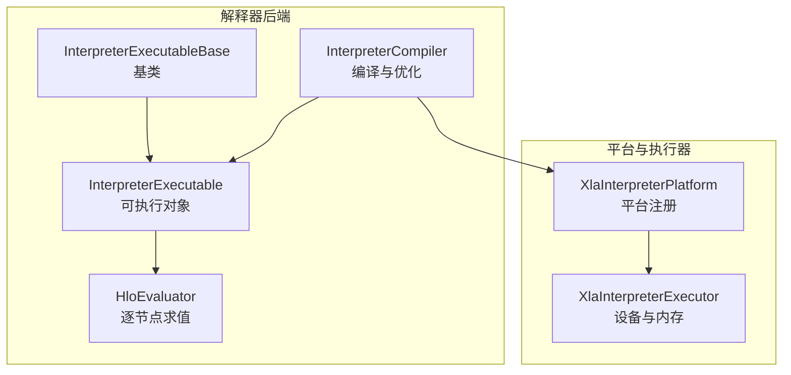
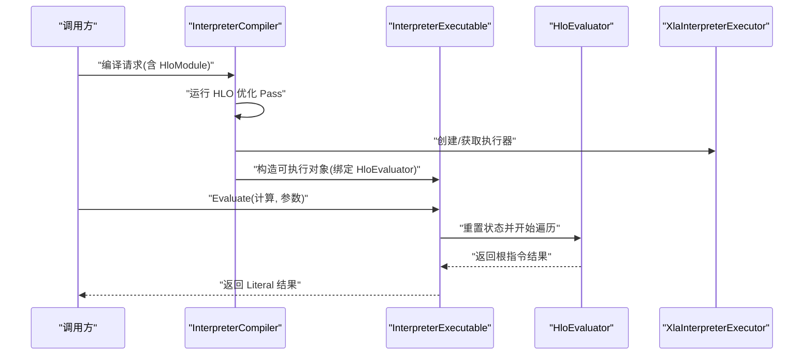
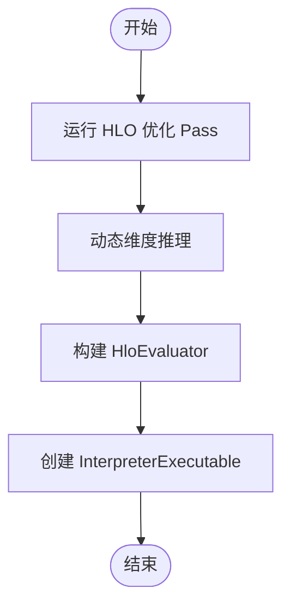
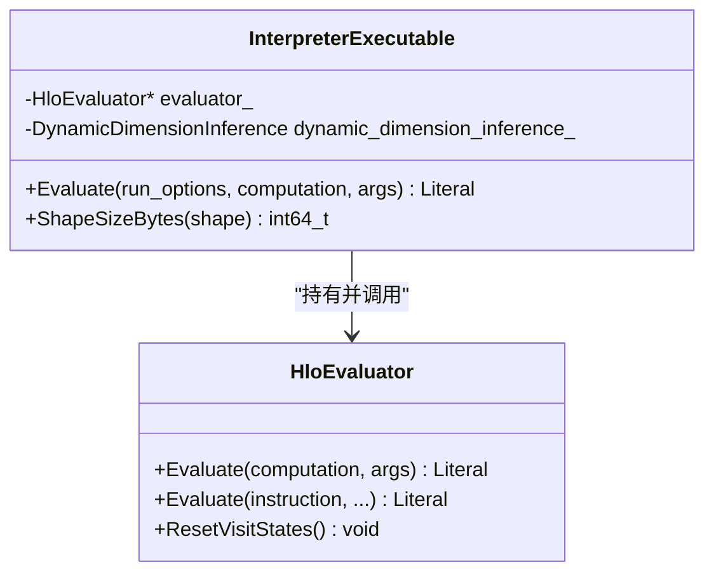
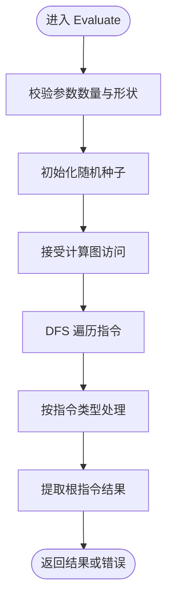
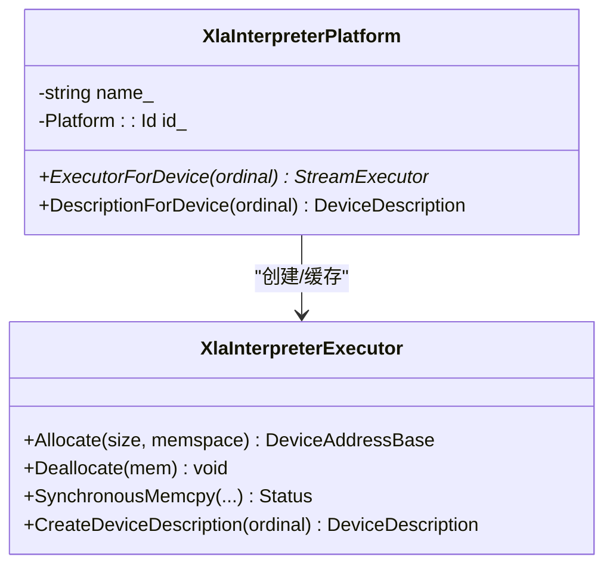
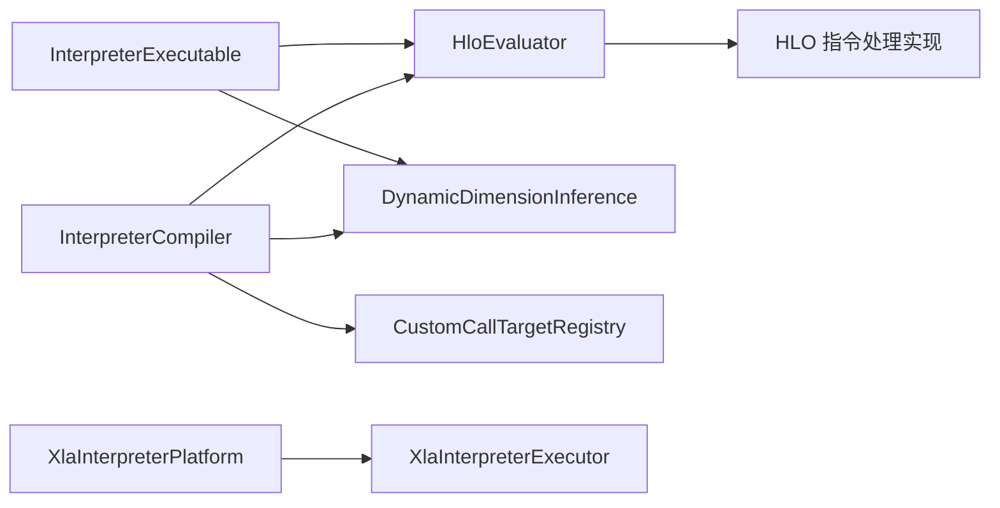
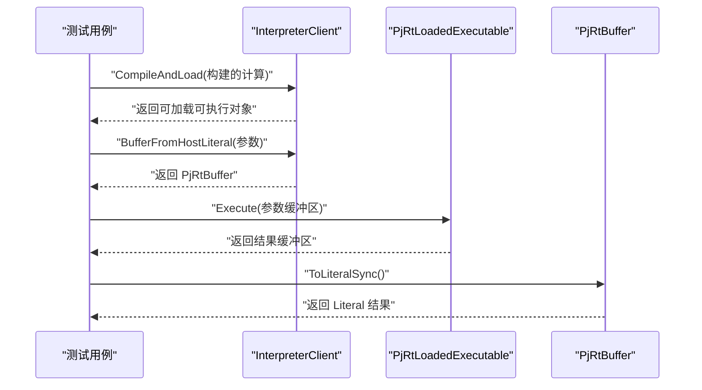

# 解释器后端

<cite>
**本文引用的文件**
- [README.md](file://xla/backends/interpreter/README.md)
- [compiler.cc](file://xla/backends/interpreter/compiler.cc)
- [executable.cc](file://xla/backends/interpreter/executable.cc)
- [executor.cc](file://xla/backends/interpreter/executor.cc)
- [platform.cc](file://xla/backends/interpreter/platform.cc)
- [hlo_evaluator.cc](file://xla/hlo/evaluator/hlo_evaluator.cc)
- [interpreter_client_test.cc](file://xla/pjrt/interpreter/interpreter_client_test.cc)
</cite>

## 目录
1. [简介](#简介)
2. [项目结构](#项目结构)
3. [核心组件](#核心组件)
4. [架构总览](#架构总览)
5. [详细组件分析](#详细组件分析)
6. [依赖关系分析](#依赖关系分析)
7. [性能考量](#性能考量)
8. [故障排除指南](#故障排除指南)
9. [结论](#结论)
10. [附录](#附录)

## 简介
本文件系统性阐述 XLA 解释器后端的设计与实现，重点覆盖以下方面：
- HLO 指令逐条解释执行的流程与机制
- 调试支持、符号执行与验证能力
- 在测试、调试与教学中的应用场景
- 性能特征、限制与适用场景
- 使用示例与常见问题排查方法

解释器后端以 HLO 图为输入，通过 HloEvaluator 对图进行深度优先遍历并逐节点求值，无需进一步下推到 LLVM IR 或其他目标后端，从而具备良好的可解释性与可验证性。

## 项目结构
解释器后端位于 xla/backends/interpreter 目录，关键文件如下：
- 编译器：负责对 HloModule 进行优化与生成可执行对象
- 可执行对象：封装 HloEvaluator 并对外提供 Evaluate 接口
- 执行器与平台：提供设备描述与内存分配等底层支撑
- HloEvaluator：解释执行 HLO 图的核心引擎

图表来源
- [compiler.cc](file://xla/backends/interpreter/compiler.cc#L111-L146)
- [executable.cc](file://xla/backends/interpreter/executable.cc#L39-L59)
- [platform.cc](file://xla/backends/interpreter/platform.cc#L36-L77)
- [executor.cc](file://xla/backends/interpreter/executor.cc#L40-L72)

章节来源
- [README.md](file://xla/backends/interpreter/README.md#L1-L20)
- [compiler.cc](file://xla/backends/interpreter/compiler.cc#L90-L146)
- [executable.cc](file://xla/backends/interpreter/executable.cc#L39-L66)
- [platform.cc](file://xla/backends/interpreter/platform.cc#L36-L77)
- [executor.cc](file://xla/backends/interpreter/executor.cc#L40-L72)

## 核心组件
- InterpreterCompiler：对 HloModule 运行一系列 HLO 优化 Pass，并基于优化后的模块创建 InterpreterExecutable；同时将自身注册到全局编译器工厂与计算放置器中。
- InterpreterExecutable：持有 HloEvaluator 与动态维度推理结果，提供 Evaluate 接口以执行指定计算并返回结果 Literal。
- HloEvaluator：对 HLO 计算图进行深度优先遍历，按节点类型调用相应处理函数，支持参数、常量、形状变换、算子运算、循环与条件等。
- XlaInterpreterPlatform/XlaInterpreterExecutor：提供解释器平台与执行器，用于设备描述与主机内存分配/拷贝。

章节来源
- [README.md](file://xla/backends/interpreter/README.md#L8-L20)
- [compiler.cc](file://xla/backends/interpreter/compiler.cc#L111-L146)
- [executable.cc](file://xla/backends/interpreter/executable.cc#L39-L66)
- [hlo_evaluator.cc](file://xla/hlo/evaluator/hlo_evaluator.cc#L957-L1014)
- [platform.cc](file://xla/backends/interpreter/platform.cc#L36-L77)
- [executor.cc](file://xla/backends/interpreter/executor.cc#L40-L72)

## 架构总览
解释器后端的运行时控制流如下：

图表来源
- [compiler.cc](file://xla/backends/interpreter/compiler.cc#L111-L146)
- [executable.cc](file://xla/backends/interpreter/executable.cc#L52-L59)
- [hlo_evaluator.cc](file://xla/hlo/evaluator/hlo_evaluator.cc#L957-L1014)
- [executor.cc](file://xla/backends/interpreter/executor.cc#L61-L72)

## 详细组件分析

### 组件A：编译与优化（InterpreterCompiler）
- 作用：对 HloModule 应用优化 Pass（如 TopK 分解、动态索引拆分、Cholesky/Qr/Eigh/TriangularSolve 展开、BatchNorm 展开、布局分配），随后构建 HloEvaluator 并生成 InterpreterExecutable。
- 关键点：
  - 自定义的 HandleEvaluatorCustomCall 将自定义调用路由至全局 CPU 后端注册表，保持与 CPU 后端一致的 ABI。
  - 动态维度推理在编译阶段完成，供执行期查询动态维度。
  - 注册编译器工厂与计算放置器，使解释器成为可用后端。

图表来源
- [compiler.cc](file://xla/backends/interpreter/compiler.cc#L90-L146)

章节来源
- [compiler.cc](file://xla/backends/interpreter/compiler.cc#L90-L146)

### 组件B：可执行对象（InterpreterExecutable）
- 作用：封装 HloEvaluator 与动态维度推理，对外提供 Evaluate 接口；内部通过互斥锁保证线程安全。
- 关键点：
  - Evaluate 前重置访问状态，确保每次执行从干净状态开始。
  - 提供 ShapeSizeBytes 以支持成本分析与内存估算。

图表来源
- [executable.cc](file://xla/backends/interpreter/executable.cc#L39-L66)
- [hlo_evaluator.cc](file://xla/hlo/evaluator/hlo_evaluator.cc#L957-L1014)

章节来源
- [executable.cc](file://xla/backends/interpreter/executable.cc#L39-L66)

### 组件C：逐条解释执行（HloEvaluator）
- 作用：对 HLO 计算图进行深度优先遍历，按节点类型调用相应处理逻辑，支持大量算子与控制流模式。
- 关键点：
  - 支持参数、常量、形状变换、比较、算术、聚合、索引与切片、异步复制等。
  - 对 while 循环提供静态解析能力（如可推导迭代次数、步长与边界）。
  - 对动态维度提供查询与设置支持。
  - 对不支持的算子返回“未实现”错误；对依赖 infeed/参数的指令在无法确定值时返回特定错误载荷。

图表来源
- [hlo_evaluator.cc](file://xla/hlo/evaluator/hlo_evaluator.cc#L957-L1014)
- [hlo_evaluator.cc](file://xla/hlo/evaluator/hlo_evaluator.cc#L1270-L1348)

章节来源
- [hlo_evaluator.cc](file://xla/hlo/evaluator/hlo_evaluator.cc#L856-L893)
- [hlo_evaluator.cc](file://xla/hlo/evaluator/hlo_evaluator.cc#L957-L1014)
- [hlo_evaluator.cc](file://xla/hlo/evaluator/hlo_evaluator.cc#L1270-L1348)

### 组件D：平台与执行器（XlaInterpreterPlatform/XlaInterpreterExecutor）
- 作用：提供解释器平台与执行器，负责设备描述与主机内存分配/同步拷贝。
- 关键点：
  - 设备描述包含位宽、名称、内存大小与时钟频率等信息。
  - 内存分配采用 new/delete 字节数组，拷贝使用 memcpy。

图表来源
- [platform.cc](file://xla/backends/interpreter/platform.cc#L36-L77)
- [executor.cc](file://xla/backends/interpreter/executor.cc#L40-L72)

章节来源
- [platform.cc](file://xla/backends/interpreter/platform.cc#L36-L77)
- [executor.cc](file://xla/backends/interpreter/executor.cc#L40-L72)

## 依赖关系分析
- InterpreterCompiler 依赖 HloEvaluator、动态维度推理、HLO Pass 管线与全局自定义调用注册表。
- InterpreterExecutable 依赖 HloEvaluator 与动态维度推理。
- 平台与执行器为解释器提供底层设备与内存抽象。
- HloEvaluator 依赖大量 HLO 指令处理实现与分析工具（如 TuplePointsToAnalysis）。

图表来源
- [compiler.cc](file://xla/backends/interpreter/compiler.cc#L62-L86)
- [executable.cc](file://xla/backends/interpreter/executable.cc#L42-L49)
- [platform.cc](file://xla/backends/interpreter/platform.cc#L58-L77)
- [hlo_evaluator.cc](file://xla/hlo/evaluator/hlo_evaluator.cc#L1190-L1235)

章节来源
- [compiler.cc](file://xla/backends/interpreter/compiler.cc#L62-L86)
- [executable.cc](file://xla/backends/interpreter/executable.cc#L42-L49)
- [platform.cc](file://xla/backends/interpreter/platform.cc#L58-L77)
- [hlo_evaluator.cc](file://xla/hlo/evaluator/hlo_evaluator.cc#L1190-L1235)

## 性能考量
- 优势
  - 可解释性强：逐节点执行，便于调试与验证。
  - 无中间码生成：避免额外编译步骤，启动更快。
- 局限
  - 逐节点解释执行，吞吐不及已编译后端。
  - 不支持某些分布式/异步原语（如 AllReduce、Send/Recv 等），这些指令在解释器中被标记为未实现。
  - 对复杂算子（尤其是低级硬件特性）缺乏优化，数值稳定性与精度需结合具体实现评估。
- 适用场景
  - 教学演示与算法验证
  - 小规模/单次执行的快速原型
  - 调试与回归测试（与 CPU/GPU 后端结果交叉比对）

## 故障排除指南
- “未能评估指令，因为其操作数未知或未确定”
  - 触发原因：在未启用部分求值的情况下遇到参数/infeed，或存在动态依赖。
  - 处理建议：确认输入参数完整、形状匹配；必要时启用部分求值或提供静态可解析的依赖。
- “未实现的 HLO 操作码”
  - 触发原因：当前解释器不支持该指令（如分布式通信、特定异步原语）。
  - 处理建议：改用 CPU/GPU 后端；或在上游将该指令展开为解释器支持的组合。
- “动态维度推理未设置”
  - 触发原因：执行 get_dimension_size/set_dimension_size 时未提供动态维度推理。
  - 处理建议：在编译阶段启用动态维度推理，并在执行前正确配置。
- “形状不匹配/参数数量不一致”
  - 触发原因：传入参数与计算签名不一致。
  - 处理建议：核对参数数量、形状与布局（忽略 minor-to-major 的布局差异时需注意）。

章节来源
- [hlo_evaluator.cc](file://xla/hlo/evaluator/hlo_evaluator.cc#L1434-L1443)
- [hlo_evaluator.cc](file://xla/hlo/evaluator/hlo_evaluator.cc#L1467-L1476)
- [hlo_evaluator.cc](file://xla/hlo/evaluator/hlo_evaluator.cc#L1396-L1414)
- [hlo_evaluator.cc](file://xla/hlo/evaluator/hlo_evaluator.cc#L964-L983)

## 结论
解释器后端以 HloEvaluator 为核心，提供对 HLO 图的逐节点解释执行，具备良好的可解释性与可验证性，适合教学、调试与小规模验证。对于大规模或高性能场景，应考虑 CPU/GPU 等已编译后端。通过合理的 Pass 优化与动态维度支持，解释器后端在测试与教学中具有明确价值。

## 附录

### 使用示例（基于测试）
- 使用解释器 PJRT 客户端编译并执行一个简单加法计算，验证两次执行结果正确性。

图表来源
- [interpreter_client_test.cc](file://xla/pjrt/interpreter/interpreter_client_test.cc#L40-L107)

章节来源
- [interpreter_client_test.cc](file://xla/pjrt/interpreter/interpreter_client_test.cc#L40-L107)