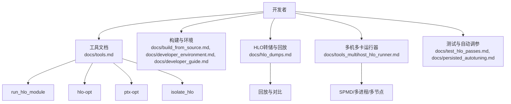
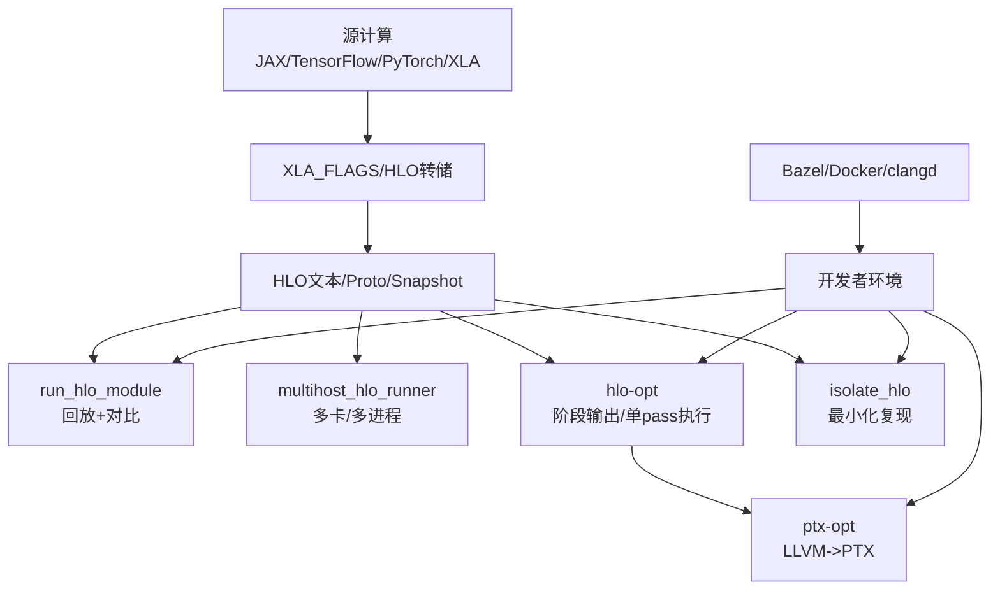
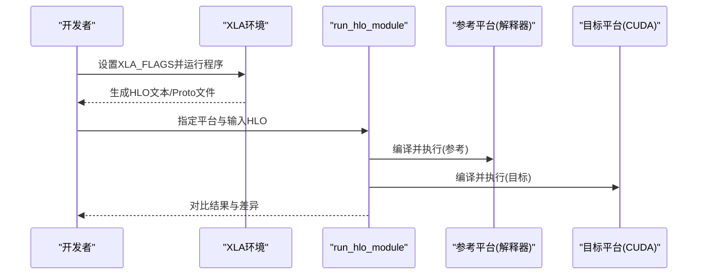
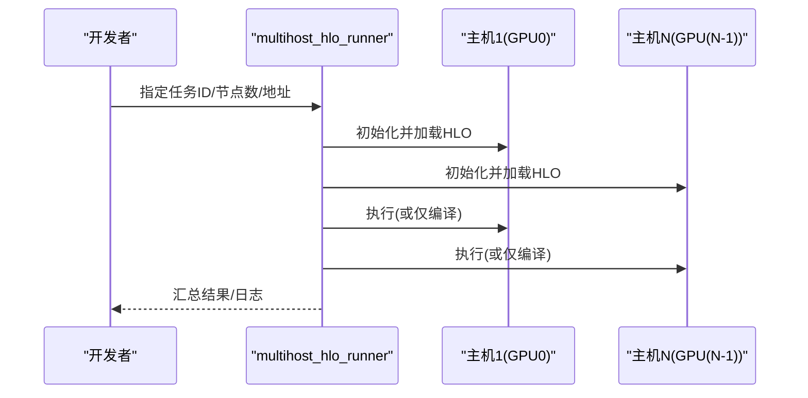
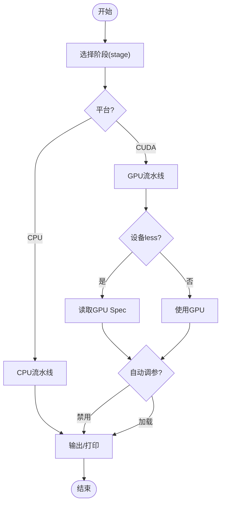
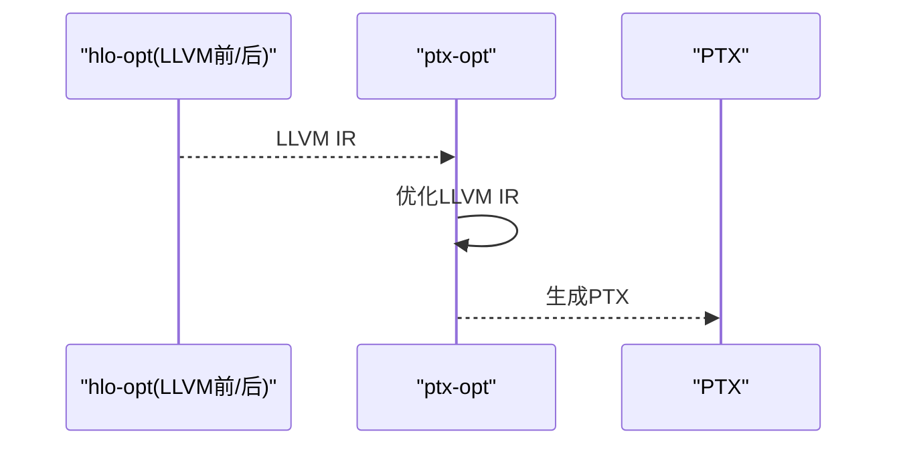
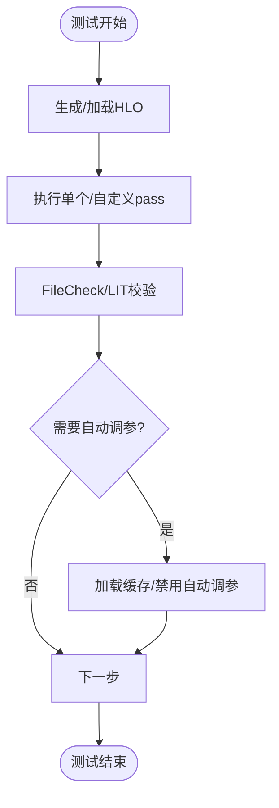
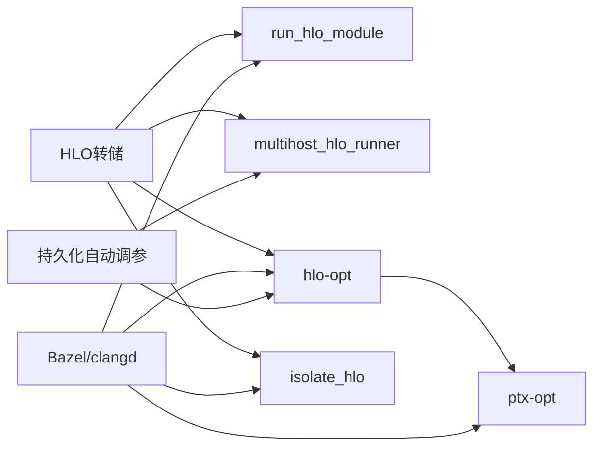

# 开发工具

<cite>
**本文引用的文件**
- [docs/tools.md](file://docs/tools.md)
- [docs/build_from_source.md](file://docs/build_from_source.md)
- [docs/developer_environment.md](file://docs/developer_environment.md)
- [docs/developer_guide.md](file://docs/developer_guide.md)
- [docs/hlo_dumps.md](file://docs/hlo_dumps.md)
- [docs/tools_multihost_hlo_runner.md](file://docs/tools_multihost_hlo_runner.md)
- [docs/test_hlo_passes.md](file://docs/test_hlo_passes.md)
- [docs/persisted_autotuning.md](file://docs/persisted_autotuning.md)
</cite>

## 目录
1. [简介](#简介)
2. [项目结构](#项目结构)
3. [核心组件](#核心组件)
4. [架构总览](#架构总览)
5. [详细组件分析](#详细组件分析)
6. [依赖关系分析](#依赖关系分析)
7. [性能考量](#性能考量)
8. [故障排除指南](#故障排除指南)
9. [结论](#结论)
10. [附录](#附录)

## 简介
本文件面向XLA开发者与贡献者，系统梳理XLA开发与调试工具链：HLO查看与回放（run_hlo_module、multihost_hlo_runner）、HLO优化与格式转换（hlo-opt、ptx-opt）、孤立问题指令（isolate_hlo）、构建与环境（Bazel、Docker、clangd）、测试与覆盖率（FileCheck/LIT、HLO pass单元测试）、以及GPU自动调参缓存（持久化自动调参）。文档提供安装、配置、使用步骤与实践示例，并给出性能调优与CI流程建议。

## 项目结构
XLA的工具与文档主要分布在以下位置：
- 工具与命令行：位于docs/tools.md中描述的run_hlo_module、hlo-opt、ptx-opt、isolate_hlo等工具
- 多机多卡运行器：docs/tools_multihost_hlo_runner.md
- 构建与环境：docs/build_from_source.md、docs/developer_environment.md、docs/developer_guide.md
- HLO转储与回放：docs/hlo_dumps.md
- 测试与自动调参：docs/test_hlo_passes.md、docs/persisted_autotuning.md

**图表来源**
- [docs/tools.md](file://docs/tools.md#L22-L334)
- [docs/build_from_source.md](file://docs/build_from_source.md#L1-L184)
- [docs/developer_environment.md](file://docs/developer_environment.md#L1-L71)
- [docs/developer_guide.md](file://docs/developer_guide.md#L1-L133)
- [docs/hlo_dumps.md](file://docs/hlo_dumps.md#L1-L261)
- [docs/tools_multihost_hlo_runner.md](file://docs/tools_multihost_hlo_runner.md#L1-L153)
- [docs/test_hlo_passes.md](file://docs/test_hlo_passes.md#L1-L88)
- [docs/persisted_autotuning.md](file://docs/persisted_autotuning.md#L1-L109)

**章节来源**
- [docs/tools.md](file://docs/tools.md#L1-L334)
- [docs/build_from_source.md](file://docs/build_from_source.md#L1-L184)
- [docs/developer_environment.md](file://docs/developer_environment.md#L1-L71)
- [docs/developer_guide.md](file://docs/developer_guide.md#L1-L133)
- [docs/hlo_dumps.md](file://docs/hlo_dumps.md#L1-L261)
- [docs/tools_multihost_hlo_runner.md](file://docs/tools_multihost_hlo_runner.md#L1-L153)
- [docs/test_hlo_passes.md](file://docs/test_hlo_passes.md#L1-L88)
- [docs/persisted_autotuning.md](file://docs/persisted_autotuning.md#L1-L109)

## 核心组件
- HLO查看与回放
  - run_hlo_module：对预优化HLO模块进行编译、执行与参考解释器对比
  - multihost_hlo_runner：支持SPMD与跨主机通信的多设备回放
- HLO优化与转换
  - hlo-opt：在不同阶段（HLO、LLVM、PTX、TritonIR）输出或执行单个/自定义优化流水线
  - ptx-opt：对LLVM IR进一步优化并生成PTX
  - isolate_hlo：提取单条指令及其上下文，生成最小可复现模块
- 构建与环境
  - Bazel构建、configure.py配置、Docker容器、clangd LSP
- 测试与自动调参
  - FileCheck/LIT与hlo-opt结合的HLO pass单元测试
  - 持久化自动调参缓存（GPU）

**章节来源**
- [docs/tools.md](file://docs/tools.md#L22-L334)
- [docs/hlo_dumps.md](file://docs/hlo_dumps.md#L1-L261)
- [docs/test_hlo_passes.md](file://docs/test_hlo_passes.md#L1-L88)
- [docs/persisted_autotuning.md](file://docs/persisted_autotuning.md#L1-L109)

## 架构总览
下图展示了从“源计算（如JAX/TensorFlow）”到“HLO转储/回放/优化”的典型开发调试路径，以及工具之间的协作关系。

**图表来源**
- [docs/hlo_dumps.md](file://docs/hlo_dumps.md#L18-L261)
- [docs/tools.md](file://docs/tools.md#L22-L334)
- [docs/build_from_source.md](file://docs/build_from_source.md#L1-L184)
- [docs/developer_environment.md](file://docs/developer_environment.md#L1-L71)

## 详细组件分析

### HLO查看与回放：run_hlo_module
- 功能要点
  - 针对预优化HLO模块进行编译与执行
  - 默认与参考解释器平台对比，便于定位行为差异
  - 支持批量处理目录中的多个HLO模块
- 使用场景
  - 快速验证HLO变换正确性
  - 在CPU/GPU上对比执行结果
- 常用参数
  - 平台选择（如CUDA/Interpreter）
  - 参考平台（用于对比）
  - 输出与日志控制
- 示例流程
  - 设置XLA_FLAGS导出HLO
  - 使用run_hlo_module对目标HLO进行回放与对比

**图表来源**
- [docs/tools.md](file://docs/tools.md#L22-L44)
- [docs/hlo_dumps.md](file://docs/hlo_dumps.md#L240-L261)

**章节来源**
- [docs/tools.md](file://docs/tools.md#L22-L44)
- [docs/hlo_dumps.md](file://docs/hlo_dumps.md#L240-L261)

### 多机多卡运行器：multihost_hlo_runner
- 功能要点
  - 支持SPMD与跨主机通信
  - 单进程/多进程、单节点/多节点模式
  - 可仅编译不运行（配合持久化自动调参）
- 使用场景
  - 大模型训练/推理的分片HLO回放
  - 多GPU/MPI/SLURM环境下的快速验证
- 常用参数
  - 任务ID、节点数、地址
  - 运行模式（是否执行）
  - HLO参数初始化模式（如未初始化数据）

**图表来源**
- [docs/tools_multihost_hlo_runner.md](file://docs/tools_multihost_hlo_runner.md#L1-L153)

**章节来源**
- [docs/tools_multihost_hlo_runner.md](file://docs/tools_multihost_hlo_runner.md#L1-L153)

### HLO优化与转换：hlo-opt
- 功能要点
  - 多阶段输出：HLO、LLVM、PTX、TritonIR等
  - 单pass执行与自定义流水线
  - 设备无关/设备less编译（GPU Spec文件）
  - 自动调参：禁用或加载已有结果
- 使用场景
  - 定位优化失败点
  - 生成中间IR进行分析
  - 与ptx-opt配合生成PTX
- 常用参数
  - 平台（CPU/GPU等）
  - 阶段（stage）
  - GPU目标配置文件
  - 自动调参开关/缓存文件

**图表来源**
- [docs/tools.md](file://docs/tools.md#L65-L183)

**章节来源**
- [docs/tools.md](file://docs/tools.md#L65-L183)

### LLVM到PTX：ptx-opt
- 功能要点
  - 对LLVM IR执行优化后生成PTX
  - 可导出各阶段LLVM IR以辅助分析
- 使用场景
  - GPU内核生成与调优
  - 与hlo-opt联用定位内核级问题

**图表来源**
- [docs/tools.md](file://docs/tools.md#L295-L308)

**章节来源**
- [docs/tools.md](file://docs/tools.md#L295-L308)

### 孤立问题指令：isolate_hlo
- 功能要点
  - 提取单条指令及其必要上下文，生成更小的HLO模块
  - 极大降低复现难度
- 使用场景
  - 崩溃/异常定位
  - 生成最小可复现用例

**章节来源**
- [docs/tools.md](file://docs/tools.md#L309-L334)

### 构建与环境：Bazel、Docker、clangd
- Bazel构建
  - 使用configure.py配置后，通过Bazel构建目标
  - 支持CPU/GPU后端与Hermetic CUDA规则
- Docker容器
  - 推荐使用ml-build镜像，内置Clang/工具链
  - GPU构建可通过--gpus all访问GPU
- clangd与LSP
  - 通过aquery与脚本生成compile_commands.json
  - 支持编辑器代码导航、补全与错误提示

**章节来源**
- [docs/build_from_source.md](file://docs/build_from_source.md#L1-L184)
- [docs/developer_environment.md](file://docs/developer_environment.md#L1-L71)
- [docs/developer_guide.md](file://docs/developer_guide.md#L1-L133)

### 测试与自动调参
- HLO Pass单元测试
  - FileCheck与CHECK行内联
  - LIT运行器与hlo-opt结合
  - 自动生成CHECK脚本
- 持久化自动调参（GPU）
  - 缓存目录方式与单文件方式
  - 测试中加载/导出缓存
  - 版本与GPU类型一致性要求

**图表来源**
- [docs/test_hlo_passes.md](file://docs/test_hlo_passes.md#L1-L88)
- [docs/persisted_autotuning.md](file://docs/persisted_autotuning.md#L1-L109)

**章节来源**
- [docs/test_hlo_passes.md](file://docs/test_hlo_passes.md#L1-L88)
- [docs/persisted_autotuning.md](file://docs/persisted_autotuning.md#L1-L109)

## 依赖关系分析
- 工具间耦合
  - run_hlo_module依赖HLO转储与参考平台
  - multihost_hlo_runner依赖HLO转储与分布式环境
  - hlo-opt与ptx-opt形成“IR->IR->PTX”的链路
  - isolate_hlo为上游工具提供最小化输入
- 构建与测试耦合
  - Bazel构建产物驱动工具可用性
  - 测试依赖clangd与compile_commands.json提升可维护性
  - 持久化自动调参减少长耗时测试成本

**图表来源**
- [docs/tools.md](file://docs/tools.md#L22-L334)
- [docs/hlo_dumps.md](file://docs/hlo_dumps.md#L1-L261)
- [docs/persisted_autotuning.md](file://docs/persisted_autotuning.md#L1-L109)
- [docs/build_from_source.md](file://docs/build_from_source.md#L1-L184)
- [docs/developer_environment.md](file://docs/developer_environment.md#L1-L71)

**章节来源**
- [docs/tools.md](file://docs/tools.md#L22-L334)
- [docs/hlo_dumps.md](file://docs/hlo_dumps.md#L1-L261)
- [docs/persisted_autotuning.md](file://docs/persisted_autotuning.md#L1-L109)
- [docs/build_from_source.md](file://docs/build_from_source.md#L1-L184)
- [docs/developer_environment.md](file://docs/developer_environment.md#L1-L71)

## 性能考量
- 使用hlo-opt对单个pass进行细粒度性能测量，快速发现回归
- 利用持久化自动调参缓存加速GPU内核调优
- 在设备less模式下指定GPU Spec与自动调参策略，避免真实GPU占用
- 多机多卡回放时，合理设置参数初始化模式与运行模式，平衡内存与时间

**章节来源**
- [docs/tools.md](file://docs/tools.md#L143-L183)
- [docs/persisted_autotuning.md](file://docs/persisted_autotuning.md#L1-L109)

## 故障排除指南
- run_hlo_module
  - 平台不匹配或缺少参考平台导致对比失败
  - 输入HLO格式不正确或缺失必要上下文
- multihost_hlo_runner
  - GPU数量不足或CUDA可见设备配置错误
  - 动态模式与NCCL配置不当引发崩溃
- hlo-opt/ptx-opt
  - 设备less模式下未禁用自动调参或未加载缓存
  - 阶段选择与平台不一致
- isolate_hlo
  - 提取范围过大/过小导致无法复现
- 构建与环境
  - Docker未挂载工作区或未映射GPU
  - clangd未生成compile_commands.json或编辑器未启用

**章节来源**
- [docs/tools.md](file://docs/tools.md#L22-L334)
- [docs/tools_multihost_hlo_runner.md](file://docs/tools_multihost_hlo_runner.md#L36-L44)
- [docs/hlo_dumps.md](file://docs/hlo_dumps.md#L240-L261)
- [docs/build_from_source.md](file://docs/build_from_source.md#L1-L184)
- [docs/developer_environment.md](file://docs/developer_environment.md#L1-L71)

## 结论
XLA提供了完善的开发与调试工具链：从HLO转储、回放到多平台优化与可视化，再到多机多卡运行与持久化自动调参，覆盖了从问题定位到性能调优的全流程。结合Bazel/Docker/clangd等基础设施，开发者可以高效地迭代与验证HLO变换与后端实现。

## 附录
- 快速清单
  - 使用XLA_FLAGS导出HLO
  - 用run_hlo_module进行回放与对比
  - 用hlo-opt定位单个pass问题
  - 用ptx-opt生成PTX并分析内核
  - 用isolate_hlo生成最小复现
  - 用multihost_hlo_runner验证分片与多进程
  - 启用持久化自动调参加速GPU内核调优
  - 使用clangd与compile_commands.json提升开发体验